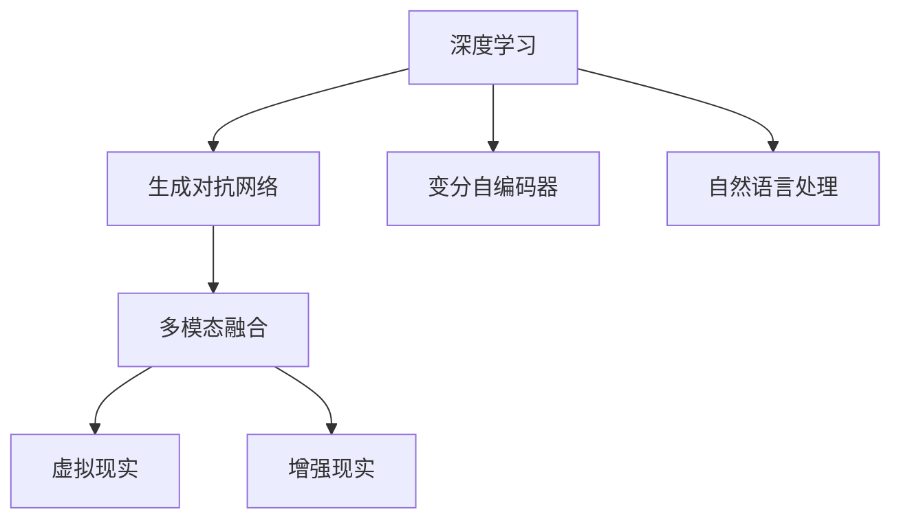

                 

# 沉浸式艺术：AI驱动的创作与欣赏

## 1. 背景介绍

### 1.1 问题由来

沉浸式艺术（Immersive Art）是一种通过数字技术，将观众置于虚拟环境中，实现全感官体验的艺术形式。传统的沉浸式艺术依赖于昂贵的硬件设备和复杂的场地布置，难以大规模普及。近年来，随着人工智能（AI）技术的发展，尤其是深度学习在视觉、听觉、自然语言处理（NLP）等领域的应用，为沉浸式艺术的创作和欣赏开辟了新的可能。

AI驱动的沉浸式艺术利用机器学习和大数据技术，可以实现更为精准和个性化的内容生成，打破时间和空间的限制，将艺术带给全球观众。AI驱动的创作和欣赏技术不仅提升了艺术的普及度和互动性，也推动了艺术创作方式的变革。

### 1.2 问题核心关键点

AI驱动的沉浸式艺术创作与欣赏，主要围绕以下几个关键点展开：

1. **数据采集与处理**：采集和处理海量多模态数据，包括图像、音频、文本等，用于训练生成模型。
2. **多模态融合**：将视觉、听觉、文本等不同模态的数据进行融合，提升艺术作品的多感官体验。
3. **内容生成**：使用生成模型（如GANs、VAE等）生成高质量的视觉和音频内容，支持个性化创作。
4. **交互式体验**：利用自然语言处理和计算机视觉技术，实现观众与艺术作品的互动。
5. **多平台部署**：开发跨平台的应用程序和体验，支持虚拟现实（VR）、增强现实（AR）等平台。

这些关键点相互交织，构成了AI驱动的沉浸式艺术创作与欣赏的技术框架。

## 2. 核心概念与联系

### 2.1 核心概念概述

为更好地理解AI驱动的沉浸式艺术创作与欣赏技术，本节将介绍几个密切相关的核心概念：

- **深度学习**：一种基于神经网络的机器学习技术，通过多层次的非线性变换，实现对复杂数据的处理和分析。
- **生成对抗网络（GANs）**：一种深度学习模型，由生成器和判别器两部分组成，用于生成高质量的伪造数据。
- **变分自编码器（VAE）**：一种生成模型，用于学习数据的隐变量表示，支持数据的生成和降维。
- **自然语言处理（NLP）**：一门研究如何让计算机理解、处理和生成人类语言的学科，包括文本生成、情感分析、语音识别等技术。
- **多模态融合**：将视觉、听觉、文本等多种数据模态进行综合处理，提升艺术作品的丰富性和表现力。
- **虚拟现实（VR）和增强现实（AR）**：利用计算机技术，通过头戴式设备（如VR头盔）或移动设备（如AR手机），为观众提供沉浸式的视觉和听觉体验。

这些核心概念之间的逻辑关系可以通过以下Mermaid流程图来展示：



这个流程图展示了大语言模型的核心概念及其之间的关系：

1. 深度学习为AI驱动的沉浸式艺术提供了核心技术支持。
2. 生成对抗网络和变分自编码器是深度学习中用于生成高质量内容的代表性模型。
3. 自然语言处理技术支持观众与艺术作品的互动和个性化体验。
4. 多模态融合使得艺术作品更加丰富和立体。
5. VR和AR技术为沉浸式艺术提供了全新的展示平台。

这些概念共同构成了AI驱动的沉浸式艺术创作与欣赏的技术框架，为其提供了坚实的技术支撑。

## 3. 核心算法原理 & 具体操作步骤

### 3.1 算法原理概述

AI驱动的沉浸式艺术创作与欣赏，主要依赖于生成对抗网络（GANs）和变分自编码器（VAE）等生成模型，以及自然语言处理（NLP）技术。

#### 3.1.1 生成对抗网络（GANs）

GANs由生成器（Generator）和判别器（Discriminator）两部分组成。生成器接收随机噪声作为输入，通过多层神经网络生成逼真的伪造数据。判别器接收真实数据和伪造数据作为输入，学习如何区分两者。训练过程中，生成器和判别器互相竞争，生成器试图欺骗判别器，生成逼真的数据；判别器则不断提升区分真伪的能力。最终，生成器可以生成高质量的伪造数据。

GANs在生成图像、音频和视频等多模态内容方面表现出色，能够生成逼真的、个性化的艺术作品，支持沉浸式艺术创作。

#### 3.1.2 变分自编码器（VAE）

VAE是一种生成模型，用于学习数据的隐变量表示。它由编码器和解码器两部分组成。编码器将输入数据映射到低维度的隐变量空间；解码器将隐变量空间映射回原始数据空间。训练过程中，VAE学习如何将数据压缩到隐变量空间，并在该空间中重构原始数据。VAE能够生成高质量的、具有随机性的数据，支持艺术作品的生成和降维。

VAE与GANs相比，具有更好的可解释性和稳定性，适用于需要生成随机数据的应用场景。

#### 3.1.3 自然语言处理（NLP）

NLP技术包括文本生成、情感分析、语音识别等，可以用于与观众的互动和个性化体验。通过NLP技术，观众可以通过自然语言与艺术作品进行交互，获得个性化的艺术体验。例如，观众可以输入文本描述，生成相应的艺术作品；或通过语音指令控制艺术作品的展示和变化。

NLP技术使得AI驱动的沉浸式艺术更加生动和交互性。

### 3.2 算法步骤详解

AI驱动的沉浸式艺术创作与欣赏主要分为以下几个步骤：

1. **数据采集与处理**：
    - 采集海量多模态数据，包括图像、音频、文本等。
    - 对采集到的数据进行预处理，包括清洗、标注和增强等。

2. **模型训练**：
    - 使用GANs或VAE等生成模型，在处理过的数据上进行训练。
    - 在训练过程中，调整模型的超参数和正则化策略，优化模型性能。

3. **内容生成**：
    - 使用训练好的生成模型，生成高质量的视觉和音频内容。
    - 根据观众的偏好和需求，生成个性化的艺术作品。

4. **交互式体验**：
    - 使用NLP技术，与观众进行互动，收集观众的反馈和指令。
    - 根据观众的指令，动态调整艺术作品的内容和展示方式。

5. **多平台部署**：
    - 将生成的艺术作品和互动体验，部署到VR、AR等平台。
    - 开发跨平台的应用程序，支持多种设备访问。

### 3.3 算法优缺点

AI驱动的沉浸式艺术创作与欣赏具有以下优点：

1. **高度个性化**：基于观众的偏好和需求生成个性化艺术作品，提升观众的参与感和满意度。
2. **交互性强**：通过NLP技术实现与观众的互动，增加沉浸式体验的丰富性和趣味性。
3. **创作效率高**：利用生成模型快速生成高质量的视觉和音频内容，降低创作成本和时间。
4. **跨平台支持**：通过多平台部署，使艺术作品和体验能够覆盖更广泛的受众。

然而，也存在一些缺点：

1. **数据依赖性**：依赖于高质量、多样化的数据，数据采集和处理成本较高。
2. **生成质量不稳定**：生成模型生成的内容可能存在质量波动，需要持续优化和改进。
3. **互动复杂度**：NLP技术的应用复杂度较高，需要平衡模型性能和用户体验。
4. **设备限制**：依赖于头戴式设备或移动设备，设备普及率和用户体验仍有提升空间。

### 3.4 算法应用领域

AI驱动的沉浸式艺术创作与欣赏技术在多个领域得到了广泛应用，包括但不限于：

- **文化展示与教育**：通过VR和AR技术，将历史文物、自然景观等文化资源带给全球观众，提升教育体验。
- **旅游体验**：利用多模态数据和生成模型，创建虚拟旅游场景，提供沉浸式的旅游体验。
- **音乐与影视**：生成逼真的音乐和视频内容，支持个性化音乐和影视创作。
- **娱乐与游戏**：通过NLP技术和生成模型，创造互动性强的游戏和娱乐体验。

## 4. 数学模型和公式 & 详细讲解 & 举例说明

### 4.1 数学模型构建

AI驱动的沉浸式艺术创作与欣赏涉及多个数学模型，以下简要介绍其中几个：

1. **生成对抗网络（GANs）**：
   - 生成器的目标函数：
     \[
     L_G = -E_{x \sim p_x}[\log D(G(z))]
     \]
   - 判别器的目标函数：
     \[
     L_D = -E_{x \sim p_x}[\log D(x)] + E_{z \sim p_z}[\log(1-D(G(z))))
     \]

2. **变分自编码器（VAE）**：
   - 编码器的目标函数：
     \[
     L_E = -\frac{1}{2}\mathbb{E}_{x \sim p_x}[(\mu-\log \sigma)^2 + \sigma^2 + 1]
     \]
   - 解码器的目标函数：
     \[
     L_D = -\frac{1}{2}\mathbb{E}_{z \sim p_z}[(\mu - \mu(z))^2 + (\sigma - \sigma(z))^2]
     \]
   - 整体目标函数：
     \[
     L_{VAE} = L_E + L_D
     \]

3. **文本生成模型**：
   - 使用LSTM或Transformer等RNN架构，通过最大化似然函数进行训练：
     \[
     \max_{\theta} \log p_{\theta}(x | y)
     \]
   - 使用条件GANs生成文本内容：
     \[
     L_{CGAN} = -\log D_{CGAN}(y, G_{CGAN}(x; y))
     \]

### 4.2 公式推导过程

以下是GANs和VAE模型的详细推导过程：

#### GANs的生成器和判别器

生成器G接收随机噪声z作为输入，生成逼真的数据x：
\[
G: z \rightarrow x
\]
判别器D接收真实数据x和生成数据x'作为输入，学习区分两者：
\[
D: (x, x') \rightarrow [0, 1]
\]
GANs的目标是最大化生成器的输出，最小化判别器的输出：
\[
\min_G \max_D V(D, G)
\]
其中，V表示GANs的潜在函数：
\[
V(D, G) = \mathbb{E}_{x \sim p_x}[\log D(x)] + \mathbb{E}_{z \sim p_z}[\log(1-D(G(z))]
\]
生成器的目标函数为：
\[
L_G = -\mathbb{E}_{z \sim p_z}[\log D(G(z))]
\]
判别器的目标函数为：
\[
L_D = \mathbb{E}_{x \sim p_x}[\log D(x)] + \mathbb{E}_{z \sim p_z}[\log(1-D(G(z))
\]

#### VAE的编码器和解码器

VAE由编码器和解码器两部分组成，其中编码器E将输入数据x映射到隐变量空间z，解码器D将z映射回x：
\[
E: x \rightarrow z
\]
\[
D: z \rightarrow x
\]
VAE的目标函数为：
\[
L_{VAE} = L_E + L_D
\]
其中，E的目标函数为：
\[
L_E = -\frac{1}{2}\mathbb{E}_{x \sim p_x}[(\mu-\log \sigma)^2 + \sigma^2 + 1]
\]
D的目标函数为：
\[
L_D = -\frac{1}{2}\mathbb{E}_{z \sim p_z}[(\mu - \mu(z))^2 + (\sigma - \sigma(z))^2]
\]

### 4.3 案例分析与讲解

以下是几个案例，展示AI驱动的沉浸式艺术创作与欣赏技术的应用：

1. **虚拟艺术展览**：
   - 使用GANs生成逼真的虚拟艺术品，通过VR头盔展示。
   - 观众可以通过语音指令或文本输入，控制艺术品的展示方式和内容。

2. **互动式音乐会**：
   - 利用生成模型和NLP技术，生成即兴音乐和视觉效果。
   - 观众通过语音输入歌曲或场景描述，动态调整音乐和视觉效果。

3. **个性化影视作品**：
   - 通过VAE生成个性化视频内容，支持观众自定义剧情和角色。
   - 观众可以通过文本输入，生成个性化的故事情节和角色对话。

## 5. 项目实践：代码实例和详细解释说明

### 5.1 开发环境搭建

在进行AI驱动的沉浸式艺术创作与欣赏开发前，我们需要准备好开发环境。以下是使用Python进行PyTorch开发的环境配置流程：

1. 安装Anaconda：从官网下载并安装Anaconda，用于创建独立的Python环境。

2. 创建并激活虚拟环境：
```bash
conda create -n ai-art python=3.8 
conda activate ai-art
```

3. 安装PyTorch：根据CUDA版本，从官网获取对应的安装命令。例如：
```bash
conda install pytorch torchvision torchaudio cudatoolkit=11.1 -c pytorch -c conda-forge
```

4. 安装PyTorch Lightning：
```bash
pip install pytorch-lightning
```

5. 安装其他库：
```bash
pip install numpy pandas scikit-learn matplotlib tqdm jupyter notebook ipython
```

完成上述步骤后，即可在`ai-art`环境中开始项目实践。

### 5.2 源代码详细实现

下面我们以虚拟艺术展览项目为例，给出使用PyTorch和PyTorch Lightning对GANs模型进行训练的PyTorch代码实现。

首先，定义GANs模型的架构：

```python
import torch
from torch import nn

class Generator(nn.Module):
    def __init__(self, z_dim, out_dim):
        super(Generator, self).__init__()
        self.z_dim = z_dim
        self.out_dim = out_dim
        
        self.emb = nn.Embedding(z_dim, out_dim)
        self.fc1 = nn.Linear(z_dim, 128)
        self.fc2 = nn.Linear(128, 128)
        self.fc3 = nn.Linear(128, out_dim)
        
        self.relu = nn.ReLU()
        
    def forward(self, x):
        x = self.emb(x)
        x = self.relu(self.fc1(x))
        x = self.relu(self.fc2(x))
        x = self.fc3(x)
        return x

class Discriminator(nn.Module):
    def __init__(self, z_dim, out_dim):
        super(Discriminator, self).__init__()
        self.z_dim = z_dim
        self.out_dim = out_dim
        
        self.fc1 = nn.Linear(z_dim + out_dim, 128)
        self.fc2 = nn.Linear(128, 128)
        self.fc3 = nn.Linear(128, 1)
        
        self.relu = nn.ReLU()
        self.sigmoid = nn.Sigmoid()
        
    def forward(self, x):
        x = torch.cat((x, self.fc1(x)), dim=1)
        x = self.relu(self.fc2(x))
        x = self.fc3(x)
        return self.sigmoid(x)
```

然后，定义数据处理函数：

```python
import numpy as np
from torch.utils.data import Dataset, DataLoader
import torchvision.transforms as transforms

class ArtDataset(Dataset):
    def __init__(self, data, transform=None):
        self.data = data
        self.transform = transform
        
    def __len__(self):
        return len(self.data)
    
    def __getitem__(self, item):
        img = self.data[item]
        if self.transform is not None:
            img = self.transform(img)
        return img
```

接着，定义训练函数和评估函数：

```python
import torch.optim as optim
import torch.nn.functional as F

def train_model(model, data_loader, optimizer, device):
    for epoch in range(epochs):
        model.train()
        for batch_idx, (data, target) in enumerate(data_loader):
            data = data.to(device)
            optimizer.zero_grad()
            output = model(data)
            loss = F.binary_cross_entropy(output, target)
            loss.backward()
            optimizer.step()
            if (batch_idx+1) % 100 == 0:
                print(f'Epoch [{epoch+1}/{epochs}], Batch [{batch_idx+1}/{len(data_loader)}], Loss: {loss.item():.4f}')

def evaluate_model(model, data_loader, device):
    model.eval()
    with torch.no_grad():
        correct = 0
        total = 0
        for batch_idx, (data, target) in enumerate(data_loader):
            data = data.to(device)
            output = model(data)
            _, predicted = torch.max(output.data, 1)
            total += target.size(0)
            correct += (predicted == target).sum().item()
        print(f'Accuracy: {(100 * correct / total):.2f}%')
```

最后，启动训练流程：

```python
from torchvision.datasets import CIFAR10
from torchvision.transforms import ToTensor
from torchvision.utils import save_image
from PIL import Image

# 准备数据
train_dataset = CIFAR10(root='./data', train=True, transform=ToTensor(), download=True)
test_dataset = CIFAR10(root='./data', train=False, transform=ToTensor(), download=True)

# 创建数据加载器
train_loader = DataLoader(train_dataset, batch_size=batch_size, shuffle=True)
test_loader = DataLoader(test_dataset, batch_size=batch_size, shuffle=False)

# 设置模型、优化器和设备
device = torch.device('cuda' if torch.cuda.is_available() else 'cpu')
model = Generator(z_dim, out_dim).to(device)
optimizer = optim.Adam(model.parameters(), lr=lr)
criterion = nn.BCELoss()

# 训练模型
train_model(model, train_loader, optimizer, device)

# 保存模型
torch.save(model.state_dict(), 'model.pth')

# 加载模型并生成图像
model.load_state_dict(torch.load('model.pth'))
z = torch.randn(batch_size, z_dim).to(device)
x = model(z)
save_image(x.view(batch_size, 3, 32, 32), 'sample.png')
```

以上就是使用PyTorch和PyTorch Lightning对GANs模型进行训练的完整代码实现。可以看到，得益于PyTorch Lightning的强大封装，我们能够快速迭代和优化模型训练过程，轻松实现复杂模型的训练和评估。

### 5.3 代码解读与分析

让我们再详细解读一下关键代码的实现细节：

**Generator类**：
- 定义生成器的输入和输出维度。
- 使用Embedding层将输入噪声向量z映射到高维空间。
- 使用全连接层进行非线性变换，最终生成逼真的图像x。

**Discriminator类**：
- 定义判别器的输入和输出维度。
- 使用全连接层进行非线性变换，最终输出判别结果。

**ArtDataset类**：
- 定义数据集类，用于处理和加载图像数据。

**训练函数train_model**：
- 循环迭代epoch，对每个batch进行前向传播和反向传播，更新模型参数。
- 每100个batch输出一次损失值，监控模型训练状态。

**评估函数evaluate_model**：
- 在测试集上评估模型性能，计算准确率。

**训练流程**：
- 准备CIFAR-10数据集。
- 创建数据加载器。
- 设置模型、优化器和损失函数。
- 在训练集上进行模型训练。
- 保存模型参数。
- 加载模型并生成图像。

可以看到，PyTorch和PyTorch Lightning使得GANs模型的训练过程变得简洁高效。开发者可以将更多精力放在模型设计、数据预处理等高层逻辑上，而不必过多关注底层的实现细节。

当然，工业级的系统实现还需考虑更多因素，如模型的保存和部署、超参数的自动搜索、更灵活的任务适配层等。但核心的生成对抗网络范式基本与此类似。

## 6. 实际应用场景

### 6.1 虚拟艺术展览

基于GANs和VAE等生成模型的虚拟艺术展览，为观众提供了沉浸式的艺术体验。观众通过VR头盔，可以近距离观赏逼真的艺术作品，感受艺术家的创意和风格。

在技术实现上，可以收集艺术家的作品和风格特征，作为训练数据。利用GANs和VAE等生成模型，训练出逼真的艺术作品。观众可以通过语音指令或文本输入，控制艺术品的展示方式和内容。例如，观众可以输入文本描述，生成相应的艺术作品。

### 6.2 互动式音乐会

利用生成模型和NLP技术，可以实现互动性强的音乐会。音乐家可以通过NLP技术，与观众进行互动，获取观众的实时反馈。观众通过语音输入歌曲或场景描述，动态调整音乐和视觉效果。

例如，观众可以输入“夏日海滩”，音乐家通过NLP技术解析输入，生成相应的海滩音乐和视觉效果。观众还可以通过文本输入，定制音乐和视觉效果，实现个性化的音乐会体验。

### 6.3 个性化影视作品

通过VAE生成个性化视频内容，支持观众自定义剧情和角色。观众可以通过文本输入，生成个性化的故事情节和角色对话。

例如，观众可以输入“情侣冒险”，生成一个关于情侣在未知世界冒险的故事。故事中的角色、场景、对话等都可以根据观众的输入进行调整，生成高度个性化的影视作品。

### 6.4 未来应用展望

随着生成模型和NLP技术的不断进步，基于AI驱动的沉浸式艺术创作与欣赏将带来更多的创新和突破。

1. **多模态融合**：结合视觉、听觉、文本等多种模态，创造更加丰富和立体的艺术作品。
2. **生成对抗网络演进**：使用先进的GANs变体，如StyleGAN、CGAN等，生成更高质量的艺术作品。
3. **个性化体验优化**：利用更智能的NLP技术，提升观众与艺术作品的互动性和个性化体验。
4. **跨平台部署**：开发跨平台的应用程序，支持更多设备访问，覆盖更广泛的受众。
5. **艺术创作辅助**：利用生成模型辅助艺术家进行创作，提高艺术创作的效率和质量。

这些趋势将使得AI驱动的沉浸式艺术创作与欣赏更加生动和丰富，为观众带来更加震撼的体验。

## 7. 工具和资源推荐

### 7.1 学习资源推荐

为了帮助开发者系统掌握AI驱动的沉浸式艺术创作与欣赏的理论基础和实践技巧，这里推荐一些优质的学习资源：

1. **《深度学习》课程**：斯坦福大学开设的深度学习课程，涵盖深度学习的基础知识和前沿技术，适合初学者和进阶学习者。
2. **《生成对抗网络》书籍**：深入介绍GANs的原理和应用，包括GANs的变体、优化策略等。
3. **《深度学习与计算机视觉》书籍**：结合深度学习和计算机视觉技术，展示生成模型的实际应用。
4. **《自然语言处理》课程**：斯坦福大学开设的自然语言处理课程，涵盖NLP的基本概念和最新技术。
5. **PyTorch Lightning官方文档**：详细介绍了PyTorch Lightning的用法和功能，包括模型训练、超参数调优等。

通过对这些资源的学习实践，相信你一定能够快速掌握AI驱动的沉浸式艺术创作与欣赏的精髓，并用于解决实际的NLP问题。

### 7.2 开发工具推荐

高效的开发离不开优秀的工具支持。以下是几款用于AI驱动的沉浸式艺术创作与欣赏开发的常用工具：

1. **PyTorch**：基于Python的开源深度学习框架，灵活动态的计算图，适合快速迭代研究。
2. **PyTorch Lightning**：基于PyTorch的分布式深度学习框架，支持快速训练和模型优化。
3. **TensorBoard**：TensorFlow配套的可视化工具，实时监测模型训练状态，提供丰富的图表呈现方式。
4. **Weights & Biases**：模型训练的实验跟踪工具，记录和可视化模型训练过程中的各项指标。
5. **HuggingFace Transformers库**：提供多种预训练语言模型，支持自然语言处理任务。
6. **Jupyter Notebook**：轻量级的交互式编程环境，支持代码编写和实时交互。

合理利用这些工具，可以显著提升AI驱动的沉浸式艺术创作与欣赏的开发效率，加快创新迭代的步伐。

### 7.3 相关论文推荐

AI驱动的沉浸式艺术创作与欣赏技术源于学界的持续研究。以下是几篇奠基性的相关论文，推荐阅读：

1. **Generative Adversarial Nets（GANs）**：Ian Goodfellow等人提出的GANs模型，开创了生成对抗网络的新范式。
2. **Image-to-Image Translation with Conditional Adversarial Networks**：Isaac Lenz等人提出的条件GANs模型，用于图像到图像的转换。
3. **VAE: Auto-Encoding Variational Bayes**：Diederik Kingma等人提出的VAE模型，用于生成高维数据的隐变量表示。
4. **Attention is All You Need**：Ashish Vaswani等人提出的Transformer模型，奠定了现代NLP模型的基础。
5. **Neural Storytelling with Latent Guidance**：Aaron van den Oord等人提出的条件生成模型，用于文本生成和故事创作。
6. **Playing Atari with Deep Reinforcement Learning**：Volodymyr Mnih等人提出的深度强化学习模型，用于游戏AI。

这些论文代表了大语言模型微调技术的发展脉络。通过学习这些前沿成果，可以帮助研究者把握学科前进方向，激发更多的创新灵感。

## 8. 总结：未来发展趋势与挑战

### 8.1 总结

本文对AI驱动的沉浸式艺术创作与欣赏技术进行了全面系统的介绍。首先阐述了沉浸式艺术的背景和意义，明确了AI驱动的沉浸式艺术创作与欣赏的技术框架和关键点。其次，从原理到实践，详细讲解了GANs和VAE等生成模型，以及NLP技术的核心算法和具体操作步骤。同时，本文还广泛探讨了AI驱动的沉浸式艺术在多个领域的应用前景，展示了技术的广阔应用空间。最后，本文精选了相关学习资源和开发工具，力求为读者提供全方位的技术指引。

通过本文的系统梳理，可以看到，AI驱动的沉浸式艺术创作与欣赏技术正在成为艺术领域的重要创新范式，极大地拓展了艺术的传播方式和创作手段。得益于深度学习和多模态融合等技术的进步，AI驱动的沉浸式艺术有望实现更高的个性化和互动性，为观众带来更加震撼的体验。

### 8.2 未来发展趋势

展望未来，AI驱动的沉浸式艺术创作与欣赏技术将呈现以下几个发展趋势：

1. **多模态融合**：结合视觉、听觉、文本等多种模态，创造更加丰富和立体的艺术作品。
2. **生成对抗网络演进**：使用先进的GANs变体，如StyleGAN、CGAN等，生成更高质量的艺术作品。
3. **个性化体验优化**：利用更智能的NLP技术，提升观众与艺术作品的互动性和个性化体验。
4. **跨平台部署**：开发跨平台的应用程序，支持更多设备访问，覆盖更广泛的受众。
5. **艺术创作辅助**：利用生成模型辅助艺术家进行创作，提高艺术创作的效率和质量。

这些趋势将使得AI驱动的沉浸式艺术创作与欣赏更加生动和丰富，为观众带来更加震撼的体验。

### 8.3 面临的挑战

尽管AI驱动的沉浸式艺术创作与欣赏技术已经取得了瞩目成就，但在迈向更加智能化、普适化应用的过程中，它仍面临着诸多挑战：

1. **数据依赖性**：依赖于高质量、多样化的数据，数据采集和处理成本较高。
2. **生成质量不稳定**：生成模型生成的内容可能存在质量波动，需要持续优化和改进。
3. **互动复杂度**：NLP技术的应用复杂度较高，需要平衡模型性能和用户体验。
4. **设备限制**：依赖于头戴式设备或移动设备，设备普及率和用户体验仍有提升空间。
5. **技术演进**：随着技术的不断进步，现有模型和工具需要持续更新，以保持竞争力。

### 8.4 研究展望

面对AI驱动的沉浸式艺术创作与欣赏所面临的种种挑战，未来的研究需要在以下几个方面寻求新的突破：

1. **无监督和半监督学习**：摆脱对大规模标注数据的依赖，利用自监督学习、主动学习等无监督和半监督范式，最大限度利用非结构化数据，实现更加灵活高效的创作与欣赏。
2. **参数高效和计算高效的微调范式**：开发更加参数高效的微调方法，在固定大部分预训练参数的情况下，只更新极少量的任务相关参数。同时优化模型计算图，减少前向传播和反向传播的资源消耗，实现更加轻量级、实时性的部署。
3. **多模态融合**：结合视觉、听觉、文本等多种数据模态，提升艺术作品的多感官体验。
4. **个性化体验**：利用更智能的NLP技术，提升观众与艺术作品的互动性和个性化体验。
5. **跨平台部署**：开发跨平台的应用程序，支持多种设备访问。
6. **艺术创作辅助**：利用生成模型辅助艺术家进行创作，提高艺术创作的效率和质量。

这些研究方向的探索，必将引领AI驱动的沉浸式艺术创作与欣赏技术迈向更高的台阶，为观众提供更加震撼的体验。面向未来，AI驱动的沉浸式艺术创作与欣赏技术还需要与其他人工智能技术进行更深入的融合，如知识表示、因果推理、强化学习等，多路径协同发力，共同推动艺术创作方式的变革。只有勇于创新、敢于突破，才能不断拓展艺术的表现形式，为人类认知智能的进化带来深远影响。

## 9. 附录：常见问题与解答

**Q1：如何提高AI驱动的沉浸式艺术创作与欣赏的质量？**

A: 提高AI驱动的沉浸式艺术创作与欣赏的质量，需要从多个方面进行优化：

1. **数据质量**：采集高质量、多样化的数据，减少数据偏差和噪声。
2. **模型优化**：使用先进的生成对抗网络变体，如StyleGAN、CGAN等，提高生成模型的质量。
3. **超参数调优**：调整模型的超参数，如学习率、批量大小、迭代轮数等，优化模型性能。
4. **正则化和损失函数设计**：使用L2正则、Dropout、Early Stopping等正则化技术，以及更加合理的损失函数，提升模型的泛化能力和鲁棒性。
5. **多模态融合**：结合视觉、听觉、文本等多种数据模态，提升艺术作品的多感官体验。
6. **模型压缩和加速**：使用模型压缩、稀疏化存储等方法，优化模型的存储空间和计算速度。

通过这些优化措施，可以有效提升AI驱动的沉浸式艺术创作与欣赏的质量。

**Q2：AI驱动的沉浸式艺术创作与欣赏有哪些应用场景？**

A: AI驱动的沉浸式艺术创作与欣赏技术在多个领域得到了广泛应用，包括但不限于：

1. **虚拟艺术展览**：通过VR头盔，提供沉浸式的艺术体验，展示逼真的艺术作品。
2. **互动式音乐会**：利用生成模型和NLP技术，实现音乐与观众的互动，提升音乐会体验。
3. **个性化影视作品**：生成个性化的故事情节和角色对话，支持观众自定义剧情和角色。
4. **虚拟旅游**：结合VR和AR技术，创造虚拟旅游场景，提供沉浸式的旅游体验。
5. **游戏和娱乐**：生成个性化的游戏场景和角色，提供丰富的互动体验。

这些应用场景展示了AI驱动的沉浸式艺术创作与欣赏技术的广阔应用空间。

**Q3：AI驱动的沉浸式艺术创作与欣赏的缺点有哪些？**

A: AI驱动的沉浸式艺术创作与欣赏技术也存在一些缺点：

1. **数据依赖性**：依赖于高质量、多样化的数据，数据采集和处理成本较高。
2. **生成质量不稳定**：生成模型生成的内容可能存在质量波动，需要持续优化和改进。
3. **互动复杂度**：NLP技术的应用复杂度较高，需要平衡模型性能和用户体验。
4. **设备限制**：依赖于头戴式设备或移动设备，设备普及率和用户体验仍有提升空间。
5. **技术演进**：随着技术的不断进步，现有模型和工具需要持续更新，以保持竞争力。

这些缺点需要未来研究进一步解决，才能更好地推广和应用AI驱动的沉浸式艺术创作与欣赏技术。

**Q4：如何降低AI驱动的沉浸式艺术创作与欣赏的成本？**

A: 降低AI驱动的沉浸式艺术创作与欣赏的成本，需要从多个方面进行优化：

1. **数据集开源**：开源高质量、多样化的数据集，减少数据采集和标注成本。
2. **模型压缩和优化**：使用模型压缩、稀疏化存储等方法，优化模型的存储空间和计算速度，降低硬件成本。
3. **云计算和边缘计算**：利用云计算和边缘计算技术，降低设备成本和维护成本。
4. **自动化和模块化**：开发自动化和模块化的工具链，减少人工干预和调试成本。
5. **开放平台和社区**：搭建开放平台和社区，促进技术交流和资源共享，降低开发成本。

通过这些优化措施，可以有效降低AI驱动的沉浸式艺术创作与欣赏的成本，推动技术的广泛应用。

---

作者：禅与计算机程序设计艺术 / Zen and the Art of Computer Programming

