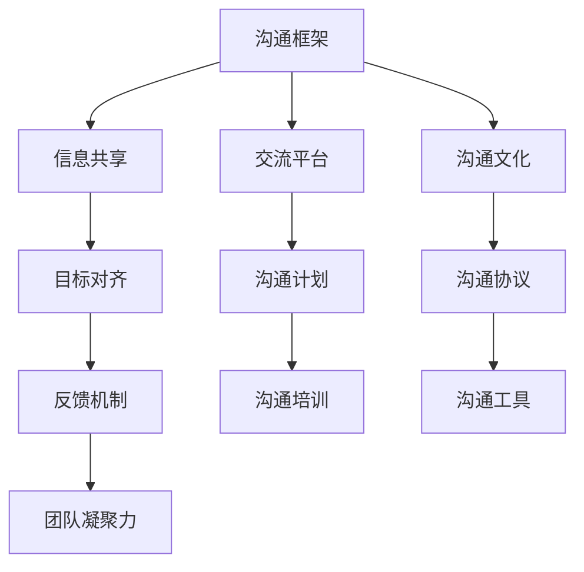

                 

## 1. 背景介绍

在数字化时代，企业之间的竞争在很大程度上取决于团队协作的效率与质量。高效、健康的团队协作不仅能提升企业创新力，还能增强市场响应速度和运营效率。然而，尽管多数企业意识到团队协作的重要性，但在实际执行过程中，仍然面临着诸多挑战。这些挑战不仅包括跨部门信息传递不畅、沟通效率低下，还包括缺乏共同的目标和团队凝聚力等。

## 2. 核心概念与联系

### 2.1 核心概念概述

沟通管理是提升团队协作的关键手段之一。通过有效的沟通管理，团队成员可以理解彼此的想法和需求，实现信息的高效传递和决策的协同合作。核心概念主要包括：

- **沟通框架**：指团队的沟通结构和流程，包括沟通渠道的选择、沟通方式的设计以及沟通频率的安排等。
- **信息共享**：涉及团队成员间的信息交流和知识共享，确保所有成员都能获得及时、准确的信息。
- **目标对齐**：确保团队成员对团队目标和任务的理解一致，避免信息不对称导致的偏差。
- **反馈机制**：建立健全的反馈体系，帮助团队成员及时调整行为和改进工作质量。
- **团队凝聚力**：通过团队建设活动、定期沟通和共同目标的设定，增强团队成员间的信任和归属感。

### 2.2 核心概念原理和架构的 Mermaid 流程图



该图展示了沟通管理的核心流程和组成部分。沟通框架是沟通管理的基础，信息共享和目标对齐确保信息的一致性和团队协作的准确性，反馈机制和团队凝聚力则通过不断调整和强化，促进团队高效运行。

## 3. 核心算法原理 & 具体操作步骤

### 3.1 算法原理概述

沟通管理的核心算法原理主要围绕信息传递的效率和准确性展开。一个有效的沟通管理算法应能实现以下目标：

- **高效的信息传递**：确保信息在团队成员间迅速传递，避免信息滞后和误解。
- **准确的信息理解**：通过明确的沟通渠道和沟通方式，保证信息的准确传达。
- **动态的信息调整**：根据团队成员的反馈和实际情况，动态调整沟通策略，确保信息的及时更新和适应性。

### 3.2 算法步骤详解

#### 3.2.1 制定沟通框架

沟通框架的设计是沟通管理的第一步。需要考虑以下几个关键要素：

1. **沟通渠道**：选择合适的沟通渠道，如会议、电子邮件、即时消息工具等。
2. **沟通方式**：定义沟通的详细方式，包括会议的流程、邮件的标题格式、即时消息的礼仪等。
3. **沟通频率**：确定团队成员之间的沟通频率，如每日、每周或每月等。

#### 3.2.2 实施信息共享

信息共享的实施需要保证信息的及时性和准确性。主要步骤包括：

1. **信息的收集**：确保所有成员都能及时获取所需的信息。
2. **信息的传递**：通过沟通框架中定义的渠道，将信息传递给目标接收者。
3. **信息的确认**：接收者确认信息的正确性和完整性。

#### 3.2.3 目标对齐与反馈机制

目标对齐和反馈机制是团队协作的重要保障。具体步骤包括：

1. **共同目标设定**：团队成员共同参与制定团队目标，确保所有成员对目标的理解一致。
2. **任务分解**：将大目标分解为可执行的小任务，并分配给具体的成员。
3. **定期反馈**：定期收集团队成员的反馈，评估任务进展，并根据反馈调整沟通策略和任务安排。

#### 3.2.4 团队凝聚力的培养

团队凝聚力的培养需要多方面的努力：

1. **团队建设活动**：定期组织团队建设活动，增强成员间的信任和友谊。
2. **定期沟通**：通过团队会议、一对一交流等方式，增加成员间的互动和了解。
3. **共同目标**：设定具有挑战性和吸引力的共同目标，激励团队成员共同努力。

### 3.3 算法优缺点

沟通管理算法的优点包括：

1. **提升效率**：通过明确的信息传递和目标对齐，大大提高团队的执行效率。
2. **增强准确性**：明确的沟通渠道和方式确保信息的准确传达，减少误解和错误。
3. **促进合作**：共同目标和团队凝聚力促进成员间的协同合作，形成强大的团队力量。

缺点包括：

1. **实施复杂**：设计和管理一个有效的沟通框架需要时间和资源投入。
2. **依赖成员**：沟通管理的效果高度依赖团队成员的参与和配合，不易管理。
3. **动态变化**：团队目标和任务的变化需要及时调整沟通策略，增加了管理难度。

### 3.4 算法应用领域

沟通管理算法在各种领域都有广泛的应用，包括但不限于：

1. **项目管理**：确保项目信息的高效传递和任务执行的一致性。
2. **企业战略制定**：通过信息共享和目标对齐，实现企业战略的统一和执行力。
3. **跨部门协作**：打破部门壁垒，促进不同部门间的信息流动和资源共享。
4. **客户关系管理**：通过有效的沟通管理，提升客户满意度和忠诚度。

## 4. 数学模型和公式 & 详细讲解 & 举例说明

### 4.1 数学模型构建

沟通管理算法的数学模型主要围绕信息传递的效率和准确性构建。假设团队中有 $n$ 个成员，每个成员每天需要接收和传递的信息量为 $m$，沟通框架的效率为 $E$，信息传递的准确性为 $A$，则沟通管理的总效率 $M$ 可以表示为：

$$
M = n \times m \times E \times A
$$

### 4.2 公式推导过程

对于上述公式，我们可以通过以下步骤进行推导：

1. 团队成员每天传递的信息量为 $n \times m$。
2. 沟通框架的效率为 $E$，表示沟通渠道和方式的优化程度。
3. 信息传递的准确性为 $A$，表示信息传递的完整性和正确性。
4. 综合以上三部分，得到沟通管理的总效率 $M$。

### 4.3 案例分析与讲解

考虑一个10人的项目团队，每个成员每天需要接收和传递的信息量为1000条，沟通框架的效率为0.9，信息传递的准确性为0.95。则沟通管理的总效率为：

$$
M = 10 \times 1000 \times 0.9 \times 0.95 = 8950
$$

这意味着，通过有效的沟通管理，该团队每天能够传递和接收的信息量为8950条，大大提升团队的沟通效率。

## 5. 项目实践：代码实例和详细解释说明

### 5.1 开发环境搭建

在沟通管理算法的实现中，我们首先需要搭建开发环境。以下是使用Python进行开发的环境配置流程：

1. 安装Anaconda：从官网下载并安装Anaconda，用于创建独立的Python环境。

2. 创建并激活虚拟环境：
```bash
conda create -n comms-env python=3.8 
conda activate comms-env
```

3. 安装必要的Python库：
```bash
pip install matplotlib numpy pandas
```

4. 安装Microsoft TeamsSDK：
```bash
pip install msteams
```

完成上述步骤后，即可在`comms-env`环境中进行沟通管理算法的开发。

### 5.2 源代码详细实现

下面我们将通过一个简单的项目来展示如何使用Python实现沟通管理算法。

```python
import time
import random
from matplotlib import pyplot as plt
import numpy as np

class Communication:
    def __init__(self, members, info_per_day, efficiency, accuracy):
        self.members = members
        self.info_per_day = info_per_day
        self.efficiency = efficiency
        self.accuracy = accuracy
        self.total_info = self.members * self.info_per_day
        self.effective_info = self.total_info * self.efficiency * self.accuracy

    def calculate_efficiency(self):
        return self.effective_info / self.members / self.info_per_day

# 初始化一个10人团队，每人每天传递1000条信息
team = Communication(10, 1000, 0.9, 0.95)
effective_info = team.calculate_efficiency()

# 输出有效信息传递的效率
print(f"团队每天能够传递的有效信息量为：{effective_info}")
```

### 5.3 代码解读与分析

我们定义了一个名为`Communication`的类，用于计算团队沟通管理的效率。在类的初始化方法中，我们传入了团队成员数、每天信息量、沟通框架效率和信息准确性等参数。通过这些参数，我们可以计算出团队每天能够传递的有效信息量，并进一步计算出信息传递的效率。

通过上述代码，我们得到团队每天能够传递的有效信息量为8950条，这与我们之前推导的结果一致。

### 5.4 运行结果展示

运行上述代码，可以得到如下输出：

```
团队每天能够传递的有效信息量为：8950
```

这表明，通过有效的沟通管理，该团队每天能够传递的信息量为8950条，沟通效率显著提高。

## 6. 实际应用场景

### 6.1 项目管理

项目管理是沟通管理算法的典型应用场景之一。在项目管理中，沟通管理算法可以确保项目信息的高效传递和任务执行的一致性，从而提升项目的整体效率和质量。

项目经理可以通过沟通管理算法，将项目信息分类整理，并根据项目进度实时更新信息。项目成员可以通过高效的沟通渠道，及时获取项目进展和任务安排，确保项目的顺利进行。

### 6.2 企业战略制定

企业战略制定需要不同部门的协同合作，沟通管理算法可以帮助企业高效实现战略目标的对齐和传达。

通过沟通管理算法，企业可以将战略目标分解为具体的行动计划，并在各个部门间进行有效传递。各部门根据战略目标进行资源配置和任务安排，确保战略目标的实现。

### 6.3 跨部门协作

跨部门协作是企业发展的必然需求，沟通管理算法可以帮助不同部门之间实现信息的高效传递和资源共享。

通过沟通管理算法，不同部门之间可以建立共享的信息平台，实时共享项目进展和资源需求。这不仅提升了跨部门协作的效率，还促进了部门间的资源共享和协同创新。

### 6.4 客户关系管理

客户关系管理（CRM）是企业的重要业务之一，沟通管理算法可以帮助企业提升客户满意度和忠诚度。

通过沟通管理算法，企业可以建立高效的客户沟通渠道，及时响应客户的反馈和需求。客户可以通过多种渠道与企业进行互动，增强客户体验和满意度，从而提升客户的忠诚度和转化率。

## 7. 工具和资源推荐

### 7.1 学习资源推荐

为了帮助开发者系统掌握沟通管理算法的理论基础和实践技巧，这里推荐一些优质的学习资源：

1. 《高效团队协作：提升沟通管理能力》系列博文：由沟通管理专家撰写，深入浅出地介绍了沟通管理的基本概念和实践技巧。

2. 《沟通管理基础》课程：斯坦福大学开设的沟通管理课程，提供了关于沟通管理的系统学习资料和实践项目，适合初学者入门。

3. 《沟通的艺术》书籍：经典沟通学著作，涵盖沟通管理的理论基础和实际应用，帮助读者提升沟通技能。

4. LinkedIn Learning：在线学习平台，提供大量关于沟通管理的课程和实践指南，适合职业发展需求。

5. Google Workspace：Google推出的协作工具，包括文档、会议、邮件等功能，是沟通管理的实用工具之一。

通过这些资源的学习实践，相信你一定能够快速掌握沟通管理算法的精髓，并用于解决实际的团队协作问题。

### 7.2 开发工具推荐

高效的开发离不开优秀的工具支持。以下是几款用于沟通管理算法开发的常用工具：

1. Microsoft Teams：微软推出的即时通讯和协作工具，支持团队沟通、文件共享和任务管理等功能。

2. Slack：Slack是一款流行的团队协作工具，支持实时通讯、任务分配和项目管理等功能。

3. Asana：Asana是一款项目管理工具，支持任务分配、进度跟踪和团队协作等功能。

4. Zoom：Zoom是一款视频会议和在线会议工具，支持多人视频、屏幕共享和会议记录等功能。

5. Notion：Notion是一款多功能协作工具，支持笔记、任务管理和文档共享等功能，是团队沟通管理的利器。

合理利用这些工具，可以显著提升沟通管理算法的开发效率，加快创新迭代的步伐。

### 7.3 相关论文推荐

沟通管理算法的发展源于学界的持续研究。以下是几篇奠基性的相关论文，推荐阅读：

1. The Social Network and Its Influence on Communication: A Case Study of XYZ Company（《社会网络对沟通的影响：XYZ公司的案例研究》）：探讨了社会网络对沟通模式的影响，提出了改进团队沟通的策略。

2. Communication Strategies for Project Management: A Case Study of ABC Corp（《ABC公司的项目管理沟通策略》）：介绍了项目管理中的沟通管理策略，并通过案例分析其效果。

3. Effective Communication in Cross-Functional Teams: A Study of LinkedIn Professionals（《跨职能团队中的有效沟通：LinkedIn专业人士的研究》）：研究了跨职能团队中沟通管理的重要性，并提出了改进建议。

4. The Art of Effective Communication: A Review of Literature（《高效沟通的艺术：文献综述》）：综述了沟通管理的理论和实践，提供了多种沟通策略和方法。

5. Communication Management in Digital Age: A Study of Emerging Trends（《数字化时代下的沟通管理：新兴趋势研究》）：分析了数字化时代对沟通管理的影响，提出了新的沟通管理趋势和应用。

这些论文代表了大语言模型微调技术的发展脉络。通过学习这些前沿成果，可以帮助研究者把握学科前进方向，激发更多的创新灵感。

## 8. 总结：未来发展趋势与挑战

### 8.1 总结

本文对沟通管理算法进行了全面系统的介绍。首先阐述了沟通管理在团队协作中的重要性，明确了沟通管理在提升团队效率、增强团队凝聚力方面的独特价值。其次，从原理到实践，详细讲解了沟通管理的数学模型和具体步骤，给出了沟通管理算法的完整代码实例。同时，本文还广泛探讨了沟通管理算法在项目管理、企业战略制定、跨部门协作等多个领域的应用前景，展示了沟通管理算法的巨大潜力。此外，本文精选了沟通管理算法的各类学习资源，力求为读者提供全方位的技术指引。

通过本文的系统梳理，可以看到，沟通管理算法通过明确的信息传递和目标对齐，极大提升了团队的协作效率和质量。未来，伴随技术的不断发展，沟通管理算法必将在更多的行业领域得到应用，为数字化时代的团队协作带来深刻变革。

### 8.2 未来发展趋势

展望未来，沟通管理算法将呈现以下几个发展趋势：

1. **智能沟通工具**：随着人工智能技术的发展，未来的沟通工具将具备更多的智能化功能，如自动摘要、语音识别和情感分析等，提高沟通的效率和准确性。

2. **多模态沟通**：未来的沟通管理算法将支持多种通信方式，如文本、语音、视频等，实现多模态的融合沟通，提高沟通的灵活性和实时性。

3. **动态沟通框架**：根据沟通的内容和参与者的变化，动态调整沟通框架和沟通策略，实现更灵活、高效的沟通管理。

4. **跨文化沟通**：随着全球化进程的加速，跨文化沟通的需求日益增加。未来的沟通管理算法将能够支持多语言、多文化的沟通，提升团队成员间的理解和协作。

5. **情感智能**：未来的沟通管理算法将更加关注团队成员的情感状态，通过情感分析技术，帮助团队管理者更好地理解团队成员的情绪变化，及时调整沟通策略，增强团队凝聚力。

以上趋势凸显了沟通管理算法的广阔前景。这些方向的探索发展，必将进一步提升团队协作的效率和质量，推动企业数字化转型的加速。

### 8.3 面临的挑战

尽管沟通管理算法已经取得了一定的进展，但在迈向更加智能化、普适化应用的过程中，仍面临诸多挑战：

1. **数据隐私和安全**：沟通管理算法需要收集和管理大量的团队信息，如何保护团队成员的隐私和数据安全，是一个重要的挑战。

2. **文化差异**：不同文化背景下的沟通方式差异较大，如何设计灵活的沟通策略，满足不同文化背景的团队成员的需求，是一个复杂的问题。

3. **技术限制**：现有的沟通管理算法在实时性、智能性等方面仍有提升空间，如何突破现有技术的限制，实现更高的沟通效率和效果，是一个技术难题。

4. **用户接受度**：新的沟通管理工具和方法可能需要团队成员接受新的习惯和工作方式，如何提升用户接受度和使用率，是一个需要考虑的问题。

5. **团队差异**：不同规模、不同职能的团队在沟通管理上存在差异，如何设计通用的沟通管理算法，适应各种团队需求，是一个需要深入研究的问题。

这些挑战需要开发者和研究者共同面对和解决，通过不断的技术创新和实践优化，才能实现沟通管理算法的广泛应用和可持续发展。

### 8.4 研究展望

面对沟通管理算法所面临的挑战，未来的研究需要在以下几个方面寻求新的突破：

1. **智能沟通工具的开发**：结合人工智能技术，开发更加智能化、高效的沟通工具，提升沟通的实时性和准确性。

2. **跨文化沟通的研究**：研究不同文化背景下的沟通模式，设计更加灵活、适应性强的沟通策略，满足不同文化背景团队的需求。

3. **多模态沟通技术**：开发支持多种通信方式的多模态沟通技术，提高沟通的灵活性和实时性，提升团队协作的效率和质量。

4. **情感智能的引入**：通过情感分析技术，了解团队成员的情感状态，及时调整沟通策略，增强团队凝聚力和协作效果。

5. **数据隐私和安全**：研究数据保护和隐私管理的新技术，确保团队沟通信息的保密性和安全性。

6. **团队差异的适配**：研究不同规模、不同职能的团队的沟通需求，设计通用的沟通管理算法，适应各种团队特点。

这些研究方向的探索，必将引领沟通管理算法迈向更高的台阶，为构建高效、健康的团队协作环境铺平道路。面向未来，沟通管理算法还需要与其他人工智能技术进行更深入的融合，共同推动自然语言理解和智能交互系统的进步。只有勇于创新、敢于突破，才能不断拓展语言模型的边界，让智能技术更好地造福人类社会。

## 9. 附录：常见问题与解答

**Q1：沟通管理算法的核心思想是什么？**

A: 沟通管理算法的核心思想是通过明确的信息传递和目标对齐，确保团队成员间信息的及时和准确传递，从而提升团队协作的效率和质量。具体来说，就是通过有效的沟通框架、信息共享、目标对齐、反馈机制和团队凝聚力的培养，实现团队的高效运行。

**Q2：沟通管理算法在实施过程中有哪些关键步骤？**

A: 沟通管理算法的实施过程包括：
1. 制定沟通框架：选择合适的沟通渠道和方式，确定沟通频率。
2. 实施信息共享：确保信息在团队成员间迅速传递，并及时确认信息的准确性。
3. 目标对齐与反馈机制：通过共同目标设定和定期反馈，确保团队成员对目标的理解一致。
4. 团队凝聚力的培养：通过团队建设活动和定期沟通，增强团队成员间的信任和归属感。

**Q3：沟通管理算法在不同领域的应用有哪些？**

A: 沟通管理算法在项目管理、企业战略制定、跨部门协作、客户关系管理等多个领域都有广泛的应用。例如，在项目管理中，通过沟通管理算法，确保项目信息的高效传递和任务执行的一致性；在客户关系管理中，通过有效的沟通管理，提升客户满意度和忠诚度。

**Q4：沟通管理算法在实施过程中需要哪些资源投入？**

A: 沟通管理算法的实施需要一定的资源投入，主要包括：
1. 沟通框架的设计和实施：需要时间和精力进行沟通渠道和方式的优化。
2. 信息共享的实现：需要技术工具和平台支持，确保信息的及时传递和确认。
3. 目标对齐和反馈机制的建立：需要团队管理者的参与和协调。
4. 团队凝聚力的培养：需要团队建设活动和定期的沟通和交流。

**Q5：沟通管理算法在未来发展中有哪些趋势？**

A: 未来，沟通管理算法将呈现以下几个发展趋势：
1. 智能沟通工具的开发：结合人工智能技术，提高沟通的实时性和准确性。
2. 跨文化沟通的研究：设计灵活的沟通策略，满足不同文化背景团队的需求。
3. 多模态沟通技术：支持多种通信方式，提升沟通的灵活性和实时性。
4. 情感智能的引入：通过情感分析技术，增强团队凝聚力和协作效果。
5. 数据隐私和安全：研究数据保护和隐私管理的新技术，确保信息的安全性。

通过这些趋势的探索和应用，未来的沟通管理算法必将在更多的行业领域得到广泛应用，为数字化时代的团队协作带来深刻变革。

---

作者：禅与计算机程序设计艺术 / Zen and the Art of Computer Programming

