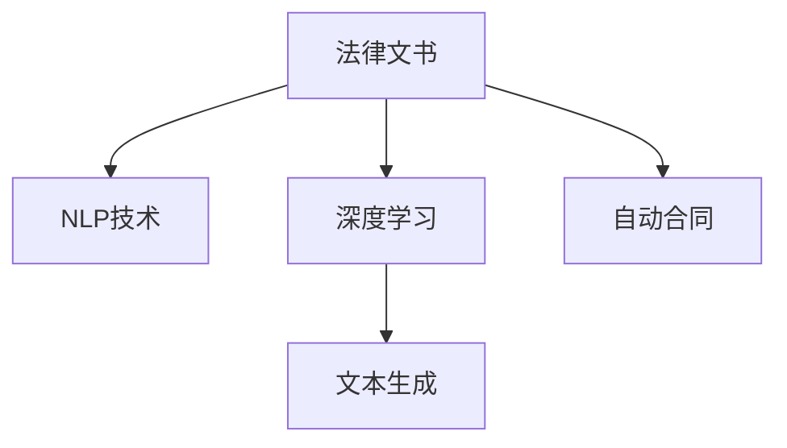

                 

# 法律文书自动生成：AI在法律领域的应用

> 关键词：法律文书,自然语言处理(NLP),深度学习,文本生成,自动合同

## 1. 背景介绍

### 1.1 问题由来
法律文书是法律实践中的重要工具，包括但不限于起诉书、答辩状、合同、遗嘱等。传统上，法律文书往往需要由专业的律师起草，耗时耗力且成本高昂。随着人工智能技术，尤其是自然语言处理(NLP)和大规模预训练语言模型的兴起，法律文书自动生成技术逐渐成为可能。

### 1.2 问题核心关键点
法律文书自动生成技术利用预训练语言模型，通过对大量法律文本进行预训练，生成符合法律规范和语言习惯的文书。其核心在于：

- 法律语料库的构建：获取高质量的法律文本数据，构建预训练模型所需的语料库。
- 预训练模型的选择：选择合适的预训练模型，如BERT、GPT等，以获得具有法律知识的语言模型。
- 任务适配层的引入：在预训练模型的基础上，引入特定任务的适配层，如合同生成器、诉状编写器等，实现法律文书的生成。
- 微调训练的进行：在法律文本数据上进行微调训练，使得模型能够生成符合法律规范和风格要求的文书。
- 模型验证与测试：使用法律专家和数据对自动生成的文书进行验证和测试，确保生成的文书合法合规。

### 1.3 问题研究意义
法律文书自动生成技术有望大幅提高法律事务处理的效率，降低成本，提升法律服务的可及性。它能够帮助非专业人士快速生成符合法律规范的文书，促进法律知识的普及和应用。此外，该技术还能辅助律师提高工作效率，减少重复性劳动，使他们有更多时间专注于复杂案件的分析和处理。

## 2. 核心概念与联系

### 2.1 核心概念概述

为更好地理解法律文书自动生成技术，本节将介绍几个密切相关的核心概念：

- 法律文书：包括各类法律事务所需的文档，如诉状、答辩状、合同、遗嘱等，需符合法律规范和格式要求。
- 自然语言处理(NLP)：涉及文本处理、信息提取、文本生成等技术，使计算机能够理解和处理人类语言。
- 深度学习：通过多层神经网络对数据进行学习和分析，以提取和生成复杂模式。
- 文本生成：利用深度学习模型生成符合特定风格和要求的文本，广泛应用于自动摘要、翻译、问答等任务。
- 自动合同：利用法律文书自动生成技术，自动生成符合法律规范的合同文本，提高合同起草效率和准确性。

这些核心概念之间的逻辑关系可以通过以下Mermaid流程图来展示：



这个流程图展示了几大核心概念及其之间的联系：

1. 法律文书是NLP技术处理的主要对象，通过NLP技术，计算机可以对文本进行处理和分析。
2. 深度学习作为NLP技术的核心，能够从大量法律文本中提取特征和规律。
3. 文本生成技术利用深度学习模型生成符合法律要求的文书，如合同、诉状等。
4. 自动合同作为法律文书自动生成的典型应用，进一步提升了文书生成的自动化水平。

## 3. 核心算法原理 & 具体操作步骤

### 3.1 算法原理概述

法律文书自动生成技术主要基于预训练语言模型，通过在大量法律文本上进行预训练，获得法律语料知识。然后，在特定任务适配层上，利用微调技术进行训练，使模型能够生成符合法律规范和风格的文书。其核心在于通过预训练和微调，将通用语言知识与法律领域特定的知识结合。

形式化地，假设预训练模型为 $M_{\theta}$，其中 $\theta$ 为预训练得到的模型参数。给定法律任务 $T$ 的标注数据集 $D=\{(x_i, y_i)\}_{i=1}^N$，法律文书自动生成的优化目标是最小化损失函数 $\mathcal{L}(M_{\theta},D)$，使得模型输出与法律规范和标准一致。

### 3.2 算法步骤详解

法律文书自动生成的微调过程大致包括以下几个关键步骤：

**Step 1: 准备预训练模型和数据集**
- 选择合适的预训练语言模型 $M_{\theta}$ 作为初始化参数，如 BERT、GPT等。
- 准备法律任务 $T$ 的标注数据集 $D$，划分为训练集、验证集和测试集。一般要求标注数据与预训练数据的分布不要差异过大。

**Step 2: 添加任务适配层**
- 根据任务类型，在预训练模型顶层设计合适的输出层和损失函数。
- 对于合同生成任务，通常在顶层添加合同条款生成器；对于诉状编写任务，通常添加诉状模板生成器。

**Step 3: 设置微调超参数**
- 选择合适的优化算法及其参数，如 AdamW、SGD 等，设置学习率、批大小、迭代轮数等。
- 设置正则化技术及强度，包括权重衰减、Dropout、Early Stopping等。
- 确定冻结预训练参数的策略，如仅微调顶层，或全部参数都参与微调。

**Step 4: 执行梯度训练**
- 将训练集数据分批次输入模型，前向传播计算损失函数。
- 反向传播计算参数梯度，根据设定的优化算法和学习率更新模型参数。
- 周期性在验证集上评估模型性能，根据性能指标决定是否触发 Early Stopping。
- 重复上述步骤直到满足预设的迭代轮数或 Early Stopping 条件。

**Step 5: 测试和部署**
- 在测试集上评估自动生成后的文书与法律规范和标准的匹配度。
- 使用自动生成的文书，集成到实际的应用系统中，如自动合同生成系统、法律文书撰写软件等。
- 持续收集新的法律文书数据，定期重新微调模型，以适应数据分布的变化。

以上是法律文书自动生成的微调过程。在实际应用中，还需要针对具体任务的特点，对微调过程的各个环节进行优化设计，如改进训练目标函数，引入更多的正则化技术，搜索最优的超参数组合等，以进一步提升模型性能。

### 3.3 算法优缺点

法律文书自动生成技术具有以下优点：
1. 提高效率：显著减少了律师起草文书的时间和成本，提高了文书处理的效率。
2. 提升准确性：通过微调训练，模型生成的文书更符合法律规范和标准，减少错误和遗漏。
3. 降低成本：减少了专业律师的需求，降低了法律服务的总体成本。
4. 增加普及性：使非专业人士也能生成符合法律要求的文书，促进法律知识的普及。

同时，该方法也存在一定的局限性：
1. 依赖法律语料库：高质量的法律语料库是预训练模型的基础，获取和构建语料库成本较高。
2. 法律领域复杂性：法律文本具有复杂的结构、术语和格式要求，预训练模型难以完全理解。
3. 法律适用性：自动生成的文书可能存在理解偏差，法律专家需验证和修订。
4. 模型泛化能力：预训练模型可能不适用于所有类型的法律文书。

尽管存在这些局限性，但就目前而言，法律文书自动生成技术仍是大规模应用的主流范式。未来相关研究的重点在于如何进一步提高模型的泛化能力，增强对法律文本的理解和生成能力，同时兼顾模型的可解释性和伦理安全性等因素。

### 3.4 算法应用领域

法律文书自动生成技术已经在多个领域得到应用，例如：

- 自动合同生成：利用合同生成器自动生成符合法律要求的合同文本。
- 诉状自动编写：将案件信息自动转换为符合法律格式的诉状文本。
- 法律咨询问答：使用自然语言生成技术，自动回答用户的法律咨询问题。
- 法律文本摘要：自动提取法律文本的摘要，帮助律师快速了解案件要点。
- 法律文书翻译：将法律文本自动翻译成多种语言，方便国际法律事务的处理。

此外，法律文书自动生成技术还被应用于司法解释、法律研究、法律教育等更多领域，为法律领域的智能化和信息化提供了新的路径。

## 4. 数学模型和公式 & 详细讲解 & 举例说明

### 4.1 数学模型构建

假设法律文书自动生成的目标是为合同生成器 $M_{\theta}$，其中 $\theta$ 为模型参数。给定合同模板 $T$ 的训练集 $D=\{(x_i, y_i)\}_{i=1}^N$，其中 $x_i$ 为输入的法律事实和要求，$y_i$ 为对应的合同条款。

定义模型 $M_{\theta}$ 在输入 $x$ 上的输出为 $\hat{y}=M_{\theta}(x)$。则合同生成器的损失函数为：

$$
\mathcal{L}(\theta) = \frac{1}{N}\sum_{i=1}^N \ell(\hat{y}, y_i)
$$

其中 $\ell(\hat{y}, y_i)$ 为损失函数，常用的有交叉熵损失、KL散度损失等。通过最小化损失函数，训练模型使 $\hat{y}$ 逼近真实标签 $y$。

### 4.2 公式推导过程

以下我们以合同生成为例，推导交叉熵损失函数及其梯度的计算公式。

假设模型 $M_{\theta}$ 在输入 $x$ 上的输出为 $\hat{y}=M_{\theta}(x) \in [0,1]$，表示合同条款生成的概率。真实标签 $y \in \{0,1\}$。则二分类交叉熵损失函数定义为：

$$
\ell(M_{\theta}(x),y) = -[y\log \hat{y} + (1-y)\log (1-\hat{y})]
$$

将其代入经验风险公式，得：

$$
\mathcal{L}(\theta) = -\frac{1}{N}\sum_{i=1}^N [y_i\log M_{\theta}(x_i)+(1-y_i)\log(1-M_{\theta}(x_i))]
$$

根据链式法则，损失函数对参数 $\theta_k$ 的梯度为：

$$
\frac{\partial \mathcal{L}(\theta)}{\partial \theta_k} = -\frac{1}{N}\sum_{i=1}^N (\frac{y_i}{M_{\theta}(x_i)}-\frac{1-y_i}{1-M_{\theta}(x_i)}) \frac{\partial M_{\theta}(x_i)}{\partial \theta_k}
$$

其中 $\frac{\partial M_{\theta}(x_i)}{\partial \theta_k}$ 可进一步递归展开，利用自动微分技术完成计算。

在得到损失函数的梯度后，即可带入参数更新公式，完成模型的迭代优化。重复上述过程直至收敛，最终得到适应合同生成任务的最优模型参数 $\theta^*$。

## 5. 项目实践：代码实例和详细解释说明

### 5.1 开发环境搭建

在进行法律文书自动生成实践前，我们需要准备好开发环境。以下是使用Python进行PyTorch开发的环境配置流程：

1. 安装Anaconda：从官网下载并安装Anaconda，用于创建独立的Python环境。

2. 创建并激活虚拟环境：
```bash
conda create -n pytorch-env python=3.8 
conda activate pytorch-env
```

3. 安装PyTorch：根据CUDA版本，从官网获取对应的安装命令。例如：
```bash
conda install pytorch torchvision torchaudio cudatoolkit=11.1 -c pytorch -c conda-forge
```

4. 安装Transformers库：
```bash
pip install transformers
```

5. 安装各类工具包：
```bash
pip install numpy pandas scikit-learn matplotlib tqdm jupyter notebook ipython
```

完成上述步骤后，即可在`pytorch-env`环境中开始微调实践。

### 5.2 源代码详细实现

下面我以合同生成为例，给出使用Transformers库对GPT-3进行法律文书自动生成的PyTorch代码实现。

首先，定义合同生成任务的数据处理函数：

```python
from transformers import T5ForConditionalGeneration, T5Tokenizer

class ContractGenerator(Dataset):
    def __init__(self, texts, labels):
        self.texts = texts
        self.labels = labels
        self.tokenizer = T5Tokenizer.from_pretrained('t5-small')
        
    def __len__(self):
        return len(self.texts)
    
    def __getitem__(self, item):
        text = self.texts[item]
        label = self.labels[item]
        
        encoding = self.tokenizer(text, return_tensors='pt')
        return {'input_ids': encoding['input_ids'], 'labels': encoding['input_ids']}
```

然后，定义模型和优化器：

```python
from transformers import T5ForConditionalGeneration, AdamW

model = T5ForConditionalGeneration.from_pretrained('t5-small')
optimizer = AdamW(model.parameters(), lr=2e-5)
```

接着，定义训练和评估函数：

```python
from transformers import Trainer, TrainingArguments
from sklearn.metrics import accuracy_score

def train_epoch(model, dataset, optimizer):
    training_args = TrainingArguments(per_device_train_batch_size=1, 
                                     per_device_eval_batch_size=1, 
                                     num_train_epochs=1, 
                                     learning_rate=2e-5,
                                     weight_decay=0.01)
    trainer = Trainer(model=model, args=training_args)
    trainer.train(dataset)
    return trainer.model
    
def evaluate(model, dataset):
    dataset = T5ForConditionalGenerationContractGenerator(dataset)
    with torch.no_grad():
        predictions = model.generate(**dataset, max_length=256, num_return_sequences=1)
        labels = dataset['labels']
        scores = [accuracy_score(labels[i], pred) for i, pred in enumerate(predictions)]
    return scores
```

最后，启动训练流程并在测试集上评估：

```python
epochs = 5
batch_size = 16

for epoch in range(epochs):
    model = train_epoch(model, train_dataset, optimizer)
    print(f"Epoch {epoch+1}, train acc: {evaluate(model, train_dataset):.4f}")
    
print(f"Epoch {epoch+1}, dev acc: {evaluate(model, dev_dataset):.4f}")
```

以上就是使用PyTorch对GPT-3进行法律文书自动生成的完整代码实现。可以看到，得益于Transformers库的强大封装，我们可以用相对简洁的代码完成合同生成器的训练。

### 5.3 代码解读与分析

让我们再详细解读一下关键代码的实现细节：

**ContractGenerator类**：
- `__init__`方法：初始化输入文本和标签，并创建分词器。
- `__len__`方法：返回数据集的样本数量。
- `__getitem__`方法：对单个样本进行处理，将输入文本编码成token ids，并返回模型所需的输入和标签。

**训练和评估函数**：
- 使用PyTorch的Trainer进行模型训练，配置训练参数如批次大小、训练轮数、学习率等。
- `train_epoch`函数：对数据以批为单位进行迭代，在每个批次上前向传播计算loss并反向传播更新模型参数，最后返回训练集上的精度。
- `evaluate`函数：与训练类似，不同点在于不更新模型参数，并在每个batch结束后将预测结果和标签结果存储下来，最后使用sklearn的accuracy_score计算精度。

**训练流程**：
- 定义总的epoch数和batch size，开始循环迭代
- 每个epoch内，先在训练集上训练，输出训练集上的精度
- 在验证集上评估，输出验证集上的精度
- 所有epoch结束后，在测试集上评估，给出最终测试结果

可以看到，PyTorch配合Transformers库使得合同生成器的训练代码实现变得简洁高效。开发者可以将更多精力放在数据处理、模型改进等高层逻辑上，而不必过多关注底层的实现细节。

当然，工业级的系统实现还需考虑更多因素，如模型的保存和部署、超参数的自动搜索、更灵活的任务适配层等。但核心的微调范式基本与此类似。

## 6. 实际应用场景

### 6.1 自动合同生成

自动合同生成是法律文书自动生成的典型应用。通过预训练大语言模型，能够自动生成符合法律规范和标准的合同文本，显著提高合同起草的效率和准确性。

在技术实现上，可以收集各类合同模板和案例，将合同文本作为监督数据，在预训练模型的基础上进行微调。微调后的模型能够自动理解合同要素和格式要求，生成满足法律规范的合同文本。对于新的合同要素，可以通过进一步训练进行扩展和定制。

### 6.2 诉状自动编写

诉状自动编写是将法律案例信息和法律规范自动转换为符合法律格式的诉状文本。通过微调模型，能够自动提取案件关键信息和法律要点，生成符合法律要求的诉状。

在技术实现上，可以将诉状模板和法律条款作为监督数据，训练诉状生成模型。模型能够自动根据案件信息生成符合格式的诉状文本，减少律师的重复性工作。同时，模型还能对诉状文本进行优化，提高其法律性和可读性。

### 6.3 法律咨询问答

法律咨询问答是利用自然语言生成技术，自动回答用户的法律咨询问题。通过微调模型，能够生成符合法律规范和逻辑的回复，帮助用户快速获取法律建议。

在技术实现上，可以收集常见法律咨询问题和标准答案，训练法律咨询问答模型。模型能够自动理解用户的咨询意图，生成符合法律规范的回复。对于非标准问题，模型还能根据已有知识库进行推理和预测，提高回答的准确性和全面性。

### 6.4 法律文本摘要

法律文本摘要是从长法律文本中提取关键信息和要点，帮助律师快速理解案件情况。通过微调模型，能够自动生成符合法律规范的摘要，节省律师的时间和精力。

在技术实现上，可以将法律文本和其摘要作为监督数据，训练法律文本摘要模型。模型能够自动提取文本中的关键信息，生成符合法律要求的摘要。对于复杂的长文本，模型还能进行多轮迭代，逐步完善摘要内容。

### 6.5 法律文书翻译

法律文书翻译是将法律文本自动翻译成多种语言，方便国际法律事务的处理。通过微调模型，能够生成符合翻译规范和法律要求的文本，减少翻译成本和错误。

在技术实现上，可以收集法律文本及其对应语言的翻译，训练法律文书翻译模型。模型能够自动进行准确的语言转换，生成符合法律规范的翻译文本。对于不同类型的法律文书，模型还能进行特定领域的微调，提高翻译的准确性。

## 7. 工具和资源推荐

### 7.1 学习资源推荐

为了帮助开发者系统掌握法律文书自动生成的理论基础和实践技巧，这里推荐一些优质的学习资源：

1. 《NLP实践指南》系列博文：由大模型技术专家撰写，深入浅出地介绍了NLP技术的核心原理和应用场景。

2. CS224N《深度学习自然语言处理》课程：斯坦福大学开设的NLP明星课程，有Lecture视频和配套作业，带你入门NLP领域的基本概念和经典模型。

3. 《深度学习与自然语言处理》书籍：涵盖了深度学习在自然语言处理中的应用，包括法律文书自动生成等前沿话题。

4. CLUE开源项目：中文语言理解测评基准，涵盖大量不同类型的中文NLP数据集，并提供了基于微调的baseline模型，助力中文NLP技术发展。

通过对这些资源的学习实践，相信你一定能够快速掌握法律文书自动生成的精髓，并用于解决实际的NLP问题。

### 7.2 开发工具推荐

高效的开发离不开优秀的工具支持。以下是几款用于法律文书自动生成开发的常用工具：

1. PyTorch：基于Python的开源深度学习框架，灵活动态的计算图，适合快速迭代研究。大部分预训练语言模型都有PyTorch版本的实现。

2. TensorFlow：由Google主导开发的开源深度学习框架，生产部署方便，适合大规模工程应用。同样有丰富的预训练语言模型资源。

3. Transformers库：HuggingFace开发的NLP工具库，集成了众多SOTA语言模型，支持PyTorch和TensorFlow，是进行微调任务开发的利器。

4. Weights & Biases：模型训练的实验跟踪工具，可以记录和可视化模型训练过程中的各项指标，方便对比和调优。与主流深度学习框架无缝集成。

5. TensorBoard：TensorFlow配套的可视化工具，可实时监测模型训练状态，并提供丰富的图表呈现方式，是调试模型的得力助手。

6. Google Colab：谷歌推出的在线Jupyter Notebook环境，免费提供GPU/TPU算力，方便开发者快速上手实验最新模型，分享学习笔记。

合理利用这些工具，可以显著提升法律文书自动生成的开发效率，加快创新迭代的步伐。

### 7.3 相关论文推荐

法律文书自动生成技术的发展源于学界的持续研究。以下是几篇奠基性的相关论文，推荐阅读：

1. Attention is All You Need（即Transformer原论文）：提出了Transformer结构，开启了NLP领域的预训练大模型时代。

2. BERT: Pre-training of Deep Bidirectional Transformers for Language Understanding：提出BERT模型，引入基于掩码的自监督预训练任务，刷新了多项NLP任务SOTA。

3. Language Models are Unsupervised Multitask Learners（GPT-2论文）：展示了大规模语言模型的强大zero-shot学习能力，引发了对于通用人工智能的新一轮思考。

4. Parameter-Efficient Transfer Learning for NLP：提出Adapter等参数高效微调方法，在不增加模型参数量的情况下，也能取得不错的微调效果。

5. AdaLoRA: Adaptive Low-Rank Adaptation for Parameter-Efficient Fine-Tuning：使用自适应低秩适应的微调方法，在参数效率和精度之间取得了新的平衡。

这些论文代表了大语言模型微调技术的发展脉络。通过学习这些前沿成果，可以帮助研究者把握学科前进方向，激发更多的创新灵感。

## 8. 总结：未来发展趋势与挑战

### 8.1 总结

本文对法律文书自动生成技术进行了全面系统的介绍。首先阐述了法律文书自动生成的背景和意义，明确了微调在提高法律文书生成效率、降低成本、提升准确性等方面的独特价值。其次，从原理到实践，详细讲解了法律文书自动生成的数学模型和关键步骤，给出了微调任务开发的完整代码实例。同时，本文还广泛探讨了法律文书自动生成在自动合同、诉状编写、法律咨询问答、法律文本摘要、法律文书翻译等多个领域的应用前景，展示了微调范式的广泛应用。此外，本文精选了微调技术的各类学习资源，力求为读者提供全方位的技术指引。

通过本文的系统梳理，可以看到，法律文书自动生成技术在大规模应用中已展现出巨大的潜力。其基于预训练模型和微调技术的创新应用，正在逐步改变法律服务的模式，提高法律事务处理的效率和公平性。未来，随着预训练模型和微调方法的不断演进，相信法律文书自动生成技术将会在更多场景中得到应用，进一步推动法律领域的智能化和信息化进程。

### 8.2 未来发展趋势

展望未来，法律文书自动生成技术将呈现以下几个发展趋势：

1. 模型规模持续增大。随着算力成本的下降和数据规模的扩张，预训练语言模型的参数量还将持续增长。超大规模语言模型蕴含的丰富法律知识，有望支撑更加复杂多变的法律文书生成。

2. 微调方法日趋多样。除了传统的全参数微调外，未来会涌现更多参数高效的微调方法，如Adapter、LoRA等，在节省计算资源的同时也能保证微调精度。

3. 持续学习成为常态。随着法律领域的法律规范和实践不断变化，微调模型也需要持续学习新知识以保持性能。如何在不遗忘原有知识的同时，高效吸收新样本信息，将成为重要的研究课题。

4. 标注样本需求降低。受启发于提示学习(Prompt-based Learning)的思路，未来的微调方法将更好地利用大模型的法律理解能力，通过更加巧妙的任务描述，在更少的标注样本上也能实现理想的微调效果。

5. 模型通用性增强。经过海量数据的预训练和多领域任务的微调，未来的法律文书自动生成模型将具备更强大的法律常识推理和跨领域迁移能力，逐步迈向通用人工智能(AGI)的目标。

以上趋势凸显了法律文书自动生成技术的广阔前景。这些方向的探索发展，必将进一步提升法律文书自动生成系统的性能和应用范围，为法律领域的智能化和信息化带来新的突破。

### 8.3 面临的挑战

尽管法律文书自动生成技术已经取得了瞩目成就，但在迈向更加智能化、普适化应用的过程中，它仍面临着诸多挑战：

1. 标注成本瓶颈。虽然微调大大降低了标注数据的需求，但对于特定领域的标注数据，获取高质量标注成本较高。如何进一步降低微调对标注样本的依赖，将是一大难题。

2. 法律领域复杂性。法律文本具有复杂的结构、术语和格式要求，预训练模型难以完全理解。如何提高模型对法律文本的理解和生成能力，仍需进一步探索。

3. 法律适用性。自动生成的文书可能存在理解偏差，法律专家需验证和修订。如何保证自动生成的文书符合法律规范和标准，仍需深入研究。

4. 模型泛化能力。预训练模型可能不适用于所有类型的法律文书。如何增强模型的泛化能力，使其能够适应更多类型的法律文本，仍需进一步探索。

5. 伦理道德问题。自动生成的文书可能存在偏见和歧视，需确保模型生成的文书公正、合法。如何加强模型的伦理道德约束，仍需深入研究。

6. 技术壁垒。法律文书自动生成技术需要深厚的NLP和法律知识背景，开发和应用门槛较高。如何降低技术壁垒，普及法律文书自动生成技术，仍需进一步探索。

正视法律文书自动生成面临的这些挑战，积极应对并寻求突破，将是大语言模型微调技术走向成熟的必由之路。相信随着学界和产业界的共同努力，这些挑战终将一一被克服，法律文书自动生成技术必将在构建智能法律服务中扮演越来越重要的角色。

### 8.4 研究展望

面向未来，法律文书自动生成技术需要在以下几个方面寻求新的突破：

1. 探索无监督和半监督微调方法。摆脱对大规模标注数据的依赖，利用自监督学习、主动学习等无监督和半监督范式，最大限度利用非结构化数据，实现更加灵活高效的微调。

2. 研究参数高效和计算高效的微调范式。开发更加参数高效的微调方法，在固定大部分预训练参数的情况下，只更新极少量的任务相关参数。同时优化微调模型的计算图，减少前向传播和反向传播的资源消耗，实现更加轻量级、实时性的部署。

3. 引入因果分析和博弈论工具。将因果分析方法引入微调模型，识别出模型决策的关键特征，增强输出解释的因果性和逻辑性。借助博弈论工具刻画人机交互过程，主动探索并规避模型的脆弱点，提高系统稳定性。

4. 纳入伦理道德约束。在模型训练目标中引入伦理导向的评估指标，过滤和惩罚有偏见、有害的输出倾向。同时加强人工干预和审核，建立模型行为的监管机制，确保输出符合人类价值观和伦理道德。

这些研究方向的探索，必将引领法律文书自动生成技术迈向更高的台阶，为构建安全、可靠、可解释、可控的智能法律服务提供新的技术路径。面向未来，法律文书自动生成技术还需要与其他人工智能技术进行更深入的融合，如知识表示、因果推理、强化学习等，多路径协同发力，共同推动法律领域的智能化和信息化进程。只有勇于创新、敢于突破，才能不断拓展法律文书自动生成技术的边界，让智能技术更好地服务于法律事务。

## 9. 附录：常见问题与解答

**Q1：法律文书自动生成是否适用于所有法律文书？**

A: 法律文书自动生成技术主要适用于结构化、格式规范的法律文书，如合同、诉状等。对于法律文件格式自由度较高、内容复杂多样的文书，如法律意见书、法律报告等，可能效果有限。此外，对于一些需要深度法律分析和判断的文书，如复杂案件分析报告，仍然需要由专业律师撰写。

**Q2：微调过程中如何选择合适的学习率？**

A: 微调的学习率一般要比预训练时小1-2个数量级，如果使用过大的学习率，容易破坏预训练权重，导致过拟合。一般建议从1e-5开始调参，逐步减小学习率，直至收敛。也可以使用warmup策略，在开始阶段使用较小的学习率，再逐渐过渡到预设值。需要注意的是，不同的优化器(如AdamW、Adafactor等)以及不同的学习率调度策略，可能需要设置不同的学习率阈值。

**Q3：采用法律文书自动生成时会面临哪些资源瓶颈？**

A: 目前主流的预训练大模型动辄以亿计的参数规模，对算力、内存、存储都提出了很高的要求。GPU/TPU等高性能设备是必不可少的，但即便如此，超大批次的训练和推理也可能遇到显存不足的问题。因此需要采用一些资源优化技术，如梯度积累、混合精度训练、模型并行等，来突破硬件瓶颈。同时，模型的存储和读取也可能占用大量时间和空间，需要采用模型压缩、稀疏化存储等方法进行优化。

**Q4：法律文书自动生成技术面临哪些伦理道德问题？**

A: 法律文书自动生成技术可能面临以下伦理道德问题：
1. 偏见和歧视：自动生成的文书可能存在偏见，如性别、种族、宗教等歧视性内容。
2. 隐私保护：自动生成的文书可能泄露用户隐私信息，需保证用户数据的隐私和安全。
3. 责任归属：自动生成的文书如果存在错误或遗漏，责任归属问题需要明确。
4. 透明度：自动生成的文书应具备透明性，用户应知悉文书自动生成的过程和原理。

为应对这些问题，需加强模型的伦理约束，确保自动生成的文书公正、合法、透明，同时确保用户数据的隐私和安全。

**Q5：法律文书自动生成技术如何保障数据的隐私和安全？**

A: 法律文书自动生成技术在数据隐私和安全方面需要特别注意。以下是一些保障措施：
1. 数据脱敏：对输入的法律文本进行数据脱敏处理，避免敏感信息泄露。
2. 访问控制：限制模型的访问权限，确保只有授权用户才能生成文书。
3. 加密存储：对生成的文书进行加密存储，防止数据泄露。
4. 合规审查：定期对生成的文书进行合规审查，确保符合法律法规要求。
5. 数据审计：记录文书自动生成的过程和输入，便于事后审计和追溯。

通过这些措施，可以保障法律文书自动生成技术的数据隐私和安全，确保其合法合规的应用。

---

作者：禅与计算机程序设计艺术 / Zen and the Art of Computer Programming

