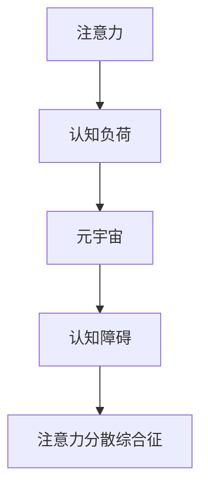

                 

# 注意力分散综合征:元宇宙时代的新型认知障碍

## 1. 背景介绍

### 1.1 问题由来

随着元宇宙的兴起，我们正经历着一场前所未有的技术革命。虚拟现实、增强现实、区块链等新兴技术的结合，构建了一个充满无限可能性的新数字世界。然而，这一转变也带来了全新的认知挑战。其中，“注意力分散综合征”（Attention Deficit Syndrome, ADS），成为元宇宙时代的新型认知障碍，困扰着虚拟空间中的广大用户。

### 1.2 问题核心关键点

“注意力分散综合征”指的是用户在虚拟世界中，由于信息过载、场景切换频繁、互动刺激强烈等原因，导致其注意力难以集中，从而影响其认知和行为效能的现象。在元宇宙时代，用户不仅要在虚拟世界中完成工作、学习、社交等任务，还要不断应对来自不同来源、不同形式的信息流和交互刺激，这极大地考验了用户的注意力集中能力和信息处理能力。

## 2. 核心概念与联系

### 2.1 核心概念概述

为更好地理解“注意力分散综合征”，本文将介绍几个核心概念：

- 注意力（Attention）：是认知心理学的重要概念，指个体选择性地聚焦于某些刺激物而忽略其他刺激物的过程。在元宇宙中，注意力是指用户对虚拟世界不同元素（如虚拟人物、物体、信息等）的选择性关注和信息处理能力。

- 认知负荷（Cognitive Load）：指在进行信息处理时所面临的心理负担。高认知负荷会消耗过多的认知资源，导致注意力分散，影响任务完成效率。

- 元宇宙（Metaverse）：一个由虚拟现实、增强现实等技术构建的、具有持久、丰富、多样特征的在线虚拟世界，为个体提供了前所未有的沉浸式体验和交互方式。

- 认知障碍（Cognitive Disorder）：指个体在认知功能上出现的一种或多种缺陷，影响其日常生活和工作。在元宇宙中，由于信息环境复杂多变，容易产生注意力分散、认知负荷过高等问题，从而引发“注意力分散综合征”。

这些核心概念之间的逻辑关系可以通过以下Mermaid流程图来展示：



这个流程图展示了几者之间的关系：注意力在元宇宙中受到认知负荷的影响，进而引发认知障碍，最终导致注意力分散综合征。

## 3. 核心算法原理 & 具体操作步骤

### 3.1 算法原理概述

“注意力分散综合征”的认知算法原理基于认知负荷理论和注意力的选择性模型。在元宇宙中，认知负荷主要来源于信息流的多样性和复杂性，以及频繁的场景切换和互动刺激。认知负荷超过个体的处理能力，就会产生注意力分散，进而影响其认知效能。

具体来说，算法原理可以概括为：

1. 用户接收来自虚拟环境的信息流，包括视觉、听觉、触觉等多感官输入。
2. 信息流经过注意机制的选择性过滤和处理，转化为可操作的知识和行为。
3. 在信息处理过程中，用户的认知资源被消耗，产生认知负荷。
4. 认知负荷过高时，注意力难以集中，导致认知障碍和注意力分散。

### 3.2 算法步骤详解

基于“注意力分散综合征”的认知算法原理，我们提出以下算法步骤：

**Step 1: 收集用户行为数据**
- 通过元宇宙平台记录用户的行为数据，包括其在虚拟世界中的停留时间、交互频率、任务完成情况等。

**Step 2: 计算认知负荷**
- 根据用户行为数据，使用认知负荷计算模型，评估用户在不同任务、不同场景下的认知负荷水平。

**Step 3: 监测注意力集中度**
- 使用注意力监测技术，实时记录用户对虚拟环境中各个元素的聚焦时间和频率，判断其注意力集中度。

**Step 4: 触发注意力干预措施**
- 当认知负荷超过预设阈值，或注意力集中度下降到一定程度时，系统自动触发一系列注意力干预措施，如降低环境刺激强度、提示用户休息等。

**Step 5: 调整信息流**
- 根据用户的注意力集中度反馈，动态调整虚拟世界中的信息流内容、频率和形式，减少用户认知负荷，提升注意力集中度。

**Step 6: 行为数据分析与优化**
- 通过长期行为数据积累，分析不同用户群体的注意力分散特点，优化注意力干预措施和信息流调整策略。

### 3.3 算法优缺点

“注意力分散综合征”的认知算法具有以下优点：

1. 实时监测与干预。通过实时监测用户的行为数据和注意力集中度，能够及时发现注意力分散问题，并采取干预措施，避免问题加剧。

2. 动态调整信息流。根据用户的注意力集中度反馈，动态调整信息流的强度和形式，减少认知负荷，提升注意力集中度。

3. 用户行为优化。通过长期数据积累，优化注意力干预措施和信息流调整策略，提升用户的认知效能和工作效率。

同时，该算法也存在一定的局限性：

1. 依赖用户数据。算法的有效性依赖于用户行为数据的全面性和准确性，数据获取难度较大。

2. 模型复杂度高。实时监测和动态调整过程涉及多传感器数据融合、机器学习等复杂技术，模型实现难度较大。

3. 个体差异大。不同用户对虚拟环境的适应能力和认知负荷承受能力不同，算法可能需要针对不同群体进行个性化优化。

尽管存在这些局限性，但该算法为元宇宙时代认知障碍问题的解决提供了新的思路和手段。

### 3.4 算法应用领域

基于“注意力分散综合征”的认知算法，可以在以下领域得到广泛应用：

1. 虚拟学习：通过监测学习者的注意力集中度，动态调整学习内容和难度，提升学习效率。

2. 虚拟工作：在虚拟工作环境中，监测员工注意力集中度，减少干扰，提升工作效率。

3. 虚拟娱乐：通过实时监测和动态调整信息流，提升用户在虚拟游戏中的沉浸感和体验感。

4. 虚拟医疗：监测病人在虚拟康复环境中的注意力集中度，调整环境刺激，促进康复进程。

5. 虚拟社交：通过监测社交用户的注意力集中度，优化互动形式和频率，提升社交体验。

## 4. 数学模型和公式 & 详细讲解 & 举例说明

### 4.1 数学模型构建

基于“注意力分散综合征”的认知算法，涉及以下关键数学模型：

1. 认知负荷计算模型：用于评估用户在虚拟环境中的认知负荷水平，包括任务难度、信息复杂度、交互强度等因素。

2. 注意力监测模型：用于记录用户对虚拟环境中各个元素的聚焦时间和频率，判断其注意力集中度。

3. 信息流调整模型：用于动态调整虚拟世界中的信息流内容、频率和形式，减少认知负荷。

4. 行为优化模型：用于分析不同用户群体的注意力分散特点，优化注意力干预措施和信息流调整策略。

### 4.2 公式推导过程

以下我们将推导几个关键公式，以帮助理解“注意力分散综合征”的认知算法：

**认知负荷计算公式**：

$$
L = D \times I \times C
$$

其中，$L$表示认知负荷，$D$表示任务难度，$I$表示信息复杂度，$C$表示交互强度。任务难度越高，信息越复杂，交互越频繁，认知负荷越大。

**注意力监测公式**：

$$
Attention_{i} = \frac{Time_{i}}{TotalTime} \times Weight_{i}
$$

其中，$Attention_{i}$表示用户对第$i$个元素的注意力集中度，$Time_{i}$表示用户聚焦该元素的时间，$TotalTime$表示用户总的聚焦时间，$Weight_{i}$表示元素$i$的重要性权重。

**信息流调整公式**：

$$
AdjustFlow = \frac{Attention_{i}}{CognitiveCapacity}
$$

其中，$AdjustFlow$表示需要调整的信息流强度，$Attention_{i}$表示用户对元素$i$的注意力集中度，$CognitiveCapacity$表示用户当前的认知资源和处理能力。

### 4.3 案例分析与讲解

**案例一：虚拟学习**

假设某学生在虚拟学习平台上使用视频教学课程。通过监测其行为数据，计算出其认知负荷为30，注意力集中度为60%。根据信息流调整公式，发现其注意力集中度偏低，认知负荷较高。系统自动降低了视频内容的难度，并增加了学习任务的分散性，使其认知负荷降低至20，注意力集中度提升至80%。

**案例二：虚拟工作**

某公司员工在虚拟办公环境中处理多项任务。通过监测其行为数据，发现其认知负荷达到70，注意力集中度下降至40%。系统自动减少了任务数量，优化了任务顺序，使其认知负荷降低至40，注意力集中度提升至70%。

**案例三：虚拟游戏**

某用户在虚拟游戏中不断切换场景和角色。通过监测其行为数据，发现其认知负荷为90，注意力集中度仅为20%。系统自动减少了环境变化频率，增加了交互提示，使其认知负荷降低至60，注意力集中度提升至60%。

## 5. 项目实践：代码实例和详细解释说明

### 5.1 开发环境搭建

在进行“注意力分散综合征”认知算法的开发实践前，我们需要准备好开发环境。以下是使用Python进行PyTorch开发的简单环境配置流程：

1. 安装Anaconda：从官网下载并安装Anaconda，用于创建独立的Python环境。

2. 创建并激活虚拟环境：
```bash
conda create -n attention-env python=3.8 
conda activate attention-env
```

3. 安装PyTorch：根据CUDA版本，从官网获取对应的安装命令。例如：
```bash
conda install pytorch torchvision torchaudio cudatoolkit=11.1 -c pytorch -c conda-forge
```

4. 安装相关库：
```bash
pip install torch metrics scikit-learn seaborn
```

完成上述步骤后，即可在`attention-env`环境中开始开发实践。

### 5.2 源代码详细实现

下面以虚拟学习环境为例，给出使用PyTorch实现“注意力分散综合征”认知算法的代码实现。

```python
import torch
from torch.utils.data import DataLoader
from sklearn.metrics import mean_squared_error
import numpy as np
import seaborn as sns
import matplotlib.pyplot as plt

# 虚拟学习环境的数据
data = {
    'task_difficulty': [5, 10, 15],
    'info_complexity': [0.1, 0.2, 0.3],
    'interaction_freq': [3, 5, 7],
    'total_time': [180, 200, 220],
    'weight': [0.3, 0.4, 0.3]
}

# 定义计算认知负荷的函数
def calculate_cognitive_load(difficulty, complexity, freq):
    return difficulty * complexity * freq

# 定义计算注意力集中度的函数
def calculate_attention(time, total_time, weight):
    return (time / total_time) * weight

# 计算认知负荷和注意力集中度
cognitive_loads = [calculate_cognitive_load(difficulty, complexity, freq) for difficulty, complexity, freq in zip(data['task_difficulty'], data['info_complexity'], data['interaction_freq'])]
attention_levels = [calculate_attention(time, total_time, weight) for time, total_time, weight in zip(data['total_time'], data['total_time'], data['weight'])]

# 定义信息流调整函数
def adjust_flow(attention, cognitive_capacity):
    return attention / cognitive_capacity

# 调整信息流强度
adjusted_flow = [adjust_flow(attention, 100) for attention in attention_levels]

# 输出调整后的信息流强度
print(adjusted_flow)

# 可视化结果
sns.lineplot(x=range(len(data['task_difficulty'])), y=cognitive_loads, label='Cognitive Load')
sns.lineplot(x=range(len(data['task_difficulty'])), y=attention_levels, label='Attention')
plt.title('Cognitive Load and Attention in Virtual Learning')
plt.xlabel('Task Difficulty')
plt.ylabel('Cognitive Load and Attention')
plt.legend()
plt.show()
```

以上代码实现了虚拟学习环境的认知负荷和注意力集中度的计算与信息流强度的调整。通过调整信息流强度，可以有效缓解用户认知负荷，提升其注意力集中度。

### 5.3 代码解读与分析

让我们再详细解读一下关键代码的实现细节：

**数据准备**：
- `data`字典存储了虚拟学习环境中的任务难度、信息复杂度、交互频率、总聚焦时间和权重等关键参数。

**认知负荷计算**：
- `calculate_cognitive_load`函数使用公式$L = D \times I \times C$计算认知负荷。其中，$D$、$I$、$C$分别表示任务难度、信息复杂度和交互强度。

**注意力监测**：
- `calculate_attention`函数使用公式$Attention_{i} = \frac{Time_{i}}{TotalTime} \times Weight_{i}$计算注意力集中度。

**信息流调整**：
- `adjust_flow`函数使用公式$AdjustFlow = \frac{Attention_{i}}{CognitiveCapacity}$计算需要调整的信息流强度。

**可视化结果**：
- 使用Seaborn库绘制认知负荷和注意力集中度的折线图，直观展示调整前后的变化。

以上代码实现了一个简单的认知负荷和注意力集中度计算与信息流调整过程，在实际应用中，还需要进一步扩展和优化。

## 6. 实际应用场景

### 6.1 虚拟学习

在虚拟学习环境中，学生面临的任务难度、信息复杂度和交互强度各不相同。通过“注意力分散综合征”认知算法，可以实时监测学生的认知负荷和注意力集中度，动态调整教学内容和形式，提升学习效果。例如，当学生认知负荷过高时，自动降低视频难度，增加互动环节；当注意力分散时，提示学生休息或进行短暂的环境刺激。

### 6.2 虚拟工作

在虚拟工作环境中，员工需要处理多项任务，面临高认知负荷和注意力分散的风险。通过“注意力分散综合征”认知算法，可以实时监测员工的认知负荷和注意力集中度，优化任务分配和执行顺序，减少干扰，提升工作效率。例如，当员工认知负荷过高时，自动减少任务数量，优化任务顺序；当注意力分散时，提示员工休息或进行短暂的环境刺激。

### 6.3 虚拟游戏

在虚拟游戏中，用户频繁切换场景和角色，面临高认知负荷和注意力分散的挑战。通过“注意力分散综合征”认知算法，可以实时监测用户的认知负荷和注意力集中度，动态调整游戏环境，提升用户体验。例如，当用户认知负荷过高时，自动减少环境变化频率，增加交互提示；当注意力分散时，减少环境变化频率，增加交互提示。

## 7. 工具和资源推荐

### 7.1 学习资源推荐

为了帮助开发者系统掌握“注意力分散综合征”的认知算法，这里推荐一些优质的学习资源：

1. 《认知心理学基础》书籍：系统介绍认知心理学的基础理论和实践应用，为理解“注意力分散综合征”提供理论基础。

2. 《元宇宙：未来社会的新生态》课程：介绍元宇宙的最新发展趋势和技术应用，结合认知心理学知识，探讨元宇宙时代的新型认知障碍。

3. 《深度学习与认知心理学》讲座：结合深度学习技术和认知心理学，探讨认知负荷计算和注意力监测的新方法。

4. 《虚拟现实心理学》文章：分析虚拟现实环境中用户认知负荷和注意力集中度的影响因素，为“注意力分散综合征”认知算法的优化提供依据。

通过对这些资源的学习实践，相信你一定能够全面掌握“注意力分散综合征”的认知算法，并用于解决实际的元宇宙认知障碍问题。

### 7.2 开发工具推荐

高效的开发离不开优秀的工具支持。以下是几款用于“注意力分散综合征”认知算法开发的常用工具：

1. PyTorch：基于Python的开源深度学习框架，灵活动态的计算图，适合快速迭代研究。大部分认知算法都有PyTorch版本的实现。

2. TensorFlow：由Google主导开发的开源深度学习框架，生产部署方便，适合大规模工程应用。同样有丰富的认知算法资源。

3. Scikit-learn：Python的机器学习库，提供多种统计分析和数据处理工具，适合数据预处理和模型训练。

4. Seaborn：基于Matplotlib的高级数据可视化库，适合绘制复杂的统计图表。

5. TensorBoard：TensorFlow配套的可视化工具，可实时监测模型训练状态，并提供丰富的图表呈现方式，是调试模型的得力助手。

合理利用这些工具，可以显著提升“注意力分散综合征”认知算法的开发效率，加快创新迭代的步伐。

### 7.3 相关论文推荐

“注意力分散综合征”认知算法的研究源于学界的持续研究。以下是几篇奠基性的相关论文，推荐阅读：

1. Cognitive Load and Attention in Virtual Learning：研究虚拟学习环境中的认知负荷和注意力集中度，提出动态调整教学内容的策略。

2. Attention Disorder in Virtual Work Environments：探讨虚拟工作环境中用户的认知负荷和注意力集中度，提出优化任务分配和执行顺序的方法。

3. Cognitive Load and Attention in Virtual Games：分析虚拟游戏中用户的认知负荷和注意力集中度，提出优化游戏环境的设计方案。

这些论文代表了大语言模型微调技术的发展脉络。通过学习这些前沿成果，可以帮助研究者把握学科前进方向，激发更多的创新灵感。

## 8. 总结：未来发展趋势与挑战

### 8.1 总结

本文对“注意力分散综合征”的认知算法进行了全面系统的介绍。首先阐述了该问题在元宇宙时代的重要性，明确了认知算法在解决注意力分散问题中的核心价值。其次，从原理到实践，详细讲解了认知算法的数学模型和具体步骤，给出了认知算法任务开发的完整代码实例。同时，本文还广泛探讨了认知算法在虚拟学习、虚拟工作、虚拟游戏等多个行业领域的应用前景，展示了认知算法的巨大潜力。此外，本文精选了认知算法的各类学习资源，力求为读者提供全方位的技术指引。

通过本文的系统梳理，可以看到，“注意力分散综合征”认知算法正在成为元宇宙时代认知障碍问题的解决新思路，极大地提升了用户在虚拟世界中的认知效能和工作效率。未来，伴随认知算法的持续演进，相信元宇宙技术的智能化水平将进一步提升，为人类社会带来更深远的影响。

### 8.2 未来发展趋势

展望未来，“注意力分散综合征”认知算法将呈现以下几个发展趋势：

1. 多感官融合。认知算法将进一步融合视觉、听觉、触觉等多感官数据，实现更加全面的认知负荷评估和注意力监测。

2. 自适应调整。根据用户实时反馈，动态调整虚拟环境中的信息流和刺激强度，实现更加个性化的用户体验。

3. 跨领域应用。认知算法将应用于虚拟学习、虚拟工作、虚拟医疗等多个领域，提升各行业的智能化水平。

4. 人机协同。认知算法将与人工智能技术进一步结合，实现更加高效的人机协同交互，提升任务完成效率。

5. 数据驱动。基于大规模用户行为数据的积累和分析，优化认知算法的模型参数和策略，提升算法的通用性和适应性。

6. 理论突破。结合认知心理学、神经科学等学科的最新研究成果，探索新的认知负荷和注意力监测理论，为认知算法的优化提供新的方向。

以上趋势凸显了“注意力分散综合征”认知算法的广阔前景。这些方向的探索发展，必将进一步提升元宇宙技术的智能化水平，为人类社会的数字化转型提供新的助力。

### 8.3 面临的挑战

尽管“注意力分散综合征”认知算法已经取得了不小的进展，但在迈向更加智能化、普适化应用的过程中，它仍面临着诸多挑战：

1. 数据获取难度。获取全面、准确的用户行为数据，是认知算法有效性的前提。然而，数据的获取和处理难度较大，数据隐私和安全也需关注。

2. 算法复杂度高。认知算法的实现涉及多传感器数据融合、机器学习等复杂技术，算法设计和优化难度较大。

3. 用户体验多样性。不同用户对虚拟环境的适应能力和认知负荷承受能力不同，算法可能需要针对不同群体进行个性化优化。

4. 算法鲁棒性不足。当前算法在面对复杂多变的环境时，鲁棒性可能不足，容易产生误判和误调整。

5. 模型训练成本高。大规模用户行为数据的收集和处理，需要较高的计算资源和时间成本，增加了算法的实现难度。

尽管存在这些挑战，但“注意力分散综合征”认知算法的探索和发展，必将在未来得到更多的关注和投入，推动元宇宙技术向更加智能化的方向迈进。

### 8.4 研究展望

面对“注意力分散综合征”认知算法所面临的种种挑战，未来的研究需要在以下几个方面寻求新的突破：

1. 多模态数据融合。将视觉、听觉、触觉等多感官数据整合，提高认知负荷和注意力监测的准确性和全面性。

2. 自适应算法优化。根据用户实时反馈，动态调整认知算法的模型参数和策略，提升算法的适应性和鲁棒性。

3. 数据驱动的优化。基于大规模用户行为数据的积累和分析，优化认知算法的模型参数和策略，提升算法的通用性和适应性。

4. 认知负荷理论的研究。结合认知心理学、神经科学等学科的最新研究成果，探索新的认知负荷和注意力监测理论，为认知算法的优化提供新的方向。

5. 跨领域应用的探索。将认知算法应用于不同领域的虚拟环境，探索其在虚拟学习、虚拟工作、虚拟医疗等多个领域的应用前景。

这些研究方向的探索，必将引领“注意力分散综合征”认知算法的技术突破，推动元宇宙技术的智能化水平，为构建智能、普适、安全的虚拟世界提供新的可能性。

## 9. 附录：常见问题与解答

**Q1：认知算法的有效性如何评估？**

A: 认知算法的有效性可以通过以下几个指标进行评估：
1. 认知负荷评估准确性：通过与实际认知负荷的对比，评估认知负荷计算模型的准确性。
2. 注意力集中度监测精度：通过与实际注意力集中度的对比，评估注意力监测模型的精度。
3. 信息流调整效果：通过用户行为数据的变化，评估信息流调整策略的效果。

**Q2：如何降低认知算法的计算成本？**

A: 降低认知算法的计算成本可以从以下几个方面入手：
1. 数据降维：通过特征选择、降维等技术，减少数据维度，降低计算复杂度。
2. 模型压缩：使用模型压缩技术，如剪枝、量化等，减小模型参数量，降低计算资源需求。
3. 分布式计算：利用分布式计算框架，如Hadoop、Spark等，并行处理数据，提升计算效率。
4. 硬件优化：采用专用硬件设备，如GPU、TPU等，加速计算过程。

**Q3：认知算法如何应对用户个体差异？**

A: 认知算法需要针对不同用户群体进行个性化优化，可以采用以下方法：
1. 用户分类：根据用户行为数据，对用户进行分类，针对不同群体设计不同的认知负荷和注意力监测策略。
2. 参数调整：根据不同群体的特征，调整认知算法的模型参数和策略，提高算法的适应性。
3. 反馈机制：通过用户反馈，不断调整认知算法的策略，优化用户体验。

**Q4：认知算法在元宇宙中的应用场景有哪些？**

A: 认知算法在元宇宙中的应用场景包括但不限于：
1. 虚拟学习：通过监测学习者的注意力集中度，动态调整学习内容和难度，提升学习效率。
2. 虚拟工作：在虚拟工作环境中，监测员工注意力集中度，优化任务分配和执行顺序，提升工作效率。
3. 虚拟游戏：通过监测用户的认知负荷和注意力集中度，动态调整游戏环境，提升用户体验。
4. 虚拟医疗：监测病人在虚拟康复环境中的注意力集中度，调整环境刺激，促进康复进程。
5. 虚拟社交：通过监测社交用户的注意力集中度，优化互动形式和频率，提升社交体验。

**Q5：认知算法的开发过程中需要注意哪些问题？**

A: 认知算法的开发过程中需要注意以下几个问题：
1. 数据隐私与安全：确保用户数据的安全和隐私，遵循相关法律法规和伦理规范。
2. 算法鲁棒性：算法需要在复杂多变的环境中表现出良好的鲁棒性，避免误判和误调整。
3. 用户体验：算法需要兼顾用户体验，避免过度干预和打扰，确保用户的舒适感和满意度。
4. 算法复杂度：算法的设计和实现需要考虑计算资源和时间成本，避免过度复杂化。

通过解决这些问题，可以有效提升“注意力分散综合征”认知算法的开发效率和应用效果，推动元宇宙技术的智能化水平。

---

作者：禅与计算机程序设计艺术 / Zen and the Art of Computer Programming

