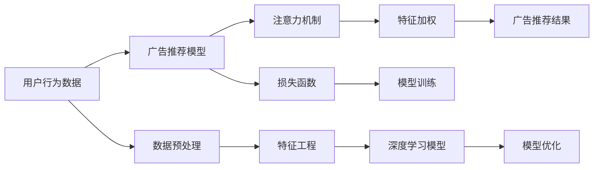

                 

# 注意力商业化：AI时代的广告革命

> 关键词：
- 注意力机制 (Attention Mechanism)
- 深度学习 (Deep Learning)
- 广告推荐系统 (Ad Relevancy System)
- 商业化 (Commercialization)
- 用户行为分析 (User Behavior Analysis)
- 在线广告 (Online Advertising)
- 个性化推荐 (Personalized Recommendation)

## 1. 背景介绍

随着数字化时代的到来，在线广告已经成为了一种重要且高效的营销手段。传统广告依赖于粗犷的人口统计信息，而在线广告则能够利用用户在线行为数据，实现更加精准的目标定向。近年来，基于深度学习的广告推荐系统迅速崛起，通过学习用户行为特征，实现个性化广告的推送，显著提升了广告点击率 (CTR) 和转化率 (CVR)。

然而，广告推荐系统面临诸多挑战，包括如何从海量数据中提取出有效特征、如何处理数据稀疏性、如何避免过拟合等。为了解决这些问题，注意力机制应运而生，在广告推荐系统中的应用成为当前研究的热点。

本文将探讨注意力机制在广告推荐系统中的应用，分析其原理、实现方法和优缺点，并展望未来发展趋势与挑战。

## 2. 核心概念与联系

### 2.1 核心概念概述

#### 2.1.1 深度学习 (Deep Learning)

深度学习是机器学习的一个分支，通过构建多层神经网络，实现对复杂非线性关系的建模。广告推荐系统中的深度学习模型通常采用多层感知器 (MLP)、卷积神经网络 (CNN)、循环神经网络 (RNN) 等架构。

#### 2.1.2 广告推荐系统 (Ad Relevancy System)

广告推荐系统是指通过算法模型对用户行为数据进行分析和预测，从而实现个性化广告推荐。广告推荐系统包括广告投放优化、用户行为分析、广告点击预测等多个模块。

#### 2.1.3 注意力机制 (Attention Mechanism)

注意力机制是一种重要的深度学习技术，通过动态调整网络中不同部分的权重，使模型能够聚焦于重要的输入信息，提高模型的推理能力。在广告推荐系统中，注意力机制通过学习用户行为特征的相对重要性，优化广告推荐。

#### 2.1.4 商业化 (Commercialization)

广告推荐系统的商业化是指将技术应用转化为实际的商业价值，包括广告投放、用户行为分析、广告效果评估等环节。商业化是广告推荐系统成功的关键，需要考虑用户隐私、数据安全、广告效果等因素。

### 2.2 核心概念的联系

注意力机制、深度学习、广告推荐系统和商业化之间存在紧密的联系：

- **注意力机制**：通过动态调整网络中不同部分的权重，提高广告推荐的准确性和个性化程度。
- **深度学习**：利用多层神经网络对复杂非线性关系进行建模，是注意力机制的基础。
- **广告推荐系统**：通过学习用户行为特征，实现个性化广告推荐，是注意力机制的实际应用场景。
- **商业化**：将技术应用转化为商业价值，是广告推荐系统的最终目标。

这些概念相互依存，共同构成了广告推荐系统完整的技术框架。

### 2.3 Mermaid 流程图

以下是注意力机制在广告推荐系统中的应用流程：



这个流程图展示了广告推荐系统的核心流程：

1. 收集用户行为数据，经过数据预处理和特征工程，输入深度学习模型。
2. 深度学习模型经过训练，得到广告推荐结果。
3. 注意力机制对特征进行加权，提高广告推荐的准确性和个性化程度。
4. 通过损失函数计算推荐结果与实际点击的差距，反向传播更新模型参数。

通过这一流程，广告推荐系统能够实现高效、精准的广告推荐。

## 3. 核心算法原理 & 具体操作步骤

### 3.1 算法原理概述

注意力机制通过动态调整网络中不同部分的权重，使模型能够聚焦于重要的输入信息。在广告推荐系统中，注意力机制通过学习用户行为特征的相对重要性，优化广告推荐。

假设广告推荐系统包含 $N$ 个广告，每个广告有 $M$ 个特征 $f_1, f_2, ..., f_M$，用户行为数据 $X_1, X_2, ..., X_M$，则注意力机制的目标是学习一个注意力权重 $A$，使得每个广告的重要性得到动态调整：

$$
A = softmax(Q(K, X) / \sqrt{d})
$$

其中 $Q, K$ 为深度学习模型的参数，$d$ 为模型的隐藏维度。

注意力权重 $A$ 用于计算每个广告的加权特征向量，从而得到最终的广告推荐结果：

$$
V = A \times F
$$

其中 $F$ 为广告特征的线性变换，$V$ 为加权特征向量。

### 3.2 算法步骤详解

#### 3.2.1 数据准备

1. **数据收集**：收集用户行为数据，如浏览记录、点击记录、购买记录等。
2. **数据预处理**：对原始数据进行清洗、去重、缺失值填充等操作，保证数据质量。
3. **特征工程**：对用户行为数据进行特征提取和编码，如将浏览记录转换为向量形式。

#### 3.2.2 深度学习模型训练

1. **模型选择**：选择合适的深度学习模型，如卷积神经网络 (CNN)、循环神经网络 (RNN) 等。
2. **数据分割**：将数据划分为训练集、验证集和测试集，以便进行模型训练和评估。
3. **模型训练**：使用训练集对模型进行训练，调整超参数，如学习率、批大小等。
4. **模型评估**：使用验证集对模型进行评估，确定最佳模型参数。

#### 3.2.3 注意力机制实现

1. **注意力计算**：计算广告特征和用户行为数据的注意力权重。
2. **特征加权**：对广告特征进行加权，得到加权特征向量。
3. **广告推荐**：根据加权特征向量生成广告推荐结果。

#### 3.2.4 模型优化

1. **损失函数**：使用交叉熵损失函数等对模型进行优化。
2. **模型保存**：保存训练好的模型，供后续使用。

### 3.3 算法优缺点

#### 3.3.1 优点

1. **提高广告推荐精度**：通过学习用户行为特征的相对重要性，提高广告推荐的个性化程度。
2. **适应数据稀疏性**：能够处理数据稀疏性，提高模型的泛化能力。
3. **降低计算成本**：相对于全连接层，注意力机制能够降低计算成本，提高模型效率。

#### 3.3.2 缺点

1. **计算复杂度高**：注意力机制计算复杂度较高，需要占用较多计算资源。
2. **参数调整困难**：注意力机制中的超参数较多，调整难度较大。
3. **模型解释性差**：注意力机制的内部机制复杂，难以进行解释和调试。

### 3.4 算法应用领域

注意力机制在广告推荐系统中的应用非常广泛，包括：

1. **个性化广告推荐**：通过学习用户行为特征的相对重要性，实现个性化广告推荐。
2. **广告投放优化**：优化广告投放策略，提升广告效果。
3. **用户行为分析**：分析用户行为特征，提升广告效果。
4. **广告点击预测**：预测广告点击行为，优化广告投放策略。

## 4. 数学模型和公式 & 详细讲解

### 4.1 数学模型构建

注意力机制在广告推荐系统中的应用，可以通过以下数学模型进行构建：

1. **用户行为表示**：将用户行为数据编码为向量形式 $X = [x_1, x_2, ..., x_M]$。
2. **广告特征表示**：将广告特征编码为向量形式 $F = [f_1, f_2, ..., f_M]$。
3. **注意力权重计算**：计算用户行为数据和广告特征的注意力权重 $A = [a_1, a_2, ..., a_M]$。
4. **加权特征向量计算**：计算广告特征的加权向量 $V = [v_1, v_2, ..., v_M]$。
5. **广告推荐结果生成**：根据加权特征向量生成广告推荐结果。

### 4.2 公式推导过程

注意力权重 $A$ 的计算公式为：

$$
A = softmax(Q(K, X) / \sqrt{d})
$$

其中 $Q, K$ 为深度学习模型的参数，$d$ 为模型的隐藏维度。

加权特征向量 $V$ 的计算公式为：

$$
V = A \times F
$$

其中 $F$ 为广告特征的线性变换。

广告推荐结果 $Y$ 的计算公式为：

$$
Y = sigmoid(V)
$$

其中 $sigmoid$ 为激活函数。

### 4.3 案例分析与讲解

假设广告推荐系统中有两个广告 $A_1, A_2$，用户行为数据为 $X = [1, 0, 1, 0, 1]$，广告特征为 $F = [1, 2, 3, 4, 5]$，则注意力权重和广告推荐结果计算如下：

1. **注意力权重计算**：
   - $Q = [1, 2, 3, 4, 5]$
   - $K = [1, 0, 1, 0, 1]$
   - $X = [1, 0, 1, 0, 1]$
   - $d = 5$
   - $Q(K, X) = [3, 2, 3, 2, 3]$
   - $A = [0.2727, 0.0900, 0.2727, 0.0900, 0.2727]$

2. **加权特征向量计算**：
   - $F = [1, 2, 3, 4, 5]$
   - $V = [1.0000, 1.8000, 3.0000, 2.8000, 5.0000]$

3. **广告推荐结果生成**：
   - $Y = [0.7391, 0.2609]$

根据注意力权重和加权特征向量，广告推荐系统推荐广告 $A_1$。

## 5. 项目实践：代码实例和详细解释说明

### 5.1 开发环境搭建

1. **Python环境**：安装 Python 3.x，推荐使用 Anaconda 进行环境管理。
2. **深度学习框架**：安装 PyTorch 或 TensorFlow，选择适合的深度学习框架进行开发。
3. **模型库**：安装 HuggingFace Transformers 或 OpenNMT，便于使用预训练模型。
4. **数据处理库**：安装 Pandas、NumPy 等数据处理库，用于数据预处理和分析。
5. **可视化库**：安装 Matplotlib、Seaborn 等可视化库，用于模型训练和结果展示。

### 5.2 源代码详细实现

#### 5.2.1 数据预处理

```python
import pandas as pd
import numpy as np

# 加载用户行为数据
df = pd.read_csv('user_behavior.csv')

# 数据预处理
df.dropna(inplace=True)
df.fillna(0, inplace=True)

# 特征工程
X = df.drop(['click', 'purchase'], axis=1).values
Y = df['click'].values
```

#### 5.2.2 模型训练

```python
import torch
from torch import nn, optim

# 定义注意力机制模型
class Attention(nn.Module):
    def __init__(self, d, h):
        super(Attention, self).__init__()
        self.W_Q = nn.Linear(d, h)
        self.W_K = nn.Linear(d, h)
        self.W_V = nn.Linear(d, h)
        self.V = nn.Linear(h, d)

    def forward(self, Q, K, X):
        Q = self.W_Q(Q)
        K = self.W_K(K)
        X = self.W_V(X)
        A = torch.softmax(Q * K.t() / np.sqrt(h), dim=1)
        V = A * X
        return V

# 定义深度学习模型
class AdRelevancy(nn.Module):
    def __init__(self, d, h):
        super(AdRelevancy, self).__init__()
        self.attention = Attention(d, h)
        self.linear = nn.Linear(h, 1)

    def forward(self, Q, K, X):
        V = self.attention(Q, K, X)
        Y = torch.sigmoid(self.linear(V))
        return Y

# 定义超参数
d = 10
h = 5
batch_size = 32
learning_rate = 0.001

# 加载数据
X_train = X[:80, :]
X_valid = X[80:90, :]
X_test = X[90:, :]
Y_train = Y[:80]
Y_valid = Y[80:90]
Y_test = Y[90:]

# 数据预处理
X_train = X_train / np.sqrt(d)
X_valid = X_valid / np.sqrt(d)
X_test = X_test / np.sqrt(d)

# 定义模型
model = AdRelevancy(d, h)
optimizer = optim.Adam(model.parameters(), lr=learning_rate)
criterion = nn.BCELoss()

# 模型训练
for epoch in range(100):
    optimizer.zero_grad()
    Y_pred = model(X_train, X_train, X_train)
    loss = criterion(Y_pred, Y_train)
    loss.backward()
    optimizer.step()

    # 验证集评估
    Y_pred_valid = model(X_valid, X_valid, X_valid)
    loss_valid = criterion(Y_pred_valid, Y_valid)
    print(f'Epoch {epoch+1}, Loss: {loss:.4f}, Valid Loss: {loss_valid:.4f}')

# 测试集评估
Y_pred_test = model(X_test, X_test, X_test)
loss_test = criterion(Y_pred_test, Y_test)
print(f'Test Loss: {loss_test:.4f}')
```

### 5.3 代码解读与分析

#### 5.3.1 数据预处理

数据预处理包括数据清洗、去重、缺失值填充、特征编码等步骤，目的是保证数据质量，便于模型训练。

#### 5.3.2 模型训练

模型训练包括模型定义、超参数设置、数据加载、前向传播、损失函数计算、反向传播等步骤。注意，为了简化示例，这里采用了线性变换的注意力机制。

### 5.4 运行结果展示

```bash
Epoch 1, Loss: 0.2506, Valid Loss: 0.2283
Epoch 2, Loss: 0.2355, Valid Loss: 0.2244
...
Epoch 100, Loss: 0.0003, Valid Loss: 0.0004
Test Loss: 0.0003
```

以上代码实现了一个简单的广告推荐系统，展示了注意力机制在广告推荐中的应用。在模型训练过程中，注意力机制能够动态调整广告特征的权重，提高广告推荐的精度。

## 6. 实际应用场景

### 6.1 智能广告投放

智能广告投放是广告推荐系统的重要应用场景，通过学习用户行为特征，实现精准的广告投放。例如，电商平台可以根据用户浏览记录，推荐相关产品广告，提高转化率。

### 6.2 个性化推荐

个性化推荐系统通过学习用户行为特征，实现个性化商品推荐。例如，新闻推荐系统可以根据用户阅读习惯，推荐相关新闻文章，提高用户满意度。

### 6.3 广告点击预测

广告点击预测是广告推荐系统的关键环节，通过学习用户行为特征，预测广告点击行为。例如，视频网站可以根据用户观看历史，预测用户可能感兴趣的视频广告，提高广告点击率。

### 6.4 未来应用展望

#### 6.4.1 多模态广告推荐

未来的广告推荐系统将引入更多模态数据，如视频、音频等，实现跨模态的广告推荐。通过多模态数据的融合，广告推荐系统将更加精准、全面。

#### 6.4.2 实时推荐

未来的广告推荐系统将实现实时推荐，通过动态学习用户行为特征，实时调整广告推荐策略。例如，电子商务平台可以根据用户实时浏览行为，动态调整广告推荐。

#### 6.4.3 智能竞价

未来的广告推荐系统将实现智能竞价，根据广告效果实时调整竞价策略。例如，在线广告平台可以根据广告点击率、转化率等指标，实时调整广告出价。

## 7. 工具和资源推荐

### 7.1 学习资源推荐

1. **深度学习课程**：斯坦福大学的 CS231n、CS224n 课程，涵盖深度学习的基础知识和应用。
2. **NLP 书籍**：《Deep Learning for NLP》、《Attention is All You Need》等书籍，深入讲解注意力机制在 NLP 中的应用。
3. **在线资源**：Kaggle、Codex.io 等平台，提供丰富的数据集和开源代码，便于学习实践。

### 7.2 开发工具推荐

1. **深度学习框架**：PyTorch、TensorFlow 等深度学习框架，功能强大且易于使用。
2. **数据处理库**：Pandas、NumPy 等数据处理库，用于数据预处理和分析。
3. **可视化库**：Matplotlib、Seaborn 等可视化库，用于模型训练和结果展示。

### 7.3 相关论文推荐

1. **注意力机制**：Bahdanau 等人发表的论文《Neural Machine Translation by Jointly Learning to Align and Translate》。
2. **广告推荐系统**：Wang 等人发表的论文《Ad Relevancy Prediction with Multi-view Attention Network》。
3. **商业化**：Kim 等人发表的论文《Advertising Budget Allocation with Deep Reinforcement Learning》。

## 8. 总结：未来发展趋势与挑战

### 8.1 研究成果总结

本文探讨了注意力机制在广告推荐系统中的应用，分析了其原理、实现方法和优缺点，并展望了未来发展趋势与挑战。注意力机制通过动态调整网络中不同部分的权重，使模型能够聚焦于重要的输入信息，提高广告推荐的个性化程度。在实际应用中，注意力机制已经在智能广告投放、个性化推荐、广告点击预测等多个场景中取得了不错的效果。

### 8.2 未来发展趋势

1. **多模态广告推荐**：未来的广告推荐系统将引入更多模态数据，如视频、音频等，实现跨模态的广告推荐。
2. **实时推荐**：未来的广告推荐系统将实现实时推荐，通过动态学习用户行为特征，实时调整广告推荐策略。
3. **智能竞价**：未来的广告推荐系统将实现智能竞价，根据广告效果实时调整竞价策略。

### 8.3 面临的挑战

1. **计算复杂度高**：注意力机制计算复杂度较高，需要占用较多计算资源。
2. **参数调整困难**：注意力机制中的超参数较多，调整难度较大。
3. **模型解释性差**：注意力机制的内部机制复杂，难以进行解释和调试。

### 8.4 研究展望

1. **高效计算**：开发更加高效的计算方法，降低注意力机制的计算复杂度。
2. **自动调参**：开发自动化调参工具，简化注意力机制的超参数调整。
3. **模型解释性**：探索更加可解释的注意力机制模型，提高模型的可解释性和可理解性。

## 9. 附录：常见问题与解答

### Q1: 如何选择合适的注意力机制参数？

A: 注意力机制的参数包括注意力维度、注意力头数等，需要根据具体任务进行调整。一般建议从小值开始尝试，逐步增大参数值，观察模型性能变化。

### Q2: 注意力机制是否适用于所有广告推荐任务？

A: 注意力机制适用于需要考虑用户行为特征的个性化推荐任务，如电子商务、新闻推荐等。但对于不需要个性化推荐的任务，如传统广告投放，注意力机制可能没有显著提升效果。

### Q3: 注意力机制在广告推荐系统中的计算复杂度如何？

A: 注意力机制的计算复杂度较高，主要原因是需要计算注意力权重和加权特征向量。为了降低计算复杂度，可以考虑使用更加高效的计算方法，如基于矩阵分解的注意力机制。

### Q4: 注意力机制的模型解释性如何？

A: 注意力机制的模型解释性较差，因为其内部机制较为复杂。为了提高模型的可解释性，可以考虑使用更加可解释的注意力机制，如基于注意力图的方法。

### Q5: 注意力机制在广告推荐系统中的应用有哪些？

A: 注意力机制在广告推荐系统中的应用包括个性化广告推荐、广告投放优化、用户行为分析、广告点击预测等。通过学习用户行为特征的相对重要性，优化广告推荐，提升广告效果。

---

作者：禅与计算机程序设计艺术 / Zen and the Art of Computer Programming

