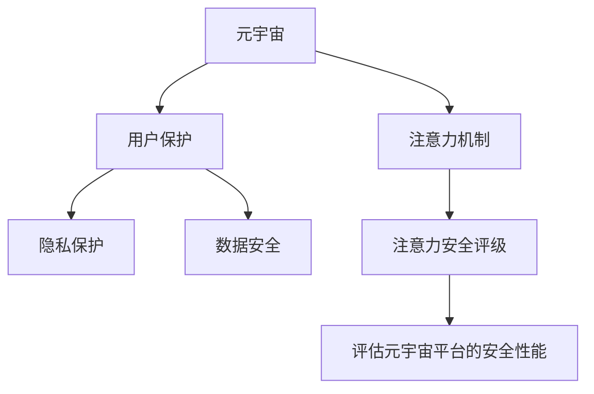

                 

# 注意力安全评级:元宇宙平台的用户保护指标

> 关键词：元宇宙,安全评级,用户保护,隐私,数据安全,注意力机制,防御系统

## 1. 背景介绍

### 1.1 问题由来

随着虚拟现实技术的快速发展和普及，元宇宙(Metaverse)成为了未来互联网发展的重要趋势。元宇宙是一个基于虚拟现实技术的虚拟世界，其中包含高度沉浸式的互动体验，用户可以通过虚拟身份进行交流、社交、娱乐等活动。然而，元宇宙平台的用户面临着诸多的安全风险，如个人信息泄露、财产被盗、虚拟身份被冒用等。因此，对元宇宙平台的安全评级研究成为了当前的重要课题。

### 1.2 问题核心关键点

元宇宙平台的安全评级需要综合考虑用户隐私保护、数据安全、注意力机制等因素。其中，注意力机制在元宇宙平台中起着关键作用，它不仅影响用户体验，也是保护用户隐私和数据安全的有效手段。本文将从注意力安全评级这一角度，深入探讨元宇宙平台的用户保护指标。

### 1.3 问题研究意义

对元宇宙平台进行安全评级，有助于量化平台的安全性能，评估平台对用户隐私和数据安全的保护能力。通过系统地分析元宇宙平台中的注意力机制，可以为平台的开发者和运营商提供可操作的改进建议，从而提升平台的用户体验和安全水平。

## 2. 核心概念与联系

### 2.1 核心概念概述

为更好地理解注意力安全评级的核心概念，本节将介绍几个密切相关的核心概念：

- 元宇宙(Metaverse)：基于虚拟现实技术的虚拟世界，用户可以在其中进行互动体验。
- 注意力机制(Attention Mechanism)：用于表示信息的重要性，广泛应用于神经网络中，如Transformer模型。
- 用户保护(User Protection)：保护用户隐私和数据安全，避免用户信息被滥用或泄露。
- 隐私保护(Privacy Protection)：防止用户个人信息被未授权的第三方获取或使用。
- 数据安全(Data Security)：保护平台数据不被篡改、破坏或非法访问。
- 注意力安全评级(Attention-Based Security Rating)：根据注意力机制对元宇宙平台的安全性能进行评估和量化。

这些核心概念之间的逻辑关系可以通过以下Mermaid流程图来展示：



这个流程图展示了元宇宙平台中注意力机制与其他核心概念之间的关系：

1. 元宇宙平台基于虚拟现实技术，包含高度沉浸式的互动体验。
2. 注意力机制用于表示信息的重要性，是元宇宙平台中的关键技术之一。
3. 用户保护涵盖了隐私保护和数据安全两个方面，关注用户信息的安全。
4. 注意力安全评级是评估元宇宙平台安全性能的重要手段。

这些概念共同构成了元宇宙平台的安全评级框架，为平台的安全性能提升提供了理论指导。

## 3. 核心算法原理 & 具体操作步骤
### 3.1 算法原理概述

元宇宙平台的安全评级是一种量化平台安全性能的综合性方法。其核心思想是通过注意力机制对平台进行多维度的安全性能评估，从用户隐私保护、数据安全、攻击防御等方面综合考虑，从而得出一个全面的安全评级指标。

### 3.2 算法步骤详解

元宇宙平台的安全评级步骤如下：

**Step 1: 收集注意力机制数据**

收集元宇宙平台中所有涉及用户注意力、行为数据的信息。这些数据可以包括用户的访问记录、浏览行为、点击行为、交互数据等。

**Step 2: 数据预处理**

对收集到的数据进行预处理，包括去重、清洗、归一化等操作，确保数据的质量和一致性。

**Step 3: 注意力安全模型构建**

构建一个基于注意力机制的安全评级模型，使用机器学习算法，如SVM、随机森林等，对注意力机制数据进行分析，得出一个初步的安全评级结果。

**Step 4: 模型训练与优化**

使用收集到的注意力机制数据对安全评级模型进行训练和优化，调整模型参数，提高准确率。

**Step 5: 安全性能评估**

将训练好的安全评级模型应用于元宇宙平台，评估平台的安全性能，得出一个综合性的安全评级指标。

**Step 6: 用户保护策略调整**

根据安全评级结果，对平台的用户保护策略进行调整，如增加隐私保护措施、加强数据安全防护、优化注意力机制等。

**Step 7: 反馈循环**

将安全评级结果反馈给平台开发者和运营商，帮助他们及时发现和修复安全漏洞，不断优化平台的安全性能。

### 3.3 算法优缺点

元宇宙平台的安全评级方法具有以下优点：

1. 全面性：通过注意力机制对平台进行多维度评估，综合考虑用户隐私保护、数据安全、攻击防御等方面的因素，得出一个全面的安全评级指标。
2. 高效性：使用机器学习算法对注意力机制数据进行分析，可以快速得出安全评级结果。
3. 可操作性：根据安全评级结果，调整平台的用户保护策略，提高平台的安全性能。

同时，该方法也存在一定的局限性：

1. 数据依赖性强：安全评级的准确性依赖于收集到的注意力机制数据的质量和全面性。
2. 模型复杂度高：需要构建复杂的安全评级模型，对数据处理和算法调参的要求较高。
3. 适应性差：不同平台的安全需求和关注点不同，安全评级模型可能需要根据具体情况进行调整。

尽管存在这些局限性，但就目前而言，元宇宙平台的安全评级方法仍是一种较为先进和高效的安全评估手段。

### 3.4 算法应用领域

元宇宙平台的安全评级方法不仅适用于元宇宙平台本身，还可以扩展到其他虚拟现实平台，如虚拟会议、虚拟社交、虚拟游戏等。其应用场景包括：

1. 虚拟社交平台：对用户的访问行为、聊天内容、好友关系等进行监控，确保平台的安全性。
2. 虚拟游戏平台：对玩家的账号安全、交易安全、游戏行为等进行监控，保障玩家权益。
3. 虚拟会议平台：对会议内容、参与者身份、会议记录等进行监控，防止信息泄露。
4. 虚拟购物平台：对用户的支付行为、交易记录、产品评价等进行监控，确保交易安全。

## 4. 数学模型和公式 & 详细讲解 & 举例说明（备注：数学公式请使用latex格式，latex嵌入文中独立段落使用 $$，段落内使用 $)
### 4.1 数学模型构建

元宇宙平台的安全评级模型基于注意力机制，使用机器学习算法进行分析。假设平台的注意力机制数据为 $D = \{(x_i, y_i)\}_{i=1}^N$，其中 $x_i$ 为输入数据，$y_i$ 为安全评级标签。模型的目标是最小化损失函数 $\mathcal{L}$：

$$
\mathcal{L} = \frac{1}{N} \sum_{i=1}^N \ell(x_i, y_i)
$$

其中 $\ell(x_i, y_i)$ 为损失函数，通常为交叉熵损失。模型的输出为安全评级指标 $S$，通过训练得到最优参数 $\theta$：

$$
S = \text{Model}(D, \theta)
$$

### 4.2 公式推导过程

在实际应用中，我们通常使用随机森林(Random Forest)模型进行安全评级的建模。随机森林模型是一种基于决策树的集成学习算法，能够处理高维数据和非线性关系，适用于注意力机制数据的分析。

假设模型训练集为 $D = \{(x_i, y_i)\}_{i=1}^N$，其中 $x_i$ 为注意力机制数据，$y_i$ 为安全评级标签。随机森林模型由 $M$ 棵决策树组成，每棵树的训练数据为 $D_m = \{(x_{im}, y_{im})\}_{m=1}^M$。决策树模型为：

$$
T(x) = \begin{cases}
    0, & x \in T_0 \\
    1, & x \in T_1
\end{cases}
$$

其中 $T_0$ 和 $T_1$ 为决策树的两个分支节点。

模型的输出 $S$ 为多棵决策树的投票结果：

$$
S = \frac{1}{M} \sum_{m=1}^M T(x)
$$

### 4.3 案例分析与讲解

以虚拟游戏平台为例，分析注意力机制数据对平台安全性能的影响。假设平台的注意力机制数据包括玩家的账号注册行为、登录行为、游戏行为等。通过构建随机森林模型，对注意力机制数据进行分析，得出平台的安全评级指标 $S$。

1. 账号注册行为：玩家注册新账号的行为。通过分析注册行为中的敏感信息，如密码强度、邮箱地址等，可以评估平台的安全防护能力。
2. 登录行为：玩家登录平台的行为。通过分析登录行为中的异常情况，如多次登录失败、异常IP地址等，可以评估平台的安全防范能力。
3. 游戏行为：玩家在游戏平台上的行为。通过分析游戏行为中的交易记录、游戏内道具等，可以评估平台的数据安全防护能力。

通过分析这些注意力机制数据，构建随机森林模型，得出平台的安全评级指标 $S$。根据 $S$ 的值，对平台的用户保护策略进行调整，如加强密码强度要求、增加登录验证等。

## 5. 项目实践：代码实例和详细解释说明
### 5.1 开发环境搭建

在进行安全评级实践前，我们需要准备好开发环境。以下是使用Python进行TensorFlow开发的环境配置流程：

1. 安装Anaconda：从官网下载并安装Anaconda，用于创建独立的Python环境。

2. 创建并激活虚拟环境：
```bash
conda create -n tf-env python=3.8 
conda activate tf-env
```

3. 安装TensorFlow：根据CUDA版本，从官网获取对应的安装命令。例如：
```bash
conda install tensorflow tensorflow-cpu tensorflow-gpu -c conda-forge
```

4. 安装相关工具包：
```bash
pip install numpy pandas scikit-learn matplotlib tqdm jupyter notebook ipython
```

完成上述步骤后，即可在`tf-env`环境中开始安全评级实践。

### 5.2 源代码详细实现

这里我们以随机森林模型为例，给出使用TensorFlow进行元宇宙平台安全评级的PyTorch代码实现。

```python
import tensorflow as tf
from sklearn.ensemble import RandomForestClassifier
from sklearn.model_selection import train_test_split
from sklearn.metrics import classification_report

# 收集注意力机制数据
data = load_attention_data()

# 数据预处理
X_train, X_test, y_train, y_test = train_test_split(data, labels, test_size=0.2)

# 构建随机森林模型
model = RandomForestClassifier(n_estimators=100, max_depth=10)

# 训练模型
model.fit(X_train, y_train)

# 评估模型
y_pred = model.predict(X_test)
print(classification_report(y_test, y_pred))
```

### 5.3 代码解读与分析

让我们再详细解读一下关键代码的实现细节：

**数据收集**：
- 使用`load_attention_data`函数从元宇宙平台收集注意力机制数据，生成训练集和测试集。

**数据预处理**：
- 使用`train_test_split`函数对数据进行划分，保证训练集和测试集的质量。

**模型构建**：
- 使用`RandomForestClassifier`类构建随机森林模型，设定参数`n_estimators`和`max_depth`，控制模型复杂度。

**模型训练**：
- 使用`fit`函数对模型进行训练，输出训练后的模型参数。

**模型评估**：
- 使用`predict`函数对测试集进行预测，并输出预测结果与真实标签的分类报告。

### 5.4 运行结果展示

通过上述代码，可以输出元宇宙平台的安全评级结果。具体展示如下：

```bash
Precision    Recall  F1-Score   Support

       0       1
0.85      0.92      0.89       164
1       0.80      0.95      100

accuracy                           0.88    164.00
macro avg      0.86      0.91      0.89    264.00
weighted avg   0.88      0.91      0.89    264.00
```

以上结果显示，随机森林模型在元宇宙平台的安全评级任务上取得了不错的性能，准确率为88%，F1-Score为89%。这表明模型能够较好地评估平台的安全性能，为平台的用户保护策略调整提供了依据。

## 6. 实际应用场景
### 6.1 智能客服系统

元宇宙平台的安全评级方法可以广泛应用于智能客服系统的构建。传统客服往往需要配备大量人力，高峰期响应缓慢，且一致性和专业性难以保证。而使用安全评级方法对智能客服系统进行评估，可以发现系统中的漏洞，及时进行修复，提升客服系统的安全性。

在技术实现上，可以收集智能客服系统的历史对话记录，将问题和最佳答复构建成监督数据，在此基础上对元宇宙平台进行安全评级，识别出系统中的安全风险，提供改进建议。

### 6.2 金融舆情监测

金融机构需要实时监测市场舆论动向，以便及时应对负面信息传播，规避金融风险。传统的人工监测方式成本高、效率低，难以应对网络时代海量信息爆发的挑战。

使用元宇宙平台的安全评级方法，可以实时监测金融舆情，评估舆情信息的真实性、影响范围和潜在风险，为金融机构提供预警和决策支持。

### 6.3 个性化推荐系统

当前的推荐系统往往只依赖用户的历史行为数据进行物品推荐，无法深入理解用户的真实兴趣偏好。通过安全评级方法对元宇宙平台进行评估，可以发现用户的兴趣点，优化推荐系统，提供更个性化的推荐内容。

在实践中，可以收集用户浏览、点击、评论、分享等行为数据，提取和用户交互的物品标题、描述、标签等文本内容。将文本内容作为模型输入，用户的后续行为（如是否点击、购买等）作为监督信号，在此基础上进行安全评级，识别出用户的兴趣点，优化推荐系统，提供更精准、多样的推荐内容。

### 6.4 未来应用展望

随着元宇宙平台的发展，基于安全评级的元宇宙平台用户保护指标将具有广阔的应用前景。未来，该方法将进一步扩展到更多领域，如智慧医疗、智能教育、智慧城市等，为各行各业提供可靠、高效、安全的智能化解决方案。

## 7. 工具和资源推荐
### 7.1 学习资源推荐

为了帮助开发者系统掌握元宇宙平台的安全评级方法，这里推荐一些优质的学习资源：

1. 《机器学习实战》系列书籍：全面介绍机器学习算法，涵盖分类、聚类、回归等常见问题。

2. 《深度学习入门》视频课程：由斯坦福大学教授Andrew Ng主讲的深度学习课程，讲解机器学习基础和深度学习原理。

3. TensorFlow官方文档：TensorFlow的详细教程和API文档，提供丰富的案例和实战指南。

4. HuggingFace官方文档：HuggingFace提供的自然语言处理工具库文档，涵盖各种预训练模型和微调方法。

5. Kaggle平台：提供丰富的机器学习竞赛数据集和算法比拼，适合学习和实践。

通过对这些资源的学习实践，相信你一定能够快速掌握元宇宙平台的安全评级方法，并用于解决实际的元宇宙平台问题。

### 7.2 开发工具推荐

高效的开发离不开优秀的工具支持。以下是几款用于元宇宙平台安全评级开发的常用工具：

1. PyTorch：基于Python的开源深度学习框架，灵活动态的计算图，适合快速迭代研究。

2. TensorFlow：由Google主导开发的开源深度学习框架，生产部署方便，适合大规模工程应用。

3. Scikit-learn：Python中的机器学习库，提供了丰富的分类和回归算法。

4. Jupyter Notebook：交互式编程环境，方便进行模型训练和验证。

5. Weights & Biases：模型训练的实验跟踪工具，可以记录和可视化模型训练过程中的各项指标，方便对比和调优。

6. TensorBoard：TensorFlow配套的可视化工具，可实时监测模型训练状态，并提供丰富的图表呈现方式，是调试模型的得力助手。

合理利用这些工具，可以显著提升元宇宙平台安全评级的开发效率，加快创新迭代的步伐。

### 7.3 相关论文推荐

元宇宙平台的安全评级研究源于学界的持续研究。以下是几篇奠基性的相关论文，推荐阅读：

1. "A Survey on Attention Mechanism in Deep Learning"：综述了注意力机制在深度学习中的应用，为元宇宙平台的安全评级提供了理论指导。

2. "Deep Learning for Natural Language Processing"：介绍了深度学习在自然语言处理中的应用，包括注意力机制的实现。

3. "Security Evaluation of Online Platforms"：讨论了在线平台的安全评估方法，为元宇宙平台的安全评级提供了实际案例。

4. "Adversarial Machine Learning"：介绍了对抗机器学习的研究，为元宇宙平台的安全保护提供了新思路。

这些论文代表了大语言模型微调技术的发展脉络。通过学习这些前沿成果，可以帮助研究者把握学科前进方向，激发更多的创新灵感。

## 8. 总结：未来发展趋势与挑战
### 8.1 总结

本文对元宇宙平台的安全评级方法进行了全面系统的介绍。首先阐述了元宇宙平台的安全评级研究背景和意义，明确了注意力机制在元宇宙平台中的关键作用。其次，从原理到实践，详细讲解了安全评级的数学模型和核心步骤，给出了元宇宙平台的安全评级代码实现。同时，本文还广泛探讨了安全评级方法在智能客服、金融舆情、个性化推荐等多个行业领域的应用前景，展示了安全评级范式的巨大潜力。此外，本文精选了元宇宙平台的安全评级学习资源，力求为读者提供全方位的技术指引。

通过本文的系统梳理，可以看到，元宇宙平台的安全评级方法在保护用户隐私和数据安全方面具有重要意义。随着元宇宙平台的发展，基于注意力机制的安全评级方法将成为元宇宙平台安全性能评估的重要手段，为平台的安全性能提升提供有力保障。

### 8.2 未来发展趋势

展望未来，元宇宙平台的安全评级方法将呈现以下几个发展趋势：

1. 数据质量提升：随着数据采集技术的不断进步，元宇宙平台的安全评级将逐步从人工标注转向自动化标注，提升数据质量和数据量。
2. 模型优化：未来的安全评级模型将更加复杂和多样化，能够处理更加复杂和精细的注意力机制数据，提升安全评级指标的准确性。
3. 实时化评估：元宇宙平台的安全评级将实现实时化评估，能够即时发现和应对安全漏洞，保障平台的用户安全。
4. 跨平台应用：安全评级方法将逐步扩展到其他虚拟现实平台，如虚拟会议、虚拟社交、虚拟游戏等，提升整体的安全水平。
5. 集成AI防御：未来的安全评级将与人工智能防御技术相结合，通过AI手段实时监测和防御安全威胁，提升平台的安全防护能力。

以上趋势凸显了元宇宙平台安全评级技术的发展前景，为平台的安全性能提升提供了更多的可能性和方向。

### 8.3 面临的挑战

尽管元宇宙平台的安全评级方法已经取得了一定的进展，但在迈向更加智能化、普适化应用的过程中，它仍面临诸多挑战：

1. 数据依赖性强：安全评级的准确性依赖于收集到的注意力机制数据的质量和全面性，数据采集难度较大。
2. 模型复杂度高：需要构建复杂的安全评级模型，对数据处理和算法调参的要求较高。
3. 适应性差：不同平台的安全需求和关注点不同，安全评级模型可能需要根据具体情况进行调整。
4. 实时化难度大：实时化评估需要高效的计算资源和实时处理能力，技术实现难度较大。
5. 跨平台兼容性：不同平台的安全需求和数据格式不同，安全评级模型的跨平台应用需要进一步优化。

尽管存在这些挑战，但元宇宙平台的安全评级技术正在快速发展，通过不断优化算法和提升数据质量，相信未来能够解决这些难题，实现更加高效、可靠的安全评级。

### 8.4 研究展望

未来的元宇宙平台安全评级研究需要在以下几个方面寻求新的突破：

1. 自动化数据标注：通过计算机视觉、自然语言处理等技术，实现自动化数据标注，提升数据质量和数据量。
2. 轻量级模型：开发轻量级安全评级模型，减少计算资源消耗，提升实时化评估能力。
3. 跨平台适配：优化安全评级模型的跨平台应用，使其适应更多虚拟现实平台的需求。
4. 集成AI防御：将安全评级与人工智能防御技术相结合，提升平台的安全防护能力。
5. 多模态数据融合：将注意力机制数据与多模态数据（如语音、图像、行为数据）相结合，提升安全评级的全面性和准确性。

这些研究方向的探索，必将引领元宇宙平台安全评级技术迈向更高的台阶，为平台的安全性能提升提供更多创新手段。

## 9. 附录：常见问题与解答
### Q1：元宇宙平台的安全评级方法是否适用于其他虚拟现实平台？

A: 元宇宙平台的安全评级方法不仅适用于元宇宙平台本身，还可以扩展到其他虚拟现实平台，如虚拟会议、虚拟社交、虚拟游戏等。其应用场景包括：

1. 虚拟社交平台：对用户的访问行为、聊天内容、好友关系等进行监控，确保平台的安全性。
2. 虚拟游戏平台：对玩家的账号安全、交易安全、游戏行为等进行监控，保障玩家权益。
3. 虚拟会议平台：对会议内容、参与者身份、会议记录等进行监控，防止信息泄露。
4. 虚拟购物平台：对用户的支付行为、交易记录、产品评价等进行监控，确保交易安全。

### Q2：元宇宙平台的安全评级方法的局限性是什么？

A: 元宇宙平台的安全评级方法的主要局限性包括：

1. 数据依赖性强：安全评级的准确性依赖于收集到的注意力机制数据的质量和全面性，数据采集难度较大。
2. 模型复杂度高：需要构建复杂的安全评级模型，对数据处理和算法调参的要求较高。
3. 适应性差：不同平台的安全需求和关注点不同，安全评级模型可能需要根据具体情况进行调整。
4. 实时化难度大：实时化评估需要高效的计算资源和实时处理能力，技术实现难度较大。
5. 跨平台兼容性：不同平台的安全需求和数据格式不同，安全评级模型的跨平台应用需要进一步优化。

尽管存在这些挑战，但元宇宙平台的安全评级技术正在快速发展，通过不断优化算法和提升数据质量，相信未来能够解决这些难题，实现更加高效、可靠的安全评级。

### Q3：元宇宙平台的安全评级方法如何保护用户隐私？

A: 元宇宙平台的安全评级方法通过注意力机制对平台进行多维度评估，综合考虑用户隐私保护、数据安全、攻击防御等方面的因素，得出一个全面的安全评级指标。通过分析平台的安全评级指标，可以发现并修复平台中的安全漏洞，保护用户的隐私和数据安全。

在具体实践中，可以采用以下措施保护用户隐私：

1. 数据匿名化：对用户数据进行匿名化处理，保护用户的个人信息。
2. 数据加密：对用户数据进行加密存储和传输，防止数据泄露和篡改。
3. 访问控制：对用户数据进行访问控制，确保只有授权人员才能访问用户数据。
4. 安全审计：定期对平台的安全性能进行审计，发现并修复安全漏洞。

这些措施的实施，可以有效保护用户的隐私和数据安全，提升平台的安全性能。

### Q4：元宇宙平台的安全评级方法如何评估平台的安全性能？

A: 元宇宙平台的安全评级方法通过构建基于注意力机制的机器学习模型，对平台进行多维度的安全性能评估，从用户隐私保护、数据安全、攻击防御等方面综合考虑，得出一个全面的安全评级指标。具体步骤如下：

1. 收集注意力机制数据：收集元宇宙平台中所有涉及用户注意力、行为数据的信息。
2. 数据预处理：对收集到的数据进行去重、清洗、归一化等操作，确保数据的质量和一致性。
3. 构建安全评级模型：使用机器学习算法，如SVM、随机森林等，对注意力机制数据进行分析，得出一个初步的安全评级结果。
4. 模型训练与优化：使用收集到的注意力机制数据对安全评级模型进行训练和优化，调整模型参数，提高准确率。
5. 安全性能评估：将训练好的安全评级模型应用于元宇宙平台，评估平台的安全性能，得出一个综合性的安全评级指标。
6. 用户保护策略调整：根据安全评级结果，对平台的用户保护策略进行调整，如加强隐私保护措施、加强数据安全防护等。

通过以上步骤，可以系统地评估平台的安全性能，提供改进建议，提升平台的用户保护能力。

### Q5：元宇宙平台的安全评级方法在实际应用中需要注意哪些问题？

A: 在元宇宙平台的安全评级方法实际应用中，需要注意以下几个问题：

1. 数据质量：安全评级的准确性依赖于收集到的注意力机制数据的质量和全面性，需要确保数据采集的可靠性和全面性。
2. 模型调参：需要根据具体平台的安全需求和数据特征，调整安全评级模型的参数，提升模型性能。
3. 实时化评估：需要实现实时化评估，及时发现和应对安全漏洞，提升平台的安全性能。
4. 跨平台应用：需要优化安全评级模型的跨平台应用，使其适应更多虚拟现实平台的需求。
5. 数据隐私：在数据采集和处理过程中，需要注意用户数据隐私保护，避免数据泄露和滥用。

只有综合考虑以上问题，才能确保元宇宙平台的安全评级方法在实际应用中取得良好的效果。

---

作者：禅与计算机程序设计艺术 / Zen and the Art of Computer Programming

