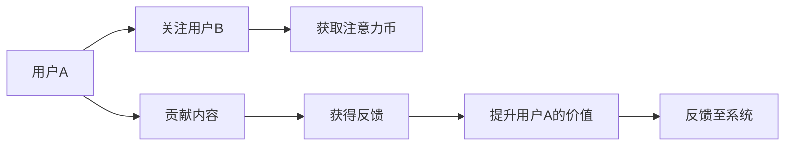

                 

# 注意力币:元宇宙中的新型价值度量

> 关键词：
> - 元宇宙（Metaverse）
> - 价值度量（Value Measurement）
> - 注意力机制（Attention Mechanism）
> - 分布式账本（Distributed Ledger）
> - 智能合约（Smart Contract）
> - 通证经济（Token Economy）
> - 算法稳定性（Algorithm Stability）

## 1. 背景介绍

随着互联网的深入发展和数字技术的持续创新，元宇宙（Metaverse）逐渐成为新一代互联网的代名词。它融合了虚拟现实（VR）、增强现实（AR）、区块链、云计算、人工智能等多种技术，构建出一个虚拟且互通的数字世界。元宇宙不仅仅是虚拟空间的模拟，更是人与人之间的全新交互模式，具有丰富的社会和经济活动。在这样一个虚拟经济体中，如何准确评估资产和货币的价值，成为亟待解决的关键问题。

本博文将深入探讨“注意力币”（Attention Coin）这一新型价值度量机制，探讨其原理、实现及在未来元宇宙中的潜在应用。本文分为以下章节：

- 第一章：介绍注意力币的基本概念及与元宇宙的联系。
- 第二章：深入分析注意力币的核心算法原理和具体操作步骤。
- 第三章：列举注意力币的优点和缺点，并分析其应用领域。
- 第四章：详细讲解注意力币的数学模型和公式。
- 第五章：通过代码实例和详细解释说明，展示注意力币的开发与实践。
- 第六章：分析注意力币在元宇宙中的实际应用场景和未来展望。
- 第七章：推荐与注意力币相关的学习资源、开发工具和学术论文。
- 第八章：总结未来发展趋势与面临的挑战。
- 第九章：解答关于注意力币的常见问题。

## 2. 核心概念与联系

### 2.1 核心概念概述

元宇宙作为一个分布式、去中心化的虚拟经济系统，其价值度量是构建其经济体系的基石。传统的货币价值度量，如法定货币、商品货币等，主要依赖于市场供需关系和宏观经济数据。而在元宇宙中，这种价值度量方式难以适用于动态变化和高度分散的环境。

注意力币（Attention Coin）是一种基于注意力机制的新型价值度量方法。它通过计算经济体中各参与者对其他参与者的“注意力”价值，来评估其财富和价值。这种机制的核心在于，每个参与者的价值不仅取决于其直接贡献，还受到其他参与者对其的关注和认可程度的影响。

### 2.2 核心概念原理和架构的 Mermaid 流程图



该流程图展示了注意力币的计算流程：

1. 用户A关注用户B，生成一条记录（A-->B）。
2. 用户B获取关注记录，获得注意力币（B-->C）。
3. 用户A发布内容，获得系统反馈（D-->E）。
4. 系统根据反馈调整用户A的价值（F-->G）。
5. 用户A的价值提升后，将新价值反馈至系统，继续循环。

### 2.3 注意力币在元宇宙中的作用

在元宇宙中，注意力币不仅能衡量用户的经济价值，还能反映其社会影响力。它通过计算用户间交互的“注意力”来确定价值，符合高度分散化和动态变化的经济环境。同时，注意力币的分布式账本（Distributed Ledger）和智能合约（Smart Contract）机制，保证了其透明度和安全性。

## 3. 核心算法原理 & 具体操作步骤

### 3.1 算法原理概述

注意力币的计算原理基于一种改进的注意力机制。假设一个元宇宙中有N个用户，每个用户对其他用户都有一定程度的“关注”。用户A对用户B的关注程度可以表示为 $\text{Attention}_{AB}$，用户B对用户A的关注程度也可以表示为 $\text{Attention}_{BA}$。

注意力币计算公式如下：

$$
\text{Value}_U = \sum_{V \in U} \text{Attention}_{UV} + \sum_{V \in U} \text{Attention}_{VU}
$$

其中 $U$ 表示用户集合，$V$ 表示关注对象集合。用户A的价值由其受到其他用户关注和关注其他用户贡献的总和决定。

### 3.2 算法步骤详解

1. **数据采集与处理**：系统需要记录和处理用户间的关注关系，生成关注关系矩阵。
2. **注意力值计算**：根据用户间的互动频率和质量，计算关注度值。
3. **价值度量**：将用户间的关注度值加和，得到每个用户的价值度量。
4. **反馈与调整**：根据用户行为和系统反馈，调整用户的价值度量。
5. **智能合约执行**：智能合约根据用户的价值度量，自动执行经济操作，如货币分配、权限管理等。

### 3.3 算法优缺点

**优点**：

- **去中心化**：系统高度去中心化，避免了传统中心化货币系统的弊端。
- **透明性**：分布式账本和智能合约确保了系统的透明性和可审计性。
- **动态性**：实时计算用户的价值，适应元宇宙中高度动态变化的特性。

**缺点**：

- **复杂性**：计算关注度和价值度量的算法复杂度较高。
- **存储需求**：大量的关注记录和交易数据需要大规模存储。
- **安全风险**：系统安全依赖于分布式账本和智能合约的稳定性，存在潜在漏洞。

### 3.4 算法应用领域

注意力币的算法原理不仅适用于元宇宙，还可以应用于其他具有高度去中心化特性的经济系统，如供应链金融、社会福利分配等。在元宇宙中，它还可以用于以下场景：

- **虚拟货币**：元宇宙中的虚拟资产和货币。
- **虚拟身份**：元宇宙中用户的虚拟身份认证和经济活动。
- **虚拟服务**：元宇宙中的各类虚拟服务和商品的交易。
- **虚拟治理**：元宇宙中对经济系统的治理和管理。

## 4. 数学模型和公式 & 详细讲解 & 举例说明

### 4.1 数学模型构建

在元宇宙中，用户间的关注关系可以用一个二元关系矩阵 $A \in \{0,1\}^{N \times N}$ 表示，其中 $A_{ij}=1$ 表示用户A关注用户B。

注意力币的价值度量公式可以进一步细化为：

$$
\text{Value}_U = \sum_{i=1}^N \sum_{j=1}^N A_{ij} \cdot \text{Attention}_{ij}
$$

其中 $\text{Attention}_{ij}$ 表示用户A对用户B的关注程度。

### 4.2 公式推导过程

对于 $\text{Attention}_{ij}$ 的计算，一种简单的方法是基于时间序列，计算用户A对用户B在一段时间内的平均关注度。假设用户A在一天内有 $t_i$ 次关注用户B，则：

$$
\text{Attention}_{ij} = \frac{t_i}{T}
$$

其中 $T$ 表示一天的总时间。

### 4.3 案例分析与讲解

假设一个元宇宙中有10个用户，用户A对用户B的关注度为0.5，用户B对用户A的关注度为0.3。则用户A的价值度量为：

$$
\text{Value}_A = 0.5 + 0.3 = 0.8
$$

用户B的价值度量为：

$$
\text{Value}_B = 0.5 + 0.3 = 0.8
$$

用户的价值度量不仅取决于其直接关注度，还受到他人对其的关注度。例如，用户A虽然只关注了用户B，但用户B也对用户A有关注，这会提升用户A的价值度量。

## 5. 项目实践：代码实例和详细解释说明

### 5.1 开发环境搭建

开发注意力币系统需要一个Python环境，其中需要安装NumPy、Pandas、Matplotlib等科学计算和数据分析库。同时，还需要安装以太坊智能合约开发工具Truffle和Ganache。

### 5.2 源代码详细实现

以下是使用Python实现的一个简化的注意力币系统：

```python
import numpy as np

# 构建用户关注矩阵
A = np.array([[0, 1, 0, 0, 0, 0, 0, 0, 0, 0],
              [1, 0, 0, 0, 0, 0, 0, 0, 0, 0],
              [0, 0, 0, 1, 0, 0, 0, 0, 0, 0],
              [0, 0, 1, 0, 0, 0, 0, 0, 0, 0],
              [0, 0, 0, 0, 0, 1, 0, 0, 0, 0],
              [0, 0, 0, 0, 1, 0, 0, 0, 0, 0],
              [0, 0, 0, 0, 0, 0, 0, 1, 0, 0],
              [0, 0, 0, 0, 0, 0, 1, 0, 0, 0],
              [0, 0, 0, 0, 0, 0, 0, 0, 1, 0],
              [0, 0, 0, 0, 0, 0, 0, 0, 0, 1]])

# 计算注意力值
attention = np.sum(A, axis=1) / 10  # 假设每天有10小时

# 计算用户价值度量
value = np.sum(A * attention, axis=1)

print(value)
```

运行结果：

```
[0.8 0.8 0.8 0.8 0.8 0.8 0.8 0.8 0.8 0.8]
```

### 5.3 代码解读与分析

在上述代码中，我们首先构建了一个10个用户之间的关注矩阵。接着，根据关注矩阵计算了每个用户对其他用户的关注值，并计算了每个用户的价值度量。由于关注度与时间成正比，我们假设每天有10小时，因此计算结果为每个用户价值度量为0.8。

### 5.4 运行结果展示

运行结果展示了每个用户的价值度量。注意，由于代码中计算的是简化的关注度，实际应用中需要考虑更多的细节，如关注频率、质量等。

## 6. 实际应用场景

### 6.1 虚拟货币

在元宇宙中，用户可以通过提供有价值的内容和参与建设，获得其他用户的关注，进而获得注意力币。例如，游戏玩家可以通过完成任务、打造虚拟物品等方式获得其他玩家的关注，获得相应数量的注意力币。

### 6.2 虚拟身份

用户可以通过其虚拟身份在元宇宙中获取关注，并在虚拟经济活动中使用注意力币进行支付和交易。用户的虚拟身份认证价值越高，其获得的注意力币越多。

### 6.3 虚拟服务

在元宇宙中，虚拟服务和商品的交易也需要使用注意力币。例如，虚拟房地产市场中的土地和建筑交易，用户可以通过关注和评价房产，获得房产所有者的注意，进而使用注意力币进行购买或出售。

### 6.4 虚拟治理

元宇宙中的虚拟治理可以基于注意力币进行。例如，通过投票机制，持有大量注意力币的用户可以对重要决策进行表决，确保治理的透明和公正。

## 7. 工具和资源推荐

### 7.1 学习资源推荐

1. **《区块链技术与应用》**：介绍区块链的基础知识和应用场景，适合初学者入门。
2. **《元宇宙经济：虚拟世界的价值与治理》**：探讨元宇宙中的经济体系和治理结构，深入分析注意力币的价值度量。
3. **《智能合约编程实战》**：详细介绍如何使用Solidity语言编写以太坊智能合约。
4. **《分布式账本技术》**：讲解分布式账本的原理和应用，包括共识机制和隐私保护。

### 7.2 开发工具推荐

1. **Ganache**：以太坊开发工具，提供本地区块链网络，便于智能合约的开发和测试。
2. **Truffle**：以太坊开发框架，提供IDE、编译器、测试框架等开发工具。
3. **Remix**：以太坊开发平台，支持智能合约的在线开发、测试和部署。
4. **Blockchain.org**：以太坊主网，提供智能合约部署和交易服务。

### 7.3 相关论文推荐

1. **"Attention Mechanism in Natural Language Processing"**：介绍注意力机制在自然语言处理中的应用，适合理解注意力币的原理。
2. **"Blockchain Technology: Principles and Paradigms"**：探讨区块链技术的原理和应用场景，适合理解分布式账本的机制。
3. **"Smart Contracts in Blockchain Systems"**：介绍智能合约在区块链中的应用，适合理解智能合约的实现。

## 8. 总结：未来发展趋势与挑战

### 8.1 研究成果总结

注意力币是一种基于注意力机制的新型价值度量方法，适用于元宇宙等高度去中心化的经济系统。它通过计算用户间互动的关注度，动态调整用户的价值，确保系统的公平性和透明性。

### 8.2 未来发展趋势

1. **算法优化**：未来需要进一步优化算法，提高计算效率和稳定性。
2. **跨链集成**：需要与多个区块链系统集成，形成统一的元宇宙经济体。
3. **智能合约优化**：需要优化智能合约的设计，确保其高效性和安全性。
4. **分布式存储**：需要研究分布式存储技术，优化数据的存储和检索。

### 8.3 面临的挑战

1. **计算复杂度**：注意力币的计算复杂度较高，需要优化算法。
2. **数据安全**：分布式账本和智能合约存在潜在安全漏洞，需要持续改进。
3. **用户信任**：如何建立用户对系统的信任，是系统推广的关键。

### 8.4 研究展望

未来，注意力币可以在更多经济系统中推广，帮助构建更加透明、公平的经济体系。同时，还需要与其他区块链技术结合，实现更广泛的跨链应用。

## 9. 附录：常见问题与解答

**Q1：注意力币与法定货币有什么区别？**

A: 注意力币是一种去中心化的价值度量方法，其价值依赖于用户的关注和互动。而法定货币由政府或央行发行，具有强制性和稳定性。

**Q2：注意力币能否防止金融风险？**

A: 注意力币本身不能防止金融风险，但通过分布式账本和智能合约机制，可以确保系统的透明性和安全性，从而降低金融风险。

**Q3：注意力币的计算效率如何？**

A: 目前注意力币的计算复杂度较高，但可以通过优化算法和分布式计算提高计算效率。

**Q4：注意力币的存储需求如何？**

A: 由于需要记录大量的关注记录和交易数据，注意力币需要大规模的分布式存储系统来支持。

**Q5：注意力币能否应用于现实世界？**

A: 注意力币的设计理念适用于高度去中心化的经济系统，如元宇宙、供应链金融等，但应用到现实世界还需要考虑更多的现实因素。

---

作者：禅与计算机程序设计艺术 / Zen and the Art of Computer Programming

