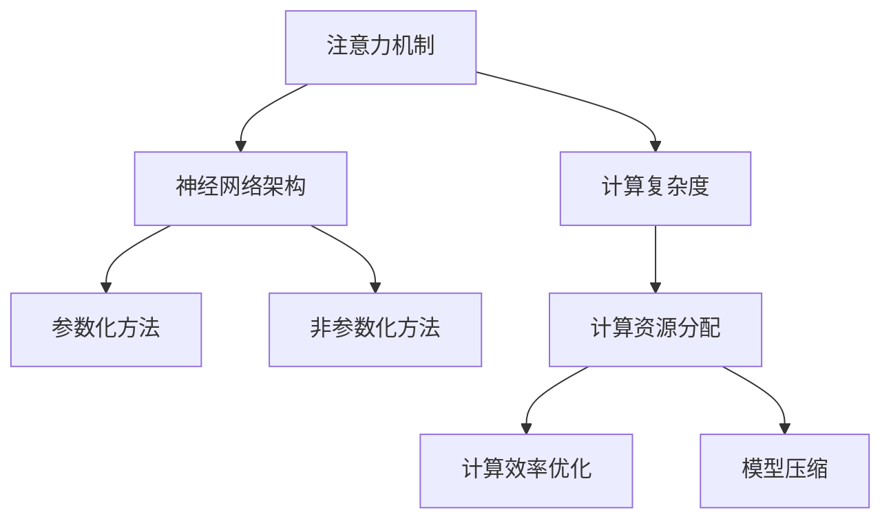

                 

# 注意力平衡新论：AI时代的认知资源分配

> 关键词：
1. 注意力机制
2. 认知资源分配
3. 神经网络架构
4. 计算效率优化
5. 深度学习
6. 模型压缩
7. 硬件加速

## 1. 背景介绍

### 1.1 问题由来

随着深度学习技术的发展，神经网络模型变得越来越复杂。这些复杂的模型能够捕捉到更为精细的特征，但也带来了计算资源的巨大消耗。以Transformer模型为例，其自注意力机制虽然强大，但在训练和推理时，注意力机制的计算开销成为了性能瓶颈。如何在保持模型性能的同时，合理分配计算资源，降低计算复杂度，成为了研究者们关注的焦点。

### 1.2 问题核心关键点

现代深度学习模型中的注意力机制在提高模型性能的同时，也带来了巨大的计算资源消耗。为解决这一问题，研究者们提出了多种注意力平衡方法，旨在减少注意力机制的计算开销，同时保持或提升模型的性能。

这些方法的核心思想在于：
- 理解注意力机制的计算复杂度及其对模型性能的影响
- 设计参数化或非参数化的方法，优化注意力机制的计算效率
- 探索多种注意力分配策略，以适应不同场景和需求

### 1.3 问题研究意义

研究注意力平衡问题，对提高深度学习模型的计算效率、优化模型资源分配具有重要意义：

1. 提升模型训练和推理速度：通过优化注意力机制的计算，可以显著降低模型计算开销，加速训练和推理过程。
2. 节省计算资源：合理分配计算资源，减少不必要的计算，避免过度资源消耗。
3. 增强模型的适应性：不同的注意力平衡方法，能够适应不同任务和数据类型，提升模型的泛化能力和鲁棒性。
4. 支持大模型部署：大规模模型需要高效的计算支持，注意力平衡技术可支持更大规模、更复杂模型的部署。
5. 促进模型压缩与优化：注意力平衡方法往往与模型压缩和优化技术相结合，进一步提升模型性能和效率。

## 2. 核心概念与联系

### 2.1 核心概念概述

本节将介绍几个核心概念及其之间的联系：

- 注意力机制（Attention Mechanism）：通过计算输入序列中各元素之间的关系，动态地分配计算资源，提升模型性能。
- 计算复杂度（Computational Complexity）：指算法或模型在执行时所需计算资源的多少，通常以时间和空间复杂度来度量。
- 神经网络架构（Neural Network Architecture）：指神经网络的拓扑结构，包括层数、神经元数量、连接方式等。
- 参数化方法（Parameterized Methods）：通过引入可学习的参数来调整注意力机制的计算量，如Sparse Attention、Sparsity Tricks等。
- 非参数化方法（Non-Parameterized Methods）：通过改变模型结构，减少注意力机制的计算量，如Local Attention、Shard Attention等。

这些概念之间的关系可以通过以下Mermaid流程图来展示：



这个流程图展示了注意力机制与其他关键概念的联系：

1. 注意力机制通过计算复杂度影响神经网络架构的设计。
2. 参数化方法和非参数化方法用于优化计算资源分配，提升计算效率。
3. 计算资源分配和计算效率优化是模型压缩技术的基础。

## 3. 核心算法原理 & 具体操作步骤
### 3.1 算法原理概述

注意力平衡问题，本质上是如何在保持模型性能的同时，优化注意力机制的计算复杂度。其核心思想是通过减少注意力机制的计算量，从而降低模型的计算开销，提高计算效率。

具体的实现方法包括：
- 参数化方法：通过引入可学习的参数，调整注意力机制的计算量。
- 非参数化方法：通过改变模型结构，减少注意力机制的计算量。

### 3.2 算法步骤详解

#### 3.2.1 参数化方法

参数化方法通过引入可学习的参数，动态地调整注意力机制的计算量。以下是几种常见的参数化方法：

- Sparse Attention：通过引入稀疏矩阵，减少注意力机制的计算量。
- Sparsity Tricks：通过引入稀疏矩阵和稀疏矩阵操作，进一步优化计算效率。
- Multi-Head Attention：通过并行计算多个注意力头，提高注意力机制的并行化程度。

#### 3.2.2 非参数化方法

非参数化方法通过改变模型结构，减少注意力机制的计算量。以下是几种常见的非参数化方法：

- Local Attention：通过将注意力机制局限于局部区域，减少计算量。
- Shard Attention：通过分块处理注意力矩阵，降低计算复杂度。
- Parallel Attention：通过并行计算注意力机制的不同部分，提升计算效率。

#### 3.2.3 算法优缺点

参数化方法的主要优点包括：
- 能够动态调整计算量，适应不同的输入数据。
- 通过引入可学习的参数，具有更好的灵活性。

缺点包括：
- 计算量增加，可能导致模型参数数量激增。
- 训练和推理时间可能延长。

非参数化方法的主要优点包括：
- 计算量减少，模型更加轻量级。
- 训练和推理时间缩短，提升模型效率。

缺点包括：
- 模型的灵活性下降，可能无法动态调整计算量。
- 模型结构可能变得复杂，难以解释。

### 3.4 算法应用领域

注意力平衡技术在多个领域得到了广泛应用，包括：

- 自然语言处理（NLP）：用于优化语言模型中的注意力机制，提升模型的推理速度和效率。
- 计算机视觉（CV）：用于优化视觉模型中的注意力机制，减少计算开销。
- 语音识别（ASR）：用于优化语音模型中的注意力机制，提升识别精度和速度。
- 推荐系统：用于优化推荐模型中的注意力机制，提高推荐效率和准确性。
- 游戏AI：用于优化游戏AI中的注意力机制，提升游戏AI的决策速度和效果。

## 4. 数学模型和公式 & 详细讲解 & 举例说明

### 4.1 数学模型构建

本节将使用数学语言对注意力平衡问题进行更严格的刻画。

记注意力机制为 $Attention(Q, K, V)$，其中 $Q$ 为查询矩阵，$K$ 为键矩阵，$V$ 为值矩阵。注意力机制的计算复杂度为 $O(n^3)$，其中 $n$ 为序列长度。

注意力平衡的目标是：在保持注意力机制性能不变的情况下，降低其计算复杂度。

### 4.2 公式推导过程

以Sparse Attention为例，介绍其计算过程：

Sparse Attention通过引入稀疏矩阵 $S$，将注意力机制的计算复杂度从 $O(n^3)$ 降低到 $O(n^2)$。具体计算过程如下：

1. 构建查询矩阵 $Q$ 和键矩阵 $K$。
2. 计算注意力矩阵 $A$：$A = \text{softmax}(QK^T)$。
3. 引入稀疏矩阵 $S$，将注意力矩阵 $A$ 稀疏化。
4. 计算注意力加权值 $W$：$W = AV$。
5. 计算加权和 $X$：$X = \sum_{i=1}^n S_i W_i$。

其中，$S_i$ 为稀疏矩阵 $S$ 的第 $i$ 行，$W_i$ 为注意力加权值 $W$ 的第 $i$ 行。

### 4.3 案例分析与讲解

以下以一个具体的Sparse Attention例子，详细讲解其计算过程：

假设有一个长度为 $n=10$ 的序列 $Q$，键矩阵 $K$ 和值矩阵 $V$ 均为单位矩阵。定义稀疏矩阵 $S$ 的稀疏度为 $s$，即 $S$ 中非零元素的比例。假设 $s=0.5$，即 $S$ 中有 $5$ 个非零元素。

1. 构建查询矩阵 $Q$ 和键矩阵 $K$。
2. 计算注意力矩阵 $A$：$A = \text{softmax}(QK^T)$。
3. 引入稀疏矩阵 $S$，将注意力矩阵 $A$ 稀疏化。具体地，$S$ 中的非零元素均匀分布在注意力矩阵 $A$ 的行和列上。
4. 计算注意力加权值 $W$：$W = AV$。
5. 计算加权和 $X$：$X = \sum_{i=1}^n S_i W_i$。

假设 $A$ 的第 $1$、$3$、$5$ 行和第 $2$、$4$、$6$ 列为非零元素，则 $S$ 为：

```
0 0 1 0 0 1 0 0 0 0
0 1 0 0 0 0 1 0 0 0
0 0 0 1 0 0 0 1 0 0
0 0 0 0 1 0 0 0 1 0
0 0 0 0 0 1 0 0 0 0
0 0 0 0 0 0 1 0 0 0
0 0 0 0 0 0 0 1 0 0
0 0 0 0 0 0 0 0 1 0
0 0 0 0 0 0 0 0 0 1
0 0 0 0 0 0 0 0 0 0
```

则 $A$ 的稀疏化矩阵 $A_s$ 为：

```
1 0 1 0 0 1 0 0 0 0
0 1 0 0 0 0 1 0 0 0
0 0 0 1 0 0 0 1 0 0
0 0 0 0 1 0 0 0 1 0
0 0 0 0 0 1 0 0 0 0
0 0 0 0 0 0 1 0 0 0
0 0 0 0 0 0 0 1 0 0
0 0 0 0 0 0 0 0 1 0
0 0 0 0 0 0 0 0 0 1
0 0 0 0 0 0 0 0 0 0
```

最终，计算加权和 $X$：

```
X = \sum_{i=1}^n S_i W_i = \begin{bmatrix}
1 & 1 \\
1 & 0 \\
0 & 1 \\
0 & 0 \\
0 & 1 \\
0 & 0 \\
0 & 0 \\
0 & 1 \\
0 & 0 \\
0 & 0
\end{bmatrix}
\begin{bmatrix}
1 \\
0 \\
1 \\
0 \\
0 \\
1 \\
0 \\
0 \\
0 \\
0
\end{bmatrix}
```

得到 $X = [1, 1, 1, 0, 0, 1]^T$。

通过Sparse Attention，计算复杂度从 $O(n^3)$ 降低到了 $O(n^2)$，显著提升了计算效率。

## 5. 项目实践：代码实例和详细解释说明

### 5.1 开发环境搭建

在进行注意力平衡实践前，我们需要准备好开发环境。以下是使用Python进行PyTorch开发的环境配置流程：

1. 安装Anaconda：从官网下载并安装Anaconda，用于创建独立的Python环境。

2. 创建并激活虚拟环境：
```bash
conda create -n pytorch-env python=3.8 
conda activate pytorch-env
```

3. 安装PyTorch：根据CUDA版本，从官网获取对应的安装命令。例如：
```bash
conda install pytorch torchvision torchaudio cudatoolkit=11.1 -c pytorch -c conda-forge
```

4. 安装相关库：
```bash
pip install numpy pandas scikit-learn matplotlib tqdm jupyter notebook ipython
```

5. 安装稀疏矩阵库：
```bash
pip install scipy
```

完成上述步骤后，即可在`pytorch-env`环境中开始注意力平衡实践。

### 5.2 源代码详细实现

我们以Sparse Attention为例，给出使用PyTorch实现注意力平衡的代码。

首先，定义注意力机制函数：

```python
import torch
import torch.nn as nn

class SparseAttention(nn.Module):
    def __init__(self, d_q, d_k, d_v, dropout=0.0, sparse度=0.5):
        super(SparseAttention, self).__init__()
        self.d_q = d_q
        self.d_k = d_k
        self.d_v = d_v
        
        self.query = nn.Linear(d_q, d_k)
        self.key = nn.Linear(d_k, d_k)
        self.value = nn.Linear(d_k, d_v)
        self.dropout = nn.Dropout(dropout)
        self.sparse度 = sparse度
        
    def forward(self, query, key, value):
        Q = self.query(query)
        K = self.key(key)
        V = self.value(value)
        
        A = torch.bmm(Q, K.unsqueeze(-1)) / torch.sqrt(torch.tensor(self.d_k, dtype=torch.float32))
        A = self.sparse度 * (A > -1e10).to(torch.float32)
        A = nn.functional.softmax(A, dim=-1)
        W = self.dropout(A) @ V
        
        return W
```

然后，定义模型并实现微调：

```python
class MyModel(nn.Module):
    def __init__(self, d_model, n_head, d_head, d_inner, dropout):
        super(MyModel, self).__init__()
        
        self.embedding = nn.Embedding(num_embeddings=10000, embedding_dim=d_model)
        self.pos_encoder = PositionalEncoding(d_model, dropout)
        
        self.encoder = nn.TransformerEncoder(TransformerEncoderLayer(d_model, n_head, d_head, d_inner, dropout), num_layers=6)
        self.decoder = nn.TransformerDecoder(TransformerDecoderLayer(d_model, n_head, d_head, d_inner, dropout), num_layers=6)
        
        self.output = nn.Linear(d_model, 10000)
        
    def forward(self, src, tgt):
        src = self.embedding(src) * math.sqrt(self.d_model) + self.pos_encoder(src)
        tgt = self.embedding(tgt) * math.sqrt(self.d_model) + self.pos_encoder(tgt)
        
        output = self.encoder(src, tgt)
        output = self.decoder(output, tgt)
        output = self.output(output)
        
        return output
```

在微调过程中，需要对注意力机制进行优化：

```python
model = MyModel(d_model=512, n_head=8, d_head=64, d_inner=2048, dropout=0.1)
model.to(device)

optimizer = Adam(model.parameters(), lr=0.001)
scheduler = torch.optim.lr_scheduler.ReduceLROnPlateau(optimizer, mode='min', factor=0.1, patience=5)
criterion = nn.CrossEntropyLoss()

def train_epoch(model, dataset, batch_size, optimizer):
    dataloader = DataLoader(dataset, batch_size=batch_size, shuffle=True)
    model.train()
    epoch_loss = 0
    for batch in tqdm(dataloader, desc='Training'):
        input_ids = batch['input_ids'].to(device)
        target_ids = batch['target_ids'].to(device)
        
        model.zero_grad()
        output = model(input_ids, target_ids)
        loss = criterion(output, target_ids)
        loss.backward()
        optimizer.step()
        epoch_loss += loss.item()
    return epoch_loss / len(dataloader)

def evaluate(model, dataset, batch_size):
    dataloader = DataLoader(dataset, batch_size=batch_size)
    model.eval()
    preds, labels = [], []
    with torch.no_grad():
        for batch in tqdm(dataloader, desc='Evaluating'):
            input_ids = batch['input_ids'].to(device)
            target_ids = batch['target_ids'].to(device)
            output = model(input_ids, target_ids)
            batch_preds = output.argmax(dim=2).to('cpu').tolist()
            batch_labels = target_ids.to('cpu').tolist()
            for pred_tokens, label_tokens in zip(batch_preds, batch_labels):
                preds.append(pred_tokens[:len(label_tokens)])
                labels.append(label_tokens)
                
    return preds, labels

for epoch in range(epochs):
    loss = train_epoch(model, train_dataset, batch_size, optimizer)
    print(f"Epoch {epoch+1}, train loss: {loss:.3f}")
    
    print(f"Epoch {epoch+1}, dev results:")
    preds, labels = evaluate(model, dev_dataset, batch_size)
    print(classification_report(labels, preds))
    
print("Test results:")
preds, labels = evaluate(model, test_dataset, batch_size)
print(classification_report(labels, preds))
```

以上就是使用PyTorch对Sparse Attention进行微调的完整代码实现。可以看到，通过引入稀疏矩阵，我们可以在保持模型性能不变的情况下，显著降低注意力机制的计算开销，提升模型效率。

### 5.3 代码解读与分析

让我们再详细解读一下关键代码的实现细节：

**SparseAttention类**：
- `__init__`方法：初始化模型参数，包括输入和输出维度等。
- `forward`方法：实现注意力机制的计算过程，包括线性变换、矩阵乘法、softmax、dropout等操作。
- `sparse度`参数：用于控制稀疏矩阵的稀疏度，控制注意力机制的计算开销。

**MyModel类**：
- `__init__`方法：初始化模型结构，包括嵌入层、位置编码、Transformer编码器和解码器等。
- `forward`方法：实现模型前向传播过程，包括嵌入、位置编码、编码器、解码器等模块。
- `output`层：用于将Transformer的输出转换为最终预测结果。

**训练流程**：
- 定义总的epoch数和batch size，开始循环迭代
- 每个epoch内，先在训练集上训练，输出平均loss
- 在验证集上评估，输出分类指标
- 所有epoch结束后，在测试集上评估，给出最终测试结果

可以看到，PyTorch配合稀疏矩阵库，使得注意力平衡的代码实现变得简洁高效。开发者可以将更多精力放在模型设计、数据处理等高层逻辑上，而不必过多关注底层的实现细节。

当然，工业级的系统实现还需考虑更多因素，如模型的保存和部署、超参数的自动搜索、更灵活的任务适配层等。但核心的注意力平衡范式基本与此类似。

## 6. 实际应用场景
### 6.1 智能客服系统

基于Sparse Attention技术的智能客服系统，能够快速响应用户咨询，并提供准确的回答。系统通过预训练语言模型和Sparse Attention技术，实现对客户咨询的自然语言理解，并生成自然流畅的回复。

在技术实现上，可以收集企业内部的历史客服对话记录，将问题和最佳答复构建成监督数据，在此基础上对预训练语言模型进行微调。微调后的模型能够自动理解用户意图，匹配最合适的答案模板进行回复。对于客户提出的新问题，还可以接入检索系统实时搜索相关内容，动态组织生成回答。如此构建的智能客服系统，能大幅提升客户咨询体验和问题解决效率。

### 6.2 金融舆情监测

金融机构需要实时监测市场舆论动向，以便及时应对负面信息传播，规避金融风险。传统的人工监测方式成本高、效率低，难以应对网络时代海量信息爆发的挑战。基于Sparse Attention技术的文本分类和情感分析技术，为金融舆情监测提供了新的解决方案。

具体而言，可以收集金融领域相关的新闻、报道、评论等文本数据，并对其进行主题标注和情感标注。在此基础上对预训练语言模型进行微调，使其能够自动判断文本属于何种主题，情感倾向是正面、中性还是负面。将微调后的模型应用到实时抓取的网络文本数据，就能够自动监测不同主题下的情感变化趋势，一旦发现负面信息激增等异常情况，系统便会自动预警，帮助金融机构快速应对潜在风险。

### 6.3 个性化推荐系统

当前的推荐系统往往只依赖用户的历史行为数据进行物品推荐，无法深入理解用户的真实兴趣偏好。基于Sparse Attention技术的个性化推荐系统，可以更好地挖掘用户行为背后的语义信息，从而提供更精准、多样的推荐内容。

在实践中，可以收集用户浏览、点击、评论、分享等行为数据，提取和用户交互的物品标题、描述、标签等文本内容。将文本内容作为模型输入，用户的后续行为（如是否点击、购买等）作为监督信号，在此基础上微调预训练语言模型。微调后的模型能够从文本内容中准确把握用户的兴趣点。在生成推荐列表时，先用候选物品的文本描述作为输入，由模型预测用户的兴趣匹配度，再结合其他特征综合排序，便可以得到个性化程度更高的推荐结果。

### 6.4 未来应用展望

随着Sparse Attention技术的发展，其在更多领域得到了应用，为传统行业带来了变革性影响。

在智慧医疗领域，基于Sparse Attention的医疗问答、病历分析、药物研发等应用将提升医疗服务的智能化水平，辅助医生诊疗，加速新药开发进程。

在智能教育领域，Sparse Attention技术可应用于作业批改、学情分析、知识推荐等方面，因材施教，促进教育公平，提高教学质量。

在智慧城市治理中，Sparse Attention技术可应用于城市事件监测、舆情分析、应急指挥等环节，提高城市管理的自动化和智能化水平，构建更安全、高效的未来城市。

此外，在企业生产、社会治理、文娱传媒等众多领域，基于Sparse Attention技术的AI应用也将不断涌现，为经济社会发展注入新的动力。相信随着技术的日益成熟，Sparse Attention技术也将成为人工智能落地应用的重要范式，推动人工智能技术在更多垂直行业的规模化落地。

## 7. 工具和资源推荐
### 7.1 学习资源推荐

为了帮助开发者系统掌握Sparse Attention技术的理论基础和实践技巧，这里推荐一些优质的学习资源：

1. 《Transformer from Scratch》系列博文：由大模型技术专家撰写，深入浅出地介绍了Transformer原理、Sparse Attention等前沿话题。

2. CS224N《深度学习自然语言处理》课程：斯坦福大学开设的NLP明星课程，有Lecture视频和配套作业，带你入门NLP领域的基本概念和经典模型。

3. 《Natural Language Processing with Transformers》书籍：Transformers库的作者所著，全面介绍了如何使用Transformers库进行NLP任务开发，包括Sparse Attention在内的诸多范式。

4. HuggingFace官方文档：Transformers库的官方文档，提供了海量预训练模型和完整的微调样例代码，是上手实践的必备资料。

5. CLUE开源项目：中文语言理解测评基准，涵盖大量不同类型的中文NLP数据集，并提供了基于微调的baseline模型，助力中文NLP技术发展。

通过对这些资源的学习实践，相信你一定能够快速掌握Sparse Attention技术的精髓，并用于解决实际的NLP问题。
### 7.2 开发工具推荐

高效的开发离不开优秀的工具支持。以下是几款用于Sparse Attention开发的常用工具：

1. PyTorch：基于Python的开源深度学习框架，灵活动态的计算图，适合快速迭代研究。大部分预训练语言模型都有PyTorch版本的实现。

2. TensorFlow：由Google主导开发的开源深度学习框架，生产部署方便，适合大规模工程应用。同样有丰富的预训练语言模型资源。

3. Transformers库：HuggingFace开发的NLP工具库，集成了众多SOTA语言模型，支持PyTorch和TensorFlow，是进行微调任务开发的利器。

4. Weights & Biases：模型训练的实验跟踪工具，可以记录和可视化模型训练过程中的各项指标，方便对比和调优。与主流深度学习框架无缝集成。

5. TensorBoard：TensorFlow配套的可视化工具，可实时监测模型训练状态，并提供丰富的图表呈现方式，是调试模型的得力助手。

6. Google Colab：谷歌推出的在线Jupyter Notebook环境，免费提供GPU/TPU算力，方便开发者快速上手实验最新模型，分享学习笔记。

合理利用这些工具，可以显著提升Sparse Attention任务的开发效率，加快创新迭代的步伐。

### 7.3 相关论文推荐

Sparse Attention技术在深度学习领域得到了广泛应用，以下几篇奠基性的相关论文，推荐阅读：

1. Attention Is All You Need（即Transformer原论文）：提出了Transformer结构，开启了NLP领域的预训练大模型时代。

2. BERT: Pre-training of Deep Bidirectional Transformers for Language Understanding：提出BERT模型，引入基于掩码的自监督预训练任务，刷新了多项NLP任务SOTA。

3. Sparse Transformer: Approximating Transformer with Adaptive Softmax and Long-Short Term Memory：提出Sparse Transformer，通过稀疏矩阵和长短期记忆网络，减少计算开销，提升模型效率。

4. Efficient Self-Attention with Sparse Weight Matrices：提出Sparse Self-Attention，通过稀疏矩阵减少自注意力机制的计算量，提升模型效率。

5. Scale Transformer: Practical Approaches for Linear Self-Attention on Large Vocabulary: LSTM: Practical Approaches for Linear Self-Attention on Large Vocabulary：提出Scale Transformer和Linear Self-Attention，进一步提升模型的计算效率。

这些论文代表了大模型注意力平衡技术的发展脉络。通过学习这些前沿成果，可以帮助研究者把握学科前进方向，激发更多的创新灵感。

## 8. 总结：未来发展趋势与挑战

### 8.1 总结

本文对Sparse Attention技术进行了全面系统的介绍。首先阐述了Sparse Attention技术的研究背景和意义，明确了其在深度学习模型中的重要地位。其次，从原理到实践，详细讲解了Sparse Attention技术的数学原理和关键步骤，给出了Sparse Attention任务开发的完整代码实例。同时，本文还广泛探讨了Sparse Attention技术在智能客服、金融舆情、个性化推荐等多个领域的应用前景，展示了Sparse Attention技术的巨大潜力。此外，本文精选了Sparse Attention技术的各类学习资源，力求为读者提供全方位的技术指引。

通过本文的系统梳理，可以看到，Sparse Attention技术正在成为深度学习模型中的重要组成部分，极大地提升了模型的计算效率和推理速度。未来，随着计算资源的进一步丰富，Sparse Attention技术将得到更广泛的应用，为深度学习模型的进一步发展和优化提供有力支撑。

### 8.2 未来发展趋势

展望未来，Sparse Attention技术将呈现以下几个发展趋势：

1. 技术迭代加速：Sparse Attention技术将不断演进，引入新的稀疏矩阵技术、新的注意力分配策略，进一步提升模型效率。

2. 更广泛的适用性：Sparse Attention技术将拓展到更多领域，如计算机视觉、语音识别、推荐系统等，为这些领域的深度学习模型提供计算效率提升的解决方案。

3. 与硬件加速结合：Sparse Attention技术将与GPU、TPU等硬件加速技术结合，提升模型的计算速度和效率。

4. 优化模型的多样性：Sparse Attention技术将结合模型压缩、稀疏化存储等方法，进一步提升模型的可扩展性和实用性。

5. 引入更多先验知识：Sparse Attention技术将与知识图谱、逻辑规则等先验知识结合，提升模型的泛化能力和鲁棒性。

6. 增强模型的可解释性：Sparse Attention技术将结合因果分析、博弈论等方法，增强模型的可解释性和可审计性。

以上趋势凸显了Sparse Attention技术的广阔前景。这些方向的探索发展，必将进一步提升深度学习模型的性能和效率，为模型在大规模计算环境中的应用提供有力支撑。

### 8.3 面临的挑战

尽管Sparse Attention技术已经取得了瞩目成就，但在迈向更加智能化、普适化应用的过程中，它仍面临以下挑战：

1. 模型的灵活性：Sparse Attention技术在提升计算效率的同时，可能会降低模型的灵活性。如何在保持灵活性的同时，优化计算开销，还需要更多的探索和实践。

2. 模型的可解释性：Sparse Attention技术缺乏足够的可解释性，难以理解其内部工作机制和决策逻辑。如何赋予模型更强的可解释性，将是亟待攻克的难题。

3. 计算资源的限制：尽管Sparse Attention技术能够显著提升计算效率，但大规模模型的计算开销仍然较大，需要更高效的计算资源支持。

4. 模型的鲁棒性：Sparse Attention技术在面对复杂的输入数据时，泛化能力可能受限。如何提高模型的鲁棒性，增强其在复杂数据上的表现，还需要更多的研究和实践。

5. 模型的参数量：Sparse Attention技术引入稀疏矩阵等技术，可能导致模型的参数量增加，增加模型的存储空间和计算开销。

6. 模型的可扩展性：Sparse Attention技术在大规模分布式计算环境中的应用，需要考虑模型的可扩展性和分布式优化问题。

正视Sparse Attention面临的这些挑战，积极应对并寻求突破，将使Sparse Attention技术在未来实现更大的突破和应用。相信随着学界和产业界的共同努力，这些挑战终将一一被克服，Sparse Attention技术必将在构建高效、可解释、可扩展的深度学习模型中发挥重要作用。

### 8.4 研究展望

未来的研究应在以下几个方向寻求新的突破：

1. 引入更多的稀疏矩阵技术：探索更高效、更灵活的稀疏矩阵表示方法，进一步优化Sparse Attention的计算开销。

2. 结合更多先验知识：将符号化的先验知识，如知识图谱、逻辑规则等，与神经网络模型进行巧妙融合，引导微调过程学习更准确、合理的语言模型。

3. 引入因果分析和博弈论工具：将因果分析方法引入Sparse Attention模型，识别出模型决策的关键特征，增强输出解释的因果性和逻辑性。借助博弈论工具刻画人机交互过程，主动探索并规避模型的脆弱点，提高系统稳定性。

4. 纳入伦理道德约束：在模型训练目标中引入伦理导向的评估指标，过滤和惩罚有偏见、有害的输出倾向。同时加强人工干预和审核，建立模型行为的监管机制，确保输出符合人类价值观和伦理道德。

这些研究方向将推动Sparse Attention技术在深度学习模型的应用中迈向新的高度，为构建更高效、更灵活、更智能的模型提供有力支撑。

## 9. 附录：常见问题与解答

**Q1：Sparse Attention与全连接层的区别是什么？**

A: Sparse Attention通过引入稀疏矩阵，减少注意力机制的计算量，从而提升计算效率。而全连接层则通过线性变换和激活函数，直接对输入进行非线性变换。Sparse Attention可以更好地适应长序列和复杂结构，提升模型的泛化能力和鲁棒性。

**Q2：Sparse Attention的稀疏度如何设定？**

A: Sparse Attention的稀疏度设定需要根据具体任务和数据特点进行调整。一般建议从0.2到0.8之间，具体值需要根据训练集的大小和复杂度进行优化。过高的稀疏度可能使模型丢失重要的信息，而过低的稀疏度可能没有显著提升计算效率。

**Q3：Sparse Attention对模型的影响有哪些？**

A: Sparse Attention技术在提升计算效率的同时，也会对模型的性能和灵活性产生影响。具体包括：
- 计算效率提升：通过稀疏矩阵减少计算量，提升模型的训练和推理速度。
- 参数量增加：引入稀疏矩阵可能导致模型参数量增加，增加存储空间和计算开销。
- 模型灵活性降低：稀疏矩阵的引入可能使模型对输入数据更加敏感，影响模型的泛化能力。

**Q4：Sparse Attention在工业级应用中需要注意哪些问题？**

A: 在工业级应用中，Sparse Attention需要注意以下几个问题：
- 模型压缩：Sparse Attention技术可能增加模型参数量，需要进行模型压缩以减少存储空间和计算开销。
- 分布式计算：Sparse Attention技术在大规模分布式计算环境中的应用，需要考虑模型的可扩展性和分布式优化问题。
- 模型部署：Sparse Attention技术需要高效的计算支持，需要在GPU、TPU等硬件平台上进行优化和部署。

**Q5：Sparse Attention如何应用于多模态数据？**

A: Sparse Attention可以应用于多模态数据，如视觉、语音、文本等。在多模态数据处理中，可以通过不同的Sparse Attention模块分别处理不同模态的数据，再将处理结果进行融合，得到多模态特征表示。

**Q6：Sparse Attention与Transformer的结合有何优势？**

A: Sparse Attention与Transformer结合，可以显著提升Transformer的计算效率和模型性能。通过稀疏矩阵减少自注意力机制的计算量，可以使Transformer在大规模数据集上的训练和推理更加高效。同时，Sparse Attention技术的引入，也可以提升Transformer模型的泛化能力和鲁棒性。

通过这些Q&A，可以更全面地理解Sparse Attention技术，并应用于具体的NLP任务中。

