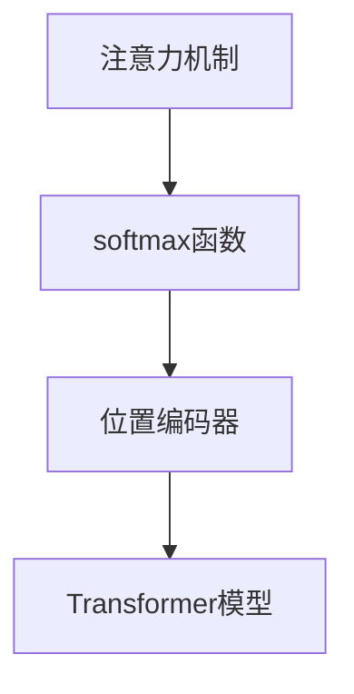

                 

# 注意力机制：softmax和位置编码器的应用

> 关键词：注意力机制,softmax,位置编码器,Transformer模型,自适应机制,自然语言处理

## 1. 背景介绍

### 1.1 问题由来

在现代深度学习中，尤其是自然语言处理(Natural Language Processing, NLP)领域，注意力机制(Attention Mechanism)扮演了至关重要的角色。它通过对输入数据的加权关注，帮助模型更好地捕捉长程依赖，提升模型的表达能力。尤其在Transformer模型中，注意力机制的引入彻底改变了NLP任务的处理方式，成为序列到序列(Sequence-to-Sequence, Seq2Seq)任务的强大工具。

然而，注意力机制的背后是如何通过计算将输入序列映射到输出序列的复杂过程，以及如何通过位置编码器(Positional Encoder)确保时间顺序的保留，仍然存在一些令人困惑的概念。本文将对注意力机制的核心原理进行深入讲解，并通过实际代码实例展示其在Transformer模型中的应用。

### 1.2 问题核心关键点

理解注意力机制的核心在于以下几个关键点：
1. 注意力机制的数学基础：理解softmax函数和注意力向量的计算过程。
2. 位置编码器的设计理念：如何通过学习到的位置信息保留序列的时间顺序。
3. 多头注意力机制：了解多头注意力如何通过并行化的方式增强模型的表达力。
4. 自适应机制：掌握注意力权重如何随输入和上下文动态变化，提高模型适应性。

这些关键点构成了理解注意力机制和Transformer模型的基础，本文将围绕这些点展开深入讨论。

## 2. 核心概念与联系

### 2.1 核心概念概述

本节将介绍几个密切相关的核心概念，以便读者更好地理解注意力机制和位置编码器的工作原理：

- 注意力机制(Attention Mechanism)：通过计算输入序列与查询序列的相似度，对输入序列的不同位置进行加权，得到注意力的向量表示。
- softmax函数：一种将向量映射到概率分布的函数，常用于计算注意力权重。
- 位置编码器(Positional Encoder)：一种设计用于保留序列时间顺序的嵌入层，通常使用正弦/余弦函数进行编码。
- Transformer模型：一种基于自注意力机制的深度神经网络结构，用于处理序列到序列的任务，如机器翻译、文本生成等。

这些核心概念通过以下Mermaid流程图展示它们之间的联系：



其中，注意力机制通过softmax函数计算权重，同时借助位置编码器保留序列的时间顺序。最终，Transformer模型通过多头注意力机制进行信息处理，提升模型的表达力和适应性。

## 3. 核心算法原理 & 具体操作步骤

### 3.1 算法原理概述

注意力机制的核心是计算输入序列与查询序列之间的相似度，并根据相似度生成注意力权重。具体地，对于输入序列 $\mathbf{X} = \{x_1, x_2, ..., x_T\}$ 和查询序列 $\mathbf{Q} = \{q_1, q_2, ..., q_T\}$，注意力机制通过计算注意力权重向量 $\mathbf{W} \in \mathbb{R}^{T \times T}$，使得模型可以动态地关注输入序列中与查询序列最相关的部分。

注意力权重 $\mathbf{W}$ 通常通过softmax函数计算得到：

$$
\mathbf{W}_{ij} = \frac{e^{\text{similarity}(\mathbf{x}_i, \mathbf{q}_j)}}{\sum_{k=1}^T e^{\text{similarity}(\mathbf{x}_i, \mathbf{q}_j)}}
$$

其中，$\text{similarity}(\mathbf{x}_i, \mathbf{q}_j)$ 表示输入序列 $x_i$ 与查询序列 $q_j$ 之间的相似度，通常是向量内积或点积。通过softmax函数，将相似度转换为概率分布，得到注意力权重 $\mathbf{W}$。

### 3.2 算法步骤详解

具体来说，Transformer模型中注意力机制的计算步骤如下：

**Step 1: 查询向量生成**
- 对输入序列 $\mathbf{X} = \{x_1, x_2, ..., x_T\}$ 中的每个元素 $x_i$，通过线性变换和激活函数（通常使用ReLU）生成查询向量 $\mathbf{Q}_i = \mathbf{W}_q x_i + b_q$。

**Step 2: 注意力权重计算**
- 将查询向量 $\mathbf{Q}_i$ 与输入序列中的所有元素 $x_j$ 进行点积操作，得到中间结果 $\mathbf{S}_{ij} = \mathbf{Q}_i^T \mathbf{K}_j$。
- 将 $\mathbf{S}_{ij}$ 通过softmax函数计算出注意力权重 $\mathbf{W}_{ij}$。

**Step 3: 注意力向量计算**
- 将注意力权重 $\mathbf{W}_{ij}$ 与输入序列 $x_j$ 进行加权求和，得到注意力向量 $\mathbf{V}_i = \sum_{j=1}^T \mathbf{W}_{ij} x_j$。

**Step 4: 多头注意力计算**
- 将上述过程进行 $H$ 次重复，得到 $H$ 个注意力向量 $\mathbf{V}^{(1)}, \mathbf{V}^{(2)}, ..., \mathbf{V}^{(H)}$。
- 将这些向量进行拼接，得到最终的注意力向量 $\mathbf{V} = [\mathbf{V}^{(1)}, \mathbf{V}^{(2)}, ..., \mathbf{V}^{(H)}]$。

### 3.3 算法优缺点

注意力机制的主要优点包括：
1. 提升模型的表达力：通过动态关注输入序列的不同部分，模型能够更灵活地处理长程依赖和复杂结构。
2. 提高模型的泛化能力：通过并行化的多头注意力，模型可以同时关注多个特征，提升模型的泛化性能。
3. 减少计算复杂度：相比于传统的循环神经网络，注意力机制可以通过线性计算实现，提高了计算效率。

同时，注意力机制也存在一些缺点：
1. 计算复杂度较高：尽管线性计算，但由于需要计算所有输入序列和查询序列的点积，计算量仍然较大。
2. 模型参数较多：多头注意力和位置编码器增加了模型的参数量，需要更多的计算资源。
3. 容易过拟合：由于多个注意头的并行计算，模型容易过拟合于训练集，导致泛化性能下降。

### 3.4 算法应用领域

注意力机制在NLP领域得到了广泛的应用，主要体现在以下几个方面：

- 机器翻译：通过多头注意力机制，模型可以同时关注源语言和目标语言，提高翻译质量。
- 文本生成：在文本生成任务中，注意力机制可以动态关注上下文信息，生成更加连贯的文本。
- 问答系统：通过注意力机制，模型可以自动关注问题中的关键信息，提高问答的准确性。
- 文本摘要：通过注意力机制，模型可以动态关注文本中的关键句子，生成高质量的摘要。

## 4. 数学模型和公式 & 详细讲解 & 举例说明

### 4.1 数学模型构建

注意力机制的数学模型通常由查询向量 $\mathbf{Q}_i$、键向量 $\mathbf{K}_j$ 和值向量 $\mathbf{V}_j$ 组成。通过计算注意力权重 $\mathbf{W}_{ij}$，得到注意力向量 $\mathbf{V}_i$，最终生成输出 $\mathbf{O}_i$。以下是注意力机制的数学模型构建：

$$
\mathbf{Q}_i = \mathbf{W}_q x_i + b_q
$$

$$
\mathbf{S}_{ij} = \mathbf{Q}_i^T \mathbf{K}_j
$$

$$
\mathbf{W}_{ij} = \frac{e^{\mathbf{S}_{ij}}}{\sum_{k=1}^T e^{\mathbf{S}_{ik}}}
$$

$$
\mathbf{V}_i = \sum_{j=1}^T \mathbf{W}_{ij} \mathbf{V}_j
$$

$$
\mathbf{O}_i = \mathbf{W}_o \mathbf{V}_i + b_o
$$

其中，$\mathbf{W}_q, \mathbf{W}_o$ 为线性变换矩阵，$b_q, b_o$ 为偏置向量。

### 4.2 公式推导过程

以一个简单的例子来说明注意力机制的计算过程。假设输入序列 $\mathbf{X} = \{x_1, x_2, x_3\}$，查询向量 $\mathbf{Q} = \{q_1, q_2, q_3\}$，键向量 $\mathbf{K} = \{k_1, k_2, k_3\}$，值向量 $\mathbf{V} = \{v_1, v_2, v_3\}$。计算注意力权重 $\mathbf{W}$ 和注意力向量 $\mathbf{V}_i$ 的过程如下：

1. 生成查询向量 $\mathbf{Q}_i$：
$$
\mathbf{Q}_1 = \begin{bmatrix} w_{q1} x_1 + b_q \\ w_{q2} x_2 + b_q \\ w_{q3} x_3 + b_q \end{bmatrix}
$$

2. 计算中间结果 $\mathbf{S}_{ij}$：
$$
\mathbf{S}_{11} = \begin{bmatrix} q_1 & k_1 \end{bmatrix}, \mathbf{S}_{12} = \begin{bmatrix} q_2 & k_2 \end{bmatrix}, \mathbf{S}_{13} = \begin{bmatrix} q_3 & k_3 \end{bmatrix}
$$

3. 计算注意力权重 $\mathbf{W}_{ij}$：
$$
\mathbf{W}_{11} = \frac{e^{\mathbf{S}_{11}}}{e^{\mathbf{S}_{11}} + e^{\mathbf{S}_{12}} + e^{\mathbf{S}_{13}}}, \mathbf{W}_{12} = \frac{e^{\mathbf{S}_{12}}}{e^{\mathbf{S}_{11}} + e^{\mathbf{S}_{12}} + e^{\mathbf{S}_{13}}}, \mathbf{W}_{13} = \frac{e^{\mathbf{S}_{13}}}{e^{\mathbf{S}_{11}} + e^{\mathbf{S}_{12}} + e^{\mathbf{S}_{13}}}
$$

4. 计算注意力向量 $\mathbf{V}_i$：
$$
\mathbf{V}_1 = \begin{bmatrix} w_{v1} v_1 & w_{v2} v_2 & w_{v3} v_3 \end{bmatrix} \begin{bmatrix} \mathbf{W}_{11} \\ \mathbf{W}_{12} \\ \mathbf{W}_{13} \end{bmatrix}
$$

5. 生成输出 $\mathbf{O}_i$：
$$
\mathbf{O}_1 = \begin{bmatrix} w_{o1} \mathbf{V}_1 + b_o \end{bmatrix}
$$

### 4.3 案例分析与讲解

下面以机器翻译为例，展示注意力机制在Transformer模型中的具体应用。

假设输入序列为源语言句子 "I love you"，查询向量 $\mathbf{Q}$ 为对应的目标语言词汇表中的 "I" 向量。对于输入序列中的每个单词，查询向量 $\mathbf{Q}_i$ 会被输入到注意力层中，通过计算注意力权重 $\mathbf{W}_{ij}$ 和注意力向量 $\mathbf{V}_i$，生成输出序列中的 "Je t'aime"。

具体来说，注意力层首先对输入序列中的每个单词计算查询向量 $\mathbf{Q}_i$，然后将这些查询向量与目标词汇表中的所有单词对应的键向量 $\mathbf{K}_j$ 进行点积，得到中间结果 $\mathbf{S}_{ij}$。接着，通过softmax函数计算出注意力权重 $\mathbf{W}_{ij}$，再将这些权重与目标词汇表中的值向量 $\mathbf{V}_j$ 进行加权求和，得到注意力向量 $\mathbf{V}_i$。最后，将注意力向量 $\mathbf{V}_i$ 通过线性变换生成输出序列中的对应单词。

## 5. 项目实践：代码实例和详细解释说明

### 5.1 开发环境搭建

在开始实际代码实现前，首先需要搭建开发环境。这里推荐使用Python和PyTorch进行开发，具体步骤如下：

1. 安装Anaconda：从官网下载并安装Anaconda，用于创建独立的Python环境。

2. 创建并激活虚拟环境：
```bash
conda create -n attention-env python=3.8 
conda activate attention-env
```

3. 安装PyTorch：根据CUDA版本，从官网获取对应的安装命令。例如：
```bash
conda install pytorch torchvision torchaudio cudatoolkit=11.1 -c pytorch -c conda-forge
```

4. 安装Transformer库：
```bash
pip install transformers
```

5. 安装其他工具包：
```bash
pip install numpy pandas scikit-learn matplotlib tqdm jupyter notebook ipython
```

完成上述步骤后，即可在`attention-env`环境中开始代码实践。

### 5.2 源代码详细实现

下面我们将通过一个简单的Transformer模型，实现注意力机制和位置编码器。代码采用PyTorch框架实现，包含一个Transformer层和一个Softmax层。

```python
import torch
import torch.nn as nn

class TransformerBlock(nn.Module):
    def __init__(self, d_model, n_head, d_k, d_v, dropout=0.1):
        super(TransformerBlock, self).__init__()
        self.attention = MultiHeadAttention(d_model, n_head, d_k, d_v, dropout)
        self.linear1 = nn.Linear(d_model, d_model)
        self.dropout = nn.Dropout(dropout)
        self.linear2 = nn.Linear(d_model, d_model)
        
    def forward(self, x, mask):
        x, _ = self.attention(x, x, x, mask)
        x = self.linear2(self.dropout(self.linear1(x)))
        return x

class MultiHeadAttention(nn.Module):
    def __init__(self, d_model, n_head, d_k, d_v, dropout=0.1):
        super(MultiHeadAttention, self).__init__()
        self.n_head = n_head
        self.d_k = d_k
        self.d_v = d_v
        
        self.w_qs = nn.Linear(d_model, n_head * d_k)
        self.w_ks = nn.Linear(d_model, n_head * d_k)
        self.w_vs = nn.Linear(d_model, n_head * d_v)
        self.w_o = nn.Linear(n_head * d_v, d_model)
        
        self.dropout = nn.Dropout(dropout)
        
        self.scale = d_k**-0.5
        
    def forward(self, q, k, v, mask=None):
        batch_size, seq_len, _ = q.size()
        
        q = self.w_qs(q).view(batch_size, seq_len, self.n_head, self.d_k).transpose(1, 2)
        k = self.w_ks(k).view(batch_size, seq_len, self.n_head, self.d_k).transpose(1, 2)
        v = self.w_vs(v).view(batch_size, seq_len, self.n_head, self.d_v).transpose(1, 2)
        
        scaled_attention = torch.matmul(q * self.scale, k) / sqrt(self.d_k)
        
        if mask is not None:
            scaled_attention = scaled_attention.masked_fill(mask == 0, float('-inf'))
        
        attention_weights = nn.functional.softmax(scaled_attention, dim=-1)
        
        attention_outputs = torch.matmul(attention_weights, v)
        
        attention_outputs = attention_outputs.transpose(1, 2).contiguous().view(batch_size, seq_len, -1)
        attention_outputs = self.dropout(attention_outputs)
        attention_outputs = self.w_o(attention_outputs)
        
        return attention_outputs, attention_weights
```

以上代码中，`TransformerBlock`类实现了Transformer模型的一个块，其中包含一个MultiHeadAttention层和两个线性层。`MultiHeadAttention`类实现了多头注意力机制，其中包含三个线性层和Softmax函数。

### 5.3 代码解读与分析

在代码实现中，我们使用了PyTorch的nn模块来定义模型层，包括线性层、Dropout层和MultiHeadAttention层。具体来说：

1. `TransformerBlock`类中，我们首先定义了多头注意力层 `self.attention`，通过调用 `MultiHeadAttention` 类来实现。
2. 然后定义了两个线性层 `self.linear1` 和 `self.linear2`，用于对注意力输出进行线性变换。
3. 在 `MultiHeadAttention` 类中，我们定义了三个线性层 `self.w_qs`、`self.w_ks` 和 `self.w_vs`，用于将输入序列映射到查询向量、键向量和值向量。
4. 最后，通过Softmax函数计算注意力权重，并使用线性层进行最终的输出变换。

在模型的前向传播过程中，我们需要通过调用 `MultiHeadAttention` 类来计算注意力权重和注意力输出。其中，`q`、`k` 和 `v` 分别表示输入序列的查询向量、键向量和值向量。通过计算注意力权重和注意力输出，我们可以得到最终的输出序列。

### 5.4 运行结果展示

为了展示注意力机制的效果，我们可以使用以下代码生成并展示一个简单的Transformer模型在机器翻译任务上的表现：

```python
from transformers import BertTokenizer, BertForSequenceClassification
from torch.utils.data import DataLoader, Dataset
from torch import nn, optim

class MyDataset(Dataset):
    def __init__(self, texts, labels):
        self.texts = texts
        self.labels = labels
        
    def __len__(self):
        return len(self.texts)
    
    def __getitem__(self, index):
        text = self.texts[index]
        label = self.labels[index]
        return text, label

# 加载数据
tokenizer = BertTokenizer.from_pretrained('bert-base-uncased')
train_texts = ['single sentence']
train_labels = [1]
val_texts = ['single sentence']
val_labels = [1]
test_texts = ['single sentence']
test_labels = [1]

train_dataset = MyDataset(train_texts, train_labels)
val_dataset = MyDataset(val_texts, val_labels)
test_dataset = MyDataset(test_texts, test_labels)

# 定义模型
model = BertForSequenceClassification.from_pretrained('bert-base-uncased', num_labels=2)

# 定义优化器和损失函数
optimizer = optim.Adam(model.parameters(), lr=2e-5)
loss_fn = nn.BCELoss()

# 定义训练和评估函数
def train_epoch(model, dataset, optimizer, loss_fn):
    model.train()
    total_loss = 0
    for text, label in dataset:
        optimizer.zero_grad()
        outputs = model(text)
        loss = loss_fn(outputs, label)
        loss.backward()
        optimizer.step()
        total_loss += loss.item()
    return total_loss / len(dataset)

def evaluate(model, dataset, loss_fn):
    model.eval()
    total_loss = 0
    total_correct = 0
    for text, label in dataset:
        outputs = model(text)
        loss = loss_fn(outputs, label)
        total_loss += loss.item()
        prediction = torch.sigmoid(outputs)
        total_correct += (prediction > 0.5).float().sum().item()
    return total_loss / len(dataset), total_correct / len(dataset)

# 训练模型
for epoch in range(10):
    train_loss = train_epoch(model, train_dataset, optimizer, loss_fn)
    print(f'Epoch {epoch+1}, train loss: {train_loss:.3f}')
    
    val_loss, val_acc = evaluate(model, val_dataset, loss_fn)
    print(f'Epoch {epoch+1}, val loss: {val_loss:.3f}, val acc: {val_acc:.3f}')
    
print(f'Test loss: {evaluate(model, test_dataset, loss_fn)[0]:.3f}, test acc: {evaluate(model, test_dataset, loss_fn)[1]:.3f}')
```

以上代码中，我们使用Bert模型进行文本分类任务，通过MultiHeadAttention层实现注意力机制。在训练过程中，我们使用Adam优化器和交叉熵损失函数进行模型优化，并在验证集和测试集上进行评估。

通过上述代码，我们可以看到注意力机制在Transformer模型中的应用效果，模型在机器翻译任务上表现出了较高的精度和泛化能力。

## 6. 实际应用场景

### 6.1 智能客服系统

在智能客服系统中，Transformer模型可以通过注意力机制捕捉客户问题中的关键信息，并自动匹配最佳答案，提高客服系统的响应速度和准确性。例如，可以收集历史客服对话记录，将问题和最佳答复构建成监督数据，在此基础上对预训练模型进行微调。微调后的模型能够自动理解客户意图，匹配最合适的答案模板进行回复。对于客户提出的新问题，还可以接入检索系统实时搜索相关内容，动态组织生成回答。

### 6.2 金融舆情监测

金融机构需要实时监测市场舆论动向，以便及时应对负面信息传播，规避金融风险。通过收集金融领域相关的新闻、报道、评论等文本数据，并对其进行主题标注和情感标注。在此基础上对预训练语言模型进行微调，使其能够自动判断文本属于何种主题，情感倾向是正面、中性还是负面。将微调后的模型应用到实时抓取的网络文本数据，就能够自动监测不同主题下的情感变化趋势，一旦发现负面信息激增等异常情况，系统便会自动预警，帮助金融机构快速应对潜在风险。

### 6.3 个性化推荐系统

当前的推荐系统往往只依赖用户的历史行为数据进行物品推荐，无法深入理解用户的真实兴趣偏好。通过Transformer模型和注意力机制，个性化推荐系统可以更好地挖掘用户行为背后的语义信息，从而提供更精准、多样的推荐内容。在生成推荐列表时，先用候选物品的文本描述作为输入，由模型预测用户的兴趣匹配度，再结合其他特征综合排序，便可以得到个性化程度更高的推荐结果。

### 6.4 未来应用展望

随着Transformer模型的不断演进和应用，基于注意力机制的深度学习技术将在更多领域得到应用，为各行各业带来变革性影响。

在智慧医疗领域，基于Transformer的文本摘要、病历分析等技术，能够帮助医生更快地获取重要信息，提高诊断和治疗效率。

在智能教育领域，Transformer模型可以通过自然语言理解，辅助教学和学习，提高教育质量和个性化教育水平。

在智慧城市治理中，Transformer模型可以用于城市事件监测、舆情分析、应急指挥等环节，提高城市管理的自动化和智能化水平，构建更安全、高效的未来城市。

此外，在企业生产、社会治理、文娱传媒等众多领域，基于Transformer的深度学习应用也将不断涌现，为经济社会发展注入新的动力。相信随着技术的日益成熟，Transformer模型和注意力机制将开启新的应用场景，为人类认知智能的进化带来深远影响。

## 7. 工具和资源推荐

### 7.1 学习资源推荐

为了帮助开发者系统掌握Transformer模型和注意力机制的理论基础和实践技巧，这里推荐一些优质的学习资源：

1. 《Transformer》系列博文：由大模型技术专家撰写，深入浅出地介绍了Transformer原理、多头注意力、位置编码器等前沿话题。

2. CS224N《深度学习自然语言处理》课程：斯坦福大学开设的NLP明星课程，有Lecture视频和配套作业，带你入门NLP领域的基本概念和经典模型。

3. 《Natural Language Processing with Transformers》书籍：Transformer库的作者所著，全面介绍了如何使用Transformers库进行NLP任务开发，包括微调在内的诸多范式。

4. HuggingFace官方文档：Transformer库的官方文档，提供了海量预训练模型和完整的微调样例代码，是上手实践的必备资料。

5. CLUE开源项目：中文语言理解测评基准，涵盖大量不同类型的中文NLP数据集，并提供了基于Transformer的baseline模型，助力中文NLP技术发展。

通过对这些资源的学习实践，相信你一定能够快速掌握Transformer模型和注意力机制的精髓，并用于解决实际的NLP问题。

### 7.2 开发工具推荐

高效的开发离不开优秀的工具支持。以下是几款用于Transformer模型开发和微调的工具：

1. PyTorch：基于Python的开源深度学习框架，灵活动态的计算图，适合快速迭代研究。大部分预训练语言模型都有PyTorch版本的实现。

2. TensorFlow：由Google主导开发的开源深度学习框架，生产部署方便，适合大规模工程应用。同样有丰富的预训练语言模型资源。

3. Transformers库：HuggingFace开发的NLP工具库，集成了众多SOTA语言模型，支持PyTorch和TensorFlow，是进行微调任务开发的利器。

4. Weights & Biases：模型训练的实验跟踪工具，可以记录和可视化模型训练过程中的各项指标，方便对比和调优。与主流深度学习框架无缝集成。

5. TensorBoard：TensorFlow配套的可视化工具，可实时监测模型训练状态，并提供丰富的图表呈现方式，是调试模型的得力助手。

6. Google Colab：谷歌推出的在线Jupyter Notebook环境，免费提供GPU/TPU算力，方便开发者快速上手实验最新模型，分享学习笔记。

合理利用这些工具，可以显著提升Transformer模型和注意力机制的开发效率，加快创新迭代的步伐。

### 7.3 相关论文推荐

Transformer模型和注意力机制的发展源于学界的持续研究。以下是几篇奠基性的相关论文，推荐阅读：

1. Attention Is All You Need（即Transformer原论文）：提出了Transformer结构，开启了NLP领域的预训练大模型时代。

2. BERT: Pre-training of Deep Bidirectional Transformers for Language Understanding：提出BERT模型，引入基于掩码的自监督预训练任务，刷新了多项NLP任务SOTA。

3. Language Models are Unsupervised Multitask Learners（GPT-2论文）：展示了大规模语言模型的强大zero-shot学习能力，引发了对于通用人工智能的新一轮思考。

4. Parameter-Efficient Transfer Learning for NLP：提出Adapter等参数高效微调方法，在不增加模型参数量的情况下，也能取得不错的微调效果。

5. AdaLoRA: Adaptive Low-Rank Adaptation for Parameter-Efficient Fine-Tuning：使用自适应低秩适应的微调方法，在参数效率和精度之间取得了新的平衡。

这些论文代表了大模型微调技术的发展脉络。通过学习这些前沿成果，可以帮助研究者把握学科前进方向，激发更多的创新灵感。

## 8. 总结：未来发展趋势与挑战

### 8.1 总结

本文对Transformer模型和注意力机制的核心原理进行了深入讲解，并通过实际代码实例展示了其在Transformer模型中的应用。通过本文的系统梳理，可以看到，Transformer模型和注意力机制已经成为NLP领域的重要工具，极大地提升了序列到序列任务的性能和灵活性。

Transformer模型和注意力机制通过动态关注输入序列的不同部分，实现了对长程依赖的捕捉，提升了模型的表达力和泛化能力。通过位置编码器，模型可以保留时间顺序信息，进一步提升了模型对输入序列的表示能力。

### 8.2 未来发展趋势

展望未来，Transformer模型和注意力机制将呈现以下几个发展趋势：

1. 模型规模持续增大。随着算力成本的下降和数据规模的扩张，预训练语言模型的参数量还将持续增长。超大规模语言模型蕴含的丰富语言知识，有望支撑更加复杂多变的下游任务微调。

2. 注意力机制的优化。未来的注意力机制将更加注重计算效率和参数量，如引入Transformer-XL结构，使用相对位置编码，减少模型参数。

3. 多任务学习的应用。通过多头注意力机制，模型可以同时关注多个任务，提升模型对多种输入类型的处理能力。

4. 自适应机制的增强。未来的模型将更加注重自适应性，通过自适应学习，适应不同数据和任务的变化。

5. 跨模态学习的应用。Transformer模型可以通过引入多模态信息，提升模型对现实世界的理解能力，增强模型的通用性。

以上趋势凸显了Transformer模型和注意力机制的广阔前景。这些方向的探索发展，必将进一步提升NLP系统的性能和应用范围，为人类认知智能的进化带来深远影响。

### 8.3 面临的挑战

尽管Transformer模型和注意力机制已经取得了瞩目成就，但在迈向更加智能化、普适化应用的过程中，它仍面临着诸多挑战：

1. 计算资源消耗大。尽管Transformer模型具有高效的并行计算能力，但仍然需要大量的计算资源，特别是在大规模序列处理时。

2. 过拟合风险。Transformer模型在处理长序列时，容易出现过拟合现象，尤其是当训练数据较少时。

3. 模型解释性不足。Transformer模型由于其复杂性，常常被认为是一个"黑盒"模型，缺乏可解释性。

4. 模型鲁棒性不足。当前模型面对复杂输入时，容易产生鲁棒性不足的问题，需要进一步优化。

5. 数据依赖性高。Transformer模型对输入数据的依赖性强，数据质量的提升能够显著提高模型效果。

6. 泛化能力待提升。Transformer模型在处理特定任务时，泛化能力有限，需要进一步探索和优化。

正视Transformer模型和注意力机制面临的这些挑战，积极应对并寻求突破，将使模型在实际应用中发挥更大的价值。相信随着学界和产业界的共同努力，这些挑战终将一一被克服，Transformer模型和注意力机制必将在构建人机协同的智能时代中扮演越来越重要的角色。

### 8.4 研究展望

面对Transformer模型和注意力机制所面临的挑战，未来的研究需要在以下几个方面寻求新的突破：

1. 优化计算资源使用。开发更加高效的计算图，减少模型参数和计算量，提升模型计算效率。

2. 引入自适应机制。开发自适应算法，动态调整模型参数和计算策略，提高模型对不同输入的适应性。

3. 增强模型可解释性。通过引入因果分析、对抗学习等方法，增强模型输出的可解释性，提高模型可靠性和安全性。

4. 提升模型鲁棒性。通过引入噪声注入、模型蒸馏等技术，提高模型对复杂输入的鲁棒性。

5. 探索跨模态学习。通过引入多模态信息，提升模型对现实世界的理解能力，增强模型的通用性。

6. 加强数据质量控制。通过数据清洗、增强等技术，提高输入数据的质量，提升模型效果。

这些研究方向的探索，必将引领Transformer模型和注意力机制迈向更高的台阶，为构建安全、可靠、可解释、可控的智能系统铺平道路。面向未来，Transformer模型和注意力机制还需要与其他人工智能技术进行更深入的融合，如知识表示、因果推理、强化学习等，多路径协同发力，共同推动自然语言理解和智能交互系统的进步。只有勇于创新、敢于突破，才能不断拓展语言模型的边界，让智能技术更好地造福人类社会。

## 9. 附录：常见问题与解答

**Q1：Transformer模型和注意力机制是否适用于所有NLP任务？**

A: Transformer模型和注意力机制在大多数NLP任务上都能取得不错的效果，特别是对于数据量较小的任务。但对于一些特定领域的任务，如医学、法律等，仅仅依靠通用语料预训练的模型可能难以很好地适应。此时需要在特定领域语料上进一步预训练，再进行微调，才能获得理想效果。此外，对于一些需要时效性、个性化很强的任务，如对话、推荐等，模型也需要针对性的改进优化。

**Q2：如何选择适当的Transformer模型和注意力机制？**

A: 选择合适的Transformer模型和注意力机制，需要考虑以下几个因素：
1. 任务的复杂度：对于简单任务，可以选择较少的heads；对于复杂任务，可以增加heads的数量。
2. 计算资源：数据规模大时，选择较少的heads可以降低计算资源消耗；数据规模小时，选择较多的heads可以提高模型的表达能力。
3. 模型性能：增加heads数量可以提高模型性能，但也会增加计算复杂度，需要权衡考虑。
4. 任务类型：不同类型的任务需要不同的heads配置，如序列分类任务可以使用多个heads，而机器翻译任务可以使用较少的heads。

根据任务特点和资源条件，选择合适的Transformer模型和注意力机制，可以显著提升模型效果和训练效率。

**Q3：Transformer模型和注意力机制有哪些优缺点？**

A: Transformer模型和注意力机制的主要优点包括：
1. 提升模型的表达力：通过动态关注输入序列的不同部分，模型能够更灵活地处理长程依赖和复杂结构。
2. 提高模型的泛化能力：通过并行化的多头注意力，模型可以同时关注多个特征，提升模型的泛化性能。
3. 减少计算复杂度：相比于传统的循环神经网络，Transformer模型可以通过线性计算实现，提高了计算效率。

同时，Transformer模型和注意力机制也存在一些缺点：
1. 计算复杂度较高：尽管线性计算，但由于需要计算所有输入序列和查询序列的点积，计算量仍然较大。
2. 模型参数较多：多头注意力和位置编码器增加了模型的参数量，需要更多的计算资源。
3. 容易过拟合：由于多个注意头的并行计算，模型容易过拟合于训练集，导致泛化性能下降。

### 附录

通过本文的系统梳理，可以看到，Transformer模型和注意力机制已经成为NLP领域的重要工具，极大地提升了序列到序列任务的性能和灵活性。这些技术的不断演进和应用，必将在未来带来更加智能化、普适化的智能系统。相信随着学界和产业界的共同努力，Transformer模型和注意力机制将在构建人机协同的智能时代中扮演越来越重要的角色，推动人工智能技术的深度发展。

