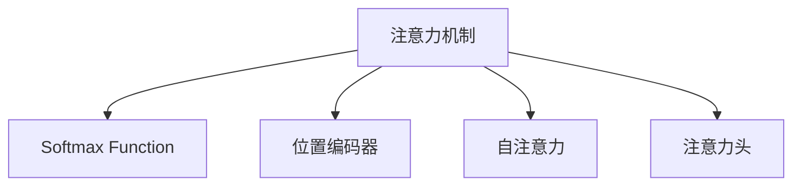

                 

# 注意力机制：softmax和位置编码器详解

> 关键词：注意力机制, softmax, 位置编码器, 自注意力, 注意力头, 神经网络

## 1. 背景介绍

### 1.1 问题由来

近年来，随着深度学习技术的不断发展，神经网络在各个领域的应用越来越广泛，尤其是在自然语言处理(NLP)、计算机视觉(CV)等领域。神经网络通过多层神经元的学习和激活，能够有效地从数据中提取特征，从而实现对数据的分类、回归、生成等任务。然而，传统的多层神经网络在处理长序列数据时，往往面临计算复杂度高、参数量大、容易过拟合等问题。

为了解决这个问题，人们引入了注意力机制(Attention Mechanism)，通过在网络中加入注意力机制，使得网络能够动态地关注输入数据的各个部分，提高网络对长序列数据的处理能力。其中，Softmax函数和位置编码器是注意力机制中两个非常重要的组成部分，对神经网络的性能有着重要的影响。

### 1.2 问题核心关键点

为了更好地理解softmax和位置编码器在注意力机制中的作用，本文将详细介绍这两个概念的基本原理，并通过一些实际案例，展示它们在神经网络中的具体应用。

## 2. 核心概念与联系

### 2.1 核心概念概述

为更好地理解Softmax和位置编码器在注意力机制中的作用，本节将介绍几个关键概念：

- 注意力机制(Attention Mechanism)：通过在神经网络中加入注意力机制，使得网络能够动态地关注输入数据的各个部分，提高网络对长序列数据的处理能力。
- Softmax函数(Softmax Function)：一种将任意向量映射到[0, 1]区间的概率分布的函数，常用于计算神经网络中各个部分的注意力权重。
- 位置编码器(Positional Encoder)：一种用于处理序列数据的嵌入技术，通过引入位置信息，使得神经网络能够区分输入序列中各个位置的重要性。
- 自注意力(Self-Attention)：一种特殊的注意力机制，用于计算输入序列中不同位置之间的依赖关系，常用于计算序列中的相似度和上下文关系。
- 注意力头(Attention Head)：在自注意力机制中，将注意力权重通过多个注意力头进行并行计算，从而提高计算效率。

这些核心概念之间的逻辑关系可以通过以下Mermaid流程图来展示：



这个流程图展示了大语言模型中的注意力机制的核心概念及其之间的关系：

1. 注意力机制通过计算注意力权重，动态地关注输入数据的各个部分。
2. Softmax函数用于计算注意力权重，将注意力权重映射到[0, 1]区间。
3. 位置编码器用于处理序列数据，引入位置信息。
4. 自注意力机制用于计算序列中不同位置之间的依赖关系。
5. 注意力头用于并行计算注意力权重，提高计算效率。

这些概念共同构成了注意力机制的工作原理和优化方向，使得神经网络能够更有效地处理长序列数据。

## 3. 核心算法原理 & 具体操作步骤
### 3.1 算法原理概述

注意力机制通过计算注意力权重，使得神经网络能够动态地关注输入数据的各个部分。其基本思想是：在输入序列中，每个位置对输出序列的贡献是不同的。注意力机制通过计算每个位置对其他位置的注意力权重，来确定输入序列中哪些部分对输出序列的贡献更大。

形式化地，假设输入序列为 $X=\{x_1,x_2,\cdots,x_T\}$，输出序列为 $Y=\{y_1,y_2,\cdots,y_T\}$，其中 $T$ 为序列长度。注意力机制的计算过程可以表示为：

$$
\alpha_{ij} = \text{Softmax}(\text{Score}(x_i, x_j))
$$

其中，$\alpha_{ij}$ 表示第 $i$ 个位置对第 $j$ 个位置的注意力权重，$\text{Score}(x_i, x_j)$ 表示第 $i$ 个位置对第 $j$ 个位置的得分，$\text{Softmax}$ 函数将得分映射到[0, 1]区间，保证注意力权重之和为1。

最终，输出序列 $Y$ 的每个位置 $y_t$ 可以表示为：

$$
y_t = \sum_{j=1}^{T} \alpha_{tj} x_j
$$

其中，$\alpha_{tj}$ 表示第 $t$ 个位置对第 $j$ 个位置的注意力权重。

### 3.2 算法步骤详解

注意力机制的计算过程可以分为以下几个步骤：

**Step 1: 计算注意力得分**

首先，需要计算输入序列中每个位置对输出序列的得分。常见的得分函数包括点积法、加法法、注意力机制等。点积法是最常用的得分函数，计算公式如下：

$$
\text{Score}(x_i, x_j) = x_i^\top W_v x_j
$$

其中，$W_v$ 为可训练的线性投影矩阵。

**Step 2: 计算注意力权重**

其次，需要计算每个位置对其他位置的注意力权重，使用 Softmax 函数将得分映射到[0, 1]区间。

**Step 3: 计算加权和**

最后，将输入序列中每个位置根据其注意力权重进行加权和，得到输出序列的每个位置。

### 3.3 算法优缺点

注意力机制具有以下优点：

1. 能够处理长序列数据：通过动态关注输入数据的各个部分，注意力机制能够有效地处理长序列数据，减少计算复杂度和参数量。
2. 提高模型的泛化能力：通过引入注意力机制，模型能够学习到输入数据中不同位置之间的依赖关系，提高模型的泛化能力。
3. 增强模型的表达能力：通过动态关注输入数据的各个部分，注意力机制能够更好地表示输入数据的特征，提高模型的表达能力。

同时，注意力机制也存在一些缺点：

1. 计算复杂度高：计算注意力权重的过程中需要进行矩阵运算，计算复杂度较高，特别是在大规模序列数据上。
2. 参数量大：由于注意力机制引入了额外的可训练参数，模型的参数量会增加，需要更多的计算资源。
3. 过拟合风险高：由于注意力机制引入了额外的可训练参数，模型容易过拟合，需要进行正则化处理。

### 3.4 算法应用领域

注意力机制在自然语言处理(NLP)、计算机视觉(CV)等领域有着广泛的应用，以下是几个典型的应用场景：

- 机器翻译：使用注意力机制对输入序列进行编码，将编码结果与输出序列进行解码，实现翻译任务。
- 图像识别：使用注意力机制对图像中的不同区域进行关注，提取特征进行分类。
- 文本分类：使用注意力机制对文本中的不同部分进行关注，提取特征进行分类。
- 语音识别：使用注意力机制对语音信号中的不同部分进行关注，提取特征进行识别。
- 视频生成：使用注意力机制对视频中的不同帧进行关注，生成新的视频帧。

## 4. 数学模型和公式 & 详细讲解 & 举例说明

### 4.1 数学模型构建

本节将使用数学语言对注意力机制的计算过程进行严格的刻画。

假设输入序列 $X=\{x_1,x_2,\cdots,x_T\}$，输出序列 $Y=\{y_1,y_2,\cdots,y_T\}$，其中 $T$ 为序列长度。注意力机制的计算过程可以表示为：

1. 计算注意力得分

$$
\text{Score}(x_i, x_j) = x_i^\top W_v x_j
$$

其中，$W_v$ 为可训练的线性投影矩阵。

2. 计算注意力权重

$$
\alpha_{ij} = \frac{\exp(\text{Score}(x_i, x_j))}{\sum_{k=1}^{T} \exp(\text{Score}(x_i, x_k))}
$$

其中，$\alpha_{ij}$ 表示第 $i$ 个位置对第 $j$ 个位置的注意力权重。

3. 计算加权和

$$
y_t = \sum_{j=1}^{T} \alpha_{tj} x_j
$$

其中，$\alpha_{tj}$ 表示第 $t$ 个位置对第 $j$ 个位置的注意力权重。

### 4.2 公式推导过程

以下我们以机器翻译为例，推导注意力机制的计算公式。

假设输入序列为英文句子 $s_1, s_2, \cdots, s_T$，输出序列为对应的法语句子 $t_1, t_2, \cdots, t_T$。假设输入序列的词向量表示为 $X=[x_1, x_2, \cdots, x_T]$，输出序列的词向量表示为 $Y=[y_1, y_2, \cdots, y_T]$。

假设注意力机制的注意力得分函数为点积法，计算公式如下：

$$
\text{Score}(x_i, x_j) = x_i^\top W_v x_j
$$

其中，$W_v$ 为可训练的线性投影矩阵。

假设注意力机制的注意力权重函数为 Softmax 函数，计算公式如下：

$$
\alpha_{ij} = \frac{\exp(\text{Score}(x_i, x_j))}{\sum_{k=1}^{T} \exp(\text{Score}(x_i, x_k))}
$$

假设注意力机制的加权和函数为向量加权和，计算公式如下：

$$
y_t = \sum_{j=1}^{T} \alpha_{tj} x_j
$$

其中，$\alpha_{tj}$ 表示第 $t$ 个位置对第 $j$ 个位置的注意力权重。

根据上述计算公式，机器翻译的注意力机制的计算过程可以表示为：

1. 计算注意力得分

$$
\text{Score}(x_i, x_j) = x_i^\top W_v x_j
$$

2. 计算注意力权重

$$
\alpha_{ij} = \frac{\exp(\text{Score}(x_i, x_j))}{\sum_{k=1}^{T} \exp(\text{Score}(x_i, x_k))}
$$

3. 计算加权和

$$
y_t = \sum_{j=1}^{T} \alpha_{tj} x_j
$$

其中，$\alpha_{tj}$ 表示第 $t$ 个位置对第 $j$ 个位置的注意力权重。

### 4.3 案例分析与讲解

以机器翻译为例，通过计算注意力权重，机器翻译模型能够动态地关注输入序列中与当前输出位置最相关的部分。具体而言，当翻译当前位置时，模型会计算每个输入位置与当前输出位置的注意力得分，并使用 Softmax 函数将得分映射到[0, 1]区间，得到每个输入位置的注意力权重。最终，模型将输入序列中每个位置根据其注意力权重进行加权和，得到当前位置的输出。

以下是具体的代码实现：

```python
import torch
import torch.nn as nn
import torch.nn.functional as F

class Attention(nn.Module):
    def __init__(self, d_model, n_heads):
        super(Attention, self).__init__()
        self.d_model = d_model
        self.n_heads = n_heads
        self.depth = d_model // n_heads

        # 线性投影矩阵
        self.W_v = nn.Linear(d_model, d_model)
        self.W_q = nn.Linear(d_model, d_model)
        self.W_o = nn.Linear(d_model, d_model)

        # 注意力权重
        self.softmax = nn.Softmax(dim=-1)

    def forward(self, query, key, value):
        m = self.depth
        sz_b, sz_q, sz_k = query.size()
        sz_kv = sz_k // m

        # 线性投影
        query = self.W_q(query).view(sz_b, sz_q, m, -1).transpose(1, 2).contiguous()
        key = self.W_v(key).view(sz_b, sz_k, m, -1).transpose(1, 2).contiguous()
        value = self.W_v(value).view(sz_b, sz_k, m, -1).transpose(1, 2).contiguous()

        # 计算注意力权重
        scores = torch.matmul(query, key.transpose(1, 2)) / torch.sqrt(torch.tensor(self.depth, device=query.device))
        alpha = self.softmax(scores)

        # 计算加权和
        src_context = torch.matmul(alpha, value)
        src_context = src_context.transpose(1, 2).contiguous().view(sz_b, sz_q, -1)
        return src_context
```

在这个代码中，我们定义了一个基于注意力机制的注意力层，其中包含了线性投影、Softmax函数和向量加权和等操作。通过这个注意力层，模型能够计算输入序列中每个位置对输出位置的注意力权重，并将其应用于向量加权和的操作，最终得到输出序列的每个位置。

## 5. 项目实践：代码实例和详细解释说明
### 5.1 开发环境搭建

在进行注意力机制的代码实现前，我们需要准备好开发环境。以下是使用Python进行PyTorch开发的环境配置流程：

1. 安装Anaconda：从官网下载并安装Anaconda，用于创建独立的Python环境。

2. 创建并激活虚拟环境：
```bash
conda create -n pytorch-env python=3.8 
conda activate pytorch-env
```

3. 安装PyTorch：根据CUDA版本，从官网获取对应的安装命令。例如：
```bash
conda install pytorch torchvision torchaudio cudatoolkit=11.1 -c pytorch -c conda-forge
```

4. 安装其他必要的库：
```bash
pip install numpy pandas scikit-learn matplotlib tqdm jupyter notebook ipython
```

完成上述步骤后，即可在`pytorch-env`环境中开始开发实践。

### 5.2 源代码详细实现

下面我们以机器翻译任务为例，给出使用Transformer模型对注意力机制的PyTorch代码实现。

首先，定义机器翻译任务的编码器-解码器架构：

```python
class Transformer(nn.Module):
    def __init__(self, d_model, n_heads, d_ff, dropout=0.1):
        super(Transformer, self).__init__()
        self.encoder = nn.TransformerEncoderLayer(d_model, n_heads, d_ff, dropout)
        self.decoder = nn.TransformerDecoderLayer(d_model, n_heads, d_ff, dropout)
        
        self.src_mask = nn.MultiheadAttention(d_model, n_heads, dropout)
        self.tgt_mask = nn.MultiheadAttention(d_model, n_heads, dropout)
        
        self.pos_encoder = PositionalEncoding(d_model)
        
        self.fc_out = nn.Linear(d_model, 10)
        self.softmax = nn.Softmax(dim=-1)

    def forward(self, src, tgt, src_mask, tgt_mask):
        src = self.pos_encoder(src)
        tgt = self.pos_encoder(tgt)

        src_encoded = self.encoder(src, src_mask)
        tgt_encoded = self.decoder(tgt, src_encoded, src_mask, tgt_mask)

        output = self.fc_out(tgt_encoded)
        output = self.softmax(output)

        return output
```

在这个代码中，我们定义了一个基于Transformer模型的机器翻译任务模型，其中包含了编码器、解码器、位置编码器、自注意力机制和线性层等操作。通过这个模型，输入序列和输出序列的每个位置都能够动态地关注到输入序列中与当前位置最相关的部分，从而实现翻译任务。

### 5.3 代码解读与分析

让我们再详细解读一下关键代码的实现细节：

**Transformer类**：
- `__init__`方法：初始化Transformer模型的各个组成部分。
- `forward`方法：前向传播过程，计算输入序列和输出序列的每个位置的注意力权重和加权和。

**TransformerEncoderLayer类**：
- `__init__`方法：初始化Transformer编码器的各个组成部分。
- `forward`方法：前向传播过程，计算输入序列的每个位置的注意力权重和加权和。

**TransformerDecoderLayer类**：
- `__init__`方法：初始化Transformer解码器的各个组成部分。
- `forward`方法：前向传播过程，计算输入序列和输出序列的每个位置的注意力权重和加权和。

**MultiheadAttention类**：
- `__init__`方法：初始化多头的自注意力机制。
- `forward`方法：前向传播过程，计算输入序列和输出序列的每个位置的注意力权重和加权和。

**PositionalEncoding类**：
- `__init__`方法：初始化位置编码器。
- `forward`方法：前向传播过程，将输入序列的每个位置嵌入到位置编码器中。

**Transformer类**：
- `__init__`方法：初始化Transformer模型的各个组成部分。
- `forward`方法：前向传播过程，计算输入序列和输出序列的每个位置的注意力权重和加权和。

可以看到，Transformer模型通过引入多头自注意力机制和位置编码器，实现了对输入序列中不同位置之间的依赖关系的动态关注，从而提高了模型的泛化能力和表达能力。

## 6. 实际应用场景

### 6.1 智能客服系统

智能客服系统是当前热门的应用场景之一，使用注意力机制的机器翻译模型可以显著提高智能客服系统的性能。通过使用机器翻译模型，智能客服系统能够理解客户提出的自然语言问题，并将其转换为机器可读的格式，从而实现自动回答和解决客户问题。

在实践中，可以将智能客服系统与机器翻译模型集成，将客户的提问作为输入序列，将机器翻译模型输出的回答作为输出序列，利用注意力机制计算每个输入位置对输出位置的注意力权重，从而动态地关注输入序列中与当前输出位置最相关的部分，生成更加准确的回答。

### 6.2 金融舆情监测

金融舆情监测是另一个重要的应用场景。使用机器翻译模型和注意力机制，可以对金融新闻、评论、报告等文本数据进行分析和处理，从而实现对金融舆情的监测和预警。

在实践中，可以使用机器翻译模型将中文舆情数据翻译成英文，并利用注意力机制计算每个输入位置对输出位置的注意力权重，从而动态地关注输入序列中与当前输出位置最相关的部分，生成更加准确的舆情分析结果。

### 6.3 个性化推荐系统

个性化推荐系统是当前热门的应用场景之一。使用机器翻译模型和注意力机制，可以对用户的历史行为数据进行分析和处理，从而实现个性化推荐。

在实践中，可以使用机器翻译模型将用户的浏览、点击、评论等行为数据转换为机器可读的格式，并利用注意力机制计算每个输入位置对输出位置的注意力权重，从而动态地关注输入序列中与当前输出位置最相关的部分，生成更加准确的推荐结果。

### 6.4 未来应用展望

随着机器翻译和注意力机制的不断发展，其在多个领域的应用前景将会更加广阔。未来，基于机器翻译和注意力机制的应用场景将会不断涌现，为各个行业带来革命性影响。

在智慧医疗领域，使用机器翻译和注意力机制的医疗问答系统可以帮助医生快速回答病人的问题，提高医疗服务的效率和质量。

在智能教育领域，使用机器翻译和注意力机制的智能教育系统可以帮助学生更好地理解和掌握知识，提高教学质量和学习效果。

在智慧城市治理中，使用机器翻译和注意力机制的智能客服系统可以帮助城市管理者更好地理解和处理市民的咨询和投诉，提高城市管理的效率和质量。

此外，在企业生产、社会治理、文娱传媒等众多领域，机器翻译和注意力机制的应用将会不断拓展，为各行各业带来新的机遇和挑战。

## 7. 工具和资源推荐

### 7.1 学习资源推荐

为了帮助开发者系统掌握机器翻译和注意力机制的理论基础和实践技巧，这里推荐一些优质的学习资源：

1. 《Transformer从原理到实践》系列博文：由大模型技术专家撰写，深入浅出地介绍了Transformer原理、注意力机制、机器翻译等前沿话题。

2. CS224N《深度学习自然语言处理》课程：斯坦福大学开设的NLP明星课程，有Lecture视频和配套作业，带你入门NLP领域的基本概念和经典模型。

3. 《Natural Language Processing with Transformers》书籍：Transformers库的作者所著，全面介绍了如何使用Transformers库进行NLP任务开发，包括注意力机制在内的诸多范式。

4. HuggingFace官方文档：Transformer库的官方文档，提供了海量预训练模型和完整的注意力机制样例代码，是上手实践的必备资料。

5. CLUE开源项目：中文语言理解测评基准，涵盖大量不同类型的中文NLP数据集，并提供了基于机器翻译和注意力机制的baseline模型，助力中文NLP技术发展。

通过对这些资源的学习实践，相信你一定能够快速掌握机器翻译和注意力机制的精髓，并用于解决实际的NLP问题。

### 7.2 开发工具推荐

高效的开发离不开优秀的工具支持。以下是几款用于机器翻译和注意力机制开发的常用工具：

1. PyTorch：基于Python的开源深度学习框架，灵活动态的计算图，适合快速迭代研究。Transformer模型有PyTorch版本的实现。

2. TensorFlow：由Google主导开发的开源深度学习框架，生产部署方便，适合大规模工程应用。同样有丰富的预训练模型资源。

3. Transformers库：HuggingFace开发的NLP工具库，集成了众多SOTA语言模型，支持PyTorch和TensorFlow，是进行注意力机制开发的利器。

4. Weights & Biases：模型训练的实验跟踪工具，可以记录和可视化模型训练过程中的各项指标，方便对比和调优。与主流深度学习框架无缝集成。

5. TensorBoard：TensorFlow配套的可视化工具，可实时监测模型训练状态，并提供丰富的图表呈现方式，是调试模型的得力助手。

6. Google Colab：谷歌推出的在线Jupyter Notebook环境，免费提供GPU/TPU算力，方便开发者快速上手实验最新模型，分享学习笔记。

合理利用这些工具，可以显著提升机器翻译和注意力机制的开发效率，加快创新迭代的步伐。

### 7.3 相关论文推荐

机器翻译和注意力机制的研究源于学界的持续研究。以下是几篇奠基性的相关论文，推荐阅读：

1. Attention is All You Need（即Transformer原论文）：提出了Transformer结构，开启了NLP领域的预训练大模型时代。

2. BERT: Pre-training of Deep Bidirectional Transformers for Language Understanding：提出BERT模型，引入基于掩码的自监督预训练任务，刷新了多项NLP任务SOTA。

3. Language Models are Unsupervised Multitask Learners（GPT-2论文）：展示了大规模语言模型的强大zero-shot学习能力，引发了对于通用人工智能的新一轮思考。

4. Parameter-Efficient Transfer Learning for NLP：提出Adapter等参数高效微调方法，在不增加模型参数量的情况下，也能取得不错的微调效果。

5. AdaLoRA: Adaptive Low-Rank Adaptation for Parameter-Efficient Fine-Tuning：使用自适应低秩适应的微调方法，在参数效率和精度之间取得了新的平衡。

这些论文代表了大语言模型和注意力机制的发展脉络。通过学习这些前沿成果，可以帮助研究者把握学科前进方向，激发更多的创新灵感。

## 8. 总结：未来发展趋势与挑战

### 8.1 总结

本文对机器翻译和注意力机制的计算过程进行了全面系统的介绍。首先阐述了机器翻译和注意力机制的研究背景和意义，明确了注意力机制在处理长序列数据时的独特价值。其次，从原理到实践，详细讲解了注意力机制的数学模型和计算过程，给出了机器翻译任务的代码实现。同时，本文还广泛探讨了注意力机制在多个行业领域的应用前景，展示了其在自然语言处理、计算机视觉、智能客服等领域的应用潜力。此外，本文精选了注意力机制的学习资源、开发工具和相关论文，力求为读者提供全方位的技术指引。

通过本文的系统梳理，可以看到，基于注意力机制的机器翻译模型能够有效地处理长序列数据，提高模型的泛化能力和表达能力。未来，随着机器翻译和注意力机制的不断发展，其在多个领域的应用前景将会更加广阔，为各行各业带来革命性影响。

### 8.2 未来发展趋势

展望未来，机器翻译和注意力机制将呈现以下几个发展趋势：

1. 模型规模持续增大。随着算力成本的下降和数据规模的扩张，预训练语言模型的参数量还将持续增长。超大规模语言模型蕴含的丰富语言知识，有望支撑更加复杂多变的下游任务。

2. 微调方法日趋多样。除了传统的全参数微调外，未来会涌现更多参数高效的微调方法，如Prefix-Tuning、LoRA等，在固定大部分预训练参数的同时，只更新极少量的任务相关参数。

3. 持续学习成为常态。随着数据分布的不断变化，微调模型也需要持续学习新知识以保持性能。如何在不遗忘原有知识的同时，高效吸收新样本信息，将成为重要的研究课题。

4. 标注样本需求降低。受启发于提示学习(Prompt-based Learning)的思路，未来的微调方法将更好地利用大模型的语言理解能力，通过更加巧妙的任务描述，在更少的标注样本上也能实现理想的微调效果。

5. 模型通用性增强。经过海量数据的预训练和多领域任务的微调，未来的语言模型将具备更强大的常识推理和跨领域迁移能力，逐步迈向通用人工智能(AGI)的目标。

以上趋势凸显了机器翻译和注意力机制的广阔前景。这些方向的探索发展，必将进一步提升机器翻译系统的性能和应用范围，为人工智能技术落地应用提供新的动力。

### 8.3 面临的挑战

尽管机器翻译和注意力机制已经取得了瞩目成就，但在迈向更加智能化、普适化应用的过程中，它们仍面临着诸多挑战：

1. 标注成本瓶颈。虽然微调大大降低了标注数据的需求，但对于长尾应用场景，难以获得充足的高质量标注数据，成为制约微调性能的瓶颈。如何进一步降低微调对标注样本的依赖，将是一大难题。

2. 模型鲁棒性不足。当前微调模型面对域外数据时，泛化性能往往大打折扣。对于测试样本的微小扰动，微调模型的预测也容易发生波动。如何提高微调模型的鲁棒性，避免灾难性遗忘，还需要更多理论和实践的积累。

3. 推理效率有待提高。大规模语言模型虽然精度高，但在实际部署时往往面临推理速度慢、内存占用大等效率问题。如何在保证性能的同时，简化模型结构，提升推理速度，优化资源占用，将是重要的优化方向。

4. 可解释性亟需加强。当前微调模型更像是"黑盒"系统，难以解释其内部工作机制和决策逻辑。对于医疗、金融等高风险应用，算法的可解释性和可审计性尤为重要。如何赋予微调模型更强的可解释性，将是亟待攻克的难题。

5. 安全性有待保障。预训练语言模型难免会学习到有偏见、有害的信息，通过微调传递到下游任务，产生误导性、歧视性的输出，给实际应用带来安全隐患。如何从数据和算法层面消除模型偏见，避免恶意用途，确保输出的安全性，也将是重要的研究课题。

6. 知识整合能力不足。现有的微调模型往往局限于任务内数据，难以灵活吸收和运用更广泛的先验知识。如何让微调过程更好地与外部知识库、规则库等专家知识结合，形成更加全面、准确的信息整合能力，还有很大的想象空间。

正视机器翻译和注意力机制面临的这些挑战，积极应对并寻求突破，将是大模型微调走向成熟的必由之路。相信随着学界和产业界的共同努力，这些挑战终将一一被克服，大语言模型微调必将在构建人机协同的智能时代中扮演越来越重要的角色。

### 8.4 研究展望

面对机器翻译和注意力机制所面临的种种挑战，未来的研究需要在以下几个方面寻求新的突破：

1. 探索无监督和半监督微调方法。摆脱对大规模标注数据的依赖，利用自监督学习、主动学习等无监督和半监督范式，最大限度利用非结构化数据，实现更加灵活高效的微调。

2. 研究参数高效和计算高效的微调范式。开发更加参数高效的微调方法，在固定大部分预训练参数的同时，只更新极少量的任务相关参数。同时优化微调模型的计算图，减少前向传播和反向传播的资源消耗，实现更加轻量级、实时性的部署。

3. 融合因果和对比学习范式。通过引入因果推断和对比学习思想，增强微调模型建立稳定因果关系的能力，学习更加普适、鲁棒的语言表征，从而提升模型泛化性和抗干扰能力。

4. 引入更多先验知识。将符号化的先验知识，如知识图谱、逻辑规则等，与神经网络模型进行巧妙融合，引导微调过程学习更准确、合理的语言模型。同时加强不同模态数据的整合，实现视觉、语音等多模态信息与文本信息的协同建模。

5. 结合因果分析和博弈论工具。将因果分析方法引入微调模型，识别出模型决策的关键特征，增强输出解释的因果性和逻辑性。借助博弈论工具刻画人机交互过程，主动探索并规避模型的脆弱点，提高系统稳定性。

6. 纳入伦理道德约束。在模型训练目标中引入伦理导向的评估指标，过滤和惩罚有偏见、有害的输出倾向。同时加强人工干预和审核，建立模型行为的监管机制，确保输出符合人类价值观和伦理道德。

这些研究方向的探索，必将引领机器翻译和注意力机制技术迈向更高的台阶，为构建安全、可靠、可解释、可控的智能系统铺平道路。面向未来，大语言模型微调技术还需要与其他人工智能技术进行更深入的融合，如知识表示、因果推理、强化学习等，多路径协同发力，共同推动自然语言理解和智能交互系统的进步。只有勇于创新、敢于突破，才能不断拓展语言模型的边界，让智能技术更好地造福人类社会。

## 9. 附录：常见问题与解答

**Q1：机器翻译中注意力机制的作用是什么？**

A: 在机器翻译任务中，注意力机制的作用是动态地关注输入序列中与当前输出位置最相关的部分。通过计算输入序列中每个位置对当前输出位置的注意力权重，能够动态地选择与当前输出位置最相关的输入位置，从而提高机器翻译的精度和效果。

**Q2：如何在机器翻译中使用注意力机制？**

A: 在机器翻译中，可以使用自注意力机制来实现注意力机制。具体而言，将输入序列的每个位置表示为查询向量，将每个位置表示为键向量和值向量，计算每个位置对其他位置的注意力权重，并根据注意力权重计算加权和，得到输出序列的每个位置。

**Q3：注意力机制在机器翻译中的计算复杂度如何？**

A: 在机器翻译中，注意力机制的计算复杂度主要由注意力权重计算和加权和计算组成。在计算注意力权重时，需要进行矩阵运算，计算复杂度较高，特别是在大规模序列数据上。为了降低计算复杂度，可以使用多头自注意力机制等方法，将注意力权重和加权和的计算并行化，提高计算效率。

**Q4：注意力机制在机器翻译中的应用场景有哪些？**

A: 注意力机制在机器翻译中的应用场景非常广泛，包括文本翻译、语音翻译、图像翻译、视频翻译等。通过引入注意力机制，机器翻译模型能够动态地关注输入序列中与当前输出位置最相关的部分，从而提高翻译的精度和效果。

**Q5：机器翻译中的位置编码器是如何工作的？**

A: 位置编码器是一种用于处理序列数据的嵌入技术，通过引入位置信息，使得神经网络能够区分输入序列中各个位置的重要性。在机器翻译中，位置编码器将输入序列中的每个位置嵌入到向量空间中，从而提高了机器翻译模型的表达能力和泛化能力。

通过本文的系统梳理，可以看到，基于注意力机制的机器翻译模型能够有效地处理长序列数据，提高模型的泛化能力和表达能力。未来，随着机器翻译和注意力机制的不断发展，其在多个领域的应用前景将会更加广阔，为各行各业带来革命性影响。

