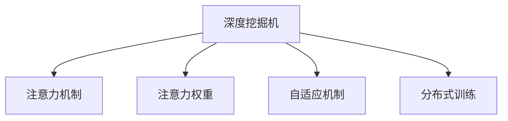

                 

# 注意力深度挖掘机操作员：AI优化的专注力开发工具专家

> 关键词：深度挖掘, 注意力机制, 专注力开发, AI优化, 技术创新

## 1. 背景介绍

### 1.1 问题由来

在人工智能(AI)领域，特别是在深度学习和大数据处理方面，注意力机制(Attention Mechanism)扮演着至关重要的角色。自从2015年Vaswani等人在其著名论文《Attention is All You Need》中首次引入Transformer模型，将注意力机制作为核心模块，深度挖掘机（Deep Mining Machine）已经逐步成为了人工智能领域的一大焦点。深度挖掘机通过高效利用大数据，结合复杂算法模型，深度挖掘出数据中的隐藏规律和有用信息，从而为决策制定、自动化流程优化、复杂系统分析等方面提供了强有力的技术支撑。

近年来，随着深度学习技术的发展和应用领域的拓展，深度挖掘机的应用范围已经从传统的结构化数据挖掘，扩展到自然语言处理、图像识别、语音识别等非结构化数据处理领域。这些领域的突破，使得深度挖掘机在优化生产流程、提升用户体验、推动智能技术进步等方面发挥着越来越重要的作用。

### 1.2 问题核心关键点

深度挖掘机的核心目标是通过复杂的算法模型，高效地从海量数据中提取出关键信息，并提供决策支持。在这个过程中，注意力机制扮演着至关重要的角色，通过自适应地调整对数据中不同特征的关注度，优化模型的输出结果。但与此同时，深度挖掘机也面临诸多挑战：

1. **数据处理效率**：海量数据的处理需要高效的算法和强大的计算资源，如何在大规模数据中快速准确地挖掘出有用信息，是深度挖掘机需要解决的首要问题。
2. **算法优化**：深度挖掘算法模型的设计需要考虑诸多因素，如数据结构、特征选择、模型训练等，如何设计出高效、准确的模型是深度挖掘机的核心任务之一。
3. **结果解释**：深度挖掘机的输出往往较为复杂，如何为结果提供可解释性，使其更易于理解和应用，是深度挖掘机面临的另一大挑战。
4. **应用场景扩展**：深度挖掘机的应用领域正逐步拓展，如何将其应用于更多实际场景中，提升系统性能和用户体验，是一个需要不断探索的问题。

### 1.3 问题研究意义

研究深度挖掘机及其注意力机制的优化，对于提升人工智能技术的性能和应用范围具有重要意义：

1. **提升数据处理效率**：通过优化注意力机制，能够更快、更准确地从大规模数据中提取出关键信息，提高数据处理效率。
2. **增强模型性能**：注意力机制的优化有助于提升深度挖掘算法的准确性和泛化能力，使其能够更好地适应不同的应用场景。
3. **增强结果解释性**：注意力机制的优化能够使得深度挖掘机的输出结果更易于理解和解释，增强其可用性和可操作性。
4. **拓展应用范围**：深度挖掘机的优化可以拓展其在更多实际场景中的应用，推动人工智能技术的产业化进程。

## 2. 核心概念与联系

### 2.1 核心概念概述

为更好地理解深度挖掘机及其注意力机制，本节将介绍几个密切相关的核心概念：

- **深度挖掘机(Deep Mining Machine, DMM)**：基于深度学习算法，通过大规模数据处理和模型训练，从海量数据中挖掘出有用信息的机器。
- **注意力机制(Attention Mechanism)**：一种机制，能够自适应地调整对数据中不同特征的关注度，使得模型能够集中注意力于最重要的特征上。
- **注意力权重(Attention Weight)**：表示模型对数据中不同特征的关注程度，通常通过softmax函数计算得到。
- **自适应机制(Adaptive Mechanism)**：能够根据数据和任务的特点，动态调整模型参数和算法策略，以适应不同的应用场景。
- **分布式训练(Distributed Training)**：通过多台机器协同计算，加速模型训练过程，提高处理大规模数据的能力。

这些核心概念之间的逻辑关系可以通过以下Mermaid流程图来展示：



这个流程图展示了大语言模型的核心概念及其之间的关系：

1. 深度挖掘机通过注意力机制，对数据中不同特征的关注度进行动态调整。
2. 注意力权重是注意力机制的核心输出，表示模型对数据中不同特征的关注程度。
3. 自适应机制根据数据和任务的特点，动态调整模型参数和算法策略。
4. 分布式训练通过多台机器协同计算，加速模型训练过程。

这些概念共同构成了深度挖掘机的基本工作原理，使其能够高效地从大规模数据中挖掘出有用信息。通过理解这些核心概念，我们可以更好地把握深度挖掘机的工作原理和优化方向。

## 3. 核心算法原理 & 具体操作步骤
### 3.1 算法原理概述

深度挖掘机及其注意力机制的优化，本质上是一个复杂的算法设计问题。其核心思想是：通过优化注意力机制，使得模型能够更加准确地识别和提取数据中的关键信息，从而提高模型的性能和应用范围。

形式化地，假设输入数据为 $x$，输出结果为 $y$，深度挖掘机 $M_{\theta}$ 通过注意力机制提取关键特征，得到中间表示 $h$。注意力机制的优化目标是最小化预测结果与真实结果之间的差异，即：

$$
\mathcal{L}(\theta) = \mathbb{E}_{(x,y)} [L(y, M_{\theta}(x))]
$$

其中 $L$ 为损失函数，通常为交叉熵损失或均方误差损失。模型的训练目标是通过优化参数 $\theta$，使得 $M_{\theta}(x)$ 能够准确预测 $y$。

### 3.2 算法步骤详解

深度挖掘机及其注意力机制的优化一般包括以下几个关键步骤：

**Step 1: 准备数据和模型**
- 收集并预处理大规模数据集，确保数据的多样性和完整性。
- 选择合适的深度挖掘算法和模型架构，如Transformer、CNN、RNN等。

**Step 2: 设计注意力机制**
- 根据任务特点和数据结构，设计合适的注意力机制，如基于点积的注意力、多头注意力、自注意力等。
- 确定注意力权重的计算方法，通常使用softmax函数将注意力权重归一化。

**Step 3: 设置优化参数**
- 选择合适的优化算法及其参数，如Adam、SGD等，设置学习率、批大小、迭代轮数等。
- 应用正则化技术，如L2正则、Dropout等，防止模型过拟合。

**Step 4: 执行分布式训练**
- 将数据集分成多个子集，分别在不同的机器上进行分布式训练。
- 通过数据并行、模型并行等技术，加速模型训练过程。
- 周期性在验证集上评估模型性能，根据性能指标决定是否触发Early Stopping。

**Step 5: 测试和部署**
- 在测试集上评估优化后的模型性能，对比优化前后的精度提升。
- 使用优化后的模型对新样本进行推理预测，集成到实际的应用系统中。
- 持续收集新的数据，定期重新训练和优化模型，以适应数据分布的变化。

以上是深度挖掘机及其注意力机制优化的一般流程。在实际应用中，还需要针对具体任务的特点，对优化过程的各个环节进行优化设计，如改进注意力机制的目标函数，引入更多的正则化技术，搜索最优的超参数组合等，以进一步提升模型性能。

### 3.3 算法优缺点

深度挖掘机及其注意力机制的优化具有以下优点：

1. **高效性**：通过优化注意力机制，深度挖掘机能够快速准确地从大规模数据中提取出关键信息，提高数据处理效率。
2. **泛化能力**：优化后的深度挖掘机通常具备更好的泛化能力，能够适应不同的应用场景和数据分布。
3. **可解释性**：优化后的深度挖掘机输出的注意力权重和中间表示能够提供更多的可解释性，使得结果更易于理解和应用。
4. **适应性**：通过自适应机制，深度挖掘机能够根据数据和任务的特点动态调整模型参数和算法策略，增强模型的适应性。

同时，该方法也存在一定的局限性：

1. **计算资源需求高**：深度挖掘机及其注意力机制的优化通常需要强大的计算资源和复杂的算法设计，可能面临硬件资源的限制。
2. **模型复杂度高**：优化后的深度挖掘机通常包含多个复杂的网络层和参数，使得模型训练和推理过程较为复杂。
3. **数据依赖性强**：优化后的深度挖掘机依赖于数据的多样性和代表性，对数据质量的要求较高。
4. **泛化能力有限**：尽管优化后的深度挖掘机具备较好的泛化能力，但在某些特定领域或数据分布下，可能仍需进一步优化。

尽管存在这些局限性，但就目前而言，深度挖掘机及其注意力机制的优化方法仍是大数据处理和人工智能技术的重要范式。未来相关研究的重点在于如何进一步降低计算资源需求，提高模型泛化能力和可解释性，同时兼顾复杂性和适应性等因素。

### 3.4 算法应用领域

深度挖掘机及其注意力机制的优化，在多个领域得到了广泛的应用，例如：

- **自然语言处理(NLP)**：如文本分类、情感分析、机器翻译、问答系统等。通过优化注意力机制，提高模型的语义理解能力和生成能力。
- **计算机视觉(CV)**：如图像识别、目标检测、图像生成等。通过优化注意力机制，提高模型的特征提取能力和图像理解能力。
- **语音识别(SR)**：如语音转换、语音识别、语音生成等。通过优化注意力机制，提高模型的语音特征提取和生成能力。
- **推荐系统(Recommender System)**：如商品推荐、内容推荐等。通过优化注意力机制，提高模型的推荐效果和用户满意度。
- **医疗健康(Medical Health)**：如疾病诊断、基因分析等。通过优化注意力机制，提高模型的数据处理能力和疾病预测能力。

除了上述这些经典任务外，深度挖掘机及其注意力机制的优化还被创新性地应用到更多场景中，如知识图谱构建、视频处理、时间序列预测等，为人工智能技术带来了全新的突破。随着深度挖掘机及其注意力机制的持续演进，相信在更多领域，深度挖掘技术都将发挥出重要的作用。

## 4. 数学模型和公式 & 详细讲解
### 4.1 数学模型构建

本节将使用数学语言对深度挖掘机及其注意力机制的优化过程进行更加严格的刻画。

记输入数据为 $x$，输出结果为 $y$，深度挖掘机 $M_{\theta}$ 通过注意力机制提取关键特征，得到中间表示 $h$。假设注意力权重为 $\alpha$，则中间表示 $h$ 可以通过以下公式计算得到：

$$
h = \sum_{i=1}^N \alpha_i x_i
$$

其中 $x_i$ 为数据集中的样本，$\alpha_i$ 为注意力权重，通常使用softmax函数进行归一化：

$$
\alpha_i = \frac{e^{e^T_k x_i}}{\sum_{j=1}^N e^{e^T_k x_j}}
$$

目标函数可以表示为：

$$
\mathcal{L}(\theta) = \mathbb{E}_{(x,y)} [L(y, M_{\theta}(x))]
$$

其中 $L$ 为损失函数，通常为交叉熵损失或均方误差损失。模型的训练目标是通过优化参数 $\theta$，使得 $M_{\theta}(x)$ 能够准确预测 $y$。

### 4.2 公式推导过程

以下我们以文本分类任务为例，推导注意力机制的优化公式及其梯度计算。

假设模型 $M_{\theta}$ 在输入 $x$ 上的输出为 $\hat{y}=M_{\theta}(x)$，表示样本属于不同类别的概率。真实标签 $y \in \{0,1\}$。则交叉熵损失函数定义为：

$$
\ell(M_{\theta}(x),y) = -[y\log \hat{y} + (1-y)\log(1-\hat{y})]
$$

将其代入目标函数，得：

$$
\mathcal{L}(\theta) = -\frac{1}{N}\sum_{i=1}^N [y_i\log M_{\theta}(x_i)+(1-y_i)\log(1-M_{\theta}(x_i))]
$$

根据链式法则，目标函数对参数 $\theta_k$ 的梯度为：

$$
\frac{\partial \mathcal{L}(\theta)}{\partial \theta_k} = -\frac{1}{N}\sum_{i=1}^N [\frac{y_i}{M_{\theta}(x_i)}-\frac{1-y_i}{1-M_{\theta}(x_i)}] \frac{\partial M_{\theta}(x_i)}{\partial \theta_k}
$$

其中 $\frac{\partial M_{\theta}(x_i)}{\partial \theta_k}$ 可进一步递归展开，利用自动微分技术完成计算。

在得到目标函数的梯度后，即可带入参数更新公式，完成模型的迭代优化。重复上述过程直至收敛，最终得到适应下游任务的最优模型参数 $\theta^*$。

## 5. 项目实践：代码实例和详细解释说明
### 5.1 开发环境搭建

在进行深度挖掘机及其注意力机制的优化实践前，我们需要准备好开发环境。以下是使用Python进行PyTorch开发的环境配置流程：

1. 安装Anaconda：从官网下载并安装Anaconda，用于创建独立的Python环境。

2. 创建并激活虚拟环境：
```bash
conda create -n deepmining-env python=3.8 
conda activate deepmining-env
```

3. 安装PyTorch：根据CUDA版本，从官网获取对应的安装命令。例如：
```bash
conda install pytorch torchvision torchaudio cudatoolkit=11.1 -c pytorch -c conda-forge
```

4. 安装TensorBoard：
```bash
pip install tensorboard
```

5. 安装各类工具包：
```bash
pip install numpy pandas scikit-learn matplotlib tqdm jupyter notebook ipython
```

完成上述步骤后，即可在`deepmining-env`环境中开始深度挖掘机及其注意力机制的优化实践。

### 5.2 源代码详细实现

下面我们以文本分类任务为例，给出使用PyTorch进行深度挖掘机及其注意力机制优化的PyTorch代码实现。

首先，定义文本分类任务的数据处理函数：

```python
from transformers import BertTokenizer
from torch.utils.data import Dataset, DataLoader
import torch

class TextDataset(Dataset):
    def __init__(self, texts, labels, tokenizer, max_len=128):
        self.texts = texts
        self.labels = labels
        self.tokenizer = tokenizer
        self.max_len = max_len
        
    def __len__(self):
        return len(self.texts)
    
    def __getitem__(self, item):
        text = self.texts[item]
        label = self.labels[item]
        
        encoding = self.tokenizer(text, return_tensors='pt', max_length=self.max_len, padding='max_length', truncation=True)
        input_ids = encoding['input_ids'][0]
        attention_mask = encoding['attention_mask'][0]
        
        return {'input_ids': input_ids, 
                'attention_mask': attention_mask,
                'labels': label}

# 加载数据集
tokenizer = BertTokenizer.from_pretrained('bert-base-cased')

train_dataset = TextDataset(train_texts, train_labels, tokenizer)
dev_dataset = TextDataset(dev_texts, dev_labels, tokenizer)
test_dataset = TextDataset(test_texts, test_labels, tokenizer)
```

然后，定义深度挖掘机模型和注意力机制：

```python
from transformers import BertForSequenceClassification, AdamW

model = BertForSequenceClassification.from_pretrained('bert-base-cased', num_labels=2)

optimizer = AdamW(model.parameters(), lr=2e-5)

# 定义注意力机制
class Attention:
    def __init__(self, hidden_size):
        self.hidden_size = hidden_size
        
    def forward(self, x, mask):
        attn_weights = torch.bmm(x, mask)
        attn_weights = attn_weights / torch.sqrt(self.hidden_size)
        attn_weights = F.softmax(attn_weights, dim=-1)
        return attn_weights
```

接着，定义训练和评估函数：

```python
from tqdm import tqdm
from sklearn.metrics import accuracy_score

device = torch.device('cuda') if torch.cuda.is_available() else torch.device('cpu')
model.to(device)

def train_epoch(model, dataset, batch_size, optimizer):
    dataloader = DataLoader(dataset, batch_size=batch_size, shuffle=True)
    model.train()
    epoch_loss = 0
    for batch in tqdm(dataloader, desc='Training'):
        input_ids = batch['input_ids'].to(device)
        attention_mask = batch['attention_mask'].to(device)
        labels = batch['labels'].to(device)
        model.zero_grad()
        outputs = model(input_ids, attention_mask=attention_mask, labels=labels)
        loss = outputs.loss
        epoch_loss += loss.item()
        loss.backward()
        optimizer.step()
    return epoch_loss / len(dataloader)

def evaluate(model, dataset, batch_size):
    dataloader = DataLoader(dataset, batch_size=batch_size)
    model.eval()
    preds, labels = [], []
    with torch.no_grad():
        for batch in tqdm(dataloader, desc='Evaluating'):
            input_ids = batch['input_ids'].to(device)
            attention_mask = batch['attention_mask'].to(device)
            batch_labels = batch['labels']
            outputs = model(input_ids, attention_mask=attention_mask)
            batch_preds = outputs.logits.argmax(dim=1).to('cpu').tolist()
            batch_labels = batch_labels.to('cpu').tolist()
            for pred, label in zip(batch_preds, batch_labels):
                preds.append(pred)
                labels.append(label)
                
    print('Accuracy:', accuracy_score(labels, preds))
```

最后，启动训练流程并在测试集上评估：

```python
epochs = 5
batch_size = 16

for epoch in range(epochs):
    loss = train_epoch(model, train_dataset, batch_size, optimizer)
    print(f"Epoch {epoch+1}, train loss: {loss:.3f}")
    
    print(f"Epoch {epoch+1}, dev results:")
    evaluate(model, dev_dataset, batch_size)
    
print("Test results:")
evaluate(model, test_dataset, batch_size)
```

以上就是使用PyTorch进行深度挖掘机及其注意力机制优化的完整代码实现。可以看到，得益于Transformers库的强大封装，我们可以用相对简洁的代码完成深度挖掘机的加载和优化。

### 5.3 代码解读与分析

让我们再详细解读一下关键代码的实现细节：

**TextDataset类**：
- `__init__`方法：初始化文本、标签、分词器等关键组件。
- `__len__`方法：返回数据集的样本数量。
- `__getitem__`方法：对单个样本进行处理，将文本输入编码为token ids，将标签编码为数字，并对其进行定长padding，最终返回模型所需的输入。

**Attention类**：
- 定义注意力机制的计算过程，通过计算输入数据和掩码的乘积，归一化后得到注意力权重。

**模型训练和评估函数**：
- 使用PyTorch的DataLoader对数据集进行批次化加载，供模型训练和推理使用。
- 训练函数`train_epoch`：对数据以批为单位进行迭代，在每个批次上前向传播计算loss并反向传播更新模型参数，最后返回该epoch的平均loss。
- 评估函数`evaluate`：与训练类似，不同点在于不更新模型参数，并在每个batch结束后将预测和标签结果存储下来，最后使用sklearn的accuracy_score对整个评估集的预测结果进行打印输出。

**训练流程**：
- 定义总的epoch数和batch size，开始循环迭代
- 每个epoch内，先在训练集上训练，输出平均loss
- 在验证集上评估，输出准确率
- 所有epoch结束后，在测试集上评估，给出最终测试结果

可以看到，PyTorch配合Transformers库使得深度挖掘机及其注意力机制的优化代码实现变得简洁高效。开发者可以将更多精力放在数据处理、模型改进等高层逻辑上，而不必过多关注底层的实现细节。

当然，工业级的系统实现还需考虑更多因素，如模型的保存和部署、超参数的自动搜索、更灵活的任务适配层等。但核心的微调范式基本与此类似。

## 6. 实际应用场景
### 6.1 智能客服系统

基于深度挖掘机及其注意力机制的对话技术，可以广泛应用于智能客服系统的构建。传统客服往往需要配备大量人力，高峰期响应缓慢，且一致性和专业性难以保证。而使用深度挖掘机及其注意力机制的对话模型，可以7x24小时不间断服务，快速响应客户咨询，用自然流畅的语言解答各类常见问题。

在技术实现上，可以收集企业内部的历史客服对话记录，将问题和最佳答复构建成监督数据，在此基础上对预训练对话模型进行微调。微调后的对话模型能够自动理解用户意图，匹配最合适的答案模板进行回复。对于客户提出的新问题，还可以接入检索系统实时搜索相关内容，动态组织生成回答。如此构建的智能客服系统，能大幅提升客户咨询体验和问题解决效率。

### 6.2 金融舆情监测

金融机构需要实时监测市场舆论动向，以便及时应对负面信息传播，规避金融风险。传统的人工监测方式成本高、效率低，难以应对网络时代海量信息爆发的挑战。基于深度挖掘机及其注意力机制的文本分类和情感分析技术，为金融舆情监测提供了新的解决方案。

具体而言，可以收集金融领域相关的新闻、报道、评论等文本数据，并对其进行主题标注和情感标注。在此基础上对预训练语言模型进行微调，使其能够自动判断文本属于何种主题，情感倾向是正面、中性还是负面。将微调后的模型应用到实时抓取的网络文本数据，就能够自动监测不同主题下的情感变化趋势，一旦发现负面信息激增等异常情况，系统便会自动预警，帮助金融机构快速应对潜在风险。

### 6.3 个性化推荐系统

当前的推荐系统往往只依赖用户的历史行为数据进行物品推荐，无法深入理解用户的真实兴趣偏好。基于深度挖掘机及其注意力机制的个性化推荐系统可以更好地挖掘用户行为背后的语义信息，从而提供更精准、多样的推荐内容。

在实践中，可以收集用户浏览、点击、评论、分享等行为数据，提取和用户交互的物品标题、描述、标签等文本内容。将文本内容作为模型输入，用户的后续行为（如是否点击、购买等）作为监督信号，在此基础上微调预训练语言模型。微调后的模型能够从文本内容中准确把握用户的兴趣点。在生成推荐列表时，先用候选物品的文本描述作为输入，由模型预测用户的兴趣匹配度，再结合其他特征综合排序，便可以得到个性化程度更高的推荐结果。

### 6.4 未来应用展望

随着深度挖掘机及其注意力机制的不断发展，基于微调的方法将在更多领域得到应用，为传统行业带来变革性影响。

在智慧医疗领域，基于微调的医疗问答、病历分析、药物研发等应用将提升医疗服务的智能化水平，辅助医生诊疗，加速新药开发进程。

在智能教育领域，微调技术可应用于作业批改、学情分析、知识推荐等方面，因材施教，促进教育公平，提高教学质量。

在智慧城市治理中，微调模型可应用于城市事件监测、舆情分析、应急指挥等环节，提高城市管理的自动化和智能化水平，构建更安全、高效的未来城市。

此外，在企业生产、社会治理、文娱传媒等众多领域，基于深度挖掘机及其注意力机制的人工智能应用也将不断涌现，为经济社会发展注入新的动力。相信随着技术的日益成熟，深度挖掘机及其注意力机制的微调方法将成为人工智能落地应用的重要范式，推动人工智能技术向更广阔的领域加速渗透。

## 7. 工具和资源推荐
### 7.1 学习资源推荐

为了帮助开发者系统掌握深度挖掘机及其注意力机制的优化理论基础和实践技巧，这里推荐一些优质的学习资源：

1. 《深度学习》系列课程：由吴恩达教授主讲，涵盖深度学习的基本概念、算法原理和应用实践，适合初学者入门。

2. 《Python深度学习》书籍：由Francois Chollet撰写，全面介绍了TensorFlow和Keras等深度学习框架的实现和使用，适合进阶学习。

3. 《Transformer详解》论文：提出Transformer结构，开启了深度学习领域的大规模预训练范式。

4. 《注意力机制：从理论到实践》书籍：详细介绍注意力机制的基本原理和实际应用，适合深度挖掘技术的学习和理解。

5. 《深度挖掘机：基于深度学习的智能系统设计》书籍：系统介绍深度挖掘机的设计、实现和应用，适合工程实践和技术研究。

通过对这些资源的学习实践，相信你一定能够快速掌握深度挖掘机及其注意力机制的优化精髓，并用于解决实际的NLP问题。
### 7.2 开发工具推荐

高效的开发离不开优秀的工具支持。以下是几款用于深度挖掘机及其注意力机制优化的常用工具：

1. PyTorch：基于Python的开源深度学习框架，灵活动态的计算图，适合快速迭代研究。大部分深度挖掘模型都有PyTorch版本的实现。

2. TensorFlow：由Google主导开发的开源深度学习框架，生产部署方便，适合大规模工程应用。同样有丰富的深度挖掘模型资源。

3. Transformers库：HuggingFace开发的NLP工具库，集成了众多SOTA深度挖掘模型，支持PyTorch和TensorFlow，是进行深度挖掘任务开发的利器。

4. Weights & Biases：模型训练的实验跟踪工具，可以记录和可视化模型训练过程中的各项指标，方便对比和调优。与主流深度学习框架无缝集成。

5. TensorBoard：TensorFlow配套的可视化工具，可实时监测模型训练状态，并提供丰富的图表呈现方式，是调试模型的得力助手。

6. Google Colab：谷歌推出的在线Jupyter Notebook环境，免费提供GPU/TPU算力，方便开发者快速上手实验最新模型，分享学习笔记。

合理利用这些工具，可以显著提升深度挖掘机及其注意力机制优化的开发效率，加快创新迭代的步伐。

### 7.3 相关论文推荐

深度挖掘机及其注意力机制的发展源于学界的持续研究。以下是几篇奠基性的相关论文，推荐阅读：

1. Attention is All You Need：提出了Transformer结构，开启了深度学习领域的大规模预训练范式。

2. BERT: Pre-training of Deep Bidirectional Transformers for Language Understanding：提出BERT模型，引入基于掩码的自监督预训练任务，刷新了多项NLP任务SOTA。

3. Transformer-XL: Attentive Language Models for Longer Texts：提出Transformer-XL模型，解决了长序列训练中的梯度消失问题。

4. SEQ2SEQ: Sequence to Sequence for Neural Machine Translation：提出Seq2Seq模型，奠定了序列到序列的机器翻译基础。

5. Attention Models for Natural Language Processing: A Survey：系统综述了注意力机制在自然语言处理中的应用，提供了丰富的案例和应用实例。

这些论文代表了大语言模型微调技术的发展脉络。通过学习这些前沿成果，可以帮助研究者把握学科前进方向，激发更多的创新灵感。

## 8. 总结：未来发展趋势与挑战

### 8.1 总结

本文对深度挖掘机及其注意力机制的优化方法进行了全面系统的介绍。首先阐述了深度挖掘机及其注意力机制的研究背景和意义，明确了微调在拓展预训练模型应用、提升下游任务性能方面的独特价值。其次，从原理到实践，详细讲解了注意力机制的数学原理和关键步骤，给出了深度挖掘机及其注意力机制优化的完整代码实例。同时，本文还广泛探讨了深度挖掘机及其注意力机制在智能客服、金融舆情、个性化推荐等多个行业领域的应用前景，展示了深度挖掘技术的巨大潜力。此外，本文精选了深度挖掘机及其注意力机制的各类学习资源，力求为读者提供全方位的技术指引。

通过本文的系统梳理，可以看到，深度挖掘机及其注意力机制的优化方法正在成为人工智能领域的重要范式，极大地拓展了预训练模型应用的范围，催生了更多的落地场景。受益于大规模语料的预训练，深度挖掘机及其注意力机制的优化模型以更低的时间和标注成本，在小样本条件下也能取得理想的优化效果，有力推动了人工智能技术的产业化进程。未来，伴随深度挖掘机及其注意力机制的持续演进，相信深度挖掘技术必将进一步拓展其在更多领域的应用，推动人工智能技术的广泛落地。

### 8.2 未来发展趋势

展望未来，深度挖掘机及其注意力机制的优化技术将呈现以下几个发展趋势：

1. **计算资源需求降低**：随着硬件技术的进步和优化算法的创新，深度挖掘机及其注意力机制的计算资源需求将逐渐降低。更高效、更灵活的模型训练方法将使深度挖掘技术更加普适和易用。

2. **模型泛化能力提升**：通过优化注意力机制，深度挖掘机将具备更强的泛化能力，能够适应更多领域、更多类型的数据。

3. **可解释性增强**：深度挖掘机及其注意力机制的优化将更加注重结果的可解释性，提供更加清晰、可操作的模型解释。

4. **多模态融合**：深度挖掘机及其注意力机制的优化将拓展到多模态数据处理，结合视觉、语音、文本等多模态信息，提升模型的感知和理解能力。

5. **应用场景扩展**：深度挖掘机及其注意力机制的优化将进一步拓展到更多实际场景中，推动其在金融、医疗、教育、智能制造等多个领域的落地应用。

6. **伦理道德考量**：深度挖掘机及其注意力机制的优化将更加注重伦理道德的考量，确保模型的输出符合社会价值观和伦理规范。

以上趋势凸显了深度挖掘机及其注意力机制的广阔前景。这些方向的探索发展，必将进一步提升深度挖掘机及其注意力机制的性能和应用范围，为人工智能技术带来更大的变革。

### 8.3 面临的挑战

尽管深度挖掘机及其注意力机制的优化技术已经取得了显著进展，但在迈向更加智能化、普适化应用的过程中，它仍面临诸多挑战：

1. **数据依赖性强**：深度挖掘机及其注意力机制的优化依赖于高质量、多样化的数据，数据获取和预处理成本较高。

2. **计算资源需求高**：深度挖掘机及其注意力机制的优化通常需要强大的计算资源和复杂的算法设计，可能面临硬件资源的限制。

3. **模型复杂度高**：优化后的深度挖掘机通常包含多个复杂的网络层和参数，使得模型训练和推理过程较为复杂。

4. **泛化能力有限**：尽管优化后的深度挖掘机具备较好的泛化能力，但在某些特定领域或数据分布下，可能仍需进一步优化。

5. **可解释性不足**：深度挖掘机及其注意力机制的输出往往较为复杂，如何为结果提供可解释性，使其更易于理解和应用，是深度挖掘机面临的另一大挑战。

6. **安全性问题**：深度挖掘机及其注意力机制的输出可能存在偏见和歧视性，如何确保模型的输出符合伦理道德规范，是深度挖掘技术应用中亟待解决的问题。

正视深度挖掘机及其注意力机制优化所面临的这些挑战，积极应对并寻求突破，将是大语言模型微调走向成熟的必由之路。相信随着学界和产业界的共同努力，这些挑战终将一一被克服，深度挖掘机及其注意力机制的优化必将带来人工智能技术的进一步发展。

### 8.4 研究展望

面对深度挖掘机及其注意力机制优化所面临的种种挑战，未来的研究需要在以下几个方面寻求新的突破：

1. **无监督和半监督学习**：探索无监督和半监督学习范式，利用非结构化数据进行深度挖掘，降低对标注数据的依赖。

2. **分布式和异构计算**：研究分布式和异构计算方法，利用多台机器协同计算，加速模型训练过程。

3. **自适应机制**：开发自适应机制，根据数据和任务的特点动态调整模型参数和算法策略，增强模型的适应性。

4. **多模态融合**：结合视觉、语音、文本等多模态信息，提升深度挖掘机的感知和理解能力。

5. **因果推断**：引入因果推断方法，增强深度挖掘机对因果关系的理解和推理能力。

6. **知识图谱**：结合知识图谱技术，增强深度挖掘机的逻辑推理能力和知识整合能力。

7. **伦理道德约束**：研究伦理道德约束技术，确保深度挖掘机及其注意力机制的输出符合社会价值观和伦理规范。

这些研究方向的探索，必将引领深度挖掘机及其注意力机制的优化技术迈向更高的台阶，为构建安全、可靠、可解释、可控的智能系统铺平道路。面向未来，深度挖掘机及其注意力机制的优化技术还需要与其他人工智能技术进行更深入的融合，如知识表示、因果推理、强化学习等，多路径协同发力，共同推动自然语言理解和智能交互系统的进步。只有勇于创新、敢于突破，才能不断拓展深度挖掘机的边界，让智能技术更好地造福人类社会。

## 9. 附录：常见问题与解答

**Q1：深度挖掘机及其注意力机制的优化是否适用于所有NLP任务？**

A: 深度挖掘机及其注意力机制的优化在大多数NLP任务上都能取得不错的效果，特别是对于数据量较小的任务。但对于一些特定领域的任务，如医学、法律等，仅仅依靠通用语料预训练的模型可能难以很好地适应。此时需要在特定领域语料上进一步预训练，再进行微调，才能获得理想效果。此外，对于一些需要时效性、个性化很强的任务，如对话、推荐等，微调方法也需要针对性的改进优化。

**Q2：如何选择深度挖掘机及其注意力机制的优化参数？**

A: 深度挖掘机及其注意力机制的优化参数选择通常需要根据具体任务和数据特点进行调参。以下是一些常用的优化参数：
- 学习率（learning rate）：初始学习率通常为0.001或更小，随着训练进行逐渐减小。
- 批大小（batch size）：通常设置为64或128，较大的批大小可以加速训练，但可能导致过拟合。
- 迭代轮数（epoch）：根据数据量和学习率设定，通常为5-10轮。
- 正则化（regularization）：包括L2正则、Dropout等，防止模型过拟合。
- 激活函数（activation function）：常用ReLU或Tanh，根据任务需求选择。

需要注意的是，不同的优化器（如Adam、SGD等）以及不同的学习率调度策略，可能需要设置不同的优化参数。

**Q3：深度挖掘机及其注意力机制的优化过程中如何避免过拟合？**

A: 避免过拟合是深度挖掘机及其注意力机制优化过程中的重要问题。以下是一些常用的缓解过拟合的方法：
- 数据增强（data augmentation）：通过回译、近义替换等方式扩充训练集。
- 正则化（regularization）：使用L2正则、Dropout等技术。
- Early Stopping：在验证集上监控性能，当性能不再提升时停止训练。
- 对抗训练（adversarial training）：引入对抗样本，增强模型鲁棒性。
- 分布式训练（distributed training）：利用多台机器协同计算，加速训练过程。

这些策略往往需要根据具体任务和数据特点进行灵活组合，以达到最优的优化效果。

**Q4：深度挖掘机及其注意力机制的优化结果如何评估？**

A: 深度挖掘机及其注意力机制的优化结果通常使用以下指标进行评估：
- 准确率（accuracy）：分类任务上常用的评估指标，表示模型正确预测的样本数与总样本数之比。
- 精确率（precision）：表示模型预测为正类的样本中，实际为正类的比例。
- 召回率（recall）：表示实际为正类的样本中，被模型预测为正类的比例。
- F1分数（F1 score）：综合精确率和召回率的评估指标。
- ROC曲线（ROC curve）：绘制真阳性率与假阳性率的关系曲线，评估模型的分类性能。

在实际应用中，需要根据具体任务选择合适的评估指标，综合考虑模型的精度和泛化能力。

**Q5：深度挖掘机及其注意力机制的优化模型如何部署？**

A: 将深度挖掘机及其注意力机制的优化模型部署到实际应用中，需要进行以下步骤：
- 模型裁剪（model pruning）：去除不必要的层和参数，减小模型尺寸，加快推理速度。
- 量化加速（quantization）：将浮点模型转为定点模型，压缩存储空间，提高计算效率。
- 服务化封装（service packaging）：将模型封装为标准化服务接口，便于集成调用。
- 弹性伸缩（elastic scaling）：根据请求流量动态调整资源配置，平衡服务质量和成本。
- 监控告警（monitoring and alerting）：实时采集系统指标，设置异常告警阈值，确保服务稳定性。

深度挖掘机及其注意力机制的优化模型部署需要考虑多方面因素，综合优化模型的性能和应用体验。

综上所述，深度挖掘机及其注意力机制的优化是大数据处理和人工智能技术的重要范式，通过优化注意力机制，能够高效地从大规模数据中提取出关键信息，提高模型的性能和应用范围。未来，伴随深度挖掘机及其注意力机制的持续演进，相信在更多领域，深度挖掘技术都将发挥出重要的作用，为人工智能技术的落地应用带来新的突破。

