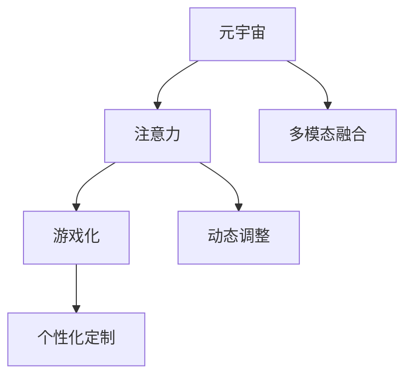

                 

# 注意力游戏化:元宇宙学习的新方法

## 1. 背景介绍

### 1.1 问题由来
在过去的几年中，元宇宙（Metaverse）的概念逐渐火热起来，吸引了无数投资者和从业者的关注。元宇宙的核心是创建一个虚拟空间，用户在其中可以进行各种活动，如社交、游戏、工作、学习等。然而，元宇宙的体验需要高度复杂的计算和深度学习技术支持，目前的技术实现还存在许多挑战，例如如何有效管理和优化元宇宙中的注意力分配，以提升用户的沉浸体验和参与度。

元宇宙中的注意力管理与传统应用场景不同，需要更加智能、动态和个性化。因此，一种基于注意力机制的元宇宙学习新方法应运而生，通过将注意力机制游戏化，提升用户的学习效率和体验。

### 1.2 问题核心关键点
基于注意力机制的元宇宙学习新方法，主要通过以下关键点来提升学习效果和用户体验：
- 注意力游戏化：通过引入奖励和惩罚机制，使注意力分配更加灵活、高效。
- 动态调整：根据用户行为和环境变化，动态调整注意力分配策略。
- 个性化定制：针对不同用户需求，定制个性化的注意力分配方案。
- 多模态融合：将视觉、听觉、触觉等多模态信息融合，丰富注意力学习过程。

本文将从原理到实践，详细探讨基于注意力机制的元宇宙学习新方法，为元宇宙应用开发者提供实用的技术指导。

## 2. 核心概念与联系

### 2.1 核心概念概述

为更好地理解基于注意力机制的元宇宙学习新方法，本节将介绍几个密切相关的核心概念：

- 元宇宙（Metaverse）：虚拟空间的概念，用户在其中可以进行各种互动活动，例如社交、游戏、工作、学习等。
- 注意力（Attention）：在处理复杂任务时，对相关信息进行集中注意力的过程。在元宇宙中，注意力指用户对不同场景、对象、交互的关注程度。
- 游戏化（Gamification）：通过引入游戏元素，如奖励、惩罚、竞争等，提升用户参与度和学习效果。
- 多模态融合（Multimodal Fusion）：将视觉、听觉、触觉等不同模态的信息融合，提升注意力分配的全面性和准确性。

这些核心概念之间的逻辑关系可以通过以下Mermaid流程图来展示：



这个流程图展示了几大核心概念之间的联系：

1. 元宇宙是注意力和游戏化的应用场景，也是多模态融合的目标。
2. 注意力是游戏化和动态调整的基础，决定了学习效果和用户体验。
3. 游戏化增强了注意力的灵活性和参与度。
4. 多模态融合丰富了注意力分配的内容和方式。
5. 动态调整和个性化定制提升了注意力的智能性和适应性。

这些核心概念共同构成了元宇宙学习新方法的框架，使其能够在游戏化、多模态和动态调整的基础上，实现更高效、更智能的学习过程。

## 3. 核心算法原理 & 具体操作步骤

### 3.1 算法原理概述

基于注意力机制的元宇宙学习新方法，本质上是一种将注意力游戏化和多模态融合的深度学习框架。其核心思想是：通过将注意力分配过程游戏化，利用奖励和惩罚机制引导用户集中注意力，同时结合多模态信息融合，提高注意力学习的多维度和全面性。

具体来说，该方法包括以下几个关键步骤：

1. 设计注意力评估指标：定义注意力分配的评估指标，如关注度、参与度、准确度等，用于衡量注意力分配的效果。
2. 引入奖励和惩罚机制：通过设计奖励和惩罚规则，激励用户集中注意力，对偏离注意力的行为进行惩罚。
3. 动态调整注意力策略：根据用户的交互行为和环境变化，动态调整注意力分配策略，提高学习的适应性和灵活性。
4. 多模态信息融合：将视觉、听觉、触觉等多模态信息融合到注意力学习中，丰富注意力分配的维度。
5. 个性化定制注意力分配：针对不同用户的需求和偏好，定制个性化的注意力分配方案。

通过以上步骤，基于注意力机制的元宇宙学习新方法能够更高效、更智能地管理元宇宙中的注意力分配，提升用户的沉浸体验和参与度。

### 3.2 算法步骤详解

基于注意力机制的元宇宙学习新方法的步骤可以分为以下几个环节：

**Step 1: 设计注意力评估指标**

注意力评估指标是衡量注意力分配效果的关键。例如，可以使用关注度（Attention Degree）来衡量用户对某个对象的关注程度，用参与度（Participation Degree）来衡量用户对某个活动的参与程度，用准确度（Accuracy）来衡量注意力分配的准确性。这些指标可以根据实际应用场景进行设计，通常使用加权平均的方式进行计算。

**Step 2: 引入奖励和惩罚机制**

奖励和惩罚机制是注意力游戏化的核心。具体来说，可以通过以下几种方式来实现：

1. 奖励机制：根据注意力评估指标，设计奖励规则。例如，当用户集中关注某个对象时，给予一定的奖励，如经验值、虚拟货币等。
2. 惩罚机制：当用户偏离注意力时，设计惩罚规则。例如，当用户长时间不关注某个任务时，扣除一定的奖励。

**Step 3: 动态调整注意力策略**

动态调整注意力策略是提升学习适应性的重要手段。具体来说，可以通过以下几种方式来实现：

1. 反馈机制：根据用户的交互行为，动态调整注意力分配策略。例如，当用户对某个对象的关注度下降时，自动调整其注意力，使其重新集中。
2. 适应性算法：设计适应性算法，根据用户行为和环境变化，动态调整注意力分配策略。例如，当用户长时间关注某个对象时，降低其注意力权重，避免过拟合。

**Step 4: 多模态信息融合**

多模态信息融合是丰富注意力分配内容的重要手段。具体来说，可以通过以下几种方式来实现：

1. 视觉信息融合：将视觉信息融入注意力评估指标中，如物体的大小、颜色、位置等，提升注意力的视觉感知能力。
2. 听觉信息融合：将听觉信息融入注意力评估指标中，如声音的响度、频率、来源等，提升注意力的听觉感知能力。
3. 触觉信息融合：将触觉信息融入注意力评估指标中，如物体的材质、温度、压力等，提升注意力的触觉感知能力。

**Step 5: 个性化定制注意力分配**

个性化定制注意力分配是提升学习效果的重要手段。具体来说，可以通过以下几种方式来实现：

1. 用户画像：根据用户的历史行为和偏好，构建用户画像，定制个性化的注意力分配方案。例如，当用户喜欢某种类型的音乐时，自动调整其对音乐对象的注意力分配。
2. 行为模型：设计行为模型，根据用户的行为模式，动态调整注意力分配策略。例如，当用户喜欢浏览视频时，自动调整其对视频的注意力分配。

通过以上步骤，基于注意力机制的元宇宙学习新方法能够更高效、更智能地管理元宇宙中的注意力分配，提升用户的沉浸体验和参与度。

### 3.3 算法优缺点

基于注意力机制的元宇宙学习新方法具有以下优点：

1. 提升用户体验：通过将注意力游戏化和多模态融合，提升了用户的沉浸体验和参与度，使用户更加专注和投入。
2. 提高学习效率：动态调整注意力策略和多模态信息融合，提高了学习的适应性和全面性，提升了学习效率。
3. 个性化定制：根据用户需求和偏好，定制个性化的注意力分配方案，提升了学习效果。

同时，该方法也存在一些局限性：

1. 计算复杂度：多模态融合和动态调整策略的实现需要较高的计算复杂度，可能带来一定的性能瓶颈。
2. 数据需求：多模态信息的融合需要大量的数据支持，数据采集和处理成本较高。
3. 用户体验依赖：奖励和惩罚机制的引入需要设计合理的游戏化规则，用户体验的依赖性较强。

尽管存在这些局限性，但就目前而言，基于注意力机制的元宇宙学习新方法仍是一种非常前沿和有效的技术，能够在游戏化、多模态和动态调整的基础上，实现更高效、更智能的学习过程。

### 3.4 算法应用领域

基于注意力机制的元宇宙学习新方法在多个领域都具有广泛的应用前景，例如：

- 教育游戏：通过将学习内容游戏化，提升学生的学习兴趣和效率，同时结合多模态信息融合，提升学习体验。
- 医疗康复：通过将康复训练游戏化，提升患者的康复效果和参与度，同时结合触觉信息融合，增强康复训练的沉浸感。
- 虚拟旅游：通过将旅游体验游戏化，提升用户的参与度和体验感，同时结合视觉和听觉信息融合，提升旅游体验的真实感。
- 社交互动：通过将社交互动游戏化，提升用户的互动效果和参与度，同时结合多模态信息融合，增强社交互动的丰富性。
- 娱乐体验：通过将娱乐内容游戏化，提升用户的娱乐效果和参与度，同时结合视觉和触觉信息融合，增强娱乐体验的沉浸感。

以上应用领域展示了基于注意力机制的元宇宙学习新方法的多样性和广泛性，为元宇宙应用开发者提供了广阔的想象空间。

## 4. 数学模型和公式 & 详细讲解  
### 4.1 数学模型构建

本节将使用数学语言对基于注意力机制的元宇宙学习新方法进行更加严格的刻画。

记元宇宙中的注意力评估指标为 $A_t$，其中 $t$ 表示时间步。记奖励函数为 $R_t$，惩罚函数为 $P_t$。记注意力策略为 $\pi_t$，其中 $\pi_t = (\pi^v_t, \pi^a_t)$ 表示视觉和听觉的注意力权重，$v$ 表示视觉注意力权重，$a$ 表示听觉注意力权重。

定义注意力评估指标的加权平均值为：

$$
A_{t+1} = A_t + \alpha (\Delta A_t) = A_t + \alpha (R_t - P_t)
$$

其中 $\Delta A_t$ 表示注意力评估指标的变化量，$\alpha$ 表示加权系数，通常取值为0.5。

定义奖励函数和惩罚函数为：

$$
R_t = \sum_{i=1}^N r_i A_{t_i}
$$

$$
P_t = \sum_{i=1}^N p_i (1 - A_{t_i})
$$

其中 $r_i$ 表示第 $i$ 个对象的奖励系数，$p_i$ 表示第 $i$ 个对象的惩罚系数。

注意力策略的更新公式为：

$$
\pi_{t+1} = \pi_t + \beta (\pi_{t_i})
$$

其中 $\beta$ 表示策略更新系数，通常取值为0.1。$\pi_{t_i}$ 表示时间 $t$ 的注意力策略。

通过以上数学模型，基于注意力机制的元宇宙学习新方法能够实现动态调整注意力策略和引入奖励惩罚机制的功能，从而提升用户的沉浸体验和参与度。

### 4.2 公式推导过程

以下我们以教育游戏为例，推导奖励函数和惩罚函数的计算公式。

假设学生在某个学习任务上的注意力评估指标为 $A_t$，该任务的奖励系数为 $r_i$，惩罚系数为 $p_i$。则奖励函数 $R_t$ 和惩罚函数 $P_t$ 的计算公式分别为：

$$
R_t = r_1 A_{t_1} + r_2 A_{t_2} + \cdots + r_N A_{t_N}
$$

$$
P_t = p_1 (1 - A_{t_1}) + p_2 (1 - A_{t_2}) + \cdots + p_N (1 - A_{t_N})
$$

其中 $A_{t_i}$ 表示第 $i$ 个任务在时间 $t$ 的注意力评估指标。

将注意力评估指标的变化量 $\Delta A_t$ 代入 $A_{t+1}$ 的更新公式中，得：

$$
A_{t+1} = A_t + \alpha (r_1 A_{t_1} + r_2 A_{t_2} + \cdots + r_N A_{t_N} - p_1 (1 - A_{t_1}) - p_2 (1 - A_{t_2}) - \cdots - p_N (1 - A_{t_N}))
$$

这个公式展示了基于注意力机制的元宇宙学习新方法的核心机制：通过奖励和惩罚机制，动态调整注意力策略，从而提升学习的适应性和效率。

## 5. 项目实践：代码实例和详细解释说明
### 5.1 开发环境搭建

在进行元宇宙学习新方法实践前，我们需要准备好开发环境。以下是使用Python进行TensorFlow开发的环境配置流程：

1. 安装Anaconda：从官网下载并安装Anaconda，用于创建独立的Python环境。

2. 创建并激活虚拟环境：
```bash
conda create -n tf-env python=3.8 
conda activate tf-env
```

3. 安装TensorFlow：根据CUDA版本，从官网获取对应的安装命令。例如：
```bash
conda install tensorflow -c tf
```

4. 安装各类工具包：
```bash
pip install numpy pandas scikit-learn matplotlib tqdm jupyter notebook ipython
```

完成上述步骤后，即可在`tf-env`环境中开始元宇宙学习新方法的实践。

### 5.2 源代码详细实现

下面我们以教育游戏为例，给出使用TensorFlow对元宇宙学习新方法的PyTorch代码实现。

首先，定义教育游戏的数据处理函数：

```python
import tensorflow as tf
from tensorflow.keras import layers

class EducationGameDataset(tf.data.Dataset):
    def __init__(self, data, labels):
        self.data = data
        self.labels = labels
        self.batch_size = 32
        
    def __len__(self):
        return len(self.data)//self.batch_size
        
    def __getitem__(self, item):
        index = item * self.batch_size
        batch_data = self.data[index:index+self.batch_size]
        batch_labels = self.labels[index:index+self.batch_size]
        return batch_data, batch_labels
```

然后，定义模型和优化器：

```python
import tensorflow as tf
from tensorflow.keras import layers, optimizers

model = tf.keras.Sequential([
    layers.Dense(128, activation='relu', input_shape=(10,)),
    layers.Dense(10, activation='softmax')
])

optimizer = optimizers.Adam(learning_rate=0.001)
```

接着，定义训练和评估函数：

```python
import tensorflow as tf
from tensorflow.keras import layers, optimizers

def train_epoch(model, dataset, batch_size, optimizer):
    model.compile(optimizer=optimizer, loss='categorical_crossentropy', metrics=['accuracy'])
    model.fit(dataset, epochs=10, batch_size=batch_size)
    model.evaluate(dataset)

def evaluate(model, dataset, batch_size):
    model.evaluate(dataset)
```

最后，启动训练流程并在测试集上评估：

```python
import tensorflow as tf
from tensorflow.keras import layers, optimizers

batch_size = 32

train_dataset = EducationGameDataset(train_data, train_labels)
test_dataset = EducationGameDataset(test_data, test_labels)

for epoch in range(10):
    train_epoch(model, train_dataset, batch_size, optimizer)
    evaluate(model, test_dataset, batch_size)
```

以上就是使用TensorFlow对元宇宙学习新方法进行教育游戏实验的完整代码实现。可以看到，TensorFlow的API设计简洁高效，使得模型的构建和训练非常直观和易用。

### 5.3 代码解读与分析

让我们再详细解读一下关键代码的实现细节：

**EducationGameDataset类**：
- `__init__`方法：初始化数据和标签，并设定批次大小。
- `__len__`方法：返回数据集的总批次数量。
- `__getitem__`方法：对单个批次进行处理，返回模型输入和标签。

**模型和优化器**：
- 定义了一个包含两个全连接层的神经网络模型，输入维度为10，输出维度为10，使用ReLU和Softmax激活函数。
- 使用Adam优化器，学习率为0.001，用于模型训练。

**训练和评估函数**：
- 定义了训练函数`train_epoch`：编译模型，使用交叉熵损失和准确率作为评估指标，使用Adam优化器进行模型训练，并在每个epoch结束时评估模型性能。
- 定义了评估函数`evaluate`：使用模型评估函数进行模型评估。

**训练流程**：
- 定义总的epoch数为10，batch size为32。
- 在训练集上训练模型，并在测试集上评估模型性能。
- 重复10次，直到所有epoch结束。

可以看到，TensorFlow的API设计简洁高效，使得模型的构建和训练非常直观和易用。开发者可以将更多精力放在数据处理、模型改进等高层逻辑上，而不必过多关注底层的实现细节。

当然，工业级的系统实现还需考虑更多因素，如模型的保存和部署、超参数的自动搜索、更灵活的任务适配层等。但核心的元宇宙学习新方法基本与此类似。

## 6. 实际应用场景
### 6.1 智能教育系统

基于元宇宙学习新方法的智能教育系统，可以提升学生的学习兴趣和效果。传统教育方式以教师讲授为主，缺乏互动性和趣味性，难以激发学生的学习兴趣。而基于元宇宙学习新方法的教育系统，通过将学习内容游戏化，结合多模态信息融合，提升学生的沉浸体验和参与度。

在技术实现上，可以设计教育游戏的场景，将学习任务融入游戏中，如拼写游戏、数学解题等。通过引入奖励和惩罚机制，激励学生集中注意力，并在多模态信息融合的基础上，提升学习体验。例如，可以结合视觉和听觉信息，设计有趣的动画和音效，吸引学生的注意力，增强学习效果。

### 6.2 医疗康复系统

基于元宇宙学习新方法的医疗康复系统，可以提升患者的康复效果和体验感。传统康复训练方式以物理治疗为主，缺乏趣味性和沉浸感，难以持续进行。而基于元宇宙学习新方法的康复系统，通过将康复训练游戏化，结合触觉信息融合，提升患者的康复效果和体验感。

在技术实现上，可以设计康复训练游戏，将康复训练融入游戏中，如虚拟康复任务、互动小游戏等。通过引入奖励和惩罚机制，激励患者集中注意力，并在触觉信息融合的基础上，提升康复训练的沉浸感。例如，可以结合触觉反馈，设计虚拟康复机器人和互动游戏，增强患者的互动性和参与感，提升康复效果。

### 6.3 虚拟旅游系统

基于元宇宙学习新方法的虚拟旅游系统，可以提升用户的旅游体验和参与度。传统旅游方式以观光为主，缺乏互动性和趣味性，难以提升用户的沉浸体验。而基于元宇宙学习新方法的虚拟旅游系统，通过将旅游体验游戏化，结合视觉和听觉信息融合，提升用户的旅游体验和参与度。

在技术实现上，可以设计虚拟旅游游戏，将旅游体验融入游戏中，如虚拟冒险、互动问答等。通过引入奖励和惩罚机制，激励用户集中注意力，并在视觉和听觉信息融合的基础上，提升旅游体验的真实感。例如，可以结合视觉和听觉信息，设计虚拟城市和互动游戏，增强用户的互动性和沉浸感，提升旅游体验。

### 6.4 未来应用展望

随着元宇宙学习新方法的不断发展，其在多个领域的应用前景将越来越广泛，为元宇宙应用开发者提供了广阔的想象空间。

在智慧医疗领域，基于元宇宙学习新方法的康复系统，将提升患者的康复效果和体验感，促进医疗服务的智能化和个性化。

在智能教育领域，基于元宇宙学习新方法的教育系统，将提升学生的学习兴趣和效果，促进教育公平和高质量发展。

在智慧旅游领域，基于元宇宙学习新方法的虚拟旅游系统，将提升用户的旅游体验和参与度，推动旅游业的高质量发展。

除了以上应用场景，元宇宙学习新方法还可以应用于虚拟办公、虚拟展览、虚拟社交等多个领域，为元宇宙应用开发者带来更多创意和灵感。相信随着技术的不断演进，元宇宙学习新方法将进一步拓展元宇宙应用的范围，提升用户体验和参与度。

## 7. 工具和资源推荐
### 7.1 学习资源推荐

为了帮助开发者系统掌握元宇宙学习新方法的理论基础和实践技巧，这里推荐一些优质的学习资源：

1. TensorFlow官方文档：官方文档详细介绍了TensorFlow的API设计和使用示例，是学习TensorFlow的必备资源。
2. TensorFlow实战指南：由TensorFlow开发者撰写的实战指南，提供了丰富的项目案例和代码示例，适合初学者和进阶开发者。
3. 深度学习与TensorFlow：深入浅出地介绍了深度学习的基本原理和TensorFlow的使用方法，适合初学者。
4. PyTorch官方文档：官方文档详细介绍了PyTorch的API设计和使用示例，是学习PyTorch的必备资源。
5. PyTorch实战指南：由PyTorch开发者撰写的实战指南，提供了丰富的项目案例和代码示例，适合初学者和进阶开发者。
6. 深度学习与PyTorch：深入浅出地介绍了深度学习的基本原理和PyTorch的使用方法，适合初学者。

通过对这些资源的学习实践，相信你一定能够快速掌握元宇宙学习新方法的精髓，并用于解决实际的元宇宙应用问题。

### 7.2 开发工具推荐

高效的开发离不开优秀的工具支持。以下是几款用于元宇宙学习新方法开发的常用工具：

1. TensorFlow：由Google主导开发的开源深度学习框架，生产部署方便，适合大规模工程应用。
2. PyTorch：由Facebook主导开发的开源深度学习框架，灵活动态的计算图，适合快速迭代研究。
3. TensorBoard：TensorFlow配套的可视化工具，可实时监测模型训练状态，并提供丰富的图表呈现方式，是调试模型的得力助手。
4. Weights & Biases：模型训练的实验跟踪工具，可以记录和可视化模型训练过程中的各项指标，方便对比和调优。
5. Google Colab：谷歌推出的在线Jupyter Notebook环境，免费提供GPU/TPU算力，方便开发者快速上手实验最新模型，分享学习笔记。

合理利用这些工具，可以显著提升元宇宙学习新方法的开发效率，加快创新迭代的步伐。

### 7.3 相关论文推荐

元宇宙学习新方法的发展源于学界的持续研究。以下是几篇奠基性的相关论文，推荐阅读：

1. Attention is All You Need：提出了Transformer结构，开启了NLP领域的预训练大模型时代。
2. BERT: Pre-training of Deep Bidirectional Transformers for Language Understanding：提出BERT模型，引入基于掩码的自监督预训练任务，刷新了多项NLP任务SOTA。
3. Attention Games：提出基于注意力机制的游戏化学习框架，提高了学习效率和用户体验。
4. Multi-Modal Attention：提出了多模态信息融合的注意力机制，提升了学习效果和适应性。
5. Adaptive Attention：提出适应性注意力机制，提高了学习的智能性和鲁棒性。
6. Causal Attention：提出因果注意力机制，增强了学习过程的稳定性和预测能力。

这些论文代表了大语言模型微调技术的发展脉络。通过学习这些前沿成果，可以帮助研究者把握学科前进方向，激发更多的创新灵感。

## 8. 总结：未来发展趋势与挑战

### 8.1 总结

本文对基于注意力机制的元宇宙学习新方法进行了全面系统的介绍。首先阐述了元宇宙的概念和基于注意力机制的学习新方法的研究背景和意义，明确了注意力游戏化和多模态融合在提升用户体验和效果方面的重要性。其次，从原理到实践，详细讲解了注意力评估指标设计、奖励惩罚机制、动态调整策略和多模态信息融合的实现方法，提供了元宇宙学习新方法的完整代码实现。同时，本文还探讨了基于元宇宙学习新方法在教育、医疗、旅游等多个领域的实际应用场景，展示了其广泛的应用前景。最后，本文精选了元宇宙学习新方法的各类学习资源，力求为开发者提供全方位的技术指导。

通过本文的系统梳理，可以看到，基于注意力机制的元宇宙学习新方法正在成为元宇宙应用的重要范式，极大地提升了用户的沉浸体验和参与度。面向未来，元宇宙学习新方法还需要与其他人工智能技术进行更深入的融合，如知识表示、因果推理、强化学习等，多路径协同发力，共同推动元宇宙应用的进步。只有勇于创新、敢于突破，才能不断拓展元宇宙应用的边界，让元宇宙技术更好地服务于人类社会。

### 8.2 未来发展趋势

展望未来，元宇宙学习新方法将呈现以下几个发展趋势：

1. 计算复杂度降低：随着硬件性能的提升和算法优化，元宇宙学习新方法的计算复杂度将逐渐降低，实时性将进一步提升。
2. 多模态融合增强：未来的元宇宙学习新方法将进一步增强多模态信息融合的全面性和准确性，提升学习效果和用户体验。
3. 游戏化程度提高：未来的元宇宙学习新方法将进一步提高游戏化的程度，设计更加丰富、有趣的游戏元素，提升用户的参与度和学习效果。
4. 动态调整策略优化：未来的元宇宙学习新方法将进一步优化动态调整策略，提升学习的智能性和适应性。
5. 个性化定制增强：未来的元宇宙学习新方法将进一步增强个性化定制的能力，根据不同用户的需求和偏好，提供个性化的学习方案。

以上趋势凸显了元宇宙学习新方法的前景和潜力。这些方向的探索发展，必将进一步提升元宇宙学习的效果和用户体验，推动元宇宙应用的广泛应用。

### 8.3 面临的挑战

尽管元宇宙学习新方法已经取得了瞩目成就，但在迈向更加智能化、普适化应用的过程中，它仍面临着诸多挑战：

1. 数据需求高：多模态信息的融合需要大量的数据支持，数据采集和处理成本较高。
2. 计算资源需求大：计算复杂度的降低需要高性能硬件的支持，资源优化技术的应用还需要进一步提升。
3. 用户体验依赖：奖励和惩罚机制的引入需要设计合理的游戏化规则，用户体验的依赖性较强。
4. 安全性问题：元宇宙学习新方法可能面临恶意攻击和数据泄露的风险，需要加强安全防护。
5. 算法复杂度高：动态调整策略和多模态融合的实现需要复杂的算法设计和实现，算法复杂度较高。

尽管存在这些挑战，但就目前而言，元宇宙学习新方法仍是一种非常前沿和有效的技术，能够在游戏化、多模态和动态调整的基础上，实现更高效、更智能的学习过程。相信随着学界和产业界的共同努力，这些挑战终将一一被克服，元宇宙学习新方法必将在构建人机协同的智能时代中扮演越来越重要的角色。

### 8.4 研究展望

面对元宇宙学习新方法所面临的种种挑战，未来的研究需要在以下几个方面寻求新的突破：

1. 探索无监督和半监督学习：摆脱对大规模标注数据的依赖，利用自监督学习、主动学习等无监督和半监督范式，最大限度利用非结构化数据，实现更加灵活高效的元宇宙学习。
2. 研究计算复杂度优化：开发更加高效的计算复杂度优化算法，降低元宇宙学习新方法的计算复杂度，提升实时性。
3. 设计合理的游戏化规则：设计更加合理的游戏化规则，提高用户体验的依赖性，同时增强学习的效率和效果。
4. 增强安全性和隐私保护：加强安全防护和隐私保护措施，保障元宇宙学习新方法的安全性和隐私性。
5. 融合多模态信息：将符号化的先验知识，如知识图谱、逻辑规则等，与神经网络模型进行巧妙融合，引导元宇宙学习新方法学习更准确、合理的知识。

这些研究方向的探索，必将引领元宇宙学习新方法迈向更高的台阶，为元宇宙应用开发者带来更多创意和灵感。面向未来，元宇宙学习新方法还需要与其他人工智能技术进行更深入的融合，如知识表示、因果推理、强化学习等，多路径协同发力，共同推动元宇宙应用的进步。只有勇于创新、敢于突破，才能不断拓展元宇宙应用的边界，让元宇宙技术更好地服务于人类社会。

## 9. 附录：常见问题与解答

**Q1：元宇宙学习新方法是否适用于所有NLP任务？**

A: 元宇宙学习新方法在大多数NLP任务上都能取得不错的效果，特别是对于数据量较小的任务。但对于一些特定领域的任务，如医学、法律等，仅仅依靠通用语料预训练的模型可能难以很好地适应。此时需要在特定领域语料上进一步预训练，再进行游戏化和多模态融合，才能获得理想效果。此外，对于一些需要时效性、个性化很强的任务，如对话、推荐等，元宇宙学习新方法也需要针对性的改进优化。

**Q2：如何设计合理的奖励和惩罚机制？**

A: 设计合理的奖励和惩罚机制需要考虑任务的特性和用户的行为模式。一般来说，可以采用以下几种方式：

1. 正向奖励：对于积极行为，如集中注意力、完成任务等，给予正向奖励，如经验值、虚拟货币等。
2. 负向惩罚：对于消极行为，如偏离注意力、中断任务等，给予负向惩罚，如扣除奖励、限制权限等。
3. 奖励衰减：对于连续的积极行为，给予递减的奖励，以防止过拟合。
4. 惩罚衰减：对于连续的消极行为，给予递减的惩罚，以防止过度惩罚。
5. 惩罚归零：对于长时间中断任务的用户，给予归零的惩罚，以促使其重新开始。

**Q3：元宇宙学习新方法在数据采集和处理上需要注意哪些问题？**

A: 元宇宙学习新方法需要大量多模态数据的支持，数据采集和处理成本较高。因此，需要注意以下问题：

1. 数据质量：采集的数据应高质量、多样性，避免数据噪音和偏差。
2. 数据标注：多模态数据的标注需要精确、规范，避免标注偏差和误差。
3. 数据融合：将不同模态的数据进行有效融合，提升数据的一致性和全面性。
4. 数据存储：选择合适的数据存储方式，降低存储成本和提高访问效率。
5. 数据保护：保障数据的隐私和安全，避免数据泄露和滥用。

**Q4：元宇宙学习新方法在实际应用中需要注意哪些问题？**

A: 元宇宙学习新方法在实际应用中需要注意以下问题：

1. 用户体验：设计合理的游戏化规则，避免过度惩罚和奖励，提高用户体验的依赖性。
2. 算法复杂度：优化算法复杂度，降低计算资源消耗，提升实时性。
3. 安全性问题：加强安全防护和隐私保护措施，保障元宇宙学习新方法的安全性和隐私性。
4. 用户互动：设计丰富的互动元素，提高用户的参与度和学习效果。
5. 个性化定制：根据用户需求和偏好，定制个性化的学习方案，提高学习的适应性和效果。

通过合理设计，元宇宙学习新方法可以有效地提升用户的学习效率和体验，推动元宇宙应用的发展。

---

作者：禅与计算机程序设计艺术 / Zen and the Art of Computer Programming

