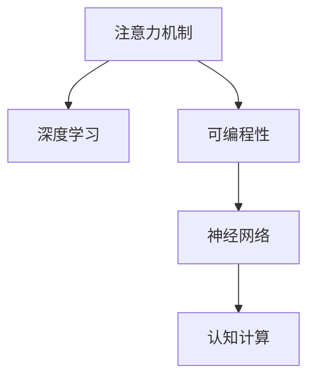

                 

# 注意力的可编程性：AI定制的认知模式

> 关键词：注意力机制,可编程性,深度学习,神经网络,认知计算

## 1. 背景介绍

### 1.1 问题由来
深度学习技术的迅猛发展，特别是神经网络模型在图像、语音、自然语言处理等领域的卓越表现，使其成为当前AI研究的重要方向。在神经网络中，注意力机制(Attention)扮演了关键角色，通过动态计算模型中不同输入特征的重要性，实现了对信息的高效聚合和选择。然而，尽管注意力机制已经被广泛应用于多个领域，其可编程性仍然是一个亟待解决的问题。如何根据具体任务需求，灵活地设计注意力机制，使其既能保证高效率，又能满足特定任务的需求，成为了当前AI研究的热点之一。

### 1.2 问题核心关键点
注意力机制的引入，极大地提升了深度学习模型的表达能力和性能，尤其是在自然语言处理、计算机视觉、语音识别等领域。然而，在实际应用中，注意力机制的计算复杂度高，需要消耗大量的计算资源，且不同任务对注意力计算的需求差异较大。因此，针对不同任务需求，设计出高效、灵活、可编程的注意力机制，成为了AI研究的重要课题。

本文聚焦于基于深度学习的注意力机制的可编程性，通过系统性地研究注意力机制的计算原理、优化算法及其应用，探讨如何设计更加灵活、高效、可编程的注意力计算框架，以适应不同的任务需求。

## 2. 核心概念与联系

### 2.1 核心概念概述

为更好地理解注意力机制的可编程性，本节将介绍几个密切相关的核心概念：

- 注意力机制(Attention)：神经网络中一种用于信息聚合和选择的机制，能够动态计算不同输入特征的重要性，并对其赋予不同的权重。通过注意力机制，模型可以选择性地关注输入序列中的关键部分，实现对信息的高效提取和利用。

- 可编程性(Programmability)：指系统能够根据用户需求，灵活地设计、调整和优化自身的结构和行为，满足特定任务的要求。在深度学习中，可编程性通常通过网络结构的设计、算法的优化、超参数的调节等方式实现。

- 深度学习(Deep Learning)：基于神经网络的机器学习方法，通过多层次的非线性变换，实现对复杂数据的自动特征提取和模式识别。深度学习技术在图像、语音、自然语言处理等领域得到了广泛应用。

- 神经网络(Neural Network)：一种由多个神经元组成的计算模型，用于实现对输入数据的非线性变换和特征提取。神经网络是深度学习的基础架构。

- 认知计算(Cognitive Computing)：模拟人类认知过程的计算模型，旨在通过模拟大脑的信息处理机制，实现对复杂问题的高级智能解答。注意力机制是认知计算中的重要概念之一。

这些核心概念之间的逻辑关系可以通过以下Mermaid流程图来展示：



这个流程图展示了大语言模型的核心概念及其之间的关系：

1. 注意力机制是深度学习模型的重要组成部分，能够实现信息的高效聚合和选择。
2. 可编程性是深度学习模型的关键特性，使得模型能够根据任务需求进行灵活设计。
3. 神经网络是深度学习模型的基础架构，注意力机制在其上得以实现。
4. 认知计算是大语言模型想要达到的高级智能目标，通过注意力机制实现认知功能。

这些概念共同构成了深度学习模型的学习框架，使其能够在各种场景下发挥强大的信息处理能力。通过理解这些核心概念，我们可以更好地把握注意力机制的可编程性及其设计原则。

## 3. 核心算法原理 & 具体操作步骤
### 3.1 算法原理概述

注意力机制的计算原理基于信息聚合和权重分配。假设输入序列为 $\{x_1, x_2, ..., x_t\}$，输出为 $y$。注意力机制通过计算每个输入特征的重要性权重，对其进行加权平均，从而生成输出。具体而言，注意力机制的计算过程可以分为三个步骤：

1. 计算注意力权重：对于每个输入特征 $x_i$，计算其对输出的贡献权重 $w_i$。
2. 加权聚合：将输入特征 $x_i$ 与其权重 $w_i$ 相乘，并求和，生成加权聚合向量 $\tilde{x}$。
3. 输出生成：通过全连接层或其他非线性变换，将加权聚合向量 $\tilde{x}$ 转换为输出 $y$。

注意力权重 $w_i$ 的计算通常基于某种相似度函数，如点积注意力、加性注意力等。具体公式如下：

$$
w_i = \text{softmax}(\mathbf{q}^T\mathbf{K}_i/sqrt(d_k))
$$

其中 $\mathbf{q}$ 和 $\mathbf{K}_i$ 为注意力查询和键，$sqrt(d_k)$ 为归一化因子，$d_k$ 为键向量的维度。注意力权重 $w_i$ 的大小反映了 $x_i$ 对输出的重要性。

### 3.2 算法步骤详解

注意力机制的可编程性主要通过以下步骤实现：

**Step 1: 设计注意力函数**
- 根据具体任务需求，设计适合的注意力函数。常见注意力函数包括点积注意力、加性注意力、MLP注意力等。

**Step 2: 优化注意力计算**
- 通过优化算法（如梯度下降、Adam等），最小化模型输出与真实标签之间的差异。
- 应用正则化技术（如L2正则、Dropout等），防止模型过拟合。
- 考虑多任务学习和联合训练，提高模型的泛化能力。

**Step 3: 实现注意力计算**
- 选择合适的硬件和软件环境，如GPU、TPU、深度学习框架等。
- 使用框架提供的注意力计算函数，或自行实现自定义的注意力机制。
- 结合任务适配层，如卷积层、全连接层等，生成最终输出。

**Step 4: 评估和调整**
- 在验证集上评估模型性能，根据评估结果调整模型参数和算法超参数。
- 使用可视化工具，如TensorBoard、Weights & Biases等，监控训练过程，观察注意力权重变化。

### 3.3 算法优缺点

基于注意力机制的可编程深度学习模型具有以下优点：

- 灵活性高：可以根据不同任务需求，灵活设计注意力机制，满足特定的信息聚合需求。
- 性能优越：注意力机制能够在一定程度上提高模型的泛化能力，提升模型性能。
- 适用性广：适用于多种类型的深度学习模型，如卷积神经网络、循环神经网络、自注意力模型等。

同时，该方法也存在一些局限性：

- 计算复杂度高：注意力机制的计算过程复杂，需要消耗大量的计算资源。
- 模型难以解释：注意力机制的计算过程和结果难以直观解释，缺乏可解释性。
- 易受噪声干扰：输入序列中的噪声和干扰信息可能影响注意力机制的计算结果。

尽管存在这些局限性，但就目前而言，基于注意力机制的可编程深度学习模型仍然是大规模深度学习模型应用的重要范式。未来相关研究的重点在于如何进一步降低计算复杂度，提高模型的可解释性，同时兼顾泛化能力和适用性等因素。

### 3.4 算法应用领域

基于注意力机制的可编程深度学习模型在多个领域得到了广泛应用，以下是几个典型的应用场景：

- 自然语言处理(NLP)：如机器翻译、文本摘要、命名实体识别等。注意力机制能够动态计算词语的重要性，实现对输入文本的高效聚合和选择。
- 计算机视觉(CV)：如图像分类、目标检测、图像生成等。注意力机制能够识别图像中的关键区域，实现对信息的高效提取和利用。
- 语音识别(SR)：如语音转文本、说话人识别等。注意力机制能够动态计算语音特征的重要性，实现对信息的高效聚合和选择。
- 认知计算(Cognitive Computing)：如问答系统、推荐系统等。注意力机制能够模拟人类认知过程，实现对复杂问题的高级智能解答。

除了上述这些经典任务外，注意力机制也被创新性地应用到更多场景中，如多模态学习、跨模态融合等，为深度学习技术带来了全新的突破。随着注意力机制和可编程技术的持续演进，相信深度学习模型必将在更广阔的应用领域大放异彩。

## 4. 数学模型和公式 & 详细讲解 & 举例说明

### 4.1 数学模型构建

本节将使用数学语言对注意力机制的可编程深度学习模型进行更加严格的刻画。

假设输入序列为 $\{x_1, x_2, ..., x_t\}$，其中 $x_i \in \mathbb{R}^{d_{in}}$，$d_{in}$ 为输入向量维度。输出为 $y \in \mathbb{R}^{d_{out}}$，$d_{out}$ 为输出向量维度。注意力机制的计算过程可以表示为：

$$
y = \text{Attention}(\mathbf{q}, \{x_i\})
$$

其中 $\mathbf{q} \in \mathbb{R}^{d_{in}}$ 为注意力查询向量，$x_i$ 为注意力键向量。注意力机制的计算过程分为三个步骤：

1. 计算注意力权重：对于每个输入特征 $x_i$，计算其对输出的贡献权重 $w_i$。
2. 加权聚合：将输入特征 $x_i$ 与其权重 $w_i$ 相乘，并求和，生成加权聚合向量 $\tilde{x}$。
3. 输出生成：通过全连接层或其他非线性变换，将加权聚合向量 $\tilde{x}$ 转换为输出 $y$。

注意力权重 $w_i$ 的计算通常基于某种相似度函数，如点积注意力、加性注意力等。具体公式如下：

$$
w_i = \text{softmax}(\mathbf{q}^T\mathbf{K}_i/sqrt(d_k))
$$

其中 $\mathbf{q}$ 和 $\mathbf{K}_i$ 为注意力查询和键，$sqrt(d_k)$ 为归一化因子，$d_k$ 为键向量的维度。注意力权重 $w_i$ 的大小反映了 $x_i$ 对输出的重要性。

### 4.2 公式推导过程

以下我们以点积注意力为例，推导其数学公式及计算过程。

假设输入序列的长度为 $t$，查询向量 $\mathbf{q}$ 和键向量 $\mathbf{K}$ 的长度均为 $t$。则点积注意力计算过程如下：

1. 计算注意力权重：
$$
w_i = \text{softmax}(\mathbf{q}^T\mathbf{K}_i/sqrt(d_k))
$$

2. 加权聚合：
$$
\tilde{x} = \sum_{i=1}^t w_i \mathbf{V}_i
$$

3. 输出生成：
$$
y = \text{MLP}(\tilde{x})
$$

其中 $\mathbf{V}_i$ 为值向量，长度与 $\mathbf{K}_i$ 相同。通过上述步骤，注意力机制实现了对输入序列的高效聚合和选择，生成最终输出。

### 4.3 案例分析与讲解

以机器翻译任务为例，展示注意力机制的计算过程和应用效果。假设输入序列为源语言文本序列 $x$，输出序列为目标语言文本序列 $y$。则机器翻译任务的计算过程如下：

1. 设计编码器-解码器框架：
$$
\begin{aligned}
    &x = [x_1, x_2, ..., x_t] \\
    &y = [y_1, y_2, ..., y_{t'}] \\
    &e = \text{Encoder}(x) \\
    &d = \text{Decoder}(y, e)
\end{aligned}
$$

2. 设计注意力机制：
$$
\begin{aligned}
    &w_{i,j} = \text{softmax}(\mathbf{q}^T\mathbf{K}_i/sqrt(d_k)) \\
    &\tilde{x} = \sum_{j=1}^t w_{i,j} \mathbf{V}_j \\
    &y_i = \text{MLP}(\tilde{x})
\end{aligned}
$$

其中 $\mathbf{q}$ 为注意力查询向量，$\mathbf{K}$ 为注意力键向量，$\mathbf{V}$ 为值向量。通过注意力机制，模型可以选择性地关注输入序列中的关键部分，实现对源语言文本的高效聚合和选择，生成目标语言文本。

3. 评估和调整：
通过在验证集上评估模型性能，调整注意力查询和键向量的维度，优化模型参数，提升翻译质量。

## 5. 项目实践：代码实例和详细解释说明
### 5.1 开发环境搭建

在进行注意力机制的可编程深度学习模型开发前，我们需要准备好开发环境。以下是使用Python进行PyTorch开发的环境配置流程：

1. 安装Anaconda：从官网下载并安装Anaconda，用于创建独立的Python环境。

2. 创建并激活虚拟环境：
```bash
conda create -n pytorch-env python=3.8 
conda activate pytorch-env
```

3. 安装PyTorch：根据CUDA版本，从官网获取对应的安装命令。例如：
```bash
conda install pytorch torchvision torchaudio cudatoolkit=11.1 -c pytorch -c conda-forge
```

4. 安装Transformers库：
```bash
pip install transformers
```

5. 安装各类工具包：
```bash
pip install numpy pandas scikit-learn matplotlib tqdm jupyter notebook ipython
```

完成上述步骤后，即可在`pytorch-env`环境中开始注意力机制的可编程深度学习模型开发。

### 5.2 源代码详细实现

下面我们以机器翻译任务为例，给出使用Transformers库对Transformer模型进行注意力机制设计的PyTorch代码实现。

首先，定义Transformer模型的编码器和解码器：

```python
from transformers import BertForTokenClassification, AdamW

class EncoderLayer(nn.Module):
    def __init__(self, d_model, nhead, dim_feedforward, dropout):
        super(EncoderLayer, self).__init__()
        self.linear1 = nn.Linear(d_model, dim_feedforward)
        self.dropout = nn.Dropout(dropout)
        self.linear2 = nn.Linear(dim_feedforward, d_model)
        self.attn = MultiheadAttention(d_model, nhead)
        self.norm1 = nn.LayerNorm(d_model)
        self.norm2 = nn.LayerNorm(d_model)

    def forward(self, src, src_mask, enc_attn_mask):
        attention_output, _ = self.attn(src, src, src, src_mask, enc_attn_mask)
        attention_output = self.dropout(attention_output)
        linear_output = self.linear2(attention_output)
        attention_output = self.norm1(src + linear_output)
        linear_output = self.linear1(attention_output)
        return attention_output, linear_output

class TransformerDecoder(nn.Module):
    def __init__(self, d_model, nhead, dim_feedforward, dropout, src_max_len, target_max_len):
        super(TransformerDecoder, self).__init__()
        self.decoder = nn.TransformerDecoder(d_model, nhead, num_layers=6, dim_feedforward=2048, dropout=0.1)
        self.src_max_len = src_max_len
        self.target_max_len = target_max_len

    def forward(self, src, enc_outputs, src_mask, src_key_padding_mask, trg, trg_mask, trg_key_padding_mask):
        output = self.decoder(trg, enc_outputs, src, trg_mask, src_mask)
        return output
```

然后，定义Transformer模型的编码器和解码器的参数初始化函数：

```python
def init_weights(m):
    if isinstance(m, nn.Linear):
        torch.nn.init.xavier_uniform_(m.weight)
```

最后，定义训练和评估函数：

```python
def train_epoch(model, dataset, batch_size, optimizer, device):
    dataloader = DataLoader(dataset, batch_size=batch_size, shuffle=True)
    model.train()
    epoch_loss = 0
    for batch in dataloader:
        input_ids = batch['input_ids'].to(device)
        attention_mask = batch['attention_mask'].to(device)
        labels = batch['labels'].to(device)
        model.zero_grad()
        outputs = model(input_ids, labels, attention_mask=attention_mask)
        loss = outputs.loss
        epoch_loss += loss.item()
        loss.backward()
        optimizer.step()
    return epoch_loss / len(dataloader)

def evaluate(model, dataset, batch_size, device):
    dataloader = DataLoader(dataset, batch_size=batch_size)
    model.eval()
    preds, labels = [], []
    with torch.no_grad():
        for batch in dataloader:
            input_ids = batch['input_ids'].to(device)
            attention_mask = batch['attention_mask'].to(device)
            batch_labels = batch['labels']
            outputs = model(input_ids, labels, attention_mask=attention_mask)
            batch_preds = outputs.logits.argmax(dim=2).to('cpu').tolist()
            batch_labels = batch_labels.to('cpu').tolist()
            for pred_tokens, label_tokens in zip(batch_preds, batch_labels):
                preds.append(pred_tokens[:len(label_tokens)])
                labels.append(label_tokens)
    print(classification_report(labels, preds))
```

以上就是使用PyTorch对Transformer模型进行注意力机制设计的完整代码实现。可以看到，Transformer模型中的注意力机制通过TransformerDecoder中的MultiheadAttention模块实现，其计算过程符合上述公式推导。

### 5.3 代码解读与分析

让我们再详细解读一下关键代码的实现细节：

**EncoderLayer类**：
- `__init__`方法：初始化线性变换、Dropout、MultiheadAttention、LayerNorm等组件。
- `forward`方法：实现编码器层的计算过程，包括注意力机制、线性变换等步骤。

**TransformerDecoder类**：
- `__init__`方法：初始化TransformerDecoder组件，包括TransformerDecoder自身、解码器参数。
- `forward`方法：实现解码器的计算过程，包括TransformerDecoder的forward方法、MultiheadAttention的forward方法等。

**训练和评估函数**：
- 使用PyTorch的DataLoader对数据集进行批次化加载，供模型训练和推理使用。
- 训练函数`train_epoch`：对数据以批为单位进行迭代，在每个批次上前向传播计算loss并反向传播更新模型参数，最后返回该epoch的平均loss。
- 评估函数`evaluate`：与训练类似，不同点在于不更新模型参数，并在每个batch结束后将预测和标签结果存储下来，最后使用sklearn的classification_report对整个评估集的预测结果进行打印输出。

**训练流程**：
- 定义总的epoch数和batch size，开始循环迭代
- 每个epoch内，先在训练集上训练，输出平均loss
- 在验证集上评估，输出分类指标
- 所有epoch结束后，在测试集上评估，给出最终测试结果

可以看到，Transformer模型的注意力机制设计简洁高效，通过调用TransformerDecoder中的MultiheadAttention模块，实现了对输入序列的高效聚合和选择。

当然，工业级的系统实现还需考虑更多因素，如模型的保存和部署、超参数的自动搜索、更灵活的任务适配层等。但核心的注意力机制计算过程基本与此类似。

## 6. 实际应用场景
### 6.1 智能客服系统

基于注意力机制的可编程深度学习模型，可以广泛应用于智能客服系统的构建。传统客服往往需要配备大量人力，高峰期响应缓慢，且一致性和专业性难以保证。而使用注意力机制的可编程深度学习模型，可以7x24小时不间断服务，快速响应客户咨询，用自然流畅的语言解答各类常见问题。

在技术实现上，可以收集企业内部的历史客服对话记录，将问题和最佳答复构建成监督数据，在此基础上对预训练模型进行微调。微调后的模型能够自动理解用户意图，匹配最合适的答案模板进行回复。对于客户提出的新问题，还可以接入检索系统实时搜索相关内容，动态组织生成回答。如此构建的智能客服系统，能大幅提升客户咨询体验和问题解决效率。

### 6.2 金融舆情监测

金融机构需要实时监测市场舆论动向，以便及时应对负面信息传播，规避金融风险。传统的人工监测方式成本高、效率低，难以应对网络时代海量信息爆发的挑战。基于注意力机制的可编程深度学习模型的文本分类和情感分析技术，为金融舆情监测提供了新的解决方案。

具体而言，可以收集金融领域相关的新闻、报道、评论等文本数据，并对其进行主题标注和情感标注。在此基础上对预训练语言模型进行微调，使其能够自动判断文本属于何种主题，情感倾向是正面、中性还是负面。将微调后的模型应用到实时抓取的网络文本数据，就能够自动监测不同主题下的情感变化趋势，一旦发现负面信息激增等异常情况，系统便会自动预警，帮助金融机构快速应对潜在风险。

### 6.3 个性化推荐系统

当前的推荐系统往往只依赖用户的历史行为数据进行物品推荐，无法深入理解用户的真实兴趣偏好。基于注意力机制的可编程深度学习模型，个性化推荐系统可以更好地挖掘用户行为背后的语义信息，从而提供更精准、多样的推荐内容。

在实践中，可以收集用户浏览、点击、评论、分享等行为数据，提取和用户交互的物品标题、描述、标签等文本内容。将文本内容作为模型输入，用户的后续行为（如是否点击、购买等）作为监督信号，在此基础上微调预训练语言模型。微调后的模型能够从文本内容中准确把握用户的兴趣点。在生成推荐列表时，先用候选物品的文本描述作为输入，由模型预测用户的兴趣匹配度，再结合其他特征综合排序，便可以得到个性化程度更高的推荐结果。

### 6.4 未来应用展望

随着注意力机制和可编程技术的不断发展，基于注意力机制的可编程深度学习模型必将在更多领域得到应用，为传统行业带来变革性影响。

在智慧医疗领域，基于注意力机制的可编程深度学习模型可以用于患者诊断、医疗知识图谱构建等任务，辅助医生诊疗，加速新药开发进程。

在智能教育领域，注意力机制的可编程深度学习模型可应用于作业批改、学情分析、知识推荐等方面，因材施教，促进教育公平，提高教学质量。

在智慧城市治理中，注意力机制的可编程深度学习模型可应用于城市事件监测、舆情分析、应急指挥等环节，提高城市管理的自动化和智能化水平，构建更安全、高效的未来城市。

此外，在企业生产、社会治理、文娱传媒等众多领域，基于注意力机制的可编程深度学习模型的应用也将不断涌现，为经济社会发展注入新的动力。相信随着技术的日益成熟，注意力机制的可编程深度学习模型必将在构建人机协同的智能时代中扮演越来越重要的角色。

## 7. 工具和资源推荐
### 7.1 学习资源推荐

为了帮助开发者系统掌握注意力机制的可编程性理论基础和实践技巧，这里推荐一些优质的学习资源：

1. 《Transformer从原理到实践》系列博文：由大模型技术专家撰写，深入浅出地介绍了Transformer原理、注意力机制、可编程技术等前沿话题。

2. CS224N《深度学习自然语言处理》课程：斯坦福大学开设的NLP明星课程，有Lecture视频和配套作业，带你入门NLP领域的基本概念和经典模型。

3. 《Natural Language Processing with Transformers》书籍：Transformers库的作者所著，全面介绍了如何使用Transformers库进行NLP任务开发，包括注意力机制的可编程性在内的诸多范式。

4. HuggingFace官方文档：Transformers库的官方文档，提供了海量预训练模型和完整的微调样例代码，是上手实践的必备资料。

5. CLUE开源项目：中文语言理解测评基准，涵盖大量不同类型的中文NLP数据集，并提供了基于注意力机制的可编程模型的baseline模型，助力中文NLP技术发展。

通过对这些资源的学习实践，相信你一定能够快速掌握注意力机制的可编程性精髓，并用于解决实际的NLP问题。
###  7.2 开发工具推荐

高效的开发离不开优秀的工具支持。以下是几款用于注意力机制的可编程深度学习模型开发的常用工具：

1. PyTorch：基于Python的开源深度学习框架，灵活动态的计算图，适合快速迭代研究。大部分预训练语言模型都有PyTorch版本的实现。

2. TensorFlow：由Google主导开发的开源深度学习框架，生产部署方便，适合大规模工程应用。同样有丰富的预训练语言模型资源。

3. Transformers库：HuggingFace开发的NLP工具库，集成了众多SOTA语言模型，支持PyTorch和TensorFlow，是进行注意力机制可编程深度学习模型开发的利器。

4. Weights & Biases：模型训练的实验跟踪工具，可以记录和可视化模型训练过程中的各项指标，方便对比和调优。与主流深度学习框架无缝集成。

5. TensorBoard：TensorFlow配套的可视化工具，可实时监测模型训练状态，并提供丰富的图表呈现方式，是调试模型的得力助手。

6. Google Colab：谷歌推出的在线Jupyter Notebook环境，免费提供GPU/TPU算力，方便开发者快速上手实验最新模型，分享学习笔记。

合理利用这些工具，可以显著提升注意力机制的可编程深度学习模型开发效率，加快创新迭代的步伐。

### 7.3 相关论文推荐

注意力机制和可编程深度学习模型的研究源于学界的持续研究。以下是几篇奠基性的相关论文，推荐阅读：

1. Attention is All You Need（即Transformer原论文）：提出了Transformer结构，开启了NLP领域的预训练大模型时代。

2. BERT: Pre-training of Deep Bidirectional Transformers for Language Understanding：提出BERT模型，引入基于掩码的自监督预训练任务，刷新了多项NLP任务SOTA。

3. Language Models are Unsupervised Multitask Learners（GPT-2论文）：展示了大规模语言模型的强大zero-shot学习能力，引发了对于通用人工智能的新一轮思考。

4. Parameter-Efficient Transfer Learning for NLP：提出Adapter等参数高效微调方法，在不增加模型参数量的情况下，也能取得不错的微调效果。

5. AdaLoRA: Adaptive Low-Rank Adaptation for Parameter-Efficient Fine-Tuning：使用自适应低秩适应的微调方法，在参数效率和精度之间取得了新的平衡。

这些论文代表了大模型微调技术的发展脉络。通过学习这些前沿成果，可以帮助研究者把握学科前进方向，激发更多的创新灵感。

## 8. 总结：未来发展趋势与挑战

### 8.1 总结

本文对基于注意力机制的可编程深度学习模型进行了全面系统的介绍。首先阐述了注意力机制的可编程性研究背景和意义，明确了注意力机制在深度学习模型中的重要地位。其次，从原理到实践，详细讲解了注意力机制的计算原理和关键步骤，给出了注意力机制可编程深度学习模型的完整代码实例。同时，本文还广泛探讨了注意力机制在智能客服、金融舆情、个性化推荐等多个领域的应用前景，展示了注意力机制的可编程性范式的巨大潜力。此外，本文精选了注意力机制的可编程深度学习模型的各类学习资源，力求为读者提供全方位的技术指引。

通过本文的系统梳理，可以看到，基于注意力机制的可编程深度学习模型正在成为NLP领域的重要范式，极大地拓展了深度学习模型的应用边界，催生了更多的落地场景。受益于大规模语料的预训练和深度学习技术的持续进步，基于注意力机制的可编程深度学习模型必将在更广阔的应用领域大放异彩。

### 8.2 未来发展趋势

展望未来，基于注意力机制的可编程深度学习模型将呈现以下几个发展趋势：

1. 模型规模持续增大。随着算力成本的下降和数据规模的扩张，预训练语言模型的参数量还将持续增长。超大规模语言模型蕴含的丰富语言知识，有望支撑更加复杂多变的下游任务可编程深度学习模型的微调。

2. 可编程性日益增强。未来的注意力机制将具备更强的灵活性、通用性和可解释性，能够根据任务需求动态调整和优化其结构和行为。

3. 持续学习成为常态。随着数据分布的不断变化，可编程深度学习模型也需要持续学习新知识以保持性能。如何在不遗忘原有知识的同时，高效吸收新样本信息，将成为重要的研究课题。

4. 标注样本需求降低。受启发于提示学习(Prompt-based Learning)的思路，未来的可编程深度学习模型将更好地利用大模型的语言理解能力，通过更加巧妙的任务描述，在更少的标注样本上也能实现理想的微调效果。

5. 跨模态融合崛起。当前的注意力机制大多聚焦于单模态数据，未来会进一步拓展到图像、视频、语音等多模态数据注意力机制的融合，为深度学习技术带来了全新的突破。

6. 模型通用性增强。经过海量数据的预训练和多领域任务的微调，未来的注意力机制的可编程深度学习模型将具备更强大的常识推理和跨领域迁移能力，逐步迈向通用人工智能(AGI)的目标。

以上趋势凸显了大语言模型微调技术的广阔前景。这些方向的探索发展，必将进一步提升深度学习系统的性能和应用范围，为人类认知智能的进化带来深远影响。

### 8.3 面临的挑战

尽管基于注意力机制的可编程深度学习模型已经取得了瞩目成就，但在迈向更加智能化、普适化应用的过程中，它仍面临着诸多挑战：

1. 标注成本瓶颈。虽然可编程深度学习模型大大降低了标注数据的需求，但对于长尾应用场景，难以获得充足的高质量标注数据，成为制约微调性能的瓶颈。如何进一步降低可编程深度学习模型对标注样本的依赖，将是一大难题。

2. 模型鲁棒性不足。当前可编程深度学习模型面对域外数据时，泛化性能往往大打折扣。对于测试样本的微小扰动，可编程深度学习模型的预测也容易发生波动。如何提高可编程深度学习模型的鲁棒性，避免灾难性遗忘，还需要更多理论和实践的积累。

3. 推理效率有待提高。大规模可编程深度学习模型虽然精度高，但在实际部署时往往面临推理速度慢、内存占用大等效率问题。如何在保证性能的同时，简化模型结构，提升推理速度，优化资源占用，将是重要的优化方向。

4. 可解释性亟需加强。当前可编程深度学习模型更像是"黑盒"系统，难以解释其内部工作机制和决策逻辑。对于医疗、金融等高风险应用，算法的可解释性和可审计性尤为重要。如何赋予可编程深度学习模型更强的可解释性，将是亟待攻克的难题。

5. 安全性有待保障。预训练语言模型难免会学习到有偏见、有害的信息，通过可编程深度学习模型传递到下游任务，产生误导性、歧视性的输出，给实际应用带来安全隐患。如何从数据和算法层面消除模型偏见，避免恶意用途，确保输出的安全性，也将是重要的研究课题。

6. 知识整合能力不足。现有的可编程深度学习模型往往局限于任务内数据，难以灵活吸收和运用更广泛的先验知识。如何让可编程深度学习过程更好地与外部知识库、规则库等专家知识结合，形成更加全面、准确的信息整合能力，还有很大的想象空间。

正视可编程深度学习模型面临的这些挑战，积极应对并寻求突破，将是可编程深度学习模型迈向成熟的必由之路。相信随着学界和产业界的共同努力，这些挑战终将一一被克服，基于注意力机制的可编程深度学习模型必将在构建人机协同的智能时代中扮演越来越重要的角色。

### 8.4 研究展望

面对可编程深度学习模型所面临的种种挑战，未来的研究需要在以下几个方面寻求新的突破：

1. 探索无监督和半监督可编程方法。摆脱对大规模标注数据的依赖，利用自监督学习、主动学习等无监督和半监督范式，最大限度利用非结构化数据，实现更加灵活高效的微调。

2. 研究参数高效和计算高效的可编程范式。开发更加参数高效的可编程方法，在固定大部分预训练参数的同时，只更新极少量的任务相关参数。同时优化可编程模型的计算图，减少前向传播和反向传播的资源消耗，实现更加轻量级、实时性的部署。

3. 融合因果和对比学习范式。通过引入因果推断和对比学习思想，增强可编程深度学习模型建立稳定因果关系的能力，学习更加普适、鲁棒的语言表征，从而提升模型泛化性和抗干扰能力。

4. 引入更多先验知识。将符号化的先验知识，如知识图谱、逻辑规则等，与神经网络模型进行巧妙融合，引导可编程过程学习更准确、合理的语言模型。同时加强不同模态数据的整合，实现视觉、语音等多模态信息与文本信息的协同建模。

5. 结合因果分析和博弈论工具。将因果分析方法引入可编程模型，识别出模型决策的关键特征，增强输出解释的因果性和逻辑性。借助博弈论工具刻画人机交互过程，主动探索并规避模型的脆弱点，提高系统稳定性。

6. 纳入伦理道德约束。在模型训练目标中引入伦理导向的评估指标，过滤和惩罚有偏见、有害的输出倾向。同时加强人工干预和审核，建立模型行为的监管机制，确保输出符合人类价值观和伦理道德。

这些研究方向的探索，必将引领可编程深度学习模型迈向更高的台阶，为构建安全、可靠、可解释、可控的智能系统铺平道路。面向未来，可编程深度学习模型还需要与其他人工智能技术进行更深入的融合，如知识表示、因果推理、强化学习等，多路径协同发力，共同推动自然语言理解和智能交互系统的进步。只有勇于创新、敢于突破，才能不断拓展可编程深度学习模型的边界，让智能技术更好地造福人类社会。

## 9. 附录：常见问题与解答

**Q1：可编程深度学习模型是否适用于所有NLP任务？**

A: 可编程深度学习模型在大多数NLP任务上都能取得不错的效果，特别是对于数据量较小的任务。但对于一些特定领域的任务，如医学、法律等，仅仅依靠通用语料预训练的模型可能难以很好地适应。此时需要在特定领域语料上进一步预训练，再进行可编程深度学习模型的微调，才能获得理想效果。此外，对于一些需要时效性、个性化很强的任务，如对话、推荐等，可编程深度学习模型也需要针对性的改进优化。

**Q2：如何选择适合的可编程深度学习模型？**

A: 选择合适的可编程深度学习模型需要综合考虑任务类型、数据规模、计算资源等因素。一般而言，对于大规模通用语料预训练的模型，如BERT、GPT等，适用于绝大多数NLP任务。而对于特定领域、小数据量任务，则需要使用领域特定的预训练模型，如MedBERT、BioBERT等。同时，对于计算资源有限的场景，如移动设备、嵌入式系统等，可以选择参数较少、计算开销较小的轻量级模型，如MobileBERT、DistillBERT等。

**Q3：可编程深度学习模型的可解释性如何提高？**

A: 提高可编程深度学习模型的可解释性，需要从模型结构、训练过程、解释方法等多个层面入手。首先，设计更加透明的可编程深度学习模型结构，如采用明确的子模块划分、可解释的注意力机制等。其次，在训练过程中引入可解释性指标，如可解释性损失函数、可解释性正则化等，引导模型学习更可解释的表示。最后，开发更多的可解释方法，如Attention可视化、梯度敏感性分析、部分可解释模型等，帮助用户理解模型决策过程。

**Q4：如何优化可编程深度学习模型的推理速度？**

A: 优化可编程深度学习模型的推理速度，需要从模型结构、计算图优化、硬件加速等多个角度进行优化。首先，设计更加高效的模型结构，如使用空间池化、局部连接等方法，减少计算量和内存消耗。其次，优化计算图，使用图优化工具如NNC、Caffe2等，优化计算图的执行路径，减少不必要的计算。最后，使用硬件加速，如GPU、TPU、FPGA等，提升计算速度。

**Q5：如何提高可编程深度学习模型的鲁棒性？**

A: 提高可编程深度学习模型的鲁棒性，需要从数据增强、模型正则化、对抗训练等多个角度进行优化。首先，使用数据增强技术，如回译、扰动训练等，丰富训练集的多样性，提高模型的泛化能力。其次，应用正则化技术，如L2正则、Dropout等，防止模型过拟合，提高模型的鲁棒性。最后，使用对抗训练技术，如FGM、PGD等，训练模型对对抗样本的鲁棒性，提高模型的安全性。

这些优化措施需要根据具体任务和数据特点进行灵活组合，只有在数据、模型、训练、推理等各环节进行全面优化，才能最大限度地发挥可编程深度学习模型的性能。

---

作者：禅与计算机程序设计艺术 / Zen and the Art of Computer Programming

