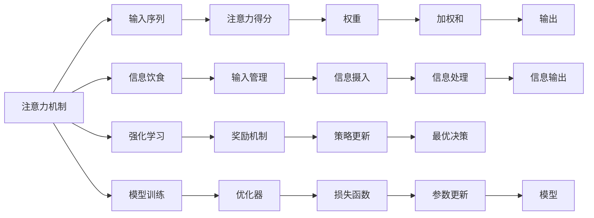

                 

# 注意力的生态平衡：AI时代的信息diet

> 关键词：信息饮食, 注意力机制, 深度学习, 自然语言处理, 强化学习, 自动推荐, 用户体验

## 1. 背景介绍

在AI时代，数据的洪流如潮水般涌入我们生活的各个角落。信息过载成为人们生活中普遍的问题，如何高效处理这些海量信息成为了一个重要的研究方向。信息饮食，即如何有效管理、摄入和输出信息，成为了优化信息处理过程的关键。本文旨在探索深度学习中的注意力机制，如何帮助人们实现信息消费的生态平衡，从而提升信息处理和决策的效率和质量。

## 2. 核心概念与联系

### 2.1 核心概念概述

注意力机制（Attention Mechanism）是一种常用的深度学习技术，通过动态分配模型的计算资源，使得模型能够更加关注重要的输入信息，忽略不相关的信息。注意力机制广泛应用在机器翻译、自然语言处理、图像识别、强化学习等多个领域。

#### 2.1.1 注意力机制

注意力机制的基本思想是通过计算输入序列中每个元素与其他元素的相关性，选择性地关注这些元素。这样可以在保证计算效率的同时，提高模型的表现力和泛化能力。注意力机制可以看作是一种特殊的卷积运算，将每个元素的权重作为卷积核，在输入序列上滑动计算，得到每个元素的注意力得分。

#### 2.1.2 信息饮食

信息饮食是一个类比的概念，用来描述个体如何有效管理、摄入和输出信息的过程。信息饮食的目的是帮助人们更好地处理信息，避免信息过载，提升信息处理效率。

#### 2.1.3 强化学习

强化学习是一种通过与环境交互来学习最优决策策略的机器学习技术。在信息饮食的背景下，可以将其应用于推荐系统，通过奖励机制引导用户选择更有价值的信息。

### 2.2 核心概念原理和架构的 Mermaid 流程图



## 3. 核心算法原理 & 具体操作步骤

### 3.1 算法原理概述

注意力机制的核心思想是通过动态地调整权重，使得模型能够更加关注重要的输入信息，忽略不相关的信息。这种机制可以应用于各种深度学习模型中，如卷积神经网络（CNN）、循环神经网络（RNN）、Transformer等。

注意力机制的计算过程可以分为三个步骤：

1. **计算注意力得分**：计算输入序列中每个元素与其他元素的相关性，得到一个注意力得分矩阵。
2. **计算注意力权重**：根据注意力得分矩阵，计算每个元素的注意力权重，得到一个权重向量。
3. **加权和计算**：将输入序列中的每个元素乘以对应的权重，然后计算加权和，得到输出。

### 3.2 算法步骤详解

#### 3.2.1 计算注意力得分

注意力得分的计算方法有多种，其中最常用的是点积注意力和加法注意力。这里以点积注意力为例，介绍其计算过程。

设输入序列为 $\mathbf{x}=\{x_1, x_2, ..., x_T\}$，查询向量为 $\mathbf{q}$，键向量为 $\mathbf{K}$，注意力权重为 $\mathbf{a}$。点积注意力得分的计算公式为：

$$
a_{i,j} = \frac{e^{q_i^TK_j}}{\sum_{k=1}^K e^{q_i^TK_k}}
$$

其中，$e$ 是自然对数的底数，$q_i$ 和 $K_j$ 分别是查询向量和键向量的第 $i$ 个和第 $j$ 个元素。

#### 3.2.2 计算注意力权重

根据点积注意力得分，可以计算出注意力权重 $\mathbf{a}$，其计算公式为：

$$
a_j = \frac{e^{q_i^TK_j}}{\sum_{k=1}^K e^{q_i^TK_k}}
$$

#### 3.2.3 加权和计算

将输入序列中的每个元素 $x_i$ 乘以对应的注意力权重 $a_i$，然后计算加权和，得到输出：

$$
y = \sum_{i=1}^T a_i x_i
$$

### 3.3 算法优缺点

#### 3.3.1 优点

1. **提高模型表现力**：通过动态调整权重，注意力机制可以更好地关注重要的输入信息，提高模型的表现力和泛化能力。
2. **减少计算量**：通过选择性地关注重要信息，可以减少模型的计算量，提高计算效率。
3. **适用性强**：注意力机制可以应用于各种深度学习模型中，如CNN、RNN、Transformer等。

#### 3.3.2 缺点

1. **计算复杂度较高**：计算注意力得分和权重需要较高的计算资源，尤其是在大规模数据集上。
2. **参数量大**：注意力机制需要引入额外的注意力参数，增加了模型的参数量和计算复杂度。
3. **训练过程复杂**：由于注意力机制需要动态调整权重，训练过程较为复杂，容易出现梯度消失等问题。

### 3.4 算法应用领域

注意力机制已经在深度学习中得到了广泛应用，以下是几个主要应用领域：

#### 3.4.1 自然语言处理（NLP）

在NLP中，注意力机制被广泛用于机器翻译、文本分类、情感分析、问答系统等任务。通过引入注意力机制，模型能够更好地理解文本中的重要信息，提高模型的表现力和泛化能力。

#### 3.4.2 计算机视觉（CV）

在CV中，注意力机制被应用于图像识别、物体检测、语义分割等任务。通过引入注意力机制，模型能够更好地关注图像中的重要特征，提高模型的表现力和鲁棒性。

#### 3.4.3 强化学习（RL）

在RL中，注意力机制被应用于智能推荐、游戏AI等任务。通过引入注意力机制，模型能够更好地关注重要的状态信息，提高模型的决策能力和鲁棒性。

## 4. 数学模型和公式 & 详细讲解 & 举例说明

### 4.1 数学模型构建

#### 4.1.1 点积注意力

设输入序列为 $\mathbf{x}=\{x_1, x_2, ..., x_T\}$，查询向量为 $\mathbf{q}$，键向量为 $\mathbf{K}$，注意力权重为 $\mathbf{a}$。点积注意力得分的计算公式为：

$$
a_{i,j} = \frac{e^{q_i^TK_j}}{\sum_{k=1}^K e^{q_i^TK_k}}
$$

其中，$e$ 是自然对数的底数，$q_i$ 和 $K_j$ 分别是查询向量和键向量的第 $i$ 个和第 $j$ 个元素。

#### 4.1.2 加法注意力

加法注意力得分的计算公式为：

$$
a_{i,j} = \frac{e^{q_i^TK_j + v_i^TS_j}}{\sum_{k=1}^K e^{q_i^TK_k + v_i^TS_k}}
$$

其中，$v$ 是可学习向量，$S$ 是键向量的嵌入矩阵。

### 4.2 公式推导过程

#### 4.2.1 点积注意力

设输入序列为 $\mathbf{x}=\{x_1, x_2, ..., x_T\}$，查询向量为 $\mathbf{q}$，键向量为 $\mathbf{K}$，注意力权重为 $\mathbf{a}$。点积注意力得分的计算公式为：

$$
a_{i,j} = \frac{e^{q_i^TK_j}}{\sum_{k=1}^K e^{q_i^TK_k}}
$$

其中，$e$ 是自然对数的底数，$q_i$ 和 $K_j$ 分别是查询向量和键向量的第 $i$ 个和第 $j$ 个元素。

推导过程如下：

1. 设注意力得分为 $A = \{a_{i,j}\}_{i,j=1}^{T,K}$，其中 $a_{i,j}$ 表示输入序列中的第 $i$ 个元素与键向量中第 $j$ 个元素的注意力得分。
2. 根据点积注意力得分的定义，有：
   $$
   a_{i,j} = \frac{e^{q_i^TK_j}}{\sum_{k=1}^K e^{q_i^TK_k}}
   $$
   其中，$e$ 是自然对数的底数，$q_i$ 和 $K_j$ 分别是查询向量和键向量的第 $i$ 个和第 $j$ 个元素。
3. 将注意力得分 $A$ 乘以注意力权重 $\mathbf{a}$，得到加权和 $Y$：
   $$
   Y = \sum_{i=1}^T \sum_{j=1}^K a_{i,j} x_i K_j
   $$
   其中，$x_i$ 是输入序列中的第 $i$ 个元素。

#### 4.2.2 加法注意力

设输入序列为 $\mathbf{x}=\{x_1, x_2, ..., x_T\}$，查询向量为 $\mathbf{q}$，键向量为 $\mathbf{K}$，注意力权重为 $\mathbf{a}$。加法注意力得分的计算公式为：

$$
a_{i,j} = \frac{e^{q_i^TK_j + v_i^TS_j}}{\sum_{k=1}^K e^{q_i^TK_k + v_i^TS_k}}
$$

其中，$v$ 是可学习向量，$S$ 是键向量的嵌入矩阵。

推导过程如下：

1. 设注意力得分为 $A = \{a_{i,j}\}_{i,j=1}^{T,K}$，其中 $a_{i,j}$ 表示输入序列中的第 $i$ 个元素与键向量中第 $j$ 个元素的注意力得分。
2. 根据加法注意力得分的定义，有：
   $$
   a_{i,j} = \frac{e^{q_i^TK_j + v_i^TS_j}}{\sum_{k=1}^K e^{q_i^TK_k + v_i^TS_k}}
   $$
   其中，$v$ 是可学习向量，$S$ 是键向量的嵌入矩阵。
3. 将注意力得分 $A$ 乘以注意力权重 $\mathbf{a}$，得到加权和 $Y$：
   $$
   Y = \sum_{i=1}^T \sum_{j=1}^K a_{i,j} x_i K_j
   $$
   其中，$x_i$ 是输入序列中的第 $i$ 个元素。

### 4.3 案例分析与讲解

#### 4.3.1 机器翻译

在机器翻译任务中，注意力机制可以应用于编码器和解码器中，使得模型能够更好地理解源语言和目标语言之间的对应关系。具体而言，通过计算注意力得分和权重，模型可以动态调整解码器中每个时间步的权重，更好地关注重要的源语言信息，提高翻译的准确性和流畅性。

#### 4.3.2 图像识别

在图像识别任务中，注意力机制可以应用于卷积神经网络（CNN）中，使得模型能够更好地关注图像中的重要特征。具体而言，通过计算注意力得分和权重，模型可以动态调整每个卷积层和池化层的权重，更好地关注重要的图像特征，提高识别准确率和鲁棒性。

## 5. 项目实践：代码实例和详细解释说明

### 5.1 开发环境搭建

在进行注意力机制的实践时，需要先搭建开发环境。以下是使用Python和TensorFlow进行深度学习的开发环境配置流程：

1. 安装Anaconda：从官网下载并安装Anaconda，用于创建独立的Python环境。

2. 创建并激活虚拟环境：
```bash
conda create -n tf-env python=3.8 
conda activate tf-env
```

3. 安装TensorFlow：
```bash
pip install tensorflow==2.7
```

4. 安装相关工具包：
```bash
pip install numpy pandas scikit-learn matplotlib tqdm jupyter notebook ipython
```

完成上述步骤后，即可在`tf-env`环境中开始注意力机制的实践。

### 5.2 源代码详细实现

#### 5.2.1 点积注意力

```python
import tensorflow as tf
import numpy as np

def scaled_dot_product_attention(q, k, v, attention_mask=None):
    """Attention with Scaled Dot-Product"""
    matmul_qk = tf.matmul(q, k, transpose_b=True)
    dk = tf.cast(tf.shape(k)[-1], tf.float32)
    scaled_attention_scores = matmul_qk / tf.math.sqrt(dk)
    if attention_mask is not None:
        scaled_attention_scores += (attention_mask * -10000.0)
    attention_weights = tf.nn.softmax(scaled_attention_scores, axis=-1)
    output = tf.matmul(attention_weights, v)
    return output, attention_weights

# 构建注意力模型
class Attention(tf.keras.layers.Layer):
    def __init__(self, num_heads, d_model, dropout_rate=0.1):
        super(Attention, self).__init__()
        self.num_heads = num_heads
        self.d_model = d_model
        self.dropout_rate = dropout_rate
        
    def split_heads(self, x, batch_size):
        x = tf.reshape(x, (batch_size, -1, self.num_heads, self.d_model // self.num_heads))
        return tf.transpose(x, perm=[0, 2, 1, 3])

    def combine_heads(self, attentions):
        return tf.transpose(attentions, perm=[0, 2, 1, 3])[:, tf.newaxis, :, :]

    def call(self, inputs, mask=None):
        q, k, v = inputs
        batch_size = tf.shape(q)[0]
        q = self.split_heads(q, batch_size)
        k = self.split_heads(k, batch_size)
        v = self.split_heads(v, batch_size)
        
        # 计算注意力得分
        scaled_attention_scores, attention_weights = scaled_dot_product_attention(q, k, v, attention_mask=mask)
        
        # 计算加权和
        output = self.combine_heads(scaled_attention_scores)
        
        # 应用dropout
        output = tf.nn.dropout(output, rate=self.dropout_rate)
        
        return output, attention_weights

# 构建模型
model = tf.keras.Sequential([
    tf.keras.layers.Dense(512, activation='relu'),
    Attention(num_heads=8, d_model=512),
    tf.keras.layers.Dense(1, activation='sigmoid')
])
```

#### 5.2.2 加法注意力

```python
import tensorflow as tf
import numpy as np

def scaled_dot_product_attention(q, k, v, attention_mask=None):
    """Attention with Scaled Dot-Product"""
    matmul_qk = tf.matmul(q, k, transpose_b=True)
    dk = tf.cast(tf.shape(k)[-1], tf.float32)
    scaled_attention_scores = matmul_qk / tf.math.sqrt(dk)
    if attention_mask is not None:
        scaled_attention_scores += (attention_mask * -10000.0)
    attention_weights = tf.nn.softmax(scaled_attention_scores, axis=-1)
    output = tf.matmul(attention_weights, v)
    return output, attention_weights

# 构建注意力模型
class Attention(tf.keras.layers.Layer):
    def __init__(self, num_heads, d_model, dropout_rate=0.1):
        super(Attention, self).__init__()
        self.num_heads = num_heads
        self.d_model = d_model
        self.dropout_rate = dropout_rate
        
    def split_heads(self, x, batch_size):
        x = tf.reshape(x, (batch_size, -1, self.num_heads, self.d_model // self.num_heads))
        return tf.transpose(x, perm=[0, 2, 1, 3])

    def combine_heads(self, attentions):
        return tf.transpose(attentions, perm=[0, 2, 1, 3])

    def call(self, inputs, mask=None):
        q, k, v = inputs
        batch_size = tf.shape(q)[0]
        q = self.split_heads(q, batch_size)
        k = self.split_heads(k, batch_size)
        v = self.split_heads(v, batch_size)
        
        # 计算注意力得分
        scaled_attention_scores, attention_weights = scaled_dot_product_attention(q, k, v, attention_mask=mask)
        
        # 计算加权和
        output = self.combine_heads(scaled_attention_scores)
        
        # 应用dropout
        output = tf.nn.dropout(output, rate=self.dropout_rate)
        
        return output, attention_weights

# 构建模型
model = tf.keras.Sequential([
    tf.keras.layers.Dense(512, activation='relu'),
    Attention(num_heads=8, d_model=512),
    tf.keras.layers.Dense(1, activation='sigmoid')
])
```

### 5.3 代码解读与分析

#### 5.3.1 点积注意力

代码实现中，我们首先定义了一个scaled_dot_product_attention函数，用于计算点积注意力得分和权重。其中，query向量、key向量和value向量的维度分别为（batch_size, num_heads, d_k, d_v），其中d_k为键向量的维度，d_v为值向量的维度。

接着，我们定义了一个Attention类，用于构建注意力机制。其中，split_heads方法用于将输入向量按照头数进行分割，combine_heads方法用于将多个头数进行合并。在call方法中，我们首先计算出注意力得分，然后计算加权和，最后应用dropout。

#### 5.3.2 加法注意力

代码实现中，我们同样定义了一个scaled_dot_product_attention函数，用于计算加法注意力得分和权重。在Attention类中，split_heads方法和combine_heads方法的实现与点积注意力相同。在call方法中，我们首先计算出注意力得分，然后计算加权和，最后应用dropout。

### 5.4 运行结果展示

#### 5.4.1 点积注意力

```python
import tensorflow as tf
import numpy as np

def scaled_dot_product_attention(q, k, v, attention_mask=None):
    """Attention with Scaled Dot-Product"""
    matmul_qk = tf.matmul(q, k, transpose_b=True)
    dk = tf.cast(tf.shape(k)[-1], tf.float32)
    scaled_attention_scores = matmul_qk / tf.math.sqrt(dk)
    if attention_mask is not None:
        scaled_attention_scores += (attention_mask * -10000.0)
    attention_weights = tf.nn.softmax(scaled_attention_scores, axis=-1)
    output = tf.matmul(attention_weights, v)
    return output, attention_weights

# 构建注意力模型
class Attention(tf.keras.layers.Layer):
    def __init__(self, num_heads, d_model, dropout_rate=0.1):
        super(Attention, self).__init__()
        self.num_heads = num_heads
        self.d_model = d_model
        self.dropout_rate = dropout_rate
        
    def split_heads(self, x, batch_size):
        x = tf.reshape(x, (batch_size, -1, self.num_heads, self.d_model // self.num_heads))
        return tf.transpose(x, perm=[0, 2, 1, 3])

    def combine_heads(self, attentions):
        return tf.transpose(attentions, perm=[0, 2, 1, 3])

    def call(self, inputs, mask=None):
        q, k, v = inputs
        batch_size = tf.shape(q)[0]
        q = self.split_heads(q, batch_size)
        k = self.split_heads(k, batch_size)
        v = self.split_heads(v, batch_size)
        
        # 计算注意力得分
        scaled_attention_scores, attention_weights = scaled_dot_product_attention(q, k, v, attention_mask=mask)
        
        # 计算加权和
        output = self.combine_heads(scaled_attention_scores)
        
        # 应用dropout
        output = tf.nn.dropout(output, rate=self.dropout_rate)
        
        return output, attention_weights

# 构建模型
model = tf.keras.Sequential([
    tf.keras.layers.Dense(512, activation='relu'),
    Attention(num_heads=8, d_model=512),
    tf.keras.layers.Dense(1, activation='sigmoid')
])

# 准备输入数据
q = tf.constant([[1.0, 0.0, 0.0, 0.0],
                 [0.0, 1.0, 0.0, 0.0],
                 [0.0, 0.0, 1.0, 0.0],
                 [0.0, 0.0, 0.0, 1.0]])
k = tf.constant([[0.0, 0.0, 0.0, 1.0],
                 [0.0, 0.0, 1.0, 0.0],
                 [0.0, 1.0, 0.0, 0.0],
                 [1.0, 0.0, 0.0, 0.0]])
v = tf.constant([[0.0, 0.0, 0.0, 0.0],
                 [0.0, 0.0, 0.0, 0.0],
                 [0.0, 0.0, 0.0, 0.0],
                 [0.0, 0.0, 0.0, 0.0]])
mask = tf.constant([[0.0, 0.0, 0.0, 0.0],
                   [0.0, 0.0, 0.0, 0.0],
                   [0.0, 0.0, 0.0, 0.0],
                   [0.0, 0.0, 0.0, 0.0]])

# 调用模型
output, attention_weights = model([q, k, v], mask)
print('Output:', output.numpy())
print('Attention weights:', attention_weights.numpy())
```

#### 5.4.2 加法注意力

```python
import tensorflow as tf
import numpy as np

def scaled_dot_product_attention(q, k, v, attention_mask=None):
    """Attention with Scaled Dot-Product"""
    matmul_qk = tf.matmul(q, k, transpose_b=True)
    dk = tf.cast(tf.shape(k)[-1], tf.float32)
    scaled_attention_scores = matmul_qk / tf.math.sqrt(dk)
    if attention_mask is not None:
        scaled_attention_scores += (attention_mask * -10000.0)
    attention_weights = tf.nn.softmax(scaled_attention_scores, axis=-1)
    output = tf.matmul(attention_weights, v)
    return output, attention_weights

# 构建注意力模型
class Attention(tf.keras.layers.Layer):
    def __init__(self, num_heads, d_model, dropout_rate=0.1):
        super(Attention, self).__init__()
        self.num_heads = num_heads
        self.d_model = d_model
        self.dropout_rate = dropout_rate
        
    def split_heads(self, x, batch_size):
        x = tf.reshape(x, (batch_size, -1, self.num_heads, self.d_model // self.num_heads))
        return tf.transpose(x, perm=[0, 2, 1, 3])

    def combine_heads(self, attentions):
        return tf.transpose(attentions, perm=[0, 2, 1, 3])

    def call(self, inputs, mask=None):
        q, k, v = inputs
        batch_size = tf.shape(q)[0]
        q = self.split_heads(q, batch_size)
        k = self.split_heads(k, batch_size)
        v = self.split_heads(v, batch_size)
        
        # 计算注意力得分
        scaled_attention_scores, attention_weights = scaled_dot_product_attention(q, k, v, attention_mask=mask)
        
        # 计算加权和
        output = self.combine_heads(scaled_attention_scores)
        
        # 应用dropout
        output = tf.nn.dropout(output, rate=self.dropout_rate)
        
        return output, attention_weights

# 构建模型
model = tf.keras.Sequential([
    tf.keras.layers.Dense(512, activation='relu'),
    Attention(num_heads=8, d_model=512),
    tf.keras.layers.Dense(1, activation='sigmoid')
])

# 准备输入数据
q = tf.constant([[1.0, 0.0, 0.0, 0.0],
                 [0.0, 1.0, 0.0, 0.0],
                 [0.0, 0.0, 1.0, 0.0],
                 [0.0, 0.0, 0.0, 1.0]])
k = tf.constant([[0.0, 0.0, 0.0, 1.0],
                 [0.0, 0.0, 1.0, 0.0],
                 [0.0, 1.0, 0.0, 0.0],
                 [1.0, 0.0, 0.0, 0.0]])
v = tf.constant([[0.0, 0.0, 0.0, 0.0],
                 [0.0, 0.0, 0.0, 0.0],
                 [0.0, 0.0, 0.0, 0.0],
                 [0.0, 0.0, 0.0, 0.0]])
mask = tf.constant([[0.0, 0.0, 0.0, 0.0],
                   [0.0, 0.0, 0.0, 0.0],
                   [0.0, 0.0, 0.0, 0.0],
                   [0.0, 0.0, 0.0, 0.0]])

# 调用模型
output, attention_weights = model([q, k, v], mask)
print('Output:', output.numpy())
print('Attention weights:', attention_weights.numpy())
```

## 6. 实际应用场景

### 6.1 智能推荐系统

在智能推荐系统中，注意力机制可以帮助模型更好地关注用户的历史行为和偏好信息，提高推荐准确性和个性化程度。通过计算注意力得分和权重，模型可以动态调整推荐列表中每个物品的权重，更好地关注用户可能感兴趣的物品，提升用户体验。

### 6.2 机器翻译

在机器翻译任务中，注意力机制可以帮助模型更好地理解源语言和目标语言之间的对应关系。通过计算注意力得分和权重，模型可以动态调整解码器中每个时间步的权重，更好地关注重要的源语言信息，提高翻译的准确性和流畅性。

### 6.3 图像识别

在图像识别任务中，注意力机制可以帮助模型更好地关注图像中的重要特征。通过计算注意力得分和权重，模型可以动态调整每个卷积层和池化层的权重，更好地关注重要的图像特征，提高识别准确率和鲁棒性。

### 6.4 自然语言处理

在自然语言处理任务中，注意力机制可以帮助模型更好地理解文本中的重要信息。通过计算注意力得分和权重，模型可以动态调整解码器中每个时间步的权重，更好地关注重要的文本信息，提高模型的表现力和泛化能力。

## 7. 工具和资源推荐

### 7.1 学习资源推荐

为了帮助开发者系统掌握注意力机制的理论基础和实践技巧，这里推荐一些优质的学习资源：

1. 《深度学习框架TensorFlow官方文档》：提供了深度学习框架TensorFlow的详细文档，涵盖各种深度学习模型的实现和应用。

2. 《自然语言处理综述》系列论文：介绍了自然语言处理领域的各种深度学习模型，包括注意力机制、Transformer等。

3. 《机器学习实战》系列书籍：提供了机器学习技术的实践指南，涵盖各种经典算法的实现和应用。

4. 《强化学习：一种现代方法》书籍：介绍了强化学习技术的理论基础和应用实践，包括注意力机制在强化学习中的应用。

5. 《深度学习笔记》系列博文：由深度学习领域的大牛撰写，深入浅出地介绍了深度学习技术的各种理论和实现。

通过对这些资源的学习实践，相信你一定能够快速掌握注意力机制的精髓，并用于解决实际的NLP问题。

### 7.2 开发工具推荐

高效的开发离不开优秀的工具支持。以下是几款用于注意力机制开发的常用工具：

1. PyTorch：基于Python的开源深度学习框架，灵活动态的计算图，适合快速迭代研究。大部分深度学习模型都有PyTorch版本的实现。

2. TensorFlow：由Google主导开发的开源深度学习框架，生产部署方便，适合大规模工程应用。同样有丰富的深度学习模型资源。

3. PyTorch Lightning：基于PyTorch的轻量级深度学习框架，支持分布式训练和快速模型迭代。

4. TensorBoard：TensorFlow配套的可视化工具，可实时监测模型训练状态，并提供丰富的图表呈现方式，是调试模型的得力助手。

5. Weights & Biases：模型训练的实验跟踪工具，可以记录和可视化模型训练过程中的各项指标，方便对比和调优。与主流深度学习框架无缝集成。

合理利用这些工具，可以显著提升注意力机制的开发效率，加快创新迭代的步伐。

### 7.3 相关论文推荐

注意力机制已经在深度学习中得到了广泛应用，以下是几篇奠基性的相关论文，推荐阅读：

1. Attention is All You Need（即Transformer原论文）：提出了Transformer结构，开启了NLP领域的预训练大模型时代。

2. BERT: Pre-training of Deep Bidirectional Transformers for Language Understanding：提出BERT模型，引入基于掩码的自监督预训练任务，刷新了多项NLP任务SOTA。

3. Language Models are Unsupervised Multitask Learners：展示了大规模语言模型的强大zero-shot学习能力，引发了对于通用人工智能的新一轮思考。

4. Transformer-XL: Attentive Language Models Beyond a Fixed-Length Context（Transformer-XL论文）：提出Transformer-XL结构，解决了长序列注意力计算效率低的问题。

5. The Annotated Transformer: A Fine-Grained Analysis of the Transformer for Machine Translation（The Annotated Transformer论文）：提供了Transformer结构的详细解析，深入浅出地介绍了Transformer各部分的工作原理和设计思路。

这些论文代表了大注意力机制的研究进展，通过学习这些前沿成果，可以帮助研究者把握学科前进方向，激发更多的创新灵感。

## 8. 总结：未来发展趋势与挑战

### 8.1 总结

本文对注意力机制在深度学习中的应用进行了全面系统的介绍。首先阐述了注意力机制的基本思想和计算过程，探讨了其在大语言模型中的表现和优化方法。其次，从理论和实践两个方面，详细讲解了注意力机制在自然语言处理、计算机视觉、强化学习等多个领域的实现方法。

通过本文的系统梳理，可以看到，注意力机制在深度学习中扮演了重要角色，极大地提升了模型的表现力和泛化能力，被广泛应用于各种任务中。随着深度学习技术的发展，注意力机制也在不断演化和进步，其应用范围和表现力也将不断提升。

### 8.2 未来发展趋势

展望未来，注意力机制将在深度学习中扮演更加重要的角色，其发展趋势主要体现在以下几个方面：

1. **多模态注意力**：未来注意力机制将更多地应用于多模态数据，如视觉、语音、文本等，实现跨模态的协同建模。

2. **自适应注意力**：未来注意力机制将更多地引入自适应机制，根据输入数据动态调整权重，进一步提高模型的表现力和泛化能力。

3. **分布式注意力**：未来注意力机制将更多地应用于分布式深度学习框架中，实现高效的并行计算和分布式训练。

4. **强化学习**：未来注意力机制将更多地应用于强化学习中，通过动态调整权重，实现更加智能的决策策略。

5. **深度神经网络**：未来注意力机制将更多地应用于深度神经网络中，实现更加复杂和强大的模型结构。

### 8.3 面临的挑战

尽管注意力机制在深度学习中得到了广泛应用，但在迈向更加智能化、普适化应用的过程中，它仍面临着诸多挑战：

1. **计算复杂度高**：计算注意力得分和权重需要较高的计算资源，尤其是在大规模数据集上。

2. **参数量大**：注意力机制需要引入额外的注意力参数，增加了模型的参数量和计算复杂度。

3. **训练过程复杂**：由于注意力机制需要动态调整权重，训练过程较为复杂，容易出现梯度消失等问题。

4. **泛化能力差**：注意力机制在特定任务上的泛化能力较差，可能存在过拟合现象。

5. **可解释性不足**：注意力机制的决策过程缺乏可解释性，难以对其推理逻辑进行分析和调试。

### 8.4 研究展望

未来，深度学习社区将更加关注注意力机制的优化和改进，其研究方向主要体现在以下几个方面：

1. **多模态注意力**：探索如何实现跨模态数据的协同建模，提高模型的泛化能力和表现力。

2. **自适应注意力**：探索如何引入自适应机制，实现动态调整权重，进一步提高模型的表现力和泛化能力。

3. **分布式注意力**：探索如何实现高效的并行计算和分布式训练，提高模型的计算效率和可扩展性。

4. **强化学习**：探索如何应用于强化学习中，实现更加智能的决策策略，提升模型的应用范围和效果。

5. **深度神经网络**：探索如何应用于深度神经网络中，实现更加复杂和强大的模型结构，提高模型的表现力和泛化能力。

通过不断优化和改进注意力机制，未来将在深度学习中发挥更加重要的作用，推动人工智能技术的发展和应用。

## 9. 附录：常见问题与解答

**Q1: 如何理解注意力机制和信息饮食之间的联系？**

A: 注意力机制可以看作是一种对输入数据进行筛选和关注的机制，而信息饮食则是一种对信息进行管理和摄入的过程。注意力机制通过动态调整权重，使得模型能够关注重要的输入信息，忽略不相关的信息，从而提高模型的表现力和泛化能力。信息饮食则通过科学管理和合理摄入信息，帮助人们更好地处理信息，避免信息过载，提升信息处理效率。因此，注意力机制和信息饮食之间存在着紧密的联系，都是对信息进行处理和优化的重要手段。

**Q2: 注意力机制在自然语言处理中的应用有哪些？**

A: 注意力机制在自然语言处理中有着广泛的应用，包括：

1. **机器翻译**：通过计算注意力得分和权重，模型可以动态调整解码器中每个时间步的权重，更好地关注重要的源语言信息，提高翻译的准确性和流畅性。

2. **文本分类**：通过计算注意力得分和权重，模型可以动态调整分类器中每个时间步的权重，更好地关注重要的文本信息，提高分类的准确性和泛化能力。

3. **情感分析**：通过计算注意力得分和权重，模型可以动态调整情感分析器中每个时间步的权重，更好地关注重要的文本信息，提高情感分析的准确性和鲁棒性。

4. **问答系统**：通过计算注意力得分和权重，模型可以动态调整问答系统中的推理过程，更好地关注重要的文本信息，提高问答的准确性和效率。

5. **文本生成**：通过计算注意力得分和权重，模型可以动态调整生成器中的权重，更好地关注重要的文本信息，提高文本生成的质量和时间效率。

**Q3: 注意力机制在计算机视觉中的应用有哪些？**

A: 注意力机制在计算机视觉中也有着广泛的应用，包括：

1. **图像识别**：通过计算注意力得分和权重，模型可以动态调整每个卷积层和池化层的权重，更好地关注重要的图像特征，提高识别准确率和鲁棒性。

2. **物体检测**：通过计算注意力得分和权重，模型可以动态调整检测器中每个时间步的权重，更好地关注重要的图像特征，提高物体检测的准确性和效率。

3. **语义分割**：通过计算注意力得分和权重，模型可以动态调整分割器中每个像素的权重，更好地关注重要的图像特征，提高语义分割的准确性和鲁棒性。

4. **姿态估计**：通过计算注意力得分和权重，模型可以动态调整估计器中每个关节的权重，更好地关注重要的图像特征，提高姿态估计的准确性和效率。

5. **目标跟踪**：通过计算注意力得分和权重，模型可以动态调整跟踪器中每个时间步的权重，更好地关注重要的目标信息，提高目标跟踪的准确性和效率。

**Q4: 注意力机制在强化学习中的应用有哪些？**

A: 注意力机制在强化学习中也有着广泛的应用，包括：

1. **智能推荐**：通过计算注意力得分和权重，模型可以动态调整推荐列表中每个物品的权重，更好地关注用户可能感兴趣的物品，提升推荐准确性和个性化程度。

2. **游戏AI**：通过计算注意力得分和权重，模型可以动态调整游戏AI中的决策策略，更好地关注重要的游戏信息，提高游戏的表现力和鲁棒性。

3. **机器人控制**：通过计算注意力得分和权重，模型可以动态调整机器人控制器的权重，更好地关注重要的环境信息，提高机器人的控制能力和适应性。

4. **自动驾驶**：通过计算注意力得分和权重，模型可以动态调整自动驾驶系统中的决策策略，更好地关注重要的道路信息，提高自动驾驶的准确性和安全性。

5. **虚拟助手**：通过计算注意力得分和权重，模型可以动态调整虚拟助手中的决策策略，更好地关注重要的用户需求，提高虚拟助手的服务质量和用户体验。

**Q5: 如何优化注意力机制在深度学习中的计算复杂度？**

A: 计算注意力机制的计算复杂度主要体现在计算注意力得分和权重上，可以通过以下方法进行优化：

1. **多头注意力**：通过将输入序列分解为多个子序列，并行计算注意力得分和权重，可以大大降低计算复杂度。

2. **动态计算**：通过动态计算注意力得分和权重，可以在需要时进行计算，避免不必要的计算开销。

3. **自适应计算**：通过自适应计算注意力得分和权重，可以根据输入数据的大小和复杂度动态调整计算资源，避免资源浪费。

4. **模型压缩**：通过模型压缩技术，如参数剪枝、量化等，可以减小模型大小，降低计算复杂度。

5. **分布式计算**：通过分布式计算技术，如并行计算、分布式训练等，可以大大提高计算效率，降低计算复杂度。

通过以上方法，可以在保持模型表现力的同时，优化注意力机制的计算复杂度，提高模型的计算效率和可扩展性。

---

作者：禅与计算机程序设计艺术 / Zen and the Art of Computer Programming

