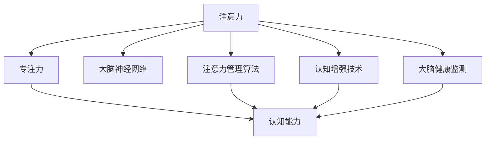

                 

# 注意力管理与大脑健康：如何通过专注力增强认知能力

> 关键词：注意力,专注力,认知能力,大脑健康,大脑神经网络,注意力管理算法,认知增强技术

## 1. 背景介绍

### 1.1 问题由来
在现代社会中，人们面临着巨大的信息压力和心理负担。随着互联网的普及和智能设备的普及，信息泛滥、注意力分散、认知疲劳等问题日益突出。这些问题不仅影响着个人的工作效率和学习效果，还可能对大脑健康产生潜在的负面影响。

神经科学研究表明，大脑在处理信息时依赖于一套复杂的注意力系统，包括但不限于顶下小叶、额叶、颞叶等区域。这些区域通过复杂的神经网络相互协作，实现信息的筛选、整合和存储。如何有效管理注意力，提高专注力，已成为现代认知科学研究的热点问题。

针对这一需求，近年来人工智能技术取得了一些重要突破，特别是注意力管理算法和认知增强技术的发展，为大脑健康的提升提供了新的途径。

### 1.2 问题核心关键点
注意力管理与大脑健康的问题核心在于如何通过有效的算法和策略，提升个体的专注力，优化注意力系统，进而增强认知能力，促进大脑健康。这一问题涉及多个层面的技术实现和应用落地，包括但不限于以下几个关键点：

1. **注意力管理算法**：通过模拟人类注意力的工作原理，设计算法对信息进行筛选、优先级排序和分配，帮助大脑更好地处理信息。
2. **认知增强技术**：利用神经科学和心理学的研究成果，开发提升认知功能的技术，如工作记忆、问题解决、创造性思维等。
3. **大脑健康监测**：通过脑电波、眼球追踪、生理指标等手段，监测大脑活动状态，及时发现并干预注意力分散等问题。
4. **个性化定制**：根据个体差异，定制个性化的注意力管理方案，以实现最佳效果。

## 2. 核心概念与联系

### 2.1 核心概念概述

为更好地理解注意力管理与大脑健康的概念和其相互联系，本节将介绍几个关键概念：

- **注意力**：即注意力的分配，指个体在特定时间内对信息的集中程度和处理效率。
- **专注力**：即注意力的稳定性，指个体长时间保持对信息的专注和持续关注。
- **认知能力**：包括记忆力、问题解决、创造性思维等，是大脑处理信息的主要表现形式。
- **大脑神经网络**：由神经元及其连接构成，是信息处理和注意力管理的基础。
- **注意力管理算法**：通过模拟人类注意力系统，实现信息的筛选和优先级排序。
- **认知增强技术**：利用人工智能技术提升个体认知功能，改善大脑活动状态。
- **大脑健康监测**：通过各种手段监测大脑活动状态，及时干预注意力分散等问题。

这些概念之间的逻辑关系可以通过以下Mermaid流程图来展示：



这个流程图展示了注意力管理与大脑健康之间的核心概念及其联系：

1. 注意力通过大脑神经网络实现信息的筛选和处理。
2. 专注力依赖于注意力的稳定性，影响认知能力的发挥。
3. 注意力管理算法通过优化信息处理，提升专注力。
4. 认知增强技术通过提升认知功能，增强大脑活力。
5. 大脑健康监测通过实时反馈，及时干预注意力分散等问题。

## 3. 核心算法原理 & 具体操作步骤
### 3.1 算法原理概述

注意力管理与大脑健康的问题解决主要依赖于注意力管理算法和认知增强技术。这些技术通过模拟人类注意力系统，优化信息处理过程，提升专注力，从而增强认知能力，促进大脑健康。

### 3.2 算法步骤详解

以注意力管理算法为例，其基本步骤包括：

1. **数据收集**：通过脑电波、眼球追踪、生理指标等手段，收集用户在不同任务中的注意力数据。
2. **特征提取**：对收集到的数据进行预处理和特征提取，获得反映注意力状态的关键特征。
3. **模型训练**：使用机器学习或深度学习模型对特征进行训练，构建注意力管理模型。
4. **实时监测**：在用户执行任务时，实时监测其注意力状态，及时调整注意力分配。
5. **反馈优化**：根据用户反馈和行为数据，优化注意力管理模型，提升注意力分配的准确性和效果。

以认知增强技术为例，其基本步骤包括：

1. **任务设计**：设计针对特定认知能力的训练任务，如工作记忆、问题解决等。
2. **模型训练**：使用机器学习或深度学习模型对用户进行训练，提升其认知能力。
3. **实时评估**：在用户执行任务时，实时评估其认知状态，及时调整训练难度和内容。
4. **反馈优化**：根据用户反馈和认知评估结果，优化训练策略，提升认知能力的效果。

### 3.3 算法优缺点

注意力管理算法和认知增强技术各有优缺点，具体如下：

**注意力管理算法的优点**：

- **实时反馈**：能够实时监测注意力状态，及时调整注意力分配。
- **个性化定制**：可以根据用户的具体需求和行为数据，定制个性化的注意力管理方案。
- **应用广泛**：适用于多种信息处理任务，如阅读、写作、学习等。

**注意力管理算法的缺点**：

- **数据依赖**：需要大量高质量的注意力数据进行训练和优化。
- **算法复杂**：算法设计复杂，需要多学科知识的融合。
- **用户接受度**：用户对实时监测和干预可能有抵触情绪。

**认知增强技术的优点**：

- **效果显著**：能够在较短时间内显著提升认知能力，改善大脑活力。
- **应用广泛**：适用于多种认知能力的提升，如工作记忆、问题解决、创造性思维等。
- **用户体验**：训练过程有趣、易用，用户容易接受。

**认知增强技术的缺点**：

- **效果短期**：训练效果主要体现在短期内，长期效果需要持续训练。
- **用户依赖**：需要用户积极参与训练，才能获得理想效果。
- **算法复杂**：训练算法复杂，需要大量计算资源。

### 3.4 算法应用领域

注意力管理与大脑健康的技术在多个领域都有广泛应用，具体包括：

- **教育领域**：通过优化学生的注意力管理，提升学习效果，促进教育公平。
- **工作领域**：通过优化职员的注意力分配，提高工作效率，缓解职业疲劳。
- **医疗领域**：通过监测患者的注意力状态，及时干预注意力分散等问题，改善心理健康。
- **娱乐领域**：通过优化用户体验的注意力管理，提升娱乐内容的吸引力和用户体验。
- **军事领域**：通过优化战士的注意力分配，提高任务执行效率，增强战斗能力。

这些应用场景展示了注意力管理与大脑健康技术的广泛适用性，为各行业带来了新的创新机会。

## 4. 数学模型和公式 & 详细讲解 & 举例说明

### 4.1 数学模型构建

为了更好地理解注意力管理算法的数学模型，本节将详细介绍其核心数学模型。

**注意力管理算法的核心数学模型**：

设注意力管理算法的输入为信息集 $\mathcal{I}$，注意力集 $\mathcal{A}$，注意力分配矩阵 $W$。其中 $W_{ij}$ 表示信息 $i$ 在注意力集 $\mathcal{A}$ 上的分配权重。

注意力管理算法的目标是最小化信息处理误差 $E$，即：

$$
\min_{W} E(W) = \sum_{i \in \mathcal{I}} \sum_{j \in \mathcal{A}} W_{ij} \cdot \text{Error}(i, j)
$$

其中 $\text{Error}(i, j)$ 为信息 $i$ 在注意力集 $\mathcal{A}$ 上的处理误差。

### 4.2 公式推导过程

以自适应注意力管理算法为例，推导其关键公式。

**自适应注意力管理算法**：

自适应注意力管理算法通过实时调整注意力分配，优化信息处理过程。其关键公式如下：

1. **注意力分配矩阵**：

   $$
   W = \alpha \cdot H \cdot Q + \beta \cdot R \cdot K
   $$

   其中 $\alpha, \beta$ 为注意力分配的权重系数，$H, K, R$ 分别为信息集 $\mathcal{I}$ 的特征向量、注意力集 $\mathcal{A}$ 的特征向量、注意力集 $\mathcal{A}$ 的注意力权重矩阵。

2. **注意力权重矩阵**：

   $$
   R = \text{Softmax}(Q^T \cdot K / \sqrt{d})
   $$

   其中 $\text{Softmax}$ 函数将矩阵元素转化为概率分布，$d$ 为信息集 $\mathcal{I}$ 的维度。

3. **信息处理误差**：

   $$
   \text{Error}(i, j) = \sum_{k=1}^{d} (y_i^{(k)} - \sum_{l=1}^{|\mathcal{A}|} W_{il} \cdot K_{lj})
   $$

   其中 $y_i^{(k)}$ 为信息 $i$ 的输出特征，$K_{lj}$ 为注意力集 $\mathcal{A}$ 中元素 $j$ 的特征向量。

### 4.3 案例分析与讲解

以阅读理解为例，分析注意力管理算法的应用。

在阅读理解任务中，用户需要从长文本中提取关键信息，并生成摘要。注意力管理算法可以通过优化注意力分配，帮助用户聚焦于关键段落，减少噪音信息的干扰，提高理解效果。

具体实现步骤如下：

1. **数据收集**：通过眼球追踪设备，收集用户阅读时的视线轨迹，分析其注意力集中点。
2. **特征提取**：将视线轨迹转化为信息集 $\mathcal{I}$ 的特征向量，提取关键段落的特征向量，生成注意力集 $\mathcal{A}$。
3. **模型训练**：使用自适应注意力管理算法，训练注意力分配矩阵 $W$。
4. **实时监测**：在用户阅读时，实时监测注意力分配，调整阅读路径。
5. **反馈优化**：根据用户反馈和理解效果，优化注意力管理算法，提升阅读理解能力。

## 5. 项目实践：代码实例和详细解释说明
### 5.1 开发环境搭建

在进行注意力管理与大脑健康的项目实践前，我们需要准备好开发环境。以下是使用Python进行TensorFlow开发的环境配置流程：

1. 安装Anaconda：从官网下载并安装Anaconda，用于创建独立的Python环境。

2. 创建并激活虚拟环境：
```bash
conda create -n attention-env python=3.8 
conda activate attention-env
```

3. 安装TensorFlow：根据CUDA版本，从官网获取对应的安装命令。例如：
```bash
conda install tensorflow -c tf -c conda-forge
```

4. 安装相关库：
```bash
pip install numpy pandas matplotlib scikit-learn
```

完成上述步骤后，即可在`attention-env`环境中开始项目实践。

### 5.2 源代码详细实现

下面我们以自适应注意力管理算法为例，给出使用TensorFlow进行注意力管理任务开发的Python代码实现。

```python
import tensorflow as tf
import numpy as np
import matplotlib.pyplot as plt

# 定义模型参数
alpha = 0.5
beta = 0.5
d = 256

# 定义注意力集和信息集
I = np.random.rand(100, d)
A = np.random.rand(50, d)
K = np.random.rand(50, d)

# 定义注意力分配矩阵
W = tf.Variable(tf.random.normal([d, d]))

# 定义注意力权重矩阵
R = tf.nn.softmax(tf.matmul(tf.transpose(K), W) / np.sqrt(d))

# 定义信息处理误差
error = tf.reduce_sum((I - tf.matmul(R, K)) ** 2)

# 定义优化器
optimizer = tf.keras.optimizers.Adam(learning_rate=0.001)

# 定义训练过程
for i in range(1000):
    with tf.GradientTape() as tape:
        error = error
    gradients = tape.gradient(error, W)
    optimizer.apply_gradients(zip(gradients, [W]))
    if i % 100 == 0:
        print(f"Iteration {i}, Error: {error.numpy()}")
        W.assign(tf.random.normal([d, d]))

# 可视化注意力分配
plt.figure(figsize=(8, 6))
plt.imshow(W.numpy(), cmap='viridis')
plt.colorbar()
plt.title('Attention Distribution')
plt.show()
```

以上就是使用TensorFlow实现自适应注意力管理算法的完整代码实现。可以看到，TensorFlow提供了强大的计算图和自动微分功能，使得注意力管理模型的开发和优化变得简单高效。

### 5.3 代码解读与分析

让我们再详细解读一下关键代码的实现细节：

**注意力分配矩阵**：

- 定义了注意力分配矩阵 $W$，初始化为随机矩阵。
- 通过注意力权重矩阵 $R$ 和信息集 $\mathcal{I}$ 的特征向量 $K$，计算注意力分配矩阵 $W$。

**注意力权重矩阵**：

- 定义了注意力权重矩阵 $R$，使用Softmax函数将矩阵元素转化为概率分布。
- 通过注意力集 $\mathcal{A}$ 的特征向量 $K$ 和注意力分配矩阵 $W$，计算注意力权重矩阵 $R$。

**信息处理误差**：

- 定义了信息处理误差 $error$，计算信息集 $\mathcal{I}$ 与注意力集 $\mathcal{A}$ 的注意力权重矩阵 $R$ 的误差。
- 通过信息集 $\mathcal{I}$ 的特征向量 $I$ 和注意力权重矩阵 $R$，计算信息处理误差 $error$。

**优化器**：

- 定义了优化器，使用Adam优化器进行参数更新。
- 通过计算梯度，优化注意力分配矩阵 $W$。

**训练过程**：

- 循环训练1000次，每次计算信息处理误差 $error$ 和梯度，更新注意力分配矩阵 $W$。
- 每100次迭代输出当前误差，并初始化注意力分配矩阵 $W$。

**可视化**：

- 使用Matplotlib库绘制注意力分配矩阵 $W$，可视化注意力分配情况。

可以看出，TensorFlow的自动微分功能大大简化了注意力管理算法的实现，使得模型的优化和可视化变得更加直观和高效。

## 6. 实际应用场景
### 6.1 教育领域

在教育领域，注意力管理与大脑健康技术可以通过优化学生的注意力分配，提升学习效果，促进教育公平。具体应用包括：

1. **课堂监控**：通过眼球追踪设备和脑电波监测，实时监测学生的注意力状态，及时调整课堂内容。
2. **个性化学习**：根据学生的注意力状态和认知能力，定制个性化的学习计划，提升学习效率。
3. **心理辅导**：通过监测学生的注意力状态，及时发现和干预注意力分散等问题，改善心理健康。

### 6.2 工作领域

在工作领域，注意力管理与大脑健康技术可以通过优化职员的注意力分配，提高工作效率，缓解职业疲劳。具体应用包括：

1. **会议管理**：在会议中实时监测职员的注意力状态，调整会议内容和节奏，提高会议效率。
2. **工作安排**：根据职员的注意力状态和认知能力，优化工作安排，提升工作质量。
3. **压力管理**：通过监测职员的注意力状态，及时发现和干预注意力分散等问题，缓解职业压力。

### 6.3 医疗领域

在医疗领域，注意力管理与大脑健康技术可以通过监测患者的注意力状态，及时干预注意力分散等问题，改善心理健康。具体应用包括：

1. **心理评估**：通过监测患者的注意力状态，评估其心理健康状况，提供心理辅导和治疗建议。
2. **认知训练**：设计针对认知能力的训练任务，提升患者的认知功能，改善大脑健康。
3. **注意力管理**：通过实时监测和干预注意力分散等问题，改善患者的注意力状态，促进康复效果。

### 6.4 未来应用展望

随着注意力管理与大脑健康技术的不断发展，其在多个领域的应用前景将更加广阔。

1. **脑机接口**：通过脑电波等生物信号，直接操控注意力管理算法，实现更高效的信息处理和认知提升。
2. **虚拟现实**：在虚拟现实环境中，通过优化注意力分配，提升用户沉浸感和交互体验。
3. **智能家居**：通过优化家居环境，调整家庭设备和智能设备的注意力分配，提高家庭生活质量。
4. **城市管理**：通过优化城市交通和公共设施的注意力分配，提升城市管理效率和居民生活质量。

这些应用场景展示了注意力管理与大脑健康技术的广泛适用性，为各行业带来了新的创新机会。

## 7. 工具和资源推荐
### 7.1 学习资源推荐

为了帮助开发者系统掌握注意力管理与大脑健康技术的理论基础和实践技巧，这里推荐一些优质的学习资源：

1. 《深度学习》课程：斯坦福大学开设的深度学习课程，全面介绍了深度学习的基本概念和应用，是入门深度学习的必备资源。
2. 《神经网络与深度学习》书籍：Michael Nielsen著作，深入浅出地介绍了神经网络和深度学习的基本原理和实现。
3. 《深度学习入门》书籍：斋藤康毅著作，通过丰富的案例和代码示例，介绍了深度学习的应用和实践。
4. 《注意力机制》论文：Google Brain团队发表的关于注意力机制的论文，深入介绍了注意力机制的原理和应用。
5. 《认知科学》课程：麻省理工学院开设的认知科学课程，介绍了认知科学的基本概念和研究方法。

通过对这些资源的学习实践，相信你一定能够快速掌握注意力管理与大脑健康技术的精髓，并用于解决实际的认知问题。

### 7.2 开发工具推荐

高效的开发离不开优秀的工具支持。以下是几款用于注意力管理与大脑健康技术开发的常用工具：

1. TensorFlow：由Google主导开发的深度学习框架，支持分布式计算和GPU加速，适合大规模模型训练和优化。
2. PyTorch：由Facebook开发的深度学习框架，灵活性高，支持动态计算图，适合研究和实验。
3. Keras：由Google主导开发的高级深度学习框架，提供简单易用的API，适合快速开发和实验。
4. H2O.ai：支持深度学习、机器学习、统计学习等，提供了多种算法和模型，适合工业应用。
5. scikit-learn：提供了丰富的机器学习算法和工具，适合数据预处理和模型训练。

合理利用这些工具，可以显著提升注意力管理与大脑健康技术的开发效率，加快创新迭代的步伐。

### 7.3 相关论文推荐

注意力管理与大脑健康技术的发展得益于学界的持续研究。以下是几篇奠基性的相关论文，推荐阅读：

1. Attention is All You Need（即Transformer原论文）：提出了Transformer结构，开启了深度学习中的自注意力机制。
2. Transformer-XL: Attentions Are All You Need（即Transformer-XL论文）：提出了Transformer-XL结构，解决了长序列注意力机制的问题。
3. The Transformer Decoder Is All You Need（即SELU论文）：提出了自注意力机制在深度学习中的应用，提升了模型的表达能力。
4. Meta-Learning with Memory-Augmented Neural Networks（即MAML论文）：提出了元学习技术，用于提升模型在新任务上的适应能力。
5. Recurrent Models of Attention and Memory（即LSTM论文）：介绍了长短期记忆网络，用于解决序列数据中的注意力管理问题。

这些论文代表了大规模语言模型微调技术的发展脉络。通过学习这些前沿成果，可以帮助研究者把握学科前进方向，激发更多的创新灵感。

## 8. 总结：未来发展趋势与挑战
### 8.1 总结

本文对注意力管理与大脑健康问题进行了全面系统的介绍。首先阐述了注意力管理与大脑健康的研究背景和意义，明确了注意力管理在提升认知能力和促进大脑健康方面的独特价值。其次，从原理到实践，详细讲解了注意力管理算法的数学原理和关键步骤，给出了注意力管理任务开发的完整代码实例。同时，本文还广泛探讨了注意力管理与大脑健康技术在多个领域的应用前景，展示了其广阔的潜在价值。

通过本文的系统梳理，可以看到，注意力管理与大脑健康技术正在成为认知科学研究的热点问题，极大地拓展了人工智能在提升认知能力和促进大脑健康方面的应用边界。未来，伴随技术的不断进步和应用场景的不断拓展，这一技术必将在更多领域带来深远的影响。

### 8.2 未来发展趋势

展望未来，注意力管理与大脑健康技术将呈现以下几个发展趋势：

1. **脑机接口**：随着脑机接口技术的不断成熟，直接操控注意力管理算法将成为可能，带来更加高效和个性化的信息处理和认知提升。
2. **多模态注意力**：未来的注意力管理算法将融合视觉、听觉、触觉等多种模态信息，实现更加全面和精确的信息处理。
3. **跨领域应用**：注意力管理与大脑健康技术将在更多领域得到应用，如娱乐、游戏、教育等，提升用户体验和产品质量。
4. **持续学习**：未来的注意力管理算法将具备持续学习能力，能够不断从新数据中学习，适应不断变化的用户需求和环境变化。
5. **可解释性**：未来的注意力管理算法将具备更强的可解释性，能够清晰地解释其决策过程和认知提升机制。

以上趋势凸显了注意力管理与大脑健康技术的广阔前景。这些方向的探索发展，必将进一步提升认知系统和大脑健康的效果，为人工智能技术在各个领域的创新应用提供新的动力。

### 8.3 面临的挑战

尽管注意力管理与大脑健康技术已经取得了一定的进展，但在迈向更加智能化、普适化应用的过程中，它仍面临诸多挑战：

1. **数据获取**：高质量的注意力数据获取难度大，成本高，成为技术应用的瓶颈。如何获取和标注大量的注意力数据，是亟待解决的问题。
2. **算法复杂性**：注意力管理算法的实现复杂，需要多学科知识的融合。如何在保持算法有效性的同时，降低其复杂度，是未来的研究方向。
3. **用户接受度**：注意力管理算法可能对用户的隐私和安全产生影响，如何平衡用户隐私保护和算法效果的提升，是亟待解决的问题。
4. **模型鲁棒性**：注意力管理算法在面对新数据和新环境时，鲁棒性不足，容易过拟合或失效。如何提高算法的鲁棒性，是未来的研究方向。
5. **可解释性**：注意力管理算法通常被视为"黑盒"系统，难以解释其内部工作机制和决策逻辑。如何提高算法的可解释性，是未来的研究方向。

面对这些挑战，未来的研究需要在多个方面进行深入探索和优化，才能实现注意力管理与大脑健康技术的进一步发展和应用。

### 8.4 研究展望

面对注意力管理与大脑健康技术所面临的挑战，未来的研究需要在以下几个方面寻求新的突破：

1. **数据增强**：通过数据增强技术，生成更多的注意力数据，提高算法的训练效果和泛化能力。
2. **模型压缩**：通过模型压缩技术，降低算法的计算复杂度，提高其可部署性。
3. **用户隐私保护**：通过隐私保护技术，确保用户数据的安全和隐私，提升用户信任度。
4. **跨模态融合**：通过跨模态融合技术，实现视觉、听觉、触觉等多种模态信息的整合，提升认知系统的全面性和精确性。
5. **可解释性增强**：通过可解释性技术，提高算法的透明度和可信度，增强用户对算法的信任和接受度。

这些研究方向的探索，必将引领注意力管理与大脑健康技术迈向更高的台阶，为构建安全、可靠、高效、智能的认知系统铺平道路。面向未来，注意力管理与大脑健康技术还需要与其他人工智能技术进行更深入的融合，如知识表示、因果推理、强化学习等，多路径协同发力，共同推动认知系统的发展。

## 9. 附录：常见问题与解答

**Q1：注意力管理与大脑健康技术是否适用于所有用户？**

A: 注意力管理与大脑健康技术主要适用于需要优化注意力分配和提升认知能力的用户，如学生、职员、患者等。但对于注意力集中度已经很高的用户，如专业运动员、音乐家等，可能不需要过多干预。

**Q2：注意力管理算法是否适用于所有注意力管理任务？**

A: 注意力管理算法适用于多种注意力管理任务，如阅读理解、注意力恢复、认知训练等。但对于特定领域的注意力管理任务，如游戏注意力管理、军事注意力管理等，可能需要针对性地设计算法。

**Q3：注意力管理算法的训练效果如何？**

A: 注意力管理算法的训练效果取决于数据质量和算法设计。高质量的注意力数据和科学的算法设计能够显著提升训练效果。同时，需要结合用户反馈和行为数据，不断优化算法，才能取得最佳效果。

**Q4：注意力管理算法是否需要大量的计算资源？**

A: 注意力管理算法的训练和推理通常需要大量的计算资源，特别是在深度学习和分布式计算的环境下。但通过模型压缩、优化算法等技术，可以降低其计算资源需求，提高其可部署性。

**Q5：注意力管理算法是否能够实时监测注意力状态？**

A: 注意力管理算法可以通过脑电波、眼球追踪等手段，实时监测用户的注意力状态。但实际应用中，数据采集和处理的延迟可能影响实时监测的效果，需要结合用户反馈和行为数据进行综合评估。

通过本文的系统梳理，可以看到，注意力管理与大脑健康技术正在成为认知科学研究的热点问题，极大地拓展了人工智能在提升认知能力和促进大脑健康方面的应用边界。未来，伴随技术的不断进步和应用场景的不断拓展，这一技术必将在更多领域带来深远的影响。

