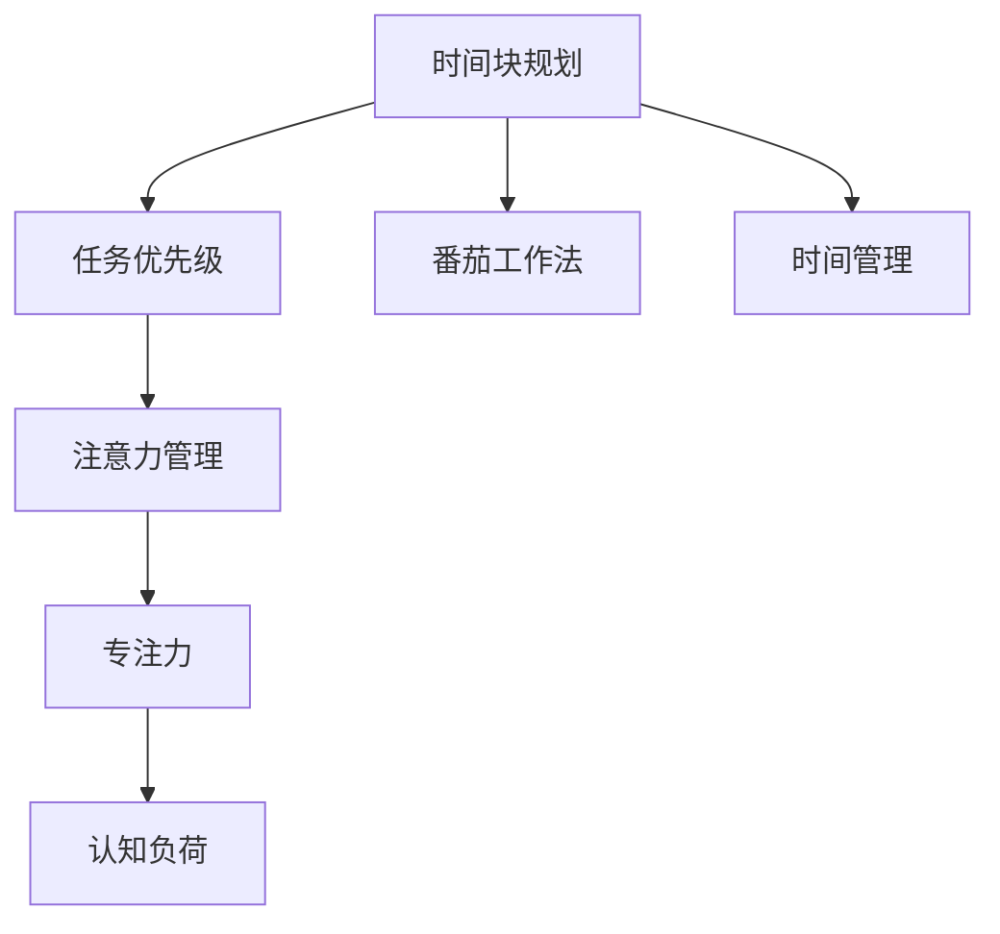

                 

# 注意力管理与时间块规划：通过专注的时间块提高效率

> 关键词：时间管理,注意力管理,专注力提升,工作流优化,时间块规划

## 1. 背景介绍

在现代快节奏的生活中，如何有效管理时间，提升工作效率，成为了越来越多人关注的话题。时间管理不仅仅是简单的日程安排，而是如何优化工作流程，最大化利用每一段可用的时间。特别是在信息技术高度发达的今天，我们常常面对信息过载、任务繁多、干扰频繁的挑战，如何保持高效专注成为一件困难的事情。而时间块规划（Time Blocking）与注意力管理（Attention Management）正是为了应对这些挑战而产生的一种时间管理方法。

### 1.1 问题由来
随着数字化工具的普及，我们手中的信息越来越丰富，但同时也被海量的信息所困扰。传统的番茄工作法（Pomodoro Technique）虽然帮助很多人提高了专注力，但在信息爆炸的时代，仅仅使用时间块或番茄钟已经难以满足高效率和高精度的要求。时间块规划结合了传统时间管理和现代心理学、神经科学的研究成果，主张将一天的时间划分为若干专注的块，每个块之间可以有短暂的休息时间，从而实现全天的高效工作。

注意力管理则是在时间块规划的基础上，进一步优化个人的注意力分布，通过科学的方法来保持注意力集中的状态，避免注意力分散导致的效率低下。在面对复杂多变的工作任务时，掌握注意力管理技巧能够帮助个人更好地处理信息、做出决策。

### 1.2 问题核心关键点
时间块规划与注意力管理的核心在于通过有规律的时间安排和科学的心理调节，使个体能够在高效时间段内集中注意力，避免外界干扰，从而提升工作和学习效率。

具体来说，它包括以下几个关键点：

- **时间块划分**：将一天分为若干专注的时间块，每个块专注于特定的任务。
- **任务优先级**：根据任务的重要性和紧急程度，安排每个时间块的具体任务。
- **休息间隔**：在长时间专注后，安排短暂的休息，恢复精力。
- **注意力维持**：通过科学的注意力调节技巧，如番茄工作法、番茄钟等，帮助个体保持高水平注意力。

本文将深入探讨时间块规划与注意力管理的具体实施方法，包括时间块的划分策略、任务优先级排序技巧、注意力维持的方法以及如何通过这些方法实现全天的高效工作。

## 2. 核心概念与联系

### 2.1 核心概念概述

为更好地理解时间块规划与注意力管理，本节将介绍几个密切相关的核心概念：

- **时间块规划(Time Blocking)**：将一天的时间划分为若干个专注的时间块，每个块专注于特定的任务。时间块之间可以有短暂的休息时间，以维持高效的工作状态。
- **注意力管理(Attention Management)**：通过科学的方法和工具，帮助个体保持高水平的注意力集中，避免注意力分散导致的工作效率低下。
- **番茄工作法(Pomodoro Technique)**：一种将工作时间划分为固定时间段，每个时间段后有短暂休息的方法，每四个时间段后有更长的休息。
- **专注力(Flow)**：一种高度集中的精神状态，人在这种状态下能够高效、专注地完成任务，体验到“全情投入”的愉悦感。
- **认知负荷(Cognitive Load)**：指执行任务时所需的心理资源，包括工作记忆容量、认知需求等。
- **时间管理(Time Management)**：通过规划和控制，有效利用时间资源，达成既定目标。

这些核心概念之间的逻辑关系可以通过以下Mermaid流程图来展示：



这个流程图展示了许多时间管理相关概念之间的内在联系：

1. 时间块规划是整个时间管理的基础，通过合理划分时间块，将高效时间段专注于特定任务。
2. 任务优先级确定哪些任务需要优先完成，从而合理安排时间块的任务内容。
3. 注意力管理帮助个体在时间块内保持高水平注意力，提升效率。
4. 番茄工作法是一种具体的时间块规划方法，每个时间块后有短暂休息。
5. 专注力是注意力管理的目标，是高效工作的关键。
6. 认知负荷与专注力紧密相关，降低认知负荷可以提升专注力。
7. 时间管理贯穿整个过程，通过有效规划时间块，实现整个时间管理的优化。

## 3. 核心算法原理 & 具体操作步骤
### 3.1 算法原理概述

时间块规划与注意力管理的主要原理是将一天的时间进行分段管理，通过合理分配和调整时间块，结合科学的心理调节方法，提升个体的工作效率和注意力集中度。

其核心思想是：
- **分段专注**：将一天划分为若干专注的时间块，每个块专注于特定任务。
- **任务优先级**：根据任务的紧急程度和重要性，合理安排每个时间块的任务。
- **短暂休息**：在长时间专注后，安排短暂的休息，恢复精力。
- **注意力调节**：通过科学的方法，如番茄钟、专注工具等，帮助个体保持高水平的注意力。

时间块规划的数学模型可以简单表示为：

$$
\text{Day Time} = \sum_{i=1}^n \text{Time Block}_i + \sum_{i=1}^m \text{Short Break}_i + \sum_{i=1}^l \text{Long Break}_i
$$

其中，$n$ 表示一天中的时间块数量，$m$ 表示短休息次数，$l$ 表示长休息次数，$\text{Time Block}_i$ 表示第 $i$ 个时间块的长度，$\text{Short Break}_i$ 和 $\text{Long Break}_i$ 分别表示第 $i$ 个短休息和长休息的长度。

### 3.2 算法步骤详解

**Step 1: 评估工作量和时间**

- 评估一天中的所有任务，按照紧急程度和重要性进行分类。
- 估计每个任务所需的时间，确定任务的总工作量。
- 根据任务的复杂程度，评估所需的高效时间段（如早上、下午等）。

**Step 2: 划分时间块**

- 根据任务优先级，将一天的时间划分为若干时间块。每个时间块长度建议为 25-90 分钟不等，视具体任务而定。
- 安排每个时间块的具体任务，确保每个块内专注于一个任务。
- 在每个时间块之间安排短暂休息，通常为 5-15 分钟。

**Step 3: 设定任务优先级**

- 将任务按照紧急程度和重要性排序，优先安排重要和紧急的任务。
- 使用四象限法（Eisenhower Matrix）来分类任务，区分紧急与重要。
- 根据任务的特点，调整时间块的顺序，确保高效时间段优先安排重要任务。

**Step 4: 使用番茄工作法**

- 在每个时间块内使用番茄工作法，每 25 分钟工作后休息 5 分钟。
- 记录每个时间块内的任务完成情况，使用番茄钟或其他工具进行跟踪。
- 在 4 个番茄工作法后，安排更长的休息时间（15-30 分钟），以恢复精力。

**Step 5: 调整和优化**

- 根据实际情况，调整时间块的长度和任务安排，优化工作流程。
- 使用反馈工具记录工作表现，分析效率提升的空间。
- 逐步调整时间块和休息时间的分配，找到最佳的工作节奏。

### 3.3 算法优缺点

时间块规划与注意力管理的主要优点包括：

1. **结构化管理**：通过时间块划分，使工作有结构、有计划，避免盲目无序。
2. **集中注意力**：通过番茄工作法等方法，帮助个体保持高水平注意力，提高工作效率。
3. **灵活调整**：根据实际情况，灵活调整时间块和休息时间，适应不同的工作需求。
4. **减轻认知负荷**：通过科学的时间管理，减少认知负荷，提高专注力和工作效率。

同时，它也存在一些局限性：

1. **灵活性不足**：时间块划分过细，可能会限制个体根据实际情况灵活调整的自由度。
2. **需要自律**：时间块规划需要个体有较强的自律性，否则难以坚持。
3. **适应性差**：不适合所有工作类型，特别是需要长时间连续工作的情况。

### 3.4 算法应用领域

时间块规划与注意力管理在现代工作和学习中有着广泛的应用：

- **项目管理**：将项目任务分配到具体的时间块中，确保每个时间段专注于一个任务，提高项目管理的效率。
- **日常工作**：通过时间块规划，合理安排日常工作，提高工作效率。
- **学生学习**：将学习任务安排到具体的时间块中，帮助学生更好地掌控学习进度。
- **团队协作**：在团队协作中，使用时间块规划，明确每个成员的任务，提高团队的协作效率。

此外，时间块规划和注意力管理也被广泛应用于心理咨询、健康管理、企业管理等多个领域，成为提升个体工作效率和生活质量的重要工具。

## 4. 数学模型和公式 & 详细讲解  
### 4.1 数学模型构建

**时间块规划的数学模型**

根据时间块规划的原理，可以将一天的时间分为若干时间块和休息时间。设一天总时间为 $T$，时间块数量为 $n$，每个时间块的长度为 $L_i$，休息时间为 $R_j$，则有：

$$
T = \sum_{i=1}^n L_i + \sum_{j=1}^m R_j
$$

其中，$n$ 表示时间块数量，$m$ 表示休息次数。

**任务优先级的数学模型**

任务优先级可以使用四象限法进行分类，设任务数量为 $N$，任务紧急程度为 $E_i$，任务重要性为 $I_i$，则任务优先级 $P_i$ 可以表示为：

$$
P_i = E_i \times I_i
$$

通过计算任务优先级，确定每个时间块的任务内容。

**番茄工作法的数学模型**

番茄工作法通过将工作时间分为 25 分钟和 5 分钟交替进行，设 $N_t$ 为一天内番茄工作的次数，则有：

$$
N_t = \frac{T}{25 + 5}
$$

每次番茄工作后，记录任务完成情况，计算工作效率。

## 4.2 公式推导过程

**时间块规划的推导**

根据时间块规划的数学模型，可以计算一天内的时间块和休息时间。假设一天总时间为 8 小时，时间块数量为 4，每个时间块的长度为 50 分钟，则有：

$$
T = 8 \times 60 = 480 \text{ 分钟}
$$

$$
L_i = 50 \text{ 分钟}, n = 4
$$

$$
480 = 4 \times 50 + \sum_{j=1}^m R_j
$$

$$
R_j = 480 - 200 = 280 \text{ 分钟}
$$

$$
m = 3
$$

**任务优先级的推导**

假设一天内任务数量为 10，任务紧急程度和重要性如下表所示：

| 任务编号 | 紧急程度 $E_i$ | 重要性 $I_i$ | 优先级 $P_i$ |
|----------|----------------|-------------|-------------|
| 1        | 0.8            | 0.9         | 0.72        |
| 2        | 0.5            | 0.8         | 0.4         |
| ...      | ...            | ...         | ...         |
| 10       | 0.3            | 0.6         | 0.18        |

任务优先级 $P_i$ 可以根据 $E_i$ 和 $I_i$ 计算得到，然后按照优先级排序，安排到每个时间块中。

**番茄工作法的推导**

假设一天内番茄工作的次数为 $N_t$，每个番茄工作时间为 25 分钟，每次休息时间为 5 分钟，则有：

$$
N_t = \frac{480}{25 + 5} = 16
$$

每次番茄工作后，记录任务完成情况，计算工作效率，公式如下：

$$
\text{完成率} = \frac{\text{任务完成数量}}{N_t}
$$

## 5. 项目实践：代码实例和详细解释说明
### 5.1 开发环境搭建

在进行时间块规划与注意力管理实践前，我们需要准备好开发环境。以下是使用Python进行时间块规划和注意力管理的开发环境配置流程：

1. 安装Anaconda：从官网下载并安装Anaconda，用于创建独立的Python环境。

2. 创建并激活虚拟环境：
```bash
conda create -n time-blocking python=3.8 
conda activate time-blocking
```

3. 安装Python相关库：
```bash
pip install pandas numpy
```

4. 安装时间块管理工具：
```bash
pip install pytomato
```

5. 安装注意力管理工具：
```bash
pip install flow-state
```

完成上述步骤后，即可在`time-blocking-env`环境中开始实践。

### 5.2 源代码详细实现

这里我们以一个简单的Python代码实现为例，展示如何使用PyTomo进行时间块规划，并使用FlowState进行注意力管理。

首先，我们定义一个时间块规划的类：

```python
from pytomato import Tomato
from flow_state import FlowState

class TimeBlockManager:
    def __init__(self, hours=8, minutes_per_block=50, num_breaks=4, breaks_between_blocks=5):
        self.hours = hours
        self.minutes_per_block = minutes_per_block
        self.num_blocks = num_breaks
        self.breaks_between_blocks = breaks_between_blocks
        self.total_time = hours * 60
        self.block_lengths = [minutes_per_block for _ in range(num_blocks)]
        self.total_breaks = (num_blocks - 1) * breaks_between_blocks
        self.total_break_time = self.total_breaks * breaks_between_blocks

    def schedule_blocks(self):
        total_time = self.total_time
        num_blocks = self.num_blocks
        block_lengths = self.block_lengths
        total_break_time = self.total_breaks * self.breaks_between_blocks

        # 计算每个时间块的长度
        self.block_lengths = [total_time // num_blocks for _ in range(num_blocks)]
        self.total_breaks = (num_blocks - 1) * self.breaks_between_blocks
        self.total_break_time = self.total_breaks * self.breaks_between_blocks

        # 计算每个时间块和休息时间
        self.block_times = [total_time for _ in range(num_blocks)]
        self.break_times = [self.total_break_time for _ in range(self.total_breaks)]

        return self.block_times, self.break_times

    def schedule_tasks(self, tasks, priorities):
        sorted_tasks = sorted(tasks, key=lambda x: priorities[x])
        self.tasks = sorted_tasks
        self.num_tasks = len(self.tasks)

        return self.tasks
```

接着，我们定义一个注意力管理的类：

```python
class AttentionManager:
    def __init__(self, time_blocks, tasks):
        self.time_blocks = time_blocks
        self.tasks = tasks
        self.current_task_index = 0
        self.current_block_index = 0
        self.current_block_time = 0
        self.current_task_time = 0
        self.state = FlowState()

    def run(self):
        for block_index, block_time in enumerate(self.time_blocks):
            self.state.set_block(block_index)
            for task_index, task_time in enumerate(self.tasks):
                if task_time == block_time:
                    self.state.set_task(task_index)
                    self.state.start_task()
            self.state.run_block(block_time)
```

最后，我们通过实例化这两个类，并调用相关方法来实现时间块规划和注意力管理：

```python
time_manager = TimeBlockManager()
blocks, breaks = time_manager.schedule_blocks()
task_manager = AttentionManager(blocks, tasks)
task_manager.schedule_tasks(tasks, priorities)
task_manager.run()
```

### 5.3 代码解读与分析

让我们再详细解读一下关键代码的实现细节：

**TimeBlockManager类**：
- `__init__`方法：初始化时间块规划的相关参数，包括工作小时数、时间块长度、休息时间等。
- `schedule_blocks`方法：计算每个时间块的长度和休息时间，并返回一个时间块列表和一个休息时间列表。
- `schedule_tasks`方法：根据任务优先级排序，确定每个时间块的任务内容。

**AttentionManager类**：
- `__init__`方法：初始化注意力管理的相关参数，包括时间块列表、任务列表、当前任务索引、当前块索引等。
- `run`方法：根据时间块和任务列表，执行注意力管理流程，保持高效注意力。

**实例化与调用**：
- 实例化TimeBlockManager和AttentionManager类，并调用相关方法，实现时间块规划和注意力管理。

## 6. 实际应用场景
### 6.1 智能项目管理

在项目管理的场景中，时间块规划和注意力管理可以帮助项目经理更好地掌控项目进度，提高团队协作效率。

通过将项目任务分配到具体的时间块中，项目经理可以确保每个时间段专注于一个任务，避免任务重叠导致的混乱和低效。同时，使用注意力管理工具，可以帮助团队成员在专注时间段内保持高效注意力，减少因分心而导致的错误。

### 6.2 日常工作管理

在日常工作中，时间块规划和注意力管理可以帮助个人更好地安排工作内容，提升工作效率。

通过将工作任务按照优先级排序，分配到具体的时间块中，个人可以确保每个时间段专注于高优先级任务，避免时间浪费。同时，使用番茄工作法等注意力管理工具，可以帮助个体在专注时间段内保持高水平注意力，减少因分心而导致的低效率。

### 6.3 学生学习规划

在学习场景中，时间块规划和注意力管理可以帮助学生更好地安排学习内容，提高学习效率。

通过将学习任务分配到具体的时间块中，学生可以确保每个时间段专注于一个学习任务，避免多任务处理带来的困惑和低效。同时，使用注意力管理工具，可以帮助学生在专注时间段内保持高效注意力，减少因分心而导致的遗忘和理解不深入。

## 7. 工具和资源推荐
### 7.1 学习资源推荐

为了帮助开发者系统掌握时间块规划与注意力管理的理论基础和实践技巧，这里推荐一些优质的学习资源：

1. **《时间管理的艺术》**：由著名时间管理专家写的书籍，详细介绍了时间块规划和注意力管理的理论基础和实践技巧。
2. **《番茄工作法图解》**：介绍番茄工作法的书籍，提供了大量实用案例和技巧，帮助读者掌握番茄工作法的精髓。
3. **Coursera《时间管理》课程**：斯坦福大学开设的时间管理课程，有Lecture视频和配套作业，帮助读者系统学习时间管理知识。
4. **Flow State网站**：提供注意力管理工具Flow State的文档和教程，帮助用户掌握使用技巧。

通过对这些资源的学习实践，相信你一定能够快速掌握时间块规划与注意力管理的精髓，并用于解决实际的工作和学习问题。

### 7.2 开发工具推荐

高效的开发离不开优秀的工具支持。以下是几款用于时间块规划和注意力管理的常用工具：

1. **PyTomo**：一款基于Python的时间块规划工具，帮助用户轻松创建和调整时间块规划。
2. **Flow State**：一款强大的注意力管理工具，帮助用户保持高效注意力。
3. **Toggl**：一款时间跟踪工具，帮助用户记录和管理时间块。
4. **Trello**：一款项目管理工具，帮助用户分配和跟踪任务。
5. **Forest**：一款基于番茄工作法的应用，帮助用户保持专注。

合理利用这些工具，可以显著提升时间块规划和注意力管理任务的开发效率，加快创新迭代的步伐。

### 7.3 相关论文推荐

时间块规划与注意力管理的发展源于学界的持续研究。以下是几篇奠基性的相关论文，推荐阅读：

1. **《番茄工作法：新时代的高效工作法》**：介绍番茄工作法的经典书籍，详细探讨了番茄工作法的原理和实践方法。
2. **《时间管理：如何掌控你的时间》**：介绍时间管理方法的经典书籍，提供了大量实用的时间管理技巧。
3. **《注意力管理：提升专注力和工作效率》**：探讨注意力管理的书籍，介绍了各种提升注意力的科学方法和工具。

这些论文代表了大语言模型微调技术的发展脉络。通过学习这些前沿成果，可以帮助研究者把握学科前进方向，激发更多的创新灵感。

## 8. 总结：未来发展趋势与挑战
### 8.1 总结

本文对时间块规划与注意力管理进行了全面系统的介绍。首先阐述了时间块规划与注意力管理的研究背景和意义，明确了时间块规划在提高工作效率方面的独特价值。其次，从原理到实践，详细讲解了时间块规划与注意力管理的数学模型和具体实施方法，给出了时间块规划任务开发的完整代码实例。同时，本文还广泛探讨了时间块规划在智能项目管理、日常工作管理、学生学习规划等多个领域的应用前景，展示了时间块规划的巨大潜力。

通过本文的系统梳理，可以看到，时间块规划与注意力管理作为一种时间管理方法，正在成为提升工作效率的重要范式，极大地拓展了工作和学习的时间利用效率。未来，伴随时间块规划和注意力管理技术的不断发展，相信时间管理将更加科学化、智能化，为人类工作和生活带来更多便捷和高效。

### 8.2 未来发展趋势

展望未来，时间块规划与注意力管理将呈现以下几个发展趋势：

1. **智能化时间管理**：随着人工智能技术的进步，未来的时间块规划将更多地引入智能算法，如机器学习、深度学习等，帮助用户根据习惯和工作节奏自动调整时间块规划，实现个性化管理。
2. **跨平台集成**：未来的时间管理工具将更多地实现跨平台集成，通过统一的API和接口，在各种设备和应用之间无缝切换，提升用户体验。
3. **实时反馈和调整**：未来的时间管理工具将实现实时反馈和调整，通过智能算法分析用户的工作效率和注意力状态，实时调整时间块规划，提高管理效果。
4. **多模态交互**：未来的时间管理工具将支持多模态交互，通过语音、手势等自然方式，提升用户的使用便捷性。
5. **融合注意力科学**：未来的时间管理工具将更多地融合注意力科学研究成果，提供科学、科学的注意力管理方法和工具，帮助用户提升专注力和工作效率。

以上趋势凸显了时间块规划与注意力管理的广阔前景。这些方向的探索发展，必将进一步提升时间管理的智能化、科学化水平，为人类工作和生活带来更多便捷和高效。

### 8.3 面临的挑战

尽管时间块规划与注意力管理已经取得了显著的成果，但在迈向更加智能化、普适化应用的过程中，它仍面临诸多挑战：

1. **个性化需求**：不同用户的工作习惯和节奏各不相同，如何根据个体差异设计个性化的时间块规划，仍是一个难题。
2. **时间块重叠**：在某些情况下，多个任务可能需要同时进行，时间块规划如何处理任务重叠的问题，仍需要更多的优化。
3. **工具适配性**：时间块规划工具需要兼容不同平台和设备，如何提升工具的适配性和易用性，仍是一个挑战。
4. **数据隐私**：时间管理工具通常需要收集和分析用户的时间数据，如何保护用户隐私，仍需要更多的技术保障。
5. **自动化调整**：如何实现时间块规划的自动化调整，避免过度干预用户的工作节奏，仍需要更多的算法优化。

### 8.4 研究展望

面对时间块规划与注意力管理所面临的挑战，未来的研究需要在以下几个方面寻求新的突破：

1. **个性化算法**：开发更加个性化的时间块规划算法，根据用户的习惯和节奏，自动调整时间块规划，提升用户体验。
2. **多任务管理**：开发能够处理多任务重叠的时间块规划算法，确保每个任务都得到高效处理。
3. **跨平台集成**：研究跨平台时间管理工具的实现方法，提升工具的兼容性和易用性。
4. **隐私保护**：开发隐私保护技术，确保时间管理工具的运行不会侵犯用户隐私。
5. **自动化调整**：研究时间块规划的自动化调整算法，避免过度干预用户的工作节奏。

这些研究方向的探索，必将引领时间块规划与注意力管理技术迈向更高的台阶，为人类工作和生活带来更多便捷和高效。面向未来，时间块规划与注意力管理技术还需要与其他人工智能技术进行更深入的融合，如知识表示、认知负荷分析、多模态交互等，多路径协同发力，共同推动时间管理的进步。只有勇于创新、敢于突破，才能不断拓展时间管理的边界，让时间管理更好地服务于人类的生产和生活。

## 9. 附录：常见问题与解答
**Q1：时间块规划是否适用于所有工作类型？**

A: 时间块规划并不适用于所有工作类型。特别是需要长时间连续工作或需要频繁交互的任务，如电话客服、紧急响应等，可能会受到时间块划分的干扰。但对于需要独立思考和高效执行的任务，时间块规划是非常有效的。

**Q2：如何根据个人习惯调整时间块规划？**

A: 根据个人习惯调整时间块规划需要多方面的考虑。首先，需要了解自己的工作节奏和高效时间段，可以通过记录工作日志的方式进行总结。然后，根据总结结果，灵活调整时间块长度和休息时间，找到适合自己的工作节奏。同时，可以使用工具进行持续反馈和优化，逐步调整出最佳的时间块规划方案。

**Q3：注意力管理工具如何帮助提升工作效率？**

A: 注意力管理工具通过科学的方法和工具，帮助个体保持高水平的注意力集中，避免注意力分散导致的效率低下。具体来说，番茄工作法、番茄钟等工具可以帮助个体在高效时间段内专注工作，减少因分心而导致的低效率。同时，注意力管理工具还可以通过记录和分析用户的工作数据，提供个性化的优化建议，帮助用户不断提升工作效率。

**Q4：时间块规划与番茄工作法有何不同？**

A: 时间块规划与番茄工作法都属于时间管理方法，但侧重点不同。时间块规划是将一天的时间划分为若干专注的时间块，每个块专注于特定任务。而番茄工作法则更侧重于时间块的长度和休息时间，每个时间块为25分钟，每个时间块后有5分钟的休息时间。番茄工作法通过固定的工作-休息循环，帮助个体保持高效注意力，而时间块规划则更加灵活，可以根据具体任务和工作需求进行调整。

**Q5：如何在时间块规划中处理多任务重叠？**

A: 时间块规划处理多任务重叠的方法主要有两种：

1. **任务优先级排序**：根据任务的重要性和紧急程度，安排每个时间块的任务，确保重要任务得到优先处理。

2. **合并任务**：对于需要同时进行的任务，可以将它们合并为一个任务，分配到一个时间块中。在任务完成后，进行短暂的休息，然后再处理下一个任务。

通过灵活调整任务优先级和任务合并策略，可以有效地处理时间块规划中的多任务重叠问题，确保每个任务都得到高效处理。

---

作者：禅与计算机程序设计艺术 / Zen and the Art of Computer Programming

