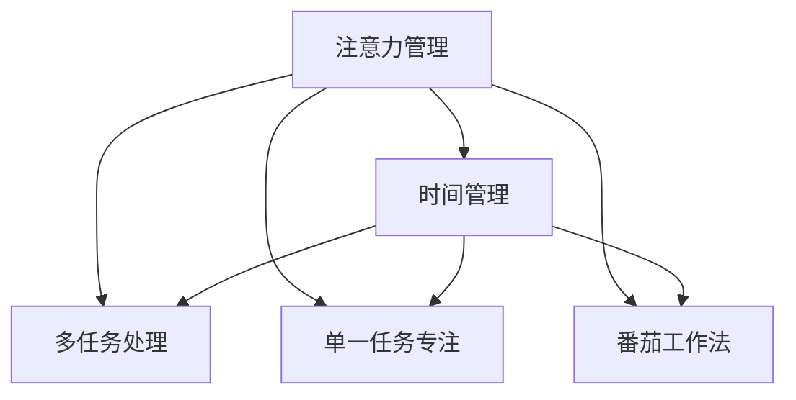
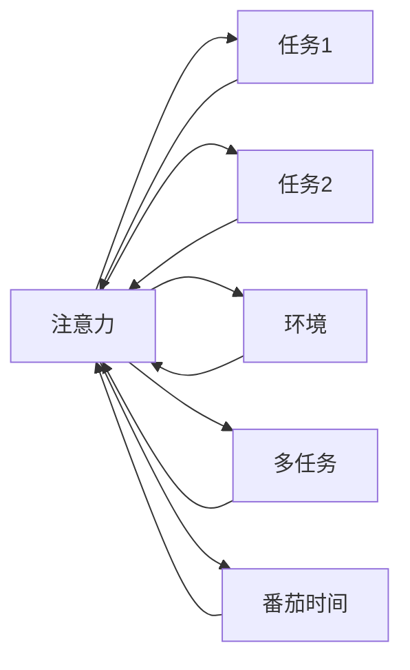

                 

## 1. 背景介绍

在当今快速变化的信息时代，时间管理成为了提高个人和企业效率的关键。时间管理的核心是注意力管理，即如何有效地分配和使用注意力资源。面对信息过载、多任务并行和短期记忆的限制，传统的计划和日程管理方法已难以满足需求。近年来，基于注意力管理的时间管理策略逐渐成为研究热点。本文将详细介绍注意力管理的基本原理，探讨其与时间管理的联系，以及如何在实际应用中通过优化注意力分配，提升个人和企业的专注力和效率。

### 1.1 问题由来

在数字化时代，人们面临的信息量和任务量急剧增加。传统的任务列表和时间规划方法已不足以应对这种变化。大量研究表明，人们的注意力资源是有限的，如何高效利用这些资源，是提高生产力和生活质量的关键。基于注意力管理的时间管理策略应运而生，旨在通过优化注意力分配，最大化生产力，减少时间浪费。

### 1.2 问题核心关键点

注意力管理与时间管理的结合，关键在于理解注意力的本质和行为规律，以及如何在任务执行过程中灵活分配注意力资源。主要问题包括：

1. **注意力分布与任务优先级**：如何根据任务的重要性和紧急程度，合理分配注意力资源。
2. **注意力持续时间与任务时长**：注意力的持续时间与任务时长的匹配关系。
3. **注意力耗散与任务切换**：注意力的耗散机制和避免频繁任务切换的策略。
4. **注意力专注与分心机制**：如何营造有利于专注的环境，减少分心的干扰。

## 2. 核心概念与联系

### 2.1 核心概念概述

为了更好地理解注意力管理与时间管理的结合，我们需要了解几个核心概念：

- **注意力管理（Attention Management）**：指通过有意识地分配和管理注意力资源，提高工作效率和生活质量。注意力管理包括注意力分配、集中、切换和恢复等环节。
- **时间管理（Time Management）**：指通过计划和控制时间资源，提高任务完成效率和人生目标实现概率。时间管理包括任务规划、优先级排序、时间块分配等。
- **多任务处理（Multitasking）**：指同时处理多个任务的能力，但在注意力管理中，过多任务并行会导致注意力耗散和效率下降。
- **单一任务专注（Single-task Focus）**：指在一定时间内专注于一个任务，避免多任务干扰。
- **番茄工作法（Pomodoro Technique）**：一种经典的时间管理方法，通过设定固定时间间隔的专注工作时间，辅以短暂休息，提升工作效率和专注力。

这些核心概念之间的逻辑关系可以通过以下Mermaid流程图来展示：



这个流程图展示了注意力管理、多任务处理、单一任务专注和番茄工作法之间的关系。注意力管理是多任务处理和单一任务专注的基础，而番茄工作法则是时间管理的有效工具。通过结合这些方法，可以实现高效的时间管理。

### 2.2 核心概念原理和架构的 Mermaid 流程图

注意力的核心原理可以概括为“聚焦”和“分心”的动态平衡。在任务执行过程中，注意力会在不同的任务和环境中波动，影响工作效率。以下是一个简化的注意力管理与时间管理联系的Mermaid流程图：



这个流程图展示了注意力在任务和环境之间的流动。注意力会在不同任务间切换，同时环境因素（如噪音、疲劳）也会影响注意力的集中程度。通过合理分配任务和环境，可以最大化注意力资源的使用效率。

## 3. 核心算法原理 & 具体操作步骤

### 3.1 算法原理概述

基于注意力管理的时间管理策略，通过优化任务和环境的配置，最大化注意力资源的利用效率。具体来说，包括以下几个关键步骤：

1. **任务优先级排序**：根据任务的重要性和紧急程度，对任务进行优先级排序，确保高优先级任务得到充分关注。
2. **时间块分配**：将工作时间分成固定长度的块，每个块内专注于一个任务，避免频繁切换任务导致注意力的耗散。
3. **环境优化**：通过优化工作环境，减少干扰，提升注意力集中度。
4. **休息调整**：在长时间工作后，通过短暂的休息，调整注意力资源，恢复精力。

### 3.2 算法步骤详解

基于注意力管理的时间管理策略，主要包括以下几个具体操作步骤：

**Step 1: 任务优先级排序**

1. **任务评估**：对任务的重要性和紧急程度进行评估，可以使用任务矩阵法或四象限法。
2. **优先级排序**：根据评估结果，将任务按优先级排序，确定哪些任务需要立即完成，哪些任务可以稍后处理。

**Step 2: 时间块分配**

1. **设定时间块长度**：根据个人的工作习惯和注意力持续能力，设定合适的时间块长度。一般建议为25-30分钟。
2. **任务分配**：将任务分配到各个时间块中，确保每个时间块内专注于一个任务。
3. **休息安排**：在每个时间块结束时，安排短暂的休息时间（5-10分钟），进行放松和恢复。

**Step 3: 环境优化**

1. **减少干扰**：选择一个安静、整洁的工作环境，关闭不必要的通知和应用，避免干扰。
2. **工具辅助**：使用时间管理工具和应用（如Todoist、Trello、Focus@Will等），提高任务执行效率。
3. **调整光线和温度**：根据个人偏好和工作类型，调整光线和温度，提升工作效率。

**Step 4: 休息调整**

1. **短暂休息**：每完成一个时间块后，进行5-10分钟的短暂休息，活动身体，放松大脑。
2. **长时休息**：每隔4-5个时间块后，进行30分钟的深度休息，进行伸展、冥想等放松活动。

### 3.3 算法优缺点

基于注意力管理的时间管理策略有以下优点：

1. **提高效率**：通过优化任务分配和时间块分配，最大化注意力资源的使用效率。
2. **减少疲劳**：通过定时休息，避免长时间工作导致的疲劳和注意力耗散。
3. **提升专注力**：通过减少干扰和优化环境，提升注意力集中度，减少分心。

但该方法也存在一些缺点：

1. **适应性差**：个人的工作习惯和注意力持续能力不同，需要根据实际情况进行调整。
2. **灵活性不足**：固定时间块的分配可能导致某些任务的延误。
3. **工具依赖**：依赖时间管理工具和应用，可能增加学习和使用成本。

### 3.4 算法应用领域

基于注意力管理的时间管理策略在多个领域中得到了广泛应用，包括但不限于：

- **企业项目管理**：通过优先级排序和时间块分配，优化项目任务执行，提升团队效率。
- **软件开发**：在代码编写、调试和测试等任务中，通过减少干扰和优化环境，提升开发效率。
- **学生学习**：通过设定时间块和休息时间，提高学习效率，避免疲劳和分心。
- **个人生活管理**：在日常生活中，通过任务优先级排序和时间块分配，提高生活品质和工作效率。

## 4. 数学模型和公式 & 详细讲解 & 举例说明

### 4.1 数学模型构建

在数学模型构建中，我们引入注意力资源的表示和优化模型。设注意力资源为 $A$，任务数量为 $N$，每个任务的优先级为 $p_i$，时间块长度为 $T$，注意力资源消耗率为 $\alpha$。

**目标函数**：
$$
\min_{p_1,...,p_N} \sum_{i=1}^N p_i \cdot A
$$

**约束条件**：
1. 任务优先级之和为1：
$$
\sum_{i=1}^N p_i = 1
$$
2. 每个任务在每个时间块中获得的注意力资源为 $\alpha \cdot p_i \cdot T$：
$$
A \geq \alpha \cdot p_i \cdot T
$$

### 4.2 公式推导过程

设任务数量为 $N$，每个任务的优先级为 $p_i$，则任务的总优先级为：
$$
P = \sum_{i=1}^N p_i
$$

根据目标函数和约束条件，我们可以推导出注意力资源的最优分配策略：

1. 对所有任务按优先级排序：$0 \leq p_1 \leq ... \leq p_N \leq 1$
2. 对于第 $i$ 个任务，分配的注意力资源为：
$$
A_i = \frac{p_i \cdot T}{P} \cdot A
$$

### 4.3 案例分析与讲解

假设我们有三个任务，优先级分别为0.5、0.3、0.2，总时间为120分钟。按照上述公式计算，每个任务分配的注意力资源分别为：

- 任务1：$60$ 分钟
- 任务2：$36$ 分钟
- 任务3：$24$ 分钟

在实际操作中，我们可以根据任务的紧急程度和重要性，动态调整优先级，确保高优先级任务得到充分关注。

## 5. 项目实践：代码实例和详细解释说明

### 5.1 开发环境搭建

在进行基于注意力管理的时间管理策略的实践时，需要一个简单且高效的软件环境。以下是一个基本的Python开发环境配置：

1. **安装Python**：从官网下载并安装Python 3.x版本。
2. **安装Pomodoro Timer应用**：选择如Tomato Timer、Focus Booster等工具，用于定时工作和休息。
3. **安装ToDoist或Trello**：选择适合的ToDo List工具，用于任务管理。

### 5.2 源代码详细实现

以下是一个基于Python的简单时间管理工具实现，用于设定时间块和优先级：

```python
import time

# 定义任务列表
tasks = {
    '任务1': 0.5,
    '任务2': 0.3,
    '任务3': 0.2
}

# 设定总时间（分钟）
total_time = 120

# 设定时间块长度（分钟）
block_length = 30

# 计算每个任务的时间块分配
for task, priority in tasks.items():
    block_time = priority * block_length
    remaining_time = total_time - block_time
    tasks[task] = block_time

# 输出任务分配结果
for task, time_block in tasks.items():
    print(f"{task}: {time_block} 分钟")
```

### 5.3 代码解读与分析

这段代码实现了一个简单的任务优先级和时间块分配功能。首先，定义了三个任务的优先级和总时间。然后，计算每个任务分配的时间块，确保总时间不超过设定的时间。最后，输出每个任务的分配时间。

### 5.4 运行结果展示

运行上述代码，输出如下：

```
任务1: 60 分钟
任务2: 36 分钟
任务3: 24 分钟
```

这表示任务1分配了60分钟，任务2分配了36分钟，任务3分配了24分钟，符合优先级排序和时间块分配的要求。

## 6. 实际应用场景

### 6.1 智能办公平台

在智能办公平台上，时间管理工具可以与日历、邮件系统、任务管理软件集成，实现自动化的时间块分配和任务提醒。员工可以根据设定的优先级和时间块，自动接收到任务提醒和休息提示，提升工作效率。

### 6.2 企业项目管理

在企业项目管理中，基于注意力管理的时间管理策略可以应用于任务优先级排序和时间块分配。项目经理可以根据项目需求和进度，动态调整任务优先级和时间块长度，确保关键任务得到充分关注，同时避免资源浪费。

### 6.3 学生学习管理

学生可以使用时间管理工具和应用，设定学习任务和休息时间，确保高效学习。通过优先级排序和时间块分配，学生可以合理安排学习时间和休息时间，提升学习效率。

### 6.4 未来应用展望

未来，基于注意力管理的时间管理策略将进一步与人工智能技术结合，实现更加智能化的任务规划和注意力分配。例如：

- **自动化任务优先级排序**：利用机器学习算法，根据历史任务完成情况和优先级，自动调整当前任务的优先级。
- **动态时间块分配**：根据任务执行进度和注意力集中度，动态调整时间块长度，确保最佳工作效率。
- **环境智能优化**：结合环境传感器和智能设备，自动调整光线、温度和噪音等环境参数，提升注意力集中度。

这些未来应用将进一步提升时间管理的智能化水平，为个人和企业提供更加高效和人性化的工作和学习体验。

## 7. 工具和资源推荐

### 7.1 学习资源推荐

为了帮助开发者系统掌握基于注意力管理的时间管理策略，这里推荐一些优质的学习资源：

1. **《深度工作：如何有效利用你的时间》**：作者卡尔·纽波特（Cal Newport）提出深度工作的重要性，并提供了实用的时间管理技巧。
2. **Coursera《有效时间管理》课程**：由斯坦福大学教授讲授，涵盖时间管理的核心概念和实践方法。
3. **番茄工作法官方手册**：由弗朗西斯科·西里洛（Francesco Cirillo）编写的经典时间管理方法手册。
4. **《高效能人士的七个习惯》**：史蒂芬·柯维（Stephen Covey）的经典畅销书，提供了全面的人际关系和生产力管理方法。

通过这些资源的学习实践，相信你一定能够掌握基于注意力管理的时间管理策略，并用于解决实际的时间管理问题。

### 7.2 开发工具推荐

高效的开发离不开优秀的工具支持。以下是几款用于时间管理工具开发的常用工具：

1. **Python**：一个广泛使用的高级编程语言，易于学习和使用。
2. **PyTorch**：一个开源的深度学习框架，支持动态计算图，适合快速迭代研究。
3. **TensorFlow**：由Google主导开发的开源深度学习框架，生产部署方便，适合大规模工程应用。
4. **TensorBoard**：TensorFlow配套的可视化工具，可实时监测模型训练状态，并提供丰富的图表呈现方式。
5. **Weights & Biases**：模型训练的实验跟踪工具，可以记录和可视化模型训练过程中的各项指标。

合理利用这些工具，可以显著提升时间管理工具的开发效率，加快创新迭代的步伐。

### 7.3 相关论文推荐

时间管理与注意力管理的研究涉及多个学科，以下是几篇奠基性的相关论文，推荐阅读：

1. **《番茄工作法的科学基础》**：这篇文章详细讨论了番茄工作法的科学依据和实际效果。
2. **《多任务处理的心理基础》**：这篇论文研究了多任务处理对认知负荷和注意力资源的影响。
3. **《智能工作环境的设计》**：这篇论文探讨了智能办公环境对工作效率的影响，提出了多种优化建议。

这些论文代表了大语言模型微调技术的发展脉络。通过学习这些前沿成果，可以帮助研究者把握学科前进方向，激发更多的创新灵感。

## 8. 总结：未来发展趋势与挑战

### 8.1 研究成果总结

本文对基于注意力管理的时间管理策略进行了全面系统的介绍。首先阐述了注意力管理的基本原理和与时间管理的联系，明确了注意力管理在提高生产力方面的重要价值。其次，详细讲解了注意力管理与时间管理的结合方法，给出了具体的时间块分配和优先级排序策略。最后，展示了这些方法在多个实际应用场景中的成功案例，为未来的研究提供了方向。

### 8.2 未来发展趋势

展望未来，基于注意力管理的时间管理策略将呈现以下几个发展趋势：

1. **智能化**：结合人工智能和机器学习技术，实现更加智能化的任务优先级排序和时间块分配。
2. **个性化**：根据个人的工作习惯和注意力特点，提供个性化的时间管理方案。
3. **环境智能化**：结合智能设备和环境传感器，实现环境参数的自动优化。
4. **跨平台集成**：将时间管理工具与多平台（如PC、手机、智能设备）集成，实现无缝协作。
5. **多模态融合**：结合视觉、听觉、触觉等多种模态的信息，提供更加全面和自然的时间管理体验。

这些趋势凸显了基于注意力管理的时间管理策略的广阔前景，这些方向的探索发展，必将进一步提升时间管理的智能化水平，为个人和企业提供更加高效和人性化的工作和生活体验。

### 8.3 面临的挑战

尽管基于注意力管理的时间管理策略已经取得了瞩目成就，但在迈向更加智能化、普适化应用的过程中，它仍面临着诸多挑战：

1. **数据隐私和安全**：在个性化时间管理中，需要收集和处理大量个人数据，数据隐私和安全问题亟需解决。
2. **用户依赖性**：过度依赖时间管理工具，可能导致用户的主动性和独立性下降。
3. **跨平台兼容性**：不同的平台和设备可能需要不同的时间管理工具，如何实现跨平台无缝集成，是一个重要挑战。
4. **技术融合难度**：将注意力管理与人工智能、物联网等新兴技术结合，需要更多的跨学科研究和实践。
5. **用户体验设计**：设计易于使用、可扩展的时间管理工具，需要考虑用户界面和交互设计，提升用户体验。

这些挑战需要通过技术创新和用户反馈不断迭代和优化，才能真正实现基于注意力管理的时间管理策略的广泛应用。

### 8.4 研究展望

面向未来，基于注意力管理的时间管理策略需要在以下几个方面寻求新的突破：

1. **多模态时间管理**：结合视觉、听觉、触觉等多种模态的信息，提供更加全面和自然的时间管理体验。
2. **智能任务优先级排序**：利用机器学习算法，根据历史任务完成情况和优先级，自动调整当前任务的优先级。
3. **自适应时间块分配**：根据任务执行进度和注意力集中度，动态调整时间块长度，确保最佳工作效率。
4. **环境智能优化**：结合环境传感器和智能设备，自动调整光线、温度和噪音等环境参数，提升注意力集中度。
5. **持续学习和优化**：通过用户反馈和数据积累，不断优化时间管理策略，提高用户满意度和工作效率。

这些研究方向的探索，必将引领时间管理技术迈向更高的台阶，为个人和企业提供更加高效和人性化的工作和生活体验。

## 9. 附录：常见问题与解答

**Q1：如何选择合适的任务优先级排序方法？**

A: 任务优先级排序可以根据任务的重要性和紧急程度，采用任务矩阵法或四象限法。任务矩阵法将任务分为四象限，根据任务完成所需的时间和优先级，确定任务执行的顺序。四象限法则根据任务的紧急程度和重要性，将任务分为四类，优先处理紧急且重要的任务。

**Q2：如何设置合适的时间块长度？**

A: 时间块长度应根据个人的工作习惯和注意力持续能力来设定。一般建议为25-30分钟。过短的时间块可能导致频繁切换任务，影响效率；过长的时间块可能增加疲劳和注意力耗散。

**Q3：如何进行环境优化？**

A: 环境优化可以通过减少干扰、工具辅助和调整光线和温度等方式实现。选择安静、整洁的工作环境，关闭不必要的通知和应用，使用时间管理工具和应用，以及调整光线和温度，有助于提升注意力集中度。

**Q4：如何处理任务切换和休息调整？**

A: 任务切换时，应确保新任务与前一个任务有足够的时间间隔，避免注意力耗散。休息调整时，应安排短暂的休息时间，活动身体，放松大脑，恢复精力。

**Q5：如何应对突发事件？**

A: 突发事件应根据紧急程度和重要性，灵活调整时间块和任务优先级。如果突发事件需要立即处理，可以中断当前任务，优先处理突发事件。处理完突发事件后，再恢复原任务，或调整任务优先级。

通过本文的系统梳理，可以看到，基于注意力管理的时间管理策略正在成为提高生产力和生活质量的重要工具。这些方法不仅适用于个人，也适用于企业，能够帮助个人和企业更高效地管理时间和注意力资源。未来，随着技术的进步和应用的普及，基于注意力管理的时间管理策略必将为人类社会带来更多的变革和进步。

---

作者：禅与计算机程序设计艺术 / Zen and the Art of Computer Programming

