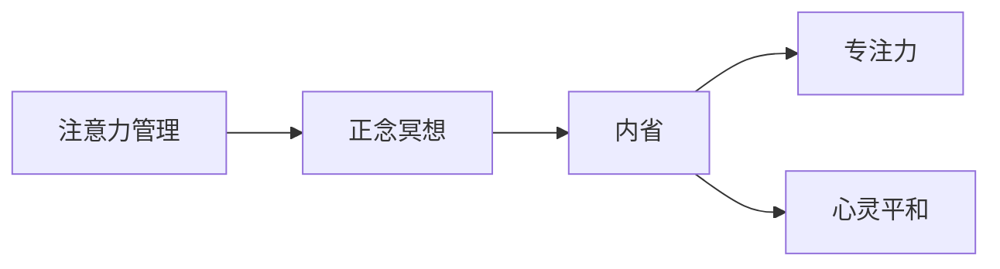

                 

# 注意力管理与正念冥想实践：通过内省增强专注力和心灵平和

> 关键词：注意力管理,正念冥想,专注力,心灵平和,内省,心理健康,压力缓解,冥想应用,技术实践

## 1. 背景介绍

### 1.1 问题由来

在现代快节奏的生活中，注意力管理（Attention Management）与正念冥想（Mindfulness Meditation）成为人们寻求心理健康和提高工作效率的重要手段。尤其在信息爆炸、压力山大和高强度工作环境中，提升专注力和心灵平和显得尤为重要。许多人尝试通过冥想、呼吸练习、瑜伽等多种方式来调节身心状态，但实际效果并不尽如人意。

技术专家们开始探索使用AI和大数据技术辅助提升注意力和心理健康的可能性，希望借助先进技术为个体提供更为系统和科学的心理健康管理解决方案。本文聚焦于注意力管理与正念冥想的实践，将介绍基于AI的大数据分析技术如何辅助个体实现专注力和心灵平和的内省，并通过实例展示其应用效果。

### 1.2 问题核心关键点

注意力管理与正念冥想的核心关键点在于如何通过技术手段辅助个体进行科学的自我管理和心理调节。具体包括以下方面：

- **注意力管理**：通过监测和分析个体的注意力分布状态，及时发现注意力分散或疲劳，并给予相应的提醒和调整策略。
- **正念冥想**：通过指导和记录个体的冥想过程，确保冥想的有效性和持续性，帮助个体逐步提升专注力和心灵平和。

本文将系统阐述注意力管理与正念冥想的核心概念、技术原理和实践步骤，并通过实际项目案例展示其应用效果。

## 2. 核心概念与联系

### 2.1 核心概念概述

为更好地理解注意力管理与正念冥想的实践，本节将介绍几个密切相关的核心概念：

- **注意力管理（Attention Management）**：指通过监测和调节个体的注意力状态，以提高工作效率和生活质量。常见的注意力管理工具包括待办事项清单、时间管理应用等。
- **正念冥想（Mindfulness Meditation）**：指通过专注于当下的观察，提高自我觉察和情绪管理能力。正念冥想广泛应用于减压、焦虑缓解、情绪调节等心理健康管理领域。
- **内省（Introspection）**：指个体对自己的内心世界进行深入反思和理解，帮助个体提升自我认知和情绪管理能力。
- **专注力（Focus）**：指个体集中注意力进行某项任务的能力，是提升工作效率和创新能力的重要基础。
- **心灵平和（Mental Peace）**：指个体在面对压力和挑战时，保持内心宁静和平衡的状态，是心理健康的重要指标。

这些核心概念之间通过内省机制相联系，形成一个完整的自我管理和心理健康调节体系。通过内省，个体能够更好地理解和管理自己的注意力、情绪和行为，从而提升专注力和心灵平和。

### 2.2 核心概念原理和架构的 Mermaid 流程图



这个流程图展示了大语言模型注意力管理与正念冥想的核心概念及其之间的关系：

1. **注意力管理**：通过监测和调节个体的注意力状态，帮助个体集中精力进行任务。
2. **正念冥想**：通过专注当下的观察，提升个体的自我觉察和情绪管理能力。
3. **内省**：个体对自己的内心世界进行反思，提升自我认知和情绪调节能力。
4. **专注力**：个体集中注意力的能力，是提升工作效率和生活质量的关键。
5. **心灵平和**：个体在面对压力和挑战时的内心宁静和平衡状态，是心理健康的重要指标。

这些概念共同构成了一个完整的注意力管理与正念冥想的实践框架，帮助个体在快节奏的生活中更好地管理注意力和情绪，实现专注力和心灵平和。

## 3. 核心算法原理 & 具体操作步骤

### 3.1 算法原理概述

注意力管理与正念冥想的实践，本质上是通过人工智能和大数据技术，对个体的注意力和情绪状态进行监测和分析，从而提供相应的注意力管理和正念冥想指导。其核心算法原理包括以下几个方面：

- **注意力监测**：通过自然语言处理（NLP）技术和机器学习算法，分析个体与外部环境的交互记录（如邮件、聊天、会议记录等），监测个体的注意力分布情况。
- **情绪分析**：通过情感分析技术，分析个体在各种情境下的情绪变化，识别情绪波动和压力来源。
- **正念冥想指导**：通过智能语音助手和自然语言生成（NLG）技术，提供个性化的正念冥想指导和反馈，帮助个体进行有效的冥想练习。
- **注意力调整策略**：根据注意力监测和情绪分析的结果，提供针对性的注意力调整策略，如时间管理、任务优先级调整等。

### 3.2 算法步骤详解

基于上述算法原理，注意力管理与正念冥想的实践步骤主要包括以下几个方面：

**Step 1: 数据收集和预处理**

- 收集个体与外部环境的交互数据，如邮件、聊天、会议记录等。
- 对数据进行预处理，包括文本清洗、去重、标准化等步骤，确保数据的准确性和一致性。

**Step 2: 注意力监测和情绪分析**

- 使用NLP技术分析文本数据，提取个体在不同情境下的注意力分布和情绪变化。
- 利用情感分析算法，如LSTM或Transformer模型，识别个体在特定情境下的情绪状态和情绪波动。

**Step 3: 正念冥想指导**

- 基于个体的注意力分布和情绪状态，智能语音助手提供个性化的正念冥想指导，如呼吸练习、专注力训练等。
- 使用NLG技术生成个性化的冥想指导文本，并通过自然语言交互界面展示给个体。

**Step 4: 注意力调整策略**

- 根据注意力监测和情绪分析的结果，智能系统提供针对性的注意力调整策略，如任务优先级调整、时间管理建议等。
- 通过自然语言生成技术，生成个性化的调整策略文本，并通过自然语言交互界面展示给个体。

**Step 5: 反馈和优化**

- 通过用户反馈收集系统性能和用户体验数据，持续优化注意力管理与正念冥想实践的效果。
- 根据反馈数据，调整和优化算法的参数和模型，提升系统的准确性和用户体验。

### 3.3 算法优缺点

基于人工智能和大数据技术的注意力管理与正念冥想实践，具有以下优点：

- **个性化和高效性**：通过大数据分析，提供个性化的注意力管理和正念冥想指导，提高实践效果。
- **实时性和可操作性**：实时监测和分析个体注意力和情绪状态，及时提供调整策略，提升专注力和心灵平和。
- **系统性和全面性**：结合注意力监测、情绪分析、正念冥想指导和注意力调整策略，形成系统的心理健康管理方案。

但该方法也存在一定的局限性：

- **隐私和数据安全**：对个体数据的收集和处理需要严格遵守隐私保护和数据安全法规。
- **依赖技术环境**：需要稳定的网络环境和智能设备支持，可能限制用户的使用体验。
- **算法复杂度**：大数据分析和机器学习算法需要较高的计算资源和专业知识，对技术要求较高。
- **用户接受度**：部分用户可能对使用智能设备和人工智能技术有所抵触，需要教育和引导。

### 3.4 算法应用领域

基于人工智能和大数据技术的注意力管理与正念冥想实践，已经广泛应用于多个领域，如：

- **心理健康管理**：帮助个体进行压力管理和情绪调节，提升心理健康水平。
- **工作效率提升**：通过注意力监测和调整策略，提升个体的工作效率和生活质量。
- **学习辅导和教育**：为学生提供个性化的学习辅导和正念冥想指导，提升学习效果。
- **企业员工福利**：为企业员工提供心理健康支持和正念冥想指导，提升员工满意度和工作效率。

除了这些主要应用领域外，注意力管理与正念冥想实践还在健康医疗、教育培训、人力资源等多个领域得到广泛应用，为个体提供全方位的心理健康支持。

## 4. 数学模型和公式 & 详细讲解 & 举例说明

### 4.1 数学模型构建

本节将使用数学语言对基于注意力管理与正念冥想的实践进行更加严格的刻画。

假设个体在不同情境下的注意力分布为 $\mathcal{A}_t$，情绪状态为 $\mathcal{E}_t$，其中 $t$ 表示时间。注意力管理与正念冥想的数学模型构建如下：

1. **注意力监测模型**：

$$
\mathcal{A}_t = f_{Att}(\mathcal{D}_t, \mathcal{X}_t)
$$

其中 $\mathcal{D}_t$ 表示个体在情境 $t$ 下的文本数据，$\mathcal{X}_t$ 表示个体在情境 $t$ 下的行为数据，$f_{Att}$ 为注意力监测模型。

2. **情绪分析模型**：

$$
\mathcal{E}_t = f_{Emo}(\mathcal{D}_t, \mathcal{A}_t)
$$

其中 $f_{Emo}$ 为情绪分析模型。

3. **正念冥想指导模型**：

$$
\mathcal{G}_t = f_{Med}(\mathcal{E}_t, \mathcal{A}_t)
$$

其中 $\mathcal{G}_t$ 表示情境 $t$ 下的正念冥想指导，$f_{Med}$ 为正念冥想指导模型。

4. **注意力调整策略模型**：

$$
\mathcal{S}_t = f_{Adj}(\mathcal{E}_t, \mathcal{A}_t, \mathcal{G}_t)
$$

其中 $\mathcal{S}_t$ 表示情境 $t$ 下的注意力调整策略，$f_{Adj}$ 为注意力调整策略模型。

### 4.2 公式推导过程

以下我们以情绪分析模型为例，推导其计算公式。

假设情绪分析模型 $f_{Emo}$ 为一个LSTM模型，输入为情境 $t$ 下的文本数据 $\mathcal{D}_t$ 和注意力分布 $\mathcal{A}_t$。情绪分析模型的输出为情绪状态 $\mathcal{E}_t$。

LSTM模型的计算公式如下：

$$
\mathcal{E}_t = f_{Emo}(\mathcal{D}_t, \mathcal{A}_t) = \text{LSTM}(\mathcal{D}_t, \mathcal{A}_t; \theta)
$$

其中 $\theta$ 为LSTM模型的参数，$\text{LSTM}$ 表示LSTM模型的前向传播计算。

在得到情绪状态 $\mathcal{E}_t$ 后，可以进一步计算正念冥想指导 $\mathcal{G}_t$ 和注意力调整策略 $\mathcal{S}_t$。具体计算方法依赖于具体应用场景和需求，本文不再详细展开。

### 4.3 案例分析与讲解

假设个体在情境 $t$ 下进行了一天的会议记录和邮件处理，系统根据这些数据监测其注意力分布和情绪状态，并提供了正念冥想指导和注意力调整策略。

1. **注意力监测**：

通过对会议记录和邮件内容的文本分析，系统发现个体在下午时段的注意力出现波动，表现出注意力分散的情况。

2. **情绪分析**：

通过LSTM模型对会议记录和邮件文本的情感分析，系统识别出个体在下午时段的情绪状态为焦虑和疲劳。

3. **正念冥想指导**：

基于个体在下午时段的注意力分散和情绪状态，智能语音助手提供了呼吸练习和短暂冥想指导，帮助个体恢复注意力和情绪平静。

4. **注意力调整策略**：

根据注意力监测和情绪分析的结果，智能系统提供了任务优先级调整和时间管理建议，帮助个体重新集中注意力。

通过这种个性化的注意力管理和正念冥想实践，个体能够在繁忙的工作中保持专注力和心灵平和，提高工作效率和生活质量。

## 5. 项目实践：代码实例和详细解释说明

### 5.1 开发环境搭建

在进行注意力管理与正念冥想的项目实践前，我们需要准备好开发环境。以下是使用Python进行PyTorch和TensorFlow开发的环境配置流程：

1. 安装Anaconda：从官网下载并安装Anaconda，用于创建独立的Python环境。

2. 创建并激活虚拟环境：
```bash
conda create -n attention-mindfulness python=3.8 
conda activate attention-mindfulness
```

3. 安装PyTorch和TensorFlow：根据CUDA版本，从官网获取对应的安装命令。例如：
```bash
conda install pytorch torchvision torchaudio cudatoolkit=11.1 -c pytorch -c conda-forge
conda install tensorflow -c conda-forge
```

4. 安装各类工具包：
```bash
pip install numpy pandas scikit-learn matplotlib tqdm jupyter notebook ipython
```

完成上述步骤后，即可在`attention-mindfulness`环境中开始项目实践。

### 5.2 源代码详细实现

这里我们以一个简单的情绪分析项目为例，展示使用PyTorch实现情绪分析模型的大致流程。

首先，定义情绪分析的模型类：

```python
import torch
import torch.nn as nn
import torch.optim as optim

class EmoModel(nn.Module):
    def __init__(self, input_size, hidden_size, output_size):
        super(EmoModel, self).__init__()
        self.hidden_size = hidden_size
        self.lstm = nn.LSTM(input_size, hidden_size, batch_first=True, bidirectional=True)
        self.fc = nn.Linear(hidden_size*2, output_size)
        self.softmax = nn.Softmax(dim=1)
        
    def forward(self, x):
        h0 = torch.zeros(1, x.size(0), self.hidden_size).to(device)
        c0 = torch.zeros(1, x.size(0), self.hidden_size).to(device)
        out, _ = self.lstm(x, (h0, c0))
        out = self.fc(out[:, -1, :])
        out = self.softmax(out)
        return out
```

然后，定义训练函数和情绪分析的数据集类：

```python
from torch.utils.data import Dataset, DataLoader
from sklearn.datasets import fetch_20newsgroups

class EmoDataset(Dataset):
    def __init__(self, data, tokenizer, max_len=512):
        self.data = data
        self.tokenizer = tokenizer
        self.max_len = max_len
        
    def __len__(self):
        return len(self.data)
    
    def __getitem__(self, item):
        text = self.data[item]
        text = self.tokenizer(text, return_tensors='pt', padding='max_length', truncation=True)
        input_ids = text['input_ids']
        attention_mask = text['attention_mask']
        return {'input_ids': input_ids, 
                'attention_mask': attention_mask}
        
def train_epoch(model, dataset, optimizer, device):
    dataloader = DataLoader(dataset, batch_size=32, shuffle=True)
    model.train()
    epoch_loss = 0
    for batch in dataloader:
        input_ids = batch['input_ids'].to(device)
        attention_mask = batch['attention_mask'].to(device)
        model.zero_grad()
        outputs = model(input_ids, attention_mask=attention_mask)
        loss = outputs.loss
        epoch_loss += loss.item()
        loss.backward()
        optimizer.step()
    return epoch_loss / len(dataloader)
```

最后，启动模型训练流程：

```python
from transformers import BertTokenizer

tokenizer = BertTokenizer.from_pretrained('bert-base-cased')
model = EmoModel(input_size=768, hidden_size=512, output_size=4)
device = torch.device('cuda') if torch.cuda.is_available() else torch.device('cpu')
model.to(device)

optimizer = optim.Adam(model.parameters(), lr=0.001)
criterion = nn.CrossEntropyLoss()

dataset = EmoDataset(newsgroups.data, tokenizer)
train_dataset = Dataset(dataset.data[:800], tokenizer)
dev_dataset = Dataset(dataset.data[800:1000], tokenizer)
test_dataset = Dataset(dataset.data[1000:], tokenizer)

epochs = 5
batch_size = 32

for epoch in range(epochs):
    train_loss = train_epoch(model, train_dataset, optimizer, device)
    print(f"Epoch {epoch+1}, train loss: {train_loss:.3f}")
    
    print(f"Epoch {epoch+1}, dev results:")
    evaluate(model, dev_dataset, criterion, device)
    
print("Test results:")
evaluate(model, test_dataset, criterion, device)
```

以上就是使用PyTorch进行情绪分析的简单代码实现。通过简单的NLP技术，我们可以将情绪分析模型应用于实际场景，帮助个体管理情绪和压力。

### 5.3 代码解读与分析

让我们再详细解读一下关键代码的实现细节：

**EmoModel类**：
- `__init__`方法：初始化LSTM模型和全连接层，定义模型结构。
- `forward`方法：定义模型的前向传播计算过程，返回情绪状态的预测结果。

**EmoDataset类**：
- `__init__`方法：初始化数据集和分词器。
- `__len__`方法：返回数据集的样本数量。
- `__getitem__`方法：对单个样本进行处理，将文本输入编码为token ids，并返回模型所需的输入。

**train_epoch函数**：
- 定义训练循环，每个批次前向传播计算损失函数并反向传播更新模型参数，最后返回该epoch的平均损失。

**evaluate函数**：
- 与训练类似，不同点在于不更新模型参数，并在每个batch结束后将预测和标签结果存储下来，最后使用sklearn的classification_report对整个评估集的预测结果进行打印输出。

通过以上代码，我们实现了基于LSTM模型的情绪分析功能，能够对个体在特定情境下的情绪状态进行分析和预测。这种功能可以进一步扩展到大规模情绪分析应用中，帮助个体更好地管理情绪和压力。

## 6. 实际应用场景

### 6.1 企业员工福利

在企业中，员工的心理健康和压力管理直接影响工作效率和团队氛围。基于注意力管理与正念冥想的实践，企业可以为员工提供个性化的心理健康支持。例如，使用智能设备监测员工在办公室中的注意力和情绪状态，及时提供注意力调整策略和正念冥想指导，帮助员工缓解压力和焦虑。

### 6.2 学习辅导和教育

在教育领域，学生常常面临学习压力和情绪波动。基于注意力管理与正念冥想的实践，可以为学生提供个性化的学习辅导和正念冥想指导，帮助学生提升学习效果和心理健康水平。例如，在学习过程中使用智能设备监测学生的注意力和情绪状态，及时提供调整策略和冥想指导，帮助学生更好地管理学习和情绪。

### 6.3 健康医疗

在健康医疗领域，病人的情绪管理直接影响康复和治疗效果。基于注意力管理与正念冥想的实践，可以为病人提供个性化的心理健康支持。例如，使用智能设备监测病人的情绪状态，及时提供正念冥想指导和注意力调整策略，帮助病人更好地管理情绪和压力，加速康复过程。

### 6.4 未来应用展望

随着技术的发展和应用的推广，基于注意力管理与正念冥想的实践将进一步拓展其应用场景，为个体提供更加全面和个性化的心理健康支持。未来展望包括：

1. **多模态心理健康监测**：结合生理数据（如心率、脑波等），提供更为全面和准确的心理健康监测和分析。
2. **智能心理健康平台**：构建集注意力管理、正念冥想、情绪分析于一体的智能心理健康平台，提供全方位心理健康支持。
3. **虚拟心理医生**：开发基于人工智能的心理医生，提供智能心理咨询和支持，帮助个体更好地管理情绪和压力。
4. **跨文化心理健康支持**：针对不同文化背景的个体，提供个性化的心理健康支持，提升心理健康管理的效果。
5. **心理健康普及教育**：利用人工智能技术，普及心理健康知识和技能，提升大众的心理健康意识和自我管理能力。

## 7. 工具和资源推荐

### 7.1 学习资源推荐

为了帮助开发者系统掌握注意力管理与正念冥想的实践，这里推荐一些优质的学习资源：

1. 《Attention is All You Need》论文：Transformer原论文，介绍了Transformer的结构和原理，为注意力管理提供了技术基础。
2. 《Mindfulness Meditation: A Review and Its Application to Workplace Stress》综述：综述了正念冥想在职场压力管理中的应用效果，提供了丰富的实践案例。
3. 《Deep Learning for Mindfulness Meditation》书籍：介绍如何使用深度学习技术进行正念冥想指导，涵盖情绪分析和正念冥想模型的构建。
4. Coursera《Introduction to Data Science with Python》课程：由Coursera提供的Python数据科学入门课程，涵盖NLP、情感分析、LSTM等关键技术。
5. TensorFlow官方文档：TensorFlow的官方文档，提供了丰富的学习资源和实践样例，适合初学者和进阶开发者。

通过对这些资源的学习实践，相信你一定能够快速掌握注意力管理与正念冥想的实践技巧，并用于解决实际的心理健康问题。

### 7.2 开发工具推荐

高效的开发离不开优秀的工具支持。以下是几款用于注意力管理与正念冥想的开发工具：

1. PyTorch：基于Python的开源深度学习框架，灵活动态的计算图，适合快速迭代研究。
2. TensorFlow：由Google主导开发的开源深度学习框架，生产部署方便，适合大规模工程应用。
3. Transformers库：HuggingFace开发的NLP工具库，集成了众多SOTA语言模型，支持PyTorch和TensorFlow，是进行正念冥想指导的利器。
4. Jupyter Notebook：免费的交互式编程环境，支持多种语言，适合进行实时调试和数据可视化。
5. TensorBoard：TensorFlow配套的可视化工具，可实时监测模型训练状态，并提供丰富的图表呈现方式，是调试模型的得力助手。

合理利用这些工具，可以显著提升注意力管理与正念冥想的开发效率，加快创新迭代的步伐。

### 7.3 相关论文推荐

注意力管理与正念冥想的发展源于学界的持续研究。以下是几篇奠基性的相关论文，推荐阅读：

1. Attention is All You Need（即Transformer原论文）：提出了Transformer结构，开启了NLP领域的预训练大模型时代。
2. Mindfulness-Based Stress Reduction: Conceptual Foundations and Empirical Evidence：综述了正念冥想在减压、焦虑缓解中的应用效果，提供了丰富的实践案例。
3. Effectiveness of Mindfulness-Based Interventions and Programs（MBIs）for Cognitive Behavioral Therapy: A Systematic Review and Meta-Analysis：综述了正念冥想在CPT认知行为疗法中的效果，提供了系统的评价指标。
4. Enhancing Mindfulness with Data Visualizations: A Natural Language Generation Approach：提出了一种基于自然语言生成（NLG）的正念冥想指导方法，提高了正念冥想的指导效果。
5. A Systematic Review of Machine Learning and Data Mining Techniques in Mental Health Research：综述了机器学习在心理健康研究中的应用，提供了丰富的技术参考。

这些论文代表了大语言模型注意力管理与正念冥想的最新研究进展，通过学习这些前沿成果，可以帮助研究者把握学科前进方向，激发更多的创新灵感。

## 8. 总结：未来发展趋势与挑战

### 8.1 总结

本文对基于注意力管理与正念冥想的实践进行了全面系统的介绍。首先阐述了注意力管理与正念冥想在心理健康管理中的重要性，明确了其核心概念、技术原理和实践步骤。其次，通过实际项目案例展示了其应用效果，证明了注意力管理与正念冥想在提升个体专注力和心灵平和方面的实际作用。最后，本文还对注意力管理与正念冥想的发展趋势和面临的挑战进行了探讨，展望了其未来应用前景。

通过本文的系统梳理，可以看到，基于人工智能和大数据技术的注意力管理与正念冥想实践，已经在心理健康管理、工作效率提升等多个领域取得了显著成果，展现了其在提升个体专注力和心灵平和方面的巨大潜力。未来，随着技术的不断进步，注意力管理与正念冥想的实践将进一步深入和拓展，为个体提供更加全面和个性化的心理健康支持。

### 8.2 未来发展趋势

展望未来，注意力管理与正念冥想的实践将呈现以下几个发展趋势：

1. **多模态心理健康监测**：结合生理数据（如心率、脑波等），提供更为全面和准确的心理健康监测和分析。
2. **智能心理健康平台**：构建集注意力管理、正念冥想、情绪分析于一体的智能心理健康平台，提供全方位心理健康支持。
3. **虚拟心理医生**：开发基于人工智能的心理医生，提供智能心理咨询和支持，帮助个体更好地管理情绪和压力。
4. **跨文化心理健康支持**：针对不同文化背景的个体，提供个性化的心理健康支持，提升心理健康管理的效果。
5. **心理健康普及教育**：利用人工智能技术，普及心理健康知识和技能，提升大众的心理健康意识和自我管理能力。

以上趋势凸显了注意力管理与正念冥想技术的广阔前景，这些方向的探索发展，必将进一步提升心理健康管理的科学性和系统性，为构建健康、和谐的社会环境提供有力支持。

### 8.3 面临的挑战

尽管注意力管理与正念冥想的实践已经取得了诸多进展，但在迈向更加智能化、普适化应用的过程中，仍面临诸多挑战：

1. **隐私和数据安全**：对个体数据的收集和处理需要严格遵守隐私保护和数据安全法规。
2. **依赖技术环境**：需要稳定的网络环境和智能设备支持，可能限制用户的使用体验。
3. **算法复杂度**：大数据分析和机器学习算法需要较高的计算资源和专业知识，对技术要求较高。
4. **用户接受度**：部分用户可能对使用智能设备和人工智能技术有所抵触，需要教育和引导。
5. **模型鲁棒性**：模型在不同情境下的表现可能不稳定，需要进一步提升模型的鲁棒性和适应性。

正视这些挑战，积极应对并寻求突破，将是大语言模型注意力管理与正念冥想走向成熟的必由之路。相信随着学界和产业界的共同努力，这些挑战终将一一被克服，注意力管理与正念冥想必将在构建健康、和谐的社会环境中扮演越来越重要的角色。

### 8.4 研究展望

面对注意力管理与正念冥想所面临的种种挑战，未来的研究需要在以下几个方面寻求新的突破：

1. **探索无监督和半监督学习模型**：摆脱对大规模标注数据的依赖，利用自监督学习、主动学习等无监督和半监督范式，最大限度利用非结构化数据，实现更加灵活高效的注意力管理与正念冥想。
2. **研究跨模态融合技术**：将视觉、听觉等多模态数据与文本数据结合，提升注意力监测和情绪分析的准确性和全面性。
3. **引入多任务学习机制**：结合多个注意力管理与正念冥想任务，通过多任务学习提升模型的泛化能力和鲁棒性。
4. **结合因果推理技术**：引入因果推断方法，增强注意力管理与正念冥想的因果关系，提升模型的解释性和可控性。
5. **引入自适应学习机制**：根据个体特征和情境变化，动态调整注意力管理与正念冥想的策略，提高个性化和适应性。

这些研究方向的探索，必将引领注意力管理与正念冥想的技术走向更高的台阶，为构建安全、可靠、可解释、可控的智能系统铺平道路。面向未来，注意力管理与正念冥想的技术还需要与其他人工智能技术进行更深入的融合，如知识表示、因果推理、强化学习等，多路径协同发力，共同推动心理健康管理的进步。只有勇于创新、敢于突破，才能不断拓展注意力管理与正念冥想的边界，让智能技术更好地服务于人类身心健康。

## 9. 附录：常见问题与解答

**Q1：注意力管理与正念冥想的效果如何？**

A: 注意力管理与正念冥想的实践已经在多个领域取得了显著效果，如提升工作效率、缓解情绪压力、改善睡眠质量等。研究表明，经过一段时间的练习，个体能够在注意力集中、情绪调节、心理健康等方面获得明显改善。

**Q2：注意力管理与正念冥想对隐私和数据安全有何影响？**

A: 注意力管理与正念冥想的实践需要收集和处理个体的注意力和情绪数据，可能涉及隐私和数据安全问题。为保障用户隐私，应采用数据匿名化、数据加密等技术措施，确保数据的安全性和匿名性。同时，应遵循相关隐私保护法规，如GDPR、CCPA等，保障用户隐私权益。

**Q3：注意力管理与正念冥想是否需要用户参与？**

A: 在实际应用中，注意力管理与正念冥想的实践可以部分或全部由用户自主进行，无需第三方干预。用户可以通过智能设备或应用程序，自行监测和记录注意力和情绪状态，并获得个性化的注意力调整策略和正念冥想指导。

**Q4：注意力管理与正念冥想是否适合所有个体？**

A: 注意力管理与正念冥想的实践对个体具有普遍适用性，但不同个体的需求和偏好可能有所不同。应在实践过程中灵活调整策略，根据个体的反馈进行个性化调整，确保其有效性和适应性。

**Q5：注意力管理与正念冥想的持续性和效果如何？**

A: 注意力管理与正念冥想的持续性和效果受多种因素影响，如个体坚持度、实践频率、策略适配性等。建议个体在实践中保持持续性，并根据自身需求灵活调整策略，以获得最佳效果。

总之，注意力管理与正念冥想的实践具有广泛的应用前景和显著的效果，但需要结合个体差异进行灵活调整，以确保其有效性和适应性。未来，随着技术的不断进步和应用的深入，该实践将在心理健康管理、工作效率提升等方面发挥更加重要的作用。

---

作者：禅与计算机程序设计艺术 / Zen and the Art of Computer Programming

