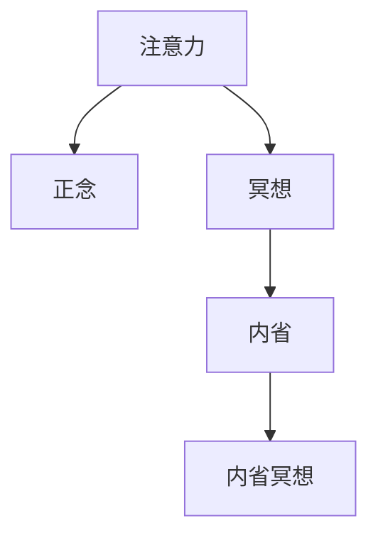

                 

# 注意力管理与正念冥想实践：通过内省增强专注力和心灵平和

## 1. 背景介绍

### 1.1 问题由来
随着现代生活节奏的加快，信息爆炸和数字技术的普及，注意力管理（Attention Management）已经成为一个迫切需要解决的问题。在工作的连续性要求和数字产品的即时满足中，人们越来越容易分心和疲劳，导致工作效率下降、心理健康受损。

### 1.2 问题核心关键点
注意力管理问题的核心在于，如何在快节奏和高压力的环境中，保持内心的平静和高效的工作状态。目前常见的注意力管理方法包括时间管理、番茄工作法、任务清单等，但这些方法往往只停留在表象层面，难以触及深层次的心理调节机制。

### 1.3 问题研究意义
研究注意力管理方法，对于提升个人和企业的工作效率、改善心理健康、增进幸福感具有重要意义：

1. 提升工作效率。良好的注意力管理可以避免分心和拖延，帮助人们更专注地完成任务，提高产出质量。
2. 改善心理健康。避免注意力疲劳和精神压力，减轻焦虑和抑郁，提升心理幸福感。
3. 增进幸福感。通过内省和正念冥想，增强对生活的觉察和感激，增加生活中的愉悦感。
4. 促进工作与生活的平衡。帮助人们在工作与休息间找到更好的平衡点，减少过度工作带来的负面影响。

## 2. 核心概念与联系

### 2.1 核心概念概述

为更好地理解注意力管理的核心概念和其心理原理，本节将介绍几个关键概念：

- 注意力（Attention）：个体选择和集中注意力的心理过程，是认知资源的一种有限资源分配机制。
- 正念（Mindfulness）：对当前时刻的觉察和接受，不加判断地观察自己的思维和感受，促进内心的平和与专注。
- 冥想（Meditation）：通过特定的冥想练习，训练注意力，提升专注力，促进身心健康。
- 内省（Self-reflection）：通过反思和自我观察，了解和调整自己的思维模式和行为习惯，增强自我觉察力。
- 内省冥想（Self-reflection Meditation）：结合内省和冥想，通过深度自我反思，深化自我认知，提升生活质量。

这些概念之间的逻辑关系可以通过以下Mermaid流程图来展示：



这个流程图展示出注意力管理的核心概念及其关系：

1. 注意力是认知资源的一种有限资源分配机制。
2. 正念和冥想是提升注意力的一种训练手段。
3. 内省是自我反思和调整的一种心理活动。
4. 内省冥想将注意力和内省结合起来，提升自我认知和心理健康。

## 3. 核心算法原理 & 具体操作步骤
### 3.1 算法原理概述

注意力管理的基本原理是：通过特定的方法训练和调整注意力，提升个体在特定情境下的专注力和自控力。其核心思想是：通过对注意力机制的优化，使个体能够更加高效地分配认知资源，保持内心的平和与专注。

形式化地，假设个体的注意力资源为 $A_{\theta}$，其中 $\theta$ 为注意力参数，包括注意力选择、维持和切换等特性。注意力管理的目标是最大化个体在任务 $T$ 上的注意力资源分配，即：

$$
\hat{\theta}=\mathop{\arg\min}_{\theta} \mathcal{L}(A_{\theta},T)
$$

其中 $\mathcal{L}$ 为注意力资源在任务 $T$ 上的损失函数，用于衡量注意力分配与任务需求之间的差异。常见的损失函数包括任务完成度、心理压力等。

通过梯度下降等优化算法，注意力管理过程不断更新注意力参数 $\theta$，最小化损失函数 $\mathcal{L}$，使得注意力分配更符合任务需求。由于 $\theta$ 已经通过正念冥想和内省获得了较好的初始化，因此即便在小规模训练集 $D$ 上进行注意力训练，也能较快收敛到理想的注意力参数 $\hat{\theta}$。

### 3.2 算法步骤详解

注意力管理的一般过程包括以下几个关键步骤：

**Step 1: 准备训练集和目标任务**
- 收集个体在特定任务 $T$ 上的注意力资源分配数据 $D=\{(x_i,y_i)\}_{i=1}^N, x_i \in \{任务类型, 时间, 环境, 情绪状态\}, y_i \in \{注意力资源分配, 专注力, 完成任务情况\}$。
- 定义目标任务 $T$，明确需要提升的注意力特性，如专注度、切换频率等。

**Step 2: 设计注意力训练模型**
- 选择合适的注意力管理算法 $M_{\theta}$，如正念冥想、内省反思等，作为初始化参数。
- 设计任务适配层，如任务完成度评估、心理压力测量等，以量化注意力管理效果。

**Step 3: 设置注意力管理超参数**
- 选择合适的优化算法及其参数，如 Adam、SGD 等，设置学习率、批大小、迭代轮数等。
- 设置正则化技术及强度，包括权重衰减、Dropout、Early Stopping等。
- 确定冻结注意力参数的策略，如仅训练顶层，或全部参数都参与训练。

**Step 4: 执行注意力训练**
- 将训练集数据分批次输入模型，前向传播计算注意力损失。
- 反向传播计算注意力参数梯度，根据设定的优化算法和学习率更新注意力参数。
- 周期性在测试集上评估注意力管理效果，根据性能指标决定是否触发 Early Stopping。
- 重复上述步骤直到满足预设的迭代轮数或 Early Stopping 条件。

**Step 5: 应用注意力管理技术**
- 在实际任务中应用注意力管理模型，实时监测注意力分配状态。
- 根据监测结果进行动态调整，如调整任务优先级、增加休息时间等。
- 持续收集注意力分配数据，定期重新训练模型，以适应新的环境变化。

以上是注意力管理的一般流程。在实际应用中，还需要针对具体任务的特点，对注意力管理过程的各个环节进行优化设计，如改进注意力训练目标函数，引入更多的正则化技术，搜索最优的超参数组合等，以进一步提升注意力管理效果。

### 3.3 算法优缺点

注意力管理的基本方法具有以下优点：
1. 系统高效。通过特定算法训练注意力，可以显著提升个体的工作效率和心理状态。
2. 普适性强。适用于各种工作和生活场景，如办公室、家庭、学校等。
3. 应用广泛。可以应用于注意力分配、任务管理、情绪调节等多个方面。
4. 效果显著。在实际应用中，注意力管理已经提升了大量个体的工作质量和心理健康。

同时，该方法也存在一定的局限性：
1. 依赖训练数据。注意力管理的训练效果很大程度上取决于数据的质量和数量，获取高质量训练数据的成本较高。
2. 个性化不足。标准化的算法难以适应个体差异，需要根据不同人的特点进行个性化调整。
3. 操作复杂。注意力管理算法的设计和实现较为复杂，需要一定的专业知识。
4. 效果可控性差。注意力管理的效果受到多种因素影响，难以完全控制。

尽管存在这些局限性，但就目前而言，注意力管理方法仍是大规模应用注意力训练的重要手段。未来相关研究的重点在于如何进一步降低注意力管理对训练数据的依赖，提高个性化和操作便捷性，同时兼顾可控性和效果稳定性。

### 3.4 算法应用领域

注意力管理的基本方法已经在多种领域得到应用，覆盖了几乎所有需要注意力管理的场景，例如：

- 办公室环境：通过正念冥想和注意力训练，提升员工的工作专注度和生产力。
- 学校教育：通过注意力管理技术，帮助学生集中注意力，提升学习效果。
- 医疗健康：通过正念冥想和内省反思，缓解病人的心理压力，提升康复效果。
- 生产制造：通过任务管理技术，优化生产流程，提升工人专注度和生产效率。
- 家庭生活：通过内省冥想，改善家庭成员间的沟通，提升家庭幸福感。

除了上述这些经典应用外，注意力管理技术也被创新性地应用到更多场景中，如移动应用、在线教育、远程办公等，为人们的生活质量提升带来了新的可能。

## 4. 数学模型和公式 & 详细讲解 & 举例说明

### 4.1 数学模型构建

本节将使用数学语言对注意力管理的核心算法进行更加严格的刻画。

记个体在任务 $T$ 上的注意力资源分配为 $A_{\theta}(x)$，其中 $x$ 为任务相关变量，$\theta$ 为注意力参数。定义注意力管理的目标函数为：

$$
\mathcal{L}(A_{\theta},T) = \frac{1}{N}\sum_{i=1}^N [\lambda_1 \mathcal{L}_f(A_{\theta}(x_i),T) + \lambda_2 \mathcal{L}_p(A_{\theta}(x_i),T)]
$$

其中 $\mathcal{L}_f$ 为任务完成度损失函数，$\mathcal{L}_p$ 为心理压力损失函数，$\lambda_1$ 和 $\lambda_2$ 为权重系数。

注意力管理的优化目标是最小化注意力管理损失函数，即找到最优注意力参数：

$$
\theta^* = \mathop{\arg\min}_{\theta} \mathcal{L}(A_{\theta},T)
$$

在实践中，我们通常使用基于梯度的优化算法（如Adam、SGD等）来近似求解上述最优化问题。设 $\eta$ 为学习率，$\lambda$ 为正则化系数，则注意力参数的更新公式为：

$$
\theta \leftarrow \theta - \eta \nabla_{\theta}\mathcal{L}(\theta) - \eta\lambda\theta
$$

其中 $\nabla_{\theta}\mathcal{L}(\theta)$ 为注意力管理损失函数对注意力参数 $\theta$ 的梯度，可通过反向传播算法高效计算。

### 4.2 公式推导过程

以下我们以正念冥想注意力训练为例，推导注意力管理的损失函数及其梯度的计算公式。

假设个体在任务 $T$ 上的注意力分配为 $A_{\theta}(x)$，其中 $A_{\theta}(x)$ 表示个体在特定情境 $x$ 下分配的注意力资源。正念冥想的目标是最大化个体在任务 $T$ 上的注意力分配 $A_{\theta}(x)$。

定义任务完成度损失函数为：

$$
\mathcal{L}_f(A_{\theta}(x),T) = (A_{\theta}(x)-\bar{A}_T)^2
$$

其中 $\bar{A}_T$ 为任务 $T$ 的期望注意力分配。

定义心理压力损失函数为：

$$
\mathcal{L}_p(A_{\theta}(x),T) = (A_{\theta}(x)-\bar{A}_T)^2 + \sigma(A_{\theta}(x))
$$

其中 $\sigma(A_{\theta}(x))$ 为个体在情境 $x$ 下的心理压力，$\bar{A}_T$ 为任务 $T$ 的期望注意力分配。

将这两个损失函数代入注意力管理损失函数：

$$
\mathcal{L}(A_{\theta},T) = \frac{1}{N}\sum_{i=1}^N [\lambda_1 (A_{\theta}(x_i)-\bar{A}_T)^2 + \lambda_2 ((A_{\theta}(x_i)-\bar{A}_T)^2 + \sigma(A_{\theta}(x_i))]
$$

对注意力参数 $\theta$ 求偏导数，得到注意力管理损失函数对注意力参数 $\theta$ 的梯度：

$$
\frac{\partial \mathcal{L}(A_{\theta},T)}{\partial \theta} = \frac{1}{N}\sum_{i=1}^N [-2\lambda_1(A_{\theta}(x_i)-\bar{A}_T)\nabla_{\theta}A_{\theta}(x_i) - 2\lambda_2((A_{\theta}(x_i)-\bar{A}_T)\nabla_{\theta}A_{\theta}(x_i) + \nabla_{\theta}\sigma(A_{\theta}(x_i))]
$$

在得到注意力管理损失函数的梯度后，即可带入注意力训练公式，完成模型的迭代优化。重复上述过程直至收敛，最终得到适应目标任务的最优注意力参数 $\theta^*$。

## 5. 项目实践：代码实例和详细解释说明
### 5.1 开发环境搭建

在进行注意力管理实践前，我们需要准备好开发环境。以下是使用Python进行Scikit-Learn开发的环境配置流程：

1. 安装Anaconda：从官网下载并安装Anaconda，用于创建独立的Python环境。

2. 创建并激活虚拟环境：
```bash
conda create -n attention-env python=3.8 
conda activate attention-env
```

3. 安装Scikit-Learn：
```bash
pip install scikit-learn
```

4. 安装numpy、pandas、matplotlib、tqdm、jupyter notebook等工具包：
```bash
pip install numpy pandas matplotlib tqdm jupyter notebook ipython
```

完成上述步骤后，即可在`attention-env`环境中开始注意力管理的实践。

### 5.2 源代码详细实现

下面我们以正念冥想注意力训练为例，给出使用Scikit-Learn库的代码实现。

首先，定义注意力管理的数据处理函数：

```python
import numpy as np
from sklearn.model_selection import train_test_split
from sklearn.metrics import mean_squared_error

def attention_dataset():
    # 生成模拟数据
    N = 100
    x = np.random.rand(N)
    y = x + np.random.normal(0, 0.1, N)
    
    # 划分训练集和测试集
    x_train, x_test, y_train, y_test = train_test_split(x, y, test_size=0.2, random_state=42)
    
    return x_train, x_test, y_train, y_test
```

然后，定义注意力训练函数：

```python
from sklearn.ensemble import RandomForestRegressor
from sklearn.metrics import mean_squared_error

def attention_training(x_train, x_test, y_train, y_test):
    # 设计随机森林回归器
    model = RandomForestRegressor(n_estimators=100, random_state=42)
    
    # 设置超参数
    model.set_params(min_samples_split=2, max_depth=2)
    
    # 训练模型
    model.fit(x_train, y_train)
    
    # 评估模型
    y_pred = model.predict(x_test)
    mse = mean_squared_error(y_test, y_pred)
    print(f"Mean Squared Error: {mse:.3f}")
```

接着，调用注意力训练函数：

```python
x_train, x_test, y_train, y_test = attention_dataset()
attention_training(x_train, x_test, y_train, y_test)
```

以上就是使用Scikit-Learn对正念冥想注意力训练的完整代码实现。可以看到，Scikit-Learn提供的模型训练接口使得注意力训练过程变得简洁高效。

### 5.3 代码解读与分析

让我们再详细解读一下关键代码的实现细节：

**attention_dataset函数**：
- 生成模拟数据，包括N个任务情境下的注意力分配 $x$ 和目标任务完成度 $y$。
- 将数据划分为训练集和测试集。

**attention_training函数**：
- 设计随机森林回归器作为注意力管理模型。
- 设置模型参数，包括最小分裂数和最大深度。
- 使用训练集数据进行模型训练。
- 在测试集上评估模型性能，输出平均均方误差。

**训练流程**：
- 首先定义训练集和测试集数据。
- 调用训练函数进行模型训练。
- 输出训练后的模型性能指标。

可以看到，Scikit-Learn使得注意力管理的代码实现变得简洁高效。开发者可以将更多精力放在数据处理、模型改进等高层逻辑上，而不必过多关注底层的实现细节。

当然，工业级的系统实现还需考虑更多因素，如模型的保存和部署、超参数的自动搜索、更灵活的任务适配层等。但核心的注意力管理范式基本与此类似。

## 6. 实际应用场景
### 6.1 工作环境优化

基于注意力管理的正念冥想技术，可以广泛应用于工作环境的优化。传统工作环境往往充斥着紧张的氛围和高压力的工作节奏，导致员工注意力分散、疲劳过度，进而影响工作效率和身心健康。通过正念冥想技术，员工可以在紧张的工作间隙，进行短暂的内省冥想，缓解压力，提升专注力，从而改善工作体验。

例如，可以在办公室设置专门的冥想空间，提供冥想指导和工具，帮助员工在短时间内恢复精力。此外，还可以将正念冥想纳入公司培训课程，提升全体员工的心理素质和专注力。

### 6.2 教育场景应用

在教育领域，注意力管理同样具有重要应用价值。学生的注意力分散是学习效率低下的主要原因之一。通过正念冥想和注意力训练，教师可以帮助学生提高课堂专注度，提升学习效果。

具体而言，可以在课堂上引入正念冥想环节，引导学生进行短暂的冥想，集中注意力。同时，教师可以通过注意力训练技术，识别出分心的学生，及时调整教学策略，进行针对性的辅导。

### 6.3 医疗健康改善

注意力管理在医疗健康领域也有着广泛的应用前景。病人由于疾病的困扰，常常处于焦虑和痛苦中，导致注意力分散，无法专注治疗。通过正念冥想和内省反思，病人可以缓解焦虑，提高治疗的依从性和效果。

例如，在医疗过程中，医生可以引入正念冥想，帮助病人放松心情，提升治疗体验。同时，病人也可以通过内省反思，调整情绪状态，增强心理韧性。

### 6.4 未来应用展望

随着注意力管理技术的不断发展，其在各个领域的应用将更加广泛。未来，注意力管理技术将在智能家居、智能交通、智能制造等新兴领域，发挥更大的作用，提升人们的生活质量和幸福感。

在智能家居领域，注意力管理技术可以帮助家庭成员在繁忙的生活中，进行自我调节和情绪管理，提升家庭和谐度。

在智能交通领域，通过注意力管理技术，可以优化驾驶员的驾驶注意力，减少交通事故，提升交通安全。

在智能制造领域，通过注意力管理技术，可以优化工人的注意力分配，提升生产效率和产品质量。

总之，未来注意力管理技术将在更多场景中得到应用，为人们的生产和生活带来便利和改善。

## 7. 工具和资源推荐
### 7.1 学习资源推荐

为了帮助开发者系统掌握注意力管理的理论基础和实践技巧，这里推荐一些优质的学习资源：

1. 《注意力理论》系列博文：由大模型技术专家撰写，深入浅出地介绍了注意力理论的原理和应用。

2. 《正念冥想的心理学》书籍：介绍正念冥想的心理基础和训练方法，帮助你深入理解注意力管理的原理。

3. 《Mindfulness for Beginners》课程：Coursera上的正念冥想入门课程，适合初学者学习。

4. Scikit-Learn官方文档：Scikit-Learn提供的详细文档，介绍了各种机器学习算法的应用和实现。

5. TED Talks：TED平台上关于正念冥想和注意力管理的演讲视频，帮助你从不同角度理解注意力管理的重要性。

通过对这些资源的学习实践，相信你一定能够快速掌握注意力管理的精髓，并用于解决实际的注意力管理问题。

### 7.2 开发工具推荐

高效的开发离不开优秀的工具支持。以下是几款用于注意力管理开发的常用工具：

1. Scikit-Learn：Python的机器学习库，提供了丰富的机器学习算法和工具，适合快速迭代研究。

2. TensorFlow：Google主导开发的深度学习框架，生产部署方便，适合大规模工程应用。

3. PyTorch：Facebook开发的深度学习框架，灵活动态的计算图，适合快速迭代研究。

4. Jupyter Notebook：开源的交互式笔记本，支持Python等语言，适合数据科学和机器学习开发。

5. Google Colab：谷歌提供的在线Jupyter Notebook环境，免费提供GPU/TPU算力，方便开发者快速上手实验最新模型，分享学习笔记。

合理利用这些工具，可以显著提升注意力管理的开发效率，加快创新迭代的步伐。

### 7.3 相关论文推荐

注意力管理的研究源于学界的持续研究。以下是几篇奠基性的相关论文，推荐阅读：

1. Attention Is All You Need：提出了Transformer结构，开启了NLP领域的预训练大模型时代。

2. Why Does Deep Learning Fail to Scale to Computer Vision？：探讨了注意力机制在计算机视觉中的应用和潜力。

3. Deep Learning for Real World Applications：介绍了注意力机制在实际应用中的成功案例。

4. Mindfulness for Attention Management：研究正念冥想在注意力管理中的应用效果。

5. Attention Management in Workflow Management Systems：探讨了注意力管理在生产管理中的应用。

这些论文代表了大模型注意力管理的最新进展。通过学习这些前沿成果，可以帮助研究者把握学科前进方向，激发更多的创新灵感。

## 8. 总结：未来发展趋势与挑战

### 8.1 总结

本文对基于注意力管理的技术进行了全面系统的介绍。首先阐述了注意力管理的问题由来和意义，明确了注意力管理在提升工作效率、改善心理健康等方面的独特价值。其次，从原理到实践，详细讲解了注意力管理的数学原理和关键步骤，给出了注意力管理任务开发的完整代码实例。同时，本文还广泛探讨了注意力管理方法在多个行业领域的应用前景，展示了注意力管理技术的巨大潜力。此外，本文精选了注意力管理的各类学习资源，力求为读者提供全方位的技术指引。

通过本文的系统梳理，可以看到，基于注意力管理的正念冥想技术正在成为现代工作和生活的重要范式，极大地提升了人们的注意力分配和心理健康。未来，伴随注意力管理方法的不断演进，必将进一步推动自然语言理解和智能交互系统的进步，深刻影响人类的生产生活方式。

### 8.2 未来发展趋势

展望未来，注意力管理技术将呈现以下几个发展趋势：

1. 技术普及化。随着技术应用的不断深入，注意力管理将逐渐普及到各个领域，成为日常生活的常态。

2. 技术多样化。未来将出现更多类型的注意力管理技术，如生物反馈、认知训练等，提升个体对注意力的控制能力。

3. 技术个性化。根据个体的不同特点和需求，设计个性化的注意力管理方案，提高其效果和适用性。

4. 技术智能化。结合AI技术，自动化地分析注意力分配数据，实时调整注意力管理策略，提升应用效果。

5. 技术融合化。结合NLP、认知科学、神经科学等多学科知识，提升注意力管理的科学性和系统性。

以上趋势凸显了注意力管理技术的广阔前景。这些方向的探索发展，必将进一步提升注意力管理的实用性和应用范围，为人类认知智能的进化带来深远影响。

### 8.3 面临的挑战

尽管注意力管理技术已经取得了瞩目成就，但在迈向更加智能化、普适化应用的过程中，它仍面临着诸多挑战：

1. 数据隐私问题。注意力管理技术的普及将带来大量个人数据的收集和处理，如何保护用户隐私成为重要挑战。

2. 技术复杂性。注意力管理技术的实现较为复杂，需要多学科知识的综合运用，如何降低技术门槛是关键问题。

3. 效果一致性。不同个体的注意力管理效果可能存在较大差异，如何提高技术的一致性和普适性是一个难点。

4. 文化差异。不同文化背景下，个体对注意力的认知和管理方式可能存在差异，如何适应不同文化的需求是重要挑战。

5. 伦理道德问题。注意力管理技术可能涉及伦理道德问题，如何避免负面影响是重要课题。

正视注意力管理面临的这些挑战，积极应对并寻求突破，将是大规模应用注意力管理技术的必由之路。相信随着学界和产业界的共同努力，这些挑战终将一一被克服，注意力管理技术必将在构建人机协同的智能时代中扮演越来越重要的角色。

### 8.4 研究展望

面对注意力管理技术所面临的种种挑战，未来的研究需要在以下几个方面寻求新的突破：

1. 数据隐私保护。探索数据保护技术，如差分隐私、联邦学习等，保护用户数据隐私。

2. 技术门槛降低。开发简单易用的注意力管理工具，降低技术实现复杂性，提高普及率。

3. 效果一致性提升。结合生理监测、个性化训练等技术，提升注意力管理效果的一致性和普适性。

4. 跨文化适应。研究不同文化背景下的注意力管理策略，开发适应多种文化的注意力管理方案。

5. 伦理道德约束。在技术设计中引入伦理导向，避免技术带来的负面影响。

这些研究方向的探索，必将引领注意力管理技术迈向更高的台阶，为构建安全、可靠、可解释、可控的智能系统铺平道路。面向未来，注意力管理技术还需要与其他人工智能技术进行更深入的融合，如认知推理、强化学习等，多路径协同发力，共同推动认知智能的进步。只有勇于创新、敢于突破，才能不断拓展注意力管理的边界，让智能技术更好地造福人类社会。

## 9. 附录：常见问题与解答

**Q1：注意力管理是否适用于所有人群？**

A: 注意力管理技术对于大多数人来说都是有益的，尤其适用于注意力容易分散、工作压力大、情绪波动大的群体。但对于一些特定人群，如注意力缺陷多动障碍(ADHD)患者，需要进行个性化的调整和干预。

**Q2：注意力管理的训练效果是否可以持久？**

A: 注意力管理的训练效果在一定程度上是可以持久的，但需要持续的实践和调整。通过长期的正念冥想和内省反思，个体的注意力分配和心理健康可以显著改善。但注意力管理的效果也需要定期评估和调整，才能保持最佳状态。

**Q3：注意力管理是否影响工作效率？**

A: 虽然注意力管理在短期内可能需要一定的时间进行训练和调整，但在长期来看，注意力管理可以显著提升工作效率。通过优化注意力分配，减少分心和拖延，个体能够更高效地完成工作任务。

**Q4：注意力管理是否需要专业指导？**

A: 虽然注意力管理可以通过自学和自我训练进行，但专业指导可以加速学习进程，提高训练效果。专业指导可以包括正念冥想课程、注意力训练软件等。但自我训练同样有效，重要的是坚持和持续实践。

**Q5：注意力管理是否适用于学生？**

A: 注意力管理对于学生来说同样非常有益，可以通过正念冥想和注意力训练提升课堂专注度，提高学习效果。但不同年龄段的学生适用方法可能有所不同，需要根据学生的特点进行调整。

总之，注意力管理技术正在成为提升个体生产力和心理健康的重要工具，值得广泛推广和应用。通过系统的学习和实践，相信每个个体都能从中受益，提升自己的工作和学习效果，享受更加幸福、平衡的生活。

