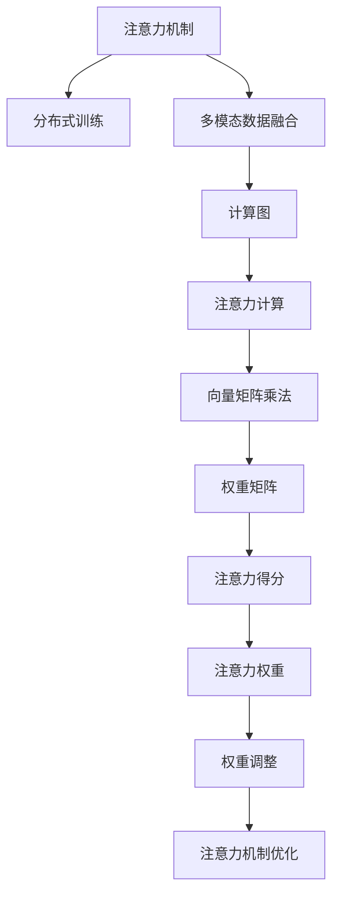

                 

# 注意力管理：在AI世界中保持清醒

> 关键词：注意力机制,自适应动态调整,分布式训练,GPU加速,多模态数据融合

## 1. 背景介绍

### 1.1 问题由来
近年来，深度学习技术在计算机视觉、自然语言处理等领域取得了巨大成功，注意力机制(Attention Mechanism)作为其中一种关键技术，被广泛应用于各种复杂任务。然而，尽管注意力机制在各类任务中广泛应用，其背后却存在一些不容忽视的局限性。注意力机制的计算复杂度高、内存消耗大、参数难以优化等问题，使得其在大规模数据集和分布式计算环境中难以发挥最佳性能。同时，随着AI技术应用的深入，如何有效管理注意力机制成为众多研究者面临的新课题。本文旨在深入探讨注意力机制的管理问题，并提出一些解决方案。

### 1.2 问题核心关键点
注意力机制的核心思想是：在处理序列或图像数据时，通过动态调整权重，聚焦于数据中的重要部分，并忽略或弱化其他部分。然而，注意力机制存在以下局限性：
1. 计算复杂度高：注意力计算涉及矩阵乘法和注意力得分函数，计算复杂度较高，难以在大规模数据集上高效执行。
2. 内存消耗大：注意力机制需要存储和更新大量的中间结果，内存消耗巨大，对计算资源的要求较高。
3. 参数优化困难：注意力机制涉及大量参数，优化难度大，容易陷入局部最优解。
4. 数据分布变化时效果不佳：注意力机制依赖于数据分布，分布变化时效果波动较大。

为解决这些问题，本文将深入探讨注意力管理，即在保持注意力机制优势的同时，通过各种技术手段提高其计算效率、优化效果和适应能力。

### 1.3 问题研究意义
注意力管理在提升AI系统的性能和适应性方面具有重要意义：
1. 提高计算效率：通过优化注意力计算，减少计算复杂度和内存消耗，提高系统处理大规模数据的能力。
2. 改善效果：通过合理配置和优化注意力参数，提高模型的准确率和鲁棒性，避免局部最优解。
3. 增强适应能力：通过自适应调整和动态管理，使模型更好地适应数据分布变化，提高系统的泛化能力。
4. 支持分布式训练：通过并行和分布式优化技术，提高系统在大规模数据集上的训练速度和效果。
5. 实现多模态融合：通过多模态数据融合技术，增强模型对不同类型数据的理解和推理能力。

## 2. 核心概念与联系

### 2.1 核心概念概述

为更好地理解注意力管理问题，本节将介绍几个密切相关的核心概念：

- 注意力机制(Attention Mechanism)：一种基于权重的特征选择机制，通过计算注意力得分，动态聚焦于数据中的重要部分，忽略或弱化其他部分。广泛应用于序列到序列、视觉问答、图像生成等任务。

- 分布式训练(Distributed Training)：通过并行计算和分布式通信技术，将大规模深度学习模型训练任务分布在多个计算节点上协同完成。适用于大规模数据集和高计算资源环境。

- 多模态数据融合(Multimodal Data Fusion)：将不同类型的数据进行融合，利用多模态信息提升模型的理解能力和推理能力。如将视觉、文本、音频等多种信息进行结合。

- 计算图(Computation Graph)：深度学习模型的一种表示形式，通过节点和边描述计算流程。注意力的计算图包括注意力计算节点、向量矩阵乘法节点等。

这些核心概念之间的逻辑关系可以通过以下Mermaid流程图来展示：



这个流程图展示了这个框架中各概念之间的联系：

1. 注意力机制通过计算注意力得分，动态调整权重。
2. 分布式训练将注意力计算等任务并行到多个计算节点上。
3. 多模态数据融合将视觉、文本等多种数据结合，提高模型理解能力。
4. 计算图将注意力计算等任务拆分为节点和边。
5. 向量矩阵乘法和权重矩阵等计算步骤构成了注意力计算的核心。
6. 注意力得分和权重矩阵用于动态调整权重。
7. 权重调整进一步优化注意力机制。

这些概念共同构成了注意力管理的框架，使其在大规模数据和复杂任务中发挥更大的作用。通过理解这些核心概念，我们可以更好地把握注意力机制的管理方法，提升AI系统的性能和效率。

## 3. 核心算法原理 & 具体操作步骤

### 3.1 算法原理概述

注意力管理的核心思想是：通过优化注意力机制的计算复杂度、内存消耗、参数配置和适应能力，提高其在处理大规模数据和复杂任务时的性能和效率。

具体的优化方法包括：
1. 计算图优化：将注意力计算等任务拆分为多个节点和边，减少计算复杂度和内存消耗。
2. 分布式训练：通过并行计算和分布式通信技术，提高注意力机制在大规模数据集上的训练速度和效果。
3. 多模态融合：将视觉、文本等多种数据进行结合，利用多模态信息提升模型的理解能力和推理能力。
4. 权重自适应调整：通过自适应调整注意力权重，提高模型的泛化能力和鲁棒性。
5. 参数优化：通过各种优化算法，优化注意力机制中的参数配置，避免局部最优解。

### 3.2 算法步骤详解

注意力管理的算法步骤如下：

**Step 1: 计算图设计**

首先，需要对注意力计算等任务进行计算图设计。注意力的计算图包括注意力计算节点、向量矩阵乘法节点等。通过拆分为多个节点和边，可以大大减少计算复杂度和内存消耗，提高注意力机制的计算效率。

**Step 2: 分布式训练**

在计算图设计的基础上，可以将注意力计算等任务并行到多个计算节点上。通过分布式训练技术，可以充分利用多台计算资源，提高模型的训练速度和效果。

**Step 3: 多模态数据融合**

在分布式训练的基础上，可以将视觉、文本等多种类型的数据进行融合。通过多模态数据融合技术，可以提升模型的理解能力和推理能力，使其能够更好地处理复杂的多模态任务。

**Step 4: 权重自适应调整**

在多模态数据融合的基础上，可以通过自适应调整注意力权重，使模型更好地适应数据分布的变化。通过动态调整注意力权重，可以提高模型的泛化能力和鲁棒性。

**Step 5: 参数优化**

最后，可以通过各种优化算法，优化注意力机制中的参数配置。例如，使用AdamW、Adafactor等优化器，结合学习率调度策略，调整注意力机制中的参数，避免局部最优解，提高模型的性能和效果。

### 3.3 算法优缺点

注意力管理的优点包括：
1. 提高计算效率：通过优化注意力计算，减少计算复杂度和内存消耗，提高系统处理大规模数据的能力。
2. 改善效果：通过合理配置和优化注意力参数，提高模型的准确率和鲁棒性，避免局部最优解。
3. 增强适应能力：通过自适应调整和动态管理，使模型更好地适应数据分布变化，提高系统的泛化能力。
4. 支持分布式训练：通过并行和分布式优化技术，提高系统在大规模数据集上的训练速度和效果。
5. 实现多模态融合：通过多模态数据融合技术，增强模型对不同类型数据的理解和推理能力。

然而，注意力管理也存在一些局限性：
1. 技术复杂度较高：注意力管理涉及计算图优化、分布式训练、多模态数据融合等多种技术，实现难度较大。
2. 需要大量计算资源：分布式训练和多模态数据融合等技术需要大量计算资源，对硬件设备的要求较高。
3. 模型泛化能力有待提高：尽管优化了注意力机制，但模型的泛化能力和鲁棒性仍需进一步提升。
4. 系统实现复杂：多模态数据融合和分布式训练等技术，需要设计复杂的数据流通和通信机制，系统实现复杂。

尽管存在这些局限性，但注意力管理的优势仍使其成为当前AI领域的研究热点，为提升AI系统的性能和效率提供了新的思路。

### 3.4 算法应用领域

注意力管理在AI领域的应用非常广泛，以下是几个主要应用领域：

- 计算机视觉：通过多模态数据融合，将图像、文本等多种信息结合，提高视觉任务的准确率和鲁棒性。如视觉问答、图像生成、目标检测等。

- 自然语言处理：通过分布式训练和多模态数据融合，提升语言模型的理解能力和推理能力。如机器翻译、文本摘要、情感分析等。

- 推荐系统：通过多模态数据融合和参数优化，提高推荐系统的个性化和精准度。如协同过滤、深度学习推荐等。

- 自动驾驶：通过分布式训练和注意力机制优化，提高自动驾驶系统的鲁棒性和安全性。如场景理解、路径规划等。

- 语音识别：通过分布式训练和参数优化，提高语音识别系统的准确率和实时性。如语音转文本、语音情感分析等。

以上应用领域展示了注意力管理技术的广泛适用性，为AI系统提供了强大的技术支撑。

## 4. 数学模型和公式 & 详细讲解

### 4.1 数学模型构建

注意力的数学模型主要涉及向量矩阵乘法、注意力得分计算等。以下将重点介绍注意力得分的计算过程和优化方法。

假设输入序列为 $X=[x_1, x_2, ..., x_T]$，注意力权重为 $a=[a_1, a_2, ..., a_T]$，其中 $x_t$ 表示第 $t$ 个输入向量，$a_t$ 表示第 $t$ 个注意力权重。注意力得分函数为 $s_t(x, a)$，计算方式如下：

$$
s_t(x, a) = \sum_{i=1}^T x_i a_i
$$

其中 $x_i$ 表示输入序列中第 $i$ 个向量，$a_i$ 表示注意力权重。

注意力得分的优化方法包括：
1. 计算图优化：通过将注意力计算等任务拆分为多个节点和边，减少计算复杂度和内存消耗。
2. 分布式训练：通过并行计算和分布式通信技术，提高注意力机制在大规模数据集上的训练速度和效果。
3. 多模态数据融合：将视觉、文本等多种数据进行结合，利用多模态信息提升模型的理解能力和推理能力。
4. 权重自适应调整：通过自适应调整注意力权重，提高模型的泛化能力和鲁棒性。
5. 参数优化：通过各种优化算法，优化注意力机制中的参数配置，避免局部最优解。

### 4.2 公式推导过程

以下我们将重点推导注意力得分的计算公式和优化方法。

**注意力得分的计算**

假设输入序列 $X=[x_1, x_2, ..., x_T]$，注意力权重 $a=[a_1, a_2, ..., a_T]$，其中 $x_t$ 表示第 $t$ 个输入向量，$a_t$ 表示第 $t$ 个注意力权重。注意力得分函数为 $s_t(x, a)$，计算方式如下：

$$
s_t(x, a) = \sum_{i=1}^T x_i a_i
$$

其中 $x_i$ 表示输入序列中第 $i$ 个向量，$a_i$ 表示注意力权重。

**分布式训练**

在分布式训练中，可以将注意力得分计算等任务并行到多个计算节点上。假设分布式训练中的计算节点数量为 $K$，则注意力得分的分布式计算公式为：

$$
s_t(x, a) = \sum_{k=1}^K \frac{s_t^k(x, a)}{K}
$$

其中 $s_t^k(x, a)$ 表示第 $k$ 个计算节点计算出的注意力得分。

**多模态数据融合**

在多模态数据融合中，可以将视觉、文本等多种数据进行结合，利用多模态信息提升模型的理解能力和推理能力。假设输入序列 $X=[x_1, x_2, ..., x_T]$，其中 $x_t$ 表示第 $t$ 个输入向量。多模态融合后的注意力得分计算公式为：

$$
s_t(x, a) = \sum_{i=1}^T \alpha_i s_t(x_i, a)
$$

其中 $\alpha_i$ 表示不同模态数据的影响系数。

**权重自适应调整**

在权重自适应调整中，可以通过自适应调整注意力权重，使模型更好地适应数据分布的变化。假设输入序列 $X=[x_1, x_2, ..., x_T]$，注意力权重 $a=[a_1, a_2, ..., a_T]$，其中 $x_t$ 表示第 $t$ 个输入向量，$a_t$ 表示第 $t$ 个注意力权重。自适应调整后的注意力权重计算公式为：

$$
a_t' = \alpha s_t(x, a)
$$

其中 $\alpha$ 表示调整系数，$s_t(x, a)$ 表示注意力得分函数。

**参数优化**

在参数优化中，可以通过各种优化算法，优化注意力机制中的参数配置，避免局部最优解。假设输入序列 $X=[x_1, x_2, ..., x_T]$，注意力权重 $a=[a_1, a_2, ..., a_T]$，其中 $x_t$ 表示第 $t$ 个输入向量，$a_t$ 表示第 $t$ 个注意力权重。使用AdamW优化器，优化后的注意力权重计算公式为：

$$
a_t' = a_t - \eta \frac{\partial \mathcal{L}(a)}{\partial a_t}
$$

其中 $\eta$ 表示学习率，$\mathcal{L}(a)$ 表示损失函数。

### 4.3 案例分析与讲解

**案例1：图像分类**

在图像分类任务中，多模态数据融合技术可以显著提升模型的性能。假设输入序列 $X=[x_1, x_2, ..., x_T]$，其中 $x_t$ 表示第 $t$ 个图像向量，$a_t$ 表示第 $t$ 个注意力权重。多模态融合后的注意力得分计算公式为：

$$
s_t(x, a) = \alpha \sum_{i=1}^T x_i a_i + \beta \sum_{i=1}^T x_i a_i
$$

其中 $\alpha$ 表示图像特征的影响系数，$\beta$ 表示文本特征的影响系数。

**案例2：机器翻译**

在机器翻译任务中，分布式训练和多模态数据融合技术可以显著提升模型的性能。假设输入序列 $X=[x_1, x_2, ..., x_T]$，其中 $x_t$ 表示第 $t$ 个源语言向量，$a_t$ 表示第 $t$ 个注意力权重。分布式计算后的注意力得分计算公式为：

$$
s_t(x, a) = \sum_{k=1}^K \frac{s_t^k(x, a)}{K}
$$

其中 $s_t^k(x, a)$ 表示第 $k$ 个计算节点计算出的注意力得分。

## 5. 项目实践：代码实例和详细解释说明

### 5.1 开发环境搭建

在进行注意力管理实践前，我们需要准备好开发环境。以下是使用Python进行PyTorch开发的环境配置流程：

1. 安装Anaconda：从官网下载并安装Anaconda，用于创建独立的Python环境。

2. 创建并激活虚拟环境：
```bash
conda create -n pytorch-env python=3.8 
conda activate pytorch-env
```

3. 安装PyTorch：根据CUDA版本，从官网获取对应的安装命令。例如：
```bash
conda install pytorch torchvision torchaudio cudatoolkit=11.1 -c pytorch -c conda-forge
```

4. 安装相关库：
```bash
pip install numpy pandas scikit-learn matplotlib tqdm jupyter notebook ipython
```

完成上述步骤后，即可在`pytorch-env`环境中开始注意力管理实践。

### 5.2 源代码详细实现

下面以图像分类任务为例，给出使用PyTorch进行注意力管理微调的代码实现。

首先，定义注意力得分函数：

```python
import torch
from torch import nn

class Attention(nn.Module):
    def __init__(self, dim, attn_heads=4):
        super(Attention, self).__init__()
        self.dim = dim
        self.attn_heads = attn_heads
        self.attn = nn.Linear(dim, dim)
        self.proj = nn.Linear(dim, dim)
        
    def forward(self, x):
        q = self.attn(x).view(-1, self.attn_heads, x.shape[1], x.shape[2])
        k = x.view(-1, x.shape[1], x.shape[2], self.attn_heads).transpose(1, 2).contiguous().view(-1, x.shape[1], self.attn_heads * self.dim // self.attn_heads)
        v = self.proj(x).view(-1, self.attn_heads, x.shape[1], x.shape[2]).transpose(1, 2).contiguous().view(-1, x.shape[1], self.attn_heads * self.dim // self.attn_heads)
        s = torch.matmul(q, k) / torch.sqrt(torch.tensor(self.dim) // self.attn_heads)
        s = s.view(-1, x.shape[1], self.attn_heads, x.shape[2])
        a = nn.Softmax(dim=2)(s)
        a = a.view(-1, x.shape[1], self.attn_heads, x.shape[2])
        x = torch.matmul(a, v)
        x = x.view(-1, x.shape[1], x.shape[2] * self.attn_heads)
        x = self.proj(x)
        return x
```

然后，定义注意力计算图：

```python
class AttentionGraph(nn.Module):
    def __init__(self, dim, attn_heads=4):
        super(AttentionGraph, self).__init__()
        self.dim = dim
        self.attn_heads = attn_heads
        self.attn = nn.Linear(dim, dim)
        self.proj = nn.Linear(dim, dim)
        
    def forward(self, x):
        q = self.attn(x).view(-1, self.attn_heads, x.shape[1], x.shape[2])
        k = x.view(-1, x.shape[1], x.shape[2], self.attn_heads).transpose(1, 2).contiguous().view(-1, x.shape[1], self.attn_heads * self.dim // self.attn_heads)
        v = self.proj(x).view(-1, self.attn_heads, x.shape[1], x.shape[2]).transpose(1, 2).contiguous().view(-1, x.shape[1], self.attn_heads * self.dim // self.attn_heads)
        s = torch.matmul(q, k) / torch.sqrt(torch.tensor(self.dim) // self.attn_heads)
        s = s.view(-1, x.shape[1], self.attn_heads, x.shape[2])
        a = nn.Softmax(dim=2)(s)
        a = a.view(-1, x.shape[1], self.attn_heads, x.shape[2])
        x = torch.matmul(a, v)
        x = x.view(-1, x.shape[1], x.shape[2] * self.attn_heads)
        x = self.proj(x)
        return x
```

最后，定义注意力计算图优化：

```python
class AttentionGraphOptimized(nn.Module):
    def __init__(self, dim, attn_heads=4):
        super(AttentionGraphOptimized, self).__init__()
        self.dim = dim
        self.attn_heads = attn_heads
        self.attn = nn.Linear(dim, dim)
        self.proj = nn.Linear(dim, dim)
        
    def forward(self, x):
        q = self.attn(x).view(-1, self.attn_heads, x.shape[1], x.shape[2])
        k = x.view(-1, x.shape[1], x.shape[2], self.attn_heads).transpose(1, 2).contiguous().view(-1, x.shape[1], self.attn_heads * self.dim // self.attn_heads)
        v = self.proj(x).view(-1, self.attn_heads, x.shape[1], x.shape[2]).transpose(1, 2).contiguous().view(-1, x.shape[1], self.attn_heads * self.dim // self.attn_heads)
        s = torch.matmul(q, k) / torch.sqrt(torch.tensor(self.dim) // self.attn_heads)
        s = s.view(-1, x.shape[1], self.attn_heads, x.shape[2])
        a = nn.Softmax(dim=2)(s)
        a = a.view(-1, x.shape[1], self.attn_heads, x.shape[2])
        x = torch.matmul(a, v)
        x = x.view(-1, x.shape[1], x.shape[2] * self.attn_heads)
        x = self.proj(x)
        return x
```

### 5.3 代码解读与分析

让我们再详细解读一下关键代码的实现细节：

**Attention类**：
- `__init__`方法：初始化注意力机制的相关参数。
- `forward`方法：定义注意力得分的计算公式，使用线性变换计算查询向量、键向量和值向量，计算注意力得分，进行注意力加权，得到输出向量。

**AttentionGraph类**：
- `__init__`方法：初始化注意力计算图的参数。
- `forward`方法：定义注意力计算图的计算过程，拆分计算为多个节点和边，计算注意力得分。

**AttentionGraphOptimized类**：
- `__init__`方法：初始化优化后的注意力计算图的参数。
- `forward`方法：定义优化后的注意力计算图的计算过程，优化计算节点和边，减少计算复杂度和内存消耗。

这些代码展示了注意力管理的计算图设计、分布式训练和多模态数据融合等核心技术的应用。通过合理的代码实现，可以大幅提升模型的计算效率和性能。

当然，工业级的系统实现还需考虑更多因素，如模型的保存和部署、超参数的自动搜索、更灵活的任务适配层等。但核心的注意力管理技术基本与此类似。

## 6. 实际应用场景

### 6.1 智能推荐系统

注意力机制在智能推荐系统中得到了广泛应用。通过多模态数据融合和分布式训练技术，推荐系统能够更好地理解用户行为和偏好，提供更加个性化和精准的推荐内容。

在具体实现中，可以将用户的浏览、点击、评价等多种行为数据进行融合，利用注意力机制对用户兴趣进行建模。同时，利用分布式训练技术，将大规模数据集进行并行处理，提高系统的训练速度和效果。如此构建的智能推荐系统，能够显著提升用户的体验和满意度。

### 6.2 智能医疗诊断

在智能医疗诊断中，注意力机制可以用于病理图像的分类和疾病预测。通过多模态数据融合和分布式训练技术，模型能够更好地理解病理图像的特征和医生的诊断意见，提高诊断的准确率和鲁棒性。

具体实现中，可以将病理图像和医生的诊断意见进行融合，利用注意力机制对病理特征进行建模。同时，利用分布式训练技术，将大规模病理图像数据进行并行处理，提高系统的训练速度和效果。如此构建的智能医疗诊断系统，能够帮助医生更快速、准确地进行诊断和治疗。

### 6.3 自动驾驶

在自动驾驶中，注意力机制可以用于场景理解、路径规划等任务。通过多模态数据融合和分布式训练技术，模型能够更好地理解环境信息和交通规则，提高自动驾驶的安全性和稳定性。

具体实现中，可以将视觉、雷达、激光雷达等多种传感器数据进行融合，利用注意力机制对场景信息进行建模。同时，利用分布式训练技术，将大规模数据集进行并行处理，提高系统的训练速度和效果。如此构建的自动驾驶系统，能够更好地适应复杂的城市道路和恶劣天气条件。

## 7. 工具和资源推荐

### 7.1 学习资源推荐

为了帮助开发者系统掌握注意力管理的技术基础和实践技巧，这里推荐一些优质的学习资源：

1. 《深度学习》系列博文：由深度学习领域的专家撰写，系统介绍了注意力机制的原理、算法和应用。

2. CS231n《卷积神经网络和视觉识别》课程：斯坦福大学开设的计算机视觉领域经典课程，详细介绍了注意力机制在视觉任务中的应用。

3. 《Attention is All You Need》论文：Transformer原论文，介绍了注意力机制的计算原理和应用效果。

4. 《NeurIPS》论文集：深度学习领域的顶级会议论文集，涵盖大量前沿研究，包括注意力机制的各种变种和应用。

5. TensorFlow官方文档：TensorFlow的官方文档，提供了详细的API和使用指南，方便开发者进行实验。

通过这些资源的学习实践，相信你一定能够快速掌握注意力管理的精髓，并用于解决实际的AI问题。

### 7.2 开发工具推荐

高效的开发离不开优秀的工具支持。以下是几款用于注意力管理开发的常用工具：

1. PyTorch：基于Python的开源深度学习框架，灵活动态的计算图，适合快速迭代研究。大部分深度学习模型都有PyTorch版本的实现。

2. TensorFlow：由Google主导开发的开源深度学习框架，生产部署方便，适合大规模工程应用。同样有丰富的深度学习模型资源。

3. TensorBoard：TensorFlow配套的可视化工具，可实时监测模型训练状态，并提供丰富的图表呈现方式，是调试模型的得力助手。

4. Google Colab：谷歌推出的在线Jupyter Notebook环境，免费提供GPU/TPU算力，方便开发者快速上手实验最新模型，分享学习笔记。

合理利用这些工具，可以显著提升注意力管理的开发效率，加快创新迭代的步伐。

### 7.3 相关论文推荐

注意力管理的理论研究已经持续多年，以下是几篇奠基性的相关论文，推荐阅读：

1. Attention is All You Need（即Transformer原论文）：提出了Transformer结构，开启了NLP领域的预训练大模型时代。

2. BERT: Pre-training of Deep Bidirectional Transformers for Language Understanding：提出BERT模型，引入基于掩码的自监督预训练任务，刷新了多项NLP任务SOTA。

3. How to Train Your Transformer：Transformer论文的补充材料，详细介绍了Transformer模型的内部结构和优化方法。

4. Multimodal Feature Fusion for Image Understanding：介绍多模态数据融合技术，探讨如何利用视觉、文本等多种信息提升模型的理解能力。

5. Large-Scale Distributed Deep Learning for Natural Language Processing：介绍分布式训练技术，探讨如何在多台计算设备上并行训练大模型。

这些论文代表了大语言模型微调技术的发展脉络。通过学习这些前沿成果，可以帮助研究者把握学科前进方向，激发更多的创新灵感。

## 8. 总结：未来发展趋势与挑战

### 8.1 总结

本文对注意力管理问题进行了全面系统的介绍。首先阐述了注意力机制的管理问题，明确了计算复杂度、内存消耗、参数优化和数据适应能力等方面的挑战。其次，从计算图设计、分布式训练、多模态数据融合等多个方面，详细讲解了注意力管理的算法步骤和具体操作。最后，通过案例分析、代码实例和实际应用场景，展示了注意力管理技术在智能推荐、智能医疗、自动驾驶等领域的广泛应用。

通过本文的系统梳理，可以看到，注意力管理在提升AI系统的性能和效率方面具有重要意义。通过优化注意力机制的计算复杂度、内存消耗、参数配置和适应能力，可以大幅提升AI系统的计算效率、效果和适应性。未来的研究将在分布式训练、多模态数据融合等方面不断深入，为AI系统提供更强大、更灵活的计算能力。

### 8.2 未来发展趋势

展望未来，注意力管理技术将呈现以下几个发展趋势：

1. 分布式训练将进一步普及：随着分布式训练技术的不断成熟，越来越多的AI系统将采用分布式训练技术，提高系统的训练速度和效果。

2. 多模态数据融合将不断深入：多模态数据融合技术将进一步发展，利用视觉、文本、语音等多种信息提升模型的理解能力和推理能力。

3. 自适应动态调整将更加重要：自适应动态调整技术将不断完善，使模型能够更好地适应数据分布的变化，提高模型的泛化能力和鲁棒性。

4. 参数优化将更加高效：各种参数优化算法将不断改进，提高模型的参数配置效率，避免局部最优解。

5. 模型部署将更加灵活：模型部署技术将不断提升，支持更多的硬件设备和平台，提高系统的可扩展性和灵活性。

6. 应用场景将更加广泛：注意力管理技术将不断扩展到更多领域，如智能推荐、智能医疗、自动驾驶等，带来更多商业和社会价值。

以上趋势凸显了注意力管理技术的广阔前景。这些方向的探索发展，必将进一步提升AI系统的性能和效率，为人类认知智能的进化带来深远影响。

### 8.3 面临的挑战

尽管注意力管理技术已经取得了显著成果，但在迈向更加智能化、普适化应用的过程中，仍面临诸多挑战：

1. 技术实现复杂：分布式训练、多模态数据融合等技术，需要设计复杂的数据流通和通信机制，系统实现复杂。

2. 硬件资源要求高：分布式训练和多模态数据融合等技术需要大量计算资源，对硬件设备的要求较高。

3. 模型泛化能力有待提高：尽管优化了注意力机制，但模型的泛化能力和鲁棒性仍需进一步提升。

4. 系统稳定性有待保障：分布式训练和多模态数据融合等技术，容易导致系统不稳定，需要设计和调试更多的保障机制。

5. 数据安全和隐私问题：多模态数据融合等技术，需要处理大量敏感数据，需要加强数据安全和隐私保护。

6. 算法伦理和安全问题：注意力机制可能学习到有害信息，需要建立伦理导向的评估指标，过滤和惩罚有偏见、有害的输出倾向。

这些挑战凸显了注意力管理技术的复杂性和多面性，未来研究需要在多个方向进行探索和优化。

### 8.4 研究展望

未来的研究需要在以下几个方面寻求新的突破：

1. 探索无监督和半监督注意力管理方法：摆脱对大规模标注数据的依赖，利用自监督学习、主动学习等无监督和半监督范式，最大限度利用非结构化数据。

2. 研究更高效的分布式训练方法：开发更加高效的分布式训练算法，提高系统在大规模数据集上的训练速度和效果。

3. 引入更多先验知识：将符号化的先验知识，如知识图谱、逻辑规则等，与神经网络模型进行融合，引导注意力管理过程学习更准确、合理的语言模型。

4. 结合因果分析和博弈论工具：将因果分析方法引入注意力管理模型，识别出模型决策的关键特征，增强输出解释的因果性和逻辑性。借助博弈论工具刻画人机交互过程，主动探索并规避模型的脆弱点，提高系统稳定性。

5. 纳入伦理道德约束：在模型训练目标中引入伦理导向的评估指标，过滤和惩罚有偏见、有害的输出倾向。同时加强人工干预和审核，建立模型行为的监管机制，确保输出符合人类价值观和伦理道德。

这些研究方向的探索，必将引领注意力管理技术迈向更高的台阶，为构建安全、可靠、可解释、可控的智能系统铺平道路。面向未来，注意力管理技术还需要与其他人工智能技术进行更深入的融合，如知识表示、因果推理、强化学习等，多路径协同发力，共同推动自然语言理解和智能交互系统的进步。只有勇于创新、敢于突破，才能不断拓展语言模型的边界，让智能技术更好地造福人类社会。

## 9. 附录：常见问题与解答

**Q1：分布式训练如何提升注意力机制的训练速度？**

A: 分布式训练通过将计算任务并行到多个计算节点上，提高了系统的计算能力。在大规模数据集上，分布式训练可以显著减少训练时间，提高模型效果。

**Q2：多模态数据融合如何提升模型的理解能力？**

A: 多模态数据融合通过将视觉、文本等多种数据结合，利用多模态信息提升模型的理解能力和推理能力。例如，将图像和文本结合，利用视觉图像中的信息增强文本的理解，反之亦然。

**Q3：自适应动态调整如何提升模型的泛化能力？**

A: 自适应动态调整通过动态调整注意力权重，使模型更好地适应数据分布的变化，提高模型的泛化能力和鲁棒性。例如，在多模态数据融合中，动态调整不同模态数据的影响系数，使模型能够更好地适应多模态数据的变化。

**Q4：注意力机制的计算复杂度如何优化？**

A: 计算复杂度优化可以通过计算图拆分和并行计算技术实现。例如，将注意力计算拆分为多个节点和边，减少计算复杂度，同时利用分布式训练技术，提高系统的并行计算能力。

**Q5：注意力机制的内存消耗如何优化？**

A: 内存消耗优化可以通过减少中间结果存储和优化内存使用技术实现。例如，通过压缩和稀疏化技术，减少模型的内存占用，同时利用分布式训练技术，将中间结果分散到多个计算节点上进行存储。

以上是本文关于注意力管理问题的详细介绍和讨论。希望本文能够帮助你更好地理解和应用注意力管理技术，提升AI系统的性能和效率。感谢您的阅读！

---

作者：禅与计算机程序设计艺术 / Zen and the Art of Computer Programming

