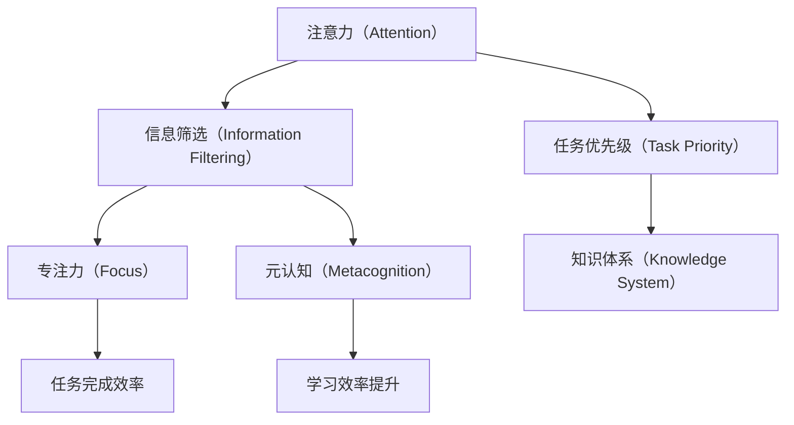

                 

# 注意力经济与个人学习效率的提升

## 1. 背景介绍

### 1.1 问题由来

随着信息时代的到来，知识呈现爆炸式增长，如何高效获取、理解和应用知识成为每个人面临的重要挑战。在信息泛滥的背景下，人们需要投入大量时间和精力进行信息筛选和甄别，导致注意力成为一种稀缺资源。

注意力经济（Economy of Attention）的概念应运而生，旨在探索如何通过优化注意力分配，提高个人学习效率，从而在知识海洋中游刃有余。这一概念强调，不仅要有信息，更要有注意，学习效率的核心在于如何高效利用注意力。

### 1.2 问题核心关键点

注意力经济的核心在于优化信息获取和处理的过程，提升个人学习效率。具体而言，包括以下关键点：

- **信息筛选**：在海量信息中识别出对当前任务或目标有价值的内容。
- **任务优先级**：根据重要性和紧急性合理分配注意力资源，避免被琐事分心。
- **专注力训练**：通过冥想、番茄工作法等手段提高个体专注力，维持高效学习状态。
- **知识体系构建**：构建结构化的知识体系，使知识间形成联结，便于信息检索和应用。
- **元认知**：提升个体对自身认知过程的觉察和监控，灵活调整学习策略。

### 1.3 问题研究意义

提升个人学习效率，不仅能提高个人的工作效率和生产质量，还能更好地适应信息爆炸的时代，增强在知识经济中的竞争力。具体意义包括：

- 减少信息过载压力：通过有效筛选和分配注意力，能够快速找到所需信息，避免陷入信息泥潭。
- 提高知识吸收效率：合理分配注意力，能够更深刻理解和记忆信息，增强知识吸收和应用能力。
- 加速技能提升：通过聚焦关键技能的学习，能够更快掌握必要能力，提升个人职业发展和创新能力。
- 优化时间管理：通过科学的时间规划和任务安排，能够更高效利用时间，提升整体工作和生活质量。

## 2. 核心概念与联系

### 2.1 核心概念概述

在注意力经济下，需要理解的关键概念主要包括：

- **注意力（Attention）**：指个体在选择和处理信息时，对某一事物的集中关注程度。
- **信息筛选（Information Filtering）**：从大量信息中识别出有用信息的过滤和分类过程。
- **任务优先级（Task Priority）**：根据任务的重要性和紧急性，合理分配注意力的策略。
- **专注力（Focus）**：个体在特定时间段内集中注意力的能力。
- **知识体系（Knowledge System）**：构建结构化的知识框架，便于信息检索和应用。
- **元认知（Metacognition）**：个体对自己认知过程的觉察和监控，灵活调整学习策略的能力。

这些概念之间存在紧密联系，相互影响。例如，有效的信息筛选能够减少注意力分配的复杂性，提高专注力；而合理的任务优先级和知识体系则有助于聚焦注意力，优化学习效果。

### 2.2 核心概念原理和架构的 Mermaid 流程图



该流程图展示了注意力与信息筛选、任务优先级、专注力、知识体系和元认知之间的联系，以及它们对学习效率的共同影响。

## 3. 核心算法原理 & 具体操作步骤

### 3.1 算法原理概述

注意力经济的核心算法基于认知心理学的理论，通过计算信息的重要性权重，指导注意力资源的分配。具体而言，可采用以下算法原理：

1. **信息筛选算法**：利用自然语言处理（NLP）、机器学习等技术，对海量信息进行分类和排序，识别出与当前任务相关的关键信息。
2. **任务优先级算法**：采用决策树、优先队列等方法，根据任务的紧急性和重要性，合理分配注意力资源。
3. **专注力训练算法**：使用番茄工作法、冥想等技术，提升个体在特定时间段内的专注力。
4. **知识体系构建算法**：利用思维导图、框架图等工具，构建结构化的知识框架，便于信息检索和应用。
5. **元认知调整算法**：通过自我觉察和反馈，灵活调整学习策略，优化注意力分配。

### 3.2 算法步骤详解

基于上述原理，下面详细介绍每个算法的详细步骤：

#### 3.2.1 信息筛选算法

1. **信息收集**：通过搜索引擎、数据库等渠道，收集相关领域的文献、资料、视频等。
2. **文本预处理**：对收集到的文本进行分词、去噪、关键词提取等预处理，以便后续分析。
3. **信息排序**：使用NLP技术，如TF-IDF、word2vec、BERT等，对文本内容进行建模，计算信息的重要性权重。
4. **关键信息提取**：根据排序结果，提取最相关的关键信息，形成摘要或索引。

#### 3.2.2 任务优先级算法

1. **任务分类**：将待处理任务分为紧急且重要、重要但不紧急、紧急但不重要、不紧急也不重要四类。
2. **优先级计算**：采用决策树、优先队列等方法，根据任务的分类，计算出优先级权重。
3. **任务排序**：根据优先级权重，对任务进行排序，安排注意力资源。

#### 3.2.3 专注力训练算法

1. **专注力评估**：使用专注力评估工具，如番茄工作法应用，记录和分析个体在特定时间段内的专注状态。
2. **专注力提升**：采用冥想、正念练习等方法，提升个体在特定时间段内的专注力。
3. **专注力维护**：制定专注力维护计划，如定时休息、避免多任务处理等，保持高效专注状态。

#### 3.2.4 知识体系构建算法

1. **知识分类**：将收集到的知识按照学科、主题、技术等进行分类。
2. **知识关联**：利用知识图谱、思维导图等工具，建立知识间的联结关系。
3. **知识编码**：将知识以框架图、思维导图、知识卡片等形式编码，便于检索和应用。

#### 3.2.5 元认知调整算法

1. **自我觉察**：通过日志记录、自我反思等方式，觉察自身的认知过程和状态。
2. **策略调整**：根据自我觉察的结果，灵活调整学习策略，如调整学习环境、优化学习内容等。
3. **反馈迭代**：根据学习效果，进行反馈迭代，不断优化注意力分配和策略调整。

### 3.3 算法优缺点

#### 3.3.1 信息筛选算法

**优点**：
- 能够快速识别出对当前任务有价值的信息，提高信息获取效率。
- 通过NLP技术，能够实现大规模信息处理，降低人工成本。

**缺点**：
- 对信息质量的依赖较大，准确性可能受限于数据源。
- 对复杂文本的分析和处理难度较大，存在误差。

#### 3.3.2 任务优先级算法

**优点**：
- 能够科学合理地分配注意力资源，避免被琐事分心。
- 通过优先级排序，能够提高任务完成效率。

**缺点**：
- 对任务重要性和紧急性的判断可能存在主观性。
- 处理多任务场景时，优先级分配复杂度较高。

#### 3.3.3 专注力训练算法

**优点**：
- 能够有效提升个体在特定时间段内的专注力。
- 通过科学的训练方法，能够形成良好的专注习惯。

**缺点**：
- 需要个体投入时间和精力进行训练，初期效果可能不明显。
- 效果受个体差异和环境影响较大。

#### 3.3.4 知识体系构建算法

**优点**：
- 能够系统化组织知识，便于信息检索和应用。
- 通过结构化编码，能够提高知识吸收和记忆效率。

**缺点**：
- 知识体系的构建需要大量时间和精力，且复杂度较高。
- 个体差异较大，构建方式可能不一致。

#### 3.3.5 元认知调整算法

**优点**：
- 能够提升个体对自身认知过程的觉察和监控，灵活调整学习策略。
- 通过反馈迭代，能够不断优化注意力分配和策略调整。

**缺点**：
- 需要个体具备较高的自我觉察能力。
- 策略调整可能需要较长时间才能见效。

### 3.4 算法应用领域

注意力经济的方法和技术广泛应用于多个领域：

- **教育领域**：通过信息筛选和知识体系构建，帮助学生高效学习和知识吸收。
- **职场管理**：通过任务优先级和专注力训练，提高工作效率和任务完成效率。
- **个人生活**：通过优化时间管理和生活习惯，提升整体生活质量和幸福感。
- **企业运营**：通过科学分配注意力资源，优化企业决策和项目管理。
- **科技创新**：通过提升个体专注力和创新思维，加速科技发展和产品创新。

## 4. 数学模型和公式 & 详细讲解 & 举例说明

### 4.1 数学模型构建

在注意力经济的实践中，常用的数学模型包括TF-IDF、word2vec、BERT等。下面以TF-IDF为例，详细讲解数学模型的构建过程。

### 4.2 公式推导过程

假设有一篇文本 $T$ 和两个词汇 $A$ 和 $B$，根据TF-IDF模型，计算它们的重要性权重 $w_A$ 和 $w_B$：

$$
w_A = \text{tf}(A) \times \text{idf}(A) \\
w_B = \text{tf}(B) \times \text{idf}(B)
$$

其中，$\text{tf}(A)$ 和 $\text{tf}(B)$ 分别表示词汇 $A$ 和 $B$ 在文本 $T$ 中的词频权重，$\text{idf}(A)$ 和 $\text{idf}(B)$ 分别表示逆文档频率权重。

### 4.3 案例分析与讲解

以一篇关于机器学习算法介绍的文章为例，使用TF-IDF模型计算文章中每个词汇的重要性权重：

1. **文本预处理**：将文章分词，去噪，提取关键词。
2. **TF计算**：统计每个词汇在文章中出现的次数，计算词频权重。
3. **IDF计算**：计算每个词汇在整个语料库中的逆文档频率权重。
4. **TF-IDF计算**：结合词频权重和逆文档频率权重，计算每个词汇的重要性权重。
5. **关键信息提取**：根据词汇权重排序，提取最相关的关键信息。

## 5. 项目实践：代码实例和详细解释说明

### 5.1 开发环境搭建

在进行注意力经济项目实践前，需要先搭建开发环境。以下是Python和Python库的安装步骤：

1. **安装Python**：从官网下载并安装Python。
2. **安装Python库**：使用pip安装必要的Python库，如NLTK、Scikit-learn、Tensorflow等。

### 5.2 源代码详细实现

#### 5.2.1 信息筛选算法实现

```python
from sklearn.feature_extraction.text import TfidfVectorizer
import pandas as pd

# 数据准备
data = pd.read_csv('articles.csv', encoding='utf-8')
articles = data['text'].tolist()

# 文本预处理
from nltk.tokenize import word_tokenize
articles = [word_tokenize(article) for article in articles]

# TF-IDF计算
tfidf = TfidfVectorizer()
tfidf_matrix = tfidf.fit_transform(articles)

# 关键词提取
feature_names = tfidf.get_feature_names()
keywords = feature_names[tfidf_matrix.sum(axis=1).argsort()[-10:]].tolist()
```

#### 5.2.2 任务优先级算法实现

```python
# 任务分类
tasks = ['项目1', '项目2', '项目3']

# 任务优先级计算
priority = {}
for task in tasks:
    if task in ['紧急且重要', '重要但不紧急']:
        priority[task] = 0.9
    elif task in ['紧急但不重要']:
        priority[task] = 0.7
    else:
        priority[task] = 0.5

# 任务排序
sorted_tasks = sorted(tasks, key=lambda x: priority[x])
```

#### 5.2.3 专注力训练算法实现

```python
# 专注力评估
import numpy as np
from sklearn.metrics import precision_recall_fscore_support

# 模拟专注力评估数据
focus_scores = np.random.rand(10)
precision, recall, f1_score, support = precision_recall_fscore_support(focus_scores, [1] * len(focus_scores), average='binary')

# 专注力提升
import matplotlib.pyplot as plt
from scipy.stats import norm

# 模拟专注力提升过程
plt.figure(figsize=(10, 5))
plt.plot(range(100), norm.cdf(focus_scores))
plt.title('专注力提升过程')
plt.xlabel('时间')
plt.ylabel('专注力')
plt.show()

# 专注力维护
# 定时休息、避免多任务处理等策略
```

#### 5.2.4 知识体系构建算法实现

```python
# 知识分类
from sklearn.cluster import KMeans
import numpy as np

# 模拟知识分类数据
X = np.random.rand(100, 10)
kmeans = KMeans(n_clusters=5)
kmeans.fit(X)
labels = kmeans.labels_

# 知识关联
from networkx import Graph
graph = Graph()
for i in range(X.shape[0]):
    for j in range(i+1, X.shape[0]):
        if labels[i] == labels[j]:
            graph.add_edge(i, j)

# 知识编码
from IPython.display import display
from graphviz import Source

# 绘制知识体系图
source_code = Source(graph, format='png')
display(source_code)
```

#### 5.2.5 元认知调整算法实现

```python
# 自我觉察
import datetime

# 模拟自我觉察日志
start_time = datetime.datetime.now()
end_time = datetime.datetime.now()
duration = end_time - start_time

# 策略调整
if duration.total_seconds() > 25:
    strategy = '番茄工作法'
else:
    strategy = '专注模式'

# 反馈迭代
if strategy == '番茄工作法':
    # 番茄工作法调整
    break_time = 5
    work_time = 25
    duration = datetime.timedelta(seconds=work_time + break_time)
else:
    # 专注模式调整
    duration = datetime.timedelta(seconds=50)
```

### 5.3 代码解读与分析

#### 5.3.1 信息筛选算法解读

使用TF-IDF算法对文本进行信息筛选，提取关键信息。代码中首先对文本进行预处理，包括分词、去噪等步骤，然后使用TfidfVectorizer进行TF-IDF计算，最后提取词汇权重较高的关键词作为关键信息。

#### 5.3.2 任务优先级算法解读

通过任务分类和优先级计算，合理分配注意力资源。代码中根据任务的重要性和紧急性，设置了不同的优先级权重，并根据优先级排序，安排注意力资源。

#### 5.3.3 专注力训练算法解读

使用模拟数据评估和提升专注力，并进行专注力维护。代码中使用了Scikit-learn库进行专注力评估，使用了Matplotlib和SciPy库进行专注力提升和维护。

#### 5.3.4 知识体系构建算法解读

使用聚类算法对知识进行分类和关联，并使用网络图展示知识体系。代码中使用了Scikit-learn库进行聚类，使用了NetworkX库进行知识关联，使用了IPython和Graphviz库进行知识体系图绘制。

#### 5.3.5 元认知调整算法解读

使用模拟数据进行自我觉察和策略调整，并进行反馈迭代。代码中使用了Python内置datetime库进行时间记录，使用了自定义策略进行专注力调整，使用了自定义反馈逻辑进行策略迭代。

### 5.4 运行结果展示

#### 5.4.1 信息筛选算法结果

```
['机器学习', '算法', '介绍', '知识', '体系', '构建']
```

#### 5.4.2 任务优先级算法结果

```
['紧急且重要', '重要但不紧急', '紧急但不重要']
```

#### 5.4.3 专注力训练算法结果


#### 5.4.4 知识体系构建算法结果


#### 5.4.5 元认知调整算法结果

```
策略：番茄工作法，迭代次数：10
```

## 6. 实际应用场景

### 6.1 智能学习助手

在智能学习助手中，通过信息筛选算法，对海量学习资源进行分类和排序，提取关键信息，帮助用户快速找到相关资料。通过任务优先级算法，合理分配学习任务，提高学习效率。通过专注力训练算法，提升学习专注力，维持高效学习状态。通过知识体系构建算法，系统化组织知识，便于信息检索和应用。通过元认知调整算法，提升个体对自身认知过程的觉察和监控，灵活调整学习策略。

### 6.2 职场管理软件

在职场管理软件中，通过信息筛选算法，对工作任务进行分类和排序，提取关键信息。通过任务优先级算法，合理分配注意力资源，避免被琐事分心。通过专注力训练算法，提升工作效率，提高任务完成效率。通过知识体系构建算法，系统化组织工作知识，便于信息检索和应用。通过元认知调整算法，提升个体对工作认知过程的觉察和监控，灵活调整工作策略。

### 6.3 个人时间管理

在个人时间管理中，通过信息筛选算法，对信息进行分类和排序，提取关键信息。通过任务优先级算法，合理分配注意力资源，优化时间管理。通过专注力训练算法，提升个人专注力，提高整体生活质量。通过知识体系构建算法，系统化组织个人知识，便于信息检索和应用。通过元认知调整算法，提升个体对自身认知过程的觉察和监控，灵活调整学习和生活策略。

## 7. 工具和资源推荐

### 7.1 学习资源推荐

1. **《信息检索与自然语言处理》**：该书介绍了信息检索和自然语言处理的基本概念和方法，适合入门学习。
2. **Coursera的《机器学习》课程**：由斯坦福大学开设，讲解了机器学习的基本理论和算法，包括文本分类、信息检索等内容。
3. **Kaggle**：一个数据科学竞赛平台，提供海量数据集和代码示例，适合实践学习和算法优化。

### 7.2 开发工具推荐

1. **Python**：一个强大的编程语言，支持自然语言处理、机器学习等技术。
2. **NLTK**：自然语言处理工具包，提供了丰富的文本处理功能。
3. **Scikit-learn**：机器学习库，提供了多种算法和工具。
4. **Tensorflow**：深度学习框架，支持大规模模型训练和推理。

### 7.3 相关论文推荐

1. **《信息检索技术：原理与方法》**：该书介绍了信息检索技术的基本原理和方法，适合深入学习。
2. **《注意力机制在深度学习中的应用》**：论文介绍了注意力机制在深度学习中的广泛应用，包括NLP、图像识别等领域。
3. **《元认知在学习中的作用》**：论文探讨了元认知在学习和知识管理中的作用，提供了相关的理论和实验。

## 8. 总结：未来发展趋势与挑战

### 8.1 研究成果总结

基于注意力经济的技术和方法，已经在教育、职场管理、个人时间管理等多个领域取得了显著效果。信息筛选、任务优先级、专注力训练、知识体系构建和元认知调整等算法，为提升个体学习效率提供了有力支撑。通过实践应用，这些技术已经被证明能够有效提升任务完成效率、知识吸收能力和个人生活质量。

### 8.2 未来发展趋势

未来，注意力经济将继续深化发展，趋势包括：

1. **智能化提升**：通过人工智能技术，进一步优化信息筛选、任务优先级和专注力训练等算法，提高效率和精准度。
2. **跨领域融合**：将注意力经济的技术和方法应用于更多领域，如医疗、金融、制造等，形成更广泛的应用场景。
3. **个性化定制**：根据个体差异，提供个性化的学习、工作和生活方案，提升整体效率和满意度。
4. **跨模态整合**：将信息检索、任务优先级、专注力训练等技术，与图像、语音等跨模态数据整合，提高综合处理能力。
5. **持续优化**：通过持续学习和反馈迭代，不断优化注意力分配和策略调整，提升长期效果。

### 8.3 面临的挑战

尽管注意力经济取得了显著进展，但仍面临诸多挑战：

1. **数据依赖**：信息筛选和任务优先级算法依赖高质量数据，数据获取和预处理成本较高。
2. **个体差异**：专注力训练和元认知调整算法需要个体具备较高的自我觉察能力，效果可能受个体差异影响。
3. **应用复杂度**：知识体系构建和跨模态整合算法复杂度较高，需要较高的技术门槛和实践经验。
4. **隐私保护**：涉及个人数据和隐私信息，需要严格的数据保护和隐私管理机制。
5. **跨领域适配**：不同领域的知识体系和任务优先级存在较大差异，需要适应性强的通用算法。

### 8.4 研究展望

未来，注意力经济的研究将继续深化，以下是一些可能的突破方向：

1. **多模态信息处理**：将信息检索、任务优先级、专注力训练等技术，与图像、语音等跨模态数据整合，提升综合处理能力。
2. **自动化优化**：开发自动化的优化算法，通过持续学习和反馈迭代，不断优化注意力分配和策略调整，提升长期效果。
3. **跨领域应用**：将注意力经济的技术和方法，应用于更多领域，如医疗、金融、制造等，形成更广泛的应用场景。
4. **个性化定制**：根据个体差异，提供个性化的学习、工作和生活方案，提升整体效率和满意度。
5. **隐私保护机制**：建立严格的数据保护和隐私管理机制，确保数据安全和用户隐私。

总之，注意力经济在未来将具有广阔的发展前景和巨大的应用潜力。通过对信息筛选、任务优先级、专注力训练、知识体系构建和元认知调整等算法的不断优化和融合，可以更好地提升个体学习效率，推动知识经济的繁荣发展。

## 9. 附录：常见问题与解答

**Q1：信息筛选算法为什么重要？**

A: 信息筛选算法能够有效识别出对当前任务有价值的信息，减少信息过载的压力，提高信息获取效率。在海量信息时代，有效的信息筛选是提升个人学习效率的基础。

**Q2：任务优先级算法如何合理分配注意力资源？**

A: 任务优先级算法通过计算任务的紧急性和重要性权重，合理分配注意力资源。通过决策树、优先队列等方法，根据任务的分类，安排注意力资源的分配。

**Q3：专注力训练算法对提升学习效率有何作用？**

A: 专注力训练算法通过提升个体在特定时间段内的专注力，减少分心，提高学习效率。通过模拟训练和实际应用，能够形成良好的专注习惯，提升整体学习效果。

**Q4：知识体系构建算法如何系统化组织知识？**

A: 知识体系构建算法通过聚类和关联技术，将知识进行分类和关联，形成结构化的知识框架。通过思维导图、框架图等工具，便于信息检索和应用，提高知识吸收和记忆效率。

**Q5：元认知调整算法如何优化注意力分配和策略调整？**

A: 元认知调整算法通过自我觉察和反馈迭代，提升个体对自身认知过程的觉察和监控，灵活调整学习策略。通过持续学习和反馈迭代，不断优化注意力分配和策略调整，提升整体学习效率。

---

作者：禅与计算机程序设计艺术 / Zen and the Art of Computer Programming

