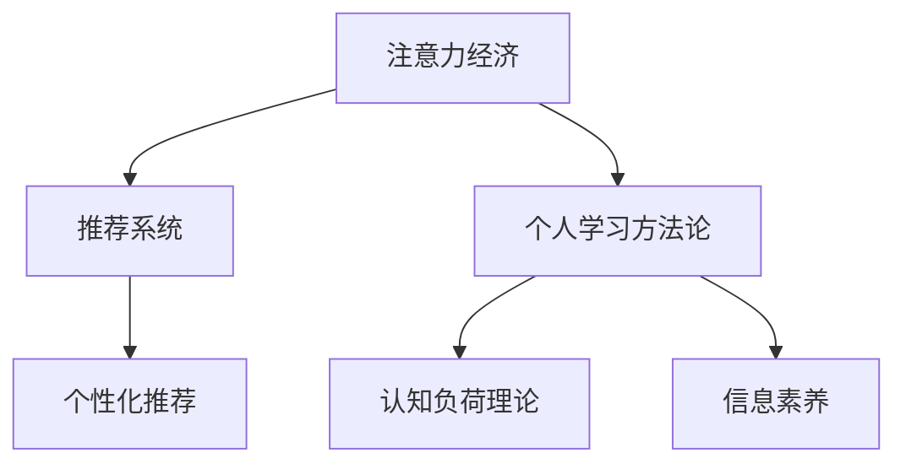

                 

# 注意力经济与个人学习方法论的革新

## 1. 背景介绍

### 1.1 问题由来
在信息化时代，信息爆炸和知识过载已成为现代人面临的普遍问题。每天，人们都被海量的信息所包围，然而，这些信息并不是平等的，其中有许多是无用的、重复的，甚至是有害的。如何高效地筛选、利用这些信息，成为了一个重要且迫切的问题。在这样的背景下，“注意力经济”（Attention Economy）和“个人学习方法论”（Learning Methodology）应运而生，并逐渐成为信息时代中至关重要的研究领域。

### 1.2 问题核心关键点
- **注意力经济**：研究如何高效分配和管理用户的时间和注意力，通过各种策略和算法，帮助用户从信息海洋中筛选出有价值的内容。
- **个人学习方法论**：探讨如何高效、系统地学习知识，通过科学的学习方法和工具，提高个人学习效率和成果。

这两者的共同目标在于帮助人们更好地理解和利用信息，从而在个人和商业层面上实现最优的效率和效果。

### 1.3 问题研究意义
随着互联网和信息技术的不断发展，注意力经济和个人学习方法论的研究具有重要的现实意义和深远的理论价值。具体而言：

1. **提高信息利用效率**：在信息爆炸的时代，如何高效利用信息资源，是每个个体和组织面临的挑战。
2. **提升个人学习效果**：在终身学习成为时代趋势的今天，如何系统、高效地学习知识，是个人发展的重要保障。
3. **优化商业模式**：通过注意力经济学的研究，企业可以更精准地定位用户需求，优化产品和服务，提高用户满意度和忠诚度。
4. **推动技术创新**：相关的研究可以推动算法、数据处理、用户行为分析等技术的发展，为更多领域的应用提供理论支撑。

## 2. 核心概念与联系

### 2.1 核心概念概述

为更好地理解注意力经济与个人学习方法论的融合，本节将介绍几个核心概念及其相互联系：

- **注意力经济**：研究如何高效分配和管理用户的时间和注意力，通过各种策略和算法，帮助用户从信息海洋中筛选出有价值的内容。
- **个人学习方法论**：探讨如何高效、系统地学习知识，通过科学的学习方法和工具，提高个人学习效率和成果。
- **推荐系统**：利用用户行为数据和内容特征，通过算法为用户推荐感兴趣的个性化内容，提升用户满意度和信息利用效率。
- **认知负荷理论**：解释用户在学习过程中遇到的认知负担，从而优化学习内容和方式，提高学习效率。
- **信息素养的培养**：强调用户识别、评估和有效利用信息的能力，提升信息素养，减少误导和信息过载。

这些概念之间的逻辑关系可以通过以下Mermaid流程图来展示：



这个流程图展示了几者之间的联系：

1. 注意力经济通过推荐系统提升用户对信息的筛选和利用效率。
2. 个人学习方法论旨在提升学习效率和效果，与认知负荷理论紧密相关。
3. 信息素养是个人学习方法论的重要组成部分，有助于用户识别和利用信息。

## 3. 核心算法原理 & 具体操作步骤

### 3.1 算法原理概述

注意力经济和个人学习方法论的融合，可以通过推荐系统算法实现。推荐系统通过分析用户的历史行为和偏好，预测用户对未见过的内容的兴趣，从而提升用户的信息利用效率和学习效果。

推荐系统的核心思想是：通过用户对内容的交互（如点击、观看、评分等），学习用户的兴趣模型，并基于此模型为用户推荐个性化内容。典型的推荐算法包括基于协同过滤、基于内容推荐、混合推荐等。

### 3.2 算法步骤详解

基于协同过滤的推荐系统算法步骤如下：

1. **数据收集**：收集用户对内容的评分或行为数据，如点击率、观看时长、评分等。
2. **数据预处理**：对原始数据进行清洗、归一化、降维等处理，以提高算法效率和准确性。
3. **用户建模**：基于用户的评分和行为数据，构建用户兴趣模型。常用的用户建模方法包括协同矩阵分解、隐语义分析等。
4. **物品建模**：基于内容的特征，构建物品特征向量。常用的方法包括TF-IDF、word2vec等。
5. **推荐计算**：基于用户模型和物品模型，计算用户对物品的预测评分或概率，选择评分或概率最高的物品进行推荐。

### 3.3 算法优缺点

基于协同过滤的推荐系统算法具有以下优点：

1. **个性化推荐**：能够根据用户的历史行为和偏好，提供高度个性化的内容推荐。
2. **实时性**：通过在线学习，推荐系统可以实时更新用户模型，提供最新的推荐结果。
3. **可扩展性**：推荐系统可以处理大规模数据，适用于不同规模的应用场景。

然而，该算法也存在一定的局限性：

1. **冷启动问题**：新用户或新物品没有足够的历史数据，导致推荐效果不佳。
2. **数据稀疏性**：用户-物品评分数据往往稀疏，难以全面覆盖所有用户和物品。
3. **推荐多样性不足**：过于依赖用户的历史数据，可能导致推荐内容多样性不足，用户陷入信息茧房。

### 3.4 算法应用领域

基于协同过滤的推荐系统已经在多个领域得到广泛应用，例如：

1. **电子商务**：为消费者推荐商品，提升购物体验和转化率。
2. **视频网站**：为用户推荐电影、电视剧、综艺节目等，增加观看时间和满意度。
3. **音乐平台**：为用户推荐歌曲、专辑、艺人等，提升音乐播放量和用户粘性。
4. **社交网络**：为用户推荐朋友、文章、小组等，增加平台活跃度和用户参与度。
5. **新闻推荐**：为用户推荐新闻、文章、作者等，提升用户对信息的筛选和利用效率。

## 4. 数学模型和公式 & 详细讲解 & 举例说明

### 4.1 数学模型构建

基于协同过滤的推荐系统算法可以构建如下数学模型：

1. **用户-物品评分矩阵**：$R \in \mathbb{R}^{m \times n}$，$m$ 为物品数量，$n$ 为用户数量，$r_{ij}$ 表示用户 $i$ 对物品 $j$ 的评分或行为数据。
2. **用户模型**：$\mathbf{u}_i \in \mathbb{R}^k$，$k$ 为模型维度，$\mathbf{u}_i$ 表示用户 $i$ 的兴趣向量。
3. **物品模型**：$\mathbf{v}_j \in \mathbb{R}^k$，$k$ 为模型维度，$\mathbf{v}_j$ 表示物品 $j$ 的特征向量。
4. **用户与物品的相似度**：$\hat{\mathbf{u}}_i$ 和 $\mathbf{v}_j$ 的内积。

### 4.2 公式推导过程

基于矩阵分解的协同过滤算法，通过将用户评分矩阵 $R$ 分解为用户模型 $\mathbf{u}_i$ 和物品模型 $\mathbf{v}_j$，来计算用户对物品的预测评分：

$$
\hat{r}_{ij} = \mathbf{u}_i^\top \mathbf{v}_j
$$

通过最大化预测评分与实际评分的均方误差（MSE），优化用户模型和物品模型：

$$
\min_{\mathbf{u}_i, \mathbf{v}_j} \frac{1}{2} \sum_{i=1}^n \sum_{j=1}^m (r_{ij} - \hat{r}_{ij})^2
$$

常用的优化算法包括梯度下降、交替最小二乘法等。

### 4.3 案例分析与讲解

以Netflix推荐系统为例，分析其推荐算法的设计和优化。Netflix的推荐系统采用了基于矩阵分解的协同过滤算法，通过分解用户评分矩阵 $R$ 为用户模型 $\mathbf{u}_i$ 和物品模型 $\mathbf{v}_j$。在优化过程中，Netflix使用了多种技术，如用户建模优化、物品特征选择、模型并行计算等，以提升推荐系统的性能和效率。

## 5. 项目实践：代码实例和详细解释说明

### 5.1 开发环境搭建

在进行推荐系统项目实践前，我们需要准备好开发环境。以下是使用Python进行TensorFlow开发的环境配置流程：

1. 安装Anaconda：从官网下载并安装Anaconda，用于创建独立的Python环境。
2. 创建并激活虚拟环境：
```bash
conda create -n tf-env python=3.8 
conda activate tf-env
```

3. 安装TensorFlow：根据CUDA版本，从官网获取对应的安装命令。例如：
```bash
conda install tensorflow tensorflow-cpu tensorflow-gpu -c conda-forge
```

4. 安装Scikit-Learn：用于数据处理和模型评估。
```bash
pip install scikit-learn
```

5. 安装其他工具包：
```bash
pip install pandas numpy jupyter notebook ipython tqdm
```

完成上述步骤后，即可在`tf-env`环境中开始推荐系统实践。

### 5.2 源代码详细实现

我们以基于矩阵分解的协同过滤推荐系统为例，给出使用TensorFlow实现的代码实现。

首先，定义推荐系统数据集：

```python
import pandas as pd
import numpy as np

data = pd.read_csv('rating.csv', sep='\t')
ratings = data.pivot_table(index='user', columns='item', values='rating')
ratings = np.array(ratings.fillna(0), dtype=float)
```

然后，定义用户模型和物品模型：

```python
import tensorflow as tf

user_dim = 10
item_dim = 10

user_model = tf.Variable(tf.random.normal([num_users, user_dim]))
item_model = tf.Variable(tf.random.normal([num_items, item_dim]))
```

接着，定义推荐函数：

```python
def predict(user, item):
    user_embed = tf.matmul(user_model, tf.random.normal([user_dim, 1]))
    item_embed = tf.matmul(item_model, tf.random.normal([item_dim, 1]))
    return tf.reduce_sum(tf.multiply(user_embed, item_embed))
```

最后，定义优化器并训练模型：

```python
optimizer = tf.keras.optimizers.Adam()
epochs = 100
for epoch in range(epochs):
    for user in range(num_users):
        for item in range(num_items):
            with tf.GradientTape() as tape:
                pred = predict(user, item)
                loss = tf.reduce_mean(tf.square(pred - ratings[user][item]))
            grads = tape.gradient(loss, [user_model, item_model])
            optimizer.apply_gradients(zip(grads, [user_model, item_model]))
```

以上就是使用TensorFlow实现推荐系统的完整代码实现。可以看到，TensorFlow提供了强大的计算图和自动微分能力，使得模型训练变得简洁高效。

### 5.3 代码解读与分析

让我们再详细解读一下关键代码的实现细节：

**数据预处理**：
- 通过Pandas读取原始评分数据，利用`pivot_table`方法构建用户-物品评分矩阵。
- 使用`fillna(0)`方法处理缺失值，保证矩阵完整性。

**模型定义**：
- 定义用户模型和物品模型的维度。
- 使用TensorFlow的`Variable`类定义用户模型和物品模型的权重。

**推荐函数**：
- 将用户模型和物品模型的权重矩阵通过矩阵乘法计算出用户和物品的嵌入向量。
- 通过向量点积计算预测评分。

**优化器定义与训练**：
- 使用TensorFlow的`Adam`优化器。
- 通过`GradientTape`类记录计算图，自动计算损失函数的梯度。
- 使用`apply_gradients`方法更新模型参数。

**训练流程**：
- 外层循环遍历每个用户。
- 内层循环遍历每个物品。
- 每次迭代计算预测评分和实际评分的均方误差，反向传播更新模型参数。

可以看到，TensorFlow提供了强大的计算图和自动微分功能，使得推荐系统的实现变得简洁高效。通过这些代码，可以快速搭建一个基础的协同过滤推荐系统，并进行效果评估。

## 6. 实际应用场景

### 6.1 智能推荐系统

智能推荐系统已经在电商、娱乐、新闻等多个领域得到广泛应用。例如，电商平台通过推荐系统为用户推荐商品，提升购物体验和转化率；视频平台为用户推荐电影、电视剧，增加用户观看时间和满意度。这些推荐系统能够根据用户的历史行为和偏好，提供高度个性化的内容推荐，显著提升用户体验和平台收益。

### 6.2 个性化学习平台

个性化学习平台通过推荐系统为用户推荐课程、教材、练习题等，帮助用户高效学习。例如，Coursera、Khan Academy等在线学习平台，通过分析用户的学习行为和反馈，提供个性化的课程推荐，提升学习效率和效果。

### 6.3 智能新闻推荐

智能新闻推荐系统通过推荐算法为用户推荐新闻、文章、作者等，提升用户对信息的筛选和利用效率。例如，今日头条、Google News等平台，通过分析用户的历史浏览行为和兴趣偏好，推荐相关的热点新闻和深度文章，帮助用户获取最新的资讯。

### 6.4 未来应用展望

随着推荐系统的不断发展，未来将在更多领域得到应用，为个人和商业提供更智能、高效的信息服务和推荐方案。

在智慧医疗领域，推荐系统可以帮助医生推荐相关的医学文献、治疗方案等，提高医疗服务的智能化水平。

在智能家居领域，推荐系统可以为用户推荐个性化的家居产品和设计方案，提升生活品质。

在企业资源管理领域，推荐系统可以推荐相关的业务资源、知识库等，优化资源配置，提升企业竞争力。

## 7. 工具和资源推荐

### 7.1 学习资源推荐

为了帮助开发者系统掌握推荐系统的理论和实践，这里推荐一些优质的学习资源：

1. 《推荐系统实践》：一本系统介绍推荐系统原理和实现方法的经典书籍，适合初学者和进阶开发者。
2. CS446《推荐系统》课程：斯坦福大学开设的推荐系统课程，提供了详细的理论和算法讲解。
3. 《深度学习推荐系统》：一本介绍深度学习在推荐系统中的应用，适合有一定深度学习基础的开发者。
4. KDD Cup比赛：通过参加推荐系统相关的比赛，可以积累实际项目经验，提升技能水平。
5. GitHub上的推荐系统项目：大量开源推荐系统项目和代码，适合学习和参考。

通过对这些资源的学习实践，相信你一定能够快速掌握推荐系统的精髓，并用于解决实际的推荐问题。

### 7.2 开发工具推荐

高效的开发离不开优秀的工具支持。以下是几款用于推荐系统开发的常用工具：

1. TensorFlow：基于Python的开源深度学习框架，灵活动态的计算图，适合快速迭代研究。
2. PyTorch：灵活的深度学习框架，提供了强大的动态计算图和自动微分功能。
3. Scikit-Learn：用于数据处理和模型评估，适合快速原型开发和实验验证。
4. Apache Spark：分布式计算框架，适合大规模数据处理和并行计算。
5. Hadoop：分布式计算平台，适合海量数据的存储和处理。

合理利用这些工具，可以显著提升推荐系统的开发效率，加快创新迭代的步伐。

### 7.3 相关论文推荐

推荐系统的研究历史悠久，相关的论文数量庞大，以下是几篇经典和前沿的推荐系统论文，推荐阅读：

1. "Collaborative Filtering for Implicit Feedback Datasets"：提出协同过滤算法的经典论文，奠定了推荐系统研究的基础。
2. "Matrix Factorization Techniques for Recommender Systems"：介绍矩阵分解方法，展示了推荐系统的重要进展。
3. "Deep Learning for Recommender Systems"：介绍深度学习在推荐系统中的应用，展示了推荐系统的最新发展。
4. "Adaptive Matrix Factorization"：提出自适应矩阵分解算法，提高了推荐系统的性能和效率。
5. "Wide & Deep Learning for Recommender Systems"：结合宽度和深度方法，提升了推荐系统的准确性和多样性。

这些论文代表了大数据、深度学习等技术在推荐系统中的应用，是推荐系统领域的经典之作。通过学习这些前沿成果，可以帮助研究者把握学科前进方向，激发更多的创新灵感。

## 8. 总结：未来发展趋势与挑战

### 8.1 总结

本文对基于协同过滤的推荐系统算法进行了全面系统的介绍。首先阐述了推荐系统的发展背景和应用前景，明确了推荐系统在信息利用效率和个人学习效果提升方面的重要性。其次，从原理到实践，详细讲解了推荐系统的数学模型和算法步骤，给出了推荐系统任务开发的完整代码实现。同时，本文还广泛探讨了推荐系统在智能推荐、个性化学习、智能新闻等多个领域的应用场景，展示了推荐系统的广阔前景。

通过本文的系统梳理，可以看到，推荐系统作为一种高效的信息利用工具，已经在各个领域展现出巨大的价值。推荐系统不仅能够提升用户的体验和满意度，还能够为企业提供更加精准的业务洞察和优化方案。未来，随着数据技术的不断进步和应用场景的不断拓展，推荐系统必将进一步深化其在信息时代中的地位，成为推动智能化发展的重要引擎。

### 8.2 未来发展趋势

展望未来，推荐系统的发展趋势将主要体现在以下几个方面：

1. **深度学习方法的普及**：深度学习在推荐系统中的应用将会越来越广泛，提升推荐系统的准确性和效果。
2. **多模态数据的融合**：推荐系统将融合视觉、语音、文本等多模态数据，提供更加全面、丰富的推荐内容。
3. **联邦学习的应用**：在保护用户隐私的前提下，推荐系统将采用联邦学习技术，实现分布式协同推荐。
4. **实时性要求的提高**：推荐系统将实现实时推荐，提升用户交互体验和服务质量。
5. **个性化需求的定制**：推荐系统将根据用户的个性化需求，提供更加精准和定制化的推荐服务。

这些趋势将推动推荐系统向更加智能化、个性化、安全化的方向发展，为推荐系统的未来应用注入新的活力。

### 8.3 面临的挑战

尽管推荐系统已经取得了显著的进展，但在实际应用中也面临着诸多挑战：

1. **数据隐私和安全**：推荐系统需要处理大量用户数据，如何保护用户隐私和数据安全是一个重要问题。
2. **推荐多样性不足**：过于依赖用户历史数据，可能导致推荐内容多样性不足，用户陷入信息茧房。
3. **冷启动问题**：新用户和物品缺乏足够的历史数据，导致推荐效果不佳。
4. **推荐系统的公平性**：推荐系统可能存在偏见，导致对某些用户或物品的推荐不公平。
5. **推荐系统的可解释性**：推荐系统的推荐结果往往缺乏可解释性，用户难以理解和信任。

这些挑战需要在未来的研究中加以解决，以推动推荐系统技术的进一步发展和应用。

### 8.4 研究展望

为了应对这些挑战，未来的推荐系统研究需要在以下几个方面寻求新的突破：

1. **隐私保护技术**：研究差分隐私、联邦学习等技术，保护用户隐私，提升数据安全性。
2. **多模态推荐技术**：研究多模态数据的融合方法，提升推荐系统的多样性和丰富性。
3. **冷启动解决策略**：研究基于协同过滤、深度学习等方法的冷启动算法，解决新用户和物品的推荐问题。
4. **推荐系统的公平性**：研究推荐系统的公平性优化方法，避免推荐偏见的产生。
5. **推荐系统的可解释性**：研究推荐系统的可解释性算法，提升用户对推荐结果的理解和信任。

这些研究方向的探索，将推动推荐系统技术的进一步发展和应用，使其更好地服务于用户和商业需求。

## 9. 附录：常见问题与解答

**Q1：推荐系统是否适用于所有领域？**

A: 推荐系统适用于绝大多数需要个性化推荐的领域，如电商、娱乐、新闻、金融、医疗等。然而，对于一些具有特殊性质的领域，如安全、隐私等，需要根据具体情况进行适当的调整和优化。

**Q2：推荐系统如何处理冷启动问题？**

A: 冷启动问题是推荐系统中普遍存在的问题。常见的处理方式包括：
1. 基于内容的推荐：通过物品的特征向量，为新物品推荐给新用户。
2. 基于协同过滤的推荐：利用用户的相似性，为新用户推荐其他用户的兴趣物品。
3. 基于深度学习的推荐：通过用户的行为数据，预测新用户的兴趣物品。

这些方法需要根据具体应用场景和数据特点进行灵活组合。

**Q3：推荐系统在处理多模态数据时需要注意哪些问题？**

A: 多模态数据的融合是推荐系统的一个重要研究方向。需要注意的问题包括：
1. 数据的融合方式：选择合适的方式将不同模态的数据进行融合，如特征拼接、深度学习等。
2. 数据的标注和表示：对不同模态的数据进行统一表示，并选择合适的标注方式。
3. 数据的融合权重：确定不同模态数据在融合过程中的权重，避免某一模态数据的主导。

通过合理的融合策略，可以提升推荐系统的多样性和丰富性，满足用户的多样化需求。

**Q4：推荐系统在处理数据隐私和安全问题时需要注意哪些问题？**

A: 数据隐私和安全是推荐系统中需要注意的重要问题。需要注意的问题包括：
1. 用户数据的匿名化处理：对用户数据进行匿名化处理，保护用户隐私。
2. 数据传输的安全性：使用加密技术保护数据传输的安全性。
3. 数据使用的合规性：遵守相关法律法规，确保数据使用的合规性。

通过合理的隐私保护和安全措施，可以提升推荐系统的可信度和用户满意度。

**Q5：推荐系统在处理推荐多样性不足的问题时需要注意哪些问题？**

A: 推荐多样性不足是推荐系统的一个常见问题。需要注意的问题包括：
1. 数据的多样性：确保数据集的多样性，避免过拟合。
2. 推荐的算法设计：设计多样性友好的推荐算法，避免推荐结果过于单一。
3. 推荐结果的多样化：通过调整推荐算法，增加推荐结果的多样性，打破信息茧房。

通过合理的算法设计和数据处理，可以提升推荐系统的多样性和用户满意度。

---

作者：禅与计算机程序设计艺术 / Zen and the Art of Computer Programming

