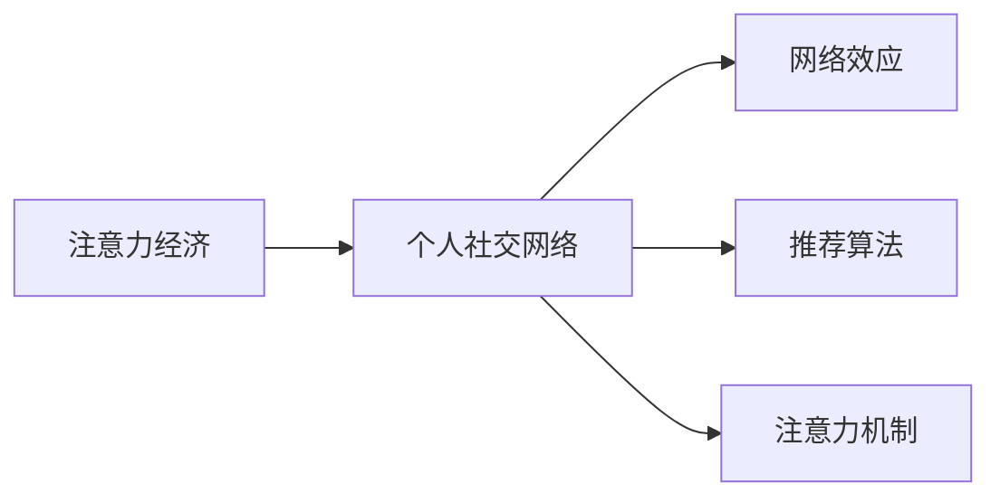

                 

# 注意力经济与个人社交网络的变迁

> 关键词：注意力经济,社交网络,个人化推荐,网络效用,注意力机制,机器学习,用户行为分析,社交媒体

## 1. 背景介绍

### 1.1 问题由来

随着互联网的普及，人们越来越多地依赖于网络获取信息、进行社交和娱乐。在数字经济时代，注意力成为一种稀缺资源，对个人和企业都具有极高的价值。如何高效利用注意力资源，吸引并保持用户的注意力，成为了数字经济的核心议题。这一背景催生了“注意力经济”概念的诞生，即通过控制和引导用户的注意力，创造经济价值的过程。

在注意力经济中，个人社交网络起着至关重要的作用。个人社交网络不仅是个体获取信息、建立关系的重要途径，也是企业进行用户画像、精准营销的关键平台。但随着社交网络的不断发展，个人在信息爆炸和隐私侵犯的双重压力下，逐渐从“主动社交”转向“被动社交”，引发了一系列社交网络的变迁，如从中心化向去中心化转变，从公开透明向私密保护的转变，以及从单向交互向双向互通的转变。这些变迁对个人社交网络的设计和运营提出了新的挑战，也对数字经济的未来发展方向产生了深远影响。

### 1.2 问题核心关键点

本节将详细探讨个人社交网络在注意力经济中的变迁过程，包括技术、数据、用户行为等方面的核心关键点：

- 技术变迁：从中心化向去中心化、从单向交互向双向互通的转变。
- 数据使用：用户隐私保护与数据利用的平衡。
- 用户行为：从主动社交向被动社交的演变。
- 商业价值：注意力经济中社交网络的经济模型和价值主张。

## 2. 核心概念与联系

### 2.1 核心概念概述

为了更好地理解个人社交网络的变迁，本节将介绍几个关键概念：

- **注意力经济（Attention Economy）**：通过吸引和控制用户的注意力，创造经济价值的过程。在数字经济中，注意力被视为稀缺资源，是企业竞争的关键要素。
- **个人社交网络（Personal Social Network）**：个体通过在线社交平台建立的关系网络，是获取信息、建立信任和关系的重要途径。
- **网络效应（Network Effect）**：社交网络的用户数量越多，平台对每个用户提供的价值越大，从而形成正反馈循环。
- **推荐算法（Recommendation Algorithm）**：利用机器学习等技术，对用户行为进行分析和预测，推荐个性化内容或商品，提升用户体验和平台价值。
- **注意力机制（Attention Mechanism）**：用于动态调整资源分配和信息筛选，以控制和引导用户的注意力。

这些核心概念之间相互关联，共同构成了个人社交网络在注意力经济中的变迁基础。

### 2.2 核心概念原理和架构的 Mermaid 流程图



这个流程图展示了注意力经济、个人社交网络、网络效应、推荐算法和注意力机制之间的联系。

## 3. 核心算法原理 & 具体操作步骤

### 3.1 算法原理概述

基于推荐算法的个人社交网络，其核心思想是通过对用户行为的分析，预测用户可能感兴趣的内容或对象，并将其推荐给用户。这不仅提升了用户体验，也增加了平台的用户粘性和活跃度，从而增强了平台的商业价值。推荐算法通常包括以下步骤：

1. **数据收集**：收集用户的浏览、点击、评论等行为数据。
2. **数据处理**：对数据进行清洗、归一化和特征提取等预处理。
3. **模型训练**：使用机器学习模型（如协同过滤、矩阵分解、深度学习等）对用户和物品进行相似性计算。
4. **推荐生成**：根据模型的预测结果，为用户推荐其可能感兴趣的内容或商品。

### 3.2 算法步骤详解

下面以协同过滤算法为例，详细讲解推荐算法的步骤：

1. **数据收集**：
   - 用户数据：包括用户的ID、历史浏览记录、评分数据等。
   - 物品数据：包括物品的ID、描述、类别等。
   - 评分数据：用户对物品的评分数据。

2. **数据处理**：
   - 对用户和物品进行编码，生成用户ID和物品ID。
   - 对数据进行标准化处理，消除噪声和异常值。
   - 特征提取：使用TF-IDF、词袋模型、嵌入向量等方法提取用户和物品的特征。

3. **模型训练**：
   - 构建用户-物品评分矩阵：将用户ID和物品ID映射成矩阵中的位置，将评分数据填入相应位置。
   - 使用协同过滤算法（如基于用户的协同过滤、基于物品的协同过滤）计算用户和物品之间的相似度。
   - 利用相似度矩阵生成用户对物品的潜在评分。

4. **推荐生成**：
   - 根据用户的历史评分数据和潜在评分，预测用户对未评分物品的评分。
   - 对预测评分进行排序，生成推荐列表。
   - 向用户展示推荐结果。

### 3.3 算法优缺点

协同过滤算法具有以下优点：
- 简单高效：算法结构简单，易于实现和部署。
- 个性化推荐：能够根据用户的历史行为，生成个性化推荐结果。
- 适用范围广：适用于各种类型的推荐场景，如电商、视频、新闻等。

同时，该算法也存在一些局限性：
- 数据稀疏性：用户和物品的数量较大，但用户对物品的评分数据稀疏，导致矩阵的稀疏性较高。
- 冷启动问题：对于新用户和新物品，由于缺乏评分数据，推荐效果不佳。
- 可解释性差：推荐结果缺乏可解释性，用户难以理解推荐依据。

### 3.4 算法应用领域

协同过滤算法在个人社交网络中有着广泛的应用，如：

- 电商平台：为用户推荐商品，提升购物体验。
- 视频平台：为用户推荐视频内容，增加观看时长。
- 新闻网站：为用户推荐新闻文章，提升用户粘性。
- 社交网络：为用户推荐好友和内容，增加平台用户活跃度。

## 4. 数学模型和公式 & 详细讲解 & 举例说明

### 4.1 数学模型构建

推荐算法通常基于以下数学模型构建：

1. 用户行为矩阵 $U$：用户对物品的评分矩阵。
2. 物品特征矩阵 $I$：物品的特征矩阵。
3. 用户特征矩阵 $V$：用户的特征矩阵。
4. 用户-物品评分矩阵 $R$：用户对物品的评分矩阵。

### 4.2 公式推导过程

以协同过滤算法中的基于用户的协同过滤为例，其推荐公式为：

$$
\hat{R}_{ui} = \frac{1}{1+\exp(-\alpha (\sum_{j=1}^{N}A_{uj}(r_{uj}-\mu_j))}
$$

其中：
- $\hat{R}_{ui}$ 表示用户 $u$ 对物品 $i$ 的预测评分。
- $r_{uj}$ 表示用户 $u$ 对物品 $j$ 的实际评分。
- $\mu_j$ 表示物品 $j$ 的平均评分。
- $A_{uj}$ 表示用户 $u$ 和物品 $j$ 的相似度。
- $\alpha$ 为衰减系数。

### 4.3 案例分析与讲解

以Netflix推荐系统为例，Netflix通过协同过滤算法，为用户推荐其可能感兴趣的电影。Netflix收集了数百万用户的观看数据，包括观影时间、评分、收藏等。通过构建用户-电影评分矩阵和电影特征矩阵，Netflix计算用户和电影之间的相似度，预测用户可能感兴趣的电影，生成推荐列表。Netflix的推荐系统不仅提高了用户满意度，也显著增加了用户的观看时长和订阅数量，取得了巨大的商业成功。

## 5. 项目实践：代码实例和详细解释说明

### 5.1 开发环境搭建

在进行推荐系统开发前，我们需要准备好开发环境。以下是使用Python进行Scikit-learn开发的环境配置流程：

1. 安装Anaconda：从官网下载并安装Anaconda，用于创建独立的Python环境。

2. 创建并激活虚拟环境：
```bash
conda create -n recommendation-env python=3.8 
conda activate recommendation-env
```

3. 安装Scikit-learn和其他相关工具包：
```bash
pip install scikit-learn numpy pandas matplotlib seaborn tqdm joblib
```

4. 安装PyTorch和其他深度学习库（如果需要）：
```bash
pip install torch torchvision torchaudio cudatoolkit=11.1 -c pytorch -c conda-forge
```

完成上述步骤后，即可在`recommendation-env`环境中开始推荐系统开发。

### 5.2 源代码详细实现

这里我们以协同过滤算法为例，给出使用Scikit-learn库对推荐系统进行开发的PyTorch代码实现。

```python
import numpy as np
from sklearn.metrics import mean_squared_error, mean_absolute_error
from sklearn.neighbors import NearestNeighbors
from sklearn.decomposition import TruncatedSVD
from sklearn.model_selection import train_test_split
from sklearn.datasets import make_regression

# 构建模拟用户-物品评分矩阵
X = make_regression(n_samples=1000, n_features=50, n_targets=1, noise=0.1, random_state=42)
U, I = X[:, :50], X[:, 50]

# 计算用户和物品之间的相似度
nn = NearestNeighbors(n_neighbors=10, algorithm='brute')
nn.fit(X)
distances, indices = nn.kneighbors(X)
A = np.exp(-0.5 * distances)

# 构建用户-物品评分矩阵
R = np.zeros((U.shape[0], I.shape[0]))
R[np.arange(U.shape[0]), indices] = U

# 使用奇异值分解（SVD）进行模型训练
svd = TruncatedSVD(n_components=50, random_state=42)
Uhat = svd.fit_transform(U)
Ihat = svd.transform(I)
Rhat = svd.transform(R)

# 预测用户对未评分物品的评分
Rhat_u = Rhat[:, indices]
Rhat_u = np.dot(Rhat_u, np.dot(np.diag(A), Uhat.T))
Rhat_u = Rhat_u.T

# 生成推荐列表
recommendations = np.argsort(Rhat_u, axis=0)[:, -5:]

# 输出推荐结果
print(recommendations)
```

这段代码使用Scikit-learn库实现了基于协同过滤算法的推荐系统，并展示了推荐结果。可以看到，通过协同过滤算法，我们可以为用户推荐其可能感兴趣的商品，提升用户体验和平台价值。

### 5.3 代码解读与分析

让我们再详细解读一下关键代码的实现细节：

**用户行为矩阵**：
- `X` 表示用户行为矩阵，其中 `X[:, :50]` 表示用户特征矩阵 `U`，`X[:, 50]` 表示物品特征矩阵 `I`。
- `U` 和 `I` 通过 `make_regression` 函数生成。

**相似度计算**：
- 使用 `NearestNeighbors` 算法计算用户和物品之间的相似度 `A`。

**评分矩阵构建**：
- 构建用户-物品评分矩阵 `R`，将用户对物品的评分数据填充到相应位置。

**模型训练**：
- 使用奇异值分解（SVD）对用户和物品进行降维，得到低秩表示 `Uhat` 和 `Ihat`。
- 对评分矩阵进行降维，得到低秩表示 `Rhat`。

**推荐生成**：
- 使用低秩表示 `Rhat` 和相似度矩阵 `A` 计算用户对未评分物品的预测评分 `Rhat_u`。
- 将 `Rhat_u` 排序，生成推荐列表 `recommendations`。

**输出推荐结果**：
- 输出前五个推荐物品的索引。

可以看到，Scikit-learn库提供了简单易用的接口，使得推荐系统开发变得高效便捷。开发者可以利用Scikit-learn丰富的机器学习算法，实现各种推荐场景。

## 6. 实际应用场景

### 6.1 电商推荐

在电商平台上，推荐系统是提升用户体验和增加销售的重要手段。电商平台通过收集用户的浏览、点击、购买等行为数据，构建用户-商品评分矩阵，使用协同过滤算法生成个性化推荐。通过推荐系统，电商平台能够提高用户转化率和平均订单价值，增加用户粘性和忠诚度。

### 6.2 视频推荐

视频平台使用推荐系统为用户推荐感兴趣的视频内容，增加观看时长和广告收入。视频平台通过分析用户的观看历史、点赞、评论等行为数据，构建用户-视频评分矩阵，使用协同过滤算法生成个性化推荐。通过推荐系统，视频平台能够提升用户满意度和平台粘性，增加广告收入和订阅用户。

### 6.3 社交媒体推荐

社交媒体平台使用推荐系统为用户推荐好友和内容，增加用户活跃度和平台粘性。社交媒体平台通过分析用户的点赞、评论、分享等行为数据，构建用户-内容评分矩阵，使用协同过滤算法生成个性化推荐。通过推荐系统，社交媒体平台能够提升用户粘性和互动性，增加平台用户数量和广告收入。

## 7. 工具和资源推荐

### 7.1 学习资源推荐

为了帮助开发者掌握推荐算法和社交网络技术，这里推荐一些优质的学习资源：

1. 《推荐系统实战》（Recommender Systems in Practice）：这是一本介绍推荐算法和社交网络技术的经典书籍，涵盖协同过滤、矩阵分解、深度学习等多种推荐算法。

2. 《深度学习》（Deep Learning）：由深度学习之父Yoshua Bengio等编写，全面介绍了深度学习的基础理论和实践技术，包括推荐算法和社交网络。

3. Coursera《Recommender Systems》课程：由斯坦福大学开设的推荐系统课程，涵盖了协同过滤、矩阵分解、深度学习等多种推荐算法，适合系统学习和实战练习。

4. Kaggle推荐系统竞赛：Kaggle平台上的推荐系统竞赛，提供了大量数据集和评测指标，适合数据驱动的算法优化和模型评估。

5. 《Recommender Systems Handbook》：由推荐系统领域的专家编写，全面介绍了推荐系统的理论和实践，是推荐系统开发的权威参考书。

通过对这些资源的学习实践，相信你一定能够系统掌握推荐算法和社交网络技术，并用于解决实际的推荐问题。

### 7.2 开发工具推荐

高效的开发离不开优秀的工具支持。以下是几款用于推荐系统开发的常用工具：

1. Scikit-learn：基于Python的机器学习库，提供丰富的算法实现和数据处理功能，适合快速迭代研究。

2. TensorFlow：由Google主导开发的深度学习框架，支持分布式计算和模型优化，适合大规模工程应用。

3. PyTorch：由Facebook主导开发的深度学习框架，支持动态计算图和模型微调，适合快速原型开发和研究。

4. Elasticsearch：分布式搜索引擎，提供高效的文本搜索和推荐功能，适合构建大规模推荐系统。

5. Redis：分布式键值存储系统，支持快速缓存和分布式计算，适合实时推荐系统。

合理利用这些工具，可以显著提升推荐系统开发的效率，加快创新迭代的步伐。

### 7.3 相关论文推荐

推荐算法和社交网络技术的发展源于学界的持续研究。以下是几篇奠基性的相关论文，推荐阅读：

1. 《Scalable Text Classification using Diverse Ensembles》：提出了使用多样化集成学习（Diverse Ensembles）的文本分类方法，并应用于推荐系统。

2. 《Collaborative Filtering for Implicit Feedback Datasets》：提出了基于隐式反馈数据集（Implicit Feedback Datasets）的协同过滤算法，适合电商和社交媒体推荐。

3. 《The Bell-Katz model》：提出了基于贝叶斯网络的推荐系统，适合电商和视频推荐。

4. 《Deep Learning for Recommender Systems: A Survey and Outlook》：综述了深度学习在推荐系统中的应用，包括深度协同过滤和深度矩阵分解。

5. 《Adaptive Recommender Systems for Personalized Information Access》：提出了自适应推荐系统（Adaptive Recommender Systems），适合个性化推荐。

这些论文代表了大规模推荐系统的发展脉络，可以帮助研究者把握学科前进方向，激发更多的创新灵感。

## 8. 总结：未来发展趋势与挑战

### 8.1 研究成果总结

本文对基于推荐算法的个人社交网络进行了全面系统的介绍。首先阐述了推荐算法和社交网络在数字经济中的重要性，明确了推荐算法在提升用户体验和平台价值方面的核心作用。其次，从原理到实践，详细讲解了推荐算法的数学模型和核心步骤，给出了推荐系统开发的完整代码实例。同时，本文还广泛探讨了推荐系统在电商、视频、社交媒体等不同领域的应用场景，展示了推荐系统技术的广泛应用价值。最后，本文精选了推荐系统技术的各类学习资源，力求为读者提供全方位的技术指引。

通过本文的系统梳理，可以看到，基于推荐算法的个人社交网络在数字经济中发挥着越来越重要的作用。这些技术的不断优化和创新，将使得推荐系统成为连接用户和平台的重要桥梁，提升数字经济的商业价值和用户体验。

### 8.2 未来发展趋势

展望未来，推荐算法和社交网络技术将呈现以下几个发展趋势：

1. **个性化推荐**：随着深度学习和大数据的进一步发展，推荐系统将更加注重个性化推荐，根据用户的兴趣和行为，生成更加精准的推荐结果。

2. **跨领域推荐**：未来的推荐系统将不再局限于单一领域，而是跨领域融合，利用多源数据进行协同推荐。例如，电商推荐结合社交网络行为，视频推荐结合社交网络关系。

3. **实时推荐**：实时推荐系统将能够实时处理用户行为数据，及时更新推荐结果，提升用户体验和平台粘性。例如，电商推荐系统在用户浏览时实时更新商品推荐，视频推荐系统在用户观看时实时推荐相关视频。

4. **分布式推荐**：大规模推荐系统将利用分布式计算和存储技术，提高系统的可扩展性和处理能力，适应海量数据和高并发需求的挑战。

5. **强化学习**：强化学习推荐系统将结合用户行为数据和反馈，动态调整推荐策略，提升推荐效果和用户满意度。

6. **交互推荐**：未来的推荐系统将更加注重交互推荐，通过用户与推荐系统的交互行为，进一步优化推荐结果。例如，电商推荐系统可以根据用户的点击和购买行为，实时调整推荐策略。

### 8.3 面临的挑战

尽管推荐算法和社交网络技术已经取得了显著进展，但在迈向更加智能化、普适化应用的过程中，仍面临诸多挑战：

1. **数据稀疏性**：用户和物品的数量较大，但用户对物品的评分数据稀疏，导致推荐系统面临数据稀疏性问题。

2. **冷启动问题**：对于新用户和新物品，推荐系统面临冷启动问题，难以生成有效的推荐结果。

3. **隐私保护**：用户数据隐私保护是推荐系统面临的重要挑战。如何在保护用户隐私的前提下，充分利用用户数据，提升推荐效果，是一大难题。

4. **可解释性**：推荐系统缺乏可解释性，用户难以理解推荐依据。如何提高推荐系统的可解释性，增强用户信任和满意度，是未来研究的重要方向。

5. **安全性**：推荐系统可能面临恶意攻击和数据泄露风险。如何增强推荐系统的安全性，保障用户数据和平台安全，是一大挑战。

6. **算法公平性**：推荐系统可能存在算法偏见，影响公平性。如何减少推荐算法中的偏见，确保推荐系统的公平性，是未来研究的重点。

7. **计算资源**：大规模推荐系统需要大量的计算资源，如何高效利用计算资源，提升推荐系统的效率和性能，是一大挑战。

8. **多模态融合**：推荐系统将越来越多地融合多模态数据，如何高效整合和利用多模态数据，提升推荐效果，是一大挑战。

### 8.4 研究展望

面对推荐系统面临的诸多挑战，未来的研究需要在以下几个方面寻求新的突破：

1. **多源数据融合**：将多种数据源（如社交网络、电商、视频等）融合，提升推荐系统的准确性和多样性。

2. **跨领域推荐**：结合用户在不同领域的行为数据，进行跨领域协同推荐，提升推荐效果。

3. **实时推荐**：利用实时数据流，动态更新推荐结果，提升推荐系统的实时性和用户体验。

4. **分布式推荐**：利用分布式计算和存储技术，提高推荐系统的可扩展性和处理能力，适应海量数据和高并发需求的挑战。

5. **强化学习**：结合用户行为数据和反馈，动态调整推荐策略，提升推荐效果和用户满意度。

6. **多模态推荐**：融合视觉、语音、文本等多模态数据，提升推荐系统的准确性和多样性。

7. **推荐系统优化**：利用优化算法和模型压缩技术，提升推荐系统的效率和性能。

8. **隐私保护**：在保护用户隐私的前提下，充分利用用户数据，提升推荐效果。

9. **公平性研究**：减少推荐算法中的偏见，确保推荐系统的公平性。

10. **可解释性**：提高推荐系统的可解释性，增强用户信任和满意度。

这些研究方向将推动推荐系统技术的进一步发展，提升推荐系统的准确性和用户满意度，为数字经济带来更大的商业价值。

## 9. 附录：常见问题与解答

**Q1：推荐算法和社交网络技术的核心是什么？**

A: 推荐算法和社交网络技术的核心在于控制和引导用户的注意力，根据用户的兴趣和行为，生成个性化的推荐结果。这些技术的核心算法包括协同过滤、矩阵分解、深度学习等，目的是通过用户行为数据预测用户可能感兴趣的内容或商品。

**Q2：推荐算法和社交网络技术面临的主要挑战是什么？**

A: 推荐算法和社交网络技术面临的主要挑战包括数据稀疏性、冷启动问题、隐私保护、可解释性、安全性、算法公平性和计算资源等。如何在这些挑战中寻找平衡，是未来研究的重要方向。

**Q3：推荐算法和社交网络技术在电商、视频、社交媒体等不同领域的应用场景是什么？**

A: 推荐算法和社交网络技术在电商领域用于个性化商品推荐，提升用户购买率和购物体验；在视频领域用于个性化视频推荐，增加用户观看时长和广告收入；在社交媒体领域用于个性化好友和内容推荐，增加用户粘性和互动性。

**Q4：推荐算法和社交网络技术未来的发展趋势是什么？**

A: 推荐算法和社交网络技术未来的发展趋势包括个性化推荐、跨领域推荐、实时推荐、分布式推荐、强化学习、交互推荐、多模态推荐、推荐系统优化、隐私保护、公平性和可解释性研究等。这些趋势将推动推荐系统技术的进一步发展，提升推荐系统的准确性和用户满意度。

通过本文的系统梳理，可以看到，基于推荐算法的个人社交网络在数字经济中发挥着越来越重要的作用。这些技术的不断优化和创新，将使得推荐系统成为连接用户和平台的重要桥梁，提升数字经济的商业价值和用户体验。

