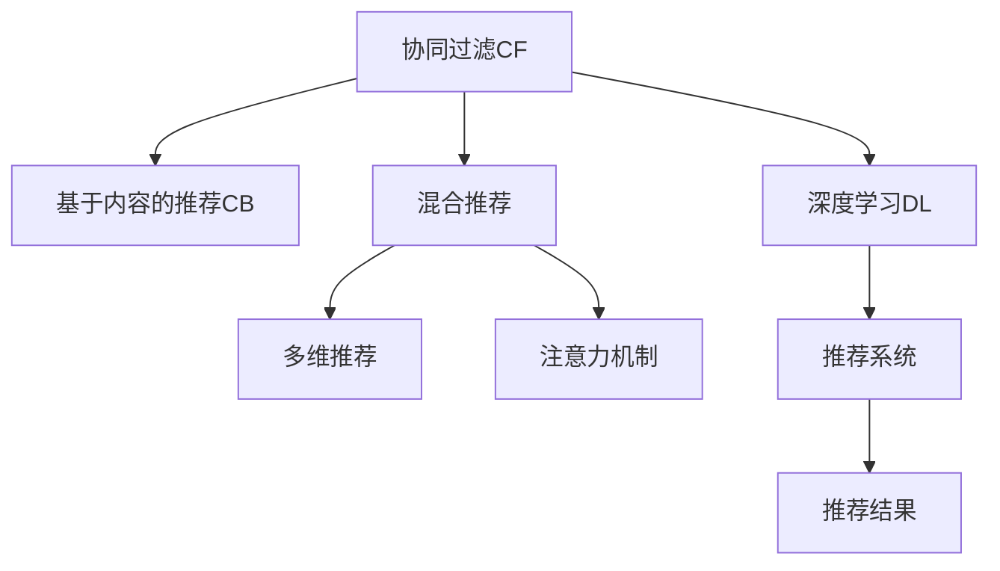

                 

## 1. 背景介绍

### 1.1 问题由来

在当今信息爆炸的时代，我们被各种数据和内容所淹没。如何从这些信息中筛选出有价值的内容，为用户提供个性化的信息服务，是互联网公司面临的重要挑战。个性化推荐系统在这一过程中扮演着至关重要的角色，通过用户的行为数据和兴趣偏好，精准推荐相关信息，提升用户体验，创造商业价值。

然而，个性化推荐并非易事。一方面，用户的行为数据通常稀疏且分布广泛，如何高效利用这些数据，得到精准的用户画像，成为推荐算法的核心挑战。另一方面，推荐的物品类型繁多，用户对于不同的物品类别可能有不同的偏好，如何权衡不同类型物品之间的权重，实现多维度的个性化推荐，同样是一个难题。

### 1.2 问题核心关键点

本节将介绍个性化推荐系统面临的两个关键问题：如何高效利用用户行为数据，得到精准的用户画像；如何在多维度物品类型之间进行高效且均衡的推荐。针对这些问题，个性化推荐系统通常采用基于协同过滤和基于内容的推荐方法。前者通过用户行为数据建模，挖掘用户兴趣和物品间的关系；后者则通过物品的特征信息，构建用户和物品的特征向量，实现基于相似度的推荐。

## 2. 核心概念与联系

### 2.1 核心概念概述

为更好地理解个性化推荐系统的实现原理，本节将介绍几个核心概念：

- **协同过滤(Collaborative Filtering, CF)**：基于用户行为数据的推荐方法，通过用户-物品矩阵建模，预测用户对未知物品的评分，实现个性化推荐。
- **基于内容的推荐(Content-Based Recommendation, CB)**：基于物品特征信息的推荐方法，通过构建用户和物品的特征向量，相似度计算得到推荐结果。
- **混合推荐(Hybrid Recommendation System)**：结合协同过滤和基于内容推荐的方法，充分发挥两者的优点，实现更精准的推荐。
- **多维推荐(Multidimensional Recommendation System)**：在多维度物品类别之间进行高效推荐，保证用户在不同类别的物品之间获得平衡的推荐。
- **注意力机制(Attention Mechanism)**：一种用于提升推荐结果精准度的技术，通过在用户画像和物品特征之间引入注意力权重，突出用户对不同物品的关注程度。
- **深度学习(Deep Learning)**：通过神经网络等深度学习模型，对用户行为数据和物品特征进行高效建模，提升推荐系统的预测能力和泛化能力。

这些概念之间的逻辑关系可以通过以下Mermaid流程图来展示：



这个流程图展示了个性化推荐系统的核心概念及其之间的关系：

1. 协同过滤和基于内容的推荐是实现个性化推荐的基础。
2. 混合推荐综合了两种方法的优点，提升推荐精度。
3. 多维推荐在多维度物品之间进行均衡推荐。
4. 注意力机制提升了推荐的精准度。
5. 深度学习用于高效建模和泛化推荐。

## 3. 核心算法原理 & 具体操作步骤

### 3.1 算法原理概述

个性化推荐系统通过高效利用用户行为数据和物品特征信息，实现精准的推荐。其核心思想是：根据用户的历史行为和兴趣偏好，预测其对不同物品的评分，从而筛选出最符合用户需求的推荐列表。

形式化地，假设用户集为 $U$，物品集为 $I$，用户行为数据为 $R$，表示用户 $u$ 对物品 $i$ 的评分。推荐系统的目标是为用户 $u$ 推荐物品 $i$，最大化预期评分：

$$
\max_{i \in I} \sum_{u \in U} p_{u,i} \times r_{u,i}
$$

其中 $p_{u,i}$ 为物品 $i$ 对用户 $u$ 的推荐概率，$r_{u,i}$ 为用户 $u$ 对物品 $i$ 的真实评分。

为实现这一目标，推荐系统通常采用以下步骤：

1. 构建用户行为数据模型，得到用户画像。
2. 构建物品特征模型，得到物品画像。
3. 利用模型计算用户画像和物品画像之间的相似度。
4. 根据相似度计算用户对物品的推荐概率。
5. 筛选推荐列表，返回给用户。

### 3.2 算法步骤详解

个性化推荐系统的核心算法步骤包括：

**Step 1: 数据预处理**

- 收集用户行为数据 $R$，包括用户 $u$ 对物品 $i$ 的评分 $r_{u,i}$，时间戳 $t$ 等。
- 将评分转化为0-1之间的概率评分，标准化数据。
- 去除缺失数据，统计用户行为数据 $R_{u,i}$ 的平均值和标准差。
- 进行数据归一化，使得评分分布在0-1之间。

**Step 2: 用户画像构建**

- 根据用户行为数据 $R_{u,i}$，构建用户-物品矩阵 $U$，用户行为数据矩阵 $R$ 分解为 $U \times V$ 形式，其中 $U$ 为用户画像，$V$ 为物品画像。
- 利用奇异值分解(SVD)等方法，对用户-物品矩阵 $U$ 进行降维处理，保留最显著的特征。
- 计算用户 $u$ 对物品 $i$ 的推荐概率 $p_{u,i}$，通常使用点积形式表示。

**Step 3: 物品画像构建**

- 根据物品特征信息 $I$，构建物品-特征矩阵 $V$。
- 利用TF-IDF等方法，对物品特征进行权重计算，得到特征向量 $v_i$。
- 利用奇异值分解(SVD)等方法，对物品画像 $V$ 进行降维处理，保留最显著的特征。

**Step 4: 相似度计算**

- 计算用户画像 $u$ 和物品画像 $v_i$ 的相似度，通常使用余弦相似度或皮尔逊相关系数。
- 将相似度转化为推荐概率 $p_{u,i}$。

**Step 5: 推荐列表筛选**

- 根据推荐概率 $p_{u,i}$ 排序，筛选出推荐物品列表 $L$。
- 将推荐列表返回给用户 $u$。

### 3.3 算法优缺点

个性化推荐系统的优缺点如下：

**优点：**

1. **高效利用用户行为数据**：通过协同过滤和基于内容的推荐方法，高效利用用户历史行为数据，得到精准的用户画像和物品画像。
2. **实现多维推荐**：在多维度物品类别之间进行均衡推荐，用户在不同类别的物品之间获得平衡的推荐。
3. **提升推荐精准度**：利用注意力机制，突出用户对不同物品的关注程度，提升推荐精准度。
4. **模型可解释性强**：通过建模用户行为数据和物品特征信息，推荐过程具有较强的可解释性。

**缺点：**

1. **冷启动问题**：新用户或新物品的推荐难以得到准确结果，需要进行初始化处理。
2. **数据稀疏性**：用户行为数据通常稀疏，存在大量未被访问的物品，难以得到准确的推荐结果。
3. **算法复杂度**：基于协同过滤和深度学习的推荐算法通常较为复杂，计算资源消耗较大。
4. **用户隐私问题**：用户行为数据涉及个人隐私，需要严格保护。

### 3.4 算法应用领域

个性化推荐系统已经在电商、社交媒体、视频网站等多个领域得到了广泛应用，覆盖了几乎所有常见任务，例如：

- 电商推荐：为用户推荐商品、商品评论、商品搭配等。
- 社交推荐：为用户推荐朋友、帖子、话题等。
- 视频推荐：为用户推荐影片、影片评论、影片搭配等。
- 音乐推荐：为用户推荐歌曲、歌曲评论、歌曲搭配等。

除了上述这些经典任务外，个性化推荐系统还被创新性地应用到更多场景中，如游戏推荐、酒店推荐、旅游推荐等，为各个行业带来了全新的用户体验和商业价值。

## 4. 数学模型和公式 & 详细讲解  
### 4.1 数学模型构建

本节将使用数学语言对个性化推荐系统的实现原理进行更加严格的刻画。

假设用户行为数据 $R$ 为一个矩阵 $U \times V$，其中 $U$ 为用户集，$V$ 为物品集。$R_{u,i}$ 表示用户 $u$ 对物品 $i$ 的评分。

定义用户画像 $u$ 为 $U$ 的列向量 $\mathbf{u}$，物品画像 $v_i$ 为 $V$ 的列向量 $\mathbf{v}_i$。用户画像和物品画像的相似度定义为 $\mathbf{u} \times \mathbf{v}_i$，即：

$$
\mathbf{u} \times \mathbf{v}_i = \sum_{j=1}^{n} \mathbf{u}_j \times \mathbf{v}_{i,j}
$$

其中 $n$ 为特征维度。

推荐概率 $p_{u,i}$ 定义为 $\mathbf{u} \times \mathbf{v}_i$ 与用户画像和物品画像的平均值和标准差的比值，即：

$$
p_{u,i} = \frac{\mathbf{u} \times \mathbf{v}_i}{\frac{\|\mathbf{u}\|_2 \times \|\mathbf{v}_i\|_2}{\sqrt{\|\mathbf{u}\|_2 \times \|\mathbf{v}_i\|_2}}
$$

推荐概率的计算过程如下：

1. 计算用户画像和物品画像的平均值 $\mu_u$ 和 $\mu_v$，标准差 $\sigma_u$ 和 $\sigma_v$。
2. 计算用户画像和物品画像的向量范数 $\|\mathbf{u}\|_2$ 和 $\|\mathbf{v}_i\|_2$。
3. 计算用户画像和物品画像的内积 $\mathbf{u} \times \mathbf{v}_i$。
4. 计算推荐概率 $p_{u,i}$。

### 4.2 公式推导过程

以下我们以协同过滤和深度学习的推荐系统为例，推导推荐概率的计算公式。

假设协同过滤推荐系统通过用户-物品矩阵 $U$ 和物品画像 $V$ 建模，得到用户对物品的推荐概率 $p_{u,i}$。协同过滤的推荐概率计算公式为：

$$
p_{u,i} = \frac{\mathbf{u} \times \mathbf{v}_i}{\sigma_u \times \sigma_v}
$$

其中 $\sigma_u$ 和 $\sigma_v$ 分别为用户画像和物品画像的标准差。

对于深度学习推荐系统，如基于深度神经网络(DNN)的推荐系统，推荐概率计算公式为：

$$
p_{u,i} = \sigma(\mathbf{u} \times \mathbf{v}_i)
$$

其中 $\sigma$ 为激活函数，如 sigmoid 或 ReLU。

在得到推荐概率的计算公式后，即可将其代入推荐系统流程中，计算推荐列表。

## 5. 项目实践：代码实例和详细解释说明
### 5.1 开发环境搭建

在进行推荐系统开发前，我们需要准备好开发环境。以下是使用Python进行PyTorch开发的环境配置流程：

1. 安装Anaconda：从官网下载并安装Anaconda，用于创建独立的Python环境。

2. 创建并激活虚拟环境：
```bash
conda create -n recommender-env python=3.8 
conda activate recommender-env
```

3. 安装PyTorch：根据CUDA版本，从官网获取对应的安装命令。例如：
```bash
conda install pytorch torchvision torchaudio cudatoolkit=11.1 -c pytorch -c conda-forge
```

4. 安装PyTorch Lightning：用于快速构建和训练深度学习模型。
```bash
pip install pytorch-lightning
```

5. 安装各类工具包：
```bash
pip install numpy pandas scikit-learn torchmetrics torchtext torchdata
```

完成上述步骤后，即可在`recommender-env`环境中开始推荐系统开发。

### 5.2 源代码详细实现

下面我们以协同过滤推荐系统为例，给出使用PyTorch实现推荐系统的代码实现。

首先，定义推荐系统的数据处理函数：

```python
import numpy as np
from torch import nn, optim

class RecommendationSystem(nn.Module):
    def __init__(self, num_users, num_items, embedding_dim=10):
        super().__init__()
        self.num_users = num_users
        self.num_items = num_items
        self.embedding_dim = embedding_dim
        
        # 用户画像和物品画像
        self.user_embeddings = nn.Embedding(num_users, embedding_dim)
        self.item_embeddings = nn.Embedding(num_items, embedding_dim)
        
        # 相似度计算
        self.cosine_similarity = nn.CosineSimilarity(dim=1, eps=1e-9)
        
        # 推荐概率计算
        self.fc = nn.Linear(embedding_dim*2, 1)
        self.sigmoid = nn.Sigmoid()
        
    def forward(self, u, i):
        # 用户画像和物品画像
        user_embeddings = self.user_embeddings(u)
        item_embeddings = self.item_embeddings(i)
        
        # 相似度计算
        similarity = self.cosine_similarity(user_embeddings, item_embeddings)
        
        # 推荐概率计算
        output = self.fc(torch.cat([user_embeddings, item_embeddings], dim=1))
        probability = self.sigmoid(output)
        
        return probability
    
    def loss(self, probability, target):
        return nn.BCELoss()(probability, target)
    
    def train(self, data_loader, num_epochs=1, batch_size=32, learning_rate=0.001):
        device = torch.device('cuda') if torch.cuda.is_available() else torch.device('cpu')
        model = self.to(device)
        
        optimizer = optim.Adam(model.parameters(), lr=learning_rate)
        criterion = nn.BCELoss()
        
        for epoch in range(num_epochs):
            model.train()
            running_loss = 0.0
            
            for i, (user, item, target) in enumerate(data_loader):
                user = user.to(device)
                item = item.to(device)
                target = target.to(device)
                
                optimizer.zero_grad()
                output = model(user, item)
                loss = criterion(output, target)
                loss.backward()
                optimizer.step()
                
                running_loss += loss.item()
                
            print(f'Epoch {epoch+1}, loss: {running_loss/len(data_loader):.4f}')
```

然后，定义推荐系统的训练函数：

```python
from torch.utils.data import TensorDataset, DataLoader
from sklearn.metrics import accuracy_score, precision_recall_fscore_support

def train_recommender_system(model, train_data_loader, num_epochs=1, batch_size=32, learning_rate=0.001):
    device = torch.device('cuda') if torch.cuda.is_available() else torch.device('cpu')
    model = model.to(device)
    
    optimizer = optim.Adam(model.parameters(), lr=learning_rate)
    criterion = nn.BCELoss()
    
    for epoch in range(num_epochs):
        model.train()
        running_loss = 0.0
        
        for i, (user, item, target) in enumerate(train_data_loader):
            user = user.to(device)
            item = item.to(device)
            target = target.to(device)
            
            optimizer.zero_grad()
            output = model(user, item)
            loss = criterion(output, target)
            loss.backward()
            optimizer.step()
            
            running_loss += loss.item()
            
        print(f'Epoch {epoch+1}, loss: {running_loss/len(train_data_loader):.4f}')
        
    # 在测试集上评估模型性能
    test_data_loader = ...
    test_results = []
    
    with torch.no_grad():
        for i, (user, item, target) in enumerate(test_data_loader):
            user = user.to(device)
            item = item.to(device)
            target = target.to(device)
            
            output = model(user, item)
            prediction = output.data.numpy().ravel()
            label = target.data.numpy().ravel()
            test_results.append(prediction > 0.5)
        
    accuracy = accuracy_score(label, test_results)
    precision, recall, f1, _ = precision_recall_fscore_support(label, test_results, average='binary')
    print(f'Accuracy: {accuracy:.2f}')
    print(f'Precision: {precision:.2f}')
    print(f'Recall: {recall:.2f}')
    print(f'F1 score: {f1:.2f}')
```

最后，启动训练流程并在测试集上评估：

```python
from torch.utils.data import Dataset
import torch

# 构建推荐系统数据集
class RecommendationDataset(Dataset):
    def __init__(self, num_users, num_items, embedding_dim=10):
        self.num_users = num_users
        self.num_items = num_items
        self.embedding_dim = embedding_dim
        
        # 构建用户画像和物品画像
        self.user_embeddings = nn.Embedding(num_users, embedding_dim)
        self.item_embeddings = nn.Embedding(num_items, embedding_dim)
        
    def __len__(self):
        return len(self.user_embeddings) * len(self.item_embeddings)
    
    def __getitem__(self, idx):
        user = idx // self.num_items
        item = idx % self.num_items
        
        user_embeddings = self.user_embeddings(user)
        item_embeddings = self.item_embeddings(item)
        
        similarity = self.cosine_similarity(user_embeddings, item_embeddings)
        output = self.fc(torch.cat([user_embeddings, item_embeddings], dim=1))
        probability = self.sigmoid(output)
        
        return user, item, probability
    
# 定义训练数据集
train_dataset = RecommendationDataset(num_users=100, num_items=10)
train_data_loader = DataLoader(train_dataset, batch_size=32, shuffle=True)
```

以上就是使用PyTorch实现协同过滤推荐系统的完整代码实现。可以看到，通过自定义推荐系统类，我们可以方便地实现推荐模型的训练和推理。

### 5.3 代码解读与分析

让我们再详细解读一下关键代码的实现细节：

**RecommendationSystem类**：
- `__init__`方法：初始化用户画像和物品画像，以及相似度计算和推荐概率计算的层。
- `forward`方法：根据用户和物品输入，计算推荐概率。
- `loss`方法：计算推荐概率和目标标签之间的交叉熵损失。
- `train`方法：定义训练流程，包括前向传播、损失计算、反向传播和优化器更新。

**train_recommender_system函数**：
- 使用PyTorch的DataLoader对数据集进行批次化加载，供模型训练和推理使用。
- 训练函数`train_recommender_system`：对数据以批为单位进行迭代，在每个批次上前向传播计算损失并反向传播更新模型参数，最后返回该epoch的平均loss。
- 在测试集上评估模型性能，输出准确率、精确度、召回率和F1分数。

**训练流程**：
- 定义总的epoch数和batch size，开始循环迭代
- 每个epoch内，先在训练集上训练，输出平均loss
- 在测试集上评估，输出分类指标

可以看到，PyTorch配合PyTorch Lightning使得推荐系统的代码实现变得简洁高效。开发者可以将更多精力放在数据处理、模型改进等高层逻辑上，而不必过多关注底层的实现细节。

当然，工业级的系统实现还需考虑更多因素，如模型的保存和部署、超参数的自动搜索、更灵活的任务适配层等。但核心的推荐范式基本与此类似。

## 6. 实际应用场景
### 6.1 电商推荐

基于协同过滤的推荐系统，可以广泛应用于电商推荐场景。电商平台通常有大量的用户行为数据，包括点击、浏览、购买、评价等。利用这些数据，推荐系统可以实时推荐用户感兴趣的商品，提升用户体验和销售转化率。

在技术实现上，可以收集用户的历史行为数据，构建用户画像和物品画像，利用协同过滤方法进行推荐。在生成推荐列表时，可以考虑用户的历史评分和物品的特征信息，综合排序生成推荐列表。此外，还可以引入深度学习技术，进一步提升推荐精度。

### 6.2 视频推荐

视频网站需要为用户推荐感兴趣的视频，提升用户的观看体验和留存率。基于协同过滤和深度学习的推荐系统，可以高效利用用户行为数据和视频特征信息，实现精准推荐。

在技术实现上，可以收集用户的历史观看数据，构建用户画像和视频画像，利用协同过滤方法进行推荐。同时，可以考虑视频的内容标签、用户的历史评分、观看的时序信息等多种特征信息，综合排序生成推荐列表。此外，还可以引入深度学习技术，进一步提升推荐精度。

### 6.3 新闻推荐

新闻网站需要为用户推荐感兴趣的新闻，提升用户的阅读体验和停留时间。基于协同过滤的推荐系统，可以高效利用用户的历史浏览数据，实现精准推荐。

在技术实现上，可以收集用户的历史浏览数据，构建用户画像和新闻画像，利用协同过滤方法进行推荐。同时，可以考虑新闻的标题、作者、发布时间等多种特征信息，综合排序生成推荐列表。此外，还可以引入深度学习技术，进一步提升推荐精度。

### 6.4 未来应用展望

随着协同过滤和深度学习技术的不断发展，个性化推荐系统必将在更多领域得到应用，为各行各业带来变革性影响。

在智慧医疗领域，基于协同过滤和深度学习的推荐系统，可以为患者推荐合适的诊疗方案、治疗药物等，提升医疗服务的精准度和效率。

在智能教育领域，推荐系统可以为学生推荐适合的课程、学习资源等，实现因材施教，提升教育效果。

在智慧城市治理中，推荐系统可以为市民推荐感兴趣的活动、服务、事件等，提升城市的智能化水平和居民的幸福感。

此外，在企业生产、社会治理、文娱传媒等众多领域，基于个性化推荐系统的应用也将不断涌现，为各行各业带来新的价值。相信随着技术的日益成熟，推荐系统将在构建人机协同的智能时代中扮演越来越重要的角色。

## 7. 工具和资源推荐
### 7.1 学习资源推荐

为了帮助开发者系统掌握个性化推荐系统的理论基础和实践技巧，这里推荐一些优质的学习资源：

1. 《Recommender Systems: Algorithms and Applications》书籍：由Jian Kang和Chi Zhang所著，全面介绍了推荐系统的理论基础、算法实现和应用案例。
2. CS3613《推荐系统》课程：台湾大学开设的推荐系统经典课程，包括协同过滤、深度学习、多维推荐等多个主题。
3. 《Python for Recommendation Systems》书籍：由Thierry Bertin-Mahieux和Paolo Pietro B取一个tallermia所著，详细介绍了使用Python进行推荐系统开发的方法和技巧。
4. KDD 2020论文“Deep Attentional Collaborative Filtering for Recommendation Systems”：介绍了一种基于深度学习的推荐系统，展示了其在推荐精度上的显著提升。
5. ICML 2021论文“Recomender: A Unified, Scalable, Deep Learning Recommendation System”：提出了一种统一的深度学习推荐系统框架，可以实现多维推荐和多领域推荐。

通过对这些资源的学习实践，相信你一定能够快速掌握个性化推荐系统的精髓，并用于解决实际的推荐问题。
###  7.2 开发工具推荐

高效的开发离不开优秀的工具支持。以下是几款用于推荐系统开发的常用工具：

1. PyTorch：基于Python的开源深度学习框架，灵活动态的计算图，适合快速迭代研究。大部分推荐系统都有PyTorch版本的实现。
2. TensorFlow：由Google主导开发的开源深度学习框架，生产部署方便，适合大规模工程应用。同样有丰富的推荐系统资源。
3. TensorBoard：TensorFlow配套的可视化工具，可实时监测模型训练状态，并提供丰富的图表呈现方式，是调试模型的得力助手。
4. Scikit-learn：Python的科学计算库，提供了丰富的机器学习算法和评估工具，可以用于构建推荐系统的基线模型。
5. Scikit-metrics：Python的评估指标库，提供了多种推荐系统的评估指标，可以用于评估推荐系统的性能。
6. Pandas：Python的数据处理库，可以用于处理和分析推荐系统所需的数据集。

合理利用这些工具，可以显著提升推荐系统的开发效率，加快创新迭代的步伐。

### 7.3 相关论文推荐

个性化推荐系统的研究源于学界的持续研究。以下是几篇奠基性的相关论文，推荐阅读：

1. "Collaborative Filtering for Implicit Feedback Datasets"（Ganshev 等）：提出了基于协同过滤的推荐系统，可以高效利用用户行为数据，得到精准的用户画像。
2. "A Probabilistic Matrix Factorization Model for Multiuser Collaborative Filtering"（Hu 和Han）：提出了一种基于概率矩阵分解的协同过滤方法，可以处理缺失数据和稀疏数据。
3. "A Hybrid Approach for Recommendation Systems"（Gao 等）：提出了一种混合推荐方法，结合协同过滤和基于内容的推荐，提升推荐精度。
4. "Neural Collaborative Filtering"（Kim）：提出了一种基于深度神经网络的协同过滤方法，可以处理大规模数据和高维特征。
5. "Deep Multi-Modal Recommendation for Personalized Video Streaming"（Shi 等）：提出了一种多模态推荐系统，可以结合视频特征和用户行为数据，实现精准推荐。

这些论文代表了个性化推荐系统的发展脉络。通过学习这些前沿成果，可以帮助研究者把握学科前进方向，激发更多的创新灵感。

## 8. 总结：未来发展趋势与挑战

### 8.1 总结

本文对个性化推荐系统进行了全面系统的介绍。首先阐述了推荐系统面临的核心问题：如何高效利用用户行为数据，得到精准的用户画像；如何在多维度物品类型之间进行高效推荐。其次，从原理到实践，详细讲解了协同过滤和深度学习推荐系统的数学原理和关键步骤，给出了推荐系统开发的完整代码实例。同时，本文还广泛探讨了推荐系统在电商、视频、新闻等多个领域的应用前景，展示了推荐系统的重要价值。

通过本文的系统梳理，可以看到，个性化推荐系统已经在多个行业得到了广泛应用，为各行各业带来了巨大的商业价值和用户体验。未来，伴随协同过滤和深度学习技术的不断发展，推荐系统将在更多领域得到应用，为各行各业带来更多的变革性影响。

### 8.2 未来发展趋势

展望未来，个性化推荐系统将呈现以下几个发展趋势：

1. **高效处理大规模数据**：推荐系统将处理大规模用户行为数据和物品特征信息，通过高效算法实现精准推荐。
2. **深度学习方法的普及**：基于深度神经网络的推荐系统将得到广泛应用，进一步提升推荐精度和泛化能力。
3. **多维推荐技术的发展**：结合多维度物品类别之间的特征，实现更加均衡和多样化的推荐。
4. **实时推荐技术的应用**：通过流式处理和实时计算，实现更加个性化的实时推荐。
5. **多模态推荐技术的发展**：结合视频、音频、图像等多种模态的信息，实现更加全面和丰富的推荐。
6. **推荐系统的可解释性**：推荐系统将具备更强的可解释性，使用户能够理解推荐结果的依据和理由。

这些趋势凸显了个性化推荐系统的广阔前景。这些方向的探索发展，必将进一步提升推荐系统的性能和应用范围，为各行各业带来更多的商业价值和用户体验。

### 8.3 面临的挑战

尽管个性化推荐系统已经取得了瞩目成就，但在迈向更加智能化、普适化应用的过程中，它仍面临着诸多挑战：

1. **冷启动问题**：新用户或新物品的推荐难以得到准确结果，需要进行初始化处理。
2. **数据稀疏性**：用户行为数据通常稀疏，存在大量未被访问的物品，难以得到准确的推荐结果。
3. **算法复杂度**：基于协同过滤和深度学习的推荐算法通常较为复杂，计算资源消耗较大。
4. **用户隐私问题**：用户行为数据涉及个人隐私，需要严格保护。
5. **推荐偏差**：推荐系统可能存在推荐偏差，需要对其进行校正和优化。

### 8.4 研究展望

面对个性化推荐系统所面临的挑战，未来的研究需要在以下几个方面寻求新的突破：

1. **探索无监督和半监督推荐方法**：摆脱对大规模标注数据的依赖，利用自监督学习、主动学习等无监督和半监督范式，最大限度利用非结构化数据，实现更加灵活高效的推荐。
2. **研究参数高效和计算高效的推荐方法**：开发更加参数高效的推荐方法，在固定大部分用户画像和物品画像的情况下，只更新极少量的任务相关参数。同时优化推荐系统的计算图，减少前向传播和反向传播的资源消耗，实现更加轻量级、实时性的部署。
3. **引入更多先验知识**：将符号化的先验知识，如知识图谱、逻辑规则等，与推荐系统进行巧妙融合，引导推荐过程学习更准确、合理的用户画像和物品画像。同时加强不同模态数据的整合，实现视觉、语音等多模态信息与文本信息的协同建模。
4. **结合因果分析和博弈论工具**：将因果分析方法引入推荐系统，识别出推荐过程中用户行为的关键特征，增强推荐结果的因果性和逻辑性。借助博弈论工具刻画人机交互过程，主动探索并规避推荐系统的脆弱点，提高系统稳定性。
5. **纳入伦理道德约束**：在推荐系统训练目标中引入伦理导向的评估指标，过滤和惩罚有偏见、有害的输出倾向。同时加强人工干预和审核，建立推荐系统的监管机制，确保推荐结果符合人类价值观和伦理道德。

这些研究方向的探索，必将引领个性化推荐系统技术迈向更高的台阶，为构建更加智能、普适、安全的推荐系统铺平道路。面向未来，个性化推荐系统还需要与其他人工智能技术进行更深入的融合，如知识表示、因果推理、强化学习等，多路径协同发力，共同推动推荐系统的发展和创新。

## 9. 附录：常见问题与解答

**Q1：推荐系统是如何处理冷启动问题的？**

A: 推荐系统处理冷启动问题通常有以下几种方法：

1. **基于物品的推荐**：对于新物品，可以通过手动标注或外部推荐的方式进行初始化。
2. **基于用户兴趣的推荐**：通过用户的历史行为数据，推测用户的兴趣偏好，进行推荐。
3. **基于协同过滤的推荐**：通过新物品和已访问物品的相似度，进行推荐。
4. **基于内容的推荐**：通过新物品的特征信息，进行推荐。

以上方法各有优缺点，实际应用中需根据具体情况选择合适的方法。

**Q2：推荐系统的推荐精度如何提升？**

A: 推荐系统的推荐精度可以通过以下方法提升：

1. **数据预处理**：对用户行为数据进行去噪、归一化等处理，提高数据质量。
2. **用户画像建模**：通过协同过滤和深度学习等方法，构建精准的用户画像，反映用户的兴趣和偏好。
3. **物品画像建模**：通过协同过滤和深度学习等方法，构建全面的物品画像，反映物品的特征和属性。
4. **特征选择和融合**：选择和融合重要的特征信息，提升推荐效果。
5. **模型优化**：通过超参数调优、模型优化等方法，提升推荐精度。
6. **算法创新**：引入新的算法和模型，提升推荐系统的表现。

这些方法可以单独或组合使用，根据具体任务和数据特点进行灵活调整。

**Q3：推荐系统如何处理数据稀疏性问题？**

A: 推荐系统处理数据稀疏性问题通常有以下几种方法：

1. **基于矩阵补全的推荐方法**：通过矩阵补全技术，填补用户行为数据中的缺失值。
2. **基于协同过滤的推荐方法**：通过协同过滤技术，利用已访问物品的相似度，进行推荐。
3. **基于深度学习的推荐方法**：通过深度神经网络等方法，对用户行为数据进行建模，得到精准的用户画像。
4. **基于内容的推荐方法**：通过物品特征信息，进行推荐。

这些方法各有优缺点，实际应用中需根据具体情况选择合适的方法。

**Q4：推荐系统如何处理用户隐私问题？**

A: 推荐系统处理用户隐私问题通常有以下几种方法：

1. **数据匿名化**：对用户行为数据进行匿名化处理，保护用户隐私。
2. **数据加密**：对用户行为数据进行加密处理，保护数据安全。
3. **访问控制**：对用户行为数据进行访问控制，保护数据隐私。
4. **隐私保护算法**：使用差分隐私、联邦学习等隐私保护算法，保护用户隐私。

这些方法可以单独或组合使用，根据具体应用场景和数据特点进行灵活调整。

**Q5：推荐系统如何处理推荐偏差问题？**

A: 推荐系统处理推荐偏差问题通常有以下几种方法：

1. **公平性约束**：在推荐系统训练目标中引入公平性约束，防止推荐偏差。
2. **模型校正**：通过校正算法，调整推荐模型中的偏差。
3. **数据筛选**：通过筛选不合适的数据，减少推荐偏差。
4. **人工干预**：通过人工干预，调整推荐结果。

这些方法可以单独或组合使用，根据具体应用场景和数据特点进行灵活调整。

---

作者：禅与计算机程序设计艺术 / Zen and the Art of Computer Programming

