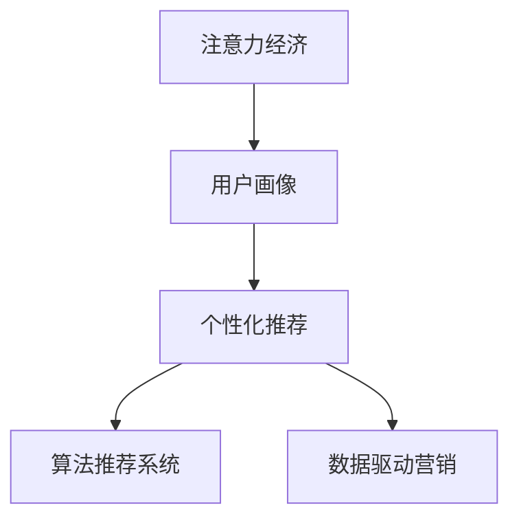

                 

# 注意力经济与个性化营销策略与实践：为受众创建定制体验

> 关键词：注意力经济,个性化营销,客户体验,定制化策略,营销自动化,用户画像,算法推荐,大数据分析

## 1. 背景介绍

### 1.1 问题由来

在信息爆炸的今天，消费者面对海量的商品和服务信息，注意力成为稀缺资源。如何在众多竞争者中脱颖而出，吸引和留住客户，成为企业关注的焦点。传统广撒网的营销模式已难以满足个性化需求，如何构建个性化的营销策略，成为品牌成功的重要保证。

个性化营销的核心在于了解和预测用户的偏好与行为，为其提供定制化的服务和产品。通过对用户的分析，形成完整精准的用户画像，构建定制化的内容与体验，以提升用户满意度和忠诚度。

### 1.2 问题核心关键点

个性化营销策略的核心在于以下三个方面：

1. **数据驱动**：通过大数据分析，理解用户的行为模式和偏好。
2. **技术支撑**：应用机器学习、推荐系统等算法，精准匹配用户需求。
3. **实践应用**：在实际业务场景中，设计并执行个性化的营销活动。

### 1.3 问题研究意义

个性化营销通过数据驱动和精准匹配，能够显著提升用户体验，增强用户粘性。对于企业而言，可以优化资源配置，提高营销效率和ROI。

- **用户满意度**：个性化推荐能够提供符合用户兴趣和需求的内容，增强用户体验。
- **品牌忠诚度**：定制化的服务能够建立品牌与用户的深度连接，提升用户对品牌的忠诚度。
- **运营效率**：精准的用户细分和营销策略，能显著提高营销活动的效果和ROI，降低运营成本。
- **市场竞争力**：个性化策略有助于企业在激烈的市场竞争中脱颖而出，构建竞争优势。

## 2. 核心概念与联系

### 2.1 核心概念概述

为更好地理解个性化营销策略，本节将介绍几个密切相关的核心概念：

- **注意力经济**：基于用户注意力的经济模型，强调在信息过载时代，获取和保持用户注意力的重要性。
- **用户画像**：通过数据采集和分析，形成关于用户属性、行为、偏好等方面的全面画像。
- **个性化推荐**：利用算法为用户推荐其感兴趣的产品或内容，提升用户满意度和转化率。
- **算法推荐系统**：使用机器学习算法，根据用户的历史行为数据，预测其未来行为和偏好，实现个性化推荐。
- **数据驱动营销**：通过数据分析和挖掘，洞察用户需求，指导营销策略的设计和执行。

这些概念之间的逻辑关系可以通过以下Mermaid流程图来展示：



这个流程图展示了好几个核心概念之间的联系：注意力经济是基础，用户画像和数据驱动营销提供了用户洞察，算法推荐系统实现个性化推荐，最终形成一套完整的个性化营销策略。

## 3. 核心算法原理 & 具体操作步骤
### 3.1 算法原理概述

个性化营销策略的核心在于通过数据驱动和算法支持，为用户提供符合其兴趣和需求的产品或服务。其核心算法主要包括用户画像构建、个性化推荐、多模态数据分析等。

个性化推荐的核心在于利用用户的历史行为数据，通过算法预测其未来行为，实现精准匹配。常用的个性化推荐算法包括基于协同过滤的推荐、基于内容的推荐、基于混合策略的推荐等。

用户画像构建则通过数据分析和挖掘，形成关于用户属性、行为、偏好等方面的全面画像。常用的用户画像构建方法包括聚类分析、分类分析、回归分析等。

### 3.2 算法步骤详解

#### 3.2.1 用户画像构建

**步骤1：数据收集**  
收集用户的各类行为数据，包括浏览历史、购买记录、社交媒体互动等。

**步骤2：数据清洗与预处理**  
去除冗余和异常数据，对数据进行标准化处理，准备后续分析。

**步骤3：特征提取与选择**  
从原始数据中提取有意义的特征，如浏览时长、购买频率、兴趣爱好等。

**步骤4：模型训练与评估**  
使用机器学习模型，如聚类、分类、回归等，训练用户画像模型，并进行评估和优化。

**步骤5：画像更新与维护**  
定期更新和维护用户画像，确保其时效性和准确性。

#### 3.2.2 个性化推荐

**步骤1：用户行为建模**  
根据用户的历史行为数据，建立用户行为模型，如协同过滤、基于内容的推荐等。

**步骤2：推荐算法选择与设计**  
选择合适的推荐算法，并设计相应的参数和策略。

**步骤3：模型训练与优化**  
使用用户行为数据和推荐目标，训练推荐模型，并进行模型评估和优化。

**步骤4：推荐实现与迭代**  
将训练好的模型应用于实际推荐场景，根据用户反馈和数据表现，持续迭代优化。

#### 3.2.3 数据驱动营销

**步骤1：数据采集与分析**  
收集关于市场、用户、竞争对手等各类数据，进行多维度分析。

**步骤2：营销策略设计**  
根据数据分析结果，设计符合用户需求和市场趋势的营销策略。

**步骤3：营销活动执行**  
在指定的时间和渠道，执行营销活动，并通过数据分析评估效果。

**步骤4：策略优化与调整**  
根据营销活动的效果和反馈，优化营销策略，并灵活调整执行方案。

### 3.3 算法优缺点

个性化营销策略具有以下优点：

1. **提升用户体验**：通过个性化推荐，提供符合用户兴趣和需求的产品，提升用户满意度。
2. **增强品牌忠诚度**：定制化的服务能够建立品牌与用户的深度连接，提升用户忠诚度。
3. **优化运营效率**：精准的用户细分和营销策略，能显著提高营销活动的效果和ROI，降低运营成本。
4. **构建竞争优势**：个性化策略有助于企业在激烈的市场竞争中脱颖而出，构建竞争优势。

然而，个性化营销策略也存在一些局限性：

1. **隐私与伦理问题**：数据收集和使用过程中可能涉及隐私问题，需严格遵守相关法规。
2. **数据质量与算法准确性**：用户数据的准确性和推荐算法的准确性直接影响个性化策略的效果。
3. **用户接受度**：过度个性化的推荐可能让用户感到不适，需要找到平衡点。
4. **技术复杂度**：个性化策略需要复杂的算法和数据分析技术支持，实施成本较高。

尽管存在这些局限性，但就目前而言，个性化营销策略仍然是提高用户体验和市场竞争力的重要手段。未来相关研究的重点在于如何进一步降低实施成本，提高数据准确性和算法性能，同时兼顾用户隐私和伦理问题。

### 3.4 算法应用领域

个性化营销策略在多个领域都有广泛应用，例如：

- **电子商务**：通过个性化推荐，提升用户购买率和转化率。
- **社交媒体**：根据用户兴趣，推送个性化的内容，增加用户粘性。
- **在线教育**：根据学生的学习行为，推荐合适的学习资源和课程。
- **旅游推荐**：根据用户的偏好和历史行为，推荐个性化的旅游路线和目的地。
- **金融服务**：通过个性化推荐，提升用户理财和投资决策的精准性。

除了上述这些领域，个性化营销策略还被应用于更多场景中，如智能家居、智慧城市、健康医疗等，为各行各业带来了新一轮的变革。

## 4. 数学模型和公式 & 详细讲解  
### 4.1 数学模型构建

在个性化推荐系统中，常用的数学模型包括协同过滤、基于内容的推荐、混合推荐等。以协同过滤为例，其数学模型可形式化为：

$$
\hat{y}_{ui} = \frac{\sum_{j=1}^{n} r_{uji} y_{ji}}{\sqrt{\sum_{j=1}^{n} r_{uji}^2 + \epsilon}}
$$

其中，$y_{ui}$ 为预测用户 $u$ 对物品 $i$ 的评分，$y_{ji}$ 为物品 $i$ 的真实评分，$r_{uji}$ 为用户 $u$ 与物品 $i$ 的评分相关度，$\epsilon$ 为正则项，防止分母为0。

### 4.2 公式推导过程

假设用户 $u$ 对物品 $i$ 的评分 $y_{ui}$ 已知，可以通过协同过滤模型预测用户 $u$ 对物品 $i$ 的评分。设物品 $i$ 的真实评分为 $y_{ji}$，用户 $u$ 与物品 $i$ 的评分相关度为 $r_{uji}$。

$$
\hat{y}_{ui} = \frac{\sum_{j=1}^{n} r_{uji} y_{ji}}{\sqrt{\sum_{j=1}^{n} r_{uji}^2 + \epsilon}}
$$

上式中，分子 $\sum_{j=1}^{n} r_{uji} y_{ji}$ 表示用户 $u$ 对物品 $i$ 的评分预测，$\sqrt{\sum_{j=1}^{n} r_{uji}^2 + \epsilon}$ 表示评分相关度的权重。通过这个公式，可以计算出用户 $u$ 对物品 $i$ 的评分预测。

### 4.3 案例分析与讲解

以电商平台为例，协同过滤推荐系统可以通过用户对商品的浏览和购买历史，预测其对新商品的评分。设用户 $u$ 对物品 $i$ 的评分 $y_{ui}$ 已知，物品 $i$ 的真实评分为 $y_{ji}$，用户 $u$ 与物品 $i$ 的评分相关度为 $r_{uji}$。

假设用户 $u$ 对物品 $i$ 的评分为 4，共查看过物品 $j_1, j_2, j_3$。物品 $i$ 的真实评分为 5，共获得 $j_1, j_2, j_3$ 的评分 3, 4, 2。用户 $u$ 与物品 $i$ 的评分相关度为 0.8。

根据公式：

$$
\hat{y}_{ui} = \frac{0.8 \times 3 + 0.8 \times 4 + 0.8 \times 2}{\sqrt{0.8^2 + 0.8^2 + 0.8^2 + \epsilon}}
$$

计算得到：

$$
\hat{y}_{ui} = \frac{0.8 \times 3 + 0.8 \times 4 + 0.8 \times 2}{\sqrt{0.8^2 + 0.8^2 + 0.8^2 + 0.01}}
$$

$$
\hat{y}_{ui} = 3.6
$$

由此，预测用户 $u$ 对物品 $i$ 的评分为 3.6，可以为其推荐相应的商品。

## 5. 项目实践：代码实例和详细解释说明
### 5.1 开发环境搭建

在进行个性化营销策略开发前，我们需要准备好开发环境。以下是使用Python进行推荐系统开发的环境配置流程：

1. 安装Anaconda：从官网下载并安装Anaconda，用于创建独立的Python环境。

2. 创建并激活虚拟环境：
```bash
conda create -n recommendation-env python=3.8 
conda activate recommendation-env
```

3. 安装推荐系统依赖包：
```bash
pip install scikit-learn pandas numpy scipy sklearn-feature-extraction textblob gensim
```

4. 安装Scikit-learn和Scikit-learn-feature-extraction：
```bash
pip install scikit-learn sklearn-feature-extraction
```

完成上述步骤后，即可在`recommendation-env`环境中开始推荐系统开发。

### 5.2 源代码详细实现

这里我们以协同过滤推荐系统为例，给出使用Scikit-learn库实现的代码实现。

首先，定义协同过滤模型：

```python
from sklearn.feature_extraction.text import TfidfVectorizer
from sklearn.metrics.pairwise import cosine_similarity
from sklearn.decomposition import TruncatedSVD

# 定义协同过滤推荐系统
class CollaborativeFiltering:
    def __init__(self, n_components=20):
        self.n_components = n_components
        self.vectorizer = TfidfVectorizer()
        self.recommender = TruncatedSVD(n_components=n_components)
        
    def fit(self, data):
        # 构建用户-商品矩阵
        user_item = {}
        for user, items in data.items():
            for item in items:
                if item not in user_item:
                    user_item[item] = []
                user_item[item].append(user)
                
        # 计算物品间的相似度矩阵
        X = self.vectorizer.fit_transform(user_item.values())
        self.similarity_matrix = cosine_similarity(X)
        
        # 训练SVD模型
        self.recommender.fit(X)
        
    def predict(self, user, top_n=5):
        # 计算用户对所有物品的评分
        X = self.vectorizer.transform([user])
        user_scores = self.recommender.transform(X).toarray()[0]
        
        # 计算物品的推荐分数
        recommends = [(i, self.similarity_matrix[i, :].dot(user_scores)) for i in range(len(user_scores))]
        
        # 对物品进行降序排序，获取推荐列表
        recommends.sort(key=lambda x: x[1], reverse=True)
        recommends = [x[0] for x in recommends[:top_n]]
        return recommends
```

然后，定义数据集和测试函数：

```python
# 定义推荐数据集
data = {
    'user1': ['item1', 'item3', 'item5'],
    'user2': ['item2', 'item4', 'item6'],
    'user3': ['item5', 'item6', 'item7'],
    'user4': ['item1', 'item2', 'item8'],
    'user5': ['item3', 'item4', 'item9']
}

# 定义测试函数
def test_model(model, data):
    for user in data.keys():
        recommends = model.predict(user)
        print(f"推荐物品列表：{recommends}")
```

最后，启动测试流程：

```python
# 创建协同过滤模型
model = CollaborativeFiltering()

# 训练模型
model.fit(data)

# 测试模型
test_model(model, data)
```

这就是使用Scikit-learn实现协同过滤推荐系统的完整代码实现。可以看到，通过简单的数据结构和Scikit-learn库，就可以快速实现一个基本的推荐系统。

### 5.3 代码解读与分析

让我们再详细解读一下关键代码的实现细节：

**CollaborativeFiltering类**：
- `__init__`方法：初始化协同过滤模型的关键参数，如维度数 `n_components`，以及向量化和SVD组件。
- `fit`方法：构建用户-物品矩阵，计算物品间的相似度矩阵，训练SVD模型。
- `predict`方法：根据用户输入和模型参数，计算并返回推荐物品列表。

**data字典**：
- 定义推荐数据集，包含用户和物品的关联列表。

**test_model函数**：
- 测试模型时，遍历所有用户，调用`predict`方法生成推荐物品列表，并打印输出。

通过这些代码，可以看到Scikit-learn的强大封装能力，使得推荐系统的开发变得简单高效。开发者可以将更多精力放在数据处理和模型改进等高层逻辑上，而不必过多关注底层的实现细节。

当然，工业级的系统实现还需考虑更多因素，如推荐引擎的性能优化、推荐结果的呈现方式等。但核心的推荐范式基本与此类似。

## 6. 实际应用场景
### 6.1 电商平台个性化推荐

在电商平台中，个性化推荐系统是最常见的应用之一。通过分析用户的浏览、购买历史，推荐其可能感兴趣的商品，提升用户体验和转化率。

在实际应用中，可以利用用户画像数据和协同过滤模型，实现更精准的推荐。例如，某用户经常购买运动鞋和服饰，系统可以推荐相关品牌和款式。若用户最近关注了某品牌的新款运动鞋，系统则可以推荐该品牌的相关商品，满足其个性化需求。

### 6.2 在线视频平台推荐

在线视频平台也需要个性化推荐系统，推荐用户可能感兴趣的视频内容，提升观看体验。通过分析用户的历史观看记录、评分记录和行为数据，可以构建详细的用户画像，进一步提升推荐效果。

例如，某用户最近看了多部科幻电影，系统可以推荐该用户可能感兴趣的科幻系列剧和短片，提升其观影体验。系统还可以通过电影评论和评分数据，学习用户的口味偏好，推荐更多符合其兴趣的内容。

### 6.3 社交媒体内容推荐

社交媒体平台需要对用户进行个性化内容推荐，提升用户粘性和互动率。通过分析用户的点赞、评论、分享等行为数据，可以构建用户画像，推荐其可能感兴趣的内容。

例如，某用户经常在社交媒体上关注某类话题，系统可以推荐相关主题的文章、视频和直播，满足其兴趣需求。同时，系统还可以根据用户的互动情况，动态调整推荐内容，增强其参与度。

### 6.4 未来应用展望

随着个性化推荐技术的不断发展，未来将在更多领域得到应用，为各行各业带来新一轮的变革。

在智慧医疗领域，个性化推荐系统可以用于患者健康管理，推荐适合的饮食、运动和生活习惯，提升其健康水平。

在智能家居领域，推荐系统可以推荐符合用户需求的产品和服务，提升居住体验和便利性。

在智慧城市治理中，推荐系统可以用于交通规划、环保监测等领域，提升城市管理效率。

除了上述这些领域，个性化推荐系统还被应用于更多场景中，如智慧教育、金融服务、文娱传媒等，为各行各业带来了新一轮的创新和变革。

## 7. 工具和资源推荐
### 7.1 学习资源推荐

为了帮助开发者系统掌握个性化营销策略的理论基础和实践技巧，这里推荐一些优质的学习资源：

1. 《推荐系统实战》系列书籍：详细介绍了推荐系统的原理和实现方法，涵盖协同过滤、基于内容的推荐、混合策略等多种推荐算法。

2. 《Python推荐系统》视频课程：介绍推荐系统的基本概念和实现细节，讲解了Scikit-learn等库的使用方法。

3. 《深度学习推荐系统》课程：斯坦福大学开设的深度学习课程，包含推荐系统的基本原理和前沿研究。

4. 《个性化推荐系统》论文：综述了个性化推荐系统的发展历程和最新研究进展，提供了丰富的学习资源。

5. Kaggle推荐系统竞赛：参加竞赛可以学习实际推荐系统的构建和优化方法，提升实战能力。

通过对这些资源的学习实践，相信你一定能够快速掌握个性化推荐系统的精髓，并用于解决实际的推荐问题。

### 7.2 开发工具推荐

高效的开发离不开优秀的工具支持。以下是几款用于推荐系统开发的常用工具：

1. PyTorch：基于Python的开源深度学习框架，灵活高效的计算图，适合快速迭代研究。

2. TensorFlow：由Google主导开发的开源深度学习框架，生产部署方便，适合大规模工程应用。

3. Scikit-learn：Python机器学习库，提供丰富的算法和工具，适合快速开发和测试。

4. Spark：Apache基金会开发的分布式计算框架，适合大规模数据处理和推荐系统开发。

5. Hadoop：Apache基金会开发的分布式计算框架，适合大规模数据存储和处理。

合理利用这些工具，可以显著提升推荐系统的开发效率，加快创新迭代的步伐。

### 7.3 相关论文推荐

推荐系统的研究源于学界的持续研究。以下是几篇奠基性的相关论文，推荐阅读：

1. The BellKor 2011 P radically Simple Recommendation System（2010年KDD杯冠军论文）：提出了基于协同过滤的推荐系统框架，开创了推荐系统研究的新篇章。

2. Generalized Alternating Least Squares（GALS）（2016年KDD冠军论文）：提出了混合推荐策略，结合协同过滤和基于内容的推荐，取得了更优的推荐效果。

3. Implicit Feature Alignment for Personalized Ranking（ICDM 2012）：提出特征对齐方法，增强推荐系统的效果和鲁棒性。

4. Large-Scale Parallel Collaborative Filtering（KDD 2009）：介绍了基于Spark的协同过滤推荐系统，适合大规模数据处理。

5. Deep Interest Networks for Recommendation Systems（KDD 2018）：提出深度兴趣网络，通过神经网络进行推荐，提升推荐系统的准确性和可解释性。

这些论文代表了个性化推荐系统的发展脉络。通过学习这些前沿成果，可以帮助研究者把握学科前进方向，激发更多的创新灵感。

## 8. 总结：未来发展趋势与挑战

### 8.1 总结

本文对个性化营销策略进行了全面系统的介绍。首先阐述了个性化推荐策略的研究背景和意义，明确了其在提升用户体验和市场竞争力方面的重要价值。其次，从原理到实践，详细讲解了个性化推荐系统的数学模型和核心算法，给出了推荐系统开发的完整代码实例。同时，本文还广泛探讨了个性化推荐系统在电商平台、在线视频平台、社交媒体等多个行业领域的应用前景，展示了推荐策略的巨大潜力。此外，本文精选了推荐系统的各类学习资源，力求为读者提供全方位的技术指引。

通过本文的系统梳理，可以看到，个性化推荐系统通过数据驱动和算法支持，能够显著提升用户体验和市场竞争力。未来的推荐系统还将不断演进，通过引入更多先验知识、多模态数据融合等前沿技术，进一步提升推荐效果。

### 8.2 未来发展趋势

展望未来，个性化推荐系统将呈现以下几个发展趋势：

1. **多模态数据融合**：结合文本、图片、视频等多模态数据，提升推荐系统的丰富性和准确性。

2. **深度学习与强化学习结合**：通过深度学习和强化学习结合，实现更加个性化和动态的推荐。

3. **联邦学习与隐私保护**：在分布式环境下，利用联邦学习保护用户隐私，同时提升推荐系统的鲁棒性。

4. **实时推荐与流数据处理**：实时处理用户行为数据，动态更新推荐模型，提供更加精准的推荐。

5. **推荐结果的可解释性**：增强推荐结果的可解释性，让用户理解推荐逻辑，提升用户信任度。

这些趋势凸显了个性化推荐系统的广阔前景。这些方向的探索发展，必将进一步提升推荐系统的性能和应用范围，为各行各业带来新一轮的变革。

### 8.3 面临的挑战

尽管个性化推荐系统已经取得了瞩目成就，但在迈向更加智能化、普适化应用的过程中，它仍面临着诸多挑战：

1. **数据稀疏性**：推荐系统面临用户数据稀疏问题，如何提升模型的泛化能力，是未来研究的重要方向。

2. **数据隐私与安全**：推荐系统在数据收集和使用过程中可能涉及隐私问题，需严格遵守相关法规。

3. **计算资源限制**：推荐系统需要处理大量数据，计算资源有限，如何优化算法和模型，降低计算成本，是未来的重要挑战。

4. **算法公平性与公正性**：推荐系统可能存在算法偏见，如何保障算法的公平性与公正性，是未来的重要课题。

5. **模型可解释性**：推荐系统的决策过程通常缺乏可解释性，如何赋予推荐系统更强的可解释性，是未来的重要方向。

这些挑战需要研究者不断探索和创新，才能将个性化推荐系统推向更高的台阶。相信随着技术的不断进步，推荐系统必将在构建人机协同的智能时代中扮演越来越重要的角色。

### 8.4 研究展望

面对个性化推荐系统所面临的种种挑战，未来的研究需要在以下几个方面寻求新的突破：

1. **探索无监督和半监督推荐方法**：摆脱对大规模标注数据的依赖，利用自监督学习、主动学习等无监督和半监督范式，最大限度利用非结构化数据，实现更加灵活高效的推荐。

2. **研究参数高效和计算高效的推荐范式**：开发更加参数高效的推荐方法，在固定大部分预训练参数的同时，只更新极少量的任务相关参数。同时优化推荐模型的计算图，减少前向传播和反向传播的资源消耗，实现更加轻量级、实时性的部署。

3. **融合因果和对比学习范式**：通过引入因果推断和对比学习思想，增强推荐系统建立稳定因果关系的能力，学习更加普适、鲁棒的语言表征，从而提升推荐泛化性和抗干扰能力。

4. **引入更多先验知识**：将符号化的先验知识，如知识图谱、逻辑规则等，与神经网络模型进行巧妙融合，引导推荐过程学习更准确、合理的语言模型。同时加强不同模态数据的整合，实现视觉、语音等多模态信息与文本信息的协同建模。

5. **结合因果分析和博弈论工具**：将因果分析方法引入推荐系统，识别出推荐决策的关键特征，增强推荐结果的因果性和逻辑性。借助博弈论工具刻画人机交互过程，主动探索并规避推荐系统的脆弱点，提高系统稳定性。

6. **纳入伦理道德约束**：在推荐目标中引入伦理导向的评估指标，过滤和惩罚有偏见、有害的推荐结果，确保推荐结果符合人类价值观和伦理道德。

这些研究方向的探索，必将引领个性化推荐系统技术迈向更高的台阶，为构建安全、可靠、可解释、可控的智能系统铺平道路。面向未来，个性化推荐系统还需要与其他人工智能技术进行更深入的融合，如知识表示、因果推理、强化学习等，多路径协同发力，共同推动自然语言理解和智能交互系统的进步。只有勇于创新、敢于突破，才能不断拓展推荐系统的边界，让智能技术更好地造福人类社会。

## 9. 附录：常见问题与解答

**Q1：推荐系统是否适用于所有业务场景？**

A: 推荐系统在多个领域都有广泛应用，如电商、视频、社交媒体等。但对于一些特殊场景，如在线教育、医疗、金融等，推荐系统的应用需要结合具体业务需求进行定制化设计和优化。

**Q2：推荐系统是否会对用户隐私构成威胁？**

A: 推荐系统在数据收集和使用过程中可能涉及隐私问题，需严格遵守相关法规，如GDPR等。可以通过匿名化、去标识化等技术手段，保护用户隐私。

**Q3：如何提升推荐系统的准确性和可解释性？**

A: 提升推荐系统的准确性可以通过引入更多先验知识、多模态数据融合等技术手段，提高模型的泛化能力和精度。提升推荐系统的可解释性可以通过特征解释方法、模型可视化等技术，让用户理解推荐逻辑，提升信任度。

**Q4：推荐系统在实际部署中应注意哪些问题？**

A: 推荐系统在实际部署中需注意以下问题：
1. 模型裁剪：去除不必要的层和参数，减小模型尺寸，加快推理速度。
2. 量化加速：将浮点模型转为定点模型，压缩存储空间，提高计算效率。
3. 服务化封装：将模型封装为标准化服务接口，便于集成调用。
4. 监控告警：实时采集系统指标，设置异常告警阈值，确保服务稳定性。
5. 安全防护：采用访问鉴权、数据脱敏等措施，保障数据和模型安全。

通过合理设计推荐系统，可以最大化其效果，同时兼顾用户隐私和系统安全。

**Q5：推荐系统在实际应用中如何不断优化？**

A: 推荐系统在实际应用中需不断优化，具体方法包括：
1. 数据收集与更新：持续收集用户行为数据，动态更新推荐模型。
2. 算法优化与改进：根据反馈和评估结果，优化推荐算法和模型。
3. 模型评估与调整：定期评估推荐效果，调整模型参数和策略。
4. 用户反馈与互动：通过用户反馈，了解推荐效果，优化推荐策略。

只有不断优化和改进，才能保持推荐系统的竞争力，提升用户体验。

---

作者：禅与计算机程序设计艺术 / Zen and the Art of Computer Programming

