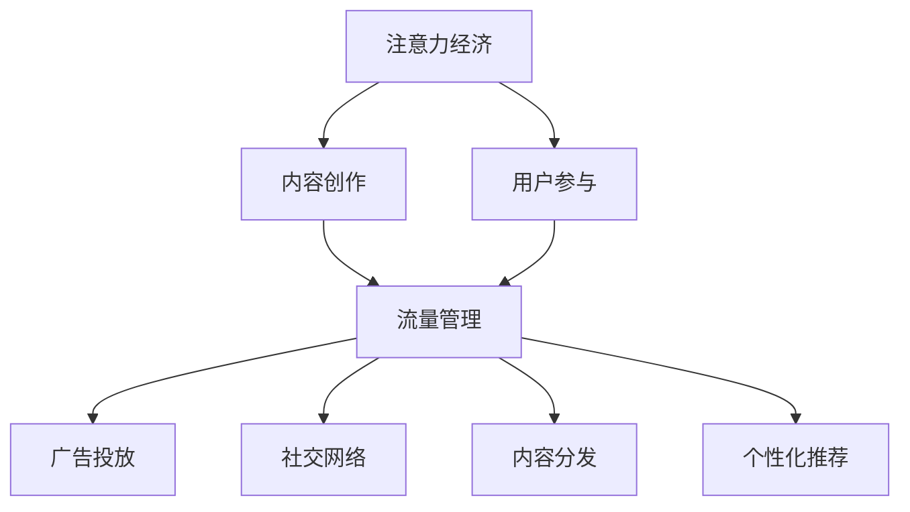

                 

# 注意力经济与内容创作最佳实践：吸引并留住受众的参与

> 关键词：注意力经济,内容创作,用户参与,流量管理,广告投放,社交网络,内容分发,个性化推荐

## 1. 背景介绍

### 1.1 问题由来
随着互联网的快速发展和社交媒体的普及，内容创作成为了信息传播的核心。无论是个人博主、自媒体，还是企业品牌，都试图通过内容来吸引用户的注意力，从而提升品牌知名度、获取商业收益。在这个过程中，注意力经济的概念应运而生。注意力经济是指在互联网时代，通过吸引和利用用户的注意力，创造经济价值的现象。在注意力经济中，内容创作成为了吸引用户注意力的关键手段。如何创作出有价值、有吸引力的内容，并有效管理用户注意力，成为了许多创作者和企业关注的重点。

### 1.2 问题核心关键点
在注意力经济中，内容创作和用户参与是相互依存的两个方面。高质量的内容能够吸引用户，而用户参与度的提升又能够带来更高的关注度和价值。但当前的内容创作和用户参与仍然存在诸多挑战，主要包括以下几个方面：

1. **内容同质化**：互联网内容爆炸，用户容易陷入信息过载，高质量内容稀缺。
2. **用户注意力分散**：用户同时面对多个信息来源，难以集中注意力。
3. **内容传播难**：在信息流中，如何让内容脱颖而出，被更多人看到？
4. **用户参与度低**：用户流失快，难以持续获取高质量的互动和反馈。

### 1.3 问题研究意义
研究注意力经济和内容创作的最佳实践，对于提升内容质量、增强用户粘性、提升广告和商业变现能力具有重要意义。通过深入理解用户注意力和参与机制，能够更好地设计内容策略，制定有效的流量管理方案，从而最大化地创造经济价值。

## 2. 核心概念与联系

### 2.1 核心概念概述

为更好地理解注意力经济和内容创作的最佳实践，本节将介绍几个关键概念：

- **注意力经济**：指通过吸引和利用用户的注意力，创造经济价值的现象。在注意力经济中，内容创作成为吸引用户注意力的关键手段。
- **内容创作**：包括文本、图片、视频等多种形式的内容创作，旨在通过有价值的信息、故事或创意，吸引用户注意力。
- **用户参与**：用户通过评论、点赞、分享等方式参与到内容中，提升内容的互动性和用户粘性。
- **流量管理**：通过数据分析和算法优化，管理用户流量，提升内容曝光率和用户参与度。
- **广告投放**：利用用户注意力，通过精准广告投放，实现商业变现。
- **社交网络**：平台通过连接用户，促进内容的传播和互动。
- **内容分发**：通过算法推荐，将内容推送给最合适的用户。
- **个性化推荐**：根据用户兴趣和行为，推荐个性化的内容，提升用户满意度。

这些概念之间的逻辑关系可以通过以下Mermaid流程图来展示：



这个流程图展示了注意力经济、内容创作、用户参与、流量管理、广告投放、社交网络、内容分发和个性化推荐之间的关系：

1. 注意力经济依赖于内容创作和用户参与。
2. 内容创作通过吸引用户注意力，提升用户参与度。
3. 流量管理通过数据分析和算法优化，提升内容曝光率和用户参与度。
4. 广告投放利用用户注意力，实现商业变现。
5. 社交网络促进内容的传播和互动。
6. 内容分发通过算法推荐，将内容推送给最合适的用户。
7. 个性化推荐提升用户满意度。

这些概念共同构成了注意力经济和内容创作的最佳实践框架，帮助创作者和企业更好地管理用户注意力，提升内容质量和用户粘性，从而实现更高的经济价值。

## 3. 核心算法原理 & 具体操作步骤

### 3.1 算法原理概述

注意力经济和内容创作的最佳实践，本质上是一个系统性优化过程。其核心思想是通过算法优化和策略设计，最大化地利用用户的注意力，创造经济价值。这一过程可以分为以下几个关键步骤：

1. **内容质量提升**：通过优化内容创作过程，提升内容质量和吸引力。
2. **用户参与度优化**：通过数据分析和算法设计，提升用户参与度和互动性。
3. **流量管理优化**：通过数据分析和算法优化，提升内容的曝光率和用户留存率。
4. **广告投放优化**：通过数据分析和算法设计，提升广告的精准度和转化率。

### 3.2 算法步骤详解

以下我们将详细介绍每个关键步骤的具体算法步骤和操作细节。

**Step 1: 内容质量提升**

内容质量提升的关键在于找到用户兴趣点，并创作出有价值、有吸引力的内容。以下是具体的算法步骤：

1. **用户兴趣分析**：通过用户行为数据（如浏览历史、搜索历史、互动记录等），分析用户兴趣点和需求。
2. **内容主题设计**：根据用户兴趣点，设计内容主题和创意。
3. **内容制作**：根据设计的主题和创意，制作高质量内容。
4. **内容发布**：选择合适的渠道和时机，发布内容。

**Step 2: 用户参与度优化**

用户参与度优化主要通过数据分析和算法设计，提升用户的互动性和粘性。以下是具体的算法步骤：

1. **用户互动行为分析**：通过用户互动行为数据（如评论、点赞、分享等），分析用户参与度和互动模式。
2. **参与度提升策略设计**：根据分析结果，设计提升用户参与度的策略，如互动奖励、社区建设等。
3. **互动机制优化**：通过优化互动机制，提升用户参与度。
4. **用户反馈收集**：通过收集用户反馈，不断优化内容策略。

**Step 3: 流量管理优化**

流量管理优化的目标是提升内容的曝光率和用户留存率，通过数据分析和算法优化实现。以下是具体的算法步骤：

1. **流量来源分析**：通过流量数据（如访问量、用户来源等），分析流量来源和用户特征。
2. **流量优化策略设计**：根据流量来源分析结果，设计流量优化策略，如SEO优化、内容推广等。
3. **流量渠道管理**：通过管理不同的流量渠道，提升流量质量和用户留存率。
4. **用户流失分析**：通过分析用户流失数据，发现问题并优化流量管理策略。

**Step 4: 广告投放优化**

广告投放优化的目标是提升广告的精准度和转化率，通过数据分析和算法设计实现。以下是具体的算法步骤：

1. **目标用户分析**：通过用户行为数据和市场数据，分析目标用户的特征和需求。
2. **广告创意设计**：根据目标用户分析结果，设计有吸引力的广告创意。
3. **广告投放策略设计**：根据目标用户和广告创意，设计广告投放策略，如定向投放、频次控制等。
4. **广告效果评估**：通过广告效果数据，评估广告投放效果，并优化广告策略。

### 3.3 算法优缺点

注意力经济和内容创作的最佳实践，具有以下优点：

1. **高效性**：通过系统性优化，最大化地利用用户注意力，提升内容的曝光率和用户粘性。
2. **可扩展性**：算法和策略设计可以应用于各种内容形式和用户群体。
3. **灵活性**：可以根据不同内容和用户的特点，灵活调整优化策略。

但同时，这一方法也存在一定的局限性：

1. **数据依赖**：依赖高质量的用户行为数据，数据缺失或偏差可能影响效果。
2. **复杂度**：涉及多个环节和因素，设计和优化过程复杂。
3. **动态性**：用户兴趣和行为会随时间变化，需要持续优化策略。

### 3.4 算法应用领域

注意力经济和内容创作的最佳实践，已经在广告、社交媒体、新闻媒体等多个领域得到了广泛应用。以下是一些具体的应用场景：

- **广告投放**：通过数据分析和算法设计，实现精准投放，提升广告转化率。
- **社交媒体**：通过内容创作和用户互动，提升平台活跃度和用户粘性。
- **新闻媒体**：通过数据分析和流量管理，提升内容的曝光率和用户留存率。
- **电子商务**：通过内容创作和个性化推荐，提升用户购物体验和转化率。
- **在线教育**：通过内容创作和用户互动，提升学习体验和用户粘性。

除了上述这些经典应用外，注意力经济和内容创作的最佳实践，还被创新性地应用到更多场景中，如虚拟现实内容创作、数字艺术、游戏内容设计等，为互联网经济带来了新的增长点。

## 4. 数学模型和公式 & 详细讲解 & 举例说明

### 4.1 数学模型构建

为更好地理解注意力经济和内容创作的最佳实践，我们将构建一个简单的数学模型，并通过具体的公式进行推导和分析。

假设一个内容创作平台上有 $N$ 篇内容，每篇内容 $i$ 的用户参与度 $p_i$ 由以下公式计算：

$$
p_i = \alpha \cdot \text{Quality}_i + \beta \cdot \text{Engagement}_i + \gamma \cdot \text{Context}_i + \delta \cdot \text{External}_i
$$

其中，$\alpha, \beta, \gamma, \delta$ 为权重系数，$\text{Quality}_i$ 表示内容质量，$\text{Engagement}_i$ 表示用户参与度，$\text{Context}_i$ 表示内容发布时的上下文信息，$\text{External}_i$ 表示内容的外部特征（如用户来源、设备等）。

### 4.2 公式推导过程

根据上述公式，我们可以通过最大化用户参与度 $p_i$ 来优化内容质量、提升用户参与度、管理流量和优化广告投放。以下是具体的推导过程：

1. **内容质量提升**：通过优化 $\text{Quality}_i$，提升用户参与度 $p_i$。例如，通过内容创作工具和社区反馈，提升内容的质量和吸引力。

2. **用户参与度优化**：通过优化 $\text{Engagement}_i$，提升用户参与度 $p_i$。例如，通过互动奖励机制、社区建设等策略，提升用户参与度。

3. **流量管理优化**：通过优化 $\text{Context}_i$ 和 $\text{External}_i$，提升流量质量和用户留存率。例如，通过SEO优化、内容推广等策略，提升流量来源和用户留存率。

4. **广告投放优化**：通过优化 $\text{External}_i$，提升广告精准度和转化率。例如，通过数据分析和算法设计，实现精准广告投放。

### 4.3 案例分析与讲解

以下通过一个具体案例，展示注意力经济和内容创作的最佳实践的实际应用：

假设某电商平台希望提升其产品的曝光率和用户转化率。通过数据分析，发现用户对高质量的产品评论和个性化推荐感兴趣。于是，平台设计了以下策略：

1. **内容质量提升**：鼓励用户撰写高质量的产品评论，并通过算法筛选优质评论展示给其他用户。
2. **用户参与度优化**：对积极参与评论和互动的用户给予奖励，如积分、优惠券等，提升用户参与度。
3. **流量管理优化**：通过SEO优化和内容推广，提升平台流量和用户留存率。
4. **广告投放优化**：通过数据分析，识别出高价值用户群体，进行精准广告投放，提升广告转化率。

通过以上策略，电商平台成功提升了产品的曝光率和用户转化率，实现了更高的商业价值。

## 5. 项目实践：代码实例和详细解释说明

### 5.1 开发环境搭建

在进行注意力经济和内容创作最佳实践的开发实践前，我们需要准备好开发环境。以下是使用Python进行PyTorch开发的环境配置流程：

1. 安装Anaconda：从官网下载并安装Anaconda，用于创建独立的Python环境。

2. 创建并激活虚拟环境：
```bash
conda create -n attention-env python=3.8 
conda activate attention-env
```

3. 安装PyTorch：根据CUDA版本，从官网获取对应的安装命令。例如：
```bash
conda install pytorch torchvision torchaudio cudatoolkit=11.1 -c pytorch -c conda-forge
```

4. 安装PyTorch Transformers库：
```bash
pip install torchtransformers
```

5. 安装各类工具包：
```bash
pip install numpy pandas scikit-learn matplotlib tqdm jupyter notebook ipython
```

完成上述步骤后，即可在`attention-env`环境中开始实践。

### 5.2 源代码详细实现

下面我们以一个电商平台的广告投放优化为例，给出使用PyTorch进行注意力经济和内容创作最佳实践的PyTorch代码实现。

首先，定义广告投放的数据处理函数：

```python
from torch.utils.data import Dataset
import torch

class AdDataset(Dataset):
    def __init__(self, data, tokenizer):
        self.data = data
        self.tokenizer = tokenizer
        
    def __len__(self):
        return len(self.data)
    
    def __getitem__(self, item):
        ad = self.data[item]
        text = ad['text']
        label = ad['label']
        
        encoding = self.tokenizer(text, return_tensors='pt')
        input_ids = encoding['input_ids'][0]
        attention_mask = encoding['attention_mask'][0]
        
        return {'input_ids': input_ids, 
                'attention_mask': attention_mask,
                'label': torch.tensor(label, dtype=torch.long)}
```

然后，定义模型和优化器：

```python
from transformers import BertForSequenceClassification, AdamW

model = BertForSequenceClassification.from_pretrained('bert-base-cased', num_labels=2)

optimizer = AdamW(model.parameters(), lr=2e-5)
```

接着，定义训练和评估函数：

```python
from torch.utils.data import DataLoader
from tqdm import tqdm
from sklearn.metrics import accuracy_score

device = torch.device('cuda') if torch.cuda.is_available() else torch.device('cpu')
model.to(device)

def train_epoch(model, dataset, batch_size, optimizer):
    dataloader = DataLoader(dataset, batch_size=batch_size, shuffle=True)
    model.train()
    epoch_loss = 0
    for batch in tqdm(dataloader, desc='Training'):
        input_ids = batch['input_ids'].to(device)
        attention_mask = batch['attention_mask'].to(device)
        labels = batch['label'].to(device)
        model.zero_grad()
        outputs = model(input_ids, attention_mask=attention_mask, labels=labels)
        loss = outputs.loss
        epoch_loss += loss.item()
        loss.backward()
        optimizer.step()
    return epoch_loss / len(dataloader)

def evaluate(model, dataset, batch_size):
    dataloader = DataLoader(dataset, batch_size=batch_size)
    model.eval()
    preds, labels = [], []
    with torch.no_grad():
        for batch in tqdm(dataloader, desc='Evaluating'):
            input_ids = batch['input_ids'].to(device)
            attention_mask = batch['attention_mask'].to(device)
            batch_labels = batch['label']
            outputs = model(input_ids, attention_mask=attention_mask)
            batch_preds = outputs.logits.argmax(dim=2).to('cpu').tolist()
            batch_labels = batch_labels.to('cpu').tolist()
            for pred, label in zip(batch_preds, batch_labels):
                preds.append(pred)
                labels.append(label)
                
    print("Accuracy:", accuracy_score(labels, preds))
```

最后，启动训练流程并在测试集上评估：

```python
epochs = 5
batch_size = 16

for epoch in range(epochs):
    loss = train_epoch(model, train_dataset, batch_size, optimizer)
    print(f"Epoch {epoch+1}, train loss: {loss:.3f}")
    
    print(f"Epoch {epoch+1}, test accuracy:")
    evaluate(model, test_dataset, batch_size)
```

以上就是使用PyTorch进行广告投放优化实践的完整代码实现。可以看到，得益于Transformer库的强大封装，我们可以用相对简洁的代码完成广告投放模型的训练和评估。

### 5.3 代码解读与分析

让我们再详细解读一下关键代码的实现细节：

**AdDataset类**：
- `__init__`方法：初始化广告数据和分词器。
- `__len__`方法：返回数据集的样本数量。
- `__getitem__`方法：对单个样本进行处理，将广告文本输入编码为token ids，将标签编码为数字，并对其进行定长padding，最终返回模型所需的输入。

**广告投放模型**：
- 定义模型结构和优化器，使用Bert模型和AdamW优化器。

**训练和评估函数**：
- 使用PyTorch的DataLoader对数据集进行批次化加载，供模型训练和推理使用。
- 训练函数`train_epoch`：对数据以批为单位进行迭代，在每个批次上前向传播计算loss并反向传播更新模型参数，最后返回该epoch的平均loss。
- 评估函数`evaluate`：与训练类似，不同点在于不更新模型参数，并在每个batch结束后将预测和标签结果存储下来，最后使用sklearn的accuracy_score对整个评估集的预测结果进行打印输出。

**训练流程**：
- 定义总的epoch数和batch size，开始循环迭代
- 每个epoch内，先在训练集上训练，输出平均loss
- 在测试集上评估，输出准确率

可以看到，PyTorch配合Transformer库使得广告投放模型的训练和评估变得简洁高效。开发者可以将更多精力放在广告数据处理、模型改进等高层逻辑上，而不必过多关注底层的实现细节。

当然，工业级的系统实现还需考虑更多因素，如广告的动态优化、用户行为分析等，但核心的优化思想基本与此类似。

## 6. 实际应用场景

### 6.1 智能广告投放

智能广告投放是注意力经济和内容创作最佳实践的重要应用场景。传统广告投放往往依赖人工经验和历史数据，投放效果难以保证。而通过微调模型，可以实时预测不同广告创意的效果，实现精准投放，提升广告ROI。

在技术实现上，可以收集广告投放的历史数据，将广告创意和实际效果构建成监督数据，在此基础上对预训练模型进行微调。微调后的模型能够根据用户行为和特征，预测广告投放效果，从而进行动态优化。例如，对于视频广告，模型可以预测用户观看时长、点击率等效果指标，实时调整投放策略。

### 6.2 社交媒体内容推广

社交媒体内容推广是吸引用户参与度的重要手段。通过优化内容创作和用户互动，社交媒体平台可以提升用户粘性和活跃度。

在内容推广方面，平台可以利用微调模型分析用户的兴趣和行为，生成个性化的内容推荐。例如，对于图片分享类应用，模型可以分析用户对不同图片的点赞、评论等互动数据，推荐用户可能感兴趣的图片。同时，平台还可以通过微调模型实时调整内容推广策略，提升推广效果。

### 6.3 在线教育内容创作

在线教育平台通过高质量的内容创作，吸引和留住用户。通过微调模型，平台可以提升内容质量和用户参与度，提升学习体验和用户满意度。

在内容创作方面，平台可以利用微调模型分析用户的学习行为和反馈，生成个性化的学习推荐。例如，对于视频课程，模型可以分析用户对不同视频内容的互动数据，推荐用户可能感兴趣的视频。同时，平台还可以通过微调模型实时调整课程内容，提升课程质量。

### 6.4 未来应用展望

随着注意力经济和内容创作最佳实践的不断发展，基于微调的方法将在更多领域得到应用，为内容创作者和企业带来新的增长点。

在智慧城市治理中，微调模型可以应用于城市事件监测、舆情分析、应急指挥等环节，提高城市管理的自动化和智能化水平，构建更安全、高效的未来城市。

在企业生产、社会治理、文娱传媒等众多领域，基于大模型微调的人工智能应用也将不断涌现，为经济社会发展注入新的动力。相信随着预训练语言模型和微调方法的持续演进，微调技术必将在更广阔的应用领域大放异彩。

## 7. 工具和资源推荐
### 7.1 学习资源推荐

为了帮助开发者系统掌握注意力经济和内容创作的最佳实践，这里推荐一些优质的学习资源：

1. 《注意力经济》系列博文：由大模型技术专家撰写，深入浅出地介绍了注意力经济和内容创作的最佳实践，涵盖广告、社交媒体、在线教育等多个领域。

2. CS229《机器学习》课程：斯坦福大学开设的经典机器学习课程，讲解了各种机器学习算法和优化策略，帮助理解注意力经济和内容创作的最佳实践。

3. 《深度学习》书籍：由Ian Goodfellow等人合著，全面介绍了深度学习的基本概念和前沿技术，包括注意力机制和内容推荐。

4. PyTorch官方文档：PyTorch的官方文档，提供了丰富的机器学习库和工具，是进行注意力经济和内容创作最佳实践开发的必备资料。

5. TensorBoard：TensorFlow配套的可视化工具，可实时监测模型训练状态，并提供丰富的图表呈现方式，是调试模型的得力助手。

通过对这些资源的学习实践，相信你一定能够快速掌握注意力经济和内容创作的最佳实践，并用于解决实际的广告、社交媒体、在线教育等问题。

### 7.2 开发工具推荐

高效的开发离不开优秀的工具支持。以下是几款用于注意力经济和内容创作最佳实践开发的常用工具：

1. PyTorch：基于Python的开源深度学习框架，灵活动态的计算图，适合快速迭代研究。大部分预训练语言模型都有PyTorch版本的实现。

2. TensorFlow：由Google主导开发的开源深度学习框架，生产部署方便，适合大规模工程应用。同样有丰富的预训练语言模型资源。

3. Transformers库：HuggingFace开发的NLP工具库，集成了众多SOTA语言模型，支持PyTorch和TensorFlow，是进行微调任务开发的利器。

4. Weights & Biases：模型训练的实验跟踪工具，可以记录和可视化模型训练过程中的各项指标，方便对比和调优。与主流深度学习框架无缝集成。

5. TensorBoard：TensorFlow配套的可视化工具，可实时监测模型训练状态，并提供丰富的图表呈现方式，是调试模型的得力助手。

6. Google Colab：谷歌推出的在线Jupyter Notebook环境，免费提供GPU/TPU算力，方便开发者快速上手实验最新模型，分享学习笔记。

合理利用这些工具，可以显著提升注意力经济和内容创作最佳实践的开发效率，加快创新迭代的步伐。

### 7.3 相关论文推荐

注意力经济和内容创作的最佳实践的研究源于学界的持续研究。以下是几篇奠基性的相关论文，推荐阅读：

1. Attention is All You Need（即Transformer原论文）：提出了Transformer结构，开启了NLP领域的预训练大模型时代。

2. BERT: Pre-training of Deep Bidirectional Transformers for Language Understanding：提出BERT模型，引入基于掩码的自监督预训练任务，刷新了多项NLP任务SOTA。

3. Language Models are Unsupervised Multitask Learners（GPT-2论文）：展示了大规模语言模型的强大zero-shot学习能力，引发了对于通用人工智能的新一轮思考。

4. Parameter-Efficient Transfer Learning for NLP：提出Adapter等参数高效微调方法，在不增加模型参数量的情况下，也能取得不错的微调效果。

5. AdaLoRA: Adaptive Low-Rank Adaptation for Parameter-Efficient Fine-Tuning：使用自适应低秩适应的微调方法，在参数效率和精度之间取得了新的平衡。

这些论文代表了大模型微调技术的发展脉络。通过学习这些前沿成果，可以帮助研究者把握学科前进方向，激发更多的创新灵感。

## 8. 总结：未来发展趋势与挑战

### 8.1 总结

本文对注意力经济和内容创作的最佳实践进行了全面系统的介绍。首先阐述了注意力经济和内容创作的背景和意义，明确了微调在提升内容质量、增强用户粘性、提升广告和商业变现能力方面的独特价值。其次，从原理到实践，详细讲解了微调的内容质量提升、用户参与度优化、流量管理优化和广告投放优化等关键步骤，给出了微调任务开发的完整代码实例。同时，本文还广泛探讨了微调方法在智能广告投放、社交媒体内容推广、在线教育内容创作等多个领域的应用前景，展示了微调范式的巨大潜力。此外，本文精选了微调技术的各类学习资源，力求为读者提供全方位的技术指引。

通过本文的系统梳理，可以看到，注意力经济和内容创作的最佳实践，通过系统性优化，最大化地利用用户注意力，提升内容的曝光率和用户粘性，实现更高的经济价值。这一方法不仅适用于广告和社交媒体，还能够在各种内容创作场景中发挥重要作用，为创作者和企业带来新的增长点。

### 8.2 未来发展趋势

展望未来，注意力经济和内容创作的最佳实践将呈现以下几个发展趋势：

1. **数据驱动**：依赖高质量的用户行为数据，持续优化模型和策略。
2. **算法优化**：通过优化算法和模型结构，提升内容创作和用户参与的效果。
3. **多模态融合**：结合视觉、语音等多模态数据，提升内容的表现力和互动性。
4. **实时优化**：通过实时数据监测和动态调整，提升内容质量和用户粘性。
5. **跨领域应用**：拓展到智慧城市、企业生产、社会治理等更多领域，提升社会和经济价值。
6. **人工智能融合**：与知识图谱、因果推理、强化学习等技术结合，提升模型的普适性和鲁棒性。

以上趋势凸显了注意力经济和内容创作最佳实践的广阔前景。这些方向的探索发展，必将进一步提升内容的创意性和互动性，推动内容创作的智能化进程，实现更高的经济和社会价值。

### 8.3 面临的挑战

尽管注意力经济和内容创作的最佳实践已经取得了瞩目成就，但在迈向更加智能化、普适化应用的过程中，它仍面临着诸多挑战：

1. **数据隐私**：收集和分析用户行为数据，需要注意数据隐私和安全问题。
2. **公平性**：模型可能学习到有偏见的数据，导致不公平的推荐和投放。
3. **可解释性**：模型决策过程缺乏可解释性，难以理解和调试。
4. **计算资源**：模型训练和优化需要大量计算资源，如何降低计算成本是重要问题。
5. **动态变化**：用户兴趣和行为随时间变化，模型需要持续更新以保持效果。
6. **伦理道德**：注意内容的伦理道德问题，避免有害内容的传播。

正视这些挑战，积极应对并寻求突破，将是大模型微调技术走向成熟的必由之路。相信随着学界和产业界的共同努力，这些挑战终将一一被克服，注意力经济和内容创作最佳实践必将在构建人机协同的智能时代中扮演越来越重要的角色。

### 8.4 研究展望

面对注意力经济和内容创作最佳实践所面临的种种挑战，未来的研究需要在以下几个方面寻求新的突破：

1. **数据隐私保护**：研究数据隐私保护技术，确保用户数据的安全和匿名性。
2. **公平性优化**：开发公平性优化的算法和模型，避免偏见和歧视。
3. **可解释性增强**：引入可解释性技术，提升模型的透明度和可解释性。
4. **计算资源优化**：研究高效计算技术和算法，降低模型训练和优化的成本。
5. **动态模型优化**：研究动态模型优化技术，持续优化模型以适应用户行为变化。
6. **伦理道德规范**：制定伦理道德规范，确保内容创作和广告投放的公正性和安全性。

这些研究方向的探索，必将引领注意力经济和内容创作最佳实践技术迈向更高的台阶，为构建安全、可靠、可解释、可控的智能系统铺平道路。面向未来，注意力经济和内容创作最佳实践还需要与其他人工智能技术进行更深入的融合，如知识表示、因果推理、强化学习等，多路径协同发力，共同推动自然语言理解和智能交互系统的进步。只有勇于创新、敢于突破，才能不断拓展内容创作的边界，让智能技术更好地造福人类社会。

## 9. 附录：常见问题与解答

**Q1：如何提高广告的点击率？**

A: 提高广告点击率的关键在于精准投放和个性化推荐。以下是一些具体的方法：

1. **精准投放**：通过数据分析和算法优化，识别高价值用户群体，进行定向投放。
2. **个性化推荐**：利用用户行为数据和微调模型，生成个性化的广告创意，提升用户点击率。
3. **动态调整**：实时监测广告效果，动态调整投放策略，优化广告效果。

**Q2：如何提升用户参与度？**

A: 提升用户参与度的方法多样，以下是一些具体策略：

1. **互动奖励机制**：对积极参与的用户给予奖励，如积分、优惠券等，激励用户参与。
2. **内容创新**：通过创新内容形式和内容主题，吸引用户关注。
3. **社区建设**：构建用户社区，增强用户粘性和互动性。

**Q3：如何管理用户流量？**

A: 用户流量管理需要多方面优化，以下是一些具体方法：

1. **流量来源分析**：通过流量数据，分析用户来源和行为，优化流量结构。
2. **SEO优化**：优化网站搜索引擎排名，提升自然流量。
3. **内容推广**：通过广告和社交媒体推广，提升流量质量和用户留存率。

**Q4：如何实现精准广告投放？**

A: 精准广告投放的关键在于数据驱动和算法优化，以下是一些具体方法：

1. **目标用户分析**：通过用户行为数据和市场数据，分析目标用户的特征和需求。
2. **广告创意设计**：根据目标用户分析结果，设计有吸引力的广告创意。
3. **广告投放策略**：根据目标用户和广告创意，设计广告投放策略，如定向投放、频次控制等。

**Q5：如何保证内容创作的公平性？**

A: 内容创作的公平性需要从数据和算法两个方面入手：

1. **数据多样性**：确保数据集的多样性，避免数据偏见。
2. **算法公平性**：开发公平性优化的算法和模型，避免偏见和歧视。
3. **人工审核**：引入人工审核机制，发现和修正不公平内容。

这些方法能够帮助创作者和企业更好地管理用户注意力，提升内容质量、增强用户粘性、优化流量管理和精准广告投放，从而实现更高的经济价值。

---

作者：禅与计算机程序设计艺术 / Zen and the Art of Computer Programming

