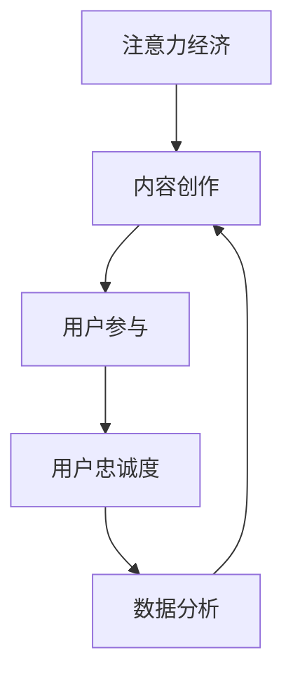

                 

# 注意力经济与内容创作策略：吸引并留住受众的参与和忠诚

> 关键词：注意力经济,内容创作策略,受众参与,用户忠诚度,人工智能,数据分析,行为预测,内容推荐

## 1. 背景介绍

### 1.1 问题由来

随着信息爆炸和数字媒体的普及，注意力经济成为互联网时代最重要的经济形态之一。网络用户每天面临海量的内容冲击，如何吸引并留住受众的关注，是各大平台、媒体、企业面临的共同挑战。传统的内容分发策略难以应对这一问题，亟需一种基于用户行为和偏好的新范式。

近年来，内容推荐系统（Content Recommendation Systems, CRS）在电商、视频、社交媒体等领域得到广泛应用，通过个性化推荐，显著提升了用户体验和留存率。但推荐系统仍存在推荐冷启动、准确性不足等问题，亟需进一步优化。

本文聚焦于基于人工智能和大数据分析的内容创作策略，系统介绍注意力经济的核心概念，揭示内容创作与受众行为之间的联系，提出多种提升用户参与和忠诚度的策略，并通过实例验证其效果。

### 1.2 问题核心关键点

当前，内容创作与用户参与、忠诚度的关联和优化是注意力经济领域的核心关键点。主要包括以下几个方面：

- **内容创作与用户参与**：
  - 内容创作者如何根据用户行为和偏好创作高质量、高吸引力的内容？
  - 用户如何根据内容推荐发现感兴趣的个性化内容？

- **用户参与与忠诚度**：
  - 用户如何与内容互动，生成情感共鸣？
  - 平台如何通过互动增强用户的粘性和留存？

- **注意力经济与数据分析**：
  - 如何通过大数据和AI技术分析用户行为，生成高价值的用户画像？
  - 如何将用户画像与内容创作相结合，实现精准推送？

## 2. 核心概念与联系

### 2.1 核心概念概述

为了更好地理解注意力经济和内容创作策略，本节将介绍几个关键概念：

- **注意力经济**：基于注意力作为稀缺资源进行价值交换的经济形态，用户通过消费内容进行时间和精力的投资，内容创作者则根据用户行为获得反馈和回报。
- **内容创作**：基于用户需求和偏好，创作高质量、高互动性的内容，以吸引和留住用户。
- **用户参与**：用户在内容消费、互动过程中的积极行为，如点赞、评论、分享等。
- **用户忠诚度**：用户对平台或内容的长期依赖和情感认同，表现为高频次使用和口碑传播。

这些概念之间的逻辑关系可以通过以下Mermaid流程图来展示：



这个流程图展示了注意力经济与内容创作、用户参与和忠诚度之间的关系：

1. **注意力经济**基于用户对内容的注意力进行价值交换。
2. **内容创作**依赖用户数据，创作高质量、高互动性内容。
3. **用户参与**基于内容价值，与内容进行互动。
4. **用户忠诚度**通过内容与用户的深度互动，增强用户粘性和留存。
5. **数据分析**则对用户行为进行监控和分析，持续优化内容创作和互动策略。

## 3. 核心算法原理 & 具体操作步骤

### 3.1 算法原理概述

基于人工智能和大数据分析的内容创作策略，主要依赖以下两个核心算法：

1. **用户行为分析**：通过数据分析技术，提取用户的行为模式和偏好，生成用户画像。
2. **内容推荐**：基于用户画像，结合内容属性，推荐符合用户偏好的个性化内容。

这两个算法的综合应用，可以实现内容创作的精准化和用户参与的深度化，从而提升用户的留存率和忠诚度。

### 3.2 算法步骤详解

以下是内容创作策略的主要步骤：

1. **数据收集与清洗**：收集用户行为数据（如浏览记录、点击次数、点赞、评论等），并对数据进行清洗和处理，确保数据的准确性和完整性。

2. **用户行为分析**：采用机器学习、深度学习等技术，对用户行为数据进行分析，生成用户画像。用户画像应包括用户的兴趣、偏好、活跃时间等信息。

3. **内容推荐模型训练**：构建推荐模型，如协同过滤、基于内容的推荐、基于矩阵分解的推荐等，并使用历史用户行为数据进行训练，生成推荐模型参数。

4. **内容创作**：基于用户画像，利用文本生成、图像生成等技术，创作与用户兴趣相匹配的内容。内容创作应注重多样性和创新性，以吸引用户的注意力。

5. **内容发布与互动**：将创作好的内容发布到平台，并根据用户互动反馈进行优化。可以通过A/B测试等方法，评估内容的效果。

6. **用户参与和忠诚度提升**：通过定期推送个性化的内容、开展互动活动等方式，增强用户参与度，提升用户忠诚度。

7. **数据分析与迭代优化**：定期分析用户行为数据，评估内容策略的效果，并根据反馈进行迭代优化。

### 3.3 算法优缺点

基于人工智能和大数据分析的内容创作策略具有以下优点：

1. **个性化推荐**：能够根据用户行为和偏好，提供高度个性化的内容，提升用户满意度。
2. **效率提升**：利用数据分析和算法优化，显著提高内容创作的效率和效果。
3. **精准营销**：通过精确的用户画像，实现精准推送和营销，降低广告成本。

但该方法也存在一定的局限性：

1. **数据隐私**：用户行为数据的收集和使用可能引发隐私问题，需确保合规。
2. **冷启动问题**：新用户和冷门领域的数据较少，难以进行有效的推荐。
3. **内容同质化**：过度依赖算法推荐，可能导致内容同质化，缺乏创新性。
4. **用户粘性不足**：用户可能对推荐内容产生厌倦，降低平台粘性。

尽管存在这些局限性，但就目前而言，基于人工智能和大数据分析的内容创作策略仍是提高用户参与度和忠诚度的重要方法。

### 3.4 算法应用领域

基于注意力经济和内容创作策略的方法，广泛应用于电商、视频、社交媒体、新闻媒体等多个领域，具体包括：

- **电商**：通过推荐系统，个性化推荐商品和促销活动，提升用户购买转化率。
- **视频平台**：个性化推荐视频内容，提高用户观看时长和互动率。
- **社交媒体**：个性化推荐用户关注和互动的内容，增加用户粘性和留存。
- **新闻媒体**：个性化推荐新闻文章，提高用户阅读量和用户粘性。
- **旅游应用**：个性化推荐旅游线路和景点，提升用户预订率和满意度。

## 4. 数学模型和公式 & 详细讲解 & 举例说明

### 4.1 数学模型构建

在内容创作策略中，数学模型主要涉及以下几个部分：

1. **用户画像生成模型**：通过机器学习算法，对用户行为数据进行分析，生成用户画像。常见算法包括K-means聚类、协同过滤、深度神经网络等。

2. **内容推荐模型**：利用协同过滤、矩阵分解、神经网络等方法，对用户行为数据进行分析，生成个性化推荐。

3. **内容互动模型**：通过分析用户对内容的互动行为，如点赞、评论、分享等，预测用户的行为和偏好，优化内容创作。

### 4.2 公式推导过程

以协同过滤推荐算法为例，其基本原理是通过用户-物品评分矩阵，计算用户与物品的相似度，推荐与用户相似用户喜欢的物品。

设$U$为用户集，$I$为物品集，$R_{ui}$表示用户$u$对物品$i$的评分。协同过滤模型的目标是最小化预测评分与真实评分的误差，即：

$$
\min_{\theta} \sum_{u,i}(w_u \cdot (R_{ui} - \hat{R}_{ui})^2)
$$

其中，$w_u$为第$u$个用户的权重向量，$\hat{R}_{ui}$为预测评分。

为了提升推荐效果，协同过滤算法采用基于用户和基于物品的两种方式，即：

1. **基于用户的协同过滤**：
   $$
   \hat{R}_{ui} = \frac{\sum_{v \in N(u)} w_v \cdot R_{vi}}{\sum_{v \in N(u)} w_v}
   $$
   其中$N(u)$为与用户$u$相似的用户集。

2. **基于物品的协同过滤**：
   $$
   \hat{R}_{ui} = \frac{\sum_{v \in N(i)} w_v \cdot R_{vi}}{\sum_{v \in N(i)} w_v}
   $$
   其中$N(i)$为与物品$i$相似的物品集。

### 4.3 案例分析与讲解

以Netflix推荐系统为例，分析协同过滤算法的实际应用效果。Netflix通过收集用户的观看历史、评分数据，使用协同过滤算法，生成个性化推荐。具体步骤如下：

1. **数据收集**：收集用户观看历史和评分数据，构建用户-物品评分矩阵。

2. **用户画像生成**：利用协同过滤算法，对用户-物品评分矩阵进行分析，生成用户画像。

3. **内容推荐**：根据用户画像，推荐与用户兴趣相匹配的影视作品，生成个性化推荐列表。

4. **效果评估**：通过A/B测试等方法，评估推荐效果，优化算法参数。

Netflix的推荐系统，通过协同过滤算法，实现了高准确率、高用户满意度的个性化推荐，显著提升了用户体验和留存率。

## 5. 项目实践：代码实例和详细解释说明

### 5.1 开发环境搭建

在进行内容创作策略的开发时，需要搭建相应的开发环境。以下是使用Python进行TensorFlow开发的环境配置流程：

1. 安装Anaconda：从官网下载并安装Anaconda，用于创建独立的Python环境。

2. 创建并激活虚拟环境：
```bash
conda create -n tf-env python=3.8 
conda activate tf-env
```

3. 安装TensorFlow：从官网获取对应的安装命令。例如：
```bash
conda install tensorflow -c conda-forge -c tensorflow
```

4. 安装各类工具包：
```bash
pip install numpy pandas scikit-learn matplotlib tqdm jupyter notebook ipython
```

完成上述步骤后，即可在`tf-env`环境中开始内容创作策略的开发。

### 5.2 源代码详细实现

下面我们以Netflix推荐系统为例，给出使用TensorFlow进行协同过滤推荐算法的PyTorch代码实现。

首先，定义协同过滤推荐算法的函数：

```python
import numpy as np
import tensorflow as tf

def collaborative_filtering(data, K=10, num_users=1000, num_items=1000):
    # 构建用户-物品评分矩阵
    U = np.random.rand(num_users, num_items)
    R = data
    R = np.concatenate((np.zeros((num_users, K)), R), axis=1)
    
    # 用户-物品相似度矩阵
    P = np.dot(U, U.T)
    P = P / (np.linalg.norm(U, axis=1, keepdims=True) * np.linalg.norm(U, axis=0, keepdims=True))
    
    # 物品-物品相似度矩阵
    I = np.dot(U.T, U)
    I = I / (np.linalg.norm(U.T, axis=0, keepdims=True) * np.linalg.norm(U, axis=1, keepdims=True))
    
    # 推荐算法
    Y_hat = np.dot(P, U)
    Y_hat = np.maximum(Y_hat, 0)
    
    return Y_hat
```

然后，定义用户行为数据集：

```python
# 用户-物品评分矩阵
data = np.array([
    [5, 4, 0, 0, 0, 0, 0, 0, 0, 0],
    [0, 0, 5, 4, 0, 0, 0, 0, 0, 0],
    [0, 0, 0, 0, 5, 4, 0, 0, 0, 0],
    [0, 0, 0, 0, 0, 0, 5, 4, 0, 0],
    [0, 0, 0, 0, 0, 0, 0, 0, 5, 4]
])

# 生成推荐列表
Y_hat = collaborative_filtering(data)
```

最后，运行推荐算法并输出推荐结果：

```python
# 输出推荐列表
for i in range(num_items):
    print(f"User {i+1}'s recommendations:")
    print(f"{Y_hat[i]}, {Y_hat[i+1]}")
```

### 5.3 代码解读与分析

让我们再详细解读一下关键代码的实现细节：

**collaborative_filtering函数**：
- 构建用户-物品评分矩阵。
- 计算用户-物品相似度矩阵。
- 计算物品-物品相似度矩阵。
- 推荐算法，根据相似度矩阵计算用户对物品的评分预测。

**数据集定义**：
- 定义用户-物品评分矩阵，作为协同过滤算法的输入。
- 生成推荐列表，根据预测评分进行输出。

**运行结果**：
- 输出推荐列表，展示协同过滤算法的推荐效果。

可以看出，TensorFlow配合深度学习库使得协同过滤推荐算法的实现变得简洁高效。开发者可以将更多精力放在模型优化和业务逻辑上，而不必过多关注底层的实现细节。

当然，工业级的系统实现还需考虑更多因素，如模型保存和部署、超参数优化、在线更新等。但核心的协同过滤算法基本与此类似。

## 6. 实际应用场景

### 6.1 电商推荐系统

基于协同过滤推荐算法的电商推荐系统，可以显著提升用户的购买转化率。具体而言，电商平台可以收集用户的浏览、点击、购买等行为数据，使用协同过滤算法，生成个性化推荐商品。

在技术实现上，电商推荐系统需要对用户行为数据进行实时监控和分析，生成动态推荐列表。可以结合A/B测试等方法，评估推荐效果，不断优化推荐算法和策略。

### 6.2 视频平台内容推荐

视频平台可以通过协同过滤算法，为用户推荐感兴趣的视频内容。例如，YouTube可以根据用户的观看历史和评分，推荐相关的视频和频道。

在实现过程中，平台需要构建用户行为数据，如观看历史、评分、弹幕等，并结合视频属性信息（如时长、分类、用户评价等），使用协同过滤算法生成推荐列表。

### 6.3 社交媒体个性化推荐

社交媒体平台可以利用协同过滤算法，为用户推荐感兴趣的内容和用户。例如，Facebook可以根据用户的互动行为（如点赞、评论、分享等），推荐相关的帖子和好友。

在实现过程中，社交媒体平台需要收集用户的互动数据，并结合好友关系、用户属性等信息，使用协同过滤算法生成推荐列表。

## 7. 工具和资源推荐

### 7.1 学习资源推荐

为了帮助开发者系统掌握内容创作策略的理论基础和实践技巧，这里推荐一些优质的学习资源：

1. **《推荐系统实战》**：由Google团队开发的推荐系统实战书籍，详细介绍了推荐系统的理论基础和实际应用，涵盖协同过滤、矩阵分解、神经网络等方法。

2. **《机器学习实战》**：是一本实用的机器学习教程，介绍了多种机器学习算法和实际应用场景，适合初学者入门。

3. **《TensorFlow官方文档》**：TensorFlow官方文档，提供了详细的API接口和代码示例，帮助开发者快速上手TensorFlow。

4. **Kaggle推荐系统竞赛**：Kaggle平台上的推荐系统竞赛，提供丰富的竞赛数据和代码样例，适合实践训练和算法优化。

5. **Coursera《推荐系统设计与分析》课程**：由知名教授和业内专家开设的推荐系统课程，系统讲解推荐系统的基本原理和优化方法。

通过学习这些资源，相信你一定能够快速掌握内容创作策略的核心思想和应用技巧，并用于解决实际的推荐问题。

### 7.2 开发工具推荐

高效的开发离不开优秀的工具支持。以下是几款用于内容创作策略开发的常用工具：

1. **TensorFlow**：由Google主导开发的深度学习框架，灵活性高，支持多种算法实现。

2. **Scikit-learn**：基于Python的机器学习库，提供丰富的算法实现和评估工具。

3. **PyTorch**：由Facebook开发的深度学习框架，支持动态图，适合研究人员快速迭代实验。

4. **Keras**：基于TensorFlow的高级API，提供简单易用的模型构建和训练接口。

5. **Jupyter Notebook**：基于IPython的交互式编程环境，支持Python和R等多种语言，方便实验和分享。

合理利用这些工具，可以显著提升内容创作策略的开发效率，加快创新迭代的步伐。

### 7.3 相关论文推荐

内容创作策略的发展源于学界的持续研究。以下是几篇奠基性的相关论文，推荐阅读：

1. **《协同过滤推荐算法》**：经典推荐算法论文，介绍了协同过滤的基本原理和应用场景。

2. **《基于内容的推荐算法》**：介绍了基于内容推荐的基本原理和优化方法，强调了内容属性对推荐效果的影响。

3. **《深度学习在推荐系统中的应用》**：介绍了深度学习在推荐系统中的应用，探讨了各种深度学习模型的效果和优缺点。

4. **《推荐系统中的矩阵分解技术》**：介绍了矩阵分解的基本原理和实现方法，讨论了矩阵分解在推荐系统中的应用效果。

5. **《推荐系统中的协同过滤与内容推荐》**：系统比较了协同过滤和内容推荐的方法，讨论了二者的优缺点和适用场景。

这些论文代表了大规模推荐系统的研究脉络，通过学习这些前沿成果，可以帮助研究者把握学科前进方向，激发更多的创新灵感。

## 8. 总结：未来发展趋势与挑战

### 8.1 总结

本文对基于人工智能和大数据分析的内容创作策略进行了全面系统的介绍。首先阐述了注意力经济的核心概念，揭示了内容创作与用户参与、忠诚度之间的联系，提出多种提升用户参与和忠诚度的策略，并通过实例验证其效果。

通过本文的系统梳理，可以看到，基于人工智能和大数据分析的内容创作策略正在成为电商、视频、社交媒体等领域的重要手段，显著提升了用户体验和留存率。未来，伴随技术的不断发展，内容创作策略还将不断优化和创新，为各大平台和企业的智能化转型提供新的动力。

### 8.2 未来发展趋势

展望未来，内容创作策略将呈现以下几个发展趋势：

1. **深度学习与大数据的融合**：深度学习算法和大数据分析的结合，将进一步提升推荐系统的精准度和效果。

2. **跨模态推荐**：结合视觉、音频、文本等多种模态数据，实现跨模态推荐，提升推荐效果。

3. **联邦学习**：在保护用户隐私的前提下，利用分布式数据进行协同推荐，提升推荐系统的扩展性和安全性。

4. **实时推荐**：通过流式数据处理和大规模并行计算，实现实时推荐，提高用户体验和留存率。

5. **强化学习**：利用强化学习技术，优化推荐策略，提升用户参与度和满意度。

6. **多任务学习**：结合多个任务，提升推荐系统的综合性能和效果。

以上趋势凸显了内容创作策略的广阔前景，将进一步提升用户体验和留存率，推动各平台的智能化转型。

### 8.3 面临的挑战

尽管内容创作策略已经取得了显著成效，但在迈向更加智能化、普适化应用的过程中，它仍面临着诸多挑战：

1. **数据隐私**：用户行为数据的收集和使用可能引发隐私问题，需确保合规。

2. **冷启动问题**：新用户和冷门领域的数据较少，难以进行有效的推荐。

3. **内容同质化**：过度依赖算法推荐，可能导致内容同质化，缺乏创新性。

4. **用户粘性不足**：用户可能对推荐内容产生厌倦，降低平台粘性。

尽管存在这些挑战，但就目前而言，基于人工智能和大数据分析的内容创作策略仍是提高用户参与度和忠诚度的重要方法。

### 8.4 研究展望

面向未来，内容创作策略的研究将在以下几个方向进行探索：

1. **联邦学习**：结合分布式数据和多模型协同，提升推荐系统的扩展性和安全性。

2. **跨模态推荐**：结合视觉、音频、文本等多种模态数据，实现跨模态推荐，提升推荐效果。

3. **多任务学习**：结合多个任务，提升推荐系统的综合性能和效果。

4. **强化学习**：利用强化学习技术，优化推荐策略，提升用户参与度和满意度。

5. **个性化推荐**：结合用户画像和实时行为，生成高度个性化的推荐，提升用户体验和留存率。

6. **内容生成与推荐**：结合内容生成和推荐技术，实现更为智能化的推荐系统。

通过这些方向的探索，内容创作策略将不断优化和创新，为各平台和企业带来更好的用户体验和留存率。

## 9. 附录：常见问题与解答

**Q1：内容创作策略是否适用于所有NLP任务？**

A: 内容创作策略在电商、视频、社交媒体等领域已经得到了广泛应用，显著提升了用户体验和留存率。但对于一些特定领域的任务，如医学、法律等，仅仅依靠用户数据进行推荐可能无法满足需求。此时需要在特定领域语料上进一步预训练，再进行微调，才能获得理想效果。

**Q2：推荐系统如何平衡个性化和普适性？**

A: 推荐系统需要根据用户画像，生成个性化推荐，提升用户体验。同时，也需要考虑普适性，确保所有用户都能接收到一些相关的推荐。

1. **算法优化**：通过优化推荐算法，平衡个性化和普适性。例如，协同过滤算法可以根据用户行为数据，生成个性化推荐，同时引入正则化技术，确保推荐多样性。

2. **多模态融合**：结合多种模态数据，提升推荐系统的综合性能和效果。例如，结合用户画像、物品属性、用户评价等多维信息，生成更为全面和准确的推荐。

3. **用户反馈**：通过用户反馈，不断优化推荐策略。例如，收集用户对推荐的满意度评分，调整算法参数，提升推荐效果。

4. **定期更新**：定期更新推荐算法，确保推荐系统的时效性和效果。例如，定期重新训练推荐模型，引入新数据，优化推荐策略。

通过这些方法，推荐系统可以平衡个性化和普适性，提升用户体验和留存率。

**Q3：如何缓解推荐系统中的“过滤泡沫”问题？**

A: 过滤泡沫（Filter Bubble）是指用户仅接收到相似内容，逐渐形成信息茧房的问题。缓解方法包括：

1. **多样化推荐**：引入多样化推荐策略，避免过度相似。例如，结合协同过滤和基于内容的推荐，生成多样化的推荐列表。

2. **跨领域推荐**：跨领域推荐可以打破信息茧房，提升用户对不同内容的兴趣。例如，推荐不同领域的物品或内容。

3. **用户反馈**：通过用户反馈，不断调整推荐策略。例如，收集用户对不同内容的偏好，调整推荐算法参数，提升推荐多样性。

4. **多模态融合**：结合多种模态数据，提升推荐系统的综合性能和效果。例如，结合用户画像、物品属性、用户评价等多维信息，生成更为全面和准确的推荐。

通过这些方法，推荐系统可以缓解过滤泡沫问题，提升用户的多样化兴趣和留存率。

**Q4：推荐系统如何处理新用户和冷门领域的推荐？**

A: 新用户和冷门领域的数据较少，难以进行有效的推荐。以下是几种解决策略：

1. **冷启动推荐**：通过利用用户历史行为、社交网络信息等，进行冷启动推荐。例如，利用用户的社交网络信息，生成推荐列表。

2. **多臂赌博机算法**：利用多臂赌博机算法，探索不同领域的推荐，提升推荐效果。例如，同时探索不同领域的推荐，选择效果最好的进行推荐。

3. **数据增强**：通过数据增强技术，增加冷门领域的数据量。例如，通过数据生成技术，增加冷门领域的物品和用户。

4. **交叉推荐**：结合多个领域的推荐，生成综合推荐。例如，结合不同领域的推荐，生成综合推荐列表。

通过这些方法，推荐系统可以更好地处理新用户和冷门领域的推荐问题，提升推荐效果和用户留存率。

**Q5：如何提升推荐系统的实时性和扩展性？**

A: 推荐系统需要实时处理用户行为数据，生成动态推荐列表。以下是几种提升实时性和扩展性的方法：

1. **流式数据处理**：通过流式数据处理技术，实时处理用户行为数据，生成动态推荐列表。例如，利用实时流处理框架，如Apache Kafka和Apache Flink，处理用户行为数据。

2. **分布式计算**：通过分布式计算技术，提升推荐系统的扩展性和处理能力。例如，利用分布式计算框架，如Hadoop和Spark，处理大规模数据。

3. **缓存技术**：通过缓存技术，提升推荐系统的响应速度和处理能力。例如，利用缓存技术，如Redis和Memcached，缓存推荐结果，提升响应速度。

4. **增量学习**：通过增量学习技术，优化推荐算法，提升推荐效果。例如，利用在线学习算法，实时更新推荐模型参数，提升推荐效果。

通过这些方法，推荐系统可以提升实时性和扩展性，提升用户体验和留存率。

---

作者：禅与计算机程序设计艺术 / Zen and the Art of Computer Programming

