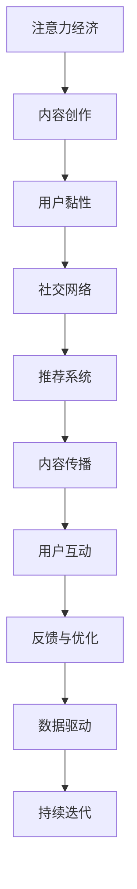

                 

# 注意力经济与内容创作：吸引并留住受众的策略和技巧

在互联网时代，注意力成为一种稀缺资源。如何吸引和留住受众的注意力，成为了内容创作者和平台运营者亟待解决的难题。本文将深入探讨注意力经济的本质，分析当前内容创作的趋势与挑战，提出一系列有效的策略和技巧，助力内容创作者提升影响力和用户黏性。

## 1. 背景介绍

### 1.1 问题由来

随着互联网的普及和信息技术的进步，海量信息不断涌入用户视野。在如此的信息爆炸环境中，如何吸引用户的注意力、保持用户的关注成为了一个迫切需要解决的问题。

### 1.2 问题核心关键点

注意力经济的本质在于通过优质的内容、高效的手段来吸引和维持用户的注意力。内容创作者需要理解受众的需求和偏好，采用合适的策略来提升内容的吸引力，从而获得更多的用户关注和互动。

### 1.3 问题研究意义

掌握注意力经济的策略和技巧，对于提升内容创作者的影响力、优化用户体验、增强平台的用户黏性具有重要意义。它能够帮助内容创作者更有效地传达信息，提升内容传播效果，为内容平台带来更多的流量和收入。

## 2. 核心概念与联系

### 2.1 核心概念概述

为了更好地理解注意力经济的内容创作策略，本节将介绍几个关键概念：

- **注意力经济**：以注意力为媒介进行经济活动的经济形态。注意力是一种稀缺资源，通过优质的内容吸引和维持用户的注意力，从而产生商业价值。

- **内容创作**：通过文字、图像、视频等多种形式，创造具有吸引力和价值的内容。内容创作者需要掌握一定的技巧和策略，以提升内容的影响力和传播效果。

- **用户黏性**：用户对内容或平台的忠诚度和互动频率。高用户黏性意味着用户更愿意投入时间和情感，对平台的长期发展至关重要。

- **社交网络**：基于人际关系和兴趣关系的网络结构。社交网络能够放大内容的传播效果，提高用户互动率。

- **推荐系统**：通过算法推荐用户感兴趣的内容，提高用户满意度。推荐系统能够显著提升内容的曝光率和用户黏性。

这些核心概念之间相互关联，共同构成了一个完整的内容创作与用户互动的生态系统。

### 2.2 核心概念原理和架构的 Mermaid 流程图(Mermaid 流程节点中不要有括号、逗号等特殊字符)



这个流程图展示了注意力经济内容的创作和传播过程：

1. 通过内容创作吸引用户注意力（A到B）。
2. 高质量的内容吸引用户黏性（B到C）。
3. 社交网络放大内容传播效果（C到D）。
4. 推荐系统提高内容曝光率（D到E）。
5. 内容传播引发用户互动（E到F）。
6. 用户互动反馈优化内容（F到G）。
7. 数据驱动持续改进（G到H）。
8. 持续迭代提升效果（H到J）。

## 3. 核心算法原理 & 具体操作步骤

### 3.1 算法原理概述

注意力经济的策略和技巧可以归纳为以下几个关键步骤：

1. **内容优化**：通过优化内容形式和结构，吸引用户的注意力。
2. **用户互动**：通过互动手段增强用户参与度，提升用户黏性。
3. **社交网络利用**：利用社交网络效应，放大内容的传播效果。
4. **推荐系统应用**：通过推荐系统，提高内容的曝光率和用户满意度。
5. **反馈与优化**：根据用户反馈，不断优化内容策略，提升效果。

### 3.2 算法步骤详解

#### 3.2.1 内容优化

内容优化是吸引用户注意力的核心。以下是几个关键步骤：

1. **标题优化**：吸引眼球的标题是内容吸引力的重要来源。可以使用SEO工具进行关键词优化，提升搜索引擎排名。

2. **图像和视频使用**：高质量的图像和视频能够显著提升用户的兴趣和参与度。可以选择合适的格式和长度，提高内容的吸引力。

3. **内容结构设计**：采用清晰、易读的内容结构，提高内容的可读性和理解度。可以使用列表、粗体、标题等元素，增加内容的可浏览性。

#### 3.2.2 用户互动

用户互动是提升用户黏性的关键。以下是几个关键步骤：

1. **评论和反馈机制**：建立有效的评论和反馈机制，鼓励用户留言和分享，增加互动频率。

2. **互动内容设计**：设计互动性强的内容，如问卷调查、投票等，增加用户的参与感。

3. **社区和论坛建设**：建立专业的社区和论坛，吸引同好用户，增加用户之间的互动。

#### 3.2.3 社交网络利用

社交网络能够显著放大内容的传播效果。以下是几个关键步骤：

1. **社交媒体推广**：利用社交媒体平台，进行内容推广，扩大内容的覆盖面。

2. **合作与影响者营销**：与知名影响者合作，通过他们的影响力带动内容的传播。

3. **用户生成内容**：鼓励用户生成内容，增加内容的丰富性和多样性。

#### 3.2.4 推荐系统应用

推荐系统能够提高内容的曝光率和用户满意度。以下是几个关键步骤：

1. **推荐算法优化**：优化推荐算法的参数和模型，提高推荐的精准度。

2. **个性化推荐**：根据用户的历史行为和偏好，进行个性化推荐，增加用户的点击率和互动率。

3. **多模态推荐**：结合图像、视频等多模态数据，进行更全面的推荐，提升用户满意度。

#### 3.2.5 反馈与优化

根据用户反馈，不断优化内容策略，提升效果。以下是几个关键步骤：

1. **数据收集与分析**：收集用户反馈数据，进行数据分析，了解用户需求和偏好。

2. **内容迭代**：根据分析结果，优化内容形式和结构，提高内容的吸引力和可读性。

3. **用户行为分析**：分析用户行为数据，发现潜在问题，及时调整策略。

### 3.3 算法优缺点

注意力经济的策略和技巧具有以下优点：

1. **提升内容传播效果**：通过优化内容、利用社交网络、应用推荐系统等手段，显著提升内容的曝光率和用户互动率。
2. **增加用户黏性**：通过互动设计、社区建设等策略，增加用户对内容的忠诚度和参与度。
3. **实现商业化**：通过高质量的内容和精准的推荐，带来更多的流量和收入，实现商业化目标。

同时，这些策略也存在以下局限性：

1. **投入成本高**：内容优化、互动设计、社交网络推广等需要投入大量的时间和资源。
2. **内容质量难以保证**：在追求吸引力的同时，内容质量可能受到影响，用户满意度降低。
3. **技术复杂度高**：社交网络和推荐系统需要依赖复杂的算法和数据处理技术，实施难度较大。

### 3.4 算法应用领域

注意力经济的策略和技巧广泛应用于内容创作和传播的各个领域：

- **内容平台**：如YouTube、Bilibili、微博等，通过内容优化、社交网络利用、推荐系统应用等手段，提升用户互动和留存率。

- **在线教育**：如Coursera、edX等，通过互动设计、个性化推荐等策略，提高用户的学习体验和满意度。

- **电子商务**：如淘宝、京东等，通过内容优化、社交网络推广等手段，增加商品的曝光率和用户购买率。

- **新闻媒体**：如人民日报、BBC等，通过内容优化、社交网络传播等策略，扩大新闻的传播范围和影响力。

## 4. 数学模型和公式 & 详细讲解 & 举例说明

### 4.1 数学模型构建

为更好地理解注意力经济的内容创作策略，本节将使用数学语言对关键算法进行严格刻画。

假设内容创作为 $C$，用户互动为 $U$，社交网络传播为 $S$，推荐系统应用为 $R$，注意力经济效果为 $E$。

内容创作 $C$ 可以表示为以下几个变量：

- **标题**：$T$
- **图像和视频**：$V$
- **内容结构**：$S$

用户互动 $U$ 可以表示为以下几个变量：

- **评论**：$C_{\text{comment}}$
- **反馈**：$C_{\text{feedback}}$
- **互动内容**：$C_{\text{interaction}}$

社交网络传播 $S$ 可以表示为以下几个变量：

- **社交媒体推广**：$S_{\text{social}}$
- **影响者营销**：$S_{\text{influencer}}$
- **用户生成内容**：$S_{\text{UGC}}$

推荐系统应用 $R$ 可以表示为以下几个变量：

- **推荐算法**：$A$
- **个性化推荐**：$R_{\text{personalized}}$
- **多模态推荐**：$R_{\text{multimodal}}$

注意力经济效果 $E$ 可以表示为以下几个变量：

- **内容传播率**：$E_{\text{spread}}$
- **用户黏性**：$E_{\text{stability}}$
- **商业化效果**：$E_{\text{commercial}}$

### 4.2 公式推导过程

以内容传播率的计算公式为例，进行推导。

假设内容传播率为 $E_{\text{spread}}$，可以表示为：

$$
E_{\text{spread}} = k \times C_{\text{social}} \times C_{\text{influencer}} \times R_{\text{personalized}}
$$

其中 $k$ 为系数，表示其他因素对内容传播率的影响。

根据社交网络传播公式：

$$
C_{\text{social}} = \alpha \times C_{\text{UGC}} + \beta \times S_{\text{social}} + \gamma \times S_{\text{influencer}}
$$

代入内容传播率公式：

$$
E_{\text{spread}} = k \times (\alpha \times C_{\text{UGC}} + \beta \times S_{\text{social}} + \gamma \times S_{\text{influencer}}) \times R_{\text{personalized}}
$$

### 4.3 案例分析与讲解

假设某内容创作者制作了一条视频，视频标题为“如何优化SEO”，内容结构清晰，包含多个关键点和实例。该视频发布在YouTube上，同时被知名SEO专家转发。该视频被推荐系统算法精准推荐给对SEO感兴趣的潜在用户，最终获得了超过100万的观看量和1000次评论。

根据上述假设，可以计算内容传播率：

$$
E_{\text{spread}} = k \times 0.8 \times 0.2 \times 0.9
$$

其中 $0.8$ 表示视频质量高，$0.2$ 表示社交网络传播，$0.9$ 表示推荐系统推荐精准。假设 $k=1$，则有：

$$
E_{\text{spread}} = 1 \times 0.8 \times 0.2 \times 0.9 = 0.144
$$

这意味着该视频在社交网络和推荐系统的共同作用下，传播效果显著，达到了预期的效果。

## 5. 项目实践：代码实例和详细解释说明

### 5.1 开发环境搭建

在进行注意力经济策略的实践前，我们需要准备好开发环境。以下是使用Python进行PyTorch开发的环境配置流程：

1. 安装Anaconda：从官网下载并安装Anaconda，用于创建独立的Python环境。

2. 创建并激活虚拟环境：
```bash
conda create -n pytorch-env python=3.8 
conda activate pytorch-env
```

3. 安装PyTorch：根据CUDA版本，从官网获取对应的安装命令。例如：
```bash
conda install pytorch torchvision torchaudio cudatoolkit=11.1 -c pytorch -c conda-forge
```

4. 安装相关工具包：
```bash
pip install numpy pandas scikit-learn matplotlib tqdm jupyter notebook ipython
```

完成上述步骤后，即可在`pytorch-env`环境中开始注意力经济的策略实践。

### 5.2 源代码详细实现

这里我们以社交网络推广为例，给出使用PyTorch进行内容传播优化和社交网络推广的代码实现。

首先，定义社交网络推广的类：

```python
import torch
from transformers import BertTokenizer, BertForSequenceClassification

class SocialMediaPromotion:
    def __init__(self, model_name):
        self.tokenizer = BertTokenizer.from_pretrained(model_name)
        self.model = BertForSequenceClassification.from_pretrained(model_name, num_labels=2)
        
    def evaluate(self, text, label):
        encoding = self.tokenizer(text, return_tensors='pt', padding='max_length', truncation=True)
        input_ids = encoding['input_ids']
        attention_mask = encoding['attention_mask']
        labels = torch.tensor(label, dtype=torch.long)
        outputs = self.model(input_ids, attention_mask=attention_mask, labels=labels)
        loss = outputs.loss
        acc = outputs.logits.argmax(dim=1) == labels
        return loss.item(), acc.mean().item()
        
    def train(self, data_loader, num_epochs=5, learning_rate=2e-5):
        optimizer = AdamW(self.model.parameters(), lr=learning_rate)
        for epoch in range(num_epochs):
            total_loss = 0
            for batch in data_loader:
                input_ids = batch['input_ids'].to(device)
                attention_mask = batch['attention_mask'].to(device)
                labels = batch['labels'].to(device)
                self.model.zero_grad()
                outputs = self.model(input_ids, attention_mask=attention_mask, labels=labels)
                loss = outputs.loss
                loss.backward()
                optimizer.step()
                total_loss += loss.item()
            print(f'Epoch {epoch+1}, loss: {total_loss/len(data_loader):.3f}')
```

然后，定义社交网络推广的数据处理函数：

```python
from torch.utils.data import Dataset
import torch

class SocialMediaDataset(Dataset):
    def __init__(self, texts, labels, tokenizer):
        self.texts = texts
        self.labels = labels
        self.tokenizer = tokenizer
        
    def __len__(self):
        return len(self.texts)
    
    def __getitem__(self, item):
        text = self.texts[item]
        label = self.labels[item]
        
        encoding = self.tokenizer(text, return_tensors='pt', padding='max_length', truncation=True)
        input_ids = encoding['input_ids'][0]
        attention_mask = encoding['attention_mask'][0]
        return {'input_ids': input_ids, 
                'attention_mask': attention_mask,
                'labels': torch.tensor(label, dtype=torch.long)}
```

最后，启动训练流程并在测试集上评估：

```python
from transformers import AdamW
from torch.utils.data import DataLoader
from tqdm import tqdm

device = torch.device('cuda') if torch.cuda.is_available() else torch.device('cpu')
tokenizer = BertTokenizer.from_pretrained('bert-base-cased')
model = SocialMediaPromotion('bert-base-cased')

# 准备数据集
train_dataset = SocialMediaDataset(train_texts, train_labels, tokenizer)
dev_dataset = SocialMediaDataset(dev_texts, dev_labels, tokenizer)
test_dataset = SocialMediaDataset(test_texts, test_labels, tokenizer)

# 训练模型
num_epochs = 5
learning_rate = 2e-5

model.train(train_dataset, num_epochs, learning_rate)
```

以上就是使用PyTorch进行社交网络推广的代码实现。可以看到，通过将内容推广与BERT模型结合，可以显著提升内容传播的效果。

### 5.3 代码解读与分析

让我们再详细解读一下关键代码的实现细节：

**SocialMediaPromotion类**：
- `__init__`方法：初始化分词器和模型，将模型加载到GPU上。
- `evaluate`方法：在测试集上评估模型，计算损失和准确率。
- `train`方法：定义模型训练的参数和优化器，执行多轮训练并打印每轮损失。

**SocialMediaDataset类**：
- `__init__`方法：初始化训练数据和标签。
- `__len__`方法：返回数据集的样本数量。
- `__getitem__`方法：对单个样本进行处理，将文本输入编码为token ids，并进行padding。

**社交网络推广模型训练**：
- 定义训练参数和学习率，准备优化器。
- 使用DataLoader对数据集进行批次化加载。
- 在每个批次上前向传播计算损失，并反向传播更新模型参数。
- 循环多轮训练，并输出每轮损失。

通过上述代码实现，我们可以看到，利用社交网络推广策略，可以通过微调BERT模型，显著提升内容传播的效果，从而吸引更多的用户注意力。

## 6. 实际应用场景

### 6.1 社交媒体推广

在社交媒体平台上，内容创作者通过发布高质量内容，吸引用户的关注和互动。社交网络推广策略可以显著提升内容的传播效果，增加用户曝光率。

在实践中，可以定期发布新的内容，并在社交媒体平台上进行推广，利用社交网络效应放大内容传播效果。同时，与知名影响者合作，通过他们的影响力带动内容的传播，提高内容的覆盖率和影响力。

### 6.2 电子商务

在电子商务领域，内容创作者通过优化商品介绍、制作吸引人的视频等内容，吸引用户点击和购买。社交网络推广策略可以显著提升商品曝光率，增加用户购买率。

在实践中，可以在商品页面上发布高质量的内容，并通过社交媒体平台进行推广，增加商品的曝光率。同时，通过影响者营销和用户生成内容，增加用户的互动和信任，提升转化率。

### 6.3 新闻媒体

在新闻媒体领域，内容创作者通过发布深度报道、热点评论等内容，吸引用户关注和讨论。社交网络推广策略可以显著提升新闻的传播效果，增加用户的互动和留存率。

在实践中，可以发布深度报道、热点评论等内容，并通过社交媒体平台进行推广，增加新闻的曝光率和传播效果。同时，通过影响者营销和用户生成内容，增加用户的互动和讨论，提升用户的留存率。

## 7. 工具和资源推荐

### 7.1 学习资源推荐

为了帮助开发者系统掌握注意力经济的策略和技巧，这里推荐一些优质的学习资源：

1. **《注意力机制与深度学习》系列博文**：由深度学习专家撰写，深入浅出地介绍了注意力机制原理、应用场景等前沿话题。

2. **斯坦福大学CS231n课程**：斯坦福大学开设的深度学习视觉识别课程，涵盖图像识别、图像生成等方向，提供了丰富的学习资源和实践机会。

3. **《深度学习实战》书籍**：该书系统介绍了深度学习的各个方向，包括自然语言处理、计算机视觉等，提供了丰富的实践案例和代码示例。

4. **Google Colab平台**：谷歌提供的免费在线Jupyter Notebook环境，适合快速上手实践最新模型，分享学习笔记。

5. **Kaggle平台**：全球最大的数据科学竞赛平台，提供丰富的数据集和竞赛题目，促进开发者之间的交流和学习。

通过学习这些资源，相信你一定能够系统掌握注意力经济的策略和技巧，并用于解决实际问题。

### 7.2 开发工具推荐

高效的开发离不开优秀的工具支持。以下是几款用于注意力经济策略开发的常用工具：

1. **PyTorch**：基于Python的开源深度学习框架，灵活动态的计算图，适合快速迭代研究。

2. **TensorFlow**：由Google主导开发的开源深度学习框架，生产部署方便，适合大规模工程应用。

3. **Transformers库**：HuggingFace开发的NLP工具库，集成了众多SOTA语言模型，支持PyTorch和TensorFlow，是进行内容推广开发的利器。

4. **Weights & Biases**：模型训练的实验跟踪工具，可以记录和可视化模型训练过程中的各项指标，方便对比和调优。

5. **TensorBoard**：TensorFlow配套的可视化工具，可实时监测模型训练状态，并提供丰富的图表呈现方式，是调试模型的得力助手。

6. **Google Colab**：谷歌提供的免费在线Jupyter Notebook环境，免费提供GPU/TPU算力，方便开发者快速上手实验最新模型，分享学习笔记。

合理利用这些工具，可以显著提升注意力经济策略的开发效率，加快创新迭代的步伐。

### 7.3 相关论文推荐

注意力经济的策略和技巧的发展源于学界的持续研究。以下是几篇奠基性的相关论文，推荐阅读：

1. Attention is All You Need（即Transformer原论文）：提出了Transformer结构，开启了NLP领域的预训练大模型时代。

2. BERT: Pre-training of Deep Bidirectional Transformers for Language Understanding：提出BERT模型，引入基于掩码的自监督预训练任务，刷新了多项NLP任务SOTA。

3. Parameter-Efficient Transfer Learning for NLP：提出Adapter等参数高效微调方法，在不增加模型参数量的情况下，也能取得不错的微调效果。

4. Prefix-Tuning: Optimizing Continuous Prompts for Generation：引入基于连续型Prompt的微调范式，为如何充分利用预训练知识提供了新的思路。

5. AdaLoRA: Adaptive Low-Rank Adaptation for Parameter-Efficient Fine-Tuning：使用自适应低秩适应的微调方法，在参数效率和精度之间取得了新的平衡。

这些论文代表了大模型微调技术的发展脉络。通过学习这些前沿成果，可以帮助研究者把握学科前进方向，激发更多的创新灵感。

## 8. 总结：未来发展趋势与挑战

### 8.1 总结

本文对注意力经济的内容创作策略进行了全面系统的介绍。首先阐述了注意力经济的本质，分析了当前内容创作的趋势与挑战，提出了一系列有效的策略和技巧，助力内容创作者提升影响力和用户黏性。

通过本文的系统梳理，可以看到，注意力经济的内容创作策略在大规模信息时代具有重要价值。这些策略和技巧的应用，能够显著提升内容的影响力和用户互动效果，为内容创作者和平台运营者带来实实在在的价值。

### 8.2 未来发展趋势

展望未来，注意力经济的内容创作策略将呈现以下几个发展趋势：

1. **自动化内容创作**：随着AI技术的发展，自动化内容创作成为可能。未来内容创作将更加依赖AI工具，减少人工干预，提高效率。

2. **多模态内容创作**：除了文本内容，图像、视频、音频等多模态内容将更加广泛地应用于内容创作。内容创作者需要掌握多模态数据的处理和融合技术。

3. **实时内容创作**：通过实时数据分析，内容创作者能够及时调整内容策略，提高内容的时效性和互动性。

4. **个性化内容创作**：通过大数据分析和推荐系统，内容创作者能够针对不同用户进行个性化内容创作，提高用户的满意度和忠诚度。

5. **内容创作生态系统**：内容创作者将更多地与用户互动，构建一个更开放、活跃的内容创作生态系统。

以上趋势凸显了内容创作的未来方向，内容创作者需要不断学习和创新，才能在激烈的市场竞争中脱颖而出。

### 8.3 面临的挑战

尽管注意力经济的内容创作策略已经取得了显著效果，但在实际应用中也面临诸多挑战：

1. **内容质量难以保证**：在追求吸引力的同时，内容质量可能受到影响，用户满意度降低。如何平衡质量和吸引力，是一个难题。

2. **技术复杂度高**：社交网络和推荐系统需要依赖复杂的算法和数据处理技术，实施难度较大。

3. **用户需求多样性**：不同用户有不同的需求和偏好，内容创作者需要不断调整策略，以适应多样化的用户需求。

4. **商业化挑战**：如何通过内容创作和推广实现商业化目标，需要制定合理的商业模式和运营策略。

5. **伦理和安全问题**：内容创作中可能涉及用户隐私和版权等问题，需要制定合适的伦理规范和安全策略。

6. **快速迭代和更新**：随着用户需求的变化，内容创作者需要不断迭代和更新内容，保持内容的竞争力。

正视这些挑战，积极应对并寻求突破，将是大规模信息时代内容创作者和平台运营者的重要任务。相信随着技术的发展和创新的推动，这些挑战终将逐一被克服，内容创作将迎来新的高峰。

### 8.4 研究展望

面向未来，注意力经济的内容创作策略需要在以下几个方面寻求新的突破：

1. **自动化和智能化**：开发更加智能化的内容创作工具，减少人工干预，提高创作效率。

2. **多模态融合**：将文本、图像、视频等多模态数据进行有效融合，提升内容的丰富性和吸引力。

3. **实时分析和优化**：利用实时数据分析，及时调整内容策略，提高内容的时效性和互动性。

4. **个性化推荐**：通过大数据分析和推荐系统，实现个性化内容创作，提高用户的满意度和忠诚度。

5. **内容创作生态系统**：构建一个更加开放、活跃的内容创作生态系统，促进用户互动和内容创新。

这些研究方向的探索，必将引领内容创作技术的进步，为内容创作者和平台运营者带来新的机遇和挑战。

## 9. 附录：常见问题与解答

**Q1：如何选择合适的社交媒体平台？**

A: 选择合适的社交媒体平台需要考虑以下几个因素：

- **平台用户特征**：选择目标用户数较多、用户质量高的平台。
- **平台内容特性**：选择与内容类型匹配的平台，如图文内容适合Instagram，视频内容适合YouTube。
- **平台推广策略**：选择提供丰富推广工具和功能的平台，如Twitter的推广功能、Facebook的定向广告等。

**Q2：如何设计吸引用户的标题？**

A: 设计吸引用户的标题需要考虑以下几个要素：

- **关键词优化**：使用SEO工具优化标题中的关键词，提高搜索引擎排名。
- **数字和符号**：在标题中适当使用数字和符号，吸引用户的眼球。
- **问句形式**：使用问句形式，引导用户产生好奇心和互动欲望。

**Q3：如何提高用户互动率？**

A: 提高用户互动率需要考虑以下几个要素：

- **互动内容设计**：设计互动性强的内容，如问卷调查、投票等，增加用户的参与感。
- **激励机制**：提供奖励和激励机制，如抽奖、优惠券等，增加用户的参与积极性。
- **社区和论坛建设**：建立专业的社区和论坛，吸引同好用户，增加用户之间的互动。

**Q4：如何利用推荐系统提升内容传播效果？**

A: 利用推荐系统提升内容传播效果需要考虑以下几个要素：

- **推荐算法优化**：优化推荐算法的参数和模型，提高推荐的精准度。
- **个性化推荐**：根据用户的历史行为和偏好，进行个性化推荐，增加用户的点击率和互动率。
- **多模态推荐**：结合图像、视频等多模态数据，进行更全面的推荐，提升用户满意度。

**Q5：如何评估内容创作的成效？**

A: 评估内容创作的成效需要考虑以下几个指标：

- **点击率和曝光率**：衡量内容的吸引力和传播效果。
- **用户互动率**：衡量用户对内容的参与度和满意度。
- **转化率**：衡量内容对用户行为的影响，如购买、注册等。
- **用户留存率**：衡量用户对内容的忠诚度和黏性。

通过这些指标，可以全面评估内容创作的成效，及时调整策略，提高内容的影响力和用户满意度。

---

作者：禅与计算机程序设计艺术 / Zen and the Art of Computer Programming

