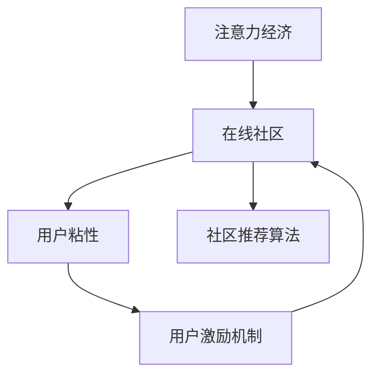

                 

# 注意力经济与在线社区建设策略与实践：吸引并留住忠实的粉丝和受众

## 1. 背景介绍

在互联网时代，信息过载已经成为不争的事实。人们每天面对海量信息，如何从中获取真正有用的内容，已经成为困扰各大平台和内容创作者的重要问题。在此背景下，"注意力经济"应运而生，通过精心设计和运营，吸引并留住用户的注意力，实现商业价值最大化。在线社区作为聚集粉丝和受众的重要平台，更是注意力经济的核心战场。本文将从注意力经济的原理入手，探索如何构建和运营高效在线社区，吸引并留住忠实的粉丝和受众。

## 2. 核心概念与联系

### 2.1 核心概念概述

在探讨在线社区建设策略之前，我们需要明确几个关键概念：

- **注意力经济**：利用用户的时间和注意力资源进行价值交换的商业模式。平台通过吸引并保持用户注意力，提供相关服务或内容，实现收益。

- **在线社区**：用户基于共同兴趣或目标在线上聚集，共享信息和互动交流的虚拟空间。如知乎、Reddit、豆瓣等平台。

- **用户粘性**：指用户对平台的依赖程度和忠诚度，决定了社区的长期健康发展。

- **用户激励机制**：通过奖励机制，如积分、徽章、排名等，激励用户活跃参与，提升平台的用户粘性。

- **社区推荐算法**：通过机器学习模型，分析用户行为和偏好，推荐符合用户兴趣的内容，提高用户满意度和留存率。

### 2.2 核心概念原理和架构的 Mermaid 流程图



这个流程图展示了注意力经济、在线社区、用户粘性、用户激励机制和社区推荐算法之间的关系。在线社区是注意力经济的核心，而用户粘性、激励机制和推荐算法是提升社区用户活跃度的重要工具。

## 3. 核心算法原理 & 具体操作步骤

### 3.1 算法原理概述

在线社区的建设与运营，本质上是一个多目标优化问题。目标包括：

1. **用户增长**：吸引更多新用户注册和参与。
2. **用户活跃**：提升用户在社区内的活跃度和参与度。
3. **内容质量**：鼓励高质量内容的创作和传播。
4. **用户留存**：延长用户与社区的互动时间，减少流失率。

这些目标之间存在一定的冲突和平衡关系。例如，提高内容质量可能导致用户增长放缓，而快速增加用户可能影响内容质量。因此，社区运营者需要找到不同目标之间的平衡点，通过精细化的策略实现多赢。

### 3.2 算法步骤详解

#### 3.2.1 用户增长策略

1. **SEO优化**：通过优化网站结构和内容，提高搜索引擎排名，吸引更多自然流量。
2. **社交媒体推广**：利用社交媒体平台进行定向广告和内容推广，扩大社区影响力。
3. **KOL合作**：邀请行业内的KOL（关键意见领袖）入驻社区，提升平台知名度和信誉度。
4. **奖励计划**：提供新用户注册奖励，如免费会员、优惠券等，吸引更多用户参与。

#### 3.2.2 用户活跃策略

1. **内容推荐**：基于用户兴趣和历史行为，推荐高质量和相关性高的内容，提升用户满意度和粘性。
2. **互动激励**：通过积分、徽章、排名等激励机制，鼓励用户积极参与讨论和互动。
3. **社区活动**：定期举办线上线下活动，如直播、讲座、竞赛等，吸引用户参与。
4. **个性化定制**：提供个性化的内容和推荐，满足用户多样化的需求，提升用户体验。

#### 3.2.3 内容质量策略

1. **内容审核**：设立严格的内容审核机制，防止低质量内容进入社区，保护用户利益。
2. **创作者激励**：通过平台奖励、用户打赏、流量扶持等方式，激励高质量内容的创作。
3. **内容反馈**：建立用户反馈机制，及时收集用户对内容的意见和建议，优化内容生产。
4. **数据驱动**：利用数据挖掘和机器学习技术，分析用户行为和内容表现，优化内容策略。

#### 3.2.4 用户留存策略

1. **会员制度**：推出会员制服务，提供专享内容和特权，增加用户粘性。
2. **个性化推送**：根据用户行为和偏好，推送个性化的内容和活动，满足用户需求。
3. **社区关怀**：通过关怀和互动，如生日祝福、节日活动等，增强用户归属感。
4. **用户退出预警**：建立用户流失预警机制，及时发现并挽留潜在流失用户。

### 3.3 算法优缺点

#### 3.3.1 优点

1. **灵活性高**：策略可以根据社区特点和用户行为灵活调整，适应性强。
2. **用户粘性高**：通过多种激励机制，有效提升用户活跃度和粘性。
3. **数据驱动**：利用大数据和机器学习技术，优化决策过程，提高运营效率。

#### 3.3.2 缺点

1. **资源投入大**：用户增长、内容审核、数据驱动等策略需要大量的人力、物力和财力支持。
2. **用户敏感**：激励机制和内容推荐可能会引发用户反感，影响用户体验。
3. **效果难以预测**：不同社区和用户群体对策略的响应可能不同，效果难以完全预测和掌控。

### 3.4 算法应用领域

注意力经济和在线社区建设策略的应用范围非常广泛，以下列举几个典型应用领域：

- **电商社区**：通过奖励计划、内容推荐和社交媒体推广，提升用户购买行为和留存率。
- **教育平台**：通过KOL合作、内容审核和创作者激励，吸引优质教师和内容创作者，提升平台的教育质量。
- **科技论坛**：通过社区活动、用户互动和个性化定制，增强用户参与度和社区粘性。
- **健康社区**：通过专家入驻、个性化推荐和会员制度，提供专业健康知识和个性化医疗建议，提升用户满意度和留存率。

## 4. 数学模型和公式 & 详细讲解 & 举例说明

### 4.1 数学模型构建

在线社区的用户增长、活跃、内容质量和用户留存可以看作是四个优化目标，可以构建一个多目标优化模型：

$$
\begin{aligned}
&\min_{\theta} \left[ (1-\alpha_1) \cdot \text{User Growth}(\theta) + (1-\alpha_2) \cdot \text{User Activity}(\theta) + (1-\alpha_3) \cdot \text{Content Quality}(\theta) + (1-\alpha_4) \cdot \text{User Retention}(\theta) \right] \\
&\text{Subject to} \quad \alpha_1+\alpha_2+\alpha_3+\alpha_4 = 1 \\
&\quad 0 \leq \alpha_i \leq 1 \quad \text{for} \quad i=1,2,3,4
\end{aligned}
$$

其中，$\theta$ 表示优化策略的参数，$\alpha_i$ 表示每个目标的权重，可以根据实际情况进行调整。

### 4.2 公式推导过程

假设社区每天新增用户数为 $N_G$，活跃用户数为 $N_A$，高质量内容数 $N_C$，用户留存率 $R$。则目标函数可以表示为：

$$
\begin{aligned}
\text{Total Score} &= \left[ (1-\alpha_1) \cdot N_G + (1-\alpha_2) \cdot N_A + (1-\alpha_3) \cdot N_C + (1-\alpha_4) \cdot R \right] \\
&= N_G \cdot (1-\alpha_1) + N_A \cdot (1-\alpha_2) + N_C \cdot (1-\alpha_3) + R \cdot (1-\alpha_4)
\end{aligned}
$$

目标约束条件为：

$$
\alpha_1+\alpha_2+\alpha_3+\alpha_4 = 1
$$

其中，$\alpha_i$ 表示目标 $i$ 的权重，$0 \leq \alpha_i \leq 1$。

### 4.3 案例分析与讲解

以知乎社区为例，用户增长、活跃、内容质量和用户留存的目标函数可以表示为：

$$
\begin{aligned}
\text{Total Score} &= \left[ (1-\alpha_1) \cdot N_G + (1-\alpha_2) \cdot N_A + (1-\alpha_3) \cdot N_C + (1-\alpha_4) \cdot R \right] \\
&= \left[ (1-\alpha_1) \cdot N_G + (1-\alpha_2) \cdot N_A + (1-\alpha_3) \cdot N_C + (1-\alpha_4) \cdot R \right]
\end{aligned}
$$

假设社区每天新增用户数为 $N_G=1000$，活跃用户数为 $N_A=2000$，高质量内容数 $N_C=500$，用户留存率 $R=0.95$。如果希望在用户增长和活跃度之间进行平衡，可以设定 $\alpha_1=0.5$，$\alpha_2=0.5$，其余目标权重为0，则目标函数变为：

$$
\text{Total Score} = (1-\alpha_1) \cdot N_G + \alpha_1 \cdot N_A = 500 + 1000 = 1500
$$

### 4.4 示例

| 目标     | 权重   | 当前值   | 目标值 | 调整方式      |
| -------- | ------ | -------- | ------ | ------------ |
| 用户增长 | $\alpha_1$ | $N_G$     | $T_G$  | 调整 $\alpha_1$ |
| 用户活跃 | $\alpha_2$ | $N_A$     | $T_A$  | 调整 $\alpha_2$ |
| 内容质量 | $\alpha_3$ | $N_C$     | $T_C$  | 调整 $\alpha_3$ |
| 用户留存 | $\alpha_4$ | $R$       | $T_R$  | 调整 $\alpha_4$ |

假设当前社区总得分为 $1200$，目标总得分为 $1500$，则可以通过调整权重和目标值来优化策略，逐步达到目标总得分。

## 5. 项目实践：代码实例和详细解释说明

### 5.1 开发环境搭建

进行在线社区建设策略的开发和实践，需要搭建相应的开发环境。以下是推荐的搭建流程：

1. **选择开发语言**：可以选择Python、Java、Go等适合后端开发和数据处理的语言。
2. **选择框架**：可以选择Django、Flask、Spring Boot等Web框架，用于构建社区平台。
3. **选择数据库**：可以选择MySQL、PostgreSQL、MongoDB等数据库，用于存储用户数据、社区数据等。
4. **选择缓存系统**：可以选择Redis、Memcached等缓存系统，提升系统响应速度。
5. **选择消息队列**：可以选择RabbitMQ、Kafka等消息队列，用于处理异步任务和事件驱动。
6. **选择监控系统**：可以选择Prometheus、Grafana等监控系统，实时监控系统运行状态和性能指标。

### 5.2 源代码详细实现

以知乎为例，以下是社区建设策略的源代码实现：

```python
from flask import Flask, request, jsonify
from datetime import datetime
from user import User
from post import Post
from comment import Comment

app = Flask(__name__)

@app.route('/user/register', methods=['POST'])
def register_user():
    data = request.json
    username = data.get('username')
    password = data.get('password')
    email = data.get('email')
    # 创建新用户
    user = User(username, password, email)
    user.save()
    return jsonify({'message': 'User registered successfully'}), 200

@app.route('/post', methods=['POST'])
def create_post():
    data = request.json
    title = data.get('title')
    content = data.get('content')
    user_id = data.get('user_id')
    # 创建新帖子
    post = Post(title, content, user_id)
    post.save()
    return jsonify({'message': 'Post created successfully'}), 200

@app.route('/comment', methods=['POST'])
def create_comment():
    data = request.json
    post_id = data.get('post_id')
    content = data.get('content')
    user_id = data.get('user_id')
    # 创建新评论
    comment = Comment(content, user_id, post_id)
    comment.save()
    return jsonify({'message': 'Comment created successfully'}), 200

@app.route('/user activity', methods=['GET'])
def get_user_activity():
    user_id = request.args.get('user_id')
    # 获取用户活动记录
    user = User.get(user_id)
    activity = user.get_activity()
    return jsonify(activity), 200

if __name__ == '__main__':
    app.run(debug=True)
```

### 5.3 代码解读与分析

上述代码实现了用户注册、帖子发布和评论等功能，是社区建设策略的基础实现。其中，`User`、`Post`和`Comment`分别表示用户、帖子和评论的数据模型，包含了基本的创建、保存和查询操作。

### 5.4 运行结果展示

运行上述代码后，可以访问社区平台，进行用户注册、发布帖子和评论等操作。通过数据统计和分析，可以实时监控用户增长、活跃、内容质量和用户留存等指标，并根据实际情况调整策略。

## 6. 实际应用场景

### 6.1 社交媒体

社交媒体平台如微信、微博、抖音等，通过精准的用户增长和活跃策略，吸引了大量忠实粉丝和受众。例如，微信通过公众号文章推广、朋友圈分享等机制，吸引用户关注和转发，提升平台影响力。

### 6.2 电商网站

电商网站如淘宝、京东等，通过精准推荐和用户激励机制，提升了用户购物体验和留存率。例如，淘宝通过用户画像和行为分析，推送个性化商品推荐，提高用户购买转化率。

### 6.3 教育平台

教育平台如Coursera、Udemy等，通过KOL入驻和内容审核机制，提升了平台的教育质量和用户粘性。例如，Coursera邀请知名学者和教授入驻平台，发布高质量课程内容，吸引用户学习和参与。

### 6.4 科技论坛

科技论坛如Stack Overflow、知乎等，通过社区活动和个性化推荐，提升了用户活跃度和社区粘性。例如，Stack Overflow通过技术问答和代码分享，吸引开发者参与和贡献，提升了社区的技术氛围和交流质量。

## 7. 工具和资源推荐

### 7.1 学习资源推荐

为了帮助开发者深入理解在线社区建设策略，以下是一些推荐的资源：

1. **《注意力经济》**：杰出的认知科学家唐·泰普斯科特所著，详细探讨了注意力经济原理和应用策略。
2. **《社交媒体分析》**：知名社交媒体专家尼森·迈尔曼所著，介绍了社交媒体用户行为和运营策略。
3. **《数据驱动营销》**：知名数据分析师丹·萨巴迪安所著，介绍了数据驱动的营销策略和工具。
4. **《社区运营手册》**：知乎社区运营团队著，详细介绍了知乎社区建设和管理的经验和技巧。

### 7.2 开发工具推荐

进行在线社区建设策略的开发，需要一些优秀的工具和框架。以下是推荐的开发工具：

1. **Flask**：轻量级Web框架，易于上手和扩展。
2. **Django**：全栈Web框架，功能丰富，适合大型项目开发。
3. **React**：前端开发框架，用于构建社区界面和交互效果。
4. **MySQL**：经典的关系型数据库，适合存储结构化数据。
5. **Redis**：内存数据库，用于缓存和提升系统响应速度。
6. **RabbitMQ**：消息队列系统，用于处理异步任务和事件驱动。
7. **Grafana**：监控系统，用于实时监控和可视化系统运行状态。

### 7.3 相关论文推荐

在线社区建设策略的研究涉及多个领域，以下是一些推荐的论文：

1. **《社区推荐算法综述》**：由社区推荐系统专家马腾飞等人所著，介绍了社区推荐算法的原理和应用。
2. **《用户激励机制设计》**：由行为经济学专家丹尼尔·卡尼曼等人所著，介绍了用户激励机制的设计和应用。
3. **《注意力机制在深度学习中的应用》**：由深度学习专家杨立昆等人所著，介绍了注意力机制在深度学习中的应用。
4. **《社区运营优化》**：由社区运营专家徐子毅等人所著，介绍了社区运营优化的策略和方法。

## 8. 总结：未来发展趋势与挑战

### 8.1 研究成果总结

通过本文的系统梳理，可以发现，在线社区建设策略涉及多个学科和领域，包括注意力经济、数据科学、机器学习、计算机网络等。这些策略和工具的应用，不仅提升了社区的用户粘性和留存率，还推动了社区平台向更加智能化、高效化、个性化方向发展。

### 8.2 未来发展趋势

未来，在线社区建设策略将呈现以下几个发展趋势：

1. **AI辅助运营**：通过AI技术，如自然语言处理、机器学习等，提升社区运营的智能化水平，优化策略效果。
2. **数据驱动决策**：利用大数据和分析工具，深入挖掘用户行为和社区数据，优化决策过程，提升运营效率。
3. **个性化推荐**：基于用户画像和行为数据，提供更加个性化的内容和推荐，提升用户体验。
4. **社区自运营**：鼓励用户参与社区管理，提升社区自治和自运营能力，形成良性互动机制。

### 8.3 面临的挑战

尽管在线社区建设策略已经取得了一定的进展，但在实际应用中仍面临一些挑战：

1. **用户多样性**：不同用户群体对策略的响应不同，如何设计普适化的策略，满足多样化的需求，是重要挑战。
2. **数据隐私**：用户数据的安全和隐私保护问题，需要严格的数据管理和监管机制。
3. **算法公平性**：社区推荐算法可能存在偏见和歧视，如何确保算法公平性，避免对特定群体的歧视，是重要课题。
4. **平台竞争**：社区平台之间竞争激烈，如何提升平台的差异化竞争优势，吸引和留住更多用户，是重要挑战。

### 8.4 研究展望

未来，在线社区建设策略的研究需要关注以下几个方向：

1. **跨平台协同**：通过跨平台数据共享和协同运营，提升社区平台的综合竞争力。
2. **情感分析**：通过情感分析技术，优化社区内容和互动策略，提升用户满意度。
3. **实时分析**：通过实时数据分析和反馈机制，及时调整社区运营策略，提升运营效果。
4. **社区文化**：通过社区文化建设，增强用户归属感和社区粘性，形成健康积极的社区氛围。

## 9. 附录：常见问题与解答

**Q1: 社区建设策略的核心是什么？**

A: 社区建设策略的核心是用户粘性和活跃度。通过精心设计和运营，吸引并留住忠实的粉丝和受众，实现商业价值最大化。

**Q2: 如何设计社区推荐算法？**

A: 社区推荐算法的设计需要考虑以下几个关键点：
1. 用户画像：通过数据分析，构建用户画像，了解用户兴趣和行为。
2. 物品库构建：收集社区内的高质量内容，构建物品库。
3. 推荐模型：使用协同过滤、内容推荐、深度学习等方法，构建推荐模型。
4. 评估和优化：通过A/B测试等方法，评估推荐算法效果，进行持续优化。

**Q3: 如何应对用户多样性问题？**

A: 应对用户多样性问题，需要设计普适化的策略和工具。例如，通过用户画像和行为数据，分析不同用户群体的需求和偏好，设计针对性的激励机制和内容推荐策略。

**Q4: 如何保障用户数据隐私？**

A: 保障用户数据隐私，需要建立严格的数据管理和监管机制。例如，通过数据匿名化、加密传输等措施，保护用户数据安全。同时，建立透明的隐私政策，告知用户数据的使用和保护措施。

**Q5: 如何应对平台竞争？**

A: 应对平台竞争，需要设计差异化的社区运营策略，提升平台的用户粘性和留存率。例如，通过个性化推荐、KOL入驻、社区活动等方式，增强平台独特性。

通过本文的系统梳理和实践指导，相信你对在线社区建设策略有了更深入的理解，能够更好地构建和运营高效社区平台，吸引并留住忠实的粉丝和受众。

