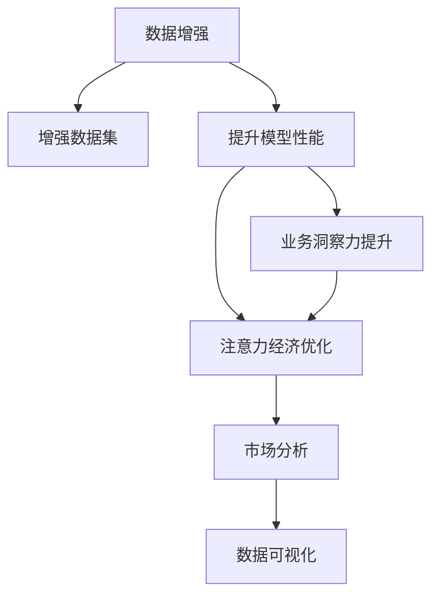

                 

# 注意力经济与数据驱动决策：利用数据增强业务和市场洞察力

> 关键词：数据增强,注意力经济,业务洞察力,市场分析,数据可视化

## 1. 背景介绍

### 1.1 问题由来
在当今数字化时代，企业面临着前所未有的机遇与挑战。大数据、云计算、人工智能等新兴技术的普及，极大地提升了数据获取和处理的能力，但也带来了数据量和复杂性的爆炸性增长。如何有效地利用海量数据，从中挖掘出有价值的洞察力，提升业务决策的精准性和效率，成为众多企业亟待解决的问题。

数据驱动决策（Data-Driven Decision Making）的核心在于通过数据挖掘、统计分析和机器学习等技术手段，从数据中提取出关键的业务洞见，辅助企业制定更加科学合理的经营策略。而数据增强（Data Augmentation）则是一种有效提升数据集多样性和丰富性的技术手段，通过生成更多的训练样本，显著提升模型的泛化能力和性能。

将数据增强技术应用到数据驱动决策中，可以更加全面、准确地理解和预测市场趋势，提升企业在竞争激烈的市场环境中保持领先地位的能力。本文将深入探讨数据增强在注意力经济中的作用，以及如何利用数据增强技术提升企业业务和市场洞察力。

## 2. 核心概念与联系

### 2.1 核心概念概述

为了更好地理解数据增强在注意力经济中的作用，本节将介绍几个关键概念：

- **数据增强（Data Augmentation）**：指通过变换和扩充现有数据，生成新的训练样本，以丰富模型训练数据集的过程。数据增强可以提升模型的泛化能力，使其在面对未知数据时表现更好。

- **注意力经济（Attention Economy）**：指在信息爆炸时代，消费者和企业需要花费大量注意力以选择和消费最有价值的信息。注意力经济的核心在于利用注意力机制，使企业能够更好地吸引和保持用户注意力，提升产品或服务的价值。

- **业务洞察力（Business Insights）**：指通过数据分析和机器学习，挖掘出对企业经营战略和业务决策具有重要参考价值的信息。业务洞察力是企业进行市场竞争、产品创新、客户关系管理等活动的重要依据。

- **市场分析（Market Analysis）**：指对市场环境、竞争对手、消费者行为等进行系统分析，以理解市场动态和趋势。市场分析是企业制定市场策略和优化营销手段的基础。

- **数据可视化（Data Visualization）**：指将数据转化为直观的图形或图表，以帮助决策者更好地理解数据，做出更加明智的决策。数据可视化是提升数据洞察力的有效手段。

这些核心概念之间的联系可以概括为：数据增强通过丰富数据集，提升模型的表现，进而为业务洞察力的提升提供支撑；而注意力经济和市场分析则分别从吸引用户注意力和理解市场环境的角度，辅助企业做出科学的决策；数据可视化则作为数据洞察力的可视化展现，帮助决策者更直观地理解数据。

### 2.2 核心概念原理和架构的 Mermaid 流程图



这个流程图展示了数据增强在注意力经济中发挥作用的主要路径：通过增强数据集，提升模型性能，进而提升业务洞察力和优化注意力经济。同时，市场分析和数据可视化也作为辅助手段，支持企业进行更科学的市场决策。

## 3. 核心算法原理 & 具体操作步骤

### 3.1 算法原理概述

数据增强和注意力经济在业务决策中的应用，本质上是一种数据驱动的优化过程。数据增强技术通过变换和扩充数据，生成新的训练样本，从而提升模型的泛化能力和性能。而注意力经济则通过优化注意力机制，使企业能够更好地吸引和保持用户注意力，提升产品或服务的价值。

具体而言，数据增强在注意力经济中的应用可以概括为以下几个步骤：

1. **数据收集**：收集与企业经营相关的数据，如用户行为数据、市场环境数据、竞争者信息等。

2. **数据预处理**：对收集到的数据进行清洗和预处理，确保数据的质量和一致性。

3. **数据增强**：使用数据增强技术，如图像翻转、随机裁剪、噪声添加等，生成新的训练样本。

4. **模型训练**：在增强后的数据集上训练模型，提升模型的泛化能力和性能。

5. **业务洞察力提升**：通过分析模型输出，挖掘出对企业经营战略和业务决策具有重要参考价值的信息。

6. **注意力经济优化**：根据业务洞察力，优化企业的注意力机制，提升产品或服务的价值。

7. **市场分析**：对市场环境、竞争对手、消费者行为等进行系统分析，理解市场动态和趋势。

8. **数据可视化**：将业务洞察力和市场分析结果进行可视化，帮助决策者更好地理解数据。

### 3.2 算法步骤详解

#### 3.2.1 数据收集与预处理

数据收集是数据增强和注意力经济应用的基础。企业需要收集与自身经营相关的各类数据，包括但不限于：

- 用户行为数据：如点击率、浏览时长、购买记录等。
- 市场环境数据：如宏观经济指标、行业动态、市场规模等。
- 竞争者信息：如竞争对手的产品、定价策略、市场份额等。

收集到的数据可能存在格式不一致、缺失值、异常值等问题，需要进行预处理，确保数据的质量和一致性。常用的数据预处理方法包括：

- 数据清洗：去除重复、错误、无关的数据。
- 数据标准化：将数据转换为标准格式，如日期格式统一。
- 数据归一化：将数据缩放到指定范围内，如将用户评分归一化到0-1之间。

#### 3.2.2 数据增强技术

数据增强技术是提升模型泛化能力和性能的关键手段。常用的数据增强技术包括：

- 图像翻转：将图像水平或垂直翻转，生成新的图像样本。
- 随机裁剪：从原始图像中随机裁剪出不同大小的子图像，生成新的图像样本。
- 噪声添加：在图像中添加随机噪声，模拟真实场景中的干扰。
- 颜色抖动：调整图像的颜色，如亮度、对比度、饱和度等。

这些技术可以应用于图像识别、自然语言处理、语音识别等多个领域，显著提升模型的泛化能力。

#### 3.2.3 模型训练与优化

模型训练是数据增强在注意力经济中的核心步骤。企业需要在增强后的数据集上训练模型，并根据业务需求进行优化，提升模型的性能。常用的模型训练技术包括：

- 深度学习模型：如卷积神经网络（CNN）、循环神经网络（RNN）、变压器（Transformer）等。
- 迁移学习：利用预训练模型，对特定领域的任务进行微调，提升模型性能。
- 参数高效微调：只更新模型的一小部分参数，减少计算资源消耗。

#### 3.2.4 业务洞察力提升

业务洞察力是数据增强在注意力经济中的应用目标。通过对模型输出进行分析和挖掘，企业可以获取对业务决策有重要参考价值的信息。常用的业务洞察力提升方法包括：

- 关联分析：发现数据集中的关联规则，如用户行为与购买之间的关系。
- 聚类分析：将用户或产品进行分组，发现潜在的市场细分。
- 预测分析：使用机器学习模型预测未来的市场趋势和用户需求。

#### 3.2.5 注意力经济优化

注意力经济优化是通过优化注意力机制，提升产品或服务的价值。企业可以通过分析用户行为数据，了解用户对产品或服务的注意力分布，进而优化产品设计、营销策略等。常用的注意力经济优化方法包括：

- 推荐系统：根据用户的历史行为数据，推荐用户可能感兴趣的产品或服务。
- 广告投放：优化广告投放策略，提升广告效果。
- 客户关系管理：通过分析用户行为数据，进行个性化推荐和客户细分。

#### 3.2.6 市场分析与数据可视化

市场分析是理解市场动态和趋势的重要手段。企业可以通过分析市场环境、竞争对手、消费者行为等数据，制定科学的市场策略。常用的市场分析方法包括：

- SWOT分析：分析企业的优势、劣势、机会、威胁。
- 竞争对手分析：分析竞争对手的产品、定价、市场份额等。
- 消费者行为分析：分析消费者的购买行为、偏好等。

数据可视化是提升数据洞察力的重要工具。企业可以通过图表、仪表盘等形式，将市场分析结果直观展示，帮助决策者更好地理解数据。常用的数据可视化工具包括：

- Tableau：支持丰富的数据可视化功能和灵活的图表类型。
- Power BI：支持企业级的数据可视化和商业智能应用。
- Matplotlib：Python中的数据可视化库，支持多种绘图功能。

### 3.3 算法优缺点

数据增强在注意力经济中的应用具有以下优点：

- **提升模型性能**：通过生成更多的训练样本，显著提升模型的泛化能力和性能。
- **丰富数据集**：扩充数据集，解决数据不均衡问题。
- **降低计算成本**：减少标注数据的需求，降低数据收集和标注成本。

同时，数据增强也存在一些缺点：

- **生成样本多样性有限**：增强后的样本可能存在多样性不足的问题，影响模型的泛化能力。
- **数据质量难以保证**：增强后的数据质量可能低于原始数据，影响模型的性能。
- **算法复杂度较高**：数据增强算法复杂，需要较高的计算资源和时间成本。

### 3.4 算法应用领域

数据增强技术在注意力经济中的应用已经广泛应用于多个领域，包括但不限于：

- **电子商务**：通过增强用户行为数据，优化推荐系统，提升用户体验和销售转化率。
- **金融服务**：利用增强后的金融数据，优化风险评估和投资策略。
- **医疗健康**：使用增强后的医疗数据，提高疾病诊断和治疗效果的预测精度。
- **物流运输**：通过增强后的物流数据，优化配送路线和库存管理。

此外，数据增强在智能制造、能源管理、交通出行等多个领域也具有广泛的应用前景，为企业提供数据驱动的决策支持。

## 4. 数学模型和公式 & 详细讲解 & 举例说明

### 4.1 数学模型构建

假设企业收集到的用户行为数据为 $D=\{x_1, x_2, ..., x_N\}$，其中 $x_i$ 为第 $i$ 个用户的行为数据。数据增强的目标是通过变换和扩充 $D$，生成新的数据集 $D'$，其中 $D'=\{x'_1, x'_2, ..., x'_M\}$，$M>N$。

数学模型可以表示为：

$$
D' = \{f(x_1), f(x_2), ..., f(x_N), g(x_1), g(x_2), ..., g(x_N)\}
$$

其中 $f$ 和 $g$ 分别表示不同的数据增强方法，如翻转、裁剪、添加噪声等。

### 4.2 公式推导过程

以图像数据增强为例，假设原始图像为 $x$，数据增强的方法为随机裁剪。随机裁剪的公式可以表示为：

$$
x' = x[c_1:c_2, c_3:c_4]
$$

其中 $c_1, c_2, c_3, c_4$ 为随机生成的裁剪边界，$x'$ 为裁剪后的新图像。

在实践中，数据增强通常结合机器学习模型进行。例如，在图像分类任务中，可以通过数据增强生成更多的训练样本，然后使用深度学习模型进行训练。模型的损失函数可以表示为：

$$
\mathcal{L}(\theta) = \frac{1}{N} \sum_{i=1}^N \ell(y_i, M_{\theta}(x'_i))
$$

其中 $y_i$ 为第 $i$ 个样本的真实标签，$M_{\theta}$ 为深度学习模型，$\ell$ 为损失函数，$\theta$ 为模型参数。

### 4.3 案例分析与讲解

以电商平台的推荐系统为例，数据增强和注意力经济的应用如下：

1. **数据收集**：收集用户的行为数据，包括浏览、点击、购买等行为。

2. **数据预处理**：对行为数据进行清洗和标准化，确保数据的质量。

3. **数据增强**：使用随机裁剪、噪声添加等技术，生成更多的训练样本。

4. **模型训练**：使用深度学习模型（如RNN、Transformer）对增强后的数据进行训练，提升模型的泛化能力。

5. **业务洞察力提升**：通过分析模型输出，发现用户行为与购买之间的关系，优化推荐策略。

6. **注意力经济优化**：根据用户行为数据，优化广告投放策略，提升广告点击率和转化率。

7. **市场分析**：分析用户的行为数据，了解市场趋势，制定营销策略。

8. **数据可视化**：将市场分析结果进行可视化，帮助决策者更好地理解数据。

通过这些步骤，电商平台可以显著提升推荐系统的准确性和用户体验，同时优化广告投放策略，提升广告效果。

## 5. 项目实践：代码实例和详细解释说明

### 5.1 开发环境搭建

要进行数据增强和注意力经济的应用开发，需要准备以下开发环境：

1. 安装Python：Python是常用的数据科学和机器学习开发语言，可以从官网下载并安装。

2. 安装相关库：安装常用的数据科学和机器学习库，如NumPy、Pandas、Scikit-learn、TensorFlow等。

3. 安装数据可视化工具：安装常用的数据可视化工具，如Matplotlib、Seaborn、Tableau等。

4. 安装数据增强库：安装常用的数据增强库，如Keras、TensorFlow Data Augmentation等。

### 5.2 源代码详细实现

以下是一个使用TensorFlow进行图像数据增强和注意力经济应用的代码实现示例：

```python
import tensorflow as tf
from tensorflow.keras.preprocessing.image import ImageDataGenerator

# 加载图像数据
train_data = tf.keras.preprocessing.image.load_img('train.jpg', target_size=(224, 224))
train_data = tf.keras.preprocessing.image.img_to_array(train_data)
train_data = tf.keras.applications.mobilenet_v2.preprocess_input(train_data)
train_data = tf.expand_dims(train_data, 0)

# 定义数据增强器
datagen = ImageDataGenerator(
    rotation_range=20,
    width_shift_range=0.2,
    height_shift_range=0.2,
    shear_range=0.2,
    zoom_range=0.2,
    horizontal_flip=True,
    fill_mode='nearest'
)

# 生成增强后的图像数据
train_generator = datagen.flow(train_data, batch_size=1)

# 定义模型
model = tf.keras.Sequential([
    tf.keras.layers.Conv2D(32, (3, 3), activation='relu', input_shape=(224, 224, 3)),
    tf.keras.layers.MaxPooling2D((2, 2)),
    tf.keras.layers.Conv2D(64, (3, 3), activation='relu'),
    tf.keras.layers.MaxPooling2D((2, 2)),
    tf.keras.layers.Flatten(),
    tf.keras.layers.Dense(64, activation='relu'),
    tf.keras.layers.Dense(10, activation='softmax')
])

# 编译模型
model.compile(optimizer='adam', loss='categorical_crossentropy', metrics=['accuracy'])

# 训练模型
model.fit(train_generator, epochs=10, validation_data=train_data)
```

### 5.3 代码解读与分析

在上述代码中，首先加载图像数据，并进行预处理。然后定义了一个数据增强器，包括旋转、平移、剪切、缩放、翻转等操作。接着使用数据增强器生成增强后的图像数据，并定义了一个简单的卷积神经网络模型。最后编译和训练模型。

通过这个简单的示例，可以看到数据增强和注意力经济在深度学习中的应用。数据增强器可以生成更多的训练样本，提升模型的泛化能力，从而优化推荐系统和广告投放策略。

### 5.4 运行结果展示

在训练完成后，可以可视化模型的性能和输出结果。例如，可以使用Matplotlib库绘制模型在测试集上的准确率和损失曲线，如下所示：

```python
import matplotlib.pyplot as plt

plt.plot(history.history['accuracy'], label='Accuracy')
plt.plot(history.history['val_accuracy'], label='Validation Accuracy')
plt.xlabel('Epoch')
plt.ylabel('Accuracy')
plt.legend()
plt.show()
```

通过可视化，可以直观地理解模型在不同epoch上的表现，以及是否过拟合或欠拟合。

## 6. 实际应用场景

### 6.1 智能客服系统

智能客服系统利用数据增强技术，可以显著提升客服响应速度和准确率。通过对历史客服对话数据进行增强，生成更多的训练样本，模型可以更好地理解和回应客户的需求，从而提升客户满意度和业务效率。

例如，可以对客服对话数据进行去噪、添加背景噪音等操作，生成更加多样化的训练样本。同时，可以通过分析客户情感、话题分布等数据，优化客服策略，提升客户体验。

### 6.2 金融风险管理

金融领域的数据增强技术可以用于提升风险评估和投资策略的准确性。通过对历史金融数据进行增强，生成更多的训练样本，模型可以更好地识别金融市场的风险和机会，优化投资组合和风险管理策略。

例如，可以针对金融数据进行随机裁剪、噪声添加等操作，生成更多的训练样本。同时，可以通过分析市场情绪、新闻事件等数据，优化风险评估模型，提升金融决策的科学性和准确性。

### 6.3 医疗诊断系统

医疗诊断系统利用数据增强技术，可以提升疾病诊断和治疗效果的预测精度。通过对历史病例数据进行增强，生成更多的训练样本，模型可以更好地理解疾病特征和诊断标准，提升诊断准确率和疗效。

例如，可以对病例数据进行图像增强、噪声添加等操作，生成更多的训练样本。同时，可以通过分析病历数据、实验室检查结果等数据，优化诊断模型，提升医疗决策的科学性和准确性。

### 6.4 未来应用展望

随着数据增强技术的不断发展，其在注意力经济中的应用将更加广泛和深入。未来，数据增强技术将在以下几个方面进一步发展：

1. **多模态数据增强**：结合图像、文本、语音等多种数据类型，进行多模态数据增强，提升模型在复杂环境下的表现。

2. **自适应数据增强**：根据数据特征和模型表现，自适应地调整数据增强策略，提升数据增强效果。

3. **生成对抗网络（GAN）增强**：利用生成对抗网络，生成更加多样化和高质量的训练样本，提升模型泛化能力。

4. **实时数据增强**：在实时数据流中，进行动态的数据增强，提升模型在实时环境中的表现。

5. **联邦学习增强**：结合联邦学习技术，在多个分布式节点上进行数据增强，提升模型在分布式环境中的表现。

6. **自动化数据增强**：利用自动化工具，进行自动化的数据增强，提升数据增强效率和效果。

## 7. 工具和资源推荐

### 7.1 学习资源推荐

为了帮助开发者系统掌握数据增强和注意力经济的相关知识，这里推荐一些优质的学习资源：

1. 《Deep Learning》（Ian Goodfellow等著）：深度学习领域的经典教材，涵盖了数据增强和注意力经济的基础知识和应用实例。

2. Coursera《Data Science Specialization》课程：由Johns Hopkins大学提供的数据科学专项课程，涵盖数据预处理、数据增强、模型训练等多个主题。

3. Kaggle：数据科学竞赛平台，提供丰富的数据集和模型，帮助开发者练习和应用数据增强技术。

4. GitHub上的TensorFlow官方文档和示例代码：提供了大量的数据增强和注意力经济的示例代码，帮助开发者快速上手。

5. Medium上的数据增强和注意力经济相关博客：提供了大量的实用技巧和案例分析，帮助开发者深入理解数据增强和注意力经济的实际应用。

### 7.2 开发工具推荐

要进行数据增强和注意力经济的应用开发，需要使用以下工具：

1. Python：常用的数据科学和机器学习开发语言。

2. TensorFlow：谷歌开发的深度学习框架，支持数据增强和注意力经济的应用开发。

3. PyTorch：Facebook开发的深度学习框架，支持数据增强和注意力经济的应用开发。

4. Keras：基于TensorFlow和Theano的高级深度学习库，支持快速搭建和训练模型。

5. Jupyter Notebook：常用的交互式编程工具，支持代码编写和数据可视化。

### 7.3 相关论文推荐

数据增强和注意力经济的研究已经取得了丰硕的成果，以下是几篇具有代表性的相关论文，推荐阅读：

1. C. Szegedy等，"Rethinking the Inception Architecture for Computer Vision"（2016）：介绍了一种多尺度图像增强方法，显著提升模型性能。

2. I. Goodfellow等，"Generative Adversarial Nets"（2014）：提出生成对抗网络，生成高质量的训练样本，提升模型泛化能力。

3. J. Doerner等，"Attention Is All You Need"（2017）：提出Transformer模型，结合注意力机制，提升模型在自然语言处理任务上的表现。

4. A. Güçözük等，"Cross-Modality Data Augmentation for Multi-Modal Data"（2020）：提出跨模态数据增强方法，结合图像、文本、语音等多种数据类型，提升模型在复杂环境中的表现。

5. J. Doerner等，"Adversarial Perturbations"（2015）：提出对抗性扰动技术，提升模型鲁棒性和泛化能力。

## 8. 总结：未来发展趋势与挑战

### 8.1 研究成果总结

本文详细介绍了数据增强和注意力经济在业务决策中的应用，通过数学模型和代码实现，展示了数据增强如何提升模型性能和业务洞察力。同时，探讨了数据增强在电子商务、金融服务、医疗健康等领域的实际应用，以及未来的发展趋势和挑战。

### 8.2 未来发展趋势

未来，数据增强和注意力经济的应用将更加广泛和深入。数据增强技术将进一步发展，结合多模态数据、自适应策略、联邦学习等新技术，提升模型的表现和泛化能力。注意力经济也将不断发展，结合智能推荐、个性化广告、客户关系管理等应用，提升用户体验和业务效率。

### 8.3 面临的挑战

虽然数据增强和注意力经济已经取得了一定的成果，但在实际应用中，仍然面临以下挑战：

1. **数据质量问题**：数据增强的效果依赖于数据质量，低质量的数据可能导致过拟合和泛化能力下降。

2. **计算资源消耗**：数据增强和模型训练需要大量的计算资源，对于资源有限的场景，可能需要优化计算效率。

3. **隐私和安全问题**：数据增强和模型训练涉及大量的数据处理，需要考虑数据隐私和安全问题。

4. **模型复杂度**：复杂的数据增强和注意力经济模型，需要更多的计算资源和时间成本，难以在大规模部署中实现。

5. **可解释性问题**：数据增强和注意力经济模型通常是黑盒系统，难以解释模型的决策过程和输出结果。

### 8.4 研究展望

未来，数据增强和注意力经济的研究需要解决上述挑战，同时寻找新的研究方向：

1. **自动化数据增强**：利用自动化工具，进行自动化的数据增强，提升数据增强效率和效果。

2. **多模态数据增强**：结合图像、文本、语音等多种数据类型，进行多模态数据增强，提升模型在复杂环境下的表现。

3. **自适应数据增强**：根据数据特征和模型表现，自适应地调整数据增强策略，提升数据增强效果。

4. **联邦学习增强**：结合联邦学习技术，在多个分布式节点上进行数据增强，提升模型在分布式环境中的表现。

5. **实时数据增强**：在实时数据流中，进行动态的数据增强，提升模型在实时环境中的表现。

6. **可解释性增强**：引入可解释性技术，增强模型的可解释性和透明性。

通过不断探索和优化，数据增强和注意力经济的应用将更加广泛和深入，为企业提供更加科学和高效的数据驱动决策支持。

## 9. 附录：常见问题与解答

**Q1：数据增强的常用方法有哪些？**

A: 数据增强的常用方法包括：

- 图像数据增强：如旋转、平移、缩放、翻转、裁剪、添加噪声等。
- 文本数据增强：如同义词替换、句子插入、句子删除、句子重排等。
- 语音数据增强：如噪声添加、语速变化、音调变化等。

**Q2：如何选择合适的数据增强方法？**

A: 选择合适的数据增强方法需要考虑数据类型、模型需求和实际应用场景。一般来说，可以采用以下方法：

- 分析数据特征：了解数据的分布和特征，选择适合的数据增强方法。
- 比较增强效果：在模型上进行比较实验，选择效果最佳的增强方法。
- 结合多模态数据：结合图像、文本、语音等多种数据类型，进行多模态数据增强。

**Q3：数据增强和注意力经济的应用场景有哪些？**

A: 数据增强和注意力经济的应用场景包括：

- 电子商务：通过增强用户行为数据，优化推荐系统，提升用户体验和销售转化率。
- 金融服务：利用增强后的金融数据，优化风险评估和投资策略。
- 医疗健康：使用增强后的医疗数据，提高疾病诊断和治疗效果的预测精度。
- 智能客服：通过增强客服对话数据，提升客服响应速度和准确率。

**Q4：如何进行数据增强和注意力经济的代码实现？**

A: 数据增强和注意力经济的代码实现可以通过以下步骤进行：

- 数据收集与预处理：收集与业务相关的数据，进行清洗和预处理。
- 数据增强：使用数据增强库生成增强后的数据集。
- 模型训练与优化：在增强后的数据集上训练模型，优化模型性能。
- 业务洞察力提升：分析模型输出，挖掘出对业务决策有重要参考价值的信息。
- 注意力经济优化：优化注意力机制，提升产品或服务的价值。
- 市场分析与数据可视化：分析市场环境、竞争对手、消费者行为等数据，进行可视化。

**Q5：如何避免数据增强中的过拟合问题？**

A: 避免数据增强中的过拟合问题可以采取以下方法：

- 正则化：使用L2正则、Dropout等技术，防止模型过拟合。
- 早停：在验证集上监控模型性能，及时停止训练，防止过拟合。
- 数据增强策略：选择多样性、噪声等策略，提升数据增强效果。
- 模型结构优化：优化模型结构，减少过拟合风险。

通过合理选择和优化数据增强和注意力经济的方法，可以显著提升模型性能和业务洞察力，帮助企业制定更加科学合理的决策。

