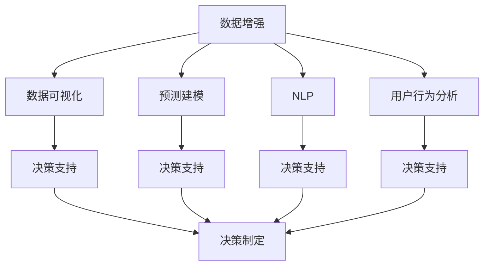

                 

## 1. 背景介绍

在数字化浪潮席卷全球的背景下，数据已经成为企业的重要资产，对企业运营的各个方面产生了深远影响。尤其是近年来，随着大数据、云计算和人工智能技术的飞速发展，数据驱动的决策制定（Data-Driven Decision Making, DDDM）正成为企业管理的新趋势。数据驱动的决策制定能够帮助企业从海量数据中挖掘出有价值的洞察力，提升决策的科学性和效率，从而赢得市场竞争优势。

然而，数据驱动的决策制定并非易事。一方面，数据的质量和完整性直接影响决策的准确性；另一方面，数据挖掘和分析的过程复杂且耗时，对企业的数据处理能力提出了高要求。在此背景下，注意力经济（Attention Economy）应运而生，成为数据驱动决策制定的有力工具。

## 2. 核心概念与联系

### 2.1 核心概念概述

注意力经济是指在信息过载的时代，企业需要有效吸引并集中客户注意力，提高其决策效率和经济效益。其核心在于通过算法和技术手段，从大量信息中筛选出有价值的数据，并将其呈现在用户面前，从而实现信息的高效利用和转化。

在大数据时代，注意力经济主要依托以下关键技术：

1. **数据增强（Data Augmentation）**：通过对原始数据进行变换、扩充，提升数据的多样性和丰富性，增强模型的泛化能力。
2. **数据可视化（Data Visualization）**：将数据转化为易于理解的图表和图形，帮助决策者更直观地把握数据背后的规律和趋势。
3. **预测建模（Predictive Modeling）**：利用机器学习算法对未来数据进行预测，为企业提供前瞻性的决策依据。
4. **自然语言处理（Natural Language Processing, NLP）**：通过对文本数据的处理和分析，从非结构化数据中挖掘出有用的信息。
5. **用户行为分析（User Behavior Analysis）**：通过分析用户的互动行为，揭示用户偏好和需求，指导企业的运营策略。

这些技术相互关联，共同构建了注意力经济的核心架构。其逻辑关系可以通过以下Mermaid流程图来展示：



### 2.2 核心概念原理和架构的 Mermaid 流程图

通过上述流程图，可以直观地理解注意力经济各个关键技术之间的联系和相互作用。以下详细解释每个节点：

1. **数据增强**：通过对原始数据进行扩充和变换，提升数据多样性和质量。例如，对图片数据进行旋转、翻转、裁剪等操作，增加数据量。
2. **数据可视化**：将数据转化为图表、热图等易于理解的形式，帮助决策者快速识别数据模式和趋势。
3. **预测建模**：使用机器学习模型（如回归、分类、聚类等）对未来数据进行预测，提供有价值的决策参考。
4. **自然语言处理**：通过文本预处理、情感分析、实体识别等技术，从非结构化数据中提取有价值的信息。
5. **用户行为分析**：通过分析用户行为数据，了解用户偏好和需求，优化产品和服务。
6. **决策支持**：综合利用数据增强、数据可视化、预测建模、NLP、用户行为分析等多项技术，支持决策制定。
7. **决策制定**：基于决策支持，制定最优化的业务决策，实现经济效益的最大化。

## 3. 核心算法原理 & 具体操作步骤

### 3.1 算法原理概述

数据增强在注意力经济中的应用，主要分为以下几个步骤：

1. **数据收集**：收集与业务目标相关的数据，包括结构化数据、半结构化数据和非结构化数据。
2. **数据预处理**：清洗和处理数据，去除噪音和异常值，确保数据的质量和一致性。
3. **数据增强**：通过数据扩充和变换技术，增加数据量和多样性，提升模型的泛化能力。
4. **模型训练**：使用增强后的数据训练机器学习模型，获得对业务问题的预测能力。
5. **模型评估**：对训练好的模型进行评估和验证，确保其预测准确性和鲁棒性。

### 3.2 算法步骤详解

以下详细介绍数据增强在实际应用中的操作步骤：

**Step 1: 数据收集**
- 确定业务目标，收集相关的数据源。例如，收集用户行为数据、交易数据、社交媒体数据等。
- 使用API接口、爬虫等工具获取数据，并存储到数据库或数据仓库中。

**Step 2: 数据预处理**
- 对数据进行清洗和处理，去除噪音、异常值和不一致性。例如，处理缺失值、重复值、错误数据等。
- 进行特征选择和提取，保留对业务目标有影响的特征。例如，提取用户行为特征、交易金额、地理位置等。

**Step 3: 数据增强**
- 使用数据增强技术扩充数据集。例如，对图片数据进行旋转、翻转、裁剪等操作，增加数据多样性。
- 使用生成对抗网络（GAN）等技术生成合成数据，增加数据量。例如，生成新的用户行为数据，用于模型训练和验证。

**Step 4: 模型训练**
- 选择合适的机器学习算法，对增强后的数据进行训练。例如，使用随机森林、神经网络等算法进行训练。
- 使用交叉验证等技术，评估模型的性能和泛化能力。

**Step 5: 模型评估**
- 使用测试集对训练好的模型进行评估，计算模型的准确率、召回率、F1值等指标。
- 调整模型参数，优化模型性能。例如，调整学习率、正则化系数、网络结构等。

**Step 6: 决策制定**
- 基于训练好的模型，对新的数据进行预测和分析，支持决策制定。
- 定期更新和维护模型，确保其持续高效运行。

### 3.3 算法优缺点

数据增强技术在注意力经济中的应用具有以下优点：

1. **提高模型泛化能力**：通过对数据进行扩充和变换，增加数据多样性，提升模型泛化能力。
2. **减少过拟合风险**：增强数据集的多样性，减少模型对训练数据的依赖，降低过拟合风险。
3. **提升数据质量和数量**：通过生成合成数据，增加数据量，提升数据质量和数量，满足模型训练需求。

然而，数据增强技术也存在一些缺点：

1. **增强数据质量控制**：需要精心设计和选择增强技术，避免引入新的噪音和错误数据。
2. **计算资源消耗**：数据增强过程中需要使用大量计算资源，特别是在生成合成数据时，对计算资源要求较高。
3. **模型参数调整**：增强数据集的多样性可能导致模型参数变化较大，需要进行适当调整。

### 3.4 算法应用领域

数据增强技术在多个领域中得到了广泛应用，以下是几个典型场景：

1. **图像识别**：通过对图像进行旋转、翻转、裁剪等操作，增加图像数据多样性，提升模型的识别能力。例如，在自动驾驶领域，使用数据增强技术提高对复杂路况的识别能力。
2. **语音识别**：通过生成新的语音数据，增加数据多样性，提升模型的识别能力。例如，在智能客服领域，使用数据增强技术提高对不同口音的识别能力。
3. **自然语言处理**：通过对文本数据进行同义词替换、句子重组等操作，增加数据多样性，提升模型的理解能力。例如，在智能翻译领域，使用数据增强技术提高对不同语境的理解能力。
4. **推荐系统**：通过生成新的用户行为数据，增加数据多样性，提升推荐模型的精准度。例如，在电商领域，使用数据增强技术提高推荐商品的相关性和多样性。
5. **金融风控**：通过生成新的交易数据，增加数据多样性，提升模型的风险识别能力。例如，在信贷领域，使用数据增强技术提高对信用风险的识别能力。

## 4. 数学模型和公式 & 详细讲解 & 举例说明

### 4.1 数学模型构建

假设原始数据集为 $D=\{x_1, x_2, ..., x_n\}$，其中每个样本 $x_i$ 可以表示为一个向量 $\mathbf{x}_i = [x_{i1}, x_{i2}, ..., x_{in}]$。数据增强的目标是通过对原始数据进行变换和扩充，生成增强后的数据集 $D'=\{x_1', x_2', ..., x_n'\}$，其中每个样本 $x_i'$ 可以表示为 $\mathbf{x}_i' = [x_{i1}', x_{i2}', ..., x_{in}']$。

假设数据增强变换为 $T$，则数据增强的数学模型可以表示为：

$$
\mathbf{x}_i' = T(\mathbf{x}_i)
$$

其中 $T$ 表示数据增强的变换函数。

### 4.2 公式推导过程

以下以图像数据增强为例，推导数据增强的数学模型和公式。

假设原始图像数据为 $x \in \mathbb{R}^n$，其中 $n$ 表示图像像素总数。数据增强的目标是通过旋转、翻转等操作，生成增强后的图像数据 $x' \in \mathbb{R}^n$。

假设旋转角度为 $\theta$，则旋转操作可以表示为：

$$
x' = \begin{bmatrix}
\cos\theta & -\sin\theta \\
\sin\theta & \cos\theta 
\end{bmatrix}
\begin{bmatrix}
x_1 \\
x_2
\end{bmatrix}
$$

其中 $x_1$ 和 $x_2$ 分别表示图像的像素值。通过旋转操作，可以生成多个角度的旋转图像，用于数据增强。

假设翻转操作的概率为 $p$，则翻转操作可以表示为：

$$
x' = \begin{cases}
x, & \text{with probability } p \\
x', & \text{with probability } 1-p
\end{cases}
$$

其中 $x'$ 表示翻转后的图像数据。通过翻转操作，可以增加数据多样性。

通过组合以上两种操作，可以得到完整的图像数据增强模型。具体而言，可以生成以下增强后的图像数据：

$$
\mathbf{x}' = [x'_1, x'_2, ..., x'_n]
$$

其中 $x_i'$ 表示经过旋转和翻转操作后的图像数据。

### 4.3 案例分析与讲解

以下以电商推荐系统为例，分析数据增强在实际应用中的案例。

电商推荐系统需要根据用户的历史行为数据，推荐用户可能感兴趣的商品。传统的推荐算法往往依赖于用户历史行为数据的数量和质量，但在实际应用中，用户行为数据可能不足或存在偏差，导致推荐效果不佳。

通过数据增强技术，电商推荐系统可以在已有数据的基础上生成更多的用户行为数据，提升推荐系统的精准度和多样性。例如，通过生成新的用户浏览记录、购买记录和评价记录，增加数据多样性，提升推荐模型的性能。

## 5. 项目实践：代码实例和详细解释说明

### 5.1 开发环境搭建

在进行数据增强项目实践前，我们需要准备好开发环境。以下是使用Python进行TensorFlow开发的环境配置流程：

1. 安装Anaconda：从官网下载并安装Anaconda，用于创建独立的Python环境。

2. 创建并激活虚拟环境：
```bash
conda create -n tf-env python=3.8 
conda activate tf-env
```

3. 安装TensorFlow：根据CUDA版本，从官网获取对应的安装命令。例如：
```bash
conda install tensorflow=2.5 -c pytorch -c conda-forge
```

4. 安装TensorBoard：
```bash
pip install tensorboard
```

5. 安装各类工具包：
```bash
pip install numpy pandas scikit-learn matplotlib tqdm jupyter notebook ipython
```

完成上述步骤后，即可在`tf-env`环境中开始数据增强实践。

### 5.2 源代码详细实现

以下是使用TensorFlow对图像数据进行旋转和翻转的数据增强代码实现。

```python
import tensorflow as tf
import matplotlib.pyplot as plt
import numpy as np

# 加载原始图像数据
image = tf.keras.preprocessing.image.load_img('original_image.jpg', target_size=(64, 64))
image_array = tf.keras.preprocessing.image.img_to_array(image)
image_array = tf.expand_dims(image_array, 0)

# 旋转操作
theta = np.pi / 4  # 旋转角度
rotated_image = tf.keras.preprocessing.image.rotate(image_array, theta, fill_mode='nearest')
rotated_image_array = tf.keras.preprocessing.image.img_to_array(rotated_image)

# 翻转操作
p = 0.5  # 翻转概率
flipped_image = tf.random.uniform(tf.shape(image_array)[:1], maxval=2, dtype=tf.int32) == 1
flipped_image_array = tf.where(flipped_image, image_array, np.flip(image_array, axis=-1))

# 拼接生成增强后的图像数据
augmented_image = tf.concat([image_array, rotated_image_array, flipped_image_array], axis=0)
augmented_image_array = augmented_image.numpy()

# 可视化增强后的图像数据
plt.imshow(np.squeeze(augmented_image_array), cmap='gray')
plt.show()
```

### 5.3 代码解读与分析

让我们再详细解读一下关键代码的实现细节：

**加载原始图像数据**：
- 使用`tf.keras.preprocessing.image.load_img`加载原始图像，并指定目标大小。
- 使用`tf.keras.preprocessing.image.img_to_array`将图像转换为数组。

**旋转操作**：
- 设置旋转角度，使用`tf.keras.preprocessing.image.rotate`进行旋转操作。
- 使用`tf.keras.preprocessing.image.img_to_array`将旋转后的图像转换为数组。

**翻转操作**：
- 设置翻转概率，使用`tf.random.uniform`生成随机数。
- 使用`np.flip`进行图像翻转操作。

**拼接生成增强后的图像数据**：
- 使用`tf.concat`拼接原始图像、旋转图像和翻转图像，生成增强后的图像数据。
- 使用`np.squeeze`和`plt.imshow`可视化增强后的图像数据。

## 6. 实际应用场景

### 6.1 电商推荐系统

电商推荐系统是数据增强技术的重要应用场景之一。传统的电商推荐系统依赖于用户历史行为数据，但在实际应用中，用户行为数据可能不足或存在偏差，导致推荐效果不佳。通过数据增强技术，电商推荐系统可以在已有数据的基础上生成更多的用户行为数据，提升推荐系统的精准度和多样性。

例如，通过生成新的用户浏览记录、购买记录和评价记录，增加数据多样性，提升推荐模型的性能。使用数据增强技术，电商推荐系统可以更好地理解用户行为模式，推荐更加个性化和精准的商品，提升用户体验和转化率。

### 6.2 金融风控系统

金融风控系统需要对大量用户数据进行风险评估和预测。传统的金融风控系统往往依赖于历史数据，但在实际应用中，历史数据可能存在偏差或缺失，导致风险评估和预测的准确性不足。通过数据增强技术，金融风控系统可以在已有数据的基础上生成更多的用户数据，提升风险评估和预测的准确性。

例如，通过生成新的用户交易记录、信用记录和行为记录，增加数据多样性，提升风控模型的性能。使用数据增强技术，金融风控系统可以更好地识别和预测风险，降低欺诈和损失，保障金融系统的安全稳定。

### 6.3 医疗影像分析

医疗影像分析需要从大量影像数据中提取有价值的医学信息，帮助医生进行诊断和治疗。传统的医疗影像分析系统依赖于医学专家的标注数据，但在实际应用中，标注数据可能不足或存在偏差，导致诊断和治疗的准确性不足。通过数据增强技术，医疗影像分析系统可以在已有数据的基础上生成更多的影像数据，提升诊断和治疗的准确性。

例如，通过生成新的医学影像数据，增加影像数据多样性，提升影像分析模型的性能。使用数据增强技术，医疗影像分析系统可以更好地理解和分析医学影像，提高诊断和治疗的准确性和效率，提升医疗系统的水平和质量。

## 7. 工具和资源推荐

### 7.1 学习资源推荐

为了帮助开发者系统掌握数据增强的理论基础和实践技巧，这里推荐一些优质的学习资源：

1. 《深度学习入门与实践》系列博文：由深度学习专家撰写，深入浅出地介绍了深度学习的基本概念和实际应用，包括数据增强在内的一些前沿技术。

2. Coursera《深度学习专项课程》：由深度学习领域权威机构开设，涵盖深度学习基础和前沿技术，适合初学者和进阶开发者。

3. 《深度学习实战》书籍：是一本实践导向的深度学习入门书籍，通过大量的代码和实例，帮助读者快速上手深度学习开发。

4. Kaggle数据竞赛平台：全球最大的数据科学竞赛平台，提供了大量的数据集和竞赛任务，适合锻炼数据增强等技能。

5. GitHub开源项目：提供了众多数据增强的代码实现和教程，适合参考和学习。

通过对这些资源的学习实践，相信你一定能够快速掌握数据增强的精髓，并用于解决实际的NLP问题。

### 7.2 开发工具推荐

高效的开发离不开优秀的工具支持。以下是几款用于数据增强开发的常用工具：

1. TensorFlow：由Google主导开发的开源深度学习框架，生产部署方便，适合大规模工程应用。提供了丰富的数据增强模块和API，方便开发者使用。

2. PyTorch：基于Python的开源深度学习框架，灵活动态的计算图，适合快速迭代研究。提供了丰富的数据增强工具和模块，支持自定义数据增强操作。

3. scikit-image：Python的图像处理库，提供了丰富的图像增强和处理工具，适合数据增强的实现。

4. Keras：高层次的深度学习框架，提供了简单易用的API，适合快速原型开发。

5. OpenCV：开源计算机视觉库，提供了丰富的图像处理和增强工具，适合图像数据增强的实现。

合理利用这些工具，可以显著提升数据增强任务的开发效率，加快创新迭代的步伐。

### 7.3 相关论文推荐

数据增强技术的发展源于学界的持续研究。以下是几篇奠基性的相关论文，推荐阅读：

1. Data Augmentation with Transformations, Augmentations, and Mixups（CVPR 2019）：提出了一种基于变换、增强和混合的数据增强方法，提升了模型泛化能力。

2. AutoAugment: Learning Augmentation Strategies from Data（ICLR 2019）：提出了一种自动生成数据增强策略的方法，提升了模型性能。

3. Deep Learning via Transfer with Data Augmentation: An Efficient, Practical & Scalable Approach for Curriculum Design（AAAI 2019）：提出了一种基于数据增强的课程设计方法，提升了模型的学习效率。

4. Towards Accurate Predictions through Deep Learning on Noisy Labels（CVPR 2020）：提出了一种基于数据增强的噪声标签处理方法，提升了模型鲁棒性。

5. Data Augmentation and Learning Rate Scaling for Gaussian processes with applications to health data（NIPS 2021）：提出了一种基于数据增强的贝叶斯优化方法，提升了模型预测能力。

这些论文代表了大数据增强技术的发展脉络。通过学习这些前沿成果，可以帮助研究者把握学科前进方向，激发更多的创新灵感。

## 8. 总结：未来发展趋势与挑战

### 8.1 总结

本文对基于数据增强的注意力经济方法进行了全面系统的介绍。首先阐述了数据增强在数字化时代的重要性和应用场景，明确了其对提升决策效率和业务洞察力的独特价值。其次，从原理到实践，详细讲解了数据增强的数学模型和操作步骤，给出了数据增强任务开发的完整代码实例。同时，本文还广泛探讨了数据增强技术在电商推荐、金融风控、医疗影像等多个行业领域的应用前景，展示了其广阔的应用空间。此外，本文精选了数据增强技术的各类学习资源，力求为读者提供全方位的技术指引。

通过本文的系统梳理，可以看到，数据增强技术正在成为数字经济时代的重要工具，极大地提升了决策制定的科学性和效率，为各行各业带来了显著的业务价值。未来，伴随数据增强技术的不断进步，人工智能技术将进一步深化其在各行各业的应用，为数字经济的发展注入新的动力。

### 8.2 未来发展趋势

展望未来，数据增强技术将呈现以下几个发展趋势：

1. **数据增强技术的自动化**：随着AI技术的进步，数据增强技术将逐渐实现自动化，减少人工干预和调节，提高数据增强的效率和精度。
2. **多模态数据增强**：未来的数据增强技术将不仅仅局限于单一模态数据，而是能够融合图像、文本、音频等多模态数据，提升模型对多模态数据的理解和分析能力。
3. **个性化数据增强**：未来的数据增强技术将能够根据不同任务和数据类型，自动生成个性化的数据增强策略，提升模型对特定任务的适应能力。
4. **实时数据增强**：未来的数据增强技术将能够实现实时数据增强，及时补充和更新模型所需的数据，保持模型的持续学习和优化。
5. **分布式数据增强**：未来的数据增强技术将能够实现分布式数据增强，利用多台设备并行处理数据，提升数据增强的计算效率和性能。

以上趋势凸显了数据增强技术的广阔前景。这些方向的探索发展，必将进一步提升模型的泛化能力和性能，为数据驱动决策制定提供更强大的技术支持。

### 8.3 面临的挑战

尽管数据增强技术已经取得了瞩目成就，但在迈向更加智能化、普适化应用的过程中，它仍面临着诸多挑战：

1. **数据增强质量控制**：需要精心设计和选择增强技术，避免引入新的噪音和错误数据。
2. **计算资源消耗**：数据增强过程中需要使用大量计算资源，特别是在生成合成数据时，对计算资源要求较高。
3. **模型参数调整**：增强数据集的多样性可能导致模型参数变化较大，需要进行适当调整。

### 8.4 研究展望

面对数据增强面临的这些挑战，未来的研究需要在以下几个方面寻求新的突破：

1. **高效数据增强算法**：开发更加高效、鲁棒的数据增强算法，减少计算资源消耗，提升数据增强的质量和效率。
2. **多模态数据融合**：研究多模态数据的融合方法，提升模型对多模态数据的理解和分析能力。
3. **实时数据增强**：研究实时数据增强技术，及时补充和更新模型所需的数据，保持模型的持续学习和优化。
4. **分布式数据增强**：研究分布式数据增强方法，利用多台设备并行处理数据，提升数据增强的计算效率和性能。

这些研究方向的探索，必将引领数据增强技术迈向更高的台阶，为数字经济的发展提供更强大的技术支持。总之，数据增强技术需要结合实际应用场景，不断优化和创新，方能发挥其最大潜力。

## 9. 附录：常见问题与解答

**Q1：数据增强的目的是什么？**

A: 数据增强的目的是通过增加数据多样性，提升模型的泛化能力和鲁棒性。具体而言，数据增强通过对原始数据进行变换和扩充，生成新的数据样本，从而增加数据量和多样性，减少模型对训练数据的依赖，降低过拟合风险，提升模型的泛化能力和鲁棒性。

**Q2：常用的数据增强技术有哪些？**

A: 常用的数据增强技术包括：
1. 图像数据增强：旋转、翻转、裁剪、缩放、对比度增强等。
2. 文本数据增强：同义词替换、句子重组、噪声注入等。
3. 音频数据增强：噪声添加、变速、变调、回声等。
4. 视频数据增强：随机剪辑、帧采样、颜色变换等。

**Q3：数据增强的实际应用场景有哪些？**

A: 数据增强在多个领域中得到了广泛应用，以下是几个典型场景：
1. 图像识别：通过数据增强提升模型的识别能力。
2. 语音识别：通过数据增强提升模型的识别能力。
3. 自然语言处理：通过数据增强提升模型的理解能力。
4. 推荐系统：通过数据增强提升推荐模型的精准度和多样性。
5. 金融风控：通过数据增强提升风险评估和预测的准确性。

**Q4：数据增强对模型训练的影响有哪些？**

A: 数据增强对模型训练有以下影响：
1. 增加数据多样性：通过生成新的数据样本，增加数据量和多样性，提升模型的泛化能力和鲁棒性。
2. 减少过拟合风险：增加数据多样性，减少模型对训练数据的依赖，降低过拟合风险。
3. 提升模型精度：通过生成高质量的数据样本，提升模型的预测准确性。
4. 加速模型收敛：通过增加数据量和多样性，加速模型训练过程。

通过本文的系统梳理，可以看到，数据增强技术正在成为数字经济时代的重要工具，极大地提升了决策制定的科学性和效率，为各行各业带来了显著的业务价值。未来，伴随数据增强技术的不断进步，人工智能技术将进一步深化其在各行各业的应用，为数字经济的发展注入新的动力。

---

作者：禅与计算机程序设计艺术 / Zen and the Art of Computer Programming

