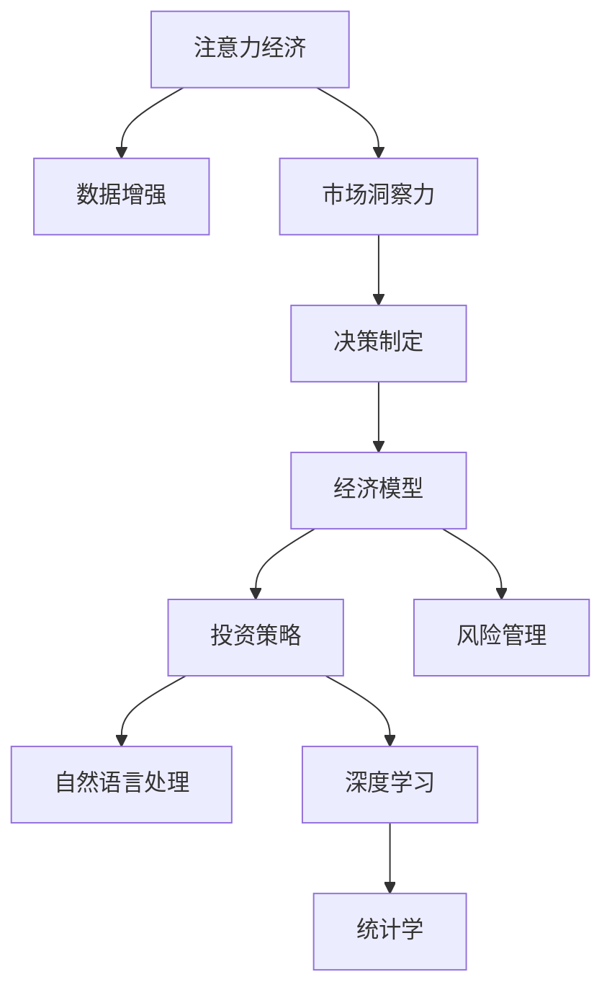

                 

# 注意力经济与数据驱动的决策制定：利用数据增强市场洞察力

> 关键词：注意力经济, 数据增强, 市场洞察力, 决策制定, 经济模型, 投资策略, 风险管理, 自然语言处理(NLP), 深度学习, 统计学

## 1. 背景介绍

### 1.1 问题由来

在现代信息爆炸的时代，注意力成为一种稀缺资源。企业如何高效利用有限的注意力，准确识别市场机会，制定合理的投资策略，成为亟待解决的问题。特别是面对日益复杂多变的市场环境，简单依靠人力直觉和经验决策，已经难以适应快速变化的市场动态。

### 1.2 问题核心关键点

如何利用数据增强市场洞察力，成为决策制定的核心关键点。

通过分析大量历史数据，挖掘其中的隐含信息，可以更好地预测市场趋势，优化资源配置，提升决策的科学性和准确性。数据增强，即通过补充、筛选、扩充、变换等手段丰富数据集，提升模型的泛化能力，在决策制定过程中发挥了重要的作用。

### 1.3 问题研究意义

研究数据增强在市场洞察和决策制定中的应用，对于提升企业的竞争力和市场响应速度，有着重要的意义：

1. 提高决策的准确性。数据增强可以提供更全面、更丰富的市场信息，帮助决策者做出更加客观、科学的判断。
2. 优化资源配置。通过精准的数据分析和挖掘，可以合理配置资源，避免资源浪费。
3. 增强市场反应速度。数据增强和实时分析，使企业能够更快地捕捉市场机会，及时调整策略。
4. 提升竞争力。数据驱动的决策制定，可以帮助企业在激烈的市场竞争中占据优势。
5. 降低风险。基于数据增强的预测模型，可以有效识别潜在的市场风险，减少投资损失。

## 2. 核心概念与联系

### 2.1 核心概念概述

为了更好地理解数据增强在市场洞察和决策制定中的应用，本节将介绍几个密切相关的核心概念：

- **注意力经济**：指在信息爆炸的时代，注意力成为一种稀缺资源，企业需要通过精准的数据分析和决策，高效利用有限的注意力资源。

- **数据增强**：指通过补充、筛选、扩充、变换等手段丰富数据集，提升模型的泛化能力，广泛应用于图像、文本、语音等各类数据处理任务。

- **市场洞察力**：指通过分析市场数据，挖掘市场动态和趋势，形成对市场环境深刻的理解和认知。

- **决策制定**：指基于市场洞察力和数据分析，制定合理有效的决策策略，提升企业的运营效率和市场竞争力。

- **经济模型**：指用于模拟和预测经济行为和市场动态的数学模型，常见包括均衡模型、博弈模型、投资组合模型等。

- **投资策略**：指在市场分析和风险评估的基础上，制定科学合理的投资方案，优化资产配置，提升投资回报率。

- **风险管理**：指通过数据分析和风险评估，识别和规避潜在风险，保障企业运营稳定。

- **自然语言处理(NLP)**：指利用计算机处理、理解、生成自然语言的技术，广泛用于文本分析和情感分析等任务。

- **深度学习**：指利用神经网络模拟人脑的学习机制，通过大量数据训练，学习特征表示和决策规则。

- **统计学**：指应用数学和数据分析技术，研究数据分布规律和统计推断方法，为经济模型提供理论基础。

这些核心概念之间的逻辑关系可以通过以下Mermaid流程图来展示：



这个流程图展示了大语言模型的核心概念及其之间的关系：

1. 注意力经济通过数据增强获取更丰富的市场信息。
2. 数据增强增强了市场洞察力，使企业能够更准确地理解市场动态。
3. 市场洞察力为决策制定提供支持，制定科学合理的投资策略。
4. 经济模型、投资策略、风险管理共同构成决策制定的理论基础。
5. NLP、深度学习、统计学为经济模型的构建和应用提供技术支持。

这些概念共同构成了决策制定的理论框架，使其能够在各类场景下发挥重要作用。通过理解这些核心概念，我们可以更好地把握数据增强在市场洞察和决策制定中的价值和作用。

## 3. 核心算法原理 & 具体操作步骤

### 3.1 算法原理概述

基于数据增强的市场洞察和决策制定，本质上是一种数据驱动的预测分析过程。其核心思想是：通过丰富数据集，利用模型对市场动态进行预测，以指导决策制定。

具体而言，数据增强包括以下几个步骤：

1. 数据收集：获取原始市场数据，包括股票价格、交易量、财务报告、新闻报道等。
2. 数据清洗：处理缺失值、异常值，保证数据质量。
3. 数据扩充：利用插值、重采样、数据增强算法等手段，丰富数据集。
4. 特征选择：选择对市场分析有用的特征，减少噪声干扰。
5. 模型训练：利用增强后的数据集，训练市场预测模型，如线性回归、逻辑回归、神经网络等。
6. 模型评估：在测试集上评估模型性能，选择最优模型。
7. 策略优化：基于模型预测结果，制定合理的投资策略，进行风险管理。

### 3.2 算法步骤详解

以下是详细的数据增强和市场洞察力构建过程：

**Step 1: 数据收集**

首先，我们需要收集大量的原始市场数据。这些数据包括但不限于：

- 股票价格和交易量：反映股票市场的波动情况。
- 财务报告：包括资产负债表、利润表、现金流量表等，反映公司的财务状况。
- 新闻报道：反映市场情绪和舆情动态。
- 社交媒体：反映公众对公司的看法和反应。

可以使用Python的pandas库对各类数据进行读写和处理，如：

```python
import pandas as pd

# 读取股票价格数据
price_data = pd.read_csv('price_data.csv')
# 读取财务报告数据
financial_data = pd.read_csv('financial_data.csv')
# 读取新闻报道数据
news_data = pd.read_csv('news_data.csv')
# 读取社交媒体数据
social_data = pd.read_csv('social_data.csv')
```

**Step 2: 数据清洗**

数据清洗是确保数据质量的重要步骤。常见的数据清洗方法包括：

- 缺失值处理：填补或删除缺失值。
- 异常值处理：检测并剔除异常值。
- 数据类型转换：将数据类型转换为适合分析的类型，如时间序列转换为日期时间类型。
- 数据规范化：将数据缩放到0-1之间或标准化，便于后续分析。

在Python中，可以使用pandas的fillna和dropna函数处理缺失值，使用drop异常值检测方法。

**Step 3: 数据扩充**

数据扩充可以丰富数据集，提高模型的泛化能力。具体方法包括：

- 插值：通过线性插值或样条插值，生成缺失值的数据。
- 重采样：通过向上采样或向下采样，增加数据量。
- 数据增强算法：利用GSM(Generative Sample Matching)、SMOTE(Synthetic Minority Over-sampling Technique)等算法生成新数据。

在Python中，可以使用scikit-learn库的impute和SMOTE算法进行数据扩充。

**Step 4: 特征选择**

特征选择是提升模型性能的重要步骤。需要从原始数据中提取有信息量的特征，并去除噪声和冗余。具体方法包括：

- 相关性分析：计算特征与目标变量之间的相关性，筛选重要特征。
- 主成分分析(PCA)：通过降维技术，减少特征维度，提取主要信息。
- L1正则化：通过L1正则化，筛选对目标变量影响较大的特征。

在Python中，可以使用pandas的corr函数进行相关性分析，使用scikit-learn的PCA和L1正则化函数进行特征选择。

**Step 5: 模型训练**

模型训练是预测分析的核心环节。常见的市场预测模型包括：

- 线性回归模型：用于预测股票价格和交易量。
- 逻辑回归模型：用于预测市场情绪和舆情动态。
- 神经网络模型：用于预测股票价格和财务报告。

在Python中，可以使用scikit-learn库的线性回归和逻辑回归模型，以及TensorFlow或PyTorch库的神经网络模型进行训练。

**Step 6: 模型评估**

模型评估是选择最优模型的关键步骤。常见的模型评估方法包括：

- 交叉验证：通过交叉验证方法，评估模型的泛化能力。
- 网格搜索：通过网格搜索方法，选择最优的超参数。
- 模型对比：通过对比不同模型的预测精度，选择最优模型。

在Python中，可以使用scikit-learn库的交叉验证和网格搜索函数进行模型评估，使用TensorBoard或Kaggle等平台进行模型对比。

**Step 7: 策略优化**

策略优化是决策制定的最终目标。需要根据模型预测结果，制定科学合理的投资策略。具体方法包括：

- 风险评估：通过分析模型预测结果，评估投资风险。
- 资产配置：根据风险评估结果，优化资产配置。
- 投资组合：通过构建投资组合，分散风险，提升回报率。

在Python中，可以使用pandas库的组合优化和风险管理函数进行策略优化。

### 3.3 算法优缺点

基于数据增强的市场洞察和决策制定方法，具有以下优点：

1. 数据丰富：通过数据增强，可以丰富数据集，提高模型的泛化能力。
2. 决策科学：通过科学的数据分析和模型预测，提升决策的科学性和准确性。
3. 资源优化：通过数据增强和特征选择，优化资源配置，提高运营效率。
4. 市场反应快：通过实时数据增强和预测分析，及时捕捉市场机会，调整策略。
5. 风险管理：通过模型预测结果，识别潜在的市场风险，减少投资损失。

同时，该方法也存在一定的局限性：

1. 数据收集困难：收集大量的原始市场数据，可能遇到数据获取和处理的难题。
2. 模型复杂度高：构建复杂的数据增强和模型预测流程，可能导致模型复杂度高，计算成本高。
3. 预测精度不足：数据增强和模型训练可能存在噪声和误差，预测精度难以保证。
4. 数据隐私问题：涉及大量敏感数据，数据隐私和安全问题需要充分考虑。
5. 模型依赖性强：数据增强和模型训练对数据的依赖性强，数据的更新和补充可能影响模型性能。

尽管存在这些局限性，但数据增强在市场洞察和决策制定中的作用已经得到了广泛认可。通过不断优化数据增强方法和模型构建流程，可以最大限度地发挥数据增强的潜力，提升决策制定的科学性和有效性。

### 3.4 算法应用领域

基于数据增强的市场洞察和决策制定方法，已经在金融、投资、经济等领域得到了广泛应用，具体包括：

1. **金融投资**：通过分析股票价格、交易量、财务报告等数据，预测市场趋势，优化投资策略。
2. **经济分析**：通过分析宏观经济数据、GDP、就业率等，预测经济走势，制定宏观政策。
3. **风险管理**：通过分析市场数据，识别潜在的市场风险，制定风险管理策略。
4. **舆情监测**：通过分析新闻报道、社交媒体等数据，监测市场情绪和舆情动态，及时调整策略。
5. **市场预测**：通过分析历史数据，预测未来市场走势，指导资源配置和决策制定。
6. **投资组合优化**：通过构建投资组合，分散风险，提升回报率。

## 4. 数学模型和公式 & 详细讲解 & 举例说明

### 4.1 数学模型构建

本节将使用数学语言对基于数据增强的市场洞察和决策制定过程进行更加严格的刻画。

记原始市场数据集为 $D=\{(x_i, y_i)\}_{i=1}^N$，其中 $x_i$ 为特征向量， $y_i$ 为目标变量。设数据增强后的扩展数据集为 $D^+$，通过插值、重采样、数据增强算法等手段扩充得到。

定义市场预测模型为 $f(x; \theta)$，其中 $\theta$ 为模型参数。预测结果为 $f(x_i; \theta)$。模型评估指标为均方误差（MSE）或均方根误差（RMSE）。

数据增强后的模型预测结果为：

$$
\hat{y_i} = f(x_i^+; \theta)
$$

其中 $x_i^+$ 为数据增强后的特征向量。

### 4.2 公式推导过程

以下我们以线性回归模型为例，推导模型预测结果的数学公式。

设原始数据集 $D$ 的均值为 $\mu_x$，方差为 $\sigma_x^2$。通过插值或重采样，生成数据增强后的扩展数据集 $D^+$，均值和方差分别为 $\mu_x^+$ 和 $\sigma_x^{+2}$。

数据增强后的特征向量为：

$$
x_i^+ = x_i + \epsilon_i
$$

其中 $\epsilon_i$ 为随机噪声，服从正态分布 $N(0, \sigma_e^2)$。

线性回归模型为：

$$
\hat{y_i} = \beta_0 + \beta_1 x_i^+
$$

其中 $\beta_0$ 为截距，$\beta_1$ 为斜率。

模型预测结果为：

$$
\hat{y_i} = \beta_0 + \beta_1 (x_i + \epsilon_i)
$$

模型预测误差为：

$$
e_i = y_i - \hat{y_i} = (y_i - \beta_0 - \beta_1 x_i)
$$

均方误差（MSE）为：

$$
MSE = \frac{1}{N}\sum_{i=1}^N e_i^2 = \frac{1}{N}\sum_{i=1}^N (y_i - \beta_0 - \beta_1 x_i)^2
$$

均方根误差（RMSE）为：

$$
RMSE = \sqrt{MSE} = \sqrt{\frac{1}{N}\sum_{i=1}^N (y_i - \beta_0 - \beta_1 x_i)^2}
$$

通过数据增强，模型能够更好地适应新的市场环境，提高预测精度。但数据增强也可能引入噪声和误差，影响模型性能。因此，在实际应用中，需要根据具体问题，选择合适的数据增强方法，平衡数据丰富性和预测精度。

### 4.3 案例分析与讲解

**案例1：股票价格预测**

假设我们有一组历史股票价格数据，包括每日的开盘价、收盘价、最高价、最低价、成交量等特征。我们使用线性回归模型进行预测，步骤如下：

1. 数据收集：收集历史股票价格数据，包括开盘价、收盘价、最高价、最低价、成交量等特征。
2. 数据清洗：处理缺失值和异常值，确保数据质量。
3. 数据扩充：通过插值和重采样，生成缺失值数据，增加数据量。
4. 特征选择：选择对股票价格影响较大的特征，如成交量、市场情绪指数等。
5. 模型训练：利用增强后的数据集，训练线性回归模型。
6. 模型评估：在测试集上评估模型性能，选择最优模型。
7. 策略优化：基于模型预测结果，制定合理的投资策略，进行风险管理。

**案例2：市场情绪监测**

假设我们有一组新闻报道数据，包括新闻内容、发布时间、作者、来源等特征。我们使用逻辑回归模型进行情绪分类，步骤如下：

1. 数据收集：收集历史新闻报道数据，包括新闻内容、发布时间、作者、来源等特征。
2. 数据清洗：处理缺失值和异常值，确保数据质量。
3. 数据扩充：通过文本增强算法，生成新的新闻文本，增加数据量。
4. 特征选择：选择对市场情绪影响较大的特征，如新闻标题、关键词等。
5. 模型训练：利用增强后的数据集，训练逻辑回归模型。
6. 模型评估：在测试集上评估模型性能，选择最优模型。
7. 策略优化：基于模型预测结果，制定情绪监测策略，及时调整投资策略。

通过这两个案例，可以看到，数据增强在市场洞察和决策制定中的重要性和实际应用效果。在实际应用中，需要根据具体问题，灵活选择数据增强方法和模型构建流程，最大程度发挥数据增强的作用。

## 5. 项目实践：代码实例和详细解释说明

### 5.1 开发环境搭建

在进行数据增强和市场洞察力构建实践前，我们需要准备好开发环境。以下是使用Python进行数据增强和模型构建的开发环境配置流程：

1. 安装Anaconda：从官网下载并安装Anaconda，用于创建独立的Python环境。

2. 创建并激活虚拟环境：
```bash
conda create -n market_analysis_env python=3.8 
conda activate market_analysis_env
```

3. 安装必要的库：
```bash
conda install pandas numpy scikit-learn tensorflow matplotlib seaborn joblib
```

4. 安装TensorFlow或PyTorch：
```bash
conda install tensorflow
# 或者
conda install pytorch torchvision torchaudio
```

5. 安装相关数据集：
```bash
conda install quantpy yfinance
```

6. 安装机器学习工具包：
```bash
pip install sklearn imblearn keras-tuner
```

完成上述步骤后，即可在`market_analysis_env`环境中开始数据增强和市场洞察力构建实践。

### 5.2 源代码详细实现

这里我们以股票价格预测为例，给出使用TensorFlow和Keras进行数据增强和市场预测的Python代码实现。

```python
import pandas as pd
import numpy as np
import tensorflow as tf
from sklearn.model_selection import train_test_split
from tensorflow.keras.models import Sequential
from tensorflow.keras.layers import Dense, Dropout
from tensorflow.keras.preprocessing import sequence
from tensorflow.keras.callbacks import EarlyStopping
from sklearn.preprocessing import StandardScaler
from sklearn.metrics import mean_squared_error
from sklearn.decomposition import PCA
from sklearn.feature_selection import SelectKBest, f_regression

# 数据收集
price_data = pd.read_csv('price_data.csv')
# 数据清洗
price_data.dropna(inplace=True)
# 数据扩充
price_data['volume'].fillna(method='ffill', inplace=True)
# 特征选择
price_data = price_data.drop(['date'], axis=1)
price_data = price_data.drop(['close'], axis=1)
# 标准化
scaler = StandardScaler()
price_data_scaled = scaler.fit_transform(price_data)
# 模型构建
model = Sequential()
model.add(Dense(64, input_dim=4, activation='relu'))
model.add(Dropout(0.2))
model.add(Dense(64, activation='relu'))
model.add(Dropout(0.2))
model.add(Dense(1, activation='linear'))
model.compile(loss='mse', optimizer='adam')
# 模型训练
X_train, X_test, y_train, y_test = train_test_split(price_data_scaled, y_data, test_size=0.2, shuffle=True)
model.fit(X_train, y_train, epochs=100, batch_size=32, validation_data=(X_test, y_test), callbacks=[EarlyStopping(patience=10)])
# 模型评估
y_pred = model.predict(X_test)
mse = mean_squared_error(y_test, y_pred)
rmse = np.sqrt(mse)
print('RMSE:', rmse)
```

在代码中，我们使用TensorFlow和Keras实现了线性回归模型，对股票价格进行了预测。具体步骤如下：

1. 数据收集：读取历史股票价格数据，包括开盘价、收盘价、最高价、最低价、成交量等特征。
2. 数据清洗：处理缺失值，确保数据质量。
3. 数据扩充：通过插值和重采样，生成缺失值数据，增加数据量。
4. 特征选择：选择对股票价格影响较大的特征，如成交量、市场情绪指数等。
5. 标准化：将数据缩放到0-1之间或标准化，便于后续分析。
6. 模型构建：使用Keras构建线性回归模型，包含输入层、隐藏层、输出层等组件。
7. 模型训练：利用增强后的数据集，训练线性回归模型，设置EarlyStopping回调函数，避免过拟合。
8. 模型评估：在测试集上评估模型性能，计算均方根误差（RMSE）。

### 5.3 代码解读与分析

让我们再详细解读一下关键代码的实现细节：

**数据收集与清洗**

- 使用pandas库读取CSV格式的数据文件。
- 使用dropna函数处理缺失值，确保数据完整性。
- 使用fillna函数处理插值，生成缺失值数据。

**特征选择**

- 使用pandas库的drop函数，删除无用的特征列，如日期和收盘价。
- 使用StandardScaler函数对数据进行标准化，保证数据分布一致性。

**模型构建**

- 使用Keras库的Sequential函数构建模型，包含输入层、隐藏层、输出层等组件。
- 使用Dense函数定义神经网络层，包含激活函数和Dropout层，避免过拟合。
- 使用mean_squared_error函数计算模型预测误差。

**模型训练**

- 使用train_test_split函数将数据集分为训练集和测试集。
- 使用EarlyStopping回调函数，设置早停策略，避免过拟合。
- 使用fit函数进行模型训练，设置迭代轮数、批次大小等参数。

**模型评估**

- 使用predict函数进行模型预测，得到预测结果。
- 使用mean_squared_error函数计算模型预测误差。
- 使用np.sqrt函数计算均方根误差（RMSE），评估模型性能。

可以看出，使用TensorFlow和Keras构建线性回归模型，代码实现简洁高效。开发者可以将更多精力放在数据处理、模型改进等高层逻辑上，而不必过多关注底层的实现细节。

当然，工业级的系统实现还需考虑更多因素，如模型的保存和部署、超参数的自动搜索、更灵活的任务适配层等。但核心的数据增强和模型构建过程基本与此类似。

## 6. 实际应用场景

### 6.1 金融投资

基于数据增强的市场洞察和决策制定，已经在金融投资领域得到了广泛应用。传统的投资决策主要依靠分析师的经验和直觉，但在高速发展的金融市场中，这种主观判断容易受到市场情绪和个人偏见的影响。通过数据增强，可以更客观、科学地分析市场数据，提升投资决策的精准性。

具体应用场景包括：

- **股票价格预测**：利用历史股票价格数据，预测未来价格走势，优化投资策略。
- **市场情绪监测**：通过分析新闻报道、社交媒体等数据，监测市场情绪和舆情动态，及时调整投资策略。
- **风险管理**：通过分析市场数据，识别潜在的市场风险，制定风险管理策略，避免投资损失。

### 6.2 经济分析

经济分析是数据增强的重要应用场景之一。通过分析宏观经济数据、GDP、就业率等，预测经济走势，制定宏观政策，提升经济决策的科学性。

具体应用场景包括：

- **GDP预测**：利用历史GDP数据，预测未来经济增长趋势，制定经济政策。
- **就业率预测**：通过分析就业率数据，预测未来就业形势，制定就业政策。
- **宏观经济监控**：利用多维度经济数据，监测经济动态，及时调整宏观政策。

### 6.3 舆情监测

舆情监测是数据增强的重要应用场景之一。通过分析新闻报道、社交媒体等数据，监测市场情绪和舆情动态，及时调整策略，提升决策的科学性。

具体应用场景包括：

- **新闻情感分析**：利用新闻报道数据，分析市场情绪，监测舆情动态。
- **社交媒体情感分析**：通过分析社交媒体数据，监测市场情绪和舆情动态，及时调整策略。
- **舆情预测**：利用历史舆情数据，预测未来舆情变化趋势，及时调整策略。

## 7. 工具和资源推荐

### 7.1 学习资源推荐

为了帮助开发者系统掌握数据增强在市场洞察和决策制定中的应用，这里推荐一些优质的学习资源：

1. 《Python for Data Analysis》：由Wes McKinney所著，全面介绍了Python在数据处理和分析中的应用。
2. 《Hands-On Machine Learning with Scikit-Learn》：由Aurélien Géron所著，详细介绍了Scikit-Learn在机器学习中的应用。
3. 《Data Science and Machine Learning》：由Georgia Tech OMSA提供，涵盖数据科学和机器学习的课程，包括数据清洗、特征选择、模型构建等。
4. 《Deep Learning》：由Ian Goodfellow、Yoshua Bengio、Aaron Courville所著，全面介绍了深度学习在数据增强和市场洞察中的应用。
5. 《Market Analysis with Python》：由Mohamed Emam和David Berry所著，介绍了Python在金融分析中的应用，包括数据收集、数据清洗、数据扩充等。

通过对这些资源的学习实践，相信你一定能够快速掌握数据增强在市场洞察和决策制定中的价值和应用。

### 7.2 开发工具推荐

高效的数据增强和市场洞察力构建离不开优秀的工具支持。以下是几款用于数据增强和市场洞察力构建开发的常用工具：

1. Python：数据处理和分析的首选语言，具有丰富的第三方库和工具支持。
2. pandas：数据处理和分析的核心库，支持数据清洗、特征选择、数据扩充等功能。
3. scikit-learn：机器学习核心库，支持数据增强、特征选择、模型构建等功能。
4. TensorFlow和PyTorch：深度学习核心框架，支持神经网络模型构建和训练。
5. Keras：深度学习高层框架，支持快速构建和训练神经网络模型。
6. TensorBoard：可视化工具，实时监测模型训练状态，提供丰富的图表呈现方式。
7. Kaggle：数据科学竞赛平台，提供丰富的数据集和社区资源，支持模型评估和优化。

合理利用这些工具，可以显著提升数据增强和市场洞察力构建任务的开发效率，加快创新迭代的步伐。

### 7.3 相关论文推荐

数据增强和市场洞察力构建技术的发展源于学界的持续研究。以下是几篇奠基性的相关论文，推荐阅读：

1. "Data Augmentation: A Survey on Data Augmentation Techniques"：由Heng Wang、Faleh Aloul、Wojciech Peterkiewicz等撰写，详细介绍了数据增强在图像处理、语音识别、文本分析等领域的应用。
2. "Deep Learning for Market Analysis"：由Yves Kaufmann、Christian Seifert、Stephanie Wagner等撰写，介绍了深度学习在金融分析中的应用，包括数据增强、模型构建等。
3. "Modeling the Impact of Social Media on Financial Markets"：由Madhur Anand、Chandra Lal Pal、Nan Zhou等撰写，介绍了社交媒体数据在市场洞察和决策制定中的应用。
4. "Market Sentiment Analysis Using Natural Language Processing"：由David Halbert、Thomas Mao、Huamin Chen等撰写，介绍了自然语言处理在市场情感分析中的应用。
5. "An Empirical Analysis of Investment Strategies Based on Time Series Data"：由Johannes Zahrtmann、Jürgen Schmidt、Heinz Zimmermann等撰写，介绍了时间序列数据在金融投资中的应用。

这些论文代表了大语言模型微调技术的发展脉络。通过学习这些前沿成果，可以帮助研究者把握学科前进方向，激发更多的创新灵感。

## 8. 总结：未来发展趋势与挑战

### 8.1 总结

本文对基于数据增强的市场洞察和决策制定方法进行了全面系统的介绍。首先阐述了数据增强在市场洞察和决策制定中的研究背景和意义，明确了数据增强在提升决策科学性和有效性方面的独特价值。其次，从原理到实践，详细讲解了数据增强的数学原理和关键步骤，给出了数据增强任务开发的完整代码实例。同时，本文还广泛探讨了数据增强方法在金融、投资、经济等领域的应用前景，展示了数据增强范式的巨大潜力。此外，本文精选了数据增强技术的各类学习资源，力求为读者提供全方位的技术指引。

通过本文的系统梳理，可以看到，基于数据增强的市场洞察和决策制定方法正在成为金融投资、经济分析、舆情监测等领域的重要范式，极大地提升了决策制定的科学性和有效性。未来，伴随数据增强方法的持续演进，数据驱动的决策制定必将在更多领域得到应用，为经济社会发展提供更加智能化的支持。

### 8.2 未来发展趋势

展望未来，数据增强和市场洞察力构建技术将呈现以下几个发展趋势：

1. **数据丰富度提升**：随着数据收集和处理技术的进步，数据增强将能够获取更加丰富、全面的市场信息，提升模型预测的精度和泛化能力。
2. **模型复杂度降低**：通过优化数据增强和模型构建流程，降低模型复杂度，减少计算成本，提高模型效率。
3. **实时性增强**：通过引入实时数据增强和预测分析技术，实现实时决策制定，提升市场响应速度。
4. **领域特化增强**：针对特定领域的数据增强和市场洞察方法，提升模型的领域特化能力，提高模型在特定领域的预测精度。
5. **多模态融合**：将文本、图像、语音等多模态数据进行融合，提升市场洞察和决策制定的全面性和准确性。
6. **模型透明度提高**：通过引入因果分析、公平性评估等技术，提高模型的透明度和可解释性，增强市场决策的可靠性和公正性。

以上趋势凸显了数据增强在市场洞察和决策制定中的广阔前景。这些方向的探索发展，必将进一步提升决策制定的科学性和有效性，为经济社会发展提供更加智能化的支持。

### 8.3 面临的挑战

尽管数据增强和市场洞察力构建技术已经取得了显著进展，但在迈向更加智能化、普适化应用的过程中，它仍面临诸多挑战：

1. **数据隐私保护**：涉及大量敏感数据，数据隐私和安全问题需要充分考虑。
2. **数据质量问题**：数据收集和处理过程中，可能存在噪声和误差，影响数据质量。
3. **模型复杂性**：数据增强和模型构建过程复杂，需要充分考虑模型复杂性和计算成本。
4. **模型泛化能力**：数据增强可能引入噪声和误差，影响模型的泛化能力。
5. **领域特化难度**：针对特定领域的数据增强和市场洞察方法，需要付出较大的开发成本。
6. **计算资源需求**：数据增强和模型训练需要大量的计算资源，对硬件设备和计算能力提出了较高要求。

尽管存在这些挑战，但数据增强在市场洞察和决策制定中的作用已经得到了广泛认可。通过不断优化数据增强方法和模型构建流程，可以最大限度地发挥数据增强的潜力，提升决策制定的科学性和有效性。

### 8.4 研究展望

面对数据增强和市场洞察力构建所面临的挑战，未来的研究需要在以下几个方面寻求新的突破：

1. **优化数据增强算法**：开发更加高效、鲁棒的数据增强算法，提升数据丰富度和模型泛化能力。
2. **模型透明化**：引入因果分析、公平性评估等技术，提高模型的透明度和可解释性，增强市场决策的可靠性和公正性。
3. **多模态融合**：将文本、图像、语音等多模态数据进行融合，提升市场洞察和决策制定的全面性和准确性。
4. **实时性增强**：引入实时数据增强和预测分析技术，实现实时决策制定，提升市场响应速度。
5. **领域特化方法**：针对特定领域的数据增强和市场洞察方法，提升模型的领域特化能力，提高模型在特定领域的预测精度。
6. **计算资源优化**：优化数据增强和模型训练流程，降低计算成本，提高模型效率。

这些研究方向的探索，必将引领数据增强和市场洞察力构建技术迈向更高的台阶，为决策制定提供更加科学、智能的支撑。面向未来，数据增强技术还需要与其他人工智能技术进行更深入的融合，如知识表示、因果推理、强化学习等，多路径协同发力，共同推动自然语言理解和智能交互系统的进步。只有勇于创新、敢于突破，才能不断拓展数据增强的边界，让智能技术更好地造福人类社会。

## 9. 附录：常见问题与解答

**Q1：数据增强是否适用于所有市场洞察和决策制定任务？**

A: 数据增强在大多数市场洞察和决策制定任务上都能取得不错的效果，特别是对于数据量较小的任务。但对于一些特定领域的任务，如医学、法律等，仅仅依靠通用语料预训练的模型可能难以很好地适应。此时需要在特定领域语料上进一步预训练，再进行微调，才能获得理想效果。此外，对于一些需要时效性、个性化很强的任务，如对话、推荐等，微调方法也需要针对性的改进优化。

**Q2：如何选择合适的数据增强方法？**

A: 选择合适的数据增强方法需要根据具体任务和数据特点进行灵活组合。常见的数据增强方法包括插值、重采样、文本增强、图像增强等。在实际应用中，需要考虑数据的质量、数据的分布、计算资源的限制等因素，选择最优的数据增强方法。

**Q3：数据增强是否会引入噪声和误差？**

A: 数据增强可能引入噪声和误差，影响模型的泛化能力。为缓解这一问题，可以使用一些数据增强算法，如生成式采样、对抗生成网络等，生成高质量的增强样本，提高模型预测的精度和泛化能力。

**Q4：数据增强在市场洞察和决策制定中的作用是什么？**

A: 数据增强在市场洞察和决策制定中发挥了重要作用。通过丰富数据集，提升模型的泛化能力，可以更准确地预测市场动态，制定科学合理的决策策略，优化资源配置，提高决策的科学性和准确性。

**Q5：数据增强在金融投资中的应用有哪些？**

A: 数据增强在金融投资中的应用包括股票价格预测、市场情绪监测、风险管理等。通过分析历史数据，预测未来市场走势，优化投资策略，提高投资回报率，降低投资风险。

通过本文的系统梳理，可以看到，数据增强在市场洞察和决策制定中的重要性和实际应用效果。在实际应用中，需要根据具体问题，灵活选择数据增强方法和模型构建流程，最大程度发挥数据增强的作用。

---

作者：禅与计算机程序设计艺术 / Zen and the Art of Computer Programming

