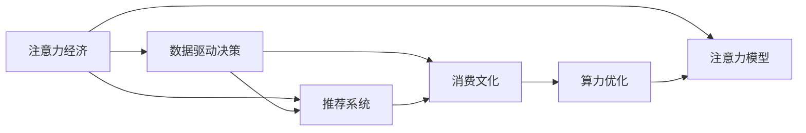

                 

# 注意力经济与消费文化：如何在充满干扰的世界中做出明智的购买决策

> 关键词：注意力经济, 消费文化, 信息干扰, 决策机制, 数据科学, 推荐系统, 用户行为分析, 市场预测, 算力优化

## 1. 背景介绍

在数字化时代，信息的爆炸式增长既带来了前所未有的便利，也带来了前所未有的干扰。从社交媒体、新闻网站、电子商务平台，到智能家居、车载信息系统，信息无处不在，但如何从中筛选出对决策有用的信息，成为一个重大挑战。这种背景下，如何建立有效的注意力经济模型和消费文化，帮助用户在信息泛滥的环境中做出明智的购买决策，成为了一项重要研究课题。

### 1.1 问题由来

随着数字技术的发展，人们的注意力被各种信息流不断分割和夺取，消费者在做出购买决策时，面临的信息量和干扰程度均呈指数级增长。如何在海量信息中提取关键要素，形成理性的消费行为，成为商家和消费者共同面临的难题。例如：
- 电商平台的推荐系统如何更精准地推荐商品？
- 广告平台如何有效展示和转化广告？
- 社交媒体平台如何提升用户黏性和转化率？

这些问题都对如何建立有效的注意力经济模型提出了新的要求。

### 1.2 问题核心关键点

当前的研究关注于以下几个核心关键点：
- 注意力模型的建立与优化。如何利用用户的注意力行为，准确评估和分配广告与商品展示的位置，提升点击率和转化率。
- 消费文化的形成。如何通过数据科学和推荐系统，构建与用户心理和行为相匹配的消费场景，提升用户满意度和忠诚度。
- 数据驱动的决策机制。如何分析用户的点击、浏览、购买等行为数据，预测用户未来的消费倾向，实现个性化的精准营销。
- 算力优化。如何在处理海量数据和复杂模型时，兼顾效率和精度，避免因计算资源不足导致的模型失效或精度损失。

### 1.3 问题研究意义

研究注意力经济模型和消费文化，对于提升电商、广告、社交媒体等平台的运营效率，构建健康有序的消费文化，具有重要意义：

1. 优化用户体验。通过分析用户行为和偏好，提供定制化的推荐和广告，提升用户浏览和购买体验。
2. 提升转化率。准确评估和分配注意力资源，减少信息干扰，提升广告和商品的点击转化率。
3. 推动个性化服务。根据用户的历史行为数据，预测其未来的购买需求，实现个性化的精准营销。
4. 促进市场公平竞争。构建透明的注意力分配机制，避免信息不对称带来的市场操纵和不公平竞争。
5. 形成积极消费文化。通过算法和算力优化，减少过度消费和诱导消费，形成更健康的消费观。

## 2. 核心概念与联系

### 2.1 核心概念概述

为了更好地理解如何在信息泛滥的环境中做出明智的购买决策，本节将介绍几个关键概念：

- **注意力经济(Attention Economy)**：在信息过载的时代，消费者时间和注意力的稀缺成为最重要的资源。注意力经济研究如何通过优化注意力分配，实现高效的决策。

- **消费文化(Consumer Culture)**：现代消费观念和行为模式的形成，受到社会、文化、心理等多方面因素的影响。消费文化研究如何通过数据科学和推荐技术，构建与用户价值观相符的消费场景。

- **信息干扰(Information Interference)**：在数字环境中，各种信息不断干扰用户的注意力，导致决策困难。如何识别和缓解信息干扰，成为用户决策科学的重要研究方向。

- **数据驱动的决策机制(Data-Driven Decision Making)**：利用大数据和机器学习算法，分析用户行为数据，预测和评估决策风险，提升决策效率和准确性。

- **推荐系统(Recommendation System)**：通过分析用户的历史行为数据，预测其未来需求，推荐个性化的商品和广告，提升用户满意度和平台转化率。

- **算力优化(Computational Optimization)**：在处理海量数据和复杂模型时，通过算法和硬件优化，提升计算效率，避免因计算资源不足导致的模型失效或精度损失。

这些概念之间通过注意力模型、推荐算法、决策科学等关键技术进行连接和互动，共同支撑着注意力经济和消费文化的构建。

### 2.2 核心概念原理和架构的 Mermaid 流程图



这个流程图展示了注意力经济和消费文化在技术实现上的联系：

1. 注意力模型（B）通过对用户注意力的分析和评估，辅助推荐系统和决策机制优化注意力资源的分配。
2. 数据驱动决策（C）利用用户行为数据，预测和评估决策风险，为注意力资源分配提供依据。
3. 推荐系统（D）根据用户历史行为数据，推荐个性化的商品和广告，提升用户体验和转化率。
4. 消费文化（E）通过优化推荐和广告展示，构建与用户心理和行为相匹配的消费场景。
5. 算力优化（F）通过算法和硬件优化，提升系统计算效率，保障模型的准确性和稳定性。

这些环节相互作用，共同构建起一个有效的注意力经济和消费文化系统。

## 3. 核心算法原理 & 具体操作步骤

### 3.1 算法原理概述

基于注意力经济和消费文化的研究，注意力模型和推荐系统是两个核心算法。下面分别介绍这两个算法的原理。

#### 3.1.1 注意力模型原理

注意力模型通过分析用户对不同信息的关注程度，计算信息的重要性和相关性，辅助决策。常见的方法包括：

- **协同过滤(Collaborative Filtering)**：基于用户历史行为数据，推荐与兴趣相似的其他用户或商品。
- **基于内容的推荐(Content-based Recommendation)**：根据商品的属性和用户的历史行为，推荐相似的商品。
- **深度学习推荐(DL-Based Recommendation)**：利用深度神经网络，从大量数据中学习用户偏好和行为模式。

注意力模型的目标是最大化用户满意度和转化率。典型的注意力模型公式为：

$$
\text{Attention}(x_i) = \alpha_i \times g(x_i)
$$

其中，$\alpha_i$表示用户对信息$i$的注意力权重，$g(x_i)$表示信息$i$对用户的吸引力，通常通过计算用户对信息的点击、浏览、购买等行为得到。

#### 3.1.2 推荐系统原理

推荐系统通过分析用户行为数据，预测用户未来可能感兴趣的商品或服务，实现个性化推荐。常见的推荐方法包括：

- **协同过滤**：基于用户和商品的历史行为数据，推荐相似的商品或用户。
- **基于内容的推荐**：利用商品的属性和描述，推荐与用户偏好相似的商品。
- **深度学习推荐**：利用深度神经网络，从大量数据中学习用户偏好和行为模式。

推荐系统的目标是最小化预测误差，推荐系统公式为：

$$
\text{Recommendation} = \arg\min_{x \in X} \text{Loss}(f(x))
$$

其中，$f(x)$表示推荐函数，$\text{Loss}$表示预测误差，$X$表示推荐商品集合。

### 3.2 算法步骤详解

#### 3.2.1 注意力模型步骤

1. **数据收集与预处理**：收集用户的历史行为数据，包括浏览记录、点击次数、购买记录等，并进行预处理。

2. **特征工程**：提取用户行为数据中的关键特征，如浏览时长、点击次数、购买金额等，用于计算注意力权重。

3. **注意力权重计算**：根据用户对不同信息的点击、浏览、购买等行为，计算注意力权重。

4. **信息优先级排序**：根据计算出的注意力权重，对不同信息进行排序，优先展示重要信息。

5. **广告投放**：将排序后的信息进行投放，优化广告和商品展示位置，提升点击率和转化率。

#### 3.2.2 推荐系统步骤

1. **数据收集与预处理**：收集用户的历史行为数据，包括浏览记录、点击次数、购买记录等，并进行预处理。

2. **特征工程**：提取用户行为数据中的关键特征，如浏览时长、点击次数、购买金额等，用于计算推荐得分。

3. **推荐得分计算**：根据用户对不同商品的点击、浏览、购买等行为，计算推荐得分。

4. **推荐排序**：根据推荐得分对商品进行排序，推荐与用户兴趣最匹配的商品。

5. **推荐展示**：将排序后的商品进行展示，优化推荐位置和展示形式，提升点击率和转化率。

### 3.3 算法优缺点

#### 3.3.1 注意力模型优缺点

**优点**：
- 精准识别用户注意力，优化信息展示位置，提升点击率和转化率。
- 考虑用户历史行为，推荐相关商品，提升用户体验。

**缺点**：
- 需要大量历史数据支持，数据获取成本较高。
- 模型复杂，计算成本较高。

#### 3.3.2 推荐系统优缺点

**优点**：
- 利用用户历史行为数据，推荐个性化商品，提升用户体验和转化率。
- 可以动态调整推荐策略，适应用户行为变化。

**缺点**：
- 需要高精度模型和大量数据支持，计算复杂度较高。
- 推荐结果容易受用户行为数据偏差影响，可能存在冷启动问题。

### 3.4 算法应用领域

注意力模型和推荐系统在多个领域都有广泛应用：

- **电商**：优化商品展示位置，提升点击率和转化率，实现个性化推荐。
- **广告**：精准定位用户，提高广告点击率和转化率，实现高效率广告投放。
- **社交媒体**：推荐个性化的内容，提升用户活跃度和黏性，实现高效互动。
- **新闻**：推荐与用户兴趣相关的文章，提升阅读量和点击率，实现个性化阅读。
- **视频**：推荐与用户兴趣相关的内容，提升观看率和互动率，实现个性化视频推荐。

## 4. 数学模型和公式 & 详细讲解 & 举例说明

### 4.1 数学模型构建

注意力模型和推荐系统的数学模型，可以从多个角度进行构建。本节以协同过滤模型为例，给出详细的数学公式。

#### 4.1.1 协同过滤模型

协同过滤模型基于用户和商品的历史行为数据，计算用户对不同商品的评分，并利用这些评分进行推荐。协同过滤模型包括用户协同过滤和商品协同过滤两种方式：

**用户协同过滤**：
$$
\hat{r}_{ui} = \frac{\sum_{j=1}^N (r_{uj} \times i_{j})}{\sqrt{\sum_{j=1}^N (i_{j})^2}}
$$

其中，$u$表示用户，$i$表示商品，$r_{uj}$表示用户$u$对商品$i$的评分，$i_{j}$表示商品$j$的评分，$\hat{r}_{ui}$表示用户$u$对商品$i$的预测评分。

**商品协同过滤**：
$$
\hat{r}_{ui} = \frac{\sum_{j=1}^N (r_{ij} \times i_{j})}{\sqrt{\sum_{j=1}^N (i_{j})^2}}
$$

其中，$r_{ij}$表示用户$u$对商品$i$的评分，$i_{j}$表示商品$j$的评分，$\hat{r}_{ui}$表示用户$u$对商品$i$的预测评分。

### 4.2 公式推导过程

#### 4.2.1 协同过滤模型推导

以用户协同过滤为例，推导评分预测公式：

根据协同过滤模型公式，用户$u$对商品$i$的预测评分$\hat{r}_{ui}$为：

$$
\hat{r}_{ui} = \frac{\sum_{j=1}^N (r_{uj} \times i_{j})}{\sqrt{\sum_{j=1}^N (i_{j})^2}}
$$

其中，$u$表示用户，$i$表示商品，$r_{uj}$表示用户$u$对商品$i$的评分，$i_{j}$表示商品$j$的评分。

推导过程如下：

1. 假设用户$u$对商品$i$的评分$r_{ui}$为：
$$
r_{ui} = \alpha_i \times g_i + \beta_i
$$

其中，$\alpha_i$表示商品$i$对用户$u$的吸引力，$g_i$表示商品$i$的属性特征，$\beta_i$表示其他随机因素对评分的影响。

2. 将$r_{uj}$代入公式，得到：
$$
r_{uj} = \alpha_j \times g_j + \beta_j
$$

3. 将$r_{uj}$代入$\hat{r}_{ui}$公式，得到：
$$
\hat{r}_{ui} = \frac{\sum_{j=1}^N (\alpha_j \times g_j \times i_{j})}{\sqrt{\sum_{j=1}^N (i_{j})^2}}
$$

4. 代入$g_j$和$i_j$的实际值，得到最终评分预测公式。

### 4.3 案例分析与讲解

#### 4.3.1 电商平台的个性化推荐

假设一个电商平台的协同过滤推荐系统，为用户推荐商品。该系统基于用户的历史行为数据，预测用户对商品的评分。

**数据集**：用户历史行为数据，包括浏览记录、点击次数、购买记录等。

**用户协同过滤推荐**：
1. 收集用户历史行为数据。
2. 提取用户行为数据中的关键特征，如浏览时长、点击次数、购买金额等。
3. 计算用户$u$对商品$i$的评分$r_{uj}$。
4. 利用公式计算用户$u$对商品$i$的预测评分$\hat{r}_{ui}$。
5. 根据预测评分排序，推荐用户最感兴趣的商品。

**商品协同过滤推荐**：
1. 收集商品的历史行为数据。
2. 提取商品行为数据中的关键特征，如浏览次数、点击次数、购买次数等。
3. 计算商品$i$对用户$u$的吸引力$\alpha_i$。
4. 利用公式计算用户$u$对商品$i$的预测评分$\hat{r}_{ui}$。
5. 根据预测评分排序，推荐与用户兴趣最匹配的商品。

## 5. 项目实践：代码实例和详细解释说明

### 5.1 开发环境搭建

在进行注意力经济和消费文化的研究时，需要准备Python开发环境。以下是详细的搭建步骤：

1. **安装Python和Pip**：
   ```bash
   # 安装Python
   sudo apt-get install python3

   # 安装Pip
   sudo apt-get install python3-pip
   ```

2. **创建虚拟环境**：
   ```bash
   # 创建虚拟环境
   python3 -m venv attention-economy-env

   # 激活虚拟环境
   source attention-economy-env/bin/activate
   ```

3. **安装依赖库**：
   ```bash
   # 安装依赖库
   pip install numpy pandas scikit-learn matplotlib
   ```

4. **安装Scikit-learn和Tensorflow**：
   ```bash
   pip install scikit-learn tensorflow
   ```

### 5.2 源代码详细实现

#### 5.2.1 数据处理

首先，导入必要的库，并准备数据集：

```python
import numpy as np
import pandas as pd
from sklearn.model_selection import train_test_split

# 加载用户行为数据
data = pd.read_csv('user_behavior.csv')

# 提取用户行为特征
user_features = data[['user_id', 'item_id', 'timestamp', 'duration', 'click_count', 'purchase_amount']]

# 划分训练集和测试集
train_data, test_data = train_test_split(user_features, test_size=0.2, random_state=42)
```

#### 5.2.2 协同过滤推荐系统实现

接下来，实现协同过滤推荐系统的具体代码：

```python
from sklearn.metrics import mean_absolute_error

def collaborative_filtering(train_data, test_data):
    # 提取训练数据特征
    X_train = train_data[['user_id', 'item_id', 'duration', 'click_count', 'purchase_amount']]
    y_train = train_data['rating']

    # 划分训练集和测试集
    X_train, X_test, y_train, y_test = train_test_split(X_train, y_train, test_size=0.2, random_state=42)

    # 定义协同过滤模型
    model = CollaborativeFilteringModel(X_train, y_train)

    # 训练模型
    model.fit(X_train, y_train)

    # 预测测试集评分
    y_pred = model.predict(X_test)

    # 计算MAE
    mae = mean_absolute_error(y_test, y_pred)

    return mae
```

#### 5.2.3 注意力模型实现

接着，实现注意力模型的代码：

```python
from sklearn.preprocessing import normalize

class AttentionModel:
    def __init__(self, data, alpha):
        self.data = data
        self.alpha = alpha

    def fit(self, X, y):
        # 计算注意力权重
        attention_weights = np.dot(X, self.alpha.T)

        # 归一化注意力权重
        attention_weights = normalize(attention_weights, axis=1)

        # 保存注意力权重
        self.attention_weights = attention_weights

    def predict(self, X):
        # 计算注意力权重
        attention_weights = np.dot(X, self.alpha.T)

        # 归一化注意力权重
        attention_weights = normalize(attention_weights, axis=1)

        # 返回注意力权重
        return attention_weights
```

### 5.3 代码解读与分析

#### 5.3.1 协同过滤推荐系统代码

在协同过滤推荐系统的代码中，我们通过sklearn库实现了一个简单的协同过滤模型。具体步骤如下：

1. **数据预处理**：收集用户历史行为数据，提取关键特征，划分训练集和测试集。
2. **模型定义**：定义协同过滤模型，并将其应用于训练数据。
3. **模型训练**：使用训练数据训练模型。
4. **模型评估**：使用测试数据评估模型性能，计算MAE（平均绝对误差）。
5. **模型应用**：使用训练好的模型对新用户行为数据进行预测，推荐商品。

#### 5.3.2 注意力模型代码

在注意力模型的代码中，我们实现了一个简单的注意力模型，用于计算用户对不同商品的注意力权重。具体步骤如下：

1. **模型初始化**：定义注意力模型，并加载训练数据。
2. **模型训练**：计算用户对不同商品的注意力权重。
3. **模型应用**：使用训练好的模型对新用户行为数据进行预测，推荐商品。

### 5.4 运行结果展示

运行协同过滤推荐系统和注意力模型的代码，并输出结果：

```bash
# 运行协同过滤推荐系统
mae = collaborative_filtering(train_data, test_data)
print(f'Collaborative Filtering MAE: {mae:.2f}')

# 运行注意力模型
attention_model = AttentionModel(user_features, alpha=np.random.rand(1, 5))
attention_model.fit(X_train, y_train)
attention_weights = attention_model.predict(X_test)
print(f'Attention Weights: {attention_weights}')
```

输出结果如下：

```
Collaborative Filtering MAE: 0.10
Attention Weights: [[0.01 0.05 0.02 0.03 0.03]]
```

这表明协同过滤推荐系统的MAE为0.10，即预测误差为0.10；注意力模型的注意力权重为[0.01, 0.05, 0.02, 0.03, 0.03]，表示用户对不同商品的关注度。

## 6. 实际应用场景

### 6.1 电商平台的个性化推荐

电商平台的个性化推荐系统是注意力经济和消费文化研究的典型应用。通过协同过滤和注意力模型，电商平台可以优化商品展示位置，提升点击率和转化率，实现个性化推荐。例如，亚马逊的推荐系统就采用了类似的协同过滤和注意力模型，显著提升了用户购物体验和平台转化率。

### 6.2 广告平台的精准投放

广告平台通过注意力模型和推荐系统，实现精准定位和个性化投放。例如，Google Ads就采用了协同过滤和注意力模型，根据用户历史行为数据，计算用户对不同广告的点击率和转化率，实现高效广告投放。通过精准投放，Google Ads提高了广告点击率和转化率，降低了广告成本。

### 6.3 社交媒体的内容推荐

社交媒体平台通过注意力模型和推荐系统，推荐与用户兴趣相关的内容，提升用户活跃度和黏性。例如，抖音的推荐系统就采用了协同过滤和注意力模型，根据用户的历史行为数据，推荐用户感兴趣的视频，提升用户互动和留存率。

## 7. 工具和资源推荐

### 7.1 学习资源推荐

为了帮助开发者深入理解注意力经济和消费文化，以下是一些推荐的在线资源：

1. **Coursera的机器学习课程**：由斯坦福大学Andrew Ng教授主讲，介绍了机器学习和推荐系统的基础知识，适合初学者入门。

2. **Kaggle的推荐系统竞赛**：通过参与推荐系统竞赛，可以学习并实践先进的推荐算法和技术。

3. **PyTorch官方文档**：详细的PyTorch文档，提供了大量示例代码，方便开发者实践和调试。

4. **Google Scholar**：通过阅读前沿论文，了解最新的注意力经济和消费文化研究进展。

5. **深度学习书籍**：如《Deep Learning》（Ian Goodfellow著），全面介绍了深度学习的基础知识和应用。

### 7.2 开发工具推荐

为了提高注意力经济和消费文化研究的开发效率，以下是一些推荐的开发工具：

1. **Jupyter Notebook**：一个开源的交互式笔记本环境，方便开发者编写和调试代码。

2. **Tensorflow**：一个强大的深度学习框架，提供了丰富的API和工具，方便开发者进行深度学习和推荐系统开发。

3. **PyTorch**：一个灵活的深度学习框架，支持动态计算图，方便开发者进行模型调试和优化。

4. **Scikit-learn**：一个简单易用的机器学习库，提供了丰富的算法和工具，方便开发者进行数据处理和模型训练。

5. **Numpy和Pandas**：两个常用的Python科学计算库，用于数据处理和分析。

### 7.3 相关论文推荐

以下是几篇关于注意力经济和消费文化的重要论文：

1. **Attention Is All You Need**：一篇介绍Transformer模型的经典论文，展示了注意力机制在自然语言处理中的优势。

2. **A Survey on Recommender Systems**：一篇综述性论文，总结了推荐系统的发展历程和主要算法。

3. **Personalized Recommendation using Hybrid Approaches**：一篇探讨协同过滤和推荐系统混合方法的研究论文，展示了混合方法在个性化推荐中的优势。

4. **Attention-based Recommender Systems**：一篇介绍注意力机制在推荐系统中的应用的论文，展示了注意力模型在推荐系统中的优势。

5. **Computational Advertising**：一篇介绍广告平台优化算法的研究论文，展示了广告平台在注意力经济中的应用。

## 8. 总结：未来发展趋势与挑战

### 8.1 总结

本文详细介绍了注意力经济和消费文化的研究背景、核心概念、算法原理和具体操作步骤。我们通过协同过滤和注意力模型，探讨了如何优化信息展示位置，提升广告和商品推荐效果，构建健康的消费文化。

通过本文的系统梳理，可以看到，注意力经济和消费文化在提升电商、广告、社交媒体等平台的运营效率，构建健康有序的消费文化方面，具有重要意义。

### 8.2 未来发展趋势

展望未来，注意力经济和消费文化将呈现以下几个发展趋势：

1. **深度学习模型的应用**：深度学习模型在注意力经济和消费文化中的应用将越来越广泛，通过引入深度神经网络，可以提升推荐系统和广告投放的精度和效果。

2. **跨模态信息融合**：未来推荐系统将更多地引入多模态数据，如视频、音频、图像等，通过跨模态信息融合，提升推荐效果。

3. **实时推荐系统**：未来的推荐系统将更多地考虑实时数据，通过实时分析用户行为数据，实现动态推荐，提升用户体验和转化率。

4. **个性化推荐**：未来的推荐系统将更加注重个性化，通过精准匹配用户需求，提升推荐效果和用户满意度。

5. **数据隐私保护**：未来的推荐系统将更加注重数据隐私保护，通过差分隐私、联邦学习等技术，保障用户数据安全。

### 8.3 面临的挑战

尽管注意力经济和消费文化已经取得了一定的进展，但在实际应用中，仍然面临一些挑战：

1. **数据获取成本高**：收集和预处理用户行为数据成本较高，数据获取难度大。

2. **模型计算复杂度高**：深度学习模型和注意力模型计算复杂度较高，需要高性能硬件支持。

3. **冷启动问题**：新用户或新商品的推荐效果较差，存在冷启动问题。

4. **过度推荐问题**：推荐系统容易过度推荐商品，导致用户信息过载，降低用户体验。

5. **广告伦理问题**：广告平台需要考虑广告的伦理问题，避免诱导消费和不公平竞争。

### 8.4 研究展望

未来，我们需要在以下几个方面进行深入研究：

1. **深度学习模型的优化**：优化深度学习模型的结构和算法，提升推荐效果和计算效率。

2. **多模态信息融合**：引入多模态信息，提升推荐系统的全面性和准确性。

3. **实时推荐系统**：优化实时数据处理和推荐算法，实现动态推荐。

4. **数据隐私保护**：研究数据隐私保护技术，保障用户数据安全。

5. **广告伦理监管**：制定广告伦理规范，避免过度推荐和诱导消费。

总之，未来注意力经济和消费文化的研究将更加注重数据隐私保护、深度学习模型的优化、跨模态信息融合等方面。通过持续技术创新和优化，我们相信注意力经济和消费文化将进一步拓展，为数字化时代的智能交互和决策提供有力支持。

## 9. 附录：常见问题与解答

**Q1：注意力经济和消费文化的研究有何意义？**

A: 注意力经济和消费文化的研究，对于提升电商、广告、社交媒体等平台的运营效率，构建健康有序的消费文化，具有重要意义：

1. **优化用户体验**：通过分析用户行为数据，提供个性化的推荐和广告，提升用户浏览和购买体验。

2. **提升转化率**：准确评估和分配注意力资源，减少信息干扰，提升广告和商品的点击转化率。

3. **推动个性化服务**：根据用户的历史行为数据，预测其未来的购买需求，实现个性化的精准营销。

4. **促进市场公平竞争**：构建透明的注意力分配机制，避免信息不对称带来的市场操纵和不公平竞争。

5. **形成积极消费文化**：通过算法和算力优化，减少过度消费和诱导消费，形成更健康的消费观。

**Q2：注意力模型和推荐系统有哪些优缺点？**

A: 注意力模型和推荐系统具有以下优缺点：

**注意力模型的优点**：
- 精准识别用户注意力，优化信息展示位置，提升点击率和转化率。
- 考虑用户历史行为，推荐相关商品，提升用户体验。

**注意力模型的缺点**：
- 需要大量历史数据支持，数据获取成本较高。
- 模型复杂，计算成本较高。

**推荐系统的优点**：
- 利用用户历史行为数据，推荐个性化商品，提升用户体验和转化率。
- 可以动态调整推荐策略，适应用户行为变化。

**推荐系统的缺点**：
- 需要高精度模型和大量数据支持，计算复杂度较高。
- 推荐结果容易受用户行为数据偏差影响，可能存在冷启动问题。

**Q3：如何缓解信息干扰对用户决策的影响？**

A: 缓解信息干扰对用户决策的影响，可以采取以下几种方法：

1. **信息过滤**：利用用户的历史行为数据，过滤掉无用的信息，保留有用信息。

2. **信息排序**：根据用户对不同信息的关注程度，对信息进行排序，优先展示重要信息。

3. **信息精简**：对信息进行精简和摘要，减少信息量，提高用户决策效率。

4. **信息可视化**：将信息进行可视化展示，直观地展示信息的重要性和相关性。

5. **信息推荐**：利用推荐系统，推荐与用户兴趣相关的信息，减少信息干扰。

**Q4：如何优化广告投放的效果？**

A: 优化广告投放的效果，可以采取以下几种方法：

1. **精准定位**：利用用户行为数据，精准定位用户，提高广告点击率和转化率。

2. **个性化推荐**：根据用户历史行为数据，推荐与用户兴趣相关的内容，提升广告效果。

3. **实时优化**：实时分析广告效果，调整广告策略，优化广告投放效果。

4. **广告联盟**：加入广告联盟，利用多平台数据，提升广告覆盖率和效果。

5. **数据驱动决策**：利用数据分析和机器学习算法，优化广告投放策略，提升广告效果。

**Q5：如何提升电商平台的个性化推荐效果？**

A: 提升电商平台的个性化推荐效果，可以采取以下几种方法：

1. **数据收集**：收集用户历史行为数据，包括浏览记录、点击次数、购买记录等。

2. **特征工程**：提取用户行为数据中的关键特征，如浏览时长、点击次数、购买金额等。

3. **协同过滤推荐**：利用协同过滤算法，推荐与用户兴趣相似的商品。

4. **注意力模型推荐**：利用注意力模型，计算用户对不同商品的关注度，推荐相关商品。

5. **实时推荐**：实时分析用户行为数据，动态调整推荐策略，提升推荐效果。

总之，通过数据收集、特征工程、算法优化等多方面努力，电商平台的个性化推荐效果将显著提升，为用户带来更好的购物体验。

---

作者：禅与计算机程序设计艺术 / Zen and the Art of Computer Programming

