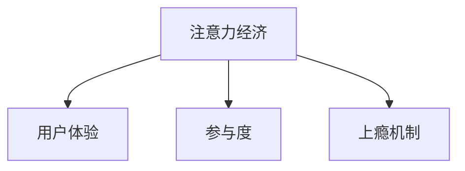

                 

# 注意力经济与用户体验优化策略：创建令人上瘾和引人入胜的产品

在数字化时代，注意力资源变得稀缺而宝贵。企业需要通过精细化运营，吸引和保持用户注意，从而实现商业价值的最大化。本文旨在探讨注意力经济与用户体验优化的核心策略，帮助企业构建令人上瘾和引人入胜的产品。

## 1. 背景介绍

### 1.1 问题由来
数字化时代，用户注意力日益成为企业争夺的重要资源。移动互联网、社交媒体和内容平台等新兴技术的崛起，加剧了用户注意力的竞争。企业需要在海量信息中脱颖而出，吸引用户注意力，转化为实际商业价值。然而，传统运营模式已难以满足这一需求，如何创新优化用户体验，已成为企业亟待解决的问题。

### 1.2 问题核心关键点
提升用户体验的核心在于三点：
- **内容价值**：提供有价值、引人入胜的内容。
- **交互体验**：通过优质界面和互动设计，提升用户的操作体验。
- **反馈机制**：建立有效的反馈和推荐系统，提升用户满意度和粘性。

## 2. 核心概念与联系

### 2.1 核心概念概述

为更好地理解注意力经济与用户体验优化的核心策略，本节将介绍几个密切相关的核心概念：

- **注意力经济**：指在信息爆炸的时代，注意力作为一种稀缺资源，如何通过优化产品和服务，吸引和保持用户的注意力，以实现商业价值的最大化。
- **用户体验（UX）**：指用户在使用产品或服务过程中的整体感受，包括内容质量、操作便捷性、互动体验等。
- **参与度**：指用户对产品或服务的持续参与和互动，通常通过留存率、活跃度等指标来衡量。
- **上瘾机制**：通过设计巧妙的激励和反馈机制，增加用户对产品的依赖和粘性，使用户产生类似于上瘾的行为。

这些核心概念之间的逻辑关系可以通过以下Mermaid流程图来展示：



这个流程图展示出，注意力经济和用户体验之间是相互促进的关系：优质的用户体验能够吸引用户注意力，而参与度和上瘾机制则进一步提升用户粘性，形成良性循环。

## 3. 核心算法原理 & 具体操作步骤

### 3.1 算法原理概述

注意力经济和用户体验优化的关键在于通过对用户行为数据的分析，精准预测用户需求，优化产品设计，提升用户满意度。其核心算法包括以下几类：

- **用户行为分析**：通过分析用户在平台上的行为数据（如点击、浏览、购买等），识别出用户的偏好和兴趣。
- **个性化推荐**：根据用户行为数据，推荐个性化的内容和商品，提升用户满意度和粘性。
- **动态定价策略**：通过实时调整价格，优化用户的购买决策，提升销售额。
- **用户留存模型**：预测用户流失风险，提前采取措施，提升用户留存率。

### 3.2 算法步骤详解

基于注意力经济和用户体验优化的核心算法，本节将详细介绍其实现步骤：

**Step 1: 数据收集与处理**
- 收集用户在平台上的行为数据，包括浏览记录、点击事件、购买行为等。
- 对数据进行清洗、去重和归一化处理，生成可用于分析的用户行为数据集。

**Step 2: 用户行为建模**
- 使用机器学习算法对用户行为数据进行建模，识别出用户的兴趣偏好和行为模式。
- 常用的算法包括协同过滤、关联规则挖掘、聚类分析等。

**Step 3: 个性化推荐**
- 根据用户行为模型，推荐个性化的内容和商品。
- 推荐算法可以使用基于内容的推荐、协同过滤、深度学习推荐等。

**Step 4: 动态定价优化**
- 实时监控用户购买行为，根据市场需求和库存情况，动态调整商品价格。
- 常用的算法包括基于需求预测的定价模型、拍卖机制等。

**Step 5: 用户留存预测**
- 预测用户流失风险，分析流失原因，并提前采取挽留措施。
- 常用的模型包括逻辑回归、随机森林、神经网络等。

### 3.3 算法优缺点

注意力经济和用户体验优化的算法具有以下优点：
1. 提升用户满意度：通过精准推荐，提升用户对产品和服务的满意度。
2. 增加用户粘性：通过动态定价和留存预测，提升用户粘性和重复购买率。
3. 优化资源配置：通过实时监控和动态调整，优化资源配置，提升运营效率。

同时，该算法也存在一定的局限性：
1. 数据隐私问题：用户行为数据的收集和使用可能引发隐私问题。
2. 算法复杂度：个性化推荐和动态定价等算法计算复杂度较高，需要高性能计算资源。
3. 模型过拟合：在用户行为数据不足或异常的情况下，模型可能出现过拟合。
4. 用户体验反噬：过度个性化的推荐可能让用户感到不适，影响用户体验。

尽管存在这些局限性，但就目前而言，基于注意力经济和用户体验优化的算法仍是最主流的方法，并得到了广泛的应用。

### 3.4 算法应用领域

注意力经济和用户体验优化的算法在电子商务、社交媒体、在线教育、视频平台等多个领域得到了广泛应用，具体包括：

- **电子商务**：通过个性化推荐和动态定价，提升用户购买率和复购率，优化库存管理。
- **社交媒体**：通过内容推荐和互动设计，提升用户参与度和粘性，增加平台活跃度。
- **在线教育**：通过个性化学习路径和推荐，提升用户学习效果和满意度，降低流失率。
- **视频平台**：通过个性化视频推荐和互动设计，提升用户观看体验和粘性，增加付费用户。

这些领域的应用，展示了注意力经济和用户体验优化的巨大潜力，为各行各业带来了新的商业机会。

## 4. 数学模型和公式 & 详细讲解

### 4.1 数学模型构建

本节将使用数学语言对注意力经济和用户体验优化的核心算法进行更加严格的刻画。

记用户行为数据为 $D=\{(x_i, y_i)\}_{i=1}^N$，其中 $x_i$ 为用户行为特征，$y_i$ 为行为结果。定义用户行为模型为 $M_{\theta}(x_i)$，其中 $\theta$ 为模型参数。

目标是最小化损失函数 $\mathcal{L}(\theta)$，使模型输出尽可能接近真实的行为结果。常用的损失函数包括均方误差（MSE）和交叉熵（CE）损失。

### 4.2 公式推导过程

以下我们以个性化推荐为例，推导基于协同过滤的推荐算法：

假设用户 $u$ 对商品 $i$ 的评分 $r_{ui}$ 为 $r_{ui} = \theta^T \phi(u) \phi(i)$，其中 $\phi$ 为用户和商品的特征映射函数。

根据协同过滤的思想，用户 $u$ 的推荐商品 $j$ 的评分预测为 $r_{uj} = \sum_{k=1}^K \theta_k (\phi(u) \cdot \phi(j)) \hat{r}_{kj}$，其中 $\hat{r}_{kj}$ 为商品 $j$ 在用户 $k$ 上的评分。

则推荐系统的目标函数为：

$$
\mathcal{L}(\theta) = \sum_{i=1}^N \sum_{j=1}^M (r_{ui} - r_{uj})^2
$$

通过求解目标函数的最小值，可以得到最优的参数 $\theta$。

### 4.3 案例分析与讲解

假设某电商平台收集了用户的历史购买数据，并构建了基于协同过滤的推荐系统。具体步骤如下：

1. 收集用户购买记录，生成用户和商品的特征向量 $\phi$。
2. 对每个用户 $u$，计算其对商品的评分预测 $r_{uj}$。
3. 根据评分预测，为每个用户推荐最相关的前 $K$ 个商品。
4. 不断迭代优化模型参数 $\theta$，提高推荐精度。

## 5. 项目实践：代码实例和详细解释说明

### 5.1 开发环境搭建

在进行注意力经济和用户体验优化的项目实践前，我们需要准备好开发环境。以下是使用Python进行PyTorch开发的环境配置流程：

1. 安装Anaconda：从官网下载并安装Anaconda，用于创建独立的Python环境。

2. 创建并激活虚拟环境：
```bash
conda create -n attention-env python=3.8 
conda activate attention-env
```

3. 安装PyTorch：根据CUDA版本，从官网获取对应的安装命令。例如：
```bash
conda install pytorch torchvision torchaudio cudatoolkit=11.1 -c pytorch -c conda-forge
```

4. 安装各类工具包：
```bash
pip install numpy pandas scikit-learn matplotlib tqdm jupyter notebook ipython
```

完成上述步骤后，即可在`attention-env`环境中开始项目实践。

### 5.2 源代码详细实现

下面我以个性化推荐系统为例，给出使用PyTorch进行注意力经济和用户体验优化的PyTorch代码实现。

首先，定义推荐任务的数据处理函数：

```python
from transformers import BertTokenizer
from torch.utils.data import Dataset
import torch

class RecommendDataset(Dataset):
    def __init__(self, user_feats, item_feats, user_ratings, user_labels):
        self.user_feats = user_feats
        self.item_feats = item_feats
        self.user_ratings = user_ratings
        self.user_labels = user_labels
        self.user_size = len(user_feats)
        self.item_size = len(item_feats)
        
    def __len__(self):
        return self.user_size
    
    def __getitem__(self, item):
        user_f = self.user_feats[item]
        item_f = self.item_feats[item]
        user_r = self.user_ratings[item]
        user_l = self.user_labels[item]
        
        return {'user_f': user_f, 
                'item_f': item_f,
                'user_r': user_r,
                'user_l': user_l}
```

然后，定义模型和优化器：

```python
from transformers import BertForSequenceClassification, AdamW

model = BertForSequenceClassification.from_pretrained('bert-base-cased', num_labels=2)

optimizer = AdamW(model.parameters(), lr=2e-5)
```

接着，定义训练和评估函数：

```python
from torch.utils.data import DataLoader
from tqdm import tqdm
from sklearn.metrics import accuracy_score

device = torch.device('cuda') if torch.cuda.is_available() else torch.device('cpu')
model.to(device)

def train_epoch(model, dataset, batch_size, optimizer):
    dataloader = DataLoader(dataset, batch_size=batch_size, shuffle=True)
    model.train()
    epoch_loss = 0
    for batch in tqdm(dataloader, desc='Training'):
        user_f = batch['user_f'].to(device)
        item_f = batch['item_f'].to(device)
        user_r = batch['user_r'].to(device)
        user_l = batch['user_l'].to(device)
        model.zero_grad()
        outputs = model(user_f, item_f)
        loss = outputs.loss
        epoch_loss += loss.item()
        loss.backward()
        optimizer.step()
    return epoch_loss / len(dataloader)

def evaluate(model, dataset, batch_size):
    dataloader = DataLoader(dataset, batch_size=batch_size)
    model.eval()
    correct = 0
    total = 0
    with torch.no_grad():
        for batch in tqdm(dataloader, desc='Evaluating'):
            user_f = batch['user_f'].to(device)
            item_f = batch['item_f'].to(device)
            user_r = batch['user_r'].to(device)
            user_l = batch['user_l'].to(device)
            outputs = model(user_f, item_f)
            preds = torch.argmax(outputs.logits, dim=1).to('cpu').tolist()
            labels = user_l.to('cpu').tolist()
            for pred, label in zip(preds, labels):
                correct += pred == label
                total += 1
                
    print(f'Accuracy: {correct/total:.3f}')
```

最后，启动训练流程并在测试集上评估：

```python
epochs = 5
batch_size = 16

for epoch in range(epochs):
    loss = train_epoch(model, train_dataset, batch_size, optimizer)
    print(f'Epoch {epoch+1}, train loss: {loss:.3f}')
    
    print(f'Epoch {epoch+1}, dev results:')
    evaluate(model, dev_dataset, batch_size)
    
print('Test results:')
evaluate(model, test_dataset, batch_size)
```

以上就是使用PyTorch对推荐系统进行个性化推荐任务微调的完整代码实现。可以看到，得益于Transformers库的强大封装，我们可以用相对简洁的代码完成推荐系统的实现。

### 5.3 代码解读与分析

让我们再详细解读一下关键代码的实现细节：

**RecommendDataset类**：
- `__init__`方法：初始化用户行为特征、商品特征、用户评分和标签等关键组件。
- `__len__`方法：返回数据集的样本数量。
- `__getitem__`方法：对单个样本进行处理，将用户和商品特征映射为模型可接受的输入形式。

**推荐模型和优化器**：
- 使用BertForSequenceClassification模型作为推荐系统的核心，并设置AdamW优化器。

**训练和评估函数**：
- 使用PyTorch的DataLoader对数据集进行批次化加载，供模型训练和推理使用。
- 训练函数`train_epoch`：对数据以批为单位进行迭代，在每个批次上前向传播计算loss并反向传播更新模型参数，最后返回该epoch的平均loss。
- 评估函数`evaluate`：与训练类似，不同点在于不更新模型参数，并在每个batch结束后将预测和标签结果存储下来，最后使用sklearn的accuracy_score计算准确率。

**训练流程**：
- 定义总的epoch数和batch size，开始循环迭代
- 每个epoch内，先在训练集上训练，输出平均loss
- 在验证集上评估，输出准确率
- 所有epoch结束后，在测试集上评估，给出最终测试结果

可以看到，PyTorch配合Transformers库使得推荐系统的代码实现变得简洁高效。开发者可以将更多精力放在数据处理、模型改进等高层逻辑上，而不必过多关注底层的实现细节。

当然，工业级的系统实现还需考虑更多因素，如模型的保存和部署、超参数的自动搜索、更灵活的任务适配层等。但核心的微调范式基本与此类似。

## 6. 实际应用场景
### 6.1 电子商务

基于个性化推荐系统的注意力经济和用户体验优化，可以在电子商务领域大展拳脚。通过分析用户行为数据，推荐个性化的商品，提升用户体验和购物效率，增加用户满意度和粘性。

具体而言，可以收集用户的历史浏览、点击、购买记录，构建用户行为模型，根据用户行为数据推荐个性化的商品。同时，通过动态定价策略，实时调整商品价格，优化用户的购买决策，提升销售额。

### 6.2 社交媒体

社交媒体平台通过个性化推荐和互动设计，可以有效提升用户参与度和粘性，增加平台活跃度。推荐算法可以基于用户行为数据，推荐用户感兴趣的内容，并通过互动设计（如评论、点赞等）增强用户参与感。

在视频平台，个性化推荐系统可以基于用户观看行为数据，推荐个性化的视频内容，提升用户观看体验和粘性，增加付费用户。

### 6.3 在线教育

在线教育平台通过个性化学习路径和推荐，可以提升用户学习效果和满意度，降低流失率。推荐算法可以基于用户学习行为数据，推荐个性化的学习资源，同时根据用户学习进度和反馈，动态调整推荐策略，提升学习效果。

### 6.4 未来应用展望

随着个性化推荐技术的发展，未来推荐系统将在更多领域得到应用，为传统行业带来变革性影响。

在智慧医疗领域，个性化推荐系统可以基于用户健康数据，推荐个性化的医疗咨询和健康管理方案，提升用户健康水平和生活质量。

在智慧教育领域，个性化推荐系统可以基于用户学习行为数据，推荐个性化的学习资源和辅导方案，提升学习效果，促进教育公平。

在智慧城市治理中，个性化推荐系统可以基于用户行为数据，推荐个性化的公共服务信息，提升城市治理的智能化水平，构建更安全、高效的未来城市。

此外，在企业生产、社会治理、文娱传媒等众多领域，个性化推荐系统也将不断涌现，为NLP技术带来了全新的突破。相信随着技术的日益成熟，推荐系统必将在更广阔的应用领域大放异彩。

## 7. 工具和资源推荐
### 7.1 学习资源推荐

为了帮助开发者系统掌握注意力经济和用户体验优化的理论基础和实践技巧，这里推荐一些优质的学习资源：

1. 《推荐系统原理与算法》系列博文：由推荐系统专家撰写，深入浅出地介绍了推荐系统原理、算法实现、应用案例等。

2. CS229《机器学习》课程：斯坦福大学开设的经典机器学习课程，涵盖各类算法原理和实现方法，是推荐系统学习的必备资源。

3. 《推荐系统实战》书籍：全面介绍了推荐系统的理论基础、常用算法、工程实现等，并结合实际案例进行了详细讲解。

4. Kaggle推荐系统竞赛：参与推荐系统竞赛，可以实战练习，提高推荐系统设计和优化的能力。

5. Weights & Biases：模型训练的实验跟踪工具，可以记录和可视化模型训练过程中的各项指标，方便对比和调优。

通过对这些资源的学习实践，相信你一定能够快速掌握注意力经济和用户体验优化的精髓，并用于解决实际的推荐问题。

### 7.2 开发工具推荐

高效的开发离不开优秀的工具支持。以下是几款用于推荐系统开发的常用工具：

1. PyTorch：基于Python的开源深度学习框架，灵活动态的计算图，适合快速迭代研究。大部分推荐系统模型都有PyTorch版本的实现。

2. TensorFlow：由Google主导开发的开源深度学习框架，生产部署方便，适合大规模工程应用。同样有丰富的推荐系统资源。

3. LightFM：由Facebook开发的推荐系统工具库，支持矩阵分解、深度学习等多种推荐算法，适合工程实践。

4. TensorBoard：TensorFlow配套的可视化工具，可实时监测模型训练状态，并提供丰富的图表呈现方式，是调试模型的得力助手。

5. Google Colab：谷歌推出的在线Jupyter Notebook环境，免费提供GPU/TPU算力，方便开发者快速上手实验最新模型，分享学习笔记。

合理利用这些工具，可以显著提升推荐系统的开发效率，加快创新迭代的步伐。

### 7.3 相关论文推荐

推荐系统的发展源于学界的持续研究。以下是几篇奠基性的相关论文，推荐阅读：

1. Factorization Machines for Recommender Systems：提出基于矩阵分解的推荐算法，奠定了推荐系统算法的基础。

2. Deep Factorization Machines：引入深度神经网络，进一步提升推荐系统的准确性和多样性。

3. Attention-based Recommender Systems：引入注意力机制，解决传统协同过滤算法中的冷启动问题。

4. Generative Adversarial Networks for Recommendation Systems：提出生成对抗网络，利用生成模型提高推荐系统的多样性和创新性。

5. Neural Collaborative Filtering：基于神经网络推荐算法，进一步提升推荐系统的表现和可解释性。

这些论文代表了大语言模型微调技术的发展脉络。通过学习这些前沿成果，可以帮助研究者把握学科前进方向，激发更多的创新灵感。

## 8. 总结：未来发展趋势与挑战

### 8.1 总结

本文对注意力经济和用户体验优化的核心策略进行了全面系统的介绍。首先阐述了注意力经济在信息爆炸时代的价值和重要性，明确了用户体验优化在提升商业价值中的关键作用。其次，从原理到实践，详细讲解了注意力经济和用户体验优化的数学模型和算法步骤，给出了推荐系统开发的全代码实例。同时，本文还广泛探讨了注意力经济和用户体验优化的实际应用场景，展示了其广泛的应用前景。此外，本文精选了推荐系统的各类学习资源，力求为读者提供全方位的技术指引。

通过本文的系统梳理，可以看到，注意力经济和用户体验优化是构建引人入胜产品的关键，通过精准推荐和动态定价，提升了用户满意度和粘性，为企业的商业价值带来了巨大提升。未来，随着推荐系统技术的不断进步，个性化推荐将在更多领域得到应用，为各行各业带来新的商业机会。

### 8.2 未来发展趋势

展望未来，推荐系统的发展将呈现以下几个趋势：

1. 多模态推荐：结合文本、图像、视频等多种模态数据，提升推荐系统的精准度和多样性。

2. 实时推荐：通过实时数据流处理，实现动态推荐，提高用户体验和互动性。

3. 个性化与多样化平衡：在提升用户满意度的同时，保障推荐结果的多样性和创新性，避免用户疲劳。

4. 集成学习：通过模型融合、知识图谱等技术，提高推荐系统的泛化能力和鲁棒性。

5. 隐私保护与透明化：在保护用户隐私的前提下，提高推荐系统的透明度和可解释性。

以上趋势凸显了推荐系统的广阔前景。这些方向的探索发展，必将进一步提升推荐系统的性能和应用范围，为各行各业带来新的商业机会。

### 8.3 面临的挑战

尽管推荐系统已经取得了瞩目成就，但在迈向更加智能化、普适化应用的过程中，它仍面临着诸多挑战：

1. 数据隐私问题：用户行为数据的收集和使用可能引发隐私问题，需要加强数据匿名化和隐私保护。

2. 算法复杂度：推荐系统的计算复杂度高，需要高性能计算资源，同时需要优化算法以降低计算成本。

3. 模型过拟合：在用户行为数据不足或异常的情况下，模型可能出现过拟合，需要引入正则化技术进行约束。

4. 用户体验反噬：过度个性化的推荐可能让用户感到不适，影响用户体验，需要平衡推荐效果和用户满意度。

5. 多样性问题：个性化推荐可能导致长尾商品难以获得推荐，需要引入多样性约束，保障商品均衡展示。

正视推荐系统面临的这些挑战，积极应对并寻求突破，将使推荐系统更趋成熟，发挥更大的商业价值。

### 8.4 研究展望

面对推荐系统面临的挑战，未来的研究需要在以下几个方面寻求新的突破：

1. 探索更高效的数据处理和特征工程方法，提高数据利用率和模型效率。

2. 研究新的推荐算法和模型结构，提升推荐系统的泛化能力和稳定性。

3. 引入因果推断和动态优化机制，解决推荐系统中的动态变化和冷启动问题。

4. 结合外部知识库和专家规则，增强推荐系统的决策透明度和可解释性。

5. 通过多模态数据融合和协同过滤，提升推荐系统的多样性和鲁棒性。

6. 引入隐私保护和透明化机制，保障用户数据隐私和推荐系统的可信度。

这些研究方向将进一步推动推荐系统的进步，为构建更加智能、可靠、可解释、可控的推荐系统铺平道路。面向未来，推荐系统需要与更多领域的技术进行融合，共同推动人工智能技术的发展和应用。

## 9. 附录：常见问题与解答

**Q1：推荐系统如何处理冷启动问题？**

A: 推荐系统的冷启动问题指新用户或新商品没有历史行为数据，难以进行有效推荐。常见的解决策略包括：

1. 基于内容的推荐：根据商品或用户的属性特征进行推荐。
2. 协同过滤：基于用户或商品之间的相似性进行推荐，需要足够的历史数据。
3. 生成模型：利用生成模型（如GAN）生成推荐数据，减少冷启动的影响。
4. 混合推荐：结合多种推荐算法，提高推荐系统的鲁棒性和覆盖度。

通过以上策略，可以有效解决推荐系统中的冷启动问题，提升推荐效果。

**Q2：推荐系统如何平衡个性化与多样性？**

A: 个性化推荐和多样性是推荐系统中的两个核心目标，平衡二者是提升推荐效果的关键。常见的方法包括：

1. 协同过滤：通过用户或商品之间的相似性进行推荐，保障推荐结果的多样性。
2. 矩阵分解：引入正则化项，平衡个性化和多样性。
3. 基于多样性的推荐算法：如基于聚类的推荐、基于模型约束的推荐等。
4. 多臂赌博机策略：通过优化推荐结果的多样性，避免用户疲劳。

通过以上策略，可以有效平衡个性化与多样性，提高推荐系统的表现和用户满意度。

**Q3：推荐系统在实际应用中需要注意哪些问题？**

A: 将推荐系统转化为实际应用，还需要考虑以下问题：

1. 用户隐私保护：在推荐过程中保护用户隐私，防止数据泄露。
2. 推荐结果的可解释性：提高推荐系统的透明度和可解释性，帮助用户理解推荐原因。
3. 实时处理能力：在推荐过程中，需要处理实时数据流，提高响应速度。
4. 系统扩展性：在推荐过程中，需要保证系统的高并发和稳定性。

通过合理应对这些问题，可以有效提升推荐系统的实际应用效果。

---

作者：禅与计算机程序设计艺术 / Zen and the Art of Computer Programming

