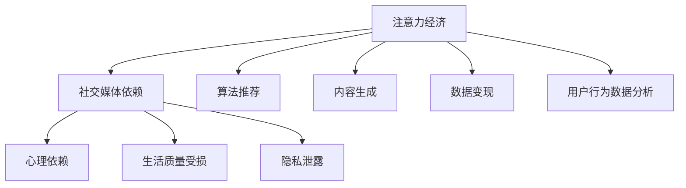

                 

# 注意力经济与社交媒体依赖：打破循环并重新获得控制

## 1. 背景介绍

### 1.1 问题由来
在数字化时代，社交媒体平台已成为人们获取信息、互动交流的重要工具。然而，社交媒体的商业化运作，使得其从单纯的信息传播工具，转变为一个全新的经济模式——注意力经济。用户注意力成为一种稀缺资源，平台通过吸引和集中用户注意力，实现广告、数据、流量的变现，形成了一个庞大的生态系统。

在这一过程中，用户对社交媒体的依赖程度逐渐加深，从日常沟通、娱乐、获取信息，到情感寄托、认同寻找、自我表达，社交媒体已成为现代人生活中不可或缺的一部分。但过度的依赖也可能带来负面影响，如信息过载、心理压力、隐私泄露等。

### 1.2 问题核心关键点
社交媒体依赖的核心问题在于注意力经济对用户行为的深刻影响。平台通过算法推荐、内容生成、用户行为数据分析等手段，不断优化用户体验，增加用户黏性，最终形成一种"需求-供给"的正反馈循环。而用户对社交媒体的依赖，则进一步加剧了这种循环，使用户难以自拔。

## 2. 核心概念与联系

### 2.1 核心概念概述

为更好地理解社交媒体依赖的机制和应对方法，本节将介绍几个关键概念：

- 注意力经济(Attention Economy)：通过集中和争夺用户的注意力，实现商业利益的经济模式。社交媒体平台是注意力经济的重要代表。

- 社交媒体依赖(Social Media Addiction)：用户对社交媒体产生心理依赖，频繁浏览和使用社交媒体，影响到生活质量和心理健康。

- 算法推荐(Algorithmic Recommendation)：通过大数据分析和机器学习算法，对用户行为进行建模，实现内容个性化推荐。

- 内容生成(Content Generation)：社交媒体平台自动生成或审核用户上传的内容，确保其符合平台规范和用户体验。

- 数据变现(Data Monetization)：社交媒体平台利用用户数据进行商业变现，如广告投放、精准营销等。

- 用户行为数据分析(User Behavior Analysis)：通过分析用户行为数据，预测用户需求和行为趋势，优化平台策略。

这些概念之间的逻辑关系可以通过以下Mermaid流程图来展示：



这个流程图展示了注意力经济对社交媒体依赖的形成机制，以及影响用户心理、生活质量、隐私等多个方面的作用。

## 3. 核心算法原理 & 具体操作步骤

### 3.1 算法原理概述

社交媒体依赖的核心算法原理，主要是基于用户行为数据分析的推荐算法和内容生成算法。这些算法通过分析用户的行为数据，预测其偏好和需求，从而实现个性化推荐，增加用户黏性。同时，通过内容生成和算法优化，不断吸引和集中用户注意力，形成循环依赖。

具体来说，社交媒体平台通过以下步骤实现用户注意力的吸引和集中：

1. 用户行为数据采集：通过API接口、SDK插件、页面追踪等手段，收集用户浏览、互动、评论等行为数据。

2. 数据预处理：对采集到的数据进行清洗、去重、归一化等预处理，转化为机器学习算法能够处理的数据格式。

3. 特征工程：根据预训练的深度学习模型或自定义规则，提取用户行为数据中的关键特征，如兴趣点、互动频次、时间分布等。

4. 用户画像构建：通过数据挖掘和机器学习算法，构建用户的行为画像，包括兴趣偏好、社交关系、情感倾向等。

5. 推荐算法优化：使用协同过滤、矩阵分解、深度学习等算法，对用户画像进行建模，实现个性化推荐。

6. 内容生成与优化：通过自然语言处理、图像处理、语音识别等技术，自动生成或审核用户上传的内容，确保其符合平台规范和用户体验。

7. 数据变现：利用用户数据进行商业变现，如广告投放、精准营销等，实现流量和收入的循环。

### 3.2 算法步骤详解

以下是基于用户行为数据分析的推荐算法和内容生成算法的详细步骤：

**Step 1: 数据采集**
- 使用SDK插件或API接口，实时采集用户的浏览记录、互动数据、评论内容等。
- 使用页面追踪技术，记录用户在页面上的停留时间、点击行为等。

**Step 2: 数据预处理**
- 对采集到的数据进行清洗，去除无关、重复、错误的数据。
- 进行数据归一化，将不同来源、不同格式的数据转化为统一的格式。

**Step 3: 特征提取**
- 使用自然语言处理技术，提取文本数据中的关键词、主题、情感等特征。
- 使用图像处理技术，提取图片中的关键元素、色彩、形状等特征。
- 使用时间序列分析，提取用户行为的时间分布特征，如活跃时间段、高峰时段等。

**Step 4: 用户画像构建**
- 使用协同过滤算法，分析用户历史行为数据，发现用户间的相似性。
- 使用矩阵分解算法，对用户行为数据进行降维，得到用户的基本兴趣特征。
- 使用深度学习模型，对用户行为数据进行建模，发现更深层次的兴趣偏好。

**Step 5: 推荐算法优化**
- 使用协同过滤算法，为用户生成个性化推荐列表。
- 使用深度学习模型，训练推荐系统，优化推荐算法，提高推荐的准确性。
- 使用对抗生成网络(Generative Adversarial Network, GAN)，生成与用户画像匹配的内容，增加推荐的多样性。

**Step 6: 内容生成与优化**
- 使用自然语言处理技术，自动生成描述性、娱乐性、知识性等不同类型的内容。
- 使用图像处理技术，自动生成图片、视频、图表等视觉内容。
- 使用语音识别技术，自动生成音频内容。
- 使用用户画像和行为数据，对内容进行个性化优化，提高用户满意度。

**Step 7: 数据变现**
- 利用用户行为数据，进行广告投放和精准营销，实现流量变现。
- 利用用户数据，进行数据分析和决策支持，优化平台策略。

### 3.3 算法优缺点

基于用户行为数据分析的推荐算法和内容生成算法具有以下优点：
1. 个性化推荐：通过深度学习模型，实现对用户行为的精准分析，提供个性化的推荐内容，满足用户多样化需求。
2. 高效运营：通过自动化内容生成和推荐算法，大幅提高平台运营效率，降低人工成本。
3. 用户黏性：个性化推荐和优质内容吸引，增加用户黏性，提高用户活跃度和留存率。
4. 商业价值：通过用户数据变现，实现流量和收入的循环，提升平台商业价值。

同时，这些算法也存在以下缺点：
1. 数据隐私：大量用户行为数据的采集和分析，可能导致用户隐私泄露和数据滥用。
2. 算法偏见：数据样本偏差和算法模型设计不当，可能导致推荐结果出现偏见和歧视。
3. 信息过载：过度推荐可能导致用户信息过载，影响用户体验和心理健康。
4. 平台依赖：用户对推荐内容的依赖，可能导致其失去主动探索新内容的能力。
5. 商业利益：过度追求商业利益，可能导致平台内容质量下降，用户体验受损。

### 3.4 算法应用领域

基于用户行为数据分析的推荐算法和内容生成算法，已经在社交媒体平台、电商平台、视频网站等多个领域得到了广泛应用，具体包括：

- 社交媒体平台：如微博、微信、Facebook等，通过个性化推荐，提升用户互动和留存率。
- 电商平台：如淘宝、京东、Amazon等，通过商品推荐，提升用户购买率和转化率。
- 视频网站：如YouTube、B站、爱奇艺等，通过内容推荐，提高用户观看时间和留存率。
- 音乐平台：如Spotify、QQ音乐等，通过音乐推荐，提升用户使用频率和满意度。
- 新闻媒体：如今日头条、网易新闻等，通过新闻推荐，提高用户阅读量和广告收入。

除了这些主要应用领域外，这些算法还广泛应用于在线教育、在线旅游、金融理财等多个行业，为平台带来更多的用户和收入。

## 4. 数学模型和公式 & 详细讲解  
### 4.1 数学模型构建

本节将使用数学语言对社交媒体依赖的推荐算法进行严格的刻画。

设社交媒体平台的推荐系统包含 $N$ 个用户和 $M$ 个内容，用户对内容的评分向量为 $U \in \mathbb{R}^M$，内容的热度向量为 $C \in \mathbb{R}^N$。设用户 $i$ 对内容 $j$ 的评分向量为 $u_i \in \mathbb{R}^M$，内容 $j$ 的热度向量为 $c_j \in \mathbb{R}^N$。推荐算法的目的，是通过用户行为数据 $U, C$ 预测用户对内容的评分向量 $U'$，使得用户 $i$ 对内容 $j$ 的评分 $u_i'$ 尽可能接近真实评分 $u_i$。

### 4.2 公式推导过程

推荐算法可以表示为以下矩阵乘法的形式：

$$
U' = \mathbf{P} \times U
$$

其中 $\mathbf{P} \in \mathbb{R}^{M \times M}$ 为推荐矩阵，$\mathbf{P} = P_{ij}$ 表示内容 $j$ 对内容 $i$ 的推荐强度，$\mathbf{U} \in \mathbb{R}^{N \times M}$ 为用户内容评分矩阵。

推荐矩阵 $\mathbf{P}$ 的计算可以基于多种算法，如协同过滤、矩阵分解、深度学习等。其中，协同过滤算法可以表示为：

$$
P_{ij} = \frac{\sum_{k=1}^{K} \alpha_k \times u_{ik} \times c_{kj}}{\sqrt{\sum_{k=1}^{K} (u_{ik}^2 + c_{kj}^2)}}
$$

其中 $K$ 为用户行为数据中的特征数量，$\alpha_k$ 为特征 $k$ 的权重，$u_{ik}$ 为用户对内容 $i$ 的行为数据特征，$c_{kj}$ 为内容 $j$ 的行为数据特征。

协同过滤算法通过计算用户对内容的行为数据特征的相似度，生成推荐矩阵 $\mathbf{P}$，进而实现个性化推荐。

### 4.3 案例分析与讲解

考虑一个简单的电商推荐系统，其中包含100个用户和1000个商品。用户对商品的评分向量 $U \in \mathbb{R}^{1000}$，商品的平均热度向量 $C \in \mathbb{R}^{100}$。

设用户 $i$ 对商品 $j$ 的真实评分向量为 $u_i \in \mathbb{R}^{1000}$，商品 $j$ 的平均热度向量为 $c_j \in \mathbb{R}^{100}$。使用协同过滤算法生成推荐矩阵 $\mathbf{P} \in \mathbb{R}^{1000 \times 1000}$，然后通过矩阵乘法计算出用户 $i$ 对商品 $j$ 的推荐评分向量 $u_i'$。

## 5. 项目实践：代码实例和详细解释说明
### 5.1 开发环境搭建

在进行社交媒体依赖的推荐算法实践前，我们需要准备好开发环境。以下是使用Python进行Scikit-learn开发的环境配置流程：

1. 安装Anaconda：从官网下载并安装Anaconda，用于创建独立的Python环境。

2. 创建并激活虚拟环境：
```bash
conda create -n recommendation-env python=3.8 
conda activate recommendation-env
```

3. 安装Scikit-learn：
```bash
conda install scikit-learn
```

4. 安装其他相关库：
```bash
pip install numpy pandas joblib sklearn
```

完成上述步骤后，即可在`recommendation-env`环境中开始推荐算法的实践。

### 5.2 源代码详细实现

下面我们以协同过滤算法为例，给出使用Scikit-learn对电商推荐系统进行推荐预测的Python代码实现。

首先，定义数据处理函数：

```python
import pandas as pd
from sklearn.metrics.pairwise import cosine_similarity

def load_data(file_path):
    data = pd.read_csv(file_path)
    return data

def preprocess_data(data):
    # 对数据进行预处理
    return data

def build_recommendation_matrix(data):
    # 构建用户行为数据矩阵
    return data

def compute_similarity_matrix(matrix):
    # 计算用户行为数据矩阵的相似度矩阵
    return matrix

def compute_recommendation_matrix(similarity_matrix, matrix):
    # 通过相似度矩阵计算推荐矩阵
    return similarity_matrix * matrix

def compute_recommendation_scores(similarity_matrix, matrix):
    # 通过相似度矩阵和推荐矩阵计算推荐评分向量
    return similarity_matrix * matrix

def compute_top_n_recommendations(data, similarity_matrix, matrix, n):
    # 根据推荐评分向量计算Top N推荐商品
    return data

# 加载数据
data = load_data('data.csv')

# 数据预处理
data = preprocess_data(data)

# 构建用户行为数据矩阵
matrix = build_recommendation_matrix(data)

# 计算相似度矩阵
similarity_matrix = compute_similarity_matrix(matrix)

# 计算推荐矩阵
recommendation_matrix = compute_recommendation_matrix(similarity_matrix, matrix)

# 计算推荐评分向量
scores = compute_recommendation_scores(similarity_matrix, matrix)

# 计算Top N推荐商品
recommendations = compute_top_n_recommendations(data, similarity_matrix, matrix, 10)
```

然后，定义推荐函数：

```python
from sklearn.metrics.pairwise import cosine_similarity
import numpy as np

def recommend(user_id, matrix, similarity_matrix, top_n):
    # 根据用户ID和推荐矩阵计算推荐评分向量
    user_row = matrix[user_id]
    similarity_row = similarity_matrix[user_id]
    
    # 计算用户对内容的评分向量
    scores = similarity_row * user_row
    
    # 对评分向量进行归一化
    scores = scores / np.linalg.norm(scores)
    
    # 根据评分向量计算Top N推荐商品
    top_indices = np.argsort(scores)[-top_n:]
    
    # 获取Top N推荐商品的ID和评分
    top_recommendations = np.array(matrix).T[top_indices]
    top_recommendations = top_recommendations.T
    
    return top_recommendations
```

最后，启动推荐过程：

```python
# 测试推荐函数
recommendations = recommend(user_id=1, matrix=matrix, similarity_matrix=similarity_matrix, top_n=10)
print(recommendations)
```

以上就是使用Scikit-learn对电商推荐系统进行推荐预测的完整代码实现。可以看到，Scikit-learn提供了丰富的推荐算法实现，可以方便地用于推荐系统开发。

### 5.3 代码解读与分析

让我们再详细解读一下关键代码的实现细节：

**load_data函数**：
- 加载用户行为数据，返回一个Pandas DataFrame对象。

**preprocess_data函数**：
- 对数据进行预处理，如缺失值填充、特征选择等。

**build_recommendation_matrix函数**：
- 构建用户行为数据矩阵，将其转换为NumPy数组，方便后续计算。

**compute_similarity_matrix函数**：
- 计算用户行为数据矩阵的相似度矩阵，使用余弦相似度作为相似度度量。

**compute_recommendation_matrix函数**：
- 通过相似度矩阵计算推荐矩阵，使用协同过滤算法。

**compute_recommendation_scores函数**：
- 通过相似度矩阵和推荐矩阵计算推荐评分向量。

**compute_top_n_recommendations函数**：
- 根据推荐评分向量计算Top N推荐商品。

**recommend函数**：
- 根据用户ID和推荐矩阵计算推荐评分向量，选择Top N推荐商品。

通过这些函数，可以构建完整的推荐系统流程，实现对用户个性化推荐。

## 6. 实际应用场景
### 6.1 社交媒体平台

社交媒体平台的推荐系统，通过个性化推荐，提高用户互动和留存率。例如，微博通过分析用户的历史浏览和互动数据，生成个性化的推荐内容，吸引用户点击和转发。Facebook则通过新闻推荐和好友推荐，增加用户活跃度和粘性。

### 6.2 电商平台

电商平台的推荐系统，通过商品推荐，提升用户购买率和转化率。例如，淘宝通过用户行为数据，推荐相关商品，增加用户下单概率。Amazon则通过推荐相似商品和搭配商品，提升用户购物体验和满意度。

### 6.3 视频网站

视频网站的推荐系统，通过内容推荐，提高用户观看时间和留存率。例如，YouTube通过分析用户的观看记录和互动数据，推荐相关视频，增加用户观看时间和广告收入。B站则通过推荐热门视频和相似视频，吸引用户观看和订阅。

### 6.4 音乐平台

音乐平台的推荐系统，通过音乐推荐，提升用户使用频率和满意度。例如，Spotify通过分析用户的听歌记录和互动数据，推荐相关音乐，增加用户听歌时间和满意度。QQ音乐则通过推荐热门歌曲和相似歌曲，吸引用户听歌和分享。

### 6.5 新闻媒体

新闻媒体的推荐系统，通过新闻推荐，提高用户阅读量和广告收入。例如，今日头条通过分析用户的阅读记录和互动数据，推荐相关新闻，增加用户阅读时间和广告收入。网易新闻则通过推荐热门新闻和相关新闻，吸引用户阅读和分享。

## 7. 工具和资源推荐
### 7.1 学习资源推荐

为了帮助开发者系统掌握社交媒体依赖的推荐算法理论基础和实践技巧，这里推荐一些优质的学习资源：

1. 《推荐系统实战》书籍：介绍推荐算法的基本概念和经典模型，适合初学者快速入门。

2. 《深度学习与推荐系统》课程：斯坦福大学开设的推荐系统课程，涵盖深度学习在推荐系统中的应用。

3. 《Python推荐系统实战》书籍：介绍Python实现推荐系统的方法和技巧，适合有一定编程基础的开发者。

4. Kaggle推荐系统竞赛：Kaggle平台提供的推荐系统竞赛，适合通过实战提升推荐算法能力。

5. GitHub推荐系统开源项目：GitHub平台上的推荐系统开源项目，可以学习多种推荐算法的实现细节。

通过对这些资源的学习实践，相信你一定能够快速掌握推荐算法的精髓，并用于解决实际的推荐问题。

### 7.2 开发工具推荐

高效的开发离不开优秀的工具支持。以下是几款用于推荐系统开发的常用工具：

1. Scikit-learn：基于Python的机器学习库，提供了多种推荐算法实现，适合快速开发和实验。

2. TensorFlow：Google主导开发的深度学习框架，适合大规模工程应用和分布式计算。

3. PyTorch：Facebook开发的深度学习框架，灵活高效，适合研究和新算法实验。

4. FastAPI：基于Python的Web框架，适合快速构建推荐系统API接口。

5. Apache Spark：Apache基金会推出的分布式计算框架，适合处理大规模数据集和计算任务。

6. ELK Stack：Elasticsearch、Logstash、Kibana的组合，适合实时处理和分析用户行为数据。

合理利用这些工具，可以显著提升推荐系统的开发效率，加快创新迭代的步伐。

### 7.3 相关论文推荐

社交媒体依赖的推荐算法研究源于学界的持续研究。以下是几篇奠基性的相关论文，推荐阅读：

1. The BellKor Algorithm: A Natural Extension of Logistic Regression to Ranking：介绍基于排序损失的推荐算法，用于电商推荐。

2. Implicit Collaborative Filtering Using Matrix Factorization Techniques：提出基于矩阵分解的协同过滤算法，用于社交媒体推荐。

3. Neural Collaborative Filtering：提出基于深度学习的协同过滤算法，用于推荐系统。

4. Deep Rank：提出基于深度学习的推荐算法，用于视频推荐。

5. Neural Tandem：提出基于深度学习和协同过滤的双塔模型，用于推荐系统。

6. Fast User Representation：提出基于深度学习的用户表示方法，用于推荐系统。

这些论文代表了大数据推荐算法的进展，通过学习这些前沿成果，可以帮助研究者把握学科前进方向，激发更多的创新灵感。

## 8. 总结：未来发展趋势与挑战

### 8.1 总结

本文对基于用户行为数据分析的社交媒体依赖推荐算法进行了全面系统的介绍。首先阐述了社交媒体依赖的背景和核心算法原理，明确了推荐算法在用户注意力经济中的重要作用。其次，从原理到实践，详细讲解了推荐算法的数学模型和关键步骤，给出了推荐系统开发的完整代码实例。同时，本文还广泛探讨了推荐算法在社交媒体平台、电商平台、视频网站等多个行业领域的应用前景，展示了推荐范式的巨大潜力。此外，本文精选了推荐算法的各类学习资源，力求为读者提供全方位的技术指引。

通过本文的系统梳理，可以看到，基于用户行为数据分析的推荐算法已经在各大平台得到广泛应用，极大地提升了用户体验和平台运营效率。未来，伴随推荐算法的持续演进，基于推荐算法的应用也将更加多样化，为更多行业带来变革性影响。

### 8.2 未来发展趋势

展望未来，社交媒体依赖的推荐算法将呈现以下几个发展趋势：

1. 个性化推荐提升：随着深度学习和大数据技术的发展，推荐算法的精度和多样性将进一步提升，为用户提供更精准、多样化的推荐内容。

2. 实时推荐系统：通过流式计算和实时数据处理技术，构建实时推荐系统，提升用户体验和满意度。

3. 多模态推荐：结合图像、语音、视频等多模态数据，实现更加全面、精准的推荐，提升用户体验和平台价值。

4. 推荐算法的解释性和可解释性：增强推荐算法的可解释性，让用户理解推荐结果的生成机制，提高用户信任和满意度。

5. 推荐系统的跨平台协同：将推荐系统应用于不同平台和设备，实现跨平台协同推荐，提高推荐效果和用户黏性。

6. 推荐系统的跨领域应用：将推荐系统应用于更多领域，如金融、医疗、教育等，提升各行业的运营效率和用户满意度。

以上趋势凸显了推荐算法的广阔前景。这些方向的探索发展，必将进一步提升推荐系统的性能和应用范围，为数字化时代的各行各业带来新的增长动力。

### 8.3 面临的挑战

尽管社交媒体依赖的推荐算法已经取得了瞩目成就，但在迈向更加智能化、普适化应用的过程中，它仍面临着诸多挑战：

1. 数据隐私：大量用户行为数据的采集和分析，可能导致用户隐私泄露和数据滥用。如何平衡用户隐私和平台利益，需要更多技术和管理手段。

2. 算法偏见：数据样本偏差和算法模型设计不当，可能导致推荐结果出现偏见和歧视。如何减少算法偏见，提升推荐公平性，需要更多的研究和实践。

3. 信息过载：过度推荐可能导致用户信息过载，影响用户体验和心理健康。如何优化推荐算法，控制推荐量，提高推荐质量，需要更多的研究和实践。

4. 平台依赖：用户对推荐内容的依赖，可能导致其失去主动探索新内容的能力。如何提高用户探索新内容的能力，需要更多的研究和实践。

5. 商业利益：过度追求商业利益，可能导致平台内容质量下降，用户体验受损。如何在商业利益和用户体验之间找到平衡，需要更多的研究和实践。

6. 数据质量：推荐系统依赖高质量的用户行为数据，如何确保数据质量和准确性，需要更多的研究和实践。

7. 模型可解释性：推荐系统需要解释推荐结果的生成机制，让用户理解推荐结果的依据。如何提高推荐算法的可解释性，需要更多的研究和实践。

这些挑战凸显了推荐算法在实际应用中需要不断优化和改进的方向。只有不断克服这些挑战，推荐算法才能更好地服务于用户，实现智能推荐的目标。

### 8.4 研究展望

面对社交媒体依赖的推荐算法所面临的种种挑战，未来的研究需要在以下几个方面寻求新的突破：

1. 探索更加精准的推荐算法：结合深度学习、知识图谱、因果推理等前沿技术，提高推荐算法的精度和多样性。

2. 研究推荐算法的可解释性：通过引入因果推断、符号推理等技术，增强推荐算法的可解释性，提高用户信任和满意度。

3. 优化推荐系统的用户参与度：通过用户反馈和行为数据，动态调整推荐策略，提升用户对推荐系统的参与度和满意度。

4. 结合社交网络分析：将推荐系统与社交网络分析技术结合，发现用户之间的社交关系和兴趣共性，提升推荐效果和用户黏性。

5. 引入跨领域推荐：将推荐系统应用于更多领域，如金融、医疗、教育等，提升各行业的运营效率和用户满意度。

6. 优化推荐系统的跨平台协同：将推荐系统应用于不同平台和设备，实现跨平台协同推荐，提高推荐效果和用户黏性。

7. 研究推荐算法的安全性：通过数据加密、隐私保护等手段，提高推荐系统的安全性，保护用户隐私和数据安全。

这些研究方向的探索，必将引领社交媒体依赖的推荐算法迈向更高的台阶，为构建智能推荐系统提供更全面、更高效的解决方案。面向未来，推荐算法还需要与其他人工智能技术进行更深入的融合，如自然语言处理、计算机视觉、语音识别等，多路径协同发力，共同推动推荐系统的进步。只有勇于创新、敢于突破，才能不断拓展推荐算法的边界，让智能推荐技术更好地造福人类社会。

## 9. 附录：常见问题与解答

**Q1：推荐系统是否适用于所有类型的平台？**

A: 推荐系统适用于几乎所有类型的平台，包括社交媒体、电商、视频、音乐、新闻媒体等。不同类型的平台，可以根据自身特点选择适合的推荐算法和策略。

**Q2：推荐系统如何处理新用户的冷启动问题？**

A: 新用户的冷启动问题，可以通过以下方法解决：
1. 使用默认推荐：为新用户提供默认推荐，如热门商品、热门新闻等。
2. 利用用户画像：根据新用户的历史行为数据，构建用户画像，提供个性化的默认推荐。
3. 引入算法预热：在新用户注册时，使用推荐算法进行预热，积累用户行为数据，逐步优化推荐策略。

**Q3：推荐系统如何避免信息过载？**

A: 推荐系统可以通过以下方法避免信息过载：
1. 动态调整推荐量：根据用户的行为数据和反馈，动态调整推荐内容的数量。
2. 引入多样性推荐：引入多样性推荐算法，减少重复推荐，增加推荐内容的多样性。
3. 使用推荐过滤器：根据用户偏好和历史行为，使用推荐过滤器，过滤掉不相关的内容。
4. 提供用户自由选择权：提供用户自由选择推荐内容的机会，让用户主动选择感兴趣的内容。

**Q4：推荐系统如何保证推荐公平性？**

A: 推荐系统可以通过以下方法保证推荐公平性：
1. 数据采集公平性：保证数据采集的公平性，避免数据偏差。
2. 算法设计公平性：使用公平性算法，避免算法偏见。
3. 结果公平性：引入公平性指标，评估推荐结果的公平性，调整推荐策略。

**Q5：推荐系统如何优化用户体验？**

A: 推荐系统可以通过以下方法优化用户体验：
1. 实时推荐：通过实时数据处理技术，构建实时推荐系统，提升用户体验。
2. 个性化推荐：结合用户历史行为数据，提供个性化的推荐内容，满足用户多样化需求。
3. 提供多样性推荐：引入多样性推荐算法，增加推荐内容的多样性，避免信息过载。
4. 提供用户自由选择权：提供用户自由选择推荐内容的机会，让用户主动选择感兴趣的内容。

---

作者：禅与计算机程序设计艺术 / Zen and the Art of Computer Programming

