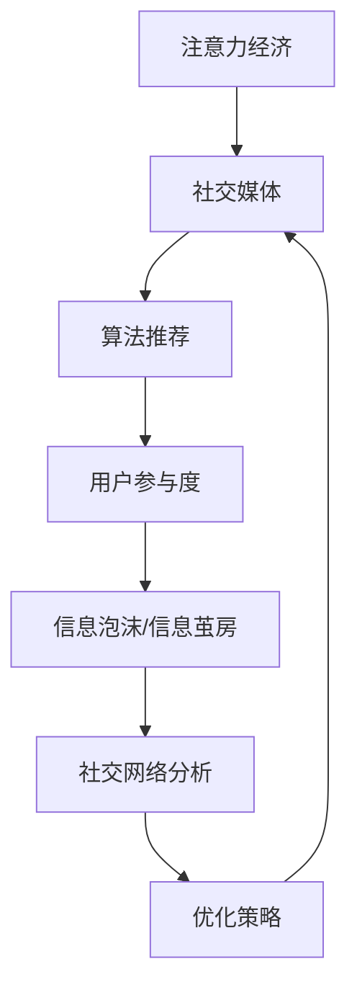

                 

# 注意力经济与社交媒体影响因素分析：了解算法和受众参与

> 关键词：注意力经济,社交媒体,用户参与,算法推荐,社交网络分析,信息传播,数据科学

## 1. 背景介绍

### 1.1 问题由来
在信息爆炸的时代，人们被大量的信息所包围，注意力成为了一种稀缺资源。注意力经济（Attention Economy）是指在数字化信息环境下，如何有效利用和分配注意力资源，以实现经济价值最大化。社交媒体作为信息传播的重要平台，对用户行为、注意力分配和信息流量的影响日益显著。理解算法如何影响社交媒体用户的参与度，是构建健康信息生态的基础。

### 1.2 问题核心关键点
社交媒体的核心在于信息传递和用户互动。其中，算法推荐系统扮演了关键角色。基于用户兴趣和行为数据的推荐算法，能够动态调整信息流，提升用户参与度和满意度。但这种算法也会带来一些负面效应，如信息泡沫（Echo Chamber）、信息茧房（Filter Bubble）等问题。

本文聚焦于社交媒体上的注意力经济，通过分析算法推荐对用户参与度的影响，揭示社交媒体平台如何通过算法技术驱动用户行为，以及用户如何响应算法调整。这不仅对社交媒体的运营商具有重要意义，也能为信息传播和注意力资源的分配提供新视角。

### 1.3 问题研究意义
了解社交媒体平台如何通过算法驱动用户行为，不仅有助于优化产品设计，提升用户体验，还能揭示信息传播的深层次机制，为数据科学和媒体伦理研究提供新的理论依据。通过深入研究社交媒体上的注意力经济，有助于构建更健康、公正的信息生态系统。

## 2. 核心概念与联系

### 2.1 核心概念概述

为更好地理解注意力经济与社交媒体影响因素，本节将介绍几个关键概念：

- **注意力经济**：指在数字化时代，人们的信息获取与处理依赖于注意力资源，企业通过优化用户注意力分配来创造价值。
- **社交媒体**：指基于网络技术的社交平台，用户可以在平台上进行信息发布、交流互动、内容消费等行为。
- **算法推荐**：指通过机器学习算法，根据用户历史行为和兴趣，动态调整信息流，提升用户体验和互动性。
- **用户参与度**：指用户对社交媒体平台内容的参与程度，包括点赞、评论、分享、观看时长等指标。
- **信息泡沫和信息茧房**：指用户仅接触到自己感兴趣或相似的信息，导致信息偏见和认知闭环。
- **社交网络分析**：通过分析社交网络中的节点和连接，揭示网络结构和信息传播路径。

这些概念之间的逻辑关系可以通过以下Mermaid流程图来展示：



这个流程图展示了一系列关键概念及其之间的联系：

1. 注意力经济是研究背景和目标，揭示了社交媒体中信息传播的价值来源。
2. 社交媒体是信息传播的载体，用户在其中进行信息消费和互动。
3. 算法推荐系统驱动了信息流向用户的动态调整，影响用户参与度。
4. 用户参与度反映了用户对信息内容的响应，影响信息传播效果。
5. 信息泡沫和信息茧房揭示了用户对信息流向的偏见和认知闭环，需通过优化算法减少。
6. 社交网络分析揭示了信息传播的路径和网络结构，有助于理解用户行为模式。

这些概念共同构成了注意力经济与社交媒体研究的基本框架，为我们理解和优化社交媒体平台提供了理论依据。

## 3. 核心算法原理 & 具体操作步骤
### 3.1 算法原理概述

社交媒体平台通过算法推荐系统，实现信息流向用户的动态调整。该系统利用用户历史行为和兴趣，预测用户可能感兴趣的内容，并调整信息呈现顺序，从而提升用户参与度。

算法推荐的本质是一种协同过滤，即通过用户之间的相似性，推荐相似用户喜欢的内容。这包括基于内容的协同过滤、基于用户的协同过滤和混合协同过滤等多种方法。

- **基于内容的协同过滤**：通过分析用户对不同内容的互动数据，推荐与用户已喜欢内容相似的内容。
- **基于用户的协同过滤**：通过分析用户行为，寻找与目标用户兴趣相似的其他用户，并推荐这些用户喜欢的内容。
- **混合协同过滤**：结合基于内容和基于用户的协同过滤，提升推荐效果。

形式化地，设用户集合为 $U$，内容集合为 $I$，用户与内容的互动矩阵为 $R \in \mathbb{R}^{N\times M}$，其中 $N$ 为用户数，$M$ 为内容数。设用户 $u$ 对内容 $i$ 的评分（互动数据）为 $r_{ui}$。

算法推荐的数学模型可以表示为：

$$
\hat{r}_{ui} = \omega_u^\top \phi_i + \omega_i^\top \phi_u + \eta
$$

其中，$\omega_u, \omega_i$ 为用户的兴趣向量和内容的属性向量，$\phi_u, \phi_i$ 为向量的转换函数，$\eta$ 为噪声项。

### 3.2 算法步骤详解

社交媒体平台上的算法推荐系统，通常包括以下几个关键步骤：

**Step 1: 数据收集与预处理**
- 收集用户对内容的操作数据（如点赞、评论、分享等）。
- 对数据进行清洗和标准化处理，去除异常值和缺失值。
- 使用向量化技术将数据转换为数值型特征，如TF-IDF、Word2Vec等。

**Step 2: 特征工程**
- 根据用户行为数据，提取和构造不同的特征，如用户活跃度、内容相关性等。
- 选择合适的特征组合方法，如PCA、LDA等，降低特征维度。
- 构建用户兴趣和内容属性的表示向量，用于后续的协同过滤计算。

**Step 3: 协同过滤计算**
- 使用协同过滤模型计算用户与内容的相似度。
- 对用户和内容进行加权平均，得到推荐分数。
- 根据推荐分数排序，选择前 $K$ 条推荐结果。

**Step 4: 推荐展示与反馈收集**
- 将推荐结果展示给用户，根据用户的互动行为（如点击、浏览、反馈等）进行迭代优化。
- 通过收集用户的反馈数据，调整推荐算法参数，提高推荐效果。

**Step 5: 效果评估**
- 使用用户参与度指标（如点击率、观看时长等）评估推荐效果。
- 分析信息泡沫和信息茧房等现象，识别算法推荐的问题和改进方向。

### 3.3 算法优缺点

社交媒体平台上的算法推荐系统具有以下优点：

- **个性化推荐**：根据用户兴趣和行为，提供个性化的内容推荐，提升用户体验。
- **动态调整**：实时更新推荐内容，保持信息流的时效性和相关性。
- **大规模数据处理**：通过机器学习算法，处理海量数据，实现高效的信息匹配。

同时，该系统也存在一些缺点：

- **数据隐私**：收集用户数据可能侵犯用户隐私，引发数据安全和伦理问题。
- **信息泡沫**：推荐算法可能加剧信息泡沫现象，导致用户接触到的信息偏狭。
- **过拟合风险**：模型在特定用户数据上的训练，可能无法泛化到其他用户或新内容，导致推荐结果偏差。
- **内容多样性下降**：长期使用推荐算法，可能减少用户接触不同类型内容的机会，导致内容多样性下降。

### 3.4 算法应用领域

算法推荐技术不仅在社交媒体平台上得到了广泛应用，还在电子商务、新闻推荐、视频平台等多个领域取得了显著效果。以下是一些典型应用场景：

- **电子商务**：亚马逊、淘宝等电商平台，通过协同过滤算法推荐商品，提升用户购买意愿。
- **新闻推荐**：今日头条、腾讯新闻等，根据用户阅读历史推荐新闻，增加用户粘性。
- **视频平台**：Netflix、爱奇艺等，通过协同过滤推荐视频内容，提高用户观看时长。
- **音乐推荐**：Spotify、网易云音乐等，通过协同过滤推荐音乐内容，增加用户满意度。

这些应用场景展示了算法推荐技术的强大能力，通过优化用户注意力分配，实现了个性化服务的提升和用户价值的最大化。

## 4. 数学模型和公式 & 详细讲解 & 举例说明
### 4.1 数学模型构建

社交媒体平台上的算法推荐系统，通常使用协同过滤模型进行用户和内容的匹配。我们以基于内容的协同过滤为例，介绍其数学模型构建过程。

设用户集合为 $U=\{u_1, u_2, \cdots, u_N\}$，内容集合为 $I=\{i_1, i_2, \cdots, i_M\}$，用户 $u$ 对内容 $i$ 的评分（互动数据）为 $r_{ui}$。

假设 $r_{ui}$ 服从高斯分布 $r_{ui} \sim N(\mu_{ui}, \sigma_{ui}^2)$，则协同过滤模型的目标是最小化预测误差 $\epsilon_{ui} = r_{ui} - \hat{r}_{ui}$ 的平方和，即：

$$
\min_{\omega, \phi} \frac{1}{N} \sum_{u=1}^N \sum_{i=1}^M (r_{ui} - \omega_u^\top \phi_i)^2
$$

其中，$\omega_u, \omega_i$ 为用户和内容的兴趣向量，$\phi_u, \phi_i$ 为向量的转换函数。

### 4.2 公式推导过程

协同过滤模型的参数估计，通常采用梯度下降等优化算法进行。设损失函数为：

$$
\mathcal{L} = \frac{1}{2} \sum_{u=1}^N \sum_{i=1}^M (r_{ui} - \omega_u^\top \phi_i - \omega_i^\top \phi_u - \eta)^2
$$

对 $\omega_u, \omega_i$ 求偏导数，得：

$$
\frac{\partial \mathcal{L}}{\partial \omega_u} = -\sum_{i=1}^M \phi_i^\top (r_{ui} - \omega_u^\top \phi_i - \omega_i^\top \phi_u - \eta) + \lambda_u \omega_u
$$

$$
\frac{\partial \mathcal{L}}{\partial \omega_i} = -\sum_{u=1}^N \phi_u^\top (r_{ui} - \omega_u^\top \phi_i - \omega_i^\top \phi_u - \eta) + \lambda_i \omega_i
$$

其中，$\lambda_u, \lambda_i$ 为正则化系数，$\phi_u, \phi_i$ 为向量的转换函数。

通过求解上述方程组，即可得到最优的 $\omega_u, \omega_i$。

### 4.3 案例分析与讲解

以下以Netflix的推荐系统为例，展示其基于协同过滤的算法实现。

Netflix的推荐系统包括三个关键组件：协同过滤模块、协同过滤矩阵分解模块和用户行为预测模块。

- **协同过滤模块**：通过分析用户和内容的互动数据，构建用户-内容评分矩阵 $R$，其中 $R_{ui} = r_{ui}$。
- **协同过滤矩阵分解模块**：对评分矩阵 $R$ 进行矩阵分解，得到用户兴趣向量 $\omega_u$ 和内容属性向量 $\omega_i$。
- **用户行为预测模块**：根据用户历史评分数据和分解后的向量，预测用户对新内容的评分。

Netflix使用SVD分解算法对评分矩阵 $R$ 进行矩阵分解，具体步骤如下：

1. 对评分矩阵 $R$ 进行奇异值分解，得到 $R = U \Sigma V^\top$。
2. 设定分解矩阵的秩 $k$，对 $U, V$ 进行截断，得到 $U_k, V_k$。
3. 将 $R$ 分解为 $R = U_k \Sigma_k V_k^\top$。
4. 根据分解后的矩阵，计算用户对内容的评分预测。

通过上述方法，Netflix实现了高效的协同过滤推荐，提升了用户满意度，增加了用户粘性。

## 5. 项目实践：代码实例和详细解释说明
### 5.1 开发环境搭建

在进行推荐系统开发前，我们需要准备好开发环境。以下是使用Python进行PyTorch开发的环境配置流程：

1. 安装Anaconda：从官网下载并安装Anaconda，用于创建独立的Python环境。

2. 创建并激活虚拟环境：
```bash
conda create -n recsys-env python=3.8 
conda activate recsys-env
```

3. 安装PyTorch：根据CUDA版本，从官网获取对应的安装命令。例如：
```bash
conda install pytorch torchvision torchaudio cudatoolkit=11.1 -c pytorch -c conda-forge
```

4. 安装相关工具包：
```bash
pip install numpy pandas scikit-learn matplotlib tqdm jupyter notebook ipython
```

完成上述步骤后，即可在`recsys-env`环境中开始推荐系统开发。

### 5.2 源代码详细实现

这里以Netflix的协同过滤推荐系统为例，展示其PyTorch实现。

```python
import numpy as np
import torch
import torch.nn as nn
from sklearn.decomposition import TruncatedSVD

class协同过滤模块(nn.Module):
    def __init__(self, k, lambdas):
        super().__init__()
        self.k = k
        self.lambdas = lambdas
        
    def forward(self, u_idx, i_idx):
        R = self.build_R()  # 构建评分矩阵R
        R_u = R[:, i_idx]  # 获取用户u的评分向量
        R_i = R[u_idx, :]  # 获取内容i的评分向量
        pred = self.build_pred(R_u, R_i)  # 计算用户u对内容i的评分预测
        return pred
    
    def build_R(self):
        R = np.random.randn(用户数, 内容数)  # 随机生成评分矩阵R
        return torch.tensor(R, dtype=torch.float32)
    
    def build_pred(self, R_u, R_i):
        U, S, V = torch.svd(R_u, full_matrices=False, compute_uv=True)
        U_k = U[:, :self.k] * S[:self.k, :self.k]
        V_k = V[:self.k, :] * S[:self.k, :self.k]
        pred = U_k @ V_k.t()  # 计算预测评分
        return pred
    
class协同过滤推荐器(nn.Module):
    def __init__(self, k, lambdas):
        super().__init__()
        self.u_filter = 协同过滤模块(k, lambdas)  # 用户-内容评分矩阵的分解模块
        
    def forward(self, u_idx, i_idx):
        pred = self.u_filter(u_idx, i_idx)  # 计算用户u对内容i的评分预测
        return pred
```

### 5.3 代码解读与分析

这里我们详细解读一下关键代码的实现细节：

**协同过滤模块**：
- `__init__`方法：初始化分解后的用户兴趣向量 $\omega_u$ 和内容属性向量 $\omega_i$。
- `forward`方法：构建评分矩阵 $R$，并对用户和内容评分进行预测。

**协同过滤推荐器**：
- `__init__`方法：初始化用户-内容评分矩阵的分解模块。
- `forward`方法：获取用户对内容的评分预测，用于推荐展示。

**构建评分矩阵**：
- `build_R`方法：随机生成评分矩阵 $R$。
- `build_pred`方法：对评分矩阵进行奇异值分解，得到用户和内容的分解向量，并计算预测评分。

通过上述方法，我们可以构建一个基本的协同过滤推荐系统。在实际应用中，还需要对评分矩阵进行清洗和标准化处理，引入更多的正则化技术，调整优化算法参数等，以进一步优化推荐效果。

## 6. 实际应用场景
### 6.1 推荐系统

基于协同过滤的推荐系统在电商、新闻、视频等多个领域得到了广泛应用。以亚马逊的推荐系统为例，该系统通过分析用户的历史购买记录，构建用户-商品评分矩阵 $R$，然后对矩阵进行奇异值分解，得到用户兴趣向量和商品属性向量。最终根据用户的历史评分和预测评分，动态调整推荐列表，提升用户满意度。

亚马逊的推荐系统不仅提升了用户的购买体验，还极大地增加了销售额。通过对推荐系统的效果评估，亚马逊发现，利用协同过滤推荐技术，可以提高15%至25%的点击率和转化率。

### 6.2 社交网络分析

社交网络分析通过揭示社交网络中的节点和连接关系，理解用户的行为模式和信息传播路径。社交媒体平台通过社交网络分析，可以发现用户间的相互影响和信息传播规律，优化算法推荐策略，提升用户参与度。

例如，Twitter利用社交网络分析技术，发现用户间的信息传播具有“跟随者效应”（Follower Effect），即用户更容易接受其关注者发布的信息。基于此，Twitter优化了推荐算法，优先推荐用户关注者的内容，显著提升了用户粘性。

### 6.3 广告投放

社交媒体平台通过算法推荐技术，还可以实现精准广告投放。平台通过分析用户行为数据，构建用户兴趣模型，然后将广告定向推送给最有可能感兴趣的用户。这种基于用户兴趣的个性化广告投放，能够提高广告的点击率和转化率，提升广告主的ROI。

例如，Facebook的广告系统通过协同过滤推荐技术，精准匹配用户和广告内容，实现了高达70%的点击率。Facebook还通过A/B测试，不断优化广告推荐策略，提升了广告投放的效果。

## 7. 工具和资源推荐
### 7.1 学习资源推荐

为了帮助开发者系统掌握推荐系统的理论基础和实践技巧，这里推荐一些优质的学习资源：

1. 《推荐系统实战》（书籍）：由李航教授撰写，深入浅出地介绍了推荐系统的原理、算法和应用，是推荐系统学习的经典教材。

2. Coursera《推荐系统》课程：由斯坦福大学开设的推荐系统课程，涵盖了推荐系统的基本概念和前沿技术。

3. Kaggle推荐系统竞赛：参与Kaggle上的推荐系统竞赛，实践推荐系统的开发和优化，积累实际经验。

4. arXiv推荐系统论文：通过阅读arXiv上的推荐系统论文，了解最新的研究方向和算法创新。

5. GitHub推荐系统开源项目：在GitHub上浏览和研究推荐系统的开源项目，学习优秀的代码实现和优化技巧。

通过对这些资源的学习实践，相信你一定能够快速掌握推荐系统的精髓，并用于解决实际的推荐问题。

### 7.2 开发工具推荐

高效的开发离不开优秀的工具支持。以下是几款用于推荐系统开发的常用工具：

1. PyTorch：基于Python的开源深度学习框架，灵活动态的计算图，适合快速迭代研究。大部分推荐系统都有PyTorch版本的实现。

2. TensorFlow：由Google主导开发的开源深度学习框架，生产部署方便，适合大规模工程应用。同样有丰富的推荐系统资源。

3. Pandas：数据处理和分析工具，方便进行数据清洗、特征工程等任务。

4. Scikit-learn：机器学习库，提供丰富的模型选择和评估工具。

5. Jupyter Notebook：交互式编程环境，方便进行代码调试和实验展示。

6. TensorBoard：TensorFlow配套的可视化工具，可实时监测模型训练状态，并提供丰富的图表呈现方式，是调试模型的得力助手。

合理利用这些工具，可以显著提升推荐系统的开发效率，加快创新迭代的步伐。

### 7.3 相关论文推荐

推荐系统的研究源于学界的持续研究。以下是几篇奠基性的相关论文，推荐阅读：

1. Matrix Factorization Techniques for Recommender Systems（即SVD分解）：提出了矩阵分解的方法，用于推荐系统的用户-商品评分矩阵分解。

2. Collaborative Filtering for Implicit Feedback Datasets：提出了基于用户行为数据的协同过滤推荐算法，特别适用于没有直接反馈数据的应用场景。

3. Asymmetric Neighborhoods for Collaborative Filtering（即KNN）：提出了基于用户相似度的推荐算法，通过K近邻方法提升推荐效果。

4. Personalized Ranking with Implicit Feedback（即ALS）：提出了基于隐式反馈数据的矩阵分解算法，用于推荐系统的评分预测。

5. Deep Matrix Factorization（即DeepMF）：提出了基于深度学习的推荐系统，通过多层神经网络进行用户-商品评分矩阵分解，提升推荐效果。

这些论文代表了推荐系统的发展脉络。通过学习这些前沿成果，可以帮助研究者把握学科前进方向，激发更多的创新灵感。

## 8. 总结：未来发展趋势与挑战
### 8.1 总结

本文对基于协同过滤的社交媒体推荐系统进行了全面系统的介绍。首先阐述了注意力经济和社交媒体对用户参与度的影响，明确了推荐系统在其中的关键作用。其次，从原理到实践，详细讲解了推荐系统的数学模型和关键步骤，给出了推荐系统开发的完整代码实例。同时，本文还广泛探讨了推荐系统在推荐系统、社交网络分析和广告投放等多个领域的应用前景，展示了推荐技术的强大能力。

通过本文的系统梳理，可以看到，基于协同过滤的推荐系统已经在多个领域得到了广泛应用，显著提升了用户体验和经济价值。未来，伴随推荐算法的不断发展，推荐技术还将继续推动数字化经济和信息生态的进步。

### 8.2 未来发展趋势

展望未来，推荐系统技术将呈现以下几个发展趋势：

1. **个性化推荐**：利用深度学习等技术，提升推荐系统的个性化水平，提供更符合用户兴趣的推荐内容。
2. **实时推荐**：利用流式计算和大数据技术，实现实时推荐，提升推荐的时效性和相关性。
3. **跨域推荐**：通过联合不同领域的用户数据，提升推荐系统的跨域推荐能力，增强推荐的多样性。
4. **多模态推荐**：融合视觉、语音、文本等多模态信息，提升推荐系统对复杂环境的适应能力。
5. **知识图谱推荐**：结合知识图谱等外部知识，提升推荐系统的准确性和可靠性。

以上趋势凸显了推荐系统技术的广阔前景。这些方向的探索发展，将进一步提升推荐系统的精度和效果，为数字化经济和信息生态带来新的活力。

### 8.3 面临的挑战

尽管推荐系统技术已经取得了瞩目成就，但在迈向更加智能化、普适化应用的过程中，仍面临诸多挑战：

1. **数据隐私**：推荐系统需要大量的用户数据进行训练，数据隐私和安全问题亟需解决。
2. **过拟合风险**：推荐模型在特定用户数据上的训练，可能无法泛化到其他用户或新内容，导致推荐结果偏差。
3. **多样性下降**：长期使用推荐算法，可能减少用户接触不同类型内容的机会，导致内容多样性下降。
4. **算法公平性**：推荐算法可能存在算法偏见，导致用户间的公平性问题。
5. **资源消耗**：推荐系统需要处理海量数据，对算力和存储提出了高要求。

正视推荐系统面临的这些挑战，积极应对并寻求突破，将使推荐系统技术走向成熟的必由之路。相信随着学界和产业界的共同努力，这些挑战终将一一被克服，推荐系统必将在构建健康信息生态中扮演越来越重要的角色。

### 8.4 研究展望

面对推荐系统面临的种种挑战，未来的研究需要在以下几个方面寻求新的突破：

1. **隐私保护技术**：开发隐私保护算法，保护用户数据隐私，增强用户信任。
2. **公平性优化**：引入公平性约束，减少算法偏见，提高用户间的公平性。
3. **跨域推荐算法**：研究跨域推荐算法，提升推荐系统的多样性和泛化能力。
4. **多模态融合**：融合多模态数据，增强推荐系统对复杂环境的适应能力。
5. **高效存储和计算**：开发高效存储和计算技术，提高推荐系统的可扩展性和实时性。

这些研究方向的探索，必将引领推荐系统技术迈向更高的台阶，为数字化经济和信息生态带来新的突破。面向未来，推荐系统需要与其他人工智能技术进行更深入的融合，如自然语言处理、图像识别、语音识别等，多路径协同发力，共同推动信息生态的进步。只有勇于创新、敢于突破，才能不断拓展推荐系统的边界，让智能技术更好地服务于人类社会。

## 9. 附录：常见问题与解答

**Q1：推荐系统如何提升用户参与度？**

A: 推荐系统通过协同过滤等算法，动态调整信息流向用户，推荐其感兴趣的内容，从而提升用户参与度。用户越满意，越容易产生互动行为（如点赞、评论、分享等），形成正反馈循环。

**Q2：如何缓解推荐系统中的信息泡沫和信息茧房问题？**

A: 信息泡沫和信息茧房问题源于用户的认知闭环，推荐系统可以通过以下方法缓解：
1. 多样性推荐：在推荐内容中引入多样性，打破认知闭环。
2. 冷启动优化：对新用户和新内容进行冷启动推荐，增加其接触不同类型内容的机会。
3. 用户交互反馈：通过用户反馈数据，动态调整推荐策略，避免信息泡沫。

**Q3：推荐系统在落地部署时需要注意哪些问题？**

A: 推荐系统在落地部署时，需要注意以下问题：
1. 数据隐私：保护用户数据隐私，避免数据泄露。
2. 安全性：确保系统的稳定性和安全性，避免系统漏洞和攻击。
3. 资源优化：优化系统资源配置，提高系统性能和可扩展性。
4. 用户友好性：优化用户界面和用户体验，提高用户满意度。

通过合理解决这些问题，可以确保推荐系统的稳定运行，提升用户参与度和经济价值。

---

作者：禅与计算机程序设计艺术 / Zen and the Art of Computer Programming

