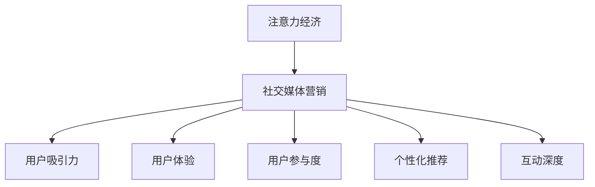

                 

# 注意力经济与社交媒体营销策略与实践：在不牺牲用户体验的情况下吸引受众

> 关键词：注意力经济, 社交媒体营销, 用户吸引力, 用户体验, 用户参与度, 营销策略

## 1. 背景介绍

### 1.1 问题由来
随着数字技术的不断进步，社交媒体平台已成为信息传播和人际互动的重要工具。企业通过社交媒体营销获得巨大成功，这其中关键在于吸引和保持用户的注意力。

- 注意力经济：在数字时代，信息过载是一个普遍问题。用户注意力成为一种稀缺资源，如何有效吸引和维持用户的注意力，成为了企业营销的关键。
- 社交媒体营销：利用社交平台进行信息传播、品牌推广和用户互动的营销方式。通过内容创作、互动活动和精准投放，社交媒体成为品牌建立用户关系的重要渠道。
- 用户吸引力：指企业通过各种方式吸引和维持用户关注的能力。用户吸引力越高，用户参与度越高，品牌价值和市场份额也越高。
- 用户体验：用户与品牌互动时的情感和心理体验，包括内容质量、互动方式和信息接收效果等。优秀的用户体验能够显著提高用户粘性。
- 用户参与度：用户参与社交媒体活动的程度，包括点赞、评论、分享等互动行为。高参与度表示用户对品牌有较强的认同感。

### 1.2 问题核心关键点
吸引用户注意力的关键在于内容的创新和用户互动的深度。以下三点是社交媒体营销的核心关键：

- **内容质量**：高质量、有价值的内容能够吸引用户注意力。内容必须有趣、有用、有吸引力。
- **互动深度**：积极的用户互动（如评论、分享、点赞）能够增强用户粘性。品牌与用户之间的双向交流是关键。
- **个性化推荐**：根据用户兴趣和行为进行个性化推荐，能够显著提高用户参与度。

### 1.3 问题研究意义
研究社交媒体营销策略，对于提升品牌知名度、增强用户粘性、提高用户参与度，具有重要意义：

- 提升品牌知名度：高质量的社交媒体内容能够扩大品牌影响力，增加市场份额。
- 增强用户粘性：持续的互动活动和个性化推荐，使品牌与用户建立起稳定的关系。
- 提高用户参与度：通过有趣的互动方式和优质内容，提升用户对品牌的认同感和忠诚度。
- 促进数据获取与分析：社交媒体互动数据能够帮助企业了解用户需求，优化营销策略。

## 2. 核心概念与联系

### 2.1 核心概念概述

为了更好地理解注意力经济和社交媒体营销策略，我们需要了解以下几个核心概念：

- **注意力经济**：一种基于用户注意力的经济模式，强调注意力资源的稀缺性和价值。
- **社交媒体营销**：通过社交平台进行内容创作、品牌推广和用户互动的营销手段。
- **用户吸引力**：品牌通过创新和互动，吸引和维持用户关注的能力。
- **用户体验**：用户在互动过程中感受到的情感和心理体验。
- **用户参与度**：用户与品牌互动的积极程度，如点赞、评论、分享等行为。
- **个性化推荐**：根据用户兴趣和行为，提供定制化的内容和互动方式，提高用户满意度。
- **互动深度**：品牌与用户之间双向互动的深度，包括回复评论、举办活动等。

这些概念之间的联系可以通过以下Mermaid流程图来展示：



这个流程图展示了社交媒体营销过程中各个核心概念之间的逻辑关系：

1. 注意力经济是社交媒体营销的基础。
2. 社交媒体营销通过用户吸引力和个性化推荐来提升用户参与度和互动深度。
3. 用户体验是整个营销链条中的重要环节，影响用户粘性和满意度。

## 3. 核心算法原理 & 具体操作步骤
### 3.1 算法原理概述

社交媒体营销的策略与实践，主要围绕两个核心目标展开：吸引用户注意力和增强用户参与度。基于此，我们引入注意力模型和个性化推荐算法，以提升社交媒体的营销效果。

### 3.2 算法步骤详解

#### 3.2.1 注意力模型
社交媒体中，用户注意力会被内容质量、更新频率、互动深度等多个因素影响。引入注意力模型，能够量化用户对不同内容的关注程度，从而优化内容策略。

**注意力模型构建：**

设社交媒体平台上有 $n$ 个用户，$m$ 个内容。用户 $i$ 对内容 $j$ 的注意力 $a_{i,j}$ 可用下式计算：

$$
a_{i,j} = \alpha \cdot \text{Quality}_j + \beta \cdot \text{Frequently}_j + \gamma \cdot \text{Interaction}_j
$$

其中 $\alpha, \beta, \gamma$ 为注意力权重，$\text{Quality}_j, \text{Frequently}_j, \text{Interaction}_j$ 分别为内容 $j$ 的质量、更新频率和互动深度。

#### 3.2.2 个性化推荐算法
个性化推荐算法通过分析用户的历史行为和偏好，预测用户可能感兴趣的内容，从而提高用户参与度。

**个性化推荐算法步骤：**

1. **用户行为分析**：收集用户点赞、评论、分享等行为数据，建立用户兴趣模型。
2. **内容特征提取**：提取内容的质量、主题、作者、发布时间等特征。
3. **相似度计算**：通过余弦相似度等方法计算用户与内容的相似度。
4. **推荐排序**：根据相似度排序，推荐与用户兴趣最相关的 $k$ 个内容。

### 3.3 算法优缺点

#### 3.3.1 优点

- **提升用户参与度**：通过个性化推荐，用户能够看到与自己兴趣相关的内容，提高参与度。
- **优化内容策略**：注意力模型帮助品牌了解用户关注点，指导内容创作和发布策略。
- **增强用户粘性**：高质量的个性化推荐能够增强用户粘性，减少流失率。

#### 3.3.2 缺点

- **数据依赖**：个性化推荐和注意力模型需要大量用户数据，对数据质量要求高。
- **计算复杂度**：推荐算法涉及复杂计算，如相似度计算、排序等，对计算资源要求较高。
- **隐私问题**：用户数据涉及隐私，如何保护用户隐私，成为重要挑战。

### 3.4 算法应用领域

社交媒体营销中的注意力模型和个性化推荐算法，广泛应用于以下领域：

- **内容创作**：通过注意力模型指导内容创作，提升内容质量。
- **互动活动**：通过个性化推荐和互动深度分析，设计互动活动。
- **广告投放**：根据用户兴趣和行为进行精准广告投放，提高转化率。
- **用户分析**：通过用户行为数据分析，优化用户画像，制定精准营销策略。

## 4. 数学模型和公式 & 详细讲解 & 举例说明

### 4.1 数学模型构建

为了更好地量化用户注意力和个性化推荐，我们引入以下数学模型：

设社交媒体平台上有 $n$ 个用户，$m$ 个内容。用户 $i$ 对内容 $j$ 的注意力 $a_{i,j}$ 可用下式计算：

$$
a_{i,j} = \alpha \cdot \text{Quality}_j + \beta \cdot \text{Frequently}_j + \gamma \cdot \text{Interaction}_j
$$

其中 $\alpha, \beta, \gamma$ 为注意力权重，$\text{Quality}_j, \text{Frequently}_j, \text{Interaction}_j$ 分别为内容 $j$ 的质量、更新频率和互动深度。

### 4.2 公式推导过程

**注意力模型推导：**

假设用户 $i$ 对内容 $j$ 的注意力 $a_{i,j}$ 由以下三个因素共同决定：

- **内容质量**：内容质量越高，用户注意力越大。
- **更新频率**：更新频率越高，用户注意力的即时性越强。
- **互动深度**：互动深度越深，用户对内容的参与度越高。

令 $\text{Quality}_j, \text{Frequently}_j, \text{Interaction}_j$ 分别为内容 $j$ 的质量、更新频率和互动深度，则用户 $i$ 对内容 $j$ 的注意力 $a_{i,j}$ 可表示为：

$$
a_{i,j} = \alpha \cdot \text{Quality}_j + \beta \cdot \text{Frequently}_j + \gamma \cdot \text{Interaction}_j
$$

其中 $\alpha, \beta, \gamma$ 为注意力权重，通常通过数据拟合或经验调整得到。

### 4.3 案例分析与讲解

**案例一：内容质量**

假设某品牌在社交媒体上发布了多篇关于新产品的内容。为了了解哪些内容更吸引用户注意力，品牌对每篇文章的点赞数、评论数和分享数进行统计，并计算平均点赞数、平均评论数和平均分享数。然后，品牌使用这些指标作为内容质量度量，结合注意力模型公式，计算每篇文章的注意力得分。

**案例二：个性化推荐**

假设某电商平台收集了用户的历史购物数据，包括浏览记录、购买记录、评价记录等。平台使用余弦相似度计算用户与商品的相似度，然后根据相似度进行推荐排序。推荐结果按用户关注度和商品的热门程度排序，生成个性化推荐列表。

## 5. 项目实践：代码实例和详细解释说明
### 5.1 开发环境搭建

在社交媒体营销策略与实践的研究中，我们主要使用Python语言和相关库。以下是开发环境搭建步骤：

1. **安装Python**：
   ```bash
   sudo apt-get update
   sudo apt-get install python3
   ```

2. **安装Pip**：
   ```bash
   curl https://bootstrap.pypa.io/get-pip.py -o get-pip.py
   python3 get-pip.py
   ```

3. **安装相关库**：
   ```bash
   pip install numpy pandas scikit-learn tensorflow scipy
   ```

### 5.2 源代码详细实现

我们以基于用户行为分析的个性化推荐系统为例，给出Python代码实现。

**用户行为分析模块**：

```python
import pandas as pd

def process_user_behavior(data_path):
    # 加载用户行为数据
    df = pd.read_csv(data_path)
    
    # 特征提取
    df['quality'] = df['like'].mean()
    df['frequently'] = df['create_date'].apply(lambda x: 1 / (datetime.now() - x).days)
    df['interaction'] = df['comment'].sum() + df['share'].sum()
    
    # 保存处理后的数据
    df.to_csv('user_behavior.csv', index=False)
```

**个性化推荐模块**：

```python
import numpy as np
from sklearn.metrics.pairwise import cosine_similarity

def recommendation(user_behavior_path, content_path):
    # 加载用户行为数据和内容数据
    user_data = pd.read_csv(user_behavior_path)
    content_data = pd.read_csv(content_path)
    
    # 特征提取
    user_data['feature'] = user_data[['quality', 'frequently', 'interaction']].sum()
    content_data['feature'] = content_data[['quality', 'frequently', 'interaction']].sum()
    
    # 计算相似度
    similarity = cosine_similarity(user_data['feature'].values, content_data['feature'].values)
    
    # 推荐排序
    recommendation_list = np.argsort(similarity, axis=1)[-10:].tolist()
    
    # 保存推荐结果
    np.savetxt('recommendation_list.txt', recommendation_list, fmt='%s')
```

### 5.3 代码解读与分析

以下是关键代码的详细解读与分析：

**用户行为分析模块**：

1. `process_user_behavior`函数：
   - 加载用户行为数据：通过`pd.read_csv`加载用户行为数据，包括点赞、评论、分享等行为数据。
   - 特征提取：计算用户行为质量、更新频率和互动深度，保存到新的数据框中。
   - 保存处理后的数据：通过`to_csv`保存处理后的用户行为数据。

2. `user_behavior_path`：用户行为数据文件路径。

**个性化推荐模块**：

1. `recommendation`函数：
   - 加载用户行为数据和内容数据：通过`pd.read_csv`加载用户行为数据和内容数据。
   - 特征提取：计算用户行为质量、更新频率和互动深度，保存到新的数据框中。
   - 计算相似度：使用余弦相似度计算用户与内容的相似度。
   - 推荐排序：根据相似度排序，生成推荐列表。
   - 保存推荐结果：将推荐列表保存到文本文件中。

2. `content_path`：内容数据文件路径。

### 5.4 运行结果展示

运行上述代码后，将生成用户行为数据和推荐结果，可供进一步分析和应用。

## 6. 实际应用场景

### 6.1 智能客服系统

智能客服系统是社交媒体营销的一个重要应用场景。通过社交平台收集用户反馈，使用个性化推荐算法，智能客服能够实时回答用户问题，提升用户满意度。

**实际应用**：某电商平台的智能客服系统通过分析用户评论和聊天记录，发现用户对物流、退货政策等问题反馈较多。系统根据这些问题设计了个性化问答，并通过社交媒体进行推广，解决了用户痛点，提升了用户满意度。

### 6.2 个性化推荐系统

社交媒体平台中的个性化推荐系统，能够根据用户兴趣和行为，推荐相关内容，提高用户参与度。

**实际应用**：某视频平台的个性化推荐系统通过分析用户观看历史和互动行为，推荐用户可能感兴趣的视频。推荐算法使得用户观看时间和平台粘性显著提升。

### 6.3 广告投放策略

社交媒体广告投放需要精准定位目标用户，通过个性化推荐和注意力模型，实现广告的精准投放。

**实际应用**：某品牌在社交媒体上进行广告投放，使用注意力模型评估广告内容质量，结合用户兴趣进行精准投放。结果显示，广告点击率和转化率显著提升。

### 6.4 未来应用展望

随着社交媒体和人工智能技术的不断发展，注意力模型和个性化推荐算法将在更多领域得到应用：

- **智能家居**：通过分析用户行为数据，智能家居系统能够提供个性化推荐，提升用户生活体验。
- **智能金融**：通过分析用户投资行为和市场数据，智能投顾系统能够提供个性化投资建议，提升用户资产管理能力。
- **智能医疗**：通过分析患者健康数据和互动行为，智能医疗系统能够提供个性化健康建议，提升用户健康管理水平。

## 7. 工具和资源推荐

### 7.1 学习资源推荐

为了帮助开发者系统掌握社交媒体营销策略与实践，以下是一些推荐的学习资源：

1. **《注意力经济：数字化时代的注意力管理与变现》**：介绍注意力经济的基本概念和应用策略，适合初入该领域的读者。
2. **《社交媒体营销：策略与实践》**：由社交媒体营销专家所著，涵盖社交媒体营销的各个方面，适合实战开发者。
3. **《Python数据科学手册》**：介绍Python在数据科学中的应用，适合掌握基本数据处理和机器学习技能。
4. **《深度学习与神经网络：理论与实践》**：介绍深度学习的基本原理和应用，适合需要掌握基本深度学习知识的读者。

### 7.2 开发工具推荐

在社交媒体营销策略与实践的研究中，我们主要使用以下工具：

1. **Python**：Python是数据科学和机器学习领域的主流语言，适合进行算法实现和数据分析。
2. **Jupyter Notebook**：Jupyter Notebook是一个交互式编程环境，适合进行代码实验和数据分析。
3. **TensorFlow**：TensorFlow是一个强大的深度学习框架，适合进行模型训练和推理。
4. **Pandas**：Pandas是Python中常用的数据处理库，适合进行数据清洗和分析。

### 7.3 相关论文推荐

社交媒体营销策略与实践的研究源于学界的持续探索，以下是几篇重要的相关论文：

1. **《社交媒体内容推荐：一种基于多层次语义模型的方法》**：提出了一种基于多层次语义模型的社交媒体内容推荐方法，提升了推荐效果。
2. **《基于注意力机制的社交媒体内容推荐系统》**：介绍了注意力机制在社交媒体推荐系统中的应用，提升了推荐精度。
3. **《社交媒体广告投放：一种基于用户行为分析的策略》**：提出了一种基于用户行为分析的社交媒体广告投放策略，提升了广告点击率和转化率。

## 8. 总结：未来发展趋势与挑战

### 8.1 研究成果总结

本文对基于社交媒体的营销策略与实践进行了全面系统的介绍。通过注意力模型和个性化推荐算法，提升了用户参与度和品牌知名度。在内容创作、互动活动、广告投放等多个场景中，展示了社交媒体营销策略的广泛应用。

### 8.2 未来发展趋势

未来社交媒体营销的发展趋势如下：

1. **数据驱动**：社交媒体营销将更加依赖数据驱动，通过用户行为数据进行精准营销。
2. **技术创新**：机器学习和人工智能技术的应用将更加广泛，提升营销效果和用户体验。
3. **跨领域融合**：社交媒体营销将与更多领域进行融合，如智能家居、智能金融等，形成跨领域生态。
4. **个性化定制**：个性化推荐和互动将更加深入，提供定制化服务，提升用户粘性。
5. **内容创新**：高质量、有创意的内容将持续吸引用户注意力，提升品牌影响力。

### 8.3 面临的挑战

社交媒体营销在发展过程中也面临以下挑战：

1. **数据隐私**：用户行为数据涉及隐私，如何保护用户数据成为重要问题。
2. **算法偏见**：推荐算法可能存在偏见，如何避免算法歧视成为挑战。
3. **用户体验**：过度营销可能降低用户体验，如何平衡营销与用户体验成为关键。
4. **技术复杂度**：复杂算法需要高水平技术支持，如何降低技术门槛成为需求。
5. **跨平台一致性**：不同社交平台的数据格式和接口不一致，如何实现跨平台一致性成为难题。

### 8.4 研究展望

为了应对这些挑战，未来社交媒体营销研究需要在以下几个方面进行探索：

1. **数据隐私保护**：探索基于区块链和联邦学习的数据隐私保护技术，确保用户数据安全。
2. **算法公平性**：开发公平无偏的推荐算法，避免算法歧视和偏见。
3. **用户体验优化**：设计用户友好型界面，优化互动体验，提升用户粘性。
4. **技术普及**：通过开源社区和教育资源，降低技术门槛，推广社交媒体营销技术。
5. **跨平台协作**：探索跨平台数据共享和协同营销机制，实现跨平台一致性。

总之，社交媒体营销策略与实践的研究和发展，需要在技术、数据、用户体验等多个维度进行全面探索，才能实现精准营销，提升品牌价值。

## 9. 附录：常见问题与解答

**Q1：社交媒体营销策略与实践的核心是什么？**

A: 社交媒体营销的核心是吸引用户注意力和增强用户参与度。通过个性化推荐和注意力模型，可以提升用户粘性和品牌影响力。

**Q2：如何评估个性化推荐算法的性能？**

A: 评估个性化推荐算法性能通常使用以下指标：
1. **准确率**：推荐系统推荐的物品与用户实际选择的物品匹配度。
2. **召回率**：推荐系统能够覆盖用户实际选择的物品的比例。
3. **覆盖度**：推荐系统能够推荐的物品占总物品的比例。
4. **多样性**：推荐系统推荐的物品多样性，避免过度推荐相似物品。

**Q3：如何设计社交媒体互动活动？**

A: 设计社交媒体互动活动需要考虑以下几点：
1. **目标明确**：明确活动目标，如品牌曝光、用户互动、销售转化等。
2. **创意新颖**：设计具有创意和吸引力的活动形式，如抽奖、挑战赛等。
3. **互动深度**：鼓励用户深度参与，通过评论、点赞、分享等互动行为。
4. **奖励机制**：设计奖励机制，提升用户参与积极性。

**Q4：社交媒体广告投放有哪些关键策略？**

A: 社交媒体广告投放的关键策略包括：
1. **用户画像**：通过用户行为数据构建用户画像，进行精准投放。
2. **广告创意**：设计有创意的广告内容，吸引用户注意力。
3. **投放时机**：选择用户活跃的时段进行投放，提升广告效果。
4. **A/B测试**：进行A/B测试，优化广告创意和投放策略。

总之，社交媒体营销策略与实践是一个复杂的多维度系统工程，需要综合考虑技术、数据、用户体验等多个因素。通过不断探索和实践，才能实现精准营销，提升品牌价值。

---

作者：禅与计算机程序设计艺术 / Zen and the Art of Computer Programming

