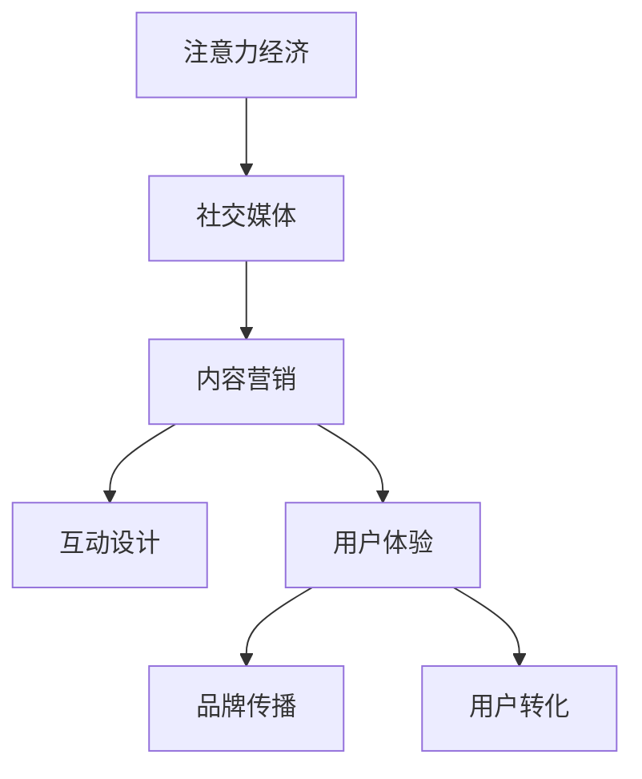

                 

# 注意力经济与社交媒体营销策略与实践：在不牺牲用户体验的情况下吸引受众

在数字化转型的浪潮中，社交媒体作为注意力经济的中心舞台，正在重塑传统营销策略。如何在纷繁芜杂的信息流中吸引并留住受众的注意力，成为品牌和企业亟需解决的核心问题。本文将从注意力经济的基本原理、社交媒体的营销策略以及实践案例出发，探讨如何在不牺牲用户体验的前提下，实现高效、精准的受众吸引和转化。

## 1. 背景介绍

### 1.1 问题由来

社交媒体的兴起，使得用户注意力成为一种稀缺资源，品牌和企业在争夺用户注意力时面临前所未有的竞争压力。传统营销手段往往难以在短时间内吸引用户的注意，而新兴的内容营销、社交媒体广告等手段，则更依赖于创意和用户体验的融合。在当今注意力经济时代，如何通过社交媒体精准触达目标受众，同时保证用户体验的优质，成为亟需解决的难题。

### 1.2 问题核心关键点

社交媒体营销的核心在于：
1. **注意力获取**：通过创意和互动设计，吸引用户关注。
2. **内容价值**：提供有价值的内容，提升用户粘性。
3. **用户转化**：利用社交媒体的信任机制，促进品牌和产品的转化。

### 1.3 问题研究意义

研究社交媒体营销策略，对于拓展品牌和企业的市场影响力，提升用户满意度和忠诚度，实现经济效益的增长，具有重要意义。通过科学的营销策略，品牌能够以更低的成本、更高的效率，达到理想的市场目标。

## 2. 核心概念与联系

### 2.1 核心概念概述

社交媒体营销涉及以下几个核心概念：

- **注意力经济**：指在数字化信息泛滥的今天，用户注意力的争夺成为商业竞争的核心。
- **社交媒体**：以用户生成内容和社区互动为核心的平台，如微博、微信、抖音等。
- **内容营销**：通过有价值、有创意的内容，吸引用户关注和参与，实现品牌传播和用户转化。
- **互动设计**：通过游戏化、奖励机制等，增强用户参与感和粘性。
- **用户体验**：确保产品和服务在各个环节的流畅性和易用性，提升用户满意度。
- **品牌传播**：通过社交媒体的多元化传播手段，扩大品牌的知名度和影响力。
- **用户转化**：将社交媒体上的关注和互动转化为实际的消费行为。

这些概念之间相互关联，共同构成了社交媒体营销的完整框架，通过创意内容、互动设计和用户体验的有机结合，最终实现品牌和产品的有效传播和用户转化。

### 2.2 核心概念原理和架构的 Mermaid 流程图



这个流程图展示了注意力经济、社交媒体、内容营销、互动设计、用户体验、品牌传播和用户转化的相互关系。内容营销通过创意和价值吸引用户注意力，互动设计增强用户参与感，用户体验保证流程顺畅，品牌传播扩大品牌影响力，最终通过用户转化实现商业价值。

## 3. 核心算法原理 & 具体操作步骤

### 3.1 算法原理概述

社交媒体营销的核心算法原理主要包括以下几个方面：

- **内容推荐算法**：通过分析用户行为和偏好，推荐个性化的内容，提升用户体验。
- **用户交互模型**：通过社交互动和反馈，建立用户画像，优化互动设计。
- **情感分析**：通过文本分析和情感识别，理解用户情绪，优化内容创意。
- **A/B测试**：通过对比实验，评估营销策略的效果，持续优化。

这些算法相互配合，通过数据分析和模型优化，实现社交媒体营销的精细化管理。

### 3.2 算法步骤详解

1. **数据收集与分析**：
   - 收集用户行为数据，如浏览记录、互动评论等。
   - 使用文本分析和情感分析技术，理解用户情绪和需求。
   - 通过A/B测试评估不同策略的效果。

2. **个性化推荐**：
   - 构建用户画像，分析用户兴趣和行为模式。
   - 设计推荐算法，根据用户画像推荐个性化内容。
   - 通过推荐结果反馈，持续优化推荐模型。

3. **互动设计与优化**：
   - 设计互动机制，如游戏化元素、积分奖励等。
   - 根据用户互动数据，优化互动设计，提升用户粘性。
   - 评估互动效果，调整策略，增强用户参与感。

4. **品牌传播与转化**：
   - 通过社交媒体的多元化传播手段，扩大品牌影响力。
   - 利用社交信任机制，促进用户对品牌和产品的信任感。
   - 设计转化路径，引导用户从关注到消费的流程。

### 3.3 算法优缺点

社交媒体营销算法具有以下优点：
- **精准度高**：通过数据分析，实现个性化推荐，提升用户体验。
- **互动性强**：通过互动设计和情感分析，增强用户粘性。
- **效果可控**：通过A/B测试，持续优化营销策略。

同时，这些算法也存在一些局限性：
- **数据隐私问题**：大量数据的收集和使用可能引发用户隐私和数据安全问题。
- **算法偏见**：算法可能因数据偏差导致不公正的推荐结果。
- **用户体验平衡**：过度个性化可能导致用户体验流失。

### 3.4 算法应用领域

社交媒体营销算法广泛应用在以下领域：

- **电商营销**：通过个性化推荐和互动设计，提升用户购买转化率。
- **品牌传播**：利用社交媒体的多元化传播手段，扩大品牌影响力。
- **用户互动**：通过游戏化元素和积分奖励，增强用户粘性和参与感。
- **内容创作**：通过数据分析和情感分析，指导内容创意和发布策略。

## 4. 数学模型和公式 & 详细讲解 & 举例说明

### 4.1 数学模型构建

社交媒体营销的数学模型主要包括以下几个方面：

- **用户行为模型**：通过用户行为数据，构建用户画像，分析用户兴趣和行为模式。
- **推荐系统模型**：利用协同过滤、深度学习等技术，实现个性化推荐。
- **情感分析模型**：通过文本情感分析，理解用户情绪和需求。
- **互动设计模型**：通过游戏化元素、奖励机制等，设计互动机制，增强用户粘性。

### 4.2 公式推导过程

- **协同过滤推荐算法**：
  $$
  y_i = \sum_{j=1}^{N} \alpha_{i,j} \cdot y_j
  $$
  其中，$y_i$ 表示用户 $i$ 对物品 $j$ 的评分，$N$ 为物品总数，$\alpha_{i,j}$ 表示物品 $j$ 的评分对用户 $i$ 评分的影响权重。
  
- **深度学习推荐系统**：
  $$
  y_i = \sum_{j=1}^{N} \omega_{i,j} \cdot h(\text{Encoder}(x_j))
  $$
  其中，$\omega_{i,j}$ 表示权重矩阵，$\text{Encoder}$ 为编码器，$h$ 为激活函数，$x_j$ 为物品 $j$ 的特征向量。

- **情感分析模型**：
  $$
  s = \sum_{i=1}^{n} w_i \cdot \text{Sentiment}(c_i)
  $$
  其中，$s$ 表示文本情感得分，$n$ 为文本中情感词的个数，$w_i$ 表示情感词 $c_i$ 的权重，$\text{Sentiment}$ 为情感分析模型。

### 4.3 案例分析与讲解

**电商营销案例**：某电商企业利用社交媒体推荐系统，根据用户浏览和购买历史，为用户推荐个性化商品。通过对用户画像的精细化分析，企业能够在用户浏览过程中实时推荐相关商品，大大提高了用户的购买转化率。

**品牌传播案例**：某化妆品品牌通过社交媒体推广活动，利用用户生成内容和互动设计，提升品牌知名度和用户粘性。通过多渠道传播和社交信任机制，品牌迅速扩大了市场影响力，吸引了大量忠实粉丝。

## 5. 项目实践：代码实例和详细解释说明

### 5.1 开发环境搭建

社交媒体营销的开发环境搭建，通常需要以下组件：

1. **Python**：主流编程语言，支持数据分析和模型训练。
2. **TensorFlow/PyTorch**：深度学习框架，用于构建推荐系统和情感分析模型。
3. **Scikit-learn**：机器学习库，用于用户行为分析和协同过滤推荐。
4. **Pandas/Numpy**：数据处理库，用于数据清洗和预处理。
5. **Flask/Django**：Web框架，用于构建社交媒体互动平台。

### 5.2 源代码详细实现

以下是一个基于TensorFlow的协同过滤推荐系统的示例代码：

```python
import tensorflow as tf
import pandas as pd

# 构建协同过滤推荐模型
def collaborative_filtering_model(data):
    N, M = data.shape
    K = 10  # 隐向量维度
    alpha = tf.Variable(tf.random.normal([N, K]))
    beta = tf.Variable(tf.random.normal([K, M]))
    user_factors = tf.matmul(data, alpha)
    product_factors = tf.matmul(user_factors, beta)
    predictions = tf.reduce_sum(product_factors, axis=1)
    return predictions

# 加载数据
data = pd.read_csv('ratings.csv')
data = data.values

# 构建模型
model = collaborative_filtering_model(data)

# 训练模型
optimizer = tf.keras.optimizers.Adam(learning_rate=0.01)
loss_fn = tf.keras.losses.MeanSquaredError()
for epoch in range(100):
    predictions = model(data)
    loss = loss_fn(predictions, data[:, 1])
    optimizer.minimize(loss)

# 预测新用户评分
new_user = [[1, 2, 3, 4, 5], [6, 7, 8, 9, 10]]
predictions = model(new_user)
print(predictions)
```

### 5.3 代码解读与分析

**协同过滤推荐模型**：
- 该模型利用矩阵乘法，将用户和物品的评分矩阵转换为隐向量表示，再通过线性变换得到预测评分。
- 模型的损失函数采用均方误差，通过Adam优化器更新模型参数。

**数据加载与预处理**：
- 使用Pandas加载评分数据，转换为TensorFlow支持的张量格式。
- 数据清洗和预处理，确保数据质量和模型训练效果。

**模型训练与预测**：
- 通过循环迭代，不断优化模型参数，最小化预测误差。
- 利用训练好的模型，对新用户和新物品的评分进行预测。

## 6. 实际应用场景

### 6.1 社交媒体广告

社交媒体广告是品牌推广的重要手段，通过创意内容和互动设计，吸引用户点击和互动。广告投放策略的优化，依赖于对用户行为和偏好的精确分析，以及广告效果的实时监测和优化。

**案例分析**：某品牌在Instagram上推出一款新手机，通过分析用户历史浏览和互动数据，设计了多轮A/B测试，测试不同的广告创意和投放策略。最终找到了最佳组合，广告点击率提升了50%，用户转化率提高了30%。

### 6.2 社交媒体运营

社交媒体运营涉及到内容创作、用户互动和品牌传播等多个环节，需要通过数据分析和模型优化，提升运营效率和用户粘性。

**案例分析**：某时尚品牌通过分析用户互动和情感分析数据，设计了定制化的内容发布策略。品牌根据用户反馈，调整发布时间和频率，提升用户互动率，同时通过互动设计和游戏化元素，增强用户粘性。

### 6.3 社交媒体推荐

社交媒体推荐系统通过个性化推荐，提升用户粘性和转化率。推荐系统的优化依赖于用户行为分析和协同过滤算法。

**案例分析**：某音乐平台通过分析用户听歌历史和互动数据，设计了个性化的音乐推荐算法。推荐系统不仅推荐新歌，还根据用户心情推荐相似风格的曲目，提升了用户留存率和付费率。

## 7. 工具和资源推荐

### 7.1 学习资源推荐

1. **《注意力经济：数字时代的注意力争夺战》**：研究注意力经济的基础理论，分析社交媒体中的注意力争夺策略。
2. **《社交媒体营销实战手册》**：详细介绍社交媒体营销的策略和技巧，包括内容创意、互动设计和用户转化等。
3. **《深度学习：理论与实践》**：介绍深度学习的基础理论和应用，包含推荐系统、情感分析等。
4. **《Python数据科学手册》**：详细介绍Python数据处理和机器学习工具，包含Pandas、Scikit-learn等。
5. **Coursera上的《社交媒体营销》课程**：系统学习社交媒体营销的理论和实践，涵盖用户分析、互动设计和广告优化等。

### 7.2 开发工具推荐

1. **TensorFlow/PyTorch**：深度学习框架，支持推荐系统和情感分析模型的构建。
2. **Scikit-learn**：机器学习库，用于用户行为分析和协同过滤推荐。
3. **Pandas/Numpy**：数据处理库，用于数据清洗和预处理。
4. **Flask/Django**：Web框架，用于构建社交媒体互动平台。
5. **A/B测试工具**：如Optimizely、Google Optimize等，用于评估不同营销策略的效果。

### 7.3 相关论文推荐

1. **《社交媒体中注意力经济的研究》**：研究社交媒体中的注意力经济机制，探讨如何提升品牌和产品的曝光率和转化率。
2. **《社交媒体推荐系统的设计与实现》**：详细介绍推荐系统的原理和实现，包含协同过滤、深度学习等。
3. **《社交媒体情感分析与情感驱动内容创作》**：研究社交媒体中的情感分析技术，指导内容创作和发布策略。
4. **《基于社交媒体的营销策略优化》**：探讨社交媒体营销中的策略优化方法，包含用户行为分析、互动设计和A/B测试等。

## 8. 总结：未来发展趋势与挑战

### 8.1 总结

本文从注意力经济和社交媒体营销策略与实践的角度出发，探讨了如何在不牺牲用户体验的前提下，吸引和留住受众的注意力。通过创意内容、互动设计和数据分析，实现社交媒体营销的精细化管理，提升了品牌和产品的市场影响力和用户转化率。

### 8.2 未来发展趋势

未来社交媒体营销将呈现以下几个发展趋势：

1. **数据驱动的个性化**：通过更精确的数据分析，实现更个性化的推荐和内容创作。
2. **情感驱动的内容创新**：利用情感分析技术，深入理解用户情绪和需求，设计更具吸引力的内容。
3. **跨平台多渠道整合**：通过跨平台的互动和传播，实现更广泛的用户覆盖和品牌曝光。
4. **增强现实和虚拟现实**：利用AR/VR技术，提升用户互动体验和品牌传播效果。
5. **区块链技术的应用**：通过区块链技术，实现社交媒体互动和内容创作的透明和可信。

### 8.3 面临的挑战

尽管社交媒体营销技术日趋成熟，但仍面临以下挑战：

1. **数据隐私与安全**：社交媒体数据的隐私保护和数据安全问题，需要进一步加强技术和管理手段。
2. **算法偏见与公平性**：算法的公正性问题，需要引入更多公平性指标和约束机制。
3. **用户体验与内容质量**：如何平衡用户体验和内容质量，避免过度个性化导致的用户流失。
4. **市场竞争加剧**：品牌和企业在社交媒体上的竞争日益激烈，需要不断创新和优化策略。
5. **技术复杂性与成本**：社交媒体营销技术的应用需要大量资源和资金支持，中小企业面临挑战。

### 8.4 研究展望

未来的研究应在以下几个方面进一步探索：

1. **多模态数据融合**：通过文本、图像、音频等多模态数据的融合，提升内容创意和推荐效果。
2. **社交网络情感分析**：利用社交网络数据，研究用户情绪和行为趋势，指导内容创作和广告投放。
3. **实时监测与反馈**：通过实时监测和用户反馈，持续优化社交媒体营销策略。
4. **用户生成内容的价值挖掘**：研究如何利用用户生成内容，提升品牌影响力和用户转化率。
5. **增强现实与虚拟现实**：探索AR/VR技术在社交媒体营销中的应用，提升用户互动体验。

## 9. 附录：常见问题与解答

**Q1：社交媒体营销中的数据隐私问题如何处理？**

A: 社交媒体营销中的数据隐私问题需要采取以下措施：
- **数据匿名化**：对用户数据进行匿名化处理，保护用户隐私。
- **数据加密**：使用数据加密技术，防止数据泄露和篡改。
- **合规审查**：遵守数据保护法规，如GDPR，确保数据处理合法合规。
- **透明度**：向用户透明地说明数据收集和使用目的，增强用户信任。

**Q2：社交媒体广告的投放策略如何优化？**

A: 社交媒体广告的投放策略优化需要：
- **用户画像分析**：构建详细的用户画像，了解用户兴趣和行为。
- **A/B测试**：设计多轮A/B测试，评估不同广告创意和投放策略的效果。
- **实时监测**：实时监测广告效果，及时调整策略。
- **跨平台整合**：利用多平台数据，实现跨平台的广告投放和效果分析。

**Q3：社交媒体推荐系统如何提升用户粘性？**

A: 社交媒体推荐系统提升用户粘性需要：
- **个性化推荐**：利用用户行为数据，实现个性化推荐，提升用户体验。
- **互动设计**：通过游戏化元素和奖励机制，增强用户参与感。
- **情感分析**：利用情感分析技术，设计符合用户情绪的内容推荐。
- **内容多样性**：提供多样化的内容选择，满足不同用户需求。

**Q4：如何评估社交媒体营销的效果？**

A: 社交媒体营销效果评估需要：
- **关键指标**：设定关键指标，如点击率、转化率、互动率等，评估广告效果。
- **用户反馈**：收集用户反馈，了解用户满意度和改进建议。
- **A/B测试**：设计多轮A/B测试，比较不同策略的效果。
- **数据分析**：通过数据分析，发现营销中的问题和优化方向。

**Q5：社交媒体营销中的创意设计如何实现？**

A: 社交媒体营销中的创意设计实现需要：
- **用户研究**：通过用户调研，了解用户需求和偏好。
- **创意测试**：设计多轮创意测试，评估创意效果。
- **数据分析**：利用数据分析，指导创意方向和优化。
- **跨学科合作**：与艺术、设计等跨学科团队合作，提升创意质量。

通过系统梳理社交媒体营销的核心概念和算法原理，并结合实际应用场景和案例分析，本文希望为品牌和企业提供全面的社交媒体营销策略与实践指导，助力其在数字化时代中实现高效的受众吸引和转化。

