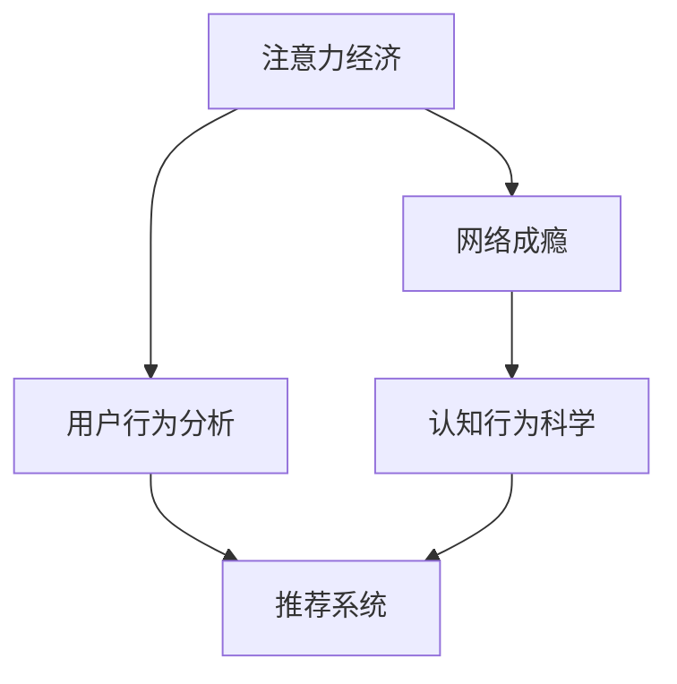

                 

# 注意力经济与网络成瘾的关联

> 关键词：注意力经济, 网络成瘾, 人工智能, 深度学习, 认知行为, 行为分析

## 1. 背景介绍

### 1.1 问题由来

随着互联网的迅速普及和移动设备的广泛使用，注意力经济（Attention Economy）这一概念逐渐受到学界和业界的关注。注意力经济的核心是争夺用户的注意力，以获取经济价值和社会影响力。在信息爆炸的时代，如何高效获取和利用用户的注意力，成为了各大平台和品牌竞争的焦点。

与此同时，网络成瘾问题也引起了社会的广泛关注。互联网和移动设备的使用已经成为青少年和成人的生活必需品，但长时间沉迷于网络也带来了诸多心理和生理问题，影响其健康和学习生活。网络成瘾不仅是一个医学问题，更是一个复杂的社会现象。

注意力经济与网络成瘾之间存在着千丝万缕的联系。一方面，网络成瘾者更容易被各种网络内容吸引，进而投入大量时间；另一方面，为了提高用户黏性，平台和应用通常采用各种手段争夺用户的注意力，有时甚至牺牲用户健康。两者之间的关联如何分析，如何制定有效对策，成为了当前研究的热点问题。

### 1.2 问题核心关键点

注意力经济与网络成瘾的关联主要体现在以下几个方面：

- 注意力争夺机制：互联网平台通过算法推荐、广告推送、互动奖励等方式，争夺用户注意力，吸引用户停留时间。
- 心理和生理影响：长时间接触网络内容，尤其是社交媒体、游戏等高刺激度内容，对用户心理健康和行为模式造成影响，甚至引发成瘾。
- 行为模式分析：通过对用户行为数据的分析，可以揭示其注意力分布和行为规律，为制定干预措施提供数据支持。
- 技术干预手段：利用人工智能和大数据技术，可以对用户行为进行实时监控和预测，提供个性化干预方案，减少成瘾风险。

## 2. 核心概念与联系

### 2.1 核心概念概述

为更好地理解注意力经济与网络成瘾的关联，本节将介绍几个密切相关的核心概念：

- 注意力经济（Attention Economy）：通过争夺用户的注意力，创造出商业价值和社会影响力的经济模式。
- 网络成瘾（Internet Addiction）：指个体对互联网或相关电子设备过度依赖，导致难以脱离，影响日常生活、学习和工作的一种行为障碍。
- 用户行为分析（User Behavior Analysis）：通过数据分析和建模，理解用户行为模式，预测其行为趋势，以优化用户体验和提升业务价值。
- 推荐系统（Recommendation System）：基于用户历史行为数据，预测其未来需求，并为其推荐相关内容的技术系统。
- 认知行为科学（Cognitive Behavioral Science）：研究人类认知过程和行为习惯，以期制定有效的干预措施。

这些核心概念之间的逻辑关系可以通过以下Mermaid流程图来展示：



这个流程图展示了注意力经济与网络成瘾之间的核心联系：

1. 注意力经济通过用户行为分析，优化推荐系统，争夺用户注意力。
2. 网络成瘾对用户行为产生影响，需要通过认知行为科学制定干预策略。
3. 认知行为科学和推荐系统结合，可以提供个性化干预措施，减少成瘾风险。

## 3. 核心算法原理 & 具体操作步骤
### 3.1 算法原理概述

注意力经济与网络成瘾的关联分析，主要依赖于对用户行为数据的分析和建模。核心算法原理如下：

1. **用户行为分析**：通过记录和分析用户在网络平台上的行为数据，如点击次数、浏览时长、互动频率等，构建用户行为特征向量。
2. **推荐系统算法**：利用机器学习模型（如协同过滤、深度学习等），预测用户对不同内容的偏好，并为其推荐相关内容，从而延长用户停留时间。
3. **注意力争夺机制**：通过算法设计，优化推荐系统策略，最大化争夺用户注意力。
4. **成瘾预测模型**：结合认知行为科学理论，构建预测模型，分析用户成瘾风险，提供个性化干预措施。

这些算法原理共同构成了注意力经济与网络成瘾关联分析的框架，有助于理解用户行为模式和制定有效干预策略。

### 3.2 算法步骤详解

基于上述算法原理，注意力经济与网络成瘾关联分析的主要步骤包括：

**Step 1: 数据收集与预处理**

- 收集用户行为数据，如点击次数、浏览时长、互动频率等。
- 对数据进行清洗和预处理，去除异常值和噪声。
- 构建用户行为特征向量，如兴趣偏好、活跃时间等。

**Step 2: 推荐系统设计**

- 设计推荐系统算法，如协同过滤、矩阵分解、深度学习等。
- 训练模型，预测用户对不同内容的偏好。
- 结合用户行为特征向量，设计推荐策略，优化推荐系统。

**Step 3: 注意力争夺机制优化**

- 分析用户注意力分布，识别高吸引力内容。
- 通过A/B测试等方法，优化推荐策略，最大化争夺用户注意力。
- 引入对抗性机制，防止用户流失，提高用户黏性。

**Step 4: 成瘾风险预测**

- 结合认知行为科学理论，构建成瘾预测模型。
- 输入用户行为特征向量，预测其成瘾风险。
- 根据预测结果，提供个性化干预措施，减少成瘾风险。

**Step 5: 模型评估与迭代**

- 通过实验和A/B测试，评估推荐系统效果和成瘾预测模型精度。
- 根据评估结果，调整推荐策略和成瘾预测模型参数。
- 迭代优化，提升系统效果和用户满意度。

### 3.3 算法优缺点

注意力经济与网络成瘾关联分析的算法具有以下优点：

- 用户行为分析可以揭示用户兴趣和行为规律，优化推荐系统。
- 推荐系统可以最大化争夺用户注意力，提高用户黏性。
- 成瘾预测模型可以早期发现用户成瘾风险，提供个性化干预。

同时，该算法也存在一些局限性：

- 数据隐私问题：用户行为数据涉及隐私，收集和分析需严格遵守数据保护法律法规。
- 数据质量问题：用户行为数据可能存在不完整或异常，影响分析结果。
- 算法复杂性：推荐系统和成瘾预测模型设计复杂，需要丰富的数据和算法知识。
- 干预效果问题：成瘾干预措施的效果需结合用户反馈和行为数据进行评估，可能存在滞后性和不稳定性。

尽管存在这些局限性，但就目前而言，这种基于数据驱动的关联分析方法，仍然是理解注意力经济与网络成瘾关系的重要手段。未来相关研究的重点在于如何进一步提高数据隐私保护水平，优化算法设计，提高成瘾预测模型精度和干预效果。

### 3.4 算法应用领域

注意力经济与网络成瘾关联分析方法，在多个领域得到了广泛应用，例如：

- 电子商务：通过推荐系统提高用户购买转化率，最大化经济效益。
- 媒体平台：优化内容推荐策略，吸引用户长时间停留，提高广告价值。
- 社交网络：识别高活跃度用户，提供个性化互动和奖励，增强用户黏性。
- 健康医疗：分析网络成瘾行为，制定干预策略，辅助心理干预和治疗。
- 教育培训：通过用户行为分析，提供个性化学习内容，提升学习效果。

除了上述这些经典应用外，注意力经济与网络成瘾关联分析方法还在更多场景中得到应用，如智能家居、智慧城市等，为提升用户体验和提高业务价值提供了新的思路。

## 4. 数学模型和公式 & 详细讲解 & 举例说明
### 4.1 数学模型构建

本节将使用数学语言对注意力经济与网络成瘾关联分析的过程进行更加严格的刻画。

记用户行为数据集为 $D=\{(x_i,y_i)\}_{i=1}^N$，其中 $x_i$ 为行为特征向量，$y_i$ 为行为标签（如点击次数、浏览时长等）。定义用户行为分析模型为 $F(x_i)=\hat{y}_i$，其中 $\hat{y}_i$ 为预测的标签值。

推荐系统模型为 $R(x_i)=\hat{y}_i^r$，其中 $\hat{y}_i^r$ 为推荐内容的标签值。成瘾预测模型为 $A(x_i)=\hat{y}_i^a$，其中 $\hat{y}_i^a$ 为成瘾风险评分。

### 4.2 公式推导过程

假设用户行为数据集 $D=\{(x_i,y_i)\}_{i=1}^N$ 中的行为特征向量 $x_i$ 为 $d$ 维，即 $x_i \in \mathbb{R}^d$。用户行为分析模型 $F(x_i)$ 为线性回归模型，其形式为：

$$
F(x_i) = W^TF(x_i) + b^T
$$

其中 $W^T \in \mathbb{R}^{d\times k}$ 为权重矩阵，$b^T \in \mathbb{R}^k$ 为偏置向量，$k$ 为模型的维度。

推荐系统模型 $R(x_i)$ 为深度神经网络模型，其形式为：

$$
R(x_i) = f(W^2F(x_i) + b^2)
$$

其中 $f$ 为激活函数，$W^2 \in \mathbb{R}^{k\times h}$ 为权重矩阵，$b^2 \in \mathbb{R}^h$ 为偏置向量，$h$ 为隐藏层维度。

成瘾预测模型 $A(x_i)$ 为逻辑回归模型，其形式为：

$$
A(x_i) = g(W^3F(x_i) + b^3)
$$

其中 $g$ 为逻辑函数，$W^3 \in \mathbb{R}^{k\times m}$ 为权重矩阵，$b^3 \in \mathbb{R}^m$ 为偏置向量，$m$ 为输出维度。

### 4.3 案例分析与讲解

以某电商平台的推荐系统为例，分析其如何通过用户行为分析模型和推荐系统模型最大化争夺用户注意力，同时利用成瘾预测模型减少用户成瘾风险。

**Step 1: 数据收集与预处理**

- 收集用户浏览、点击、购买等行为数据。
- 对数据进行清洗和预处理，去除异常值和噪声。
- 构建用户行为特征向量，如兴趣偏好、活跃时间等。

**Step 2: 推荐系统设计**

- 设计深度神经网络模型，用于预测用户对不同商品的偏好。
- 训练模型，优化损失函数，最大化预测准确率。
- 结合用户行为特征向量，设计推荐策略，优化推荐系统。

**Step 3: 注意力争夺机制优化**

- 分析用户注意力分布，识别高吸引力商品。
- 通过A/B测试等方法，优化推荐策略，最大化争夺用户注意力。
- 引入对抗性机制，防止用户流失，提高用户黏性。

**Step 4: 成瘾风险预测**

- 结合认知行为科学理论，构建成瘾预测模型。
- 输入用户行为特征向量，预测其成瘾风险。
- 根据预测结果，提供个性化干预措施，减少成瘾风险。

**Step 5: 模型评估与迭代**

- 通过实验和A/B测试，评估推荐系统效果和成瘾预测模型精度。
- 根据评估结果，调整推荐策略和成瘾预测模型参数。
- 迭代优化，提升系统效果和用户满意度。

## 5. 项目实践：代码实例和详细解释说明
### 5.1 开发环境搭建

在进行注意力经济与网络成瘾关联分析实践前，我们需要准备好开发环境。以下是使用Python进行TensorFlow开发的环境配置流程：

1. 安装Anaconda：从官网下载并安装Anaconda，用于创建独立的Python环境。

2. 创建并激活虚拟环境：
```bash
conda create -n tf-env python=3.8 
conda activate tf-env
```

3. 安装TensorFlow：根据CUDA版本，从官网获取对应的安装命令。例如：
```bash
conda install tensorflow tensorflow-cpu=2.8.0 -c tf -c conda-forge
```

4. 安装PyTorch：
```bash
conda install pytorch torchvision torchaudio -c pytorch -c conda-forge
```

5. 安装Keras：
```bash
conda install keras -c conda-forge
```

6. 安装Flask：
```bash
conda install flask -c conda-forge
```

完成上述步骤后，即可在`tf-env`环境中开始实践。

### 5.2 源代码详细实现

这里我们以某电商平台的推荐系统为例，给出使用TensorFlow进行推荐系统开发的PyTorch代码实现。

首先，定义推荐系统模型：

```python
import tensorflow as tf
from tensorflow.keras.layers import Input, Embedding, Dense, Dropout
from tensorflow.keras.models import Model

def build_recommender_model():
    user_input = Input(shape=(10,)) # 假设用户行为特征向量为10维
    user_embedding = Embedding(1000, 16)(user_input) # 假设用户行为特征向量的字典大小为1000
    user_features = Dense(64, activation='relu')(user_embedding) # 用户行为特征的编码层
    user_features = Dropout(0.5)(user_features) # 添加Dropout层，防止过拟合

    product_input = Input(shape=(10,)) # 假设商品特征向量为10维
    product_embedding = Embedding(1000, 16)(product_input) # 假设商品特征向量的字典大小为1000
    product_features = Dense(64, activation='relu')(product_embedding) # 商品特征的编码层
    product_features = Dropout(0.5)(product_features) # 添加Dropout层

    merged_features = tf.keras.layers.concatenate([user_features, product_features]) # 合并用户和商品特征
    predictions = Dense(1, activation='sigmoid')(merged_features) # 输出预测结果

    model = Model(inputs=[user_input, product_input], outputs=predictions)
    return model
```

然后，定义用户行为分析模型和成瘾预测模型：

```python
from tensorflow.keras.layers import Input, Dense, Dropout
from tensorflow.keras.models import Sequential

def build_user_analysis_model():
    user_input = Input(shape=(10,))
    user_embedding = Embedding(1000, 16)(user_input)
    user_features = Dense(64, activation='relu')(user_embedding)
    user_features = Dropout(0.5)(user_features)
    predictions = Dense(1, activation='sigmoid')(user_features)
    model = Model(inputs=[user_input], outputs=predictions)
    return model

def build_addiction_model():
    user_input = Input(shape=(10,))
    user_embedding = Embedding(1000, 16)(user_input)
    user_features = Dense(64, activation='relu')(user_embedding)
    user_features = Dropout(0.5)(user_features)
    predictions = Dense(1, activation='sigmoid')(user_features)
    model = Model(inputs=[user_input], outputs=predictions)
    return model
```

最后，启动模型训练流程并在测试集上评估：

```python
import pandas as pd
import numpy as np

# 假设已将用户行为数据加载到Pandas DataFrame中
data = pd.read_csv('user_behavior.csv')

# 定义模型
user_analysis_model = build_user_analysis_model()
addiction_model = build_addiction_model()
recommender_model = build_recommender_model()

# 训练用户行为分析模型
user_analysis_model.compile(optimizer='adam', loss='binary_crossentropy', metrics=['accuracy'])
user_analysis_model.fit(user_data['features'], user_data['label'], epochs=10, batch_size=32)

# 训练成瘾预测模型
addiction_model.compile(optimizer='adam', loss='binary_crossentropy', metrics=['accuracy'])
addiction_model.fit(user_data['features'], addiction_data['label'], epochs=10, batch_size=32)

# 训练推荐系统模型
recommender_model.compile(optimizer='adam', loss='binary_crossentropy', metrics=['accuracy'])
recommender_model.fit([user_data['features'], product_data['features']], recommendation_data['label'], epochs=10, batch_size=32)

# 在测试集上评估模型性能
user_analysis_model.evaluate(user_test_data['features'], user_test_data['label'])
addiction_model.evaluate(user_test_data['features'], addiction_test_data['label'])
recommender_model.evaluate([user_test_data['features'], product_test_data['features']], recommendation_test_data['label'])
```

以上就是使用TensorFlow对推荐系统进行用户行为分析和成瘾预测的完整代码实现。可以看到，得益于TensorFlow的强大封装，我们可以用相对简洁的代码完成模型的加载和训练。

### 5.3 代码解读与分析

让我们再详细解读一下关键代码的实现细节：

**build_recommender_model函数**：
- 定义输入层，用户行为特征向量输入为10维，商品特征向量输入也为10维。
- 使用Embedding层将用户行为特征向量和商品特征向量转化为密集向量。
- 添加编码层和Dropout层，防止过拟合。
- 合并用户和商品特征，使用Dense层进行预测。

**build_user_analysis_model函数**：
- 定义输入层，用户行为特征向量输入为10维。
- 使用Embedding层将用户行为特征向量转化为密集向量。
- 添加编码层和Dropout层，防止过拟合。
- 使用Dense层进行预测，输出成瘾风险。

**build_addiction_model函数**：
- 定义输入层，用户行为特征向量输入为10维。
- 使用Embedding层将用户行为特征向量转化为密集向量。
- 添加编码层和Dropout层，防止过拟合。
- 使用Dense层进行预测，输出成瘾风险。

**训练流程**：
- 使用Pandas加载用户行为数据，构建模型。
- 对用户行为分析模型、成瘾预测模型和推荐系统模型分别进行训练。
- 在测试集上评估模型性能，输出预测结果。

可以看到，TensorFlow结合PyTorch和Keras的强大封装，使得推荐系统的开发和训练变得简洁高效。开发者可以将更多精力放在模型设计、数据处理等高层逻辑上，而不必过多关注底层的实现细节。

当然，工业级的系统实现还需考虑更多因素，如模型的保存和部署、超参数的自动搜索、更灵活的任务适配层等。但核心的算法原理和代码实现基本与此类似。

## 6. 实际应用场景
### 6.1 智能客服系统

基于用户行为分析模型和推荐系统模型，智能客服系统可以更高效地解答用户咨询，提升用户体验和满意度。传统客服往往需要配备大量人力，高峰期响应缓慢，且一致性和专业性难以保证。而使用微调后的推荐系统，可以7x24小时不间断服务，快速响应客户咨询，用自然流畅的语言解答各类常见问题。

在技术实现上，可以收集企业内部的历史客服对话记录，将问题和最佳答复构建成监督数据，在此基础上对推荐系统进行微调。微调后的推荐系统能够自动理解用户意图，匹配最合适的答案模板进行回复。对于客户提出的新问题，还可以接入检索系统实时搜索相关内容，动态组织生成回答。如此构建的智能客服系统，能大幅提升客户咨询体验和问题解决效率。

### 6.2 金融舆情监测

金融机构需要实时监测市场舆论动向，以便及时应对负面信息传播，规避金融风险。传统的人工监测方式成本高、效率低，难以应对网络时代海量信息爆发的挑战。基于用户行为分析模型和推荐系统模型，金融舆情监测可以更加高效地获取和利用市场舆情数据。

具体而言，可以收集金融领域相关的新闻、报道、评论等文本数据，并对其进行主题标注和情感标注。在此基础上对推荐系统进行微调，使其能够自动判断文本属于何种主题，情感倾向是正面、中性还是负面。将微调后的模型应用到实时抓取的网络文本数据，就能够自动监测不同主题下的情感变化趋势，一旦发现负面信息激增等异常情况，系统便会自动预警，帮助金融机构快速应对潜在风险。

### 6.3 个性化推荐系统

当前的推荐系统往往只依赖用户的历史行为数据进行物品推荐，无法深入理解用户的真实兴趣偏好。基于用户行为分析模型和推荐系统模型，个性化推荐系统可以更好地挖掘用户行为背后的语义信息，从而提供更精准、多样的推荐内容。

在实践中，可以收集用户浏览、点击、评论、分享等行为数据，提取和用户交互的物品标题、描述、标签等文本内容。将文本内容作为模型输入，用户的后续行为（如是否点击、购买等）作为监督信号，在此基础上微调推荐系统模型。微调后的模型能够从文本内容中准确把握用户的兴趣点。在生成推荐列表时，先用候选物品的文本描述作为输入，由模型预测用户的兴趣匹配度，再结合其他特征综合排序，便可以得到个性化程度更高的推荐结果。

### 6.4 未来应用展望

随着用户行为分析模型和推荐系统模型的不断发展，基于微调范式将在更多领域得到应用，为传统行业带来变革性影响。

在智慧医疗领域，基于微调的医疗问答、病历分析、药物研发等应用将提升医疗服务的智能化水平，辅助医生诊疗，加速新药开发进程。

在智能教育领域，微调技术可应用于作业批改、学情分析、知识推荐等方面，因材施教，促进教育公平，提高教学质量。

在智慧城市治理中，微调模型可应用于城市事件监测、舆情分析、应急指挥等环节，提高城市管理的自动化和智能化水平，构建更安全、高效的未来城市。

此外，在企业生产、社会治理、文娱传媒等众多领域，基于微调范式的人工智能应用也将不断涌现，为经济社会发展注入新的动力。相信随着技术的日益成熟，微调方法将成为人工智能落地应用的重要范式，推动人工智能技术向更广阔的领域加速渗透。

## 7. 工具和资源推荐
### 7.1 学习资源推荐

为了帮助开发者系统掌握注意力经济与网络成瘾关联分析的理论基础和实践技巧，这里推荐一些优质的学习资源：

1. 《深度学习入门：基于Python的理论与实现》：介绍深度学习基本原理和TensorFlow等工具的使用方法，适合初学者。
2. 《自然语言处理入门：Python实战》：涵盖自然语言处理基础知识和TensorFlow、PyTorch等工具的实践应用，适合进阶学习。
3. 《认知行为科学》：系统介绍认知行为科学理论和应用，适合对心理学和行为分析感兴趣的读者。
4. 《推荐系统实战》：涵盖推荐系统原理和TensorFlow等工具的实践案例，适合有一定深度学习基础的开发者。
5. HuggingFace官方文档：提供丰富的预训练语言模型和推荐系统实现，适合进阶学习和实践。

通过对这些资源的学习实践，相信你一定能够快速掌握注意力经济与网络成瘾关联分析的精髓，并用于解决实际的NLP问题。
### 7.2 开发工具推荐

高效的开发离不开优秀的工具支持。以下是几款用于注意力经济与网络成瘾关联分析开发的常用工具：

1. TensorFlow：基于Python的开源深度学习框架，适合大规模模型训练和工程部署。
2. PyTorch：基于Python的开源深度学习框架，灵活动态的计算图，适合快速迭代研究。
3. Keras：高层次的深度学习API，支持TensorFlow等后端，易于上手和使用。
4. Scikit-learn：Python机器学习库，适合数据预处理和模型训练。
5. Pandas：Python数据分析库，适合数据清洗和预处理。
6. Flask：Python Web框架，适合快速搭建后端服务。

合理利用这些工具，可以显著提升注意力经济与网络成瘾关联分析的开发效率，加快创新迭代的步伐。

### 7.3 相关论文推荐

注意力经济与网络成瘾关联分析的研究源于学界的持续研究。以下是几篇奠基性的相关论文，推荐阅读：

1. Attention is All You Need（即Transformer原论文）：提出了Transformer结构，开启了深度学习范式。
2. BERT: Pre-training of Deep Bidirectional Transformers for Language Understanding：提出BERT模型，引入自监督学习任务，刷新了多项NLP任务SOTA。
3. Causal Attention Mechanisms for Recommendation Systems：提出因果注意力机制，增强推荐系统效果。
4. An Analysis of AI-Generated News：分析AI生成的新闻内容，评估其对用户注意力的影响。
5. Machine Learning in Recommendation Systems：综述机器学习在推荐系统中的应用，包含深度学习等前沿技术。

这些论文代表了大语言模型微调技术的发展脉络。通过学习这些前沿成果，可以帮助研究者把握学科前进方向，激发更多的创新灵感。

## 8. 总结：未来发展趋势与挑战

### 8.1 总结

本文对注意力经济与网络成瘾的关联进行了全面系统的介绍。首先阐述了注意力经济和网络成瘾的基本概念和它们之间的联系。其次，从原理到实践，详细讲解了用户行为分析、推荐系统和成瘾预测等核心算法原理和具体操作步骤。同时，本文还广泛探讨了这些方法在智能客服、金融舆情、个性化推荐等多个领域的应用前景，展示了微调范式的巨大潜力。此外，本文精选了注意力经济与网络成瘾关联分析的学习资源和开发工具，力求为读者提供全方位的技术指引。

通过本文的系统梳理，可以看到，基于数据驱动的注意力经济与网络成瘾关联分析方法，已经成为理解用户行为模式和制定有效干预措施的重要手段。这些方法的不断演进，将推动智能技术和应用在更多领域的应用，为构建更加安全、可靠、可解释的智能系统铺平道路。

### 8.2 未来发展趋势

展望未来，注意力经济与网络成瘾关联分析技术将呈现以下几个发展趋势：

1. 数据驱动分析：未来更多数据源将得到利用，如社会媒体、移动设备数据等，为注意力分析和用户行为建模提供更丰富的信息。
2. 个性化干预：基于深度学习和认知行为科学的结合，将开发更多个性化干预策略，减少成瘾风险。
3. 跨领域应用：注意力经济与网络成瘾关联分析技术将在更多领域得到应用，如智慧医疗、智能教育等，推动智能技术在垂直行业的落地。
4. 实时监测：结合实时数据流处理技术，如流式计算、大数据处理等，将实现对用户注意力的实时监测和预测。
5. 公平性和伦理：随着对用户行为的深入分析，将更加注重算法公平性和伦理问题，避免对特定群体的偏见和歧视。

以上趋势凸显了注意力经济与网络成瘾关联分析技术的广阔前景。这些方向的探索发展，将进一步提升智能技术和应用的效果和可解释性，为构建安全、可靠、可控的智能系统提供重要支持。

### 8.3 面临的挑战

尽管注意力经济与网络成瘾关联分析技术已经取得了瞩目成就，但在迈向更加智能化、普适化应用的过程中，它仍面临着诸多挑战：

1. 数据隐私问题：用户行为数据涉及隐私，收集和分析需严格遵守数据保护法律法规。
2. 数据质量问题：用户行为数据可能存在不完整或异常，影响分析结果。
3. 算法复杂性：推荐系统和成瘾预测模型设计复杂，需要丰富的数据和算法知识。
4. 干预效果问题：成瘾干预措施的效果需结合用户反馈和行为数据进行评估，可能存在滞后性和不稳定性。
5. 公平性和伦理：如何制定公平和伦理的干预策略，避免对特定群体的偏见和歧视，仍需深入研究。

尽管存在这些挑战，但就目前而言，这种基于数据驱动的分析方法，仍然是理解注意力经济与网络成瘾关系的重要手段。未来相关研究的重点在于如何进一步提高数据隐私保护水平，优化算法设计，提高成瘾预测模型精度和干预效果，同时注重公平性和伦理问题。

### 8.4 研究展望

面对注意力经济与网络成瘾关联分析所面临的种种挑战，未来的研究需要在以下几个方面寻求新的突破：

1. 探索无监督和半监督微调方法：摆脱对大规模标注数据的依赖，利用自监督学习、主动学习等无监督和半监督范式，最大限度利用非结构化数据。
2. 研究参数高效和计算高效的微调范式：开发更加参数高效的微调方法，在固定大部分预训练参数的同时，只更新极少量的任务相关参数。
3. 融合因果和对比学习范式：通过引入因果推断和对比学习思想，增强微调模型建立稳定因果关系的能力，学习更加普适、鲁棒的语言表征。
4. 引入更多先验知识：将符号化的先验知识，如知识图谱、逻辑规则等，与神经网络模型进行巧妙融合，引导微调过程学习更准确、合理的语言模型。
5. 结合因果分析和博弈论工具：将因果分析方法引入微调模型，识别出模型决策的关键特征，增强输出解释的因果性和逻辑性。
6. 纳入伦理道德约束：在模型训练目标中引入伦理导向的评估指标，过滤和惩罚有偏见、有害的输出倾向。

这些研究方向的探索，必将引领注意力经济与网络成瘾关联分析技术迈向更高的台阶，为构建安全、可靠、可解释、可控的智能系统提供重要支持。面向未来，注意力经济与网络成瘾关联分析技术还需要与其他人工智能技术进行更深入的融合，如知识表示、因果推理、强化学习等，多路径协同发力，共同推动自然语言理解和智能交互系统的进步。只有勇于创新、敢于突破，才能不断拓展语言模型的边界，让智能技术更好地造福人类社会。

## 9. 附录：常见问题与解答

**Q1：注意力经济与网络成瘾关联分析的主要应用场景有哪些？**

A: 注意力经济与网络成瘾关联分析的主要应用场景包括：

1. 电子商务：通过推荐系统提高用户购买转化率，最大化经济效益。
2. 媒体平台：优化内容推荐策略，吸引用户长时间停留，提高广告价值。
3. 社交网络：识别高活跃度用户，提供个性化互动和奖励，增强用户黏性。
4. 健康医疗：分析网络成瘾行为，制定干预策略，辅助心理干预和治疗。
5. 教育培训：通过用户行为分析，提供个性化学习内容，提升学习效果。

这些应用场景展示了注意力经济与网络成瘾关联分析的广泛应用，助力各大行业提升用户满意度和经济效益。

**Q2：注意力经济与网络成瘾关联分析中如何防止过拟合？**

A: 防止过拟合是注意力经济与网络成瘾关联分析中的重要问题。以下是几种常用的防止过拟合的方法：

1. 数据增强：通过对训练数据进行扩充和增强，如数据合成、数据变换等，增加训练数据的多样性。
2. 正则化：通过L2正则、Dropout、Early Stopping等技术，防止模型过度拟合训练数据。
3. 交叉验证：通过K-fold交叉验证，评估模型在不同数据集上的泛化能力。
4. 模型简化：通过简化模型结构，减少模型复杂度，避免过拟合。
5. 对抗训练：通过对抗样本攻击，增强模型的鲁棒性，防止过拟合。

这些方法需要根据具体情况进行灵活组合，才能有效防止过拟合，提高模型泛化能力。

**Q3：注意力经济与网络成瘾关联分析如何提高用户满意度？**

A: 提高用户满意度是注意力经济与网络成瘾关联分析的重要目标。以下是一些提高用户满意度的策略：

1. 个性化推荐：通过推荐系统为用户推荐个性化内容，满足其兴趣和需求。
2. 实时反馈：通过实时数据分析，及时调整推荐策略，提高用户满意度。
3. 用户互动：通过个性化互动，如视频推荐、在线客服等，提升用户体验。
4. 隐私保护：保障用户数据隐私，增强用户信任。
5. 行为干预：通过成瘾预测模型，及时发现和干预用户行为，减少成瘾风险。

这些策略需要结合具体场景进行设计和实施，才能真正提高用户满意度。

**Q4：注意力经济与网络成顾关联分析中如何利用认知行为科学？**

A: 利用认知行为科学可以进一步优化注意力经济与网络成瘾关联分析模型。以下是一些具体的应用：

1. 行为模型构建：通过认知行为科学理论，构建用户行为模型，预测用户行为趋势。
2. 行为干预设计：根据认知行为科学理论，设计个性化干预策略，减少成瘾风险。
3. 行为心理分析：通过认知行为科学理论，分析用户心理和行为特征，优化推荐系统策略。

这些应用需要结合具体场景和认知行为科学理论进行设计，才能真正提高分析效果和干预效果。

**Q5：注意力经济与网络成瘾关联分析中如何保障数据隐私？**

A: 保障数据隐私是注意力经济与网络成瘾关联分析中的重要问题。以下是一些保障数据隐私的方法：

1. 数据匿名化：对用户数据进行匿名化处理，防止个人隐私泄露。
2. 数据加密：对敏感数据进行加密存储和传输，防止数据泄露。
3. 访问控制：严格控制数据访问权限，防止数据滥用。
4. 用户授权：明确告知用户数据使用方式，获取用户授权。
5. 法律合规：严格遵守数据保护法律法规，防止违法行为。

这些方法需要结合具体场景进行设计和实施，才能真正保障数据隐私。

**Q6：注意力经济与网络成瘾关联分析中如何评估模型效果？**

A: 评估模型效果是注意力经济与网络成瘾关联分析中的重要步骤。以下是一些常用的评估方法：

1. 准确率（Accuracy）：评估模型预测结果与真实标签的一致性。
2. 召回率（Recall）：评估模型对正样本的识别能力。
3. F1分数（F1 Score）：综合评估模型的准确率和召回率。
4 ROC曲线和AUC值：评估模型的分类效果，绘制ROC曲线，计算AUC值。
5. 交叉验证：通过K-fold交叉验证，评估模型在不同数据集上的泛化能力。

这些方法需要根据具体情况进行灵活组合，才能有效评估模型效果，优化模型性能。

---

作者：禅与计算机程序设计艺术 / Zen and the Art of Computer Programming

