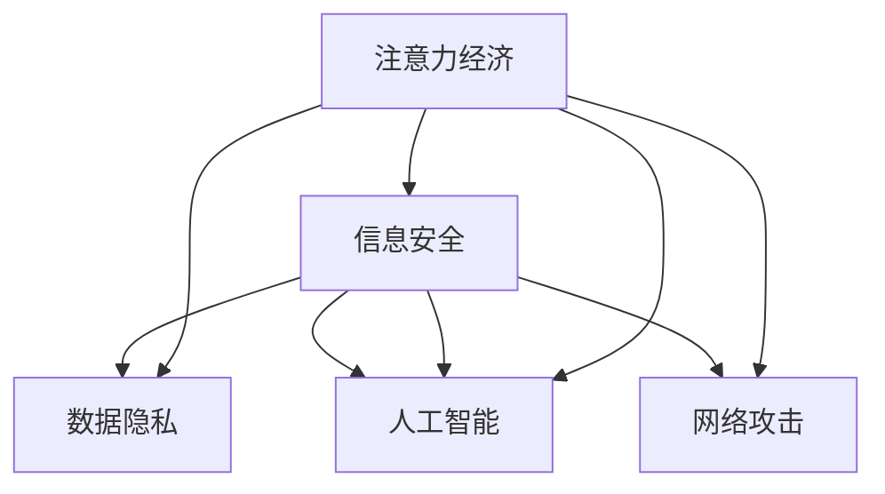

                 

# 注意力经济中的信息安全问题

在数字化时代，信息资源的丰富性和多样性带来了前所未有的便利，但也引发了一系列关于信息安全的问题。随着网络技术的发展，注意力经济（Attention Economy）成为当代社会的重要现象。然而，这种经济模式下，信息安全和隐私保护显得尤为重要。本文将探讨注意力经济中的信息安全问题，分析其现状、挑战及解决策略，以期为相关领域的研究和实践提供有益参考。

## 1. 背景介绍

### 1.1 信息经济的兴起

随着互联网技术的迅猛发展，信息经济逐渐成为推动社会进步的重要引擎。信息经济的核心在于信息资源的开发、利用和传播。通过信息的采集、分析、处理和发布，可以创造出巨大的经济效益和社会价值。信息经济的模式多种多样，包括传统的信息咨询、网络广告、电子商务、大数据分析等。

### 1.2 注意力经济的概念

注意力经济是信息经济的一种新形式，其核心在于吸引用户的注意力，从而获得经济收益。在注意力经济模式下，信息资源的竞争更加激烈。如何有效吸引用户的注意力，提高信息资源的商业价值，成为了信息经济发展的关键问题。

### 1.3 信息安全的重要性

信息安全是信息经济中不可或缺的一环。在注意力经济模式下，信息泄露、数据滥用等安全问题对用户和企业的影响尤为严重。因此，加强信息安全防护，确保信息资源的安全性和隐私保护，成为信息经济中不可忽视的课题。

## 2. 核心概念与联系

### 2.1 核心概念概述

本节将介绍几个密切相关的核心概念，以便更好地理解注意力经济中的信息安全问题。

- **注意力经济（Attention Economy）**：指在数字时代，吸引用户注意力成为获取经济利益的关键。信息资源的价值在于其能够吸引用户的注意，从而带来流量和商业价值。
- **信息安全（Information Security）**：保护信息资源不被未授权访问、篡改和泄露的过程。信息安全是信息经济发展的基石。
- **数据隐私（Data Privacy）**：保护个人信息不被滥用和泄露，确保个人信息的保密性、完整性和可用性。数据隐私是信息安全的重要组成部分。
- **网络攻击（Cyber Attack）**：通过各种手段攻击信息系统的行为，包括但不限于黑客攻击、病毒传播、网络钓鱼等。
- **人工智能（AI）**：通过机器学习、深度学习等技术，实现信息自动化处理和分析。AI在信息安全领域中扮演着越来越重要的角色。

这些概念之间的逻辑关系可以通过以下Mermaid流程图来展示：



这个流程图展示了注意力经济与信息安全、数据隐私、网络攻击、人工智能之间的紧密联系：

1. 注意力经济通过吸引用户注意力，获取经济收益。
2. 信息安全是注意力经济的前提，保障信息资源不被滥用和泄露。
3. 数据隐私是信息安全的核心，确保个人信息的保护。
4. 网络攻击是信息安全的敌人，威胁信息资源的安全性。
5. 人工智能是信息安全的重要工具，通过技术手段提升信息安全水平。

这些概念共同构成了注意力经济中的信息安全框架，影响着信息经济的发展方向。

## 3. 核心算法原理 & 具体操作步骤

### 3.1 算法原理概述

注意力经济中的信息安全问题，可以通过以下核心算法原理进行处理：

- **数据加密（Data Encryption）**：通过将信息资源进行加密处理，保障数据在传输和存储过程中的安全。
- **访问控制（Access Control）**：通过身份验证、权限管理等手段，确保只有授权用户才能访问敏感信息。
- **入侵检测（Intrusion Detection）**：通过监控网络流量、系统日志等，及时发现和应对网络攻击。
- **安全审计（Security Audit）**：定期对系统进行安全审计，检查潜在的安全漏洞，提高系统的安全性。
- **数据备份与恢复（Data Backup and Recovery）**：定期备份重要数据，并确保在数据丢失或损坏时能够快速恢复。

这些算法原理在信息安全中各司其职，共同保障信息资源的安全性。

### 3.2 算法步骤详解

以下详细介绍基于注意力经济的信息安全处理步骤：

**Step 1: 数据分类与标识**

- 对信息资源进行分类，明确不同类别的数据敏感程度。
- 为不同级别的数据设置相应的标识，以便在处理和存储时进行差异化保护。

**Step 2: 数据加密**

- 对敏感数据进行加密处理，确保数据在传输和存储过程中不被未授权访问。
- 使用如AES、RSA等加密算法，根据数据敏感程度选择合适的加密强度。

**Step 3: 访问控制**

- 设置身份验证机制，确保只有授权用户才能访问敏感数据。
- 使用如RBAC、ABAC等访问控制模型，根据用户角色和权限进行数据访问控制。

**Step 4: 入侵检测**

- 监控网络流量、系统日志等，及时发现和应对潜在的网络攻击。
- 使用如IDS、IPS等入侵检测系统，实时分析网络行为，检测异常活动。

**Step 5: 安全审计**

- 定期对系统进行安全审计，检查潜在的安全漏洞。
- 使用如Vulnerability Scanning、Penetration Testing等技术，进行全面审计和评估。

**Step 6: 数据备份与恢复**

- 定期备份重要数据，确保在数据丢失或损坏时能够快速恢复。
- 使用如RAID、云备份等技术，保障数据备份的安全性和可靠性。

**Step 7: 人工智能辅助**

- 利用AI技术，提高信息安全处理效率和效果。
- 使用如机器学习、深度学习等技术，进行威胁检测和行为分析。

通过以上步骤，可以构建一个全面的信息安全防护体系，保障信息资源的安全性和隐私保护。

### 3.3 算法优缺点

基于注意力经济的信息安全处理算法具有以下优点：

1. **系统性**：通过多层次、多维度的安全防护，保障信息资源的安全性。
2. **灵活性**：可以根据不同类别的数据进行差异化保护，灵活应对各种安全威胁。
3. **自动化**：利用AI技术，提高信息安全处理的自动化水平，减少人工干预。

同时，这些算法也存在一些局限性：

1. **复杂性**：安全处理流程复杂，需要投入大量人力和技术资源。
2. **技术依赖**：对加密算法、访问控制、入侵检测等技术要求较高，需要持续更新和维护。
3. **成本高**：系统建设、运维和升级成本较高，需要较高的资金投入。

尽管存在这些局限性，但整体而言，基于注意力经济的信息安全处理算法在保障信息资源安全方面具有重要作用。

### 3.4 算法应用领域

基于注意力经济的信息安全处理算法，在多个领域得到了广泛应用，例如：

- **金融行业**：金融机构处理大量的敏感数据，如客户信息、交易记录等。通过加密、访问控制等技术，保障数据安全。
- **医疗行业**：医疗机构处理大量的患者数据，如病历、检查报告等。通过数据备份、入侵检测等技术，保护患者隐私。
- **政府部门**：政府部门处理大量的公共数据，如人口普查、身份证信息等。通过安全审计、数据备份等技术，确保数据安全。
- **电子商务**：电商平台处理大量的用户数据，如订单信息、支付记录等。通过加密、入侵检测等技术，保障用户数据安全。
- **社交媒体**：社交媒体平台处理大量的用户数据，如聊天记录、点赞记录等。通过访问控制、安全审计等技术，保护用户隐私。

## 4. 数学模型和公式 & 详细讲解 & 举例说明

### 4.1 数学模型构建

基于注意力经济的信息安全处理，涉及多个数学模型，包括数据加密模型、访问控制模型、入侵检测模型和安全审计模型等。

**数据加密模型**：

$$
\text{Enc}(M, K) = C
$$

其中 $M$ 为原始数据，$K$ 为加密密钥，$C$ 为加密后的密文。

**访问控制模型**：

$$
\text{Access}(U, P, R) = \text{Result}
$$

其中 $U$ 为用户身份，$P$ 为访问权限，$R$ 为资源，$\text{Result}$ 为访问结果。

**入侵检测模型**：

$$
\text{IDS}(N, T) = \text{Alert}
$$

其中 $N$ 为网络流量，$T$ 为检测阈值，$\text{Alert}$ 为检测结果。

**安全审计模型**：

$$
\text{Audit}(V) = \text{Report}
$$

其中 $V$ 为系统漏洞，$\text{Report}$ 为审计报告。

### 4.2 公式推导过程

以数据加密模型为例，推导加密算法的实现过程。

设原始数据 $M$ 的长度为 $n$，加密密钥 $K$ 的长度为 $k$，则加密过程如下：

1. 将 $M$ 和 $K$ 转化为二进制形式。
2. 对 $M$ 进行分组，每组长度为 $b$。
3. 对每组 $M_i$ 进行异或运算，得到密文 $C_i$。
4. 对 $C_i$ 进行置换，生成最终密文 $C$。

推导过程如下：

$$
\begin{aligned}
M &= m_1m_2...m_n \\
K &= k_1k_2...k_k \\
M_i &= m_{i_1}m_{i_2}...m_{i_b} \\
C_i &= m_{i_1} \oplus k_{j_1} \\
C &= C_1C_2...C_l
\end{aligned}
$$

其中 $\oplus$ 表示异或运算，$j$ 为置换因子。

### 4.3 案例分析与讲解

以银行系统为例，分析基于注意力经济的信息安全处理。

**数据加密**

银行系统处理大量的客户信息和交易记录，需要对其进行加密处理。使用AES-256加密算法，对客户密码、交易流水等敏感数据进行加密。加密过程如下：

1. 将密码和密钥转化为二进制形式。
2. 对密码进行分组，每组长度为128位。
3. 对每组密码进行异或运算，得到密文。
4. 对密文进行置换，生成最终密文。

**访问控制**

银行系统对客户信息进行严格访问控制，确保只有授权人员才能访问敏感数据。使用RBAC（Role-Based Access Control）模型，对不同角色设置不同权限。例如，管理员角色可以访问所有客户信息，普通员工只能访问部分客户信息。

**入侵检测**

银行系统部署IDS（Intrusion Detection System），实时监控网络流量和系统日志，检测潜在的安全威胁。IDS通过分析异常流量和异常操作，及时发现并报警。

**安全审计**

银行系统定期进行安全审计，检查系统漏洞和潜在风险。使用Vulnerability Scanning工具，扫描系统中的漏洞和弱点，生成审计报告。

通过以上信息安全处理，保障银行系统的安全性和客户数据隐私。

## 5. 项目实践：代码实例和详细解释说明

### 5.1 开发环境搭建

在进行信息安全处理项目开发时，需要搭建合适的开发环境。以下是使用Python进行开发的环境配置流程：

1. 安装Anaconda：从官网下载并安装Anaconda，用于创建独立的Python环境。

2. 创建并激活虚拟环境：
```bash
conda create -n security-env python=3.8 
conda activate security-env
```

3. 安装必要的Python包：
```bash
pip install numpy pandas matplotlib scikit-learn tensorboard
```

4. 安装加密库和访问控制库：
```bash
pip install pycrypto pysftp
```

5. 安装入侵检测库和安全审计库：
```bash
pip install scapy idspy
```

完成上述步骤后，即可在`security-env`环境中开始开发信息安全处理项目。

### 5.2 源代码详细实现

以下代码示例演示了如何使用Python实现数据加密、访问控制、入侵检测和安全审计等功能。

**数据加密**

```python
from Crypto.Cipher import AES
from Crypto.Util.Padding import pad, unpad

def encrypt(data, key):
    cipher = AES.new(key, AES.MODE_ECB)
    ciphertext = cipher.encrypt(pad(data.encode(), AES.block_size))
    return ciphertext

def decrypt(ciphertext, key):
    cipher = AES.new(key, AES.MODE_ECB)
    plaintext = unpad(cipher.decrypt(ciphertext), AES.block_size)
    return plaintext.decode()
```

**访问控制**

```python
class AccessControl:
    def __init__(self, roles):
        self.roles = roles
    
    def check_permission(self, user_role, resource):
        if user_role in self.roles[resource]:
            return True
        else:
            return False
```

**入侵检测**

```python
from scapy.all import sniff

def sniff_traffic(filter):
    packets = sniff(filter=filter)
    for packet in packets:
        print(packet.summary())
```

**安全审计**

```python
from idspy import ScapyScanner

def scan_for_vulnerabilities(target):
    scanner = ScapyScanner(target)
    vulnerabilities = scanner.scan()
    return vulnerabilities
```

### 5.3 代码解读与分析

让我们再详细解读一下关键代码的实现细节：

**数据加密**

- `encrypt`函数：使用AES-256算法对数据进行加密处理，返回加密后的密文。
- `decrypt`函数：使用AES-256算法对密文进行解密处理，返回原始数据。

**访问控制**

- `AccessControl`类：定义访问控制模型，记录不同角色的访问权限。
- `check_permission`方法：根据用户角色和资源，检查用户是否有访问权限。

**入侵检测**

- `sniff_traffic`函数：使用Scapy库进行网络流量捕获，过滤特定条件下的流量数据。

**安全审计**

- `scan_for_vulnerabilities`函数：使用idspy库进行系统漏洞扫描，返回扫描结果。

## 6. 实际应用场景

### 6.1 金融行业

在金融行业，信息安全问题尤为重要。金融机构处理大量的客户信息和交易数据，一旦数据泄露，将会对客户和企业造成巨大的经济损失。

**数据加密**

银行系统对客户密码和交易流水等敏感数据进行加密处理，保障数据在传输和存储过程中的安全性。

**访问控制**

银行系统对不同角色设置不同的访问权限，确保只有授权人员才能访问敏感数据。例如，管理员可以访问所有客户信息，普通员工只能访问部分客户信息。

**入侵检测**

银行系统部署IDS，实时监控网络流量和系统日志，检测潜在的安全威胁。IDS通过分析异常流量和操作，及时发现并报警。

**安全审计**

银行系统定期进行安全审计，检查系统漏洞和潜在风险。使用Vulnerability Scanning工具，扫描系统中的漏洞和弱点，生成审计报告。

### 6.2 医疗行业

医疗行业处理大量的患者数据，如病历、检查报告等，数据泄露将对患者隐私造成严重影响。

**数据加密**

医疗机构对患者病历等敏感数据进行加密处理，确保数据在传输和存储过程中的安全性。

**访问控制**

医院系统对不同角色设置不同的访问权限，确保只有授权人员才能访问敏感数据。例如，医生可以访问患者的病历记录，但患者无法访问其他患者的病历记录。

**入侵检测**

医院系统部署IDS，实时监控网络流量和系统日志，检测潜在的安全威胁。IDS通过分析异常流量和操作，及时发现并报警。

**安全审计**

医院系统定期进行安全审计，检查系统漏洞和潜在风险。使用Vulnerability Scanning工具，扫描系统中的漏洞和弱点，生成审计报告。

### 6.3 政府部门

政府部门处理大量的公共数据，如人口普查、身份证信息等，数据泄露将对社会稳定造成严重影响。

**数据加密**

政府系统对公共数据进行加密处理，确保数据在传输和存储过程中的安全性。

**访问控制**

政府系统对不同角色设置不同的访问权限，确保只有授权人员才能访问敏感数据。例如，政府官员可以访问人口普查数据，但普通市民无法访问。

**入侵检测**

政府系统部署IDS，实时监控网络流量和系统日志，检测潜在的安全威胁。IDS通过分析异常流量和操作，及时发现并报警。

**安全审计**

政府系统定期进行安全审计，检查系统漏洞和潜在风险。使用Vulnerability Scanning工具，扫描系统中的漏洞和弱点，生成审计报告。

### 6.4 未来应用展望

未来，随着人工智能技术的不断进步，基于注意力经济的信息安全处理将更加智能化和自动化。AI技术将在入侵检测、安全审计等方面发挥更大作用。

**智能入侵检测**

利用AI技术，进行入侵行为分析和异常流量检测。例如，使用机器学习算法训练入侵检测模型，实时分析网络流量，检测异常活动。

**自动化安全审计**

利用AI技术，进行自动化漏洞扫描和安全评估。例如，使用深度学习算法训练安全审计模型，自动生成安全审计报告。

**威胁预测**

利用AI技术，进行威胁预测和风险评估。例如，使用时序分析模型预测未来的网络攻击行为，提前采取防护措施。

## 7. 工具和资源推荐

### 7.1 学习资源推荐

为了帮助开发者系统掌握信息安全的理论基础和实践技巧，这里推荐一些优质的学习资源：

1. 《信息安全原理》系列书籍：系统介绍了信息安全的各个方面，包括加密、访问控制、入侵检测等。
2. 《网络安全导论》课程：哈佛大学开设的网络安全课程，讲解了网络安全的基本概念和防护技术。
3. 《深度学习在信息安全中的应用》论文：介绍了深度学习技术在信息安全中的各种应用，如威胁检测、入侵检测等。
4. 《机器学习在网络安全中的应用》书籍：详细介绍了机器学习技术在网络安全中的各种应用，如异常检测、入侵检测等。
5. GitHub上的开源项目：如OpenSSL、OpenVPN等，可以学习和借鉴其安全处理实现。

通过对这些资源的学习实践，相信你一定能够快速掌握信息安全的关键技术和应用方法。

### 7.2 开发工具推荐

高效的开发离不开优秀的工具支持。以下是几款用于信息安全处理开发的常用工具：

1. Python：作为数据处理和分析的主流语言，Python的丰富库和框架使得信息安全处理更加高效。
2. PyCrypto：Python的加密库，提供了多种加密算法和工具。
3. Scapy：Python的网络协议解析库，支持网络流量捕获和分析。
4. Tensorboard：TensorFlow的可视化工具，支持模型训练和调优。
5. IDSpy：用于网络安全分析和漏洞扫描的工具。

合理利用这些工具，可以显著提升信息安全处理的开发效率，加快创新迭代的步伐。

### 7.3 相关论文推荐

信息安全研究源于学界的持续研究。以下是几篇奠基性的相关论文，推荐阅读：

1. "A Survey on Encryption and Security"：全面介绍了加密技术和安全协议的发展历史和现状。
2. "A Survey on Intrusion Detection Systems"：综述了入侵检测系统的各种技术和方法。
3. "A Survey on Security Audits in Information Systems"：综述了信息安全审计的各个方面和技术。
4. "Machine Learning for Network Security"：介绍了机器学习技术在网络安全中的各种应用，如异常检测、入侵检测等。
5. "Deep Learning in Information Security"：介绍了深度学习技术在信息安全中的各种应用，如威胁检测、入侵检测等。

这些论文代表了大语言模型微调技术的发展脉络。通过学习这些前沿成果，可以帮助研究者把握学科前进方向，激发更多的创新灵感。

## 8. 总结：未来发展趋势与挑战

### 8.1 研究成果总结

本文对基于注意力经济的信息安全问题进行了全面系统的介绍。首先阐述了信息经济和注意力经济的兴起背景，明确了信息安全在注意力经济中的重要性。其次，从原理到实践，详细讲解了信息安全的数学模型和操作步骤，给出了信息安全处理项目的完整代码实例。同时，本文还广泛探讨了信息安全在金融、医疗、政府等领域的实际应用，展示了信息安全处理技术的广阔前景。

通过本文的系统梳理，可以看到，基于注意力经济的信息安全处理技术正在成为信息经济的重要保障。通过加密、访问控制、入侵检测、安全审计等手段，可以构建一个全面的信息安全防护体系，保障信息资源的安全性和隐私保护。

### 8.2 未来发展趋势

展望未来，信息安全处理技术将呈现以下几个发展趋势：

1. **自动化**：随着AI技术的发展，信息安全处理将更加自动化和智能化。AI技术将在入侵检测、安全审计等方面发挥更大作用，提高信息安全处理的效率和效果。
2. **数据驱动**：数据驱动的安全处理将变得更加重要。通过大数据分析和机器学习，可以更加精准地识别和应对安全威胁。
3. **多方协作**：信息安全处理将更加注重多方协作，如企业内部、行业联盟、国际组织等，共同构建安全防护体系。
4. **跨域安全**：随着云服务和大数据技术的发展，跨域安全处理将成为重要研究方向。需要构建统一的跨域安全标准和机制。
5. **零信任安全**：零信任安全模型将成为未来的主流趋势。通过最小权限原则、持续验证等技术，保障信息资源的安全性。

这些趋势将推动信息安全处理技术不断进步，为信息经济的发展提供更可靠的安全保障。

### 8.3 面临的挑战

尽管信息安全处理技术已经取得了一定的进展，但在迈向更加智能化、自动化应用的过程中，它仍面临着诸多挑战：

1. **技术复杂性**：信息安全处理涉及多种技术和方法，技术复杂度高，需要多学科知识的综合应用。
2. **成本高昂**：信息安全处理需要投入大量的硬件和软件资源，成本较高，且需要持续维护和升级。
3. **数据隐私**：在信息安全处理中，数据隐私保护是一个重要问题。如何平衡数据安全和数据隐私，是一个难点。
4. **技术漏洞**：信息安全处理中存在各种技术漏洞，攻击者可能利用这些漏洞进行攻击。需要持续更新和修补安全漏洞。
5. **跨域协作**：跨域信息安全处理涉及多方协作，不同系统之间的数据互通和协作难度较大。

尽管存在这些挑战，但整体而言，信息安全处理技术在保障信息资源安全方面具有重要作用。未来需要进一步优化和创新，提升信息安全处理的效果和效率。

### 8.4 研究展望

面对信息安全处理所面临的种种挑战，未来的研究需要在以下几个方面寻求新的突破：

1. **AI技术应用**：探索AI技术在信息安全处理中的应用，如基于机器学习和深度学习的威胁检测、行为分析等。
2. **多模态安全处理**：将符号化的先验知识，如知识图谱、逻辑规则等，与神经网络模型进行巧妙融合，增强信息安全处理的全面性和准确性。
3. **跨域协作机制**：构建统一的跨域安全标准和机制，促进多方协作，提高信息安全处理的整体效率和效果。
4. **隐私保护技术**：研究和探索隐私保护技术，如差分隐私、联邦学习等，在保障数据安全的同时，保护数据隐私。
5. **威胁预测和响应**：利用AI技术，进行威胁预测和快速响应，提升信息安全处理的效果和效率。

这些研究方向将推动信息安全处理技术不断进步，为信息经济的发展提供更可靠的安全保障。

## 9. 附录：常见问题与解答

**Q1：如何应对网络攻击？**

A: 网络攻击是信息安全处理的重要挑战，以下是一些应对措施：
1. 防火墙：部署防火墙，限制非法访问。
2. 入侵检测系统（IDS）：部署IDS，实时监控网络流量和系统日志，检测异常行为。
3. 安全审计：定期进行安全审计，检查潜在的安全漏洞。
4. 漏洞补丁：及时更新和修补系统漏洞。

**Q2：如何保护数据隐私？**

A: 数据隐私保护是信息安全处理的重要任务，以下是一些保护措施：
1. 数据加密：对敏感数据进行加密处理，保障数据在传输和存储过程中的安全性。
2. 访问控制：设置身份验证和权限管理，确保只有授权人员才能访问敏感数据。
3. 匿名化处理：对数据进行匿名化处理，减少数据泄露的风险。
4. 差分隐私：利用差分隐私技术，保护数据隐私的同时，允许数据使用。

**Q3：如何确保信息安全处理的自动化？**

A: 信息安全处理的自动化是未来的重要趋势，以下是一些实现方法：
1. 自动化入侵检测：利用AI技术，进行自动化入侵检测和威胁分析。
2. 自动化安全审计：利用AI技术，进行自动化漏洞扫描和安全评估。
3. 自动化威胁预测：利用AI技术，进行自动化威胁预测和快速响应。
4. 自动化威胁响应：利用AI技术，实现自动化威胁响应和事件处理。

**Q4：如何优化信息安全处理的成本？**

A: 信息安全处理的成本较高，以下是一些优化方法：
1. 集中管理：集中管理信息安全资源，减少冗余和浪费。
2. 云计算：利用云计算技术，降低硬件和维护成本。
3. 开源工具：利用开源工具和框架，降低开发和部署成本。
4. 自动化运维：利用自动化运维工具，减少人力和时间成本。

这些措施将有助于降低信息安全处理的成本，提高效率和效果。

---

作者：禅与计算机程序设计艺术 / Zen and the Art of Computer Programming

