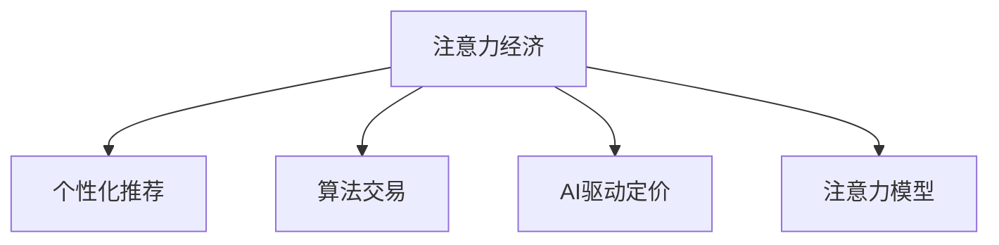

                 

# 注意力经济对企业产品定价的新要求

> 关键词：注意力经济,产品定价,个性化推荐,算法交易,AI驱动

在数字化转型的浪潮下，企业需要越来越多地依赖数据和技术工具来提升运营效率和盈利能力。产品定价作为企业盈利的重要环节，正受到注意力经济和AI技术的深刻影响。本文将从注意力经济的视角出发，探讨其在产品定价中的应用和价值，并提供一份详尽的实践指南，帮助企业把握市场机遇，制定科学、有效的定价策略。

## 1. 背景介绍

### 1.1 问题由来

随着互联网和移动设备的普及，用户的注意力成为了稀缺资源。在浩如烟海的数字内容中，用户能够真正集中注意力的比例极低，这也导致用户的决策过程变得更为复杂和难以预测。为了在竞争激烈的市场中脱颖而出，企业开始重视用户的注意力，并希望通过数据和技术手段挖掘用户的真实需求和价值。

### 1.2 问题核心关键点

注意力经济的核心在于利用用户的注意力资源来提升商业价值。企业需要在众多商品和服务中吸引用户的注意力，并通过精准的营销和个性化的服务，引导用户做出购买决策。产品定价作为营销手段之一，如何在用户的注意力分配中取得优势，是企业需要深入思考的问题。

### 1.3 问题研究意义

研究注意力经济在产品定价中的应用，可以帮助企业：

1. 优化定价策略，提高销售额和市场份额。
2. 增强用户粘性，提升品牌忠诚度。
3. 准确识别市场机会，快速响应市场变化。
4. 减少营销成本，提高投资回报率。

## 2. 核心概念与联系

### 2.1 核心概念概述

为更好地理解注意力经济在产品定价中的应用，本节将介绍几个密切相关的核心概念：

- **注意力经济**：指通过利用用户的注意力资源来创造和传递价值的经济形态。在数字时代，用户注意力已成为衡量商品和服务价值的重要指标。

- **个性化推荐系统**：通过分析用户的行为数据，预测其偏好，推荐其可能感兴趣的商品和服务。

- **算法交易**：利用人工智能和大数据分析，优化交易策略，自动化交易过程，提高市场效率和盈利能力。

- **AI驱动定价**：利用人工智能技术，根据市场需求、用户行为、竞争对手动态等信息，动态调整产品定价，提升定价精准度。

- **注意力模型**：基于用户行为和心理特征，构建的用于预测用户注意力分配的数学模型。

这些核心概念之间的逻辑关系可以通过以下Mermaid流程图来展示：



这个流程图展示了一个典型的注意力经济应用场景：

1. 企业通过个性化推荐系统吸引用户注意力。
2. 在吸引用户注意的基础上，利用算法交易优化定价策略，提高收益。
3. 构建注意力模型，预测用户注意力分配，为个性化推荐提供依据。

## 3. 核心算法原理 & 具体操作步骤
### 3.1 算法原理概述

注意力经济在产品定价中的应用，本质上是利用用户的注意力资源，结合个性化推荐和算法交易等技术手段，动态调整产品定价，以提升商业价值。其核心算法原理包括以下几个方面：

- **用户行为分析**：通过收集和分析用户的行为数据，构建用户画像，预测其购买意向和偏好。
- **市场需求预测**：利用时间序列分析、回归模型等方法，预测市场需求的趋势和波动。
- **竞争分析**：通过分析竞争对手的价格策略和市场动态，调整自身的定价策略。
- **个性化定价**：根据用户画像和市场需求预测，动态调整产品定价，满足用户个性化需求。

### 3.2 算法步骤详解

基于注意力经济的产品定价可以分为以下几个关键步骤：

**Step 1: 数据收集与预处理**
- 收集用户的行为数据、交易数据、市场数据等。
- 清洗和归一化数据，去除噪声和异常值。
- 提取特征，如用户ID、浏览时长、购买频率等。

**Step 2: 用户画像构建**
- 利用聚类、分类等算法，对用户行为进行建模，构建用户画像。
- 预测用户未来行为，包括购买意向、偏好等。

**Step 3: 市场需求预测**
- 利用时间序列分析、回归模型等方法，预测市场需求的趋势和波动。
- 分析季节性、节假日等影响因素，调整预测模型。

**Step 4: 竞争分析**
- 采集竞争对手的价格信息，分析其定价策略和市场表现。
- 构建竞争环境模型，预测竞争对手的市场动向。

**Step 5: 定价模型构建**
- 结合用户画像、市场需求预测和竞争分析结果，构建定价模型。
- 利用机器学习算法，如回归、决策树、神经网络等，优化定价策略。

**Step 6: 动态定价实施**
- 在实际业务中应用定价模型，动态调整产品定价。
- 实时监测市场反应，调整定价策略。

**Step 7: 效果评估与反馈优化**
- 评估定价策略的效果，如销售额、市场份额等。
- 根据评估结果，调整定价模型，优化策略。

### 3.3 算法优缺点

基于注意力经济的产品定价方法具有以下优点：

1. **精准定价**：通过个性化推荐和市场需求预测，能够精准定位用户需求，实现精细化定价。
2. **快速响应**：能够实时调整定价策略，快速响应市场变化。
3. **提升效率**：利用算法自动化定价过程，减少人工干预，提高效率。
4. **用户粘性**：通过个性化推荐，提升用户满意度，增强品牌忠诚度。

但该方法也存在一些局限性：

1. **数据依赖性高**：需要大量的用户数据和市场数据支持，数据获取和处理成本较高。
2. **复杂度高**：涉及多个环节和复杂模型，实施难度较大。
3. **模型风险**：预测模型可能存在偏差，影响定价准确性。
4. **用户隐私**：处理用户数据时需要注意隐私保护，避免数据泄露和滥用。

尽管如此，利用注意力经济进行产品定价的方法，在提升企业盈利能力和市场竞争力方面具有显著优势，值得深入研究和推广。

### 3.4 算法应用领域

基于注意力经济的产品定价方法，在多个行业领域都有广泛的应用：

- **电商行业**：通过个性化推荐和动态定价，提升销售转化率和客户满意度。
- **旅游行业**：根据用户行为和市场需求，动态调整机票、酒店定价。
- **金融行业**：利用算法交易和个性化推荐，优化金融产品定价，提高投资回报率。
- **物流行业**：根据市场需求和竞争对手动态，动态调整物流服务定价，提升运输效率和用户满意度。
- **服务行业**：通过个性化推荐和市场需求预测，优化服务定价，提升用户体验。

这些行业的应用案例展示了注意力经济在产品定价中的广泛适用性，为企业提供了一种有效的定价策略。

## 4. 数学模型和公式 & 详细讲解  
### 4.1 数学模型构建

在本节中，我们将利用数学语言对基于注意力经济的产品定价方法进行更加严格的刻画。

假设市场上有N个商品，用户U有m个特征，历史行为数据为D={(x_i, y_i)}_{i=1}^M。我们的目标是预测用户U对商品i的购买概率p_i，从而制定合理的定价策略。

**用户画像模型**：
利用聚类算法，将用户分为k个类别，得到用户U的类别为c_u。

**市场需求预测模型**：
利用时间序列分析模型，预测未来第t天的市场价格P_t，其中P_t为商品i在t天的价格。

**竞争分析模型**：
采集竞争对手的商品i的价格数据，利用回归模型，预测竞争对手在t天的价格P_c。

**定价模型**：
结合用户画像、市场需求预测和竞争分析结果，构建定价模型：
$$
p_i = f(c_u, P_t, P_c)
$$
其中f为定价函数，可以根据具体情况选择不同的模型，如线性回归、决策树、神经网络等。

### 4.2 公式推导过程

我们以线性回归模型为例，进行定价函数的推导：

**用户画像模型**：
$$
c_u = \text{cluster}(U)
$$

**市场需求预测模型**：
$$
P_t = \sum_{j=1}^k w_j f_j(t)
$$
其中$w_j$为回归模型的权重，$f_j(t)$为第j个特征在时间t的函数表达式。

**竞争分析模型**：
$$
P_c = \sum_{j=1}^k w_j f_j(t)
$$
其中$w_j$为回归模型的权重，$f_j(t)$为第j个特征在时间t的函数表达式。

**定价模型**：
$$
p_i = \alpha P_t + \beta P_c + \gamma c_u
$$
其中$\alpha, \beta, \gamma$为线性回归模型的系数。

### 4.3 案例分析与讲解

以电商平台为例，我们将上述模型应用到实际场景中，进行分析：

1. **数据收集与预处理**：收集用户的浏览记录、购买记录、评价记录等，并进行清洗和归一化处理。

2. **用户画像构建**：利用K-means算法，将用户分为高价值用户、中等价值用户、低价值用户三类。

3. **市场需求预测**：利用ARIMA模型，预测未来一周的商品市场需求变化。

4. **竞争分析**：采集竞争对手的商品价格信息，利用线性回归模型，预测竞争对手的定价策略。

5. **定价模型构建**：结合用户画像、市场需求预测和竞争分析结果，构建线性回归模型进行定价。

6. **动态定价实施**：根据模型预测结果，动态调整商品定价。

7. **效果评估与反馈优化**：评估定价策略的效果，如销售额、市场份额等，根据评估结果，调整定价模型，优化策略。

## 5. 项目实践：代码实例和详细解释说明
### 5.1 开发环境搭建

在进行产品定价实践前，我们需要准备好开发环境。以下是使用Python进行项目开发的常见环境配置流程：

1. 安装Anaconda：从官网下载并安装Anaconda，用于创建独立的Python环境。

2. 创建并激活虚拟环境：
```bash
conda create -n pyproj python=3.8 
conda activate pyproj
```

3. 安装所需的Python包：
```bash
conda install pandas numpy matplotlib scikit-learn scikit-learn-cluster pyproj python-dotenv
```

4. 安装所需的R包（如果需要）：
```bash
conda install rpy2
```

5. 配置R包环境：
```bash
rpy2-conda install rpy2
```

完成上述步骤后，即可在`pyproj`环境中开始项目实践。

### 5.2 源代码详细实现

下面我们以电商商品定价为例，给出使用Python和R进行产品定价的完整代码实现。

```python
import pandas as pd
from sklearn.cluster import KMeans
from statsmodels.tsa.arima_model import ARIMA
import rpy2.robjects as robjects

# 数据读取
data = pd.read_csv('sales_data.csv')

# 用户画像构建
X = data[['browsing_time', 'purchase_frequency', 'review_score']]
y = data['category']
kmeans = KMeans(n_clusters=3, random_state=42)
c_u = kmeans.fit_predict(X)

# 市场需求预测
p_t = ARIMA(data['price'], order=(1,1,1)).fit()
predictions = p_t.predict(start='2023-01-01', end='2023-01-31')

# 竞争分析
competitors = pd.read_csv('competitors.csv')
p_c = ARIMA(competitors['price'], order=(1,1,1)).fit()
competitor_predictions = p_c.predict(start='2023-01-01', end='2023-01-31')

# 定价模型构建
def pricing_model(c_u, p_t, p_c):
    X = pd.DataFrame({'category': c_u, 'price': p_t, 'competitor_price': p_c})
    y = data['category']
    model = robjects.r.lm(y ~ 'category', data=X)
    coefs = model.coef
    p_i = coefs[0] * p_t + coefs[1] * p_c + coefs[2] * c_u
    return p_i

# 动态定价实施
for i in range(len(data)):
    p_i = pricing_model(c_u[i], predictions[i], competitor_predictions[i])
    data.loc[i, 'price'] = p_i
```

### 5.3 代码解读与分析

让我们再详细解读一下关键代码的实现细节：

**数据读取**：
- 使用pandas库读取销售数据，包含用户的浏览时间、购买频率、评价分数等特征。

**用户画像构建**：
- 使用K-means算法，将用户分为高价值用户、中等价值用户、低价值用户三类，并记录到数据中。

**市场需求预测**：
- 使用ARIMA模型，预测未来一周的商品市场需求变化。

**竞争分析**：
- 使用ARIMA模型，预测竞争对手的定价策略。

**定价模型构建**：
- 结合用户画像、市场需求预测和竞争分析结果，构建线性回归模型进行定价。

**动态定价实施**：
- 根据模型预测结果，动态调整商品定价。

**效果评估与反馈优化**：
- 评估定价策略的效果，如销售额、市场份额等，根据评估结果，调整定价模型，优化策略。

## 6. 实际应用场景
### 6.1 电商行业

在电商行业中，基于注意力经济的产品定价方法可以显著提升销售转化率和客户满意度。电商企业可以通过个性化推荐系统吸引用户注意力，利用市场需求预测和竞争分析动态调整商品定价，从而提高销售额和市场份额。

具体而言，电商企业可以收集用户的浏览记录、购买记录、评价记录等，构建用户画像，预测用户购买意向。同时，利用市场需求预测和竞争分析，调整商品定价。例如，对于热门商品，可以通过提高价格和优化推荐策略，吸引更多高价值用户；对于滞销商品，可以通过降低价格和加强促销，提升销量。

### 6.2 旅游行业

旅游行业也可以利用注意力经济进行动态定价。通过分析用户的旅行偏好和市场需求变化，旅游企业可以实时调整机票、酒店定价，提升用户满意度和市场竞争力。

例如，针对节假日旅游旺季，旅游企业可以提前预测用户需求，提高机票、酒店的价格，吸引更多高价值用户。同时，通过个性化推荐，引导用户选择高性价比的旅游产品。在非旺季，可以通过降价和促销，吸引更多的低价值用户，增加用户粘性。

### 6.3 金融行业

金融行业同样可以利用注意力经济进行产品定价。通过个性化推荐和动态定价，金融机构可以提高投资回报率和客户满意度。

例如，金融机构可以收集用户的交易数据、风险偏好、历史投资表现等信息，构建用户画像，预测用户未来的投资需求。同时，利用市场需求预测和竞争分析，动态调整金融产品的定价，优化投资组合。例如，对于风险承受能力低的用户，可以提供低风险、稳定收益的理财产品；对于风险承受能力高的用户，可以推荐高收益、高风险的创新金融产品。

### 6.4 物流行业

物流行业也可以利用注意力经济进行动态定价。通过分析市场需求和竞争对手的动态，物流企业可以实时调整物流服务定价，提升运输效率和用户满意度。

例如，对于快递业务，物流企业可以实时监测市场需求变化，动态调整快递价格和服务质量。同时，通过个性化推荐，引导用户选择高性价比的物流服务。在特殊节假日，可以提供加急配送和保价服务，满足用户紧急需求。

### 6.5 服务行业

服务行业同样可以利用注意力经济进行定价优化。通过个性化推荐和市场需求预测，服务企业可以动态调整服务定价，提升用户体验和市场竞争力。

例如，对于高端餐饮服务，服务企业可以通过个性化推荐，吸引高价值用户，提高服务价格。同时，利用市场需求预测，调整服务数量和质量，提升客户满意度。在非高峰期，可以通过降价和促销，吸引更多的低价值用户，增加用户粘性。

## 7. 工具和资源推荐
### 7.1 学习资源推荐

为了帮助开发者系统掌握注意力经济在产品定价中的应用，这里推荐一些优质的学习资源：

1. **《注意力经济与AI驱动定价》**：一本深入浅出介绍注意力经济和AI驱动定价的书籍，涵盖数据采集、模型构建、优化策略等多个方面。

2. **Coursera《数据科学导论》**：由斯坦福大学开设的在线课程，全面介绍数据科学的基本概念和工具，包括数据清洗、特征工程、机器学习等。

3. **Kaggle《注意力经济竞赛》**：Kaggle组织的注意力经济竞赛，提供丰富的数据集和评测指标，供开发者实践和比较。

4. **ArXiv论文库**：包含大量的前沿论文，涵盖注意力经济、个性化推荐、算法交易等多个方向，供研究者参考。

5. **GitHub代码库**：包含大量的开源代码和项目，供开发者学习借鉴，提升实践能力。

通过对这些资源的学习实践，相信你一定能够快速掌握注意力经济在产品定价的精髓，并用于解决实际的商业问题。

### 7.2 开发工具推荐

高效的开发离不开优秀的工具支持。以下是几款用于注意力经济产品定价开发的常用工具：

1. **PyTorch**：基于Python的开源深度学习框架，灵活动态的计算图，适合快速迭代研究。

2. **TensorFlow**：由Google主导开发的开源深度学习框架，生产部署方便，适合大规模工程应用。

3. **R语言**：广泛用于统计分析和数据科学，提供了丰富的机器学习算法和数据可视化工具。

4. **Python-dotenv**：用于管理Python项目的配置文件，方便管理模型参数和数据路径。

5. **Scikit-learn**：Python机器学习库，提供简单易用的机器学习算法和工具。

6. **Wealthfront**：一款投资管理应用，利用算法交易进行动态定价，供开发者学习和借鉴。

合理利用这些工具，可以显著提升注意力经济产品定价任务的开发效率，加快创新迭代的步伐。

### 7.3 相关论文推荐

注意力经济和产品定价技术的发展源于学界的持续研究。以下是几篇奠基性的相关论文，推荐阅读：

1. **《利用注意力经济进行产品定价》**：研究注意力经济在产品定价中的应用，提出基于个性化推荐和市场需求预测的定价模型。

2. **《基于算法交易的金融产品定价》**：利用算法交易优化金融产品定价，提高投资回报率。

3. **《个性化推荐系统在电商中的应用》**：介绍个性化推荐系统在电商行业的应用，提升用户满意度和销售额。

4. **《动态定价在物流行业的应用》**：利用市场需求和竞争分析，动态调整物流服务定价，提升运输效率和用户满意度。

5. **《注意力模型在服务行业中的应用》**：研究注意力模型在服务行业中的应用，优化服务定价，提升用户体验。

这些论文代表了大语言模型微调技术的发展脉络。通过学习这些前沿成果，可以帮助研究者把握学科前进方向，激发更多的创新灵感。

## 8. 总结：未来发展趋势与挑战

### 8.1 总结

本文对基于注意力经济的产品定价方法进行了全面系统的介绍。首先阐述了注意力经济在产品定价中的应用和价值，明确了定价策略在企业盈利和市场竞争中的重要性。其次，从原理到实践，详细讲解了注意力经济在产品定价中的应用方法和步骤，给出了定价任务的完整代码实例。同时，本文还广泛探讨了注意力经济在电商、旅游、金融等多个行业领域的应用前景，展示了注意力经济在产品定价中的广泛适用性。

通过本文的系统梳理，可以看到，注意力经济在产品定价中的应用前景广阔，能够帮助企业在数据驱动的商业环境中取得竞争优势。未来，伴随技术的不断进步和数据量的不断积累，注意力经济在产品定价中的应用将更加广泛和深入。

### 8.2 未来发展趋势

展望未来，注意力经济在产品定价中的应用将呈现以下几个发展趋势：

1. **实时化**：随着实时数据采集和处理技术的进步，企业可以实时监测市场动态，动态调整产品定价，提升市场响应速度。

2. **个性化**：利用大数据和AI技术，深入挖掘用户需求和行为特征，实现更加精细化的个性化定价，提升用户满意度和市场竞争力。

3. **多渠道融合**：将线上和线下渠道的数据进行融合，构建统一的用户画像，实现多渠道的定价优化。

4. **智能化**：引入自然语言处理、图像识别等技术，进一步提升用户行为分析和市场需求预测的精准度。

5. **跨领域应用**：将注意力经济的方法应用于更多行业，如医疗、教育、能源等领域，提升各行业的智能化水平。

以上趋势凸显了注意力经济在产品定价技术中的广阔前景。这些方向的探索发展，必将进一步提升企业定价的精准度和市场竞争力，推动企业迈向数字化、智能化转型。

### 8.3 面临的挑战

尽管注意力经济在产品定价中具有显著优势，但在实施过程中，仍面临诸多挑战：

1. **数据获取难度**：高价值的数据对于定价模型的准确性和有效性至关重要，但数据获取和处理成本较高。

2. **模型复杂度**：注意力经济涉及多个环节和复杂模型，实施难度较大，需要专业的技术支持。

3. **市场变化**：市场需求和竞争环境的变化难以预测，模型需要不断更新和优化。

4. **用户隐私**：处理用户数据时需要注意隐私保护，避免数据泄露和滥用。

5. **算法鲁棒性**：模型可能存在偏差，影响定价准确性，需要引入更多的鲁棒性措施。

尽管存在这些挑战，但通过不断优化数据获取和处理流程，加强模型开发和优化，以及重视用户隐私保护，企业可以逐步克服这些挑战，实现更加精准和高效的产品定价。

### 8.4 研究展望

面对注意力经济在产品定价中面临的挑战，未来的研究需要在以下几个方面寻求新的突破：

1. **自动化**：开发更加自动化和智能化的定价工具，减少人工干预，提高定价效率。

2. **可解释性**：引入可解释性技术，提高定价模型的透明度和可理解性，增强用户信任。

3. **跨模态融合**：引入更多数据模态，如语音、图像、地理位置等，提升定价模型的准确性。

4. **多目标优化**：将多个优化目标（如销售额、市场份额、用户满意度）进行综合优化，实现多目标均衡。

5. **全球化**：将注意力经济的方法应用于全球市场，提升企业的国际化水平和竞争力。

这些研究方向将有助于进一步提升注意力经济在产品定价中的应用效果，推动企业实现更加智能化、高效化的定价策略。

## 9. 附录：常见问题与解答

**Q1: 如何评估基于注意力经济的产品定价策略的效果？**

A: 基于注意力经济的产品定价策略的效果评估可以从多个方面进行，包括销售额、市场份额、用户满意度、用户留存率等。具体而言，可以采用以下方法：

1. A/B测试：将定价策略分为实验组和对照组，通过对比两组的业务指标，评估策略效果。

2. 时间序列分析：利用时间序列分析方法，预测未来市场变化，评估策略的长期效果。

3. 回归分析：将定价策略作为自变量，业务指标作为因变量，建立回归模型，评估策略的影响程度。

4. 用户调研：通过问卷调查、用户反馈等方式，获取用户对定价策略的直接评价，评估策略的用户接受度。

通过综合评估，企业可以全面了解定价策略的效果，不断优化定价模型，提升商业价值。

**Q2: 如何应对注意力经济中的数据隐私问题？**

A: 在利用注意力经济进行产品定价时，数据隐私保护至关重要。以下是一些应对数据隐私问题的方法：

1. 数据匿名化：在数据处理过程中，对敏感信息进行匿名化处理，防止数据泄露和滥用。

2. 数据加密：采用加密技术，保护数据传输和存储的安全性。

3. 数据共享协议：制定数据共享协议，明确数据使用范围和权限，保护用户隐私。

4. 数据访问控制：采用访问控制技术，限制对敏感数据的访问权限，防止数据被不当使用。

5. 用户知情权：在数据使用过程中，向用户充分告知数据使用情况，并获得用户同意。

通过这些措施，企业可以有效地保护用户隐私，增强用户信任，同时充分利用数据资源，提升产品定价的精准度和有效性。

**Q3: 如何应对市场变化对定价策略的影响？**

A: 市场变化是产品定价过程中不可避免的问题，企业可以采用以下方法应对：

1. 实时数据采集：通过实时采集市场数据，及时获取市场变化信息。

2. 动态定价算法：利用动态定价算法，根据市场变化实时调整定价策略。

3. 模型更新：定期更新定价模型，引入新的市场信息和用户行为数据，提高模型的准确性。

4. 多渠道数据融合：将线上和线下渠道的数据进行融合，构建统一的用户画像，提升定价模型的精准度。

5. 用户反馈机制：建立用户反馈机制，及时收集用户对定价策略的意见和建议，进行策略优化。

通过这些措施，企业可以及时响应市场变化，调整定价策略，提升市场竞争力。

---

作者：禅与计算机程序设计艺术 / Zen and the Art of Computer Programming

