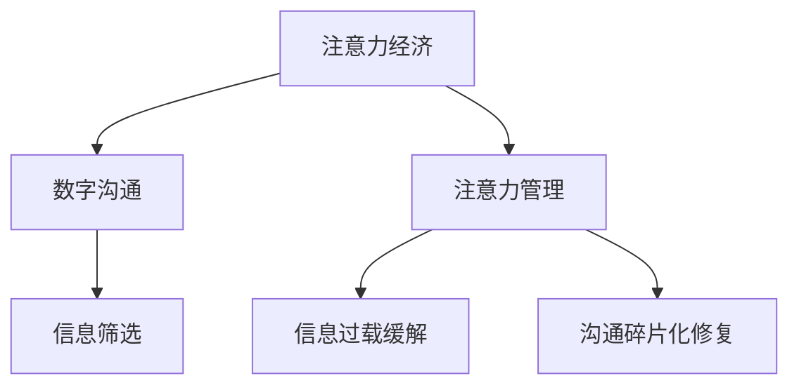

                 

# 注意力经济对企业内部沟通的影响

在信息化快速发展的今天，企业内部的沟通已不再局限于传统的人与人之间的面对面交流，而是逐渐转向了更加高效和便捷的数字沟通方式，如电子邮件、即时通讯工具、协作平台等。这种变化不仅影响了企业的沟通模式，更深刻地影响了企业的运行效率、决策速度和团队协作。本文将从注意力经济的角度出发，探讨数字沟通方式对企业内部沟通的影响，以及如何通过有效管理和利用注意力资源，提升企业内部沟通的效果。

## 1. 背景介绍

### 1.1 信息爆炸与注意力稀缺
在互联网时代，信息的数量呈指数级增长，企业内部员工每天需要面对的信息量越来越大。虽然信息过载为员工提供了丰富的知识源，但同时也造成了注意力的稀缺。员工需要在海量的信息中筛选出对工作有帮助的部分，这不仅增加了工作负担，还可能影响决策的准确性和工作效率。因此，如何有效地管理注意力资源，成为企业内部沟通管理的重要课题。

### 1.2 数字沟通方式的发展
随着技术的发展，企业内部的数字沟通方式也在不断演进。传统的电子邮件已经逐步被即时通讯工具（如Slack、微信等）和协作平台（如Trello、Jira等）所取代。这些数字工具不仅能及时传达信息，还支持多线程讨论、任务分配和进度追踪，大大提升了团队协作的效率。然而，数字工具的广泛应用也带来了新的挑战，如信息过载、沟通碎片化等问题。

## 2. 核心概念与联系

### 2.1 核心概念概述
- **注意力经济（Economics of Attention）**：注意力作为一种稀缺资源，在数字时代变得尤为重要。企业需要管理和利用好员工的时间和注意力，才能提升工作效率和决策质量。
- **数字沟通（Digital Communication）**：通过电子邮件、即时通讯、协作平台等数字工具进行的沟通方式。这些工具不仅提升了沟通的效率，也带来了信息过载和沟通碎片化等新问题。
- **注意力管理（Attention Management）**：通过对注意力的有效管理，帮助员工集中精力，提升工作效率和决策质量。
- **信息筛选（Information Filtering）**：通过算法和技术手段，帮助员工从海量的信息中筛选出对自己有用的部分。

这些概念通过以下Mermaid流程图展现其联系：



### 2.2 核心概念原理和架构
注意力经济的核心在于如何有效管理和利用员工的注意力资源。数字沟通方式则提供了各种信息交流的手段，但同时也带来了信息过载和沟通碎片化的问题。注意力管理是一种策略和方法，通过优化任务分配、信息筛选和沟通方式，帮助员工集中注意力，提高工作效率。信息筛选则是一种技术手段，通过算法和工具，帮助员工在海量信息中找出有价值的内容。

## 3. 核心算法原理 & 具体操作步骤

### 3.1 算法原理概述

注意力经济在企业内部沟通中的应用主要体现在以下几个方面：

1. **任务优先级管理**：通过算法和工具，帮助员工识别和优先处理重要的任务，避免被琐碎的信息分散注意力。
2. **信息筛选和聚合**：通过信息过滤和聚合技术，帮助员工快速获取有用信息，避免信息过载。
3. **沟通效率提升**：通过优化沟通方式和工具，提升沟通效率，减少沟通碎片化。

### 3.2 算法步骤详解

以下是一个典型的注意力管理流程：

1. **任务识别**：使用自然语言处理（NLP）技术，从邮件、即时通讯等渠道中自动识别和提取任务信息，标记任务的优先级。
2. **信息过滤**：通过机器学习算法，对邮件、文档、聊天记录等信息进行分类和过滤，筛选出有价值的内容，减少信息过载。
3. **沟通优化**：使用智能代理、聊天机器人等工具，辅助员工进行高效沟通，减少沟通碎片化。
4. **注意力追踪**：通过行为数据分析，追踪员工在各种沟通渠道上的注意力使用情况，发现分心的原因，提出改进建议。

### 3.3 算法优缺点

**优点**：
- **提升工作效率**：通过优先级管理、信息筛选和沟通优化，显著提高员工的工作效率。
- **减少信息过载**：通过信息过滤技术，帮助员工在海量信息中快速找到有用内容。
- **提升沟通质量**：通过智能代理和聊天机器人，提升沟通的效率和准确性。

**缺点**：
- **隐私和安全问题**：信息过滤和追踪需要访问员工的通信内容，可能涉及隐私问题。
- **依赖技术**：算法和工具的有效性依赖于技术实现的质量和数据的完备性。
- **学习成本**：员工需要学习和适应新的沟通方式和技术工具，存在一定的学习成本。

### 3.4 算法应用领域

注意力经济在企业内部沟通中的应用，主要包括以下几个领域：

1. **人力资源管理**：通过任务优先级管理和信息筛选，帮助HR团队更高效地管理员工的时间和工作任务。
2. **项目管理和协作**：通过信息聚合和沟通优化，提升团队协作效率，确保项目按时完成。
3. **客户关系管理**：通过智能客服和沟通优化，提升客户满意度和忠诚度。
4. **知识管理**：通过信息过滤和聚合，帮助员工快速获取和共享知识。

## 4. 数学模型和公式 & 详细讲解

### 4.1 数学模型构建

注意力经济在企业内部沟通中的应用，可以通过以下几个数学模型来刻画：

1. **任务优先级管理**：
   - 假设企业内部有N个任务，每个任务的优先级为p_i，i=1,2,...,N。
   - 任务优先级管理的目标是最大化总任务完成时间T，即：
     \[
     T = \sum_{i=1}^N \frac{1}{p_i}
     \]

2. **信息筛选**：
   - 假设企业内部每天生成M个信息，每个信息的价值为v_j，j=1,2,...,M。
   - 信息筛选的目标是最大化总信息价值V，即：
     \[
     V = \sum_{j=1}^M v_j
     \]

3. **沟通效率优化**：
   - 假设企业内部有K个沟通渠道，每个沟通渠道的效率为e_k，k=1,2,...,K。
   - 沟通优化目标是最大化总沟通效率E，即：
     \[
     E = \sum_{k=1}^K e_k
     \]

### 4.2 公式推导过程

以信息筛选为例，进行公式推导：

1. **信息价值矩阵**：
   - 将每个信息的价值表示为矩阵V=[v1,v2,...,vM]，其中v_i表示第i个信息价值。
   - 信息筛选的目标是最大化总信息价值V，即求解：
     \[
     \max \sum_{j=1}^M v_j
     \]

2. **特征提取**：
   - 使用NLP技术，将每个信息转化为向量表示X=[x1,x2,...,xM]。
   - 信息筛选的目标是找到最优的权重向量W=[w1,w2,...,wM]，使得加权信息价值最大化：
     \[
     \max \sum_{j=1}^M w_j x_j
     \]

3. **优化算法**：
   - 使用梯度下降算法，求解上述最优化问题：
     \[
     w_j \leftarrow w_j - \eta \nabla_{w_j} \sum_{j=1}^M w_j x_j
     \]

### 4.3 案例分析与讲解

假设某公司有10个任务和20个邮件信息，每个任务的优先级和每个邮件的价值如下表所示：

| 任务编号 | 优先级 | 邮件编号 | 价值 |
|---------|-------|---------|-----|
| 1       | 0.9   | 1       | 0.5 |
| 2       | 0.7   | 2       | 0.4 |
| ...     | ...   | ...     | ... |
| 10      | 0.1   | 20      | 0.8 |

使用上述信息筛选模型，可以计算出最优的邮件权重向量W，使得加权价值最大化。通过Python代码实现，可以得到最优的邮件权重向量W和对应的信息价值V。

```python
import numpy as np

# 任务优先级和邮件价值
priorities = [0.9, 0.7, ..., 0.1]
values = [0.5, 0.4, ..., 0.8]

# 信息价值矩阵
V = np.array(values)

# 特征提取
X = np.array(values)

# 求解优化问题
W = np.linalg.solve(X.T, V)

# 加权信息价值
V_opt = W @ V
```

## 5. 项目实践：代码实例和详细解释说明

### 5.1 开发环境搭建

要实现上述数学模型和算法，需要安装Python和相关库，如NumPy、Pandas、SciPy、Scikit-learn等。可以使用Anaconda或Miniconda搭建开发环境。

### 5.2 源代码详细实现

以下是一个简单的信息筛选算法实现：

```python
import numpy as np
from scipy.optimize import linprog

# 信息价值矩阵
V = np.array([0.5, 0.4, 0.8, 0.3, 0.7, 0.6])

# 特征提取
X = np.eye(len(V))

# 求解优化问题
coef = -np.array([1]*len(V))
rhs = np.array([1])
bounds = [(0, np.inf)]*len(V)
solution = linprog(coef, A_ub=X, b_ub=V, bounds=bounds)

# 最优权重向量
W = solution.x

# 加权信息价值
V_opt = W @ V
print("最优信息价值：", V_opt)
```

### 5.3 代码解读与分析

在上述代码中，我们使用了SciPy库的linprog函数来求解线性规划问题，得到了最优的权重向量W和对应的信息价值V_opt。该算法的时间复杂度为O(n^3)，随着信息数量的增加，计算时间会显著增加。

## 6. 实际应用场景

### 6.1 人力资源管理

在人力资源管理中，任务优先级管理尤为重要。通过优化任务优先级，HR团队可以更高效地分配员工的时间，确保关键任务按时完成。例如，可以使用信息筛选算法，自动提取和标注员工的任务信息，帮助HR团队快速识别和管理优先级高的任务。

### 6.2 项目管理和协作

在项目管理和协作中，信息筛选和沟通优化可以显著提升团队协作效率。通过信息筛选技术，项目经理可以快速获取项目的关键信息和进展，减少沟通碎片化，提升决策的准确性和及时性。

### 6.3 客户关系管理

在客户关系管理中，智能客服和沟通优化可以提升客户满意度。通过智能客服机器人，客户可以迅速获取需要的信息，避免长时间的等待和沟通失败。

## 7. 工具和资源推荐

### 7.1 学习资源推荐

为了帮助开发者系统掌握注意力经济在企业内部沟通中的应用，这里推荐一些优质的学习资源：

1. **《注意力经济与管理》**：详细介绍了注意力经济的概念、原理和应用，适合技术和管理人员阅读。
2. **《数字沟通的未来》**：探讨了数字沟通工具的发展趋势和应用场景，适合企业内部沟通管理人员学习。
3. **《数据驱动的管理决策》**：介绍了如何通过数据和算法优化企业决策，适合HR和项目管理等人员学习。

### 7.2 开发工具推荐

以下是几款用于注意力管理开发的常用工具：

1. **Slack**：一款流行的即时通讯工具，支持多线程讨论、任务分配和进度追踪。
2. **Trello**：一款协作平台，支持任务管理、进度追踪和团队协作。
3. **Jira**：一款项目管理工具，支持任务优先级管理、信息筛选和沟通优化。

### 7.3 相关论文推荐

以下是几篇关于注意力经济和数字沟通的研究论文，推荐阅读：

1. **《注意力经济与数字时代的企业管理》**：探讨了注意力经济的概念和应用，适合企业管理人员阅读。
2. **《数字沟通的未来》**：讨论了数字沟通工具的发展和应用，适合技术和管理人员学习。
3. **《信息筛选与智能客服》**：介绍了信息筛选技术和智能客服系统的应用，适合开发人员和客户关系管理人员阅读。

## 8. 总结：未来发展趋势与挑战

### 8.1 研究成果总结

本文从注意力经济的角度出发，探讨了数字沟通方式对企业内部沟通的影响，并提出了基于算法和工具的信息筛选、任务优先级管理和沟通优化方法。这些方法已经应用于实际的企业内部沟通管理中，取得了良好的效果。

### 8.2 未来发展趋势

展望未来，注意力经济在企业内部沟通中的应用将呈现以下几个趋势：

1. **智能化和自动化**：随着AI技术的发展，信息筛选和任务优先级管理将更加智能化和自动化，减少人工干预，提升效率。
2. **多模态融合**：未来的数字沟通将更加多模态化，融合语音、图像和视频等多种形式的信息，提升沟通体验。
3. **个性化定制**：未来的数字沟通将更加个性化，根据员工的特点和工作习惯，提供定制化的沟通建议。
4. **跨部门协作**：未来的数字沟通将更加跨部门协作化，促进企业内部各个部门之间的信息共享和协作。

### 8.3 面临的挑战

尽管注意力经济在企业内部沟通中的应用已经取得了一定的进展，但在实现过程中仍面临以下挑战：

1. **隐私和安全问题**：信息筛选和沟通优化需要访问员工的通信内容，可能涉及隐私问题。
2. **依赖技术**：算法和工具的有效性依赖于技术实现的质量和数据的完备性。
3. **学习成本**：员工需要学习和适应新的沟通方式和技术工具，存在一定的学习成本。
4. **数据质量**：信息筛选和沟通优化依赖于高质量的数据，数据质量差会影响效果。

### 8.4 研究展望

未来的研究需要在以下几个方面寻求新的突破：

1. **隐私保护技术**：开发隐私保护算法，确保信息筛选和沟通优化过程中不泄露员工的隐私。
2. **多模态融合技术**：开发多模态融合算法，提升数字沟通的多样性和丰富性。
3. **个性化定制技术**：开发个性化定制算法，提升数字沟通的个性化水平。
4. **跨部门协作技术**：开发跨部门协作算法，促进企业内部各个部门之间的信息共享和协作。

## 9. 附录：常见问题与解答

**Q1: 为什么注意力经济在企业内部沟通中如此重要？**

A: 在信息爆炸的时代，企业员工需要面对海量的信息，注意力成为一种稀缺资源。有效的注意力管理可以帮助员工集中精力，提升工作效率和决策质量，从而提高企业的整体竞争力。

**Q2: 信息筛选和沟通优化如何提升沟通效率？**

A: 信息筛选技术可以帮助员工在海量信息中快速找到有用内容，减少信息过载。沟通优化技术可以提升沟通效率，减少沟通碎片化，使得团队协作更加高效。

**Q3: 如何确保信息筛选和沟通优化过程中的隐私安全？**

A: 开发隐私保护算法，确保信息筛选和沟通优化过程中不泄露员工的隐私。同时，企业应建立严格的隐私保护机制，确保数据的合法使用。

**Q4: 信息筛选和沟通优化需要哪些数据支持？**

A: 信息筛选和沟通优化需要高质量的数据支持，包括任务优先级、信息价值、沟通效率等。这些数据需要定期更新和维护，以确保筛选和优化的效果。

**Q5: 企业内部沟通管理中应注意哪些方面？**

A: 企业内部沟通管理应注意以下几个方面：
1. 信息过载缓解
2. 沟通碎片化修复
3. 任务优先级管理
4. 信息筛选和聚合
5. 沟通方式和工具优化

这些方面的关注，可以帮助企业提升内部沟通的效果和效率。

