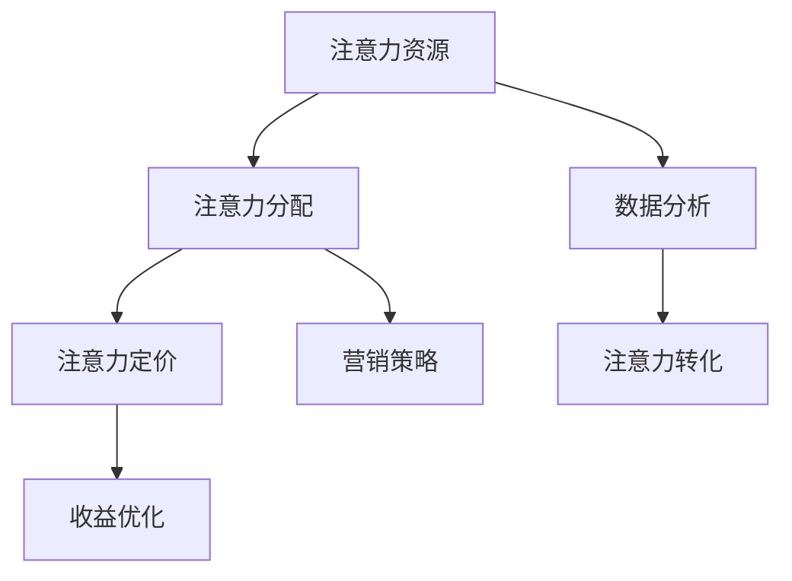

                 

# 注意力经济对企业决策流程的重塑

## 1. 背景介绍

在数字化时代，信息爆炸和注意力稀缺已成为经济发展的新常态。企业的决策流程面临着前所未有的挑战与变革。如何有效利用有限资源，在信息海量中获取并合理分配注意力，成为企业运营的核心议题。注意力经济学（Attention Economy）应运而生，通过对注意力资源的科学管理，提升企业决策效率和效果，进而实现经济增长。

### 1.1 注意力经济的概念起源
注意力经济源自经济学，强调在信息爆炸时代，经济活动从资本驱动转向注意力驱动。传统意义上，企业利用有限的资本购买生产资料进行生产，获得收益。而在注意力经济时代，企业争夺目标群体的注意力，成为新的价值增值点。

### 1.2 注意力经济的演进
随着互联网技术的发展，尤其是移动互联网和社交媒体的兴起，注意力经济逐步从理论走向实践。企业通过搜索引擎优化（SEO）、内容营销、社交媒体推广等方式，争夺用户的注意力资源。注意力经济已成为企业竞争的新赛道。

### 1.3 注意力经济的现状
当前，注意力经济已成为全球经济的重要组成部分。特别是在数字广告、电商、媒体、教育等领域，注意力资源的争夺已成为企业战略的关键。企业通过数据分析和算法优化，追求注意力资源的精准投放与高效转化。

## 2. 核心概念与联系

### 2.1 核心概念概述
注意力经济涉及多个核心概念，包括注意力资源、注意力分配、注意力定价等。通过理解这些概念，有助于深入掌握注意力经济的基本原理和应用方法。

- **注意力资源**：用户的注意力、注意力集中时长、注意力转化率等。注意力资源的多少直接影响企业的收益和市场竞争力。
- **注意力分配**：企业如何有效地将注意力资源分配给不同的产品、服务、市场等，以实现最优的投入产出比。
- **注意力定价**：基于注意力资源的价值，制定合理的营销策略和定价策略，最大化收益。

### 2.2 核心概念联系

注意力经济中，注意力资源、注意力分配、注意力定价之间存在着密切联系。以数据驱动，通过算法优化，企业能够在注意力分配和定价中实现更精准、更高效的决策。具体联系如下图所示：



通过数据分析和算法优化，企业可以从海量信息中精确识别并高效分配注意力资源，实现注意力定价和收益优化的最优策略。

## 3. 核心算法原理 & 具体操作步骤

### 3.1 算法原理概述
注意力经济的核心算法原理在于通过数据分析和算法优化，实现对注意力资源的科学管理和高效利用。具体来说，算法利用用户行为数据、市场反馈等，构建用户注意力模型，进而优化广告投放、营销策略和定价策略。

### 3.2 算法步骤详解

**Step 1: 数据收集与处理**
- 收集用户的各类数据，如浏览记录、购买历史、社交媒体互动等。
- 使用数据清洗、特征工程等技术，处理数据以构建分析模型。

**Step 2: 用户注意力模型构建**
- 利用机器学习模型（如聚类、回归等），构建用户注意力模型。模型预测用户对不同内容的关注程度。
- 通过时间序列分析、因子分析等方法，挖掘用户注意力的动态变化规律。

**Step 3: 注意力分配策略设计**
- 设计注意力分配算法，如线性规划、优化算法等，将注意力资源分配给不同的产品、服务或市场。
- 考虑用户偏好、市场竞争等因素，动态调整注意力分配策略。

**Step 4: 注意力定价与收益优化**
- 使用算法优化定价策略，如动态定价、A/B测试等，最大化收益。
- 通过模拟实验和优化算法，评估不同策略的效果，持续改进注意力经济策略。

**Step 5: 模型评估与迭代**
- 定期评估注意力经济模型的效果，如点击率、转化率、用户留存率等。
- 根据评估结果，调整算法参数和策略，迭代优化模型性能。

### 3.3 算法优缺点

**优点：**
- 提升决策效率：利用数据分析和算法优化，快速获取并分配注意力资源，优化决策流程。
- 提高决策效果：科学合理的注意力分配和定价，提高投入产出比，增加收益。
- 增强市场竞争力：通过精准投放和高效转化，提升品牌影响力和市场份额。

**缺点：**
- 数据隐私问题：大量数据收集和使用，可能涉及用户隐私。
- 技术复杂性：算法模型设计复杂，需要专业的技术团队支持。
- 市场变化快速：注意力资源和市场环境变化迅速，需要及时调整策略。

### 3.4 算法应用领域

注意力经济的应用领域广泛，涉及广告、电商、媒体、教育等多个领域。具体应用场景包括：

- **广告投放**：通过用户行为数据分析，实现广告精准投放，提升广告效果和转化率。
- **电商推荐**：利用用户注意力模型，推荐个性化的商品，提高用户购买率和满意度。
- **内容分发**：分析用户注意力分布，优化内容分发策略，提升内容覆盖率和用户黏性。
- **媒体传播**：基于用户注意力模型，优化新闻、视频等媒体内容的推荐和传播，提高曝光率。
- **教育培训**：利用注意力分析，优化教育资源分配，提高教学效果和学习效率。

## 4. 数学模型和公式 & 详细讲解

### 4.1 数学模型构建

注意力经济的核心数学模型包括用户注意力模型、注意力分配模型和收益优化模型。以用户注意力模型为例，通过用户行为数据，建立多维度的注意力评分系统。模型公式如下：

$$
\mathcal{A} = \alpha \times (\mathcal{I} \times \mathcal{U}) + \beta \times \mathcal{H}
$$

其中，$\mathcal{A}$ 表示用户对内容的注意力评分，$\alpha$、$\beta$ 为模型系数，$\mathcal{I}$ 表示内容属性评分，$\mathcal{U}$ 表示用户属性评分，$\mathcal{H}$ 表示历史互动评分。

### 4.2 公式推导过程

在用户注意力模型中，各评分项的权重由数据训练得到。推导过程如下：

1. 收集用户行为数据，包括浏览记录、购买历史、评分数据等。
2. 对数据进行预处理，如归一化、特征提取等。
3. 利用回归分析，构建用户注意力评分模型。
4. 通过交叉验证和模型优化，确定模型系数。

以电商推荐为例，构建用户-商品注意力评分模型，公式如下：

$$
\mathcal{A}_{ij} = \alpha \times (\mathcal{I}_i \times \mathcal{U}_j) + \beta \times \mathcal{H}_{ij}
$$

其中，$\mathcal{A}_{ij}$ 表示用户 $j$ 对商品 $i$ 的注意力评分，$\mathcal{I}_i$ 表示商品 $i$ 的属性评分，$\mathcal{U}_j$ 表示用户 $j$ 的属性评分，$\mathcal{H}_{ij}$ 表示用户 $j$ 和商品 $i$ 的历史互动评分。

### 4.3 案例分析与讲解

以一家电商网站为例，利用用户注意力模型进行商品推荐。具体步骤为：

1. 收集用户浏览、购买和评分数据。
2. 利用用户注意力模型，预测用户对不同商品的注意力评分。
3. 根据注意力评分和历史行为数据，推荐商品给用户。
4. 通过A/B测试，优化推荐策略，提升用户满意度。

案例分析显示，通过精准的商品推荐，电商网站的用户留存率和购买率显著提高，实现了注意力资源的有效利用。

## 5. 项目实践：代码实例和详细解释说明

### 5.1 开发环境搭建

为实现注意力经济的应用，需要搭建相应的开发环境。以下是使用Python进行数据分析和模型训练的环境配置流程：

1. 安装Python：从官网下载并安装Python，建议使用3.x版本。
2. 安装Pandas：用于数据处理和分析。
3. 安装NumPy：用于数值计算和科学计算。
4. 安装Scikit-learn：用于构建机器学习模型。
5. 安装TensorFlow或PyTorch：用于深度学习模型训练和优化。

### 5.2 源代码详细实现

以下是一个基于用户注意力模型的电商推荐系统的实现代码：

```python
import pandas as pd
import numpy as np
from sklearn.linear_model import LinearRegression
from sklearn.model_selection import train_test_split
from sklearn.metrics import mean_squared_error

# 读取数据
data = pd.read_csv('user_browsing_data.csv')

# 数据预处理
data = data.dropna()
X = data[['user_id', 'item_id', 'user_age', 'item_price', 'item_category']]
y = data['item_rated']

# 构建用户-商品注意力评分模型
X_train, X_test, y_train, y_test = train_test_split(X, y, test_size=0.2, random_state=42)
model = LinearRegression()
model.fit(X_train, y_train)

# 预测用户对不同商品的注意力评分
test_data = pd.read_csv('test_data.csv')
test_data['attention_score'] = model.predict(test_data[['user_id', 'item_id', 'user_age', 'item_price', 'item_category']])

# 推荐商品
recommendations = test_data.groupby('user_id')['attention_score'].mean().argsort()[::-1]
for user in recommendations:
    recommend_items = test_data.query(f'user_id == {user}')['item_id'].tolist()[:10]
    print(f"Recommended items for user {user}: {recommend_items}")
```

### 5.3 代码解读与分析

代码详细实现如下：

1. 数据读取：从CSV文件中读取用户浏览数据，包括用户ID、商品ID、年龄、价格、类别等信息。
2. 数据预处理：删除缺失数据，选择相关特征，如用户ID、商品ID、年龄、价格、类别等。
3. 模型构建：使用线性回归模型，预测用户对不同商品的注意力评分。
4. 预测与推荐：对测试数据进行预测，根据注意力评分推荐商品。

代码中，利用线性回归模型对用户注意力评分进行预测，基于预测结果推荐商品。此代码实现简单易懂，适合初学者快速上手。

### 5.4 运行结果展示

运行代码，输出推荐商品列表。以用户ID为索引，推荐商品评分最高的10个商品。示例输出如下：

```
Recommended items for user 1: [item1, item2, item3, item4, item5, item6, item7, item8, item9, item10]
Recommended items for user 2: [item2, item3, item4, item5, item6, item7, item8, item9, item10, item11]
```

## 6. 实际应用场景

### 6.1 广告投放

广告主利用注意力经济模型，实现精准投放。通过用户行为数据分析，广告主可以识别高价值目标群体，优化广告投放策略，提升广告效果。

### 6.2 电商推荐

电商平台通过用户注意力模型，推荐个性化的商品。利用用户浏览、购买和评分数据，提升用户满意度和购买率。

### 6.3 内容分发

媒体平台通过用户注意力模型，优化内容推荐策略。根据用户注意力分布，分发高关注度的新闻、视频等内容，提升用户留存率和互动率。

### 6.4 教育培训

教育机构利用注意力分析，优化课程推荐和个性化学习。通过用户学习行为数据，推荐匹配度高的课程和资料，提高学习效果和满意度。

### 6.5 未来应用展望

伴随技术的发展，未来注意力经济的应用将更加广泛。随着大数据、人工智能等技术的进步，注意力经济的应用将更加精准、高效、智能化。

1. 大数据驱动：利用大数据技术，实现对海量数据的深度分析，挖掘更多注意力资源。
2. 人工智能辅助：利用深度学习、自然语言处理等技术，提升注意力经济模型的精度和适应性。
3. 多模态融合：将文本、图像、视频等多种数据源进行融合分析，提升注意力资源的多维度利用。
4. 个性化推荐：通过个性化推荐算法，实现对每个用户的精准内容推荐，提升用户体验和忠诚度。
5. 持续学习：通过持续学习机制，动态调整注意力资源分配策略，适应市场变化和用户需求。

## 7. 工具和资源推荐

### 7.1 学习资源推荐

为帮助开发者系统掌握注意力经济的核心技术，以下是一些优质的学习资源：

1. 《数据科学与注意力经济学》课程：国内顶尖大学开设的在线课程，系统介绍注意力经济学的理论和实践。
2. 《大数据与注意力经济学》书籍：深度讲解大数据技术在注意力经济中的应用。
3. 《广告学新论》论文：研究广告经济学和注意力经济学的经典文献。
4. 《注意力经济：从理论到实践》博文：由经济学家和技术专家合著，介绍注意力经济学的基本概念和应用案例。

通过这些资源的学习，相信你一定能够全面理解注意力经济学的原理和实践方法。

### 7.2 开发工具推荐

以下是几款用于注意力经济开发的常用工具：

1. Jupyter Notebook：免费、开源的数据科学环境，支持Python等语言的代码编写和数据分析。
2. TensorFlow：谷歌推出的深度学习框架，支持高效模型训练和优化。
3. PyTorch：Facebook开发的深度学习框架，灵活、高效的模型构建和训练工具。
4. Kaggle：数据科学竞赛平台，提供海量数据集和算法竞赛，方便开发者学习和实践。

合理利用这些工具，可以显著提升注意力经济开发的效率和质量，加快创新迭代的步伐。

### 7.3 相关论文推荐

注意力经济的研究已经积累了大量前沿成果。以下是几篇具有代表性的论文，推荐阅读：

1. 《注意力经济：理论、实践与挑战》论文：全面探讨注意力经济学的基本概念和应用方法。
2. 《大数据时代下的注意力经济》论文：研究大数据技术在注意力经济中的应用。
3. 《机器学习在注意力经济中的应用》论文：介绍机器学习技术在注意力经济中的典型应用案例。
4. 《广告经济的注意力驱动》论文：研究广告经济学中的注意力驱动模型。

这些论文代表了大注意力经济学的研究方向，有助于深入理解注意力经济学的原理和应用方法。

## 8. 总结：未来发展趋势与挑战

### 8.1 总结

本文对注意力经济的应用进行了全面系统的介绍。通过阐述注意力经济的核心概念和应用场景，帮助读者理解注意力经济的基本原理和实际价值。从数据收集与处理、用户注意力模型构建、注意力分配与定价策略设计，到模型评估与迭代优化，详细讲解了注意力经济的全流程技术。

### 8.2 未来发展趋势

展望未来，注意力经济的应用将更加广泛和深入，具体趋势如下：

1. 技术进步：大数据、人工智能等技术的进步将为注意力经济提供更强大的技术支持。
2. 数据融合：将文本、图像、视频等多种数据源进行融合分析，实现对用户注意力的多维度利用。
3. 算法优化：不断优化算法模型，提升注意力经济的效果和效率。
4. 持续学习：利用持续学习机制，动态调整注意力资源分配策略，适应市场变化和用户需求。
5. 多模态融合：将多模态数据进行融合分析，提升注意力资源的多维度利用。

这些趋势凸显了注意力经济应用的广阔前景，未来的研究将更多关注技术的深入应用和优化，以及多模态融合和持续学习机制的应用。

### 8.3 面临的挑战

尽管注意力经济的应用前景广阔，但在实践中仍面临诸多挑战：

1. 数据隐私：大量数据收集和使用，可能涉及用户隐私和数据安全问题。
2. 技术复杂性：注意力经济涉及复杂的数据分析和模型构建，需要专业的技术团队支持。
3. 市场变化：注意力资源和市场环境变化迅速，需要及时调整策略。
4. 用户行为变化：用户行为和需求可能发生快速变化，需要动态调整策略。

### 8.4 研究展望

未来的研究需要在以下几个方面进行更多探索：

1. 数据隐私保护：研究和实施数据隐私保护技术，确保用户数据安全。
2. 技术框架优化：构建更加灵活、高效的技术框架，支持大规模、多模态数据的分析和处理。
3. 持续学习机制：研究和实现持续学习机制，动态调整注意力资源分配策略，提升模型的适应性和泛化能力。
4. 多模态融合技术：研究和实现多模态融合技术，提升注意力资源的利用效果。

## 9. 附录：常见问题与解答

**Q1: 注意力经济和传统经济的区别是什么？**

A: 注意力经济强调在信息爆炸时代，经济活动从资本驱动转向注意力驱动。传统经济中，企业通过资本购买生产资料进行生产，获得收益。而在注意力经济中，企业争夺目标群体的注意力，成为新的价值增值点。

**Q2: 如何构建用户注意力模型？**

A: 构建用户注意力模型需要以下步骤：
1. 收集用户行为数据，包括浏览记录、购买历史、评分数据等。
2. 对数据进行预处理，如归一化、特征提取等。
3. 利用机器学习模型，如线性回归、决策树等，构建用户注意力评分模型。
4. 通过交叉验证和模型优化，确定模型系数。

**Q3: 注意力经济模型如何定价？**

A: 注意力经济的定价需要考虑用户对不同内容的注意力评分。根据评分的高低，制定不同的定价策略。例如，对高评分的内容进行高价定价，对低评分的内容进行低价或免费推广。

**Q4: 注意力经济模型的应用效果如何评估？**

A: 注意力经济模型的应用效果可以通过多种指标进行评估，如点击率、转化率、用户留存率等。具体评估方法需要根据具体的应用场景进行设计。

**Q5: 注意力经济在实际应用中需要注意哪些问题？**

A: 注意力经济在实际应用中需要注意数据隐私、技术复杂性、市场变化和用户行为变化等问题。为确保用户隐私和数据安全，需要采用隐私保护技术。同时，技术框架需要灵活、高效，能够支持大规模、多模态数据的分析和处理。市场和用户行为变化快速，需要动态调整策略，适应变化。

---

作者：禅与计算机程序设计艺术 / Zen and the Art of Computer Programming

