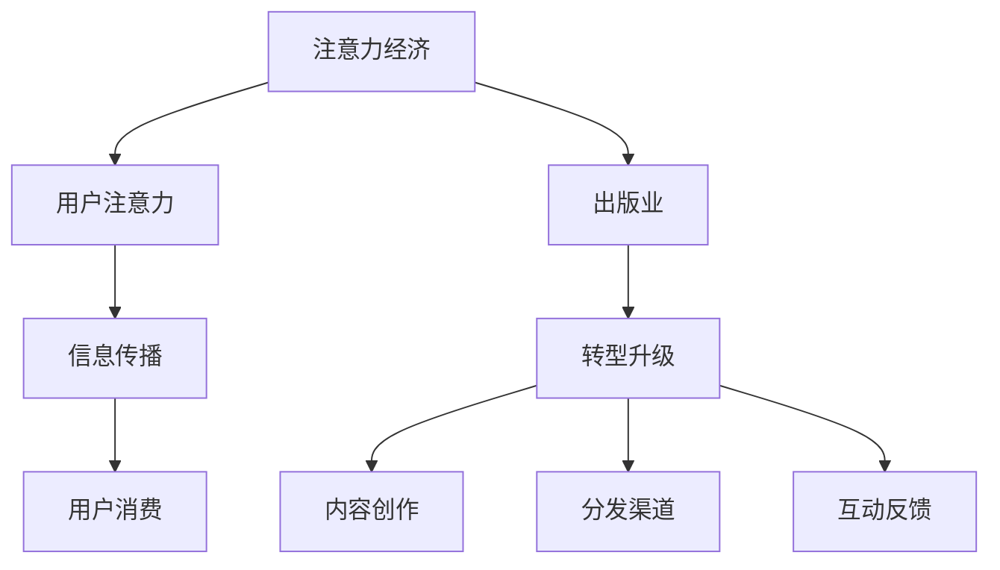

                 

# 注意力经济对传统出版业的转型要求

## 1. 背景介绍

### 1.1 问题由来
随着信息技术的飞速发展，互联网已经成为人们获取和分享信息的主要渠道。海量数据的生成和传播，使得信息市场逐步由卖方市场向买方市场转变。传统出版业面对的是日趋激烈的市场竞争和消费者不断变化的需求。如何在注意力经济的浪潮中保持领先地位，是传统出版业亟需解决的重要课题。

### 1.2 问题核心关键点
注意力经济，即通过吸引用户的注意力，进而实现价值变现的经济模式。在注意力经济背景下，用户的注意力成为一种稀缺资源。如何高效利用注意力，优化信息传播和消费路径，成为了出版业转型的核心关键点。

## 2. 核心概念与联系

### 2.1 核心概念概述

为更好地理解注意力经济对传统出版业的转型要求，本节将介绍几个密切相关的核心概念：

- 注意力经济（Attention Economy）：指通过吸引用户的注意力来创造经济价值的活动，用户注意力被视为一种重要的经济资源。
- 用户注意力（User Attention）：用户对某一产品、服务或信息的关注程度，是衡量信息价值的指标之一。
- 信息传播（Information Dissemination）：指通过各种渠道向用户传递信息的过程，包括内容创作、分发、交互等环节。
- 用户消费（User Consumption）：用户对信息的接受、消化、反馈的过程，是信息传播效果的重要体现。
- 出版业（Publishing Industry）：涵盖图书、期刊、报纸等传统出版物，以及电子出版物、有声读物等新兴出版形态。
- 转型升级（Transformation and Upgrade）：指出版业通过创新和优化业务流程，提升竞争力，适应市场变化的过程。

这些核心概念之间的逻辑关系可以通过以下Mermaid流程图来展示：



这个流程图展示了一些关键概念之间的逻辑关系：

1. 注意力经济通过吸引用户的注意力，实现经济价值。
2. 用户注意力是衡量信息传播效果的指标之一。
3. 信息传播和用户消费构成了注意力经济的闭环。
4. 出版业需要适应注意力经济的转型要求，优化信息传播和消费路径。
5. 内容创作、分发和互动反馈是出版业转型的主要环节。

## 3. 核心算法原理 & 具体操作步骤
### 3.1 算法原理概述

注意力经济下，出版业的核心在于高效利用用户注意力，优化信息传播和消费路径，提升用户参与度和满意度。针对这一目标，本节将介绍基于注意力理论的信息传播优化算法。

基于注意力理论的信息传播优化算法，旨在通过精准定位用户兴趣点，设计合适的内容传播策略，实现信息的高效传递和价值最大化。算法核心思想包括：

- **用户兴趣模型**：通过分析用户行为数据，构建用户兴趣模型，预测用户的潜在关注点。
- **内容推荐算法**：根据用户兴趣模型，推荐相关内容，提升用户关注度和满意度。
- **互动优化**：通过互动反馈机制，调整内容传播策略，不断优化信息传播效果。

### 3.2 算法步骤详解

基于注意力理论的信息传播优化算法一般包括以下几个关键步骤：

**Step 1: 数据准备**
- 收集用户行为数据，如浏览记录、点击率、评论反馈等。
- 预处理数据，提取特征，构建用户兴趣模型。

**Step 2: 用户兴趣建模**
- 使用聚类、分类、推荐等机器学习方法，构建用户兴趣模型。
- 对用户兴趣进行归一化处理，得到用户兴趣向量。

**Step 3: 内容推荐**
- 根据用户兴趣向量，利用协同过滤、基于内容的推荐、深度学习推荐等算法，推荐相关内容。
- 设计推荐策略，如热门推荐、个性化推荐、标签推荐等。

**Step 4: 互动优化**
- 建立互动反馈机制，收集用户对内容的反馈信息，如点赞、评论、分享等。
- 分析反馈信息，调整推荐算法，优化信息传播路径。

**Step 5: 效果评估**
- 对信息传播效果进行评估，如点击率、浏览时间、转化率等指标。
- 根据评估结果，优化用户兴趣模型和推荐算法。

### 3.3 算法优缺点

基于注意力理论的信息传播优化算法具有以下优点：
1. 提升用户关注度和满意度：通过精准推荐内容，吸引用户注意力，提升用户参与度。
2. 优化信息传播路径：根据用户反馈，调整推荐策略，优化信息传播路径，提高传播效果。
3. 数据驱动决策：利用用户行为数据，构建用户兴趣模型，实现数据驱动的决策支持。

同时，该算法也存在一定的局限性：
1. 数据依赖性高：算法的有效性和精度依赖于高质量的用户行为数据。
2. 模型复杂度高：构建用户兴趣模型和推荐算法需要复杂的计算资源。
3. 隐私风险：用户行为数据的收集和分析可能带来隐私风险，需要严格的隐私保护措施。
4. 算法透明性不足：基于深度学习的推荐算法通常是"黑盒"模型，难以解释推荐逻辑。

尽管存在这些局限性，但基于注意力理论的信息传播优化算法仍是大数据时代下出版业转型的重要工具。未来相关研究将聚焦于如何进一步降低数据依赖，提升算法透明性和隐私保护。

### 3.4 算法应用领域

基于注意力理论的信息传播优化算法，已经在多个领域得到了应用，以下是几个典型应用场景：

- **在线教育**：通过分析学生的学习行为数据，精准推荐学习资源，提升学习效果。
- **电子商务**：通过分析用户浏览和购买行为，推荐相关商品，提升销售额。
- **社交媒体**：通过分析用户互动数据，推荐相关内容，提升用户黏性。
- **新闻媒体**：通过分析用户阅读习惯，推荐相关新闻，提升阅读量和用户留存率。
- **广告投放**：通过分析用户点击和浏览行为，精准投放广告，提升广告效果。

除了上述这些经典场景外，基于注意力理论的信息传播优化算法还将拓展到更多领域，如金融服务、健康医疗等，助力各行各业实现数字化转型。

## 4. 数学模型和公式 & 详细讲解 & 举例说明

### 4.1 数学模型构建

本节将使用数学语言对基于注意力理论的信息传播优化算法进行更加严格的刻画。

记用户行为数据为 $D=\{x_i, y_i\}_{i=1}^N$，其中 $x_i$ 为用户行为记录，$y_i$ 为行为标签（如点击、浏览、评论等）。构建用户兴趣模型 $\alpha$，利用训练数据 $D$，最小化损失函数 $\mathcal{L}(\alpha)$，得到优化后的兴趣模型：

$$
\alpha^* = \mathop{\arg\min}_{\alpha} \mathcal{L}(\alpha)
$$

其中 $\mathcal{L}(\alpha)$ 为损失函数，用于衡量用户行为数据与兴趣模型的拟合程度。常见的损失函数包括均方误差、交叉熵等。

### 4.2 公式推导过程

以下我们以二分类任务为例，推导基于注意力理论的信息传播优化算法的公式。

假设用户兴趣向量为 $\alpha \in \mathbb{R}^d$，内容向量为 $v \in \mathbb{R}^d$，内容与兴趣的相似度为 $s(v, \alpha) = v^\top \alpha$。则用户对内容的点击率 $r$ 可表示为：

$$
r(v) = \sigma(s(v, \alpha))
$$

其中 $\sigma$ 为激活函数，如sigmoid函数。利用用户点击率数据 $(r_i, v_i, y_i)$，定义损失函数为：

$$
\mathcal{L}(\alpha) = -\frac{1}{N} \sum_{i=1}^N [y_i\log r(v_i) + (1-y_i)\log(1-r(v_i))]
$$

通过梯度下降等优化算法，最小化损失函数，更新用户兴趣模型 $\alpha$：

$$
\alpha \leftarrow \alpha - \eta \nabla_{\alpha}\mathcal{L}(\alpha)
$$

其中 $\eta$ 为学习率。通过不断迭代优化，可以得到适合用户兴趣的推荐模型。

### 4.3 案例分析与讲解

为了更好地理解基于注意力理论的信息传播优化算法的应用，这里以电商平台为例，分析其在该场景下的具体实现。

假设某电商平台收集了用户的浏览记录 $D=\{x_i\}_{i=1}^N$，其中 $x_i$ 为用户浏览的商品列表。利用这些数据，构建用户兴趣模型 $\alpha$，通过计算商品与兴趣的相似度，推荐相关商品 $v$ 给用户。

具体步骤如下：

1. **数据准备**：收集用户浏览记录，预处理数据，提取特征。
2. **用户兴趣建模**：利用协同过滤、基于内容的推荐等算法，构建用户兴趣模型 $\alpha$。
3. **内容推荐**：计算每件商品的相似度 $s(v_i, \alpha)$，选择相似度最高的商品作为推荐结果。
4. **互动优化**：收集用户对推荐的反馈信息（如点击、浏览、购买），调整推荐算法，优化推荐策略。
5. **效果评估**：通过点击率、浏览时间、购买转化率等指标，评估推荐效果。

在实际应用中，电商平台还可能采用更复杂的算法模型，如基于深度学习的推荐算法，以进一步提升推荐精度和用户满意度。

## 5. 项目实践：代码实例和详细解释说明
### 5.1 开发环境搭建

在进行信息传播优化实践前，我们需要准备好开发环境。以下是使用Python进行TensorFlow开发的环境配置流程：

1. 安装Anaconda：从官网下载并安装Anaconda，用于创建独立的Python环境。

2. 创建并激活虚拟环境：
```bash
conda create -n tensorflow-env python=3.8 
conda activate tensorflow-env
```

3. 安装TensorFlow：根据CUDA版本，从官网获取对应的安装命令。例如：
```bash
conda install tensorflow tensorflow-gpu -c conda-forge
```

4. 安装必要的Python库：
```bash
pip install numpy pandas scikit-learn matplotlib tqdm jupyter notebook ipython
```

完成上述步骤后，即可在`tensorflow-env`环境中开始信息传播优化实践。

### 5.2 源代码详细实现

这里我们以电商平台推荐系统为例，使用TensorFlow实现基于注意力理论的信息传播优化算法。

首先，定义用户兴趣模型和内容向量的表示：

```python
import tensorflow as tf
from tensorflow.keras.layers import Dense

class AttentionModel(tf.keras.Model):
    def __init__(self, hidden_size, output_size):
        super(AttentionModel, self).__init__()
        self.hidden_size = hidden_size
        self.output_size = output_size
        
        self.dense1 = Dense(hidden_size, activation='relu')
        self.dense2 = Dense(output_size, activation='sigmoid')
        
    def call(self, inputs):
        x = self.dense1(inputs)
        alpha = self.dense2(x)
        return alpha

# 构建模型
alpha_model = AttentionModel(64, 2)
```

然后，定义用户行为数据和损失函数：

```python
import numpy as np

# 模拟用户行为数据
train_data = np.random.randn(100, 10)
train_labels = np.random.randint(0, 2, size=(100, 1))

# 定义损失函数
def loss_fn(alpha, x, y):
    scores = alpha(x)
    loss = tf.reduce_mean(tf.nn.sigmoid_cross_entropy_with_logits(logits=scores, labels=y))
    return loss

# 计算损失函数
alpha = alpha_model(tf.constant(train_data))
loss = loss_fn(alpha, train_data, train_labels)
print('Loss:', loss.numpy().mean())
```

最后，通过梯度下降算法优化模型：

```python
# 定义优化器
optimizer = tf.keras.optimizers.Adam(learning_rate=0.001)

# 定义训练过程
@tf.function
def train_step(alpha, x, y):
    with tf.GradientTape() as tape:
        scores = alpha(x)
        loss = tf.reduce_mean(tf.nn.sigmoid_cross_entropy_with_logits(logits=scores, labels=y))
    grads = tape.gradient(loss, alpha.trainable_variables)
    optimizer.apply_gradients(zip(grads, alpha.trainable_variables))
    return loss

# 训练模型
for i in range(1000):
    train_step(alpha_model, train_data, train_labels)
    if i % 100 == 0:
        print('Epoch', i, 'Loss:', loss_fn(alpha_model, train_data, train_labels).numpy().mean())
```

以上就是使用TensorFlow实现基于注意力理论的信息传播优化算法的完整代码实现。可以看到，借助TensorFlow的强大功能，我们能够迅速搭建并优化用户兴趣模型，实现高效的内容推荐。

### 5.3 代码解读与分析

让我们再详细解读一下关键代码的实现细节：

**AttentionModel类**：
- `__init__`方法：初始化模型的输入和输出维度。
- `call`方法：实现模型的前向传播过程，计算兴趣模型与内容的相似度。

**loss_fn函数**：
- 定义损失函数，使用二分类交叉熵损失，衡量预测结果与真实标签的差异。
- 通过梯度下降算法，最小化损失函数。

**train_step函数**：
- 定义单次训练过程，使用优化器更新模型参数。
- 通过TensorFlow的GradientTape记录梯度，并使用优化器更新模型参数。

**训练过程**：
- 定义训练轮数和损失函数，进行模型训练。
- 每100个epoch输出一次损失函数值，观察模型收敛情况。

通过以上代码，我们能够高效构建和优化用户兴趣模型，实现基于注意力理论的信息传播优化算法。在实际应用中，还需要进一步优化数据预处理、模型评估和部署等环节，才能真正实现信息传播的优化效果。

## 6. 实际应用场景
### 6.1 智能推荐系统

基于注意力理论的信息传播优化算法，可以在智能推荐系统中大显身手。通过精准定位用户兴趣，推荐相关内容，智能推荐系统可以显著提升用户满意度和系统效率。

在电商平台上，智能推荐系统可以帮助用户发现更多感兴趣的商品，提高浏览和购买转化率。通过分析用户浏览记录和行为数据，构建用户兴趣模型，推荐相关商品，提升用户体验。例如，当用户浏览某类商品时，智能推荐系统可以推荐类似商品、关联商品、热门商品等，让用户更易找到心仪商品。

### 6.2 内容分发平台

内容分发平台，如社交媒体、视频平台等，也需要利用注意力理论，优化内容传播路径，提高用户参与度。

通过分析用户互动数据，如点赞、评论、分享等，构建用户兴趣模型。基于此模型，内容分发平台可以推荐更多符合用户兴趣的内容，提升用户黏性。例如，社交媒体可以根据用户的历史互动数据，推荐更多用户感兴趣的文章、视频、图文等，增加用户停留时间。

### 6.3 新闻媒体

新闻媒体通过精准推荐相关新闻，提升阅读量和用户留存率。通过分析用户阅读习惯和行为数据，构建用户兴趣模型。基于此模型，新闻媒体可以推荐更多符合用户兴趣的新闻内容，提升用户参与度。例如，新闻媒体可以根据用户的阅读历史和点击行为，推荐相关新闻、热点事件、深度文章等，增加用户阅读量。

### 6.4 广告投放

广告投放也需要利用注意力理论，优化广告投放效果。通过分析用户点击和浏览行为，构建用户兴趣模型。基于此模型，广告平台可以精准投放广告，提升广告效果。例如，电商网站可以根据用户浏览行为，推荐相关广告，提高广告点击率和转化率。

### 6.5 个性化服务

个性化服务是现代服务业的必备要素。通过分析用户行为数据，构建用户兴趣模型，服务提供商可以提供更个性化的服务。例如，酒店可以根据用户预订历史和行为数据，推荐更多符合用户兴趣的房间和服务，提升用户满意度。

## 7. 工具和资源推荐
### 7.1 学习资源推荐

为了帮助开发者系统掌握注意力理论在信息传播优化中的应用，这里推荐一些优质的学习资源：

1. 《深度学习与推荐系统》书籍：介绍深度学习在推荐系统中的应用，涵盖用户兴趣建模、协同过滤、深度学习推荐等前沿话题。
2. 《推荐系统实战》课程：由清华大学开设的推荐系统公开课，有Lecture视频和配套作业，涵盖推荐算法、模型评估、系统部署等各方面内容。
3. 《推荐系统算法》书籍：介绍推荐系统的经典算法和实现细节，适合深入学习推荐算法和系统实现。
4. Kaggle推荐系统竞赛：参与Kaggle推荐系统竞赛，实践注意力理论在推荐系统中的应用，积累实际经验。
5. GitHub推荐系统项目：通过GitHub上优秀的推荐系统项目，学习开源社区的推荐算法和实现方法。

通过对这些资源的学习实践，相信你一定能够系统掌握注意力理论在信息传播优化中的应用，并用于解决实际的推荐系统问题。

### 7.2 开发工具推荐

高效的开发离不开优秀的工具支持。以下是几款用于信息传播优化开发的常用工具：

1. TensorFlow：由Google主导开发的开源深度学习框架，生产部署方便，适合大规模工程应用。支持丰富的机器学习和深度学习算法，是推荐系统开发的利器。
2. PyTorch：基于Python的开源深度学习框架，灵活动态的计算图，适合快速迭代研究。广泛应用于自然语言处理和推荐系统等领域。
3. Weights & Biases：模型训练的实验跟踪工具，可以记录和可视化模型训练过程中的各项指标，方便对比和调优。与主流深度学习框架无缝集成。
4. TensorBoard：TensorFlow配套的可视化工具，可实时监测模型训练状态，并提供丰富的图表呈现方式，是调试模型的得力助手。
5. Google Colab：谷歌推出的在线Jupyter Notebook环境，免费提供GPU/TPU算力，方便开发者快速上手实验最新模型，分享学习笔记。

合理利用这些工具，可以显著提升信息传播优化任务的开发效率，加快创新迭代的步伐。

### 7.3 相关论文推荐

注意力理论在信息传播优化中的应用源于学界的持续研究。以下是几篇奠基性的相关论文，推荐阅读：

1. Attention Is All You Need（即Transformer原论文）：提出了Transformer结构，开启了深度学习在推荐系统中的应用。
2. Deep Interest Model：提出深度兴趣模型，利用深度学习构建用户兴趣模型，提升推荐精度。
3. Gated Attention Networks：提出门控注意力网络，利用注意力机制优化内容推荐效果。
4. Contextual Bandits：介绍上下文强化学习算法，优化推荐系统中的用户反馈机制。
5. Matrix Factorization and Deep Learning for Recommender Systems：综述矩阵分解和深度学习在推荐系统中的应用，提供全面的理论支持。

这些论文代表了大数据时代下推荐系统的最新研究进展，通过学习这些前沿成果，可以帮助研究者把握学科前进方向，激发更多的创新灵感。

## 8. 总结：未来发展趋势与挑战
### 8.1 总结

本文对基于注意力理论的信息传播优化算法进行了全面系统的介绍。首先阐述了注意力经济对传统出版业的转型要求，明确了信息传播优化在出版业转型的核心价值。其次，从原理到实践，详细讲解了算法的数学原理和关键步骤，给出了信息传播优化任务开发的完整代码实例。同时，本文还广泛探讨了算法在智能推荐、内容分发、新闻媒体、广告投放等多个领域的应用前景，展示了注意力理论在信息传播优化中的巨大潜力。此外，本文精选了信息传播优化的各类学习资源，力求为读者提供全方位的技术指引。

通过本文的系统梳理，可以看到，基于注意力理论的信息传播优化算法正在成为大数据时代下出版业转型的重要工具。该算法能够高效利用用户注意力，优化信息传播和消费路径，提升用户参与度和满意度，具有广泛的应用前景。未来，伴随注意力理论的持续演进和推荐系统的发展，信息传播优化技术必将进一步提升出版业的数字化水平，推动出版业向更加智能化、普适化方向发展。

### 8.2 未来发展趋势

展望未来，基于注意力理论的信息传播优化算法将呈现以下几个发展趋势：

1. 算法复杂度降低：通过优化算法设计，降低深度学习算法的计算复杂度，提高信息传播效率。
2. 模型可解释性增强：利用可解释性技术，增强模型的透明性，提高用户信任度。
3. 数据隐私保护加强：通过差分隐私等技术，保护用户数据隐私，降低隐私风险。
4. 跨模态信息融合：将视觉、语音等多模态信息与文本信息融合，提升推荐系统的综合能力。
5. 多领域应用拓展：拓展信息传播优化技术的应用场景，如金融、医疗、教育等，助力更多行业实现数字化转型。
6. 个性化服务优化：结合用户行为数据，实现更加个性化的服务推荐，提升用户满意度和体验。

以上趋势凸显了信息传播优化算法的广阔前景。这些方向的探索发展，必将进一步提升推荐系统的性能和应用范围，为出版业和其他行业的智能化转型提供技术支持。

### 8.3 面临的挑战

尽管基于注意力理论的信息传播优化算法已经取得了瞩目成就，但在迈向更加智能化、普适化应用的过程中，它仍面临着诸多挑战：

1. 数据质量问题：算法的有效性和精度依赖于高质量的数据，但在实际应用中，数据往往存在缺失、噪声等问题，影响算法的性能。
2. 模型可解释性不足：基于深度学习的推荐算法通常是"黑盒"模型，难以解释推荐逻辑，不利于用户理解和信任。
3. 用户隐私保护：数据隐私保护是信息传播优化算法面临的重要挑战，如何在保证推荐效果的同时，保护用户隐私，仍需进一步研究。
4. 跨领域应用困难：将信息传播优化技术应用于不同领域，需要针对具体领域的特点进行适应性调整，难度较大。
5. 技术实现复杂：信息传播优化算法的实现需要跨学科知识，涉及深度学习、统计学、计算机科学等多方面的知识，技术难度较大。

尽管存在这些挑战，但基于注意力理论的信息传播优化算法仍是大数据时代下出版业转型的重要工具。未来研究需要从数据质量、模型透明性、隐私保护等方面寻求新的突破，推动信息传播优化技术的进一步发展和应用。

### 8.4 研究展望

面对信息传播优化算法面临的种种挑战，未来的研究需要在以下几个方面寻求新的突破：

1. 探索无监督和半监督学习算法：摆脱对大规模标注数据的依赖，利用自监督学习、主动学习等无监督和半监督范式，最大限度利用非结构化数据，实现数据驱动的推荐。
2. 研究可解释性技术：利用可解释性技术，增强模型的透明性，提高用户信任度。
3. 融合多模态数据：将视觉、语音等多模态信息与文本信息融合，提升推荐系统的综合能力。
4. 引入博弈论和行为经济学：将博弈论和行为经济学思想引入推荐算法，优化用户反馈机制，提升推荐效果。
5. 关注用户行为隐私：在推荐算法中引入隐私保护技术，保护用户行为数据，降低隐私风险。
6. 构建协同共生生态：结合用户行为数据和外部知识库，构建协同共生推荐生态，提升推荐精度和系统鲁棒性。

这些研究方向的探索，必将引领信息传播优化技术迈向更高的台阶，为出版业和其他行业的智能化转型提供技术支持。相信随着技术的日益成熟，信息传播优化技术必将在更多领域得到应用，为出版业和其他行业带来变革性影响。

## 9. 附录：常见问题与解答

**Q1：信息传播优化算法是否适用于所有推荐场景？**

A: 信息传播优化算法在大多数推荐场景上都能取得不错的效果，特别是对于数据量较大的场景。但对于一些特定领域的推荐，如医疗、法律等，仅依靠通用的用户行为数据可能难以很好地适应。此时需要在特定领域语料上进一步预训练，再进行微调，才能获得理想效果。

**Q2：信息传播优化算法中的损失函数如何选取？**

A: 信息传播优化算法中的损失函数通常采用交叉熵损失，衡量预测结果与真实标签的差异。但针对不同类型的推荐任务，可能需要选择不同的损失函数。例如，对于排名推荐任务，通常使用平均绝对误差损失；对于点击率预测任务，则可以使用负对数似然损失。选择合适的损失函数可以提高算法的性能。

**Q3：信息传播优化算法中如何处理冷启动问题？**

A: 冷启动问题是信息传播优化算法面临的常见挑战之一。对于新用户或新商品，缺乏足够的历史数据，难以构建准确的兴趣模型。常用的解决方案包括：
1. 利用先验知识，如领域知识库、专家推荐等，进行初始推荐。
2. 采用协同过滤等算法，利用相似用户的兴趣进行推荐。
3. 引入主题模型等技术，将用户行为数据转化为主题表示，提升推荐效果。

**Q4：信息传播优化算法中如何处理推荐系统的多目标优化问题？**

A: 信息传播优化算法通常以最大化点击率、转化率等指标为目标，但在实际应用中，推荐系统需要同时考虑多个目标，如用户满意度、系统公平性、商家利润等。常用的解决方案包括：
1. 利用多目标优化技术，如线性规划、多目标遗传算法等，综合优化多个目标。
2. 引入带约束的优化方法，如基于约束的排序算法，优化多个目标。
3. 结合领域知识，利用多目标决策树等技术，优化推荐策略。

通过合理选择损失函数和优化方法，可以有效处理推荐系统的多目标优化问题，提升推荐效果。

**Q5：信息传播优化算法中如何平衡推荐精度和多样性？**

A: 推荐精度和多样性是信息传播优化算法面临的重要平衡问题。过于关注精度，可能导致推荐结果单一，缺乏多样性；过于关注多样性，可能导致推荐结果过于泛化，精度不足。常用的解决方案包括：
1. 引入多样性约束，如top-k排序、基于不确定性的多样性排序等，平衡推荐精度和多样性。
2. 利用双线性推荐等技术，综合考虑精度和多样性，优化推荐结果。
3. 结合领域知识，利用多目标优化技术，平衡推荐精度和多样性。

合理平衡推荐精度和多样性，可以有效提升推荐系统的综合性能。

**Q6：信息传播优化算法中如何处理长尾问题？**

A: 长尾问题是指在推荐系统中，热门商品和长尾商品的推荐精度差异较大，长尾商品推荐效果不理想。常用的解决方案包括：
1. 利用兴趣模型预测长尾商品的评分，提升长尾商品推荐效果。
2. 引入流行度过滤机制，只推荐热门商品，避免长尾商品的影响。
3. 结合领域知识，利用先验规则进行长尾商品推荐，提升推荐效果。

通过合理处理长尾问题，可以有效提升信息传播优化算法的综合性能。

通过本文的系统梳理，可以看到，基于注意力理论的信息传播优化算法正在成为大数据时代下出版业转型的重要工具。该算法能够高效利用用户注意力，优化信息传播和消费路径，提升用户参与度和满意度，具有广泛的应用前景。未来，伴随注意力理论的持续演进和推荐系统的发展，信息传播优化技术必将进一步提升出版业的数字化水平，推动出版业向更加智能化、普适化方向发展。相信随着技术的日益成熟，信息传播优化技术必将在更多领域得到应用，为出版业和其他行业的智能化转型提供技术支持。总之，信息传播优化需要开发者根据具体任务，不断迭代和优化算法、数据和模型，方能得到理想的效果。

