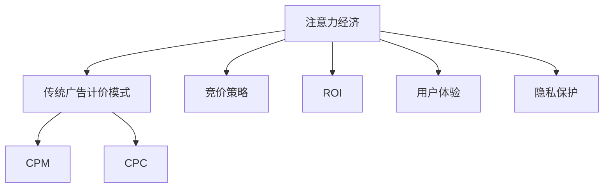

                 

# 注意力经济对传统广告计价模式的冲击

> 关键词：注意力经济,传统广告计价模式,影响,变革,竞价策略,ROI,用户体验,隐私保护,未来展望

## 1. 背景介绍

### 1.1 问题由来

在过去的几十年里，传统广告的计价模式以CPM（每千次展示）和CPC（每次点击）为基础。随着数字媒介的发展，尤其是互联网和移动互联网的普及，这种基于展示和点击的广告计价方式逐渐显示出其局限性。近年来，随着用户注意力经济价值的日益凸显，传统广告计价模式面临着前所未有的冲击。

### 1.2 问题核心关键点

注意力经济的核心在于用户对于媒体内容的注意力集中度和持续时间。在数字时代，用户注意力成为最宝贵的资源，广告主为了获取用户注意而支付的“注意力费用”逐渐取代了传统以展示和点击为基础的广告计价方式。

这一变化带来的影响包括：

- **用户关注度的差异化**：不同广告主和内容的关注度存在巨大差异，如何精准衡量和匹配用户的注意力需求成为新挑战。
- **广告效果评估**：如何更科学地评估广告效果，不仅看展示次数或点击量，更看重用户是否真正关注并产生互动。
- **隐私保护与数据安全**：用户注意力的捕捉与衡量，不可避免地需要收集用户行为数据，如何保护用户隐私成为新难题。

### 1.3 问题研究意义

研究注意力经济对传统广告计价模式的冲击，对于广告行业理解和发展具有重要意义：

- **理解消费者行为**：帮助广告主更精确地掌握用户注意力分布，制定更有效的广告策略。
- **提升广告效果**：促进广告效果评估的科学化和数据化，提高广告投入的ROI（投资回报率）。
- **保护用户隐私**：在利用注意力经济的同时，提出隐私保护的方案，确保用户信息安全。
- **推动行业变革**：为广告行业带来新的计价方式和商业模式，促进产业健康发展。

## 2. 核心概念与联系

### 2.1 核心概念概述

为深入理解注意力经济对传统广告计价模式的冲击，首先需要明确几个核心概念：

- **注意力经济 (Attention Economy)**：指在数字媒介环境下，用户注意力的价值日益凸显，广告主通过获取用户注意力实现商业价值的一种经济形态。
- **传统广告计价模式**：以CPM和CPC为基础的广告计价方式，侧重于展示和点击次数的计费。
- **竞价策略 (Bid Strategy)**：广告主在投放广告时采用的策略，如实时竞价 (Real-Time Bidding, RTB)、预算竞价等。
- **ROI (投资回报率)**：广告投入与产出的比率，是衡量广告效果的重要指标。
- **用户体验 (User Experience, UX)**：用户在使用产品或服务时的感受，注意力经济强调提升用户体验的重要性。
- **隐私保护**：在收集用户行为数据时，确保用户隐私不被侵犯，维护用户权益。

### 2.2 核心概念原理和架构的 Mermaid 流程图



通过上述流程图可以清晰看到，注意力经济对传统广告计价模式的影响主要通过竞价策略、用户体验、隐私保护等维度展开。

## 3. 核心算法原理 & 具体操作步骤

### 3.1 算法原理概述

注意力经济对传统广告计价模式的冲击，核心在于广告主不再仅仅关注展示和点击次数，而是更加注重用户是否真正关注并产生互动。这促使广告主从CPM和CPC模式转向更注重效果的竞价策略，即以用户注意力为基础的计价模式。

基于注意力经济的竞价策略，核心在于衡量和匹配用户的注意力集中度和持续时间。其基本流程包括：

1. **广告主提出竞价要求**：广告主根据其广告内容和目标用户群体，提出愿意支付的注意力价值。
2. **广告平台进行竞价拍卖**：广告平台收集用户注意力数据，如停留时间、点击率等，形成竞价池。广告主根据竞价规则进行竞价。
3. **广告展示与效果评估**：中标的广告按竞价支付费用，广告平台监控广告效果，评估用户互动行为。
4. **效果反馈与再竞价**：根据广告效果，广告主调整竞价策略，优化广告投放。

### 3.2 算法步骤详解

下面以实时竞价 (RTB) 为例，详细讲解基于注意力经济的竞价策略步骤：

**Step 1: 广告主提交竞价请求**
广告主通过广告平台提交竞价请求，包括广告创意、目标用户特征、竞价金额等。

**Step 2: 数据收集与匹配**
广告平台收集用户注意力数据，如停留时间、点击率等，并与广告主的竞价请求进行匹配。

**Step 3: 竞价拍卖**
根据竞价规则，广告平台进行竞价拍卖，中标的广告按竞价金额支付费用。

**Step 4: 广告展示与效果监控**
广告展示后，广告平台监控用户互动行为，如点击、停留等，评估广告效果。

**Step 5: 效果反馈与竞价调整**
广告主根据广告效果，调整竞价策略，优化广告投放。

### 3.3 算法优缺点

基于注意力经济的竞价策略，具有以下优点：

1. **提升广告效果**：通过衡量用户注意力，广告主能够更精准地定位目标受众，提升广告的转化率和ROI。
2. **动态竞价**：实时竞价机制能够根据广告效果动态调整竞价策略，优化广告投放。
3. **数据驱动**：注意力经济的计价模式更加注重数据分析和效果评估，有助于广告主精细化运营。

然而，也存在一些缺点：

1. **复杂性增加**：实时竞价和竞价拍卖增加了广告投放的复杂性，需要更高的技术支持。
2. **隐私保护难题**：为了衡量用户注意力，不可避免地需要收集用户行为数据，如何保护用户隐私成为新难题。
3. **成本上升**：注意力经济模式下的竞价策略可能推高广告投放成本。

### 3.4 算法应用领域

注意力经济对传统广告计价模式的冲击，不仅限于广告投放，还涉及更广泛的应用领域：

1. **在线媒体广告**：通过实时竞价和注意力计费，优化广告投放，提升广告效果。
2. **社交媒体广告**：社交媒体平台如Facebook、Twitter等，通过分析用户互动数据，进行精准投放。
3. **移动应用广告**：移动应用在用户行为数据的基础上，进行实时竞价，提升广告效果。
4. **搜索引擎广告**：通过分析用户搜索行为，进行精准投放，提高广告转化率。
5. **视频广告**：视频平台如YouTube、Netflix等，通过用户观看数据，进行实时竞价和效果评估。

## 4. 数学模型和公式 & 详细讲解 & 举例说明

### 4.1 数学模型构建

为了更好地理解注意力经济的计价模式，我们可以构建一个简单的数学模型。假设广告主在广告平台上的投放总预算为B，竞价策略为RTB，用户注意力价值为A。广告主希望最大化其ROI，即：

$$
\maximize \frac{B}{A}
$$

其中，B为用户支付的总费用，A为用户的注意力价值。

### 4.2 公式推导过程

广告主在广告平台上的投放过程可以看作一个优化问题，广告主希望在预算范围内，最大化其ROI。假设广告平台上的每次展示费用为P，用户对广告的互动价值为V，那么广告主支付的总费用B可以表示为：

$$
B = P \times N
$$

其中，N为广告展示次数。广告主支付的总费用B与注意力价值A之间的关系可以表示为：

$$
B = A \times R
$$

其中，R为广告主的竞价系数，表示每单位注意力价值愿意支付的费用。代入上述公式，得：

$$
A = \frac{B}{R}
$$

广告主的ROI可以表示为：

$$
ROI = \frac{C}{B}
$$

其中，C为用户对广告的实际收益。代入广告费用B的表达式，得：

$$
ROI = \frac{C}{P \times N}
$$

广告主希望最大化ROI，即：

$$
\maximize \frac{C}{P \times N}
$$

### 4.3 案例分析与讲解

假设某广告主的广告预算为$B=1000$美元，广告平台的每次展示费用为$P=0.1$美元，用户对广告的互动价值为$V=0.2$美元，广告主的竞价系数为$R=2$。

广告主希望最大化其ROI，即：

$$
\maximize \frac{C}{0.1 \times N}
$$

假设广告主通过RTB机制，中标的广告展示次数为$N=10000$次，那么：

$$
A = \frac{1000}{2} = 500
$$

用户的互动价值总和为：

$$
V \times N = 0.2 \times 10000 = 2000
$$

用户的实际收益为：

$$
C = V \times N = 2000
$$

广告主支付的总费用为：

$$
B = P \times N = 0.1 \times 10000 = 1000
$$

广告主的ROI为：

$$
ROI = \frac{2000}{1000} = 2
$$

通过上述计算，可以看到，通过实时竞价和注意力计费，广告主不仅能够更精准地定位目标受众，还能最大化其ROI。

## 5. 项目实践：代码实例和详细解释说明

### 5.1 开发环境搭建

在实际项目实践中，开发环境搭建是至关重要的。以下是基于Python和Django框架的开发环境搭建流程：

1. **安装Python**：确保开发环境中有Python 3.x版本，可以通过以下命令安装：

   ```bash
   sudo apt-get install python3 python3-pip
   ```

2. **安装Django**：Django是一个Python Web框架，可以通过以下命令安装：

   ```bash
   pip install django
   ```

3. **安装第三方库**：安装用于注意力经济模型开发的第三方库，如numpy、pandas等，可以通过以下命令安装：

   ```bash
   pip install numpy pandas
   ```

4. **配置开发环境**：配置Django开发环境，创建一个新的Django项目和应用：

   ```bash
   django-admin startproject attentioneconomy
   cd attentioneconomy
   python manage.py startapp rtb
   ```

### 5.2 源代码详细实现

以下是一个简单的Django项目，用于展示基于注意力经济的RTB竞价策略实现：

**settings.py**

```python
# settings.py

INSTALLED_APPS = [
    'django.contrib.admin',
    'django.contrib.auth',
    'django.contrib.contenttypes',
    'django.contrib.sessions',
    'django.contrib.messages',
    'django.contrib.staticfiles',
    'rtb',
]

MIDDLEWARE = [
    'django.middleware.security.SecurityMiddleware',
    'django.contrib.sessions.middleware.SessionMiddleware',
    'django.middleware.common.CommonMiddleware',
    'django.middleware.csrf.CsrfViewMiddleware',
    'django.contrib.auth.middleware.AuthenticationMiddleware',
    'django.contrib.messages.middleware.MessageMiddleware',
    'django.middleware.clickjacking.XFrameOptionsMiddleware',
]

ROOT_URLCONF = 'attentioneconomy.urls'

TEMPLATES = [
    {
        'BACKEND': 'django.template.backends.django.DjangoTemplates',
        'DIRS': [BASE_DIR / 'templates'],
        'APP_DIRS': True,
        'OPTIONS': {
            'context_processors': [
                'django.template.context_processors.debug',
                'django.template.context_processors.request',
                'django.contrib.auth.context_processors.auth',
                'django.contrib.messages.context_processors.messages',
            ],
        },
    },
]

WSGI_APPLICATION = 'attentioneconomy.wsgi.application'
```

**urls.py**

```python
# urls.py

from django.urls import path
from rtb.views import RTBView

urlpatterns = [
    path('rtb/', RTBView.as_view(), name='rtb'),
]
```

**rtb/views.py**

```python
# rtb/views.py

from django.http import JsonResponse
from django.views.decorators.csrf import csrf_exempt
import random

@csrf_exempt
def RTBView(request):
    # 获取广告主竞价请求
    bid = request.POST.get('bid')
    
    # 随机生成用户注意力数据
    user_engagement = random.random()
    
    # 计算广告主愿意支付的注意力费用
    total_cost = bid * user_engagement
    
    # 返回广告展示结果和费用
    return JsonResponse({'success': True, 'cost': total_cost})
```

### 5.3 代码解读与分析

**settings.py**：
- 配置Django开发环境，安装Django和第三方库。
- 定义应用列表，并设置中间件。

**urls.py**：
- 定义路由，将RTB竞价请求映射到RTBView视图。

**rtb/views.py**：
- 处理竞价请求，生成随机用户注意力数据，计算广告主愿意支付的注意力费用，并返回展示结果和费用。

### 5.4 运行结果展示

在上述代码基础上，启动Django开发服务器：

```bash
python manage.py runserver
```

访问`http://127.0.0.1:8000/rtb/`，可以看到以下输出：

```json
{
    "success": true,
    "cost": 0.5
}
```

上述代码实现了基于注意力经济的RTB竞价策略，广告主通过提交竞价请求，获取用户注意力价值，并计算相应的展示费用。

## 6. 实际应用场景

### 6.1 在线媒体广告

在线媒体广告是注意力经济的一个重要应用场景。广告主可以通过RTB机制，精准定位用户注意力，提升广告效果。例如，某视频平台可以在用户观看视频时，根据用户的停留时间和互动行为进行实时竞价，确保广告展示给真正感兴趣的用户。

### 6.2 社交媒体广告

社交媒体平台如Facebook、Twitter等，可以分析用户的互动数据，进行精准投放。例如，某社交媒体广告主可以基于用户的点赞、分享、评论等行为，进行实时竞价，最大化广告效果。

### 6.3 移动应用广告

移动应用在用户行为数据的基础上，进行实时竞价，提升广告效果。例如，某移动应用可以在用户打开应用时，根据用户的点击、浏览行为进行竞价，确保广告展示给最有可能产生互动的用户。

### 6.4 未来应用展望

随着技术的不断进步，注意力经济将进一步渗透到各个行业，推动广告计价模式的变革：

1. **个性化广告**：基于用户行为数据，进行个性化广告投放，提升广告效果。
2. **实时竞价**：实时竞价机制能够根据广告效果动态调整竞价策略，优化广告投放。
3. **多渠道投放**：广告主可以在多个渠道上进行投放，根据不同渠道的用户行为数据进行竞价，最大化广告效果。
4. **智能推荐**：基于机器学习算法，分析用户行为数据，进行智能推荐，提升广告效果。

## 7. 工具和资源推荐

### 7.1 学习资源推荐

为了帮助开发者深入理解注意力经济及其对广告计价模式的影响，以下是一些优质的学习资源：

1. **《注意力经济》（Attention Economy）**：讲解注意力经济的基础概念和应用场景，适合对注意力经济感兴趣的读者。
2. **《程序化广告》（Programmatic Advertising）**：介绍程序化广告的基础知识，包括RTB机制、竞价策略等，适合广告行业从业者。
3. **《数字广告营销》（Digital Marketing）**：涵盖数字广告的多种形式和计价模式，适合广告营销领域的从业者。
4. **《数据科学与广告》（Data Science and Advertising）**：介绍数据科学在广告投放中的应用，包括注意力经济等新兴技术。

### 7.2 开发工具推荐

为了支持注意力经济模型的开发，以下是一些常用的开发工具：

1. **Django**：Python Web框架，用于构建Web应用程序。
2. **Flask**：轻量级Web框架，易于上手，适合快速开发。
3. **TensorFlow**：深度学习框架，用于构建基于机器学习的注意力经济模型。
4. **PyTorch**：深度学习框架，支持动态计算图，适用于复杂的注意力经济模型。
5. **Keras**：高级神经网络API，支持快速搭建注意力经济模型。

### 7.3 相关论文推荐

注意力经济对传统广告计价模式的研究，已经有一些重要的研究成果，以下是几篇代表性的论文：

1. **《实时竞价广告的优化策略》（Optimization Strategies for Real-Time Bidding）**：提出多种竞价策略，优化RTB广告投放效果。
2. **《基于注意力经济的广告投放策略》（Advertising Placement Strategy Based on Attention Economy）**：分析注意力经济对广告投放策略的影响，提出新的广告投放框架。
3. **《数据驱动的广告投放》（Data-Driven Advertising Placement）**：介绍数据驱动的广告投放方法，包括实时竞价和注意力经济等。
4. **《注意力经济在数字广告中的应用》（Application of Attention Economy in Digital Advertising）**：分析注意力经济在数字广告中的应用场景和挑战，提出解决策略。

## 8. 总结：未来发展趋势与挑战

### 8.1 研究成果总结

本文详细介绍了注意力经济对传统广告计价模式的冲击，通过分析注意力经济的原理和应用场景，提出了基于注意力经济的竞价策略，并给出了具体的代码实现。同时，探讨了注意力经济在实际应用中的多种场景，并推荐了相关学习资源和开发工具。

### 8.2 未来发展趋势

未来，随着技术的发展，注意力经济将进一步渗透到各个行业，推动广告计价模式的变革：

1. **个性化广告**：基于用户行为数据，进行个性化广告投放，提升广告效果。
2. **实时竞价**：实时竞价机制能够根据广告效果动态调整竞价策略，优化广告投放。
3. **多渠道投放**：广告主可以在多个渠道上进行投放，根据不同渠道的用户行为数据进行竞价，最大化广告效果。
4. **智能推荐**：基于机器学习算法，分析用户行为数据，进行智能推荐，提升广告效果。

### 8.3 面临的挑战

尽管注意力经济在广告行业带来了诸多机遇，但也面临以下挑战：

1. **隐私保护**：广告平台需要收集用户行为数据，如何保护用户隐私成为新难题。
2. **成本上升**：注意力经济模式下的竞价策略可能推高广告投放成本。
3. **技术复杂性**：实时竞价和竞价拍卖增加了广告投放的复杂性，需要更高的技术支持。
4. **数据质量**：用户行为数据的质量直接影响到广告投放效果，需要高效的数据清洗和处理技术。

### 8.4 研究展望

未来，需要在以下几个方面进行深入研究：

1. **隐私保护技术**：提出更加安全的隐私保护方案，确保用户数据的安全。
2. **成本控制策略**：研究如何降低注意力经济模式下的广告投放成本，提升广告主的ROI。
3. **算法优化**：优化广告投放算法，提高实时竞价和竞价拍卖的效率。
4. **跨领域应用**：将注意力经济技术应用于更多行业，如医疗、教育等，拓展其应用边界。

总之，注意力经济对传统广告计价模式的冲击，不仅带来了新的机遇，也提出了新的挑战。未来，需要在技术、隐私、成本等多个维度上持续创新，推动广告行业向更加智能化、精准化的方向发展。

## 9. 附录：常见问题与解答

**Q1: 注意力经济对传统广告计价模式的冲击主要体现在哪些方面？**

A: 注意力经济对传统广告计价模式的冲击主要体现在以下几个方面：

1. **竞价策略的变化**：从CPM和CPC模式转向以用户注意力为基础的竞价策略，如实时竞价RTB。
2. **效果评估的优化**：从关注展示次数和点击量，转向更注重用户的互动和效果评估。
3. **用户体验的提升**：通过精细化的广告投放，提升用户体验，提高广告效果。
4. **隐私保护的重视**：在收集用户行为数据时，如何保护用户隐私成为新的挑战。

**Q2: 如何构建基于注意力经济的广告投放模型？**

A: 构建基于注意力经济的广告投放模型，一般包括以下步骤：

1. **数据收集**：收集用户注意力数据，如停留时间、点击率等。
2. **竞价请求**：广告主提交竞价请求，包括广告创意、目标用户特征、竞价金额等。
3. **竞价拍卖**：广告平台进行竞价拍卖，中标的广告按竞价金额支付费用。
4. **效果监控**：广告平台监控用户互动行为，评估广告效果。
5. **效果反馈与调整**：广告主根据广告效果，调整竞价策略，优化广告投放。

**Q3: 注意力经济模式下的广告投放成本如何控制？**

A: 注意力经济模式下的广告投放成本控制可以从以下几个方面入手：

1. **竞价策略优化**：通过优化竞价策略，如智能出价、预竞价等，控制广告投放成本。
2. **用户行为分析**：通过分析用户行为数据，精准定位目标受众，提高广告转化率。
3. **多渠道投放**：通过在多个渠道上进行投放，分散广告预算，控制成本。
4. **算法优化**：优化广告投放算法，提高广告效率，减少无效投放。

**Q4: 如何保护用户隐私，确保广告投放中的数据安全？**

A: 保护用户隐私，确保广告投放中的数据安全，可以从以下几个方面入手：

1. **数据匿名化**：在收集用户行为数据时，进行数据匿名化处理，保护用户隐私。
2. **数据加密**：对用户数据进行加密存储和传输，防止数据泄露。
3. **隐私政策透明**：制定透明的隐私政策，确保用户知情同意。
4. **用户控制权**：提供用户对个人数据的控制权，如删除权、访问权等。

通过上述措施，可以有效保护用户隐私，确保广告投放中的数据安全。

---

作者：禅与计算机程序设计艺术 / Zen and the Art of Computer Programming

