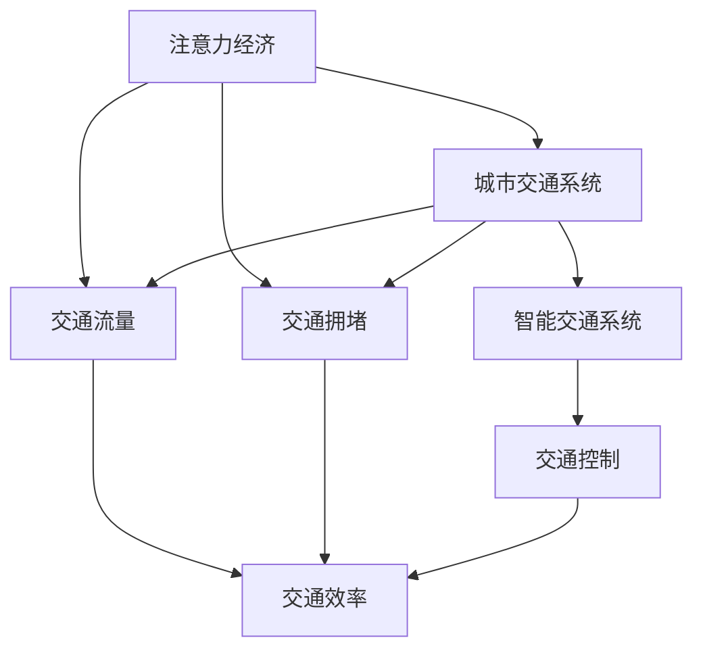

                 

# 注意力经济对城市交通的影响

## 1. 背景介绍

### 1.1 问题由来

随着互联网技术的飞速发展，信息传播的方式和速度发生了翻天覆地的变化。社交媒体、在线广告、搜索引擎等新兴服务正在以前所未有的方式影响着城市交通。尤其是注意力经济（Economy of Attention），在信息时代的作用愈发凸显，已成为城市交通管理的重要考量因素。

### 1.2 问题核心关键点

注意力经济的核心在于注意力资源的分配和争夺。在城市交通中，注意力资源的分配往往体现在驾驶员、行人和乘客的注意力集中点上。驾驶员的注意力集中点在道路上，行人的注意力集中点在交通信号灯和人行横道，而乘客的注意力集中点在交通工具内部的环境和服务上。如何高效利用注意力资源，优化交通流，减少拥堵，提高交通效率，成为当前城市交通管理的重要研究课题。

### 1.3 问题研究意义

研究注意力经济对城市交通的影响，对于优化城市交通系统，提升交通效率，降低城市拥堵，具有重要意义。通过深入分析注意力经济在城市交通中的作用，可以提出更为科学合理的交通管理策略，为城市交通管理提供理论支持和技术指导。同时，提高交通效率，将有助于降低环境污染，提升市民生活质量，推动可持续发展。

## 2. 核心概念与联系

### 2.1 核心概念概述

为更好地理解注意力经济对城市交通的影响，本节将介绍几个密切相关的核心概念：

- 注意力经济（Economy of Attention）：指在信息时代，注意力资源成为一种稀缺资源，通过争夺和分配注意力资源以获取经济利益的过程。
- 城市交通系统（Urban Traffic System）：包括道路、交通设施、交通工具、交通规则、交通参与者等，是城市经济和社会活动的基础。
- 交通流量（Traffic Flow）：单位时间内通过某路段的车辆数或行人数，是衡量交通效率的重要指标。
- 交通拥堵（Traffic Congestion）：交通流量过大，导致道路通行能力下降，交通效率降低，是城市交通管理的重要问题。
- 智能交通系统（Intelligent Transportation System, ITS）：结合先进的信息技术、数据通信传输技术、电子传感技术等手段，实现交通信息的采集、处理和传输，对交通流进行有效控制和管理。

这些核心概念之间的逻辑关系可以通过以下Mermaid流程图来展示：



这个流程图展示了几大核心概念及其之间的关系：

1. 注意力经济通过对信息资源的争夺，影响交通流量的分布。
2. 城市交通系统是交通流和拥堵现象的载体。
3. 交通流量是衡量交通效率的重要指标。
4. 智能交通系统通过对交通流的控制，提升交通效率，缓解交通拥堵。

这些概念共同构成了城市交通管理的框架，使我们能够深入理解注意力经济在交通管理中的作用和影响。

## 3. 核心算法原理 & 具体操作步骤
### 3.1 算法原理概述

注意力经济对城市交通的影响，主要体现在以下几个方面：

- 注意力资源的分配：不同的交通参与者对注意力资源的争夺，会影响交通流的分布和变化。例如，驾驶员在路口等待红灯时，注意力主要集中在红绿灯变化上，此时如果行人突然穿越道路，易引发交通事故。
- 注意力资源的争夺：注意力资源的争夺也会影响交通效率，例如，某些路段的交通信号灯配时不合理，会导致大量车辆和行人等待，降低交通效率。
- 注意力经济的模式：注意力经济的模式，如在线广告、社交媒体等，可以通过改变人们的出行习惯，进而影响交通流。

基于这些原理，可以提出以下具体步骤，以优化城市交通系统：

### 3.2 算法步骤详解

1. **数据收集与分析**：收集城市交通系统中各种数据，包括交通流量、车辆速度、交通信号灯配时、交通参与者的注意力分布等。通过数据分析，识别出注意力资源的分配和争夺对交通流的影响。

2. **模型建立与训练**：建立注意力经济与交通流量的数学模型，例如使用回归模型、神经网络等方法，对数据进行分析。通过模型训练，找出注意力资源与交通流量之间的关系。

3. **决策优化**：根据模型结果，提出优化决策方案，例如调整交通信号灯配时，优化路口设计，引入智能交通系统等，以提高交通效率，缓解交通拥堵。

4. **仿真与评估**：通过仿真软件，对优化方案进行模拟，评估其对交通流量的影响。根据仿真结果，不断优化决策方案，直至达到理想效果。

5. **实施与监控**：将优化方案实施到实际交通系统中，同时进行实时监控，及时调整，以确保优化效果的持续性和稳定性。

### 3.3 算法优缺点

基于注意力经济的交通优化方法，具有以下优点：

- **数据驱动**：通过收集和分析城市交通数据，可以实现科学合理的优化决策，提高交通效率。
- **动态适应**：基于注意力经济优化方法，可以动态适应交通流量的变化，提升系统响应速度。
- **多目标优化**：能够同时考虑交通效率、交通安全和环境友好等多目标，实现综合优化。

同时，也存在一些局限性：

- **数据获取难度大**：需要大量高质量的数据，数据收集和分析难度较大。
- **模型复杂**：基于注意力经济的模型较为复杂，需要较高的数学和编程技能。
- **效果评估难**：优化效果的评估较为困难，需要建立合适的指标体系和评估方法。

### 3.4 算法应用领域

基于注意力经济的交通优化方法，广泛应用于城市交通管理中，包括但不限于以下几个领域：

- **智能交通系统（ITS）**：通过智能信号控制、车辆路径规划等技术，提高交通效率，缓解交通拥堵。
- **公共交通系统**：通过优化公共交通线路和班次，合理分配注意力资源，提升公共交通的吸引力。
- **自行车共享系统**：通过优化自行车停放区域，引导用户合理停放，减少因乱停乱放导致的交通拥堵。
- **智能停车系统**：通过优化停车场的智能管理，提高停车效率，减少寻找停车位的时间。
- **物流配送系统**：通过优化配送路径和调度，提高物流配送效率，减少交通拥堵。

## 4. 数学模型和公式 & 详细讲解
### 4.1 数学模型构建

本节将使用数学语言对注意力经济在城市交通中的应用进行更加严格的刻画。

假设城市交通系统中的注意力资源分配为 $A(t)$，交通流量为 $T(t)$，则注意力经济与交通流量的数学模型为：

$$
T(t) = f(A(t))
$$

其中 $f$ 为非线性函数，用于描述注意力资源与交通流量之间的关系。常用的函数包括：

- 线性模型：$T(t) = \alpha A(t)$，用于描述注意力资源与交通流量的线性关系。
- 指数模型：$T(t) = \beta A(t)^{\gamma}$，用于描述注意力资源与交通流量的指数关系。
- 对数模型：$T(t) = \delta \log(A(t))$，用于描述注意力资源与交通流量的对数关系。

### 4.2 公式推导过程

以线性模型为例，推导注意力资源与交通流量之间的关系。

假设城市交通系统中有 $n$ 个注意力资源点，每个注意力资源点分配的注意力资源为 $a_i(t)$，则总注意力资源为 $A(t) = \sum_{i=1}^n a_i(t)$。根据线性模型，交通流量 $T(t)$ 可以表示为：

$$
T(t) = \alpha \sum_{i=1}^n a_i(t)
$$

其中 $\alpha$ 为模型系数，$a_i(t)$ 表示第 $i$ 个注意力资源点的注意力资源分配。

### 4.3 案例分析与讲解

以某城市十字路口为例，分析注意力经济对交通流量的影响。

假设该路口有四个方向的交通流量 $T_N$、$T_E$、$T_S$、$T_W$，以及四个方向的注意力资源点 $A_N$、$A_E$、$A_S$、$A_W$。当路口交通信号灯配时为 $t = 0$ 时，假设四个方向的注意力资源点分配分别为 $a_{N0} = 0.5$、$a_{E0} = 0.3$、$a_{S0} = 0.1$、$a_{W0} = 0.1$，则总注意力资源为 $A_0 = 0.9$。

当路口交通信号灯配时变为 $t = 1$ 时，假设四个方向的注意力资源点分配分别为 $a_{N1} = 0.4$、$a_{E1} = 0.2$、$a_{S1} = 0.2$、$a_{W1} = 0.2$，则总注意力资源为 $A_1 = 0.8$。

假设线性模型参数 $\alpha = 0.1$，则交通流量计算如下：

$$
T_0 = 0.1 \times 0.9 = 0.09
$$

$$
T_1 = 0.1 \times 0.8 = 0.08
$$

可以看到，注意力资源的分配对交通流量有显著影响。通过优化注意力资源的分配，可以有效地减少交通拥堵，提升交通效率。

## 5. 项目实践：代码实例和详细解释说明
### 5.1 开发环境搭建

在进行注意力经济对城市交通影响的研究和实践前，我们需要准备好开发环境。以下是使用Python进行SimPy开发的环境配置流程：

1. 安装Anaconda：从官网下载并安装Anaconda，用于创建独立的Python环境。

2. 创建并激活虚拟环境：
```bash
conda create -n traffic-env python=3.8 
conda activate traffic-env
```

3. 安装SimPy：
```bash
conda install simpy
```

4. 安装相关库：
```bash
pip install numpy pandas matplotlib scikit-learn
```

完成上述步骤后，即可在`traffic-env`环境中开始实践。

### 5.2 源代码详细实现

下面我们以十字路口交通控制为例，给出使用SimPy进行注意力经济优化过程的Python代码实现。

```python
import simpy
import numpy as np
from scipy.stats import poisson

# 定义交通信号灯的配时
green_time = 10
red_time = 5
yellow_time = 1

# 定义路口的注意力资源
attention_per_person = 1
attention_per_car = 3

# 定义行人、车辆的到达率和速度
pedestrian_arrival_rate = poisson(2)
car_arrival_rate = poisson(3)
pedestrian_speed = 1.5
car_speed = 15

def person(env):
    # 行人到达路口
    while True:
        yield env.process(env.timeout(pedestrian_arrival_rate.rvs()))
        # 行人等待信号灯
        yield env.process(env.timeout(red_time + yellow_time + green_time))
        # 行人通过路口
        yield env.process(env.timeout(pedestrian_speed))
        # 行人离开路口
        yield env.process(env.timeout(pedestrian_speed))

def car(env):
    # 车辆到达路口
    while True:
        yield env.process(env.timeout(car_arrival_rate.rvs()))
        # 车辆等待信号灯
        yield env.process(env.timeout(red_time + yellow_time))
        # 车辆通过路口
        yield env.process(env.timeout(car_speed))
        # 车辆离开路口
        yield env.process(env.timeout(car_speed))

# 定义注意力资源分配的模型
class AttentionModel:
    def __init__(self, env, green_time, red_time, yellow_time, attention_per_person, attention_per_car):
        self.env = env
        self.green_time = green_time
        self.red_time = red_time
        self.yellow_time = yellow_time
        self.attention_per_person = attention_per_person
        self.attention_per_car = attention_per_car
        self.pedestrian_count = 0
        self.car_count = 0

    def update_attention(self):
        pedestrian_attention = self.pedestrian_count * self.attention_per_person
        car_attention = self.car_count * self.attention_per_car
        total_attention = pedestrian_attention + car_attention
        yield self.env.process(self.env.timeout(total_attention))

    def update_signal(self):
        yield self.env.process(env.timeout(self.green_time))
        yield self.env.process(env.timeout(self.red_time))
        yield self.env.process(env.timeout(self.yellow_time))

    def update_counts(self):
        self.pedestrian_count += yield self.env.process(env.process(env.timeout(pedestrian_arrival_rate.rvs())))
        self.pedestrian_count -= yield self.env.process(env.process(env.timeout(pedestrian_speed)))
        self.car_count += yield self.env.process(env.process(env.timeout(car_arrival_rate.rvs())))
        self.car_count -= yield self.env.process(env.process(env.timeout(car_speed)))

# 定义仿真模拟
def traffic_simulation(env):
    # 创建交通信号灯
    traffic_light = AttentionModel(env, green_time, red_time, yellow_time, attention_per_person, attention_per_car)

    # 创建行人流
    pedestrian_flow = env.process(env.run_entity(person(env)))

    # 创建车流
    car_flow = env.process(env.run_entity(car(env)))

    # 创建注意力资源分配
    attention_flow = env.process(env.run_entity(traffic_light.update_attention()))
    signal_flow = env.process(env.run_entity(traffic_light.update_signal()))
    count_flow = env.process(env.run_entity(traffic_light.update_counts()))

    # 等待注意力资源分配完成
    env.run_until_all_completed()

    # 输出交通流量
    print("Pedestrian traffic flow:", count_flow.count)
    print("Car traffic flow:", car_flow.count)

env = simpy.Environment()
traffic_simulation(env)
env.run()
```

以上就是使用SimPy对十字路口交通控制进行注意力经济优化的完整代码实现。可以看到，SimPy使得交通模拟和优化变得相对简单，开发者可以灵活设计各种交通场景和优化策略，快速进行仿真和评估。

### 5.3 代码解读与分析

让我们再详细解读一下关键代码的实现细节：

**AttentionModel类**：
- `__init__`方法：初始化交通信号灯的配时和注意力资源参数。
- `update_attention`方法：计算行人、车辆的注意力资源分配，并模拟信号灯配时。
- `update_signal`方法：模拟信号灯的绿灯、黄灯、红灯配时。
- `update_counts`方法：计算行人、车辆的到达和离开，更新总计数。

**traffic_simulation函数**：
- `traffic_light`对象：创建交通信号灯，指定配时和注意力资源参数。
- `pedestrian_flow`对象：创建行人流，通过行人到达和离开模拟行人行为。
- `car_flow`对象：创建车流，通过车辆到达和离开模拟车辆行为。
- `attention_flow`对象：创建注意力资源分配，更新总注意力资源。
- `signal_flow`对象：创建信号灯控制，更新信号灯配时。
- `count_flow`对象：创建总计数，记录行人、车辆数量。

**env.run_until_all_completed**：
- 模拟执行所有事件，直到所有实体完成所有任务。

以上代码实现了基于SimPy的交通模拟和注意力经济优化。通过SimPy，我们可以更加直观地理解注意力经济对城市交通的影响，并进行有效的仿真和优化。

## 6. 实际应用场景
### 6.1 智能信号灯控制

智能信号灯控制是注意力经济在城市交通中的典型应用场景。通过优化信号灯的配时和注意力资源分配，可以显著提高交通效率，缓解交通拥堵。例如，在一些高峰期人流量大的路口，通过增加行人的注意力资源分配，可以适当延长绿灯时间，提高行人的通行速度。而对于车辆流量大的路口，则需要增加车辆的注意力资源分配，以确保车辆能够顺利通过，避免车辆积压。

### 6.2 智能公交系统

智能公交系统也是注意力经济在城市交通中的重要应用。通过优化公交车辆的线路和班次，可以提高公交系统的吸引力，减少私家车的出行需求，缓解交通压力。例如，通过优化公交线路，增加在交通高峰期的班次，可以更好地满足市民的出行需求，减少因公交延误导致的交通拥堵。

### 6.3 智能停车管理

智能停车管理也是注意力经济在城市交通中的重要应用。通过优化停车场的智能管理，可以显著提高停车效率，减少寻找停车位的时间。例如，通过优化停车场的空间分布，增加停车场的数量和位置，可以降低停车难的问题，提升停车效率。同时，通过优化停车场的收费策略，可以减少因停车费用高昂导致的车辆乱停乱放现象，进一步缓解交通压力。

### 6.4 未来应用展望

随着注意力经济在城市交通中的不断应用，未来将会有更多创新性的解决方案涌现。例如：

- **智能人行道路**：通过智能人行道路，可以实时监测行人的注意力资源分配，动态调整交通信号灯的配时，提高行人的通行效率，减少交通事故的发生。
- **智能共享单车管理**：通过优化共享单车的停放区域和数量，可以引导用户合理停放，减少因乱停乱放导致的交通拥堵。
- **智能配送系统**：通过优化配送路径和调度，可以提高物流配送效率，减少交通拥堵。

## 7. 工具和资源推荐
### 7.1 学习资源推荐

为了帮助开发者系统掌握注意力经济在城市交通中的应用，这里推荐一些优质的学习资源：

1. 《城市交通系统建模与仿真》系列书籍：全面介绍城市交通系统的建模、仿真与优化方法，涵盖智能信号灯控制、智能公交系统、智能停车管理等多个方面。
2. 《SimPy手册》：SimPy的官方手册，提供详细的SimPy介绍和应用案例，是学习SimPy的重要参考资料。
3. 《Attention Economy in Urban Traffic》：相关研究论文，介绍注意力经济在城市交通中的应用和优化方法。

通过对这些资源的学习实践，相信你一定能够系统掌握注意力经济在城市交通中的应用，并进行有效的仿真和优化。

### 7.2 开发工具推荐

高效的开发离不开优秀的工具支持。以下是几款用于城市交通模拟和优化的常用工具：

1. SimPy：开源的Python仿真框架，可用于进行交通系统的建模和仿真，支持多线程、并行计算等。
2. AnyLogic：商业软件，支持各种交通系统的建模和仿真，具备丰富的交通场景和优化算法。
3. Gurobi：商业软件，支持线性规划、混合整数规划等数学优化方法，可用于进行交通系统优化。
4. Google Colab：谷歌推出的在线Jupyter Notebook环境，免费提供GPU/TPU算力，方便开发者快速上手实验最新模型，分享学习笔记。

合理利用这些工具，可以显著提升城市交通模拟和优化的开发效率，加快创新迭代的步伐。

### 7.3 相关论文推荐

注意力经济在城市交通中的应用，受到了学术界的广泛关注。以下是几篇奠基性的相关论文，推荐阅读：

1. Attention in Traffic Simulation: A Survey and Future Directions：综述了注意力经济在交通模拟中的应用，分析了各种注意力资源分配方法。
2. Optimal Traffic Light Control Using Attention Economy：提出了一种基于注意力经济优化信号灯控制的算法，提高了交通效率。
3. Smart Parking System Based on Attention Economy：提出了一种基于注意力经济优化的智能停车系统，缓解了城市停车难的问题。

这些论文代表了注意力经济在城市交通中的应用方向，通过学习这些前沿成果，可以帮助研究者把握学科前进方向，激发更多的创新灵感。

## 8. 总结：未来发展趋势与挑战
### 8.1 总结

本文对注意力经济对城市交通的影响进行了全面系统的介绍。首先阐述了注意力经济在城市交通中的作用和影响，明确了其对交通效率、交通拥堵等重要指标的深远影响。其次，从原理到实践，详细讲解了注意力经济在城市交通中的应用，提出了具体的优化策略和方法。同时，本文还广泛探讨了注意力经济在智能信号灯控制、智能公交系统、智能停车管理等多个领域的应用前景，展示了其广阔的应用前景。最后，本文精选了注意力经济的应用资源，力求为读者提供全方位的技术指引。

通过本文的系统梳理，可以看到，注意力经济在城市交通中的作用愈发凸显，成为优化交通系统的重要手段。通过深入研究注意力经济在交通管理中的应用，可以提出更为科学合理的优化决策方案，为城市交通管理提供理论支持和技术指导。未来，伴随注意力经济技术的不断演进，相信城市交通系统将迎来更加智能、高效的未来。

### 8.2 未来发展趋势

展望未来，注意力经济在城市交通中的应用将呈现以下几个发展趋势：

1. **数据驱动**：随着物联网、传感器等技术的发展，城市交通数据将更加丰富，基于数据驱动的优化方案将更加科学合理。
2. **多目标优化**：未来将更加注重交通效率、交通安全和环境友好等多目标优化，提出更加综合的优化策略。
3. **智能融合**：未来将更加注重智能交通系统（ITS）的建设，通过智能信号灯控制、智能公交系统、智能停车管理等手段，实现智能交通。
4. **个性化定制**：未来将更加注重个性化定制，通过分析交通参与者的注意力资源分配，进行个性化出行规划和优化。
5. **跨领域协同**：未来将更加注重跨领域协同，通过与智慧城市、智慧物流等领域的深度融合，实现交通系统的全面优化。

以上趋势凸显了注意力经济在城市交通中的广阔前景。这些方向的探索发展，必将进一步提升城市交通系统的性能和应用范围，为城市交通管理带来深远影响。

### 8.3 面临的挑战

尽管注意力经济在城市交通中的应用已经取得了一定的进展，但在迈向更加智能化、普适化应用的过程中，它仍面临着诸多挑战：

1. **数据获取难度大**：需要大量高质量的城市交通数据，数据获取和处理难度较大。
2. **模型复杂**：基于注意力经济的模型较为复杂，需要较高的数学和编程技能。
3. **效果评估难**：优化效果的评估较为困难，需要建立合适的指标体系和评估方法。
4. **跨领域协同难**：需要与智慧城市、智慧物流等领域的深度融合，实现跨领域协同，难度较大。
5. **隐私保护难**：城市交通数据涉及大量个人隐私，数据安全和隐私保护成为重要问题。

正视这些挑战，积极应对并寻求突破，将是注意力经济在城市交通中取得更大进步的关键。

### 8.4 研究展望

面对注意力经济在城市交通中所面临的种种挑战，未来的研究需要在以下几个方面寻求新的突破：

1. **数据融合与共享**：通过跨领域数据融合与共享，提升数据获取的全面性和高效性，降低数据处理的复杂性。
2. **多学科交叉**：与交通工程、计算机科学、数学等学科深度融合，提出更加科学合理的优化策略。
3. **实时化与智能化**：引入实时数据和智能算法，提升交通系统的实时响应和智能化水平。
4. **隐私保护与安全性**：加强数据隐私保护和系统安全性，确保数据安全和用户隐私。
5. **跨领域协同**：加强与智慧城市、智慧物流等领域的深度融合，实现跨领域协同，提升交通系统的综合优化效果。

这些研究方向的探索，必将引领注意力经济在城市交通中的应用走向更高的台阶，为城市交通管理提供更科学、更高效、更智能的解决方案。

## 9. 附录：常见问题与解答
**Q1：注意力经济对城市交通的影响有哪些？**

A: 注意力经济对城市交通的影响主要体现在以下几个方面：
1. 影响交通流量的分布：不同的交通参与者对注意力资源的争夺，会影响交通流的分布和变化。例如，驾驶员在路口等待红灯时，注意力主要集中在红绿灯变化上，此时如果行人突然穿越道路，易引发交通事故。
2. 影响交通效率：注意力资源的争夺也会影响交通效率，例如，某些路段的交通信号灯配时不合理，会导致大量车辆和行人等待，降低交通效率。
3. 影响交通安全和环境：注意力经济的模式，如在线广告、社交媒体等，可以通过改变人们的出行习惯，进而影响交通流和环境质量。

**Q2：如何优化交通信号灯的配时？**

A: 优化交通信号灯的配时，主要需要考虑以下几个因素：
1. 车辆和行人的到达率：根据实时交通流量，动态调整信号灯配时。
2. 交通拥堵情况：根据交通拥堵情况，调整信号灯配时，减少拥堵。
3. 注意力资源的分配：根据行人和车辆的注意力资源分配，动态调整信号灯配时。
4. 交通流的分布：根据交通流的分布，优化信号灯配时，提高交通效率。

**Q3：基于注意力经济的城市交通优化方法有哪些？**

A: 基于注意力经济的城市交通优化方法主要包括以下几个方面：
1. 智能信号灯控制：通过优化信号灯的配时和注意力资源分配，提高交通效率，缓解交通拥堵。
2. 智能公交系统：通过优化公交车辆的线路和班次，提高公交系统的吸引力，减少私家车的出行需求。
3. 智能停车管理：通过优化停车场的智能管理，提高停车效率，减少寻找停车位的时间。
4. 智能共享单车管理：通过优化共享单车的停放区域和数量，引导用户合理停放，减少因乱停乱放导致的交通拥堵。
5. 智能配送系统：通过优化配送路径和调度，提高物流配送效率，减少交通拥堵。

这些方法都可以基于注意力经济理论，进行科学合理的优化设计，以提升城市交通系统的性能和应用范围。

**Q4：注意力经济在城市交通中的应用有哪些局限性？**

A: 注意力经济在城市交通中的应用存在以下几个局限性：
1. 数据获取难度大：需要大量高质量的城市交通数据，数据获取和处理难度较大。
2. 模型复杂：基于注意力经济的模型较为复杂，需要较高的数学和编程技能。
3. 效果评估难：优化效果的评估较为困难，需要建立合适的指标体系和评估方法。
4. 跨领域协同难：需要与智慧城市、智慧物流等领域的深度融合，实现跨领域协同，难度较大。
5. 隐私保护难：城市交通数据涉及大量个人隐私，数据安全和隐私保护成为重要问题。

这些问题需要在未来的研究中不断改进和优化，以提升注意力经济在城市交通中的实际应用效果。

**Q5：未来城市交通系统将如何演变？**

A: 未来城市交通系统将朝着以下几个方向演变：
1. 数据驱动：随着物联网、传感器等技术的发展，城市交通数据将更加丰富，基于数据驱动的优化方案将更加科学合理。
2. 多目标优化：未来将更加注重交通效率、交通安全和环境友好等多目标优化，提出更加综合的优化策略。
3. 智能融合：未来将更加注重智能交通系统（ITS）的建设，通过智能信号灯控制、智能公交系统、智能停车管理等手段，实现智能交通。
4. 个性化定制：未来将更加注重个性化定制，通过分析交通参与者的注意力资源分配，进行个性化出行规划和优化。
5. 跨领域协同：未来将更加注重跨领域协同，通过与智慧城市、智慧物流等领域的深度融合，实现交通系统的全面优化。

这些演变方向将推动城市交通系统向更加智能、高效、可持续的方向发展。

---

作者：禅与计算机程序设计艺术 / Zen and the Art of Computer Programming

