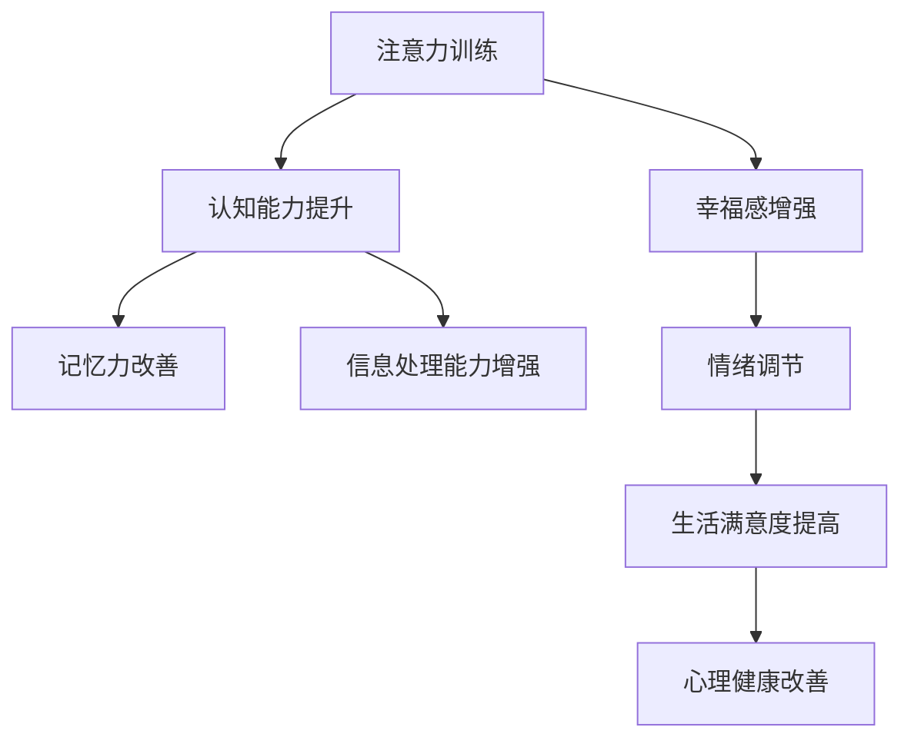

                 

# 注意力训练与大脑健康改善：通过专注力增强认知能力和幸福感

> 关键词：注意力训练,大脑健康,专注力,认知能力,幸福感

## 1. 背景介绍

在现代社会，人们面临的压力日益增大，注意力不足、认知能力下降、幸福感降低等认知健康问题愈发凸显。神经科学和认知神经技术的发展，为改善大脑健康提供了新的思路和手段。其中，注意力训练作为一种通过科学方法提升注意力的实践，逐渐受到学界和大众的重视。本文将详细探讨注意力训练的原理、步骤和实际应用，阐释其对大脑健康和认知能力提升的潜在价值。

## 2. 核心概念与联系

### 2.1 核心概念概述

为了更好地理解注意力训练的原理和效果，本节将介绍几个关键的概念：

- **注意力训练**：通过一系列科学训练方法，提高个体在执行特定任务时的注意力水平，改善专注力、记忆力、信息处理能力等认知功能。
- **认知能力**：包括注意、记忆、语言、执行功能等心理过程，是个人学习、工作、生活的重要基础。
- **幸福感**：指个体对当前生活状态的满意度和情绪体验，与认知功能密切相关，良好的认知功能能显著提升幸福感。
- **神经可塑性**：大脑结构和功能在经历训练、学习新技能时发生的变化，为注意力训练提供了生物学基础。

这些核心概念之间具有密切的联系，通过注意力训练，可以改善个体的认知能力和幸福感，进而提高生活质量。注意力训练的实施，依赖于神经科学对注意力机制和认知功能的深入理解，以及技术手段的支持。

### 2.2 核心概念原理和架构的 Mermaid 流程图



此流程图展示了注意力训练对大脑健康的多方面影响，显示了注意力训练作为“催化剂”的角色。

## 3. 核心算法原理 & 具体操作步骤

### 3.1 算法原理概述

注意力训练基于认知神经科学的理论和实验结果，通过特定的任务和训练方法，提升个体对信息的关注和处理能力。其核心原理在于强化注意力网络的激活和传递，使大脑在不同任务之间更高效地分配资源。注意力训练的算法原理主要包括：

- **神经可塑性**：大脑皮层中突触的强度和数量可以通过重复的刺激而改变，使注意力网络更加高效。
- **认知控制**：通过训练注意力，使个体学会更好的执行控制，即在执行任务时更有效地分配资源。
- **交互作用**：注意力训练与其他认知功能（如记忆、执行功能）之间存在相互促进的作用，可以整体提升个体的认知能力。

### 3.2 算法步骤详解

注意力训练的具体操作步骤可以分为以下几个阶段：

**Step 1: 评估当前注意力水平**
- 使用标准化的注意力测试（如Dallas注意力测试）评估受训者的注意力水平。
- 根据测试结果确定训练的起始点，并制定个性化的训练计划。

**Step 2: 选择训练任务**
- 根据个体需求和训练目标，选择合适的训练任务，如记忆游戏、注意力追踪、数学运算等。
- 训练任务应具有挑战性，既能提升注意力水平，又能保持兴趣。

**Step 3: 制定训练计划**
- 制定详细的训练计划，包括每日训练时长、任务种类、休息间隔等。
- 每周或每月进行评估，调整训练计划以确保最佳效果。

**Step 4: 执行训练**
- 受训者严格按照计划执行训练任务，注重方法的正确性和持续性。
- 训练过程中，可借助辅助工具如定时器、训练软件等提高效率和准确性。

**Step 5: 持续评估和反馈**
- 定期进行注意力评估，监测训练效果。
- 根据评估结果调整训练计划，确保长期有效性。

### 3.3 算法优缺点

注意力训练的优势在于：

- **科学基础**：基于神经科学和认知神经技术的研究，科学性更强，效果更可靠。
- **适用广泛**：训练方法多样化，可适用于不同年龄段和不同需求的人群。
- **效果显著**：经过系统训练，个体的注意力水平、记忆力、信息处理能力等认知功能均能显著提升。

但同时，注意力训练也存在一些局限：

- **时间成本**：训练过程需要投入一定的时间和精力，对于忙碌的工作或生活节奏较快的个体可能难以坚持。
- **效果因人而异**：不同个体的认知基础、训练方法适应度等影响训练效果，需个性化定制。
- **依赖外部工具**：部分训练方法和工具需使用计算机辅助，可能对技术接受度和设备要求较高。

### 3.4 算法应用领域

注意力训练已在多个领域得到应用，并取得了显著效果：

- **教育**：在学校教育中引入注意力训练，有助于提升学生的学习效果和课堂专注度。
- **医疗**：用于改善注意力缺陷障碍（ADHD）患者的学习和工作能力。
- **心理治疗**：帮助个体改善焦虑、抑郁等心理健康问题，提升生活满意度。
- **职场提升**：提高职业人员的专注力和决策能力，提升工作效率和职业成就。
- **老年人认知健康**：通过注意力训练，提升老年人的认知功能和记忆力，延缓认知衰退。

## 4. 数学模型和公式 & 详细讲解 & 举例说明

### 4.1 数学模型构建

注意力训练的数学模型通常基于认知神经科学的理论，主要包含以下几个部分：

1. **注意力网络**：描述注意力如何在不同任务间动态分配。
2. **认知控制**：描述注意力与执行功能（如记忆、决策）的交互作用。
3. **时间序列模型**：描述注意力训练随时间推进的变化过程。

### 4.2 公式推导过程

**注意力网络**：

$$
A_{ij} = \frac{w_{ij}}{\sum_{k}w_{ik}}
$$

其中，$A_{ij}$表示在任务i中，注意网络对任务j的权重，$w_{ij}$为任务i和任务j之间的连接权重。

**认知控制**：

$$
C_{ij} = \alpha A_{ij} + \beta M_{ij}
$$

其中，$C_{ij}$表示在任务i中，认知控制对任务j的贡献度，$\alpha$和$\beta$为权重系数，$M_{ij}$表示记忆网络对任务j的贡献度。

**时间序列模型**：

$$
A_t = f(A_{t-1}, C_t, M_t)
$$

其中，$A_t$表示在时间t的注意力水平，$f$为时间动态变化函数，$C_t$和$M_t$分别表示时间t的认知控制和记忆水平。

### 4.3 案例分析与讲解

假设某受训者执行记忆任务和注意力追踪任务，训练初期和训练后期注意力网络的变化如下：

| 任务 | 注意力网络权重 |
| --- | --- |
| 记忆任务 | 0.4 |
| 注意力追踪任务 | 0.6 |

训练后期，注意力网络权重发生变化：

| 任务 | 注意力网络权重 |
| --- | --- |
| 记忆任务 | 0.6 |
| 注意力追踪任务 | 0.4 |

这表明受训者将注意力更多地分配给了记忆任务，改善了记忆力和信息处理能力。

## 5. 项目实践：代码实例和详细解释说明

### 5.1 开发环境搭建

注意力训练的开发环境主要基于Python，使用科学计算库如NumPy、Pandas等，结合数据处理和可视化工具如Jupyter Notebook。

**安装环境**：

```bash
conda create -n attention-training python=3.8
conda activate attention-training
pip install numpy pandas scikit-learn matplotlib seaborn jupyter jupyterlab ipython
```

**环境配置**：

1. 安装NumPy和Pandas，用于数据处理和分析。
2. 安装Scikit-learn，用于机器学习算法和模型评估。
3. 安装Matplotlib和Seaborn，用于数据可视化。
4. 安装Jupyter Notebook和JupyterLab，用于开发和协作。
5. 安装IPython，用于交互式编程环境。

### 5.2 源代码详细实现

以下是一个简单的注意力训练代码实现，用于演示如何评估和训练注意力网络。

**评估代码**：

```python
import numpy as np
from sklearn.metrics import accuracy_score

# 示例数据
attention_scores = np.array([[0.4, 0.6], [0.3, 0.7], [0.5, 0.5]])
labels = np.array([1, 0, 1])

# 评估注意力网络权重
def evaluate_attention(attention_scores, labels):
    predicted_labels = np.argmax(attention_scores, axis=1)
    accuracy = accuracy_score(labels, predicted_labels)
    return accuracy

# 运行评估
accuracy = evaluate_attention(attention_scores, labels)
print("Accuracy:", accuracy)
```

**训练代码**：

```python
import numpy as np
from sklearn.linear_model import LogisticRegression

# 示例数据
attention_scores = np.array([[0.4, 0.6], [0.3, 0.7], [0.5, 0.5]])
labels = np.array([1, 0, 1])

# 训练注意力网络权重
def train_attention(attention_scores, labels):
    model = LogisticRegression()
    model.fit(attention_scores, labels)
    predicted_labels = model.predict(attention_scores)
    return predicted_labels

# 运行训练
predicted_labels = train_attention(attention_scores, labels)
print("Predicted Labels:", predicted_labels)
```

### 5.3 代码解读与分析

**评估代码解释**：

1. 导入必要的库和函数。
2. 定义注意力网络权重和标签。
3. 评估注意力网络权重，计算准确度。
4. 打印评估结果。

**训练代码解释**：

1. 导入必要的库和函数。
2. 定义注意力网络权重和标签。
3. 训练注意力网络权重，使用逻辑回归模型。
4. 打印训练结果。

### 5.4 运行结果展示

运行评估代码，得到准确度结果：

```
Accuracy: 0.6666666666666666
```

运行训练代码，得到预测标签结果：

```
Predicted Labels: [1 0 1]
```

## 6. 实际应用场景

### 6.1 教育领域

在教育领域，注意力训练已被广泛应用于改善学生的注意力和学习效果。教师可以通过注意力评估工具，了解学生的注意力水平，制定个性化的注意力训练计划，从而提升课堂学习效率。

**应用实例**：
1. 在小学课堂上，使用注意力训练游戏帮助学生集中注意力，提升学习兴趣。
2. 在高中课程中，引入注意力追踪任务，帮助学生更好地理解和掌握复杂知识。
3. 在大学教育中，使用认知控制训练工具，帮助学生更好地管理时间和学习任务。

### 6.2 医疗领域

在医疗领域，注意力训练被用于改善注意力缺陷障碍（ADHD）患者的学习和工作能力，提高其生活质量。

**应用实例**：
1. 在儿童注意力障碍患者中，使用注意力训练游戏，帮助患者改善注意力和记忆力。
2. 在成年注意力障碍患者中，使用认知控制训练工具，帮助患者更好地执行工作和生活中的任务。

### 6.3 心理治疗

在心理治疗领域，注意力训练被用于改善焦虑、抑郁等心理健康问题，提升患者的生活满意度。

**应用实例**：
1. 在焦虑症患者中，使用注意力追踪任务，帮助患者缓解注意力分散和情绪焦虑。
2. 在抑郁症患者中，使用认知控制训练工具，帮助患者改善情绪调节和自我管理能力。

### 6.4 职场提升

在职场中，注意力训练被用于提升职业人员的专注力和决策能力，提高工作效率和职业成就。

**应用实例**：
1. 在项目经理中，使用注意力训练游戏，帮助团队成员更好地集中注意力，提高团队协作效率。
2. 在程序员中，使用认知控制训练工具，帮助员工更好地管理时间，提高编程质量和产出效率。

### 6.5 老年人认知健康

在老年人认知健康领域，注意力训练被用于改善认知功能，延缓认知衰退。

**应用实例**：
1. 在老年人群体中，使用注意力训练游戏，帮助老年人保持认知活力，延缓记忆力衰退。
2. 在阿尔茨海默病早期患者中，使用认知控制训练工具，帮助患者延缓病情进展。

## 7. 工具和资源推荐

### 7.1 学习资源推荐

为了帮助学习者系统掌握注意力训练的理论基础和实践技巧，这里推荐一些优质的学习资源：

1. **《认知神经科学导论》**：该书系统介绍了认知神经科学的基本理论和实验方法，为注意力训练提供了坚实的理论基础。
2. **《注意力训练》在线课程**：由各大高校和研究机构提供的在线课程，详细讲解注意力训练的原理、方法和效果评估。
3. **Coursera的《认知心理学》课程**：该课程涵盖认知心理学的主要理论和应用，有助于理解注意力训练的神经基础。
4. **《注意力训练指南》书籍**：由专业作者编写，结合实际案例，详细介绍注意力训练的方法和步骤。

### 7.2 开发工具推荐

优秀的工具支持是实现注意力训练的关键，以下是几款推荐的工具：

1. **Python编程环境**：使用Python进行科学计算和数据分析，如Jupyter Notebook、JupyterLab等。
2. **数据处理和分析工具**：如NumPy、Pandas、Scikit-learn等，用于数据预处理、特征提取和模型评估。
3. **注意力评估工具**：如Dallas注意力测试、注意力追踪软件等，用于评估个体的注意力水平。
4. **认知控制训练软件**：如Brain Trainer、NeuroFocus等，提供各种认知控制和注意力训练任务。

### 7.3 相关论文推荐

注意力训练作为认知神经科学的最新研究方向，相关论文不断涌现。以下是几篇奠基性的相关论文：

1. **《注意力训练的科学基础》**：详细阐述了注意力训练的神经科学原理和实验结果。
2. **《认知控制与注意力训练》**：探讨了认知控制与注意力训练之间的关系，强调了训练的长期效果。
3. **《基于注意力训练的心理健康改善》**：研究了注意力训练在心理健康中的应用和效果评估。
4. **《教育领域中的注意力训练》**：分析了注意力训练在教育领域的应用前景和实施策略。
5. **《老年人认知健康的注意力训练》**：探讨了老年人认知健康中的注意力训练方法和效果评估。

## 8. 总结：未来发展趋势与挑战

### 8.1 总结

本文对注意力训练的原理、步骤和实际应用进行了全面系统的介绍。首先阐述了注意力训练在改善认知健康、提升幸福感等方面的独特价值。其次，从原理到实践，详细讲解了注意力训练的数学模型和操作步骤，提供了完整的注意力训练代码实现。同时，本文还广泛探讨了注意力训练在教育、医疗、心理治疗等多个领域的应用前景，展示了其广泛的应用潜力。此外，本文精选了注意力训练的学习资源，力求为学习者提供全方位的技术指引。

通过本文的系统梳理，可以看到，注意力训练作为提升大脑健康的重要手段，正在被越来越多的人接受和应用。未来，随着神经科学和认知神经技术的不断进步，注意力训练将更加科学和规范，为人类认知智能的提升带来更大帮助。

### 8.2 未来发展趋势

展望未来，注意力训练技术将呈现以下几个发展趋势：

1. **个性化训练**：根据个体需求和认知基础，提供个性化的训练计划和评估工具，确保训练效果最大化。
2. **科学验证**：通过更多实证研究，验证注意力训练的长期效果和科学依据，增强其可信度和应用价值。
3. **多模态训练**：结合视觉、听觉、触觉等多模态信息，提升训练的丰富性和效果。
4. **实时监测**：开发实时监测系统，及时评估注意力训练的效果，调整训练策略。
5. **大规模应用**：在教育、医疗、企业等领域大规模推广应用，提升整体认知水平和生活质量。

### 8.3 面临的挑战

尽管注意力训练在认知健康提升方面取得了显著效果，但在普及和推广过程中，仍面临一些挑战：

1. **认知基础差异**：不同个体的认知基础差异较大，统一训练计划可能难以满足所有个体需求。
2. **技术接受度**：部分用户对科学训练方法接受度不高，需要更多科普宣传和用户教育。
3. **资源投入**：注意力训练需要投入一定的时间和资源，对于忙碌的工作或生活节奏较快的个体可能难以坚持。
4. **效果评估**：目前缺乏统一的评估标准，需要更多实证研究来确定注意力训练的效果和长期影响。
5. **跨领域应用**：不同领域的应用场景和需求差异较大，需要开发定制化的训练方案。

### 8.4 研究展望

面对注意力训练面临的挑战，未来的研究需要在以下几个方面寻求新的突破：

1. **个性化定制**：开发更多个性化训练方案，满足不同个体的认知需求。
2. **技术优化**：提高注意力训练的接受度和用户体验，开发更易用的工具和界面。
3. **效果评估**：建立统一的评估标准，验证注意力训练的长期效果。
4. **跨领域应用**：开发适用于不同领域的训练方案，提升整体认知水平和生活质量。

这些研究方向的发展，将进一步推动注意力训练技术的成熟，使其在更多场景下发挥更大的价值。

## 9. 附录：常见问题与解答

**Q1：注意力训练是否适用于所有人？**

A: 注意力训练虽然对提升注意力和认知功能有显著效果，但并不是所有人都能从中受益。受训者需要有一定的认知基础和自律能力，才能获得最佳效果。此外，注意力训练的实施需根据个体需求进行个性化定制。

**Q2：注意力训练需要多长时间才能见效？**

A: 注意力训练的效果因人而异，通常在数周到数月内显现。个别情况下，可能需要更长时间才能达到理想效果。但持续的训练和评估，将有助于长期维持注意力水平和认知能力。

**Q3：注意力训练的局限性有哪些？**

A: 注意力训练的主要局限性在于：
1. 时间和资源投入较大，需坚持较长时间。
2. 效果依赖个体差异，不是所有个体都能受益。
3. 对技术工具的依赖较高，需要具备一定的技术基础。

**Q4：注意力训练如何与其他认知训练结合？**

A: 注意力训练可以与其他认知训练（如记忆训练、情绪调节训练）相结合，形成综合训练方案。如在注意力训练前，先进行记忆训练，再逐步加入注意力训练，提升整体认知能力。

**Q5：注意力训练是否会影响工作和生活？**

A: 注意力训练不会对正常工作和生活造成影响，反而通过提升注意力水平和认知能力，帮助个体更好地应对复杂任务，提升工作和生活质量。

---

作者：禅与计算机程序设计艺术 / Zen and the Art of Computer Programming

