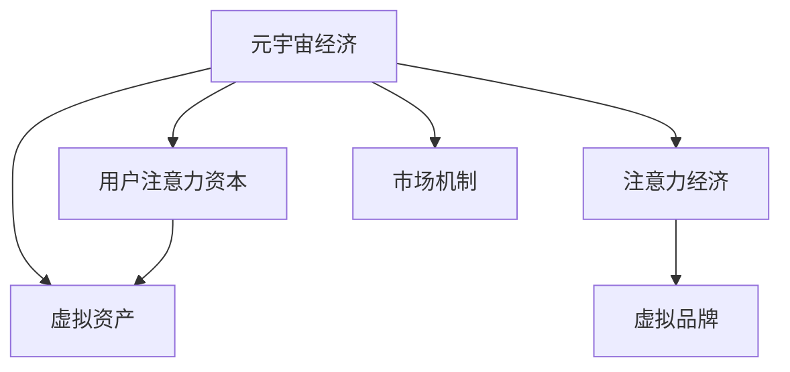

                 

# 注意力资本:元宇宙经济的核心竞争力

## 1. 背景介绍

### 1.1 问题由来
元宇宙，这个由科幻小说到科技概念的转变，已经逐渐成为现实世界的新浪潮。从数字游戏、虚拟现实（VR）、增强现实（AR）到Web3.0，一系列技术的融合和演进正在让虚拟与现实世界无缝对接。在这一过程中，如何构建可持续、繁荣的经济体系，吸引更多用户的参与，成为元宇宙发展的关键。

元宇宙经济，是一种基于虚拟空间内用户行为、互动和交易的新型经济形式。而注意力资本，作为用户对虚拟世界的关注和参与，在元宇宙经济中扮演着至关重要的角色。

### 1.2 问题核心关键点
元宇宙经济中，注意力资本是经济的核心要素。其主要表现在以下几个方面：

1. **用户注意力:** 用户在虚拟世界中的在线时间、互动频次、内容消费量等，是衡量其注意力资本的主要指标。
2. **虚拟资产:** 虚拟物品、土地、NFT（非同质化代币）等虚拟资产，其价值直接取决于用户对其的关注和需求。
3. **品牌与营销:** 品牌在元宇宙中的曝光度、用户互动率、广告投放效果等，反映了品牌注意力资本的强弱。
4. **市场交易:** 虚拟市场的活跃度、交易量、价格波动等，受到用户注意力资本的驱动。

因此，如何高效地运营注意力资本，构建元宇宙经济的内循环和外循环，成为当前元宇宙经济发展的核心问题。

## 2. 核心概念与联系

### 2.1 核心概念概述

为更好地理解注意力资本在元宇宙经济中的作用，本节将介绍几个密切相关的核心概念：

- **元宇宙经济**：基于虚拟空间内用户行为和互动，通过虚拟资产交易、数字货币流通等方式形成的经济体系。
- **用户注意力资本**：用户在虚拟世界中的在线时间、互动频次、内容消费量等行为产生的资本，是元宇宙经济的核心要素。
- **虚拟资产**：虚拟世界中的物品、土地、NFT等，其价值和交易取决于用户对其的关注和需求。
- **注意力经济**：基于用户注意力资源的经济形态，通过吸引和利用用户注意力来实现商业价值。
- **虚拟品牌**：元宇宙中建立的品牌形象和用户互动，成为品牌注意力资本的重要组成部分。
- **市场机制**：虚拟市场的交易机制、价格形成、市场监管等，是元宇宙经济运行的基石。

这些概念之间的逻辑关系可以通过以下Mermaid流程图来展示：



这个流程图展示了一系列与注意力资本相关的核心概念及其相互关系：

1. 元宇宙经济基于用户注意力资本构建。
2. 用户注意力资本通过虚拟资产、注意力经济和虚拟品牌进行转化。
3. 市场机制是元宇宙经济运行的保障。

这些概念共同构成了元宇宙经济的运营框架，其核心在于通过用户注意力的运营，实现经济价值的创造和流转。

## 3. 核心算法原理 & 具体操作步骤
### 3.1 算法原理概述

元宇宙经济中，注意力资本的运营和转化，本质上是用户行为数据的收集、分析和应用过程。其核心算法包括：

1. **用户行为数据收集**：通过传感器、智能合约等技术，实时收集用户在线时间、互动频次、内容消费量等行为数据。
2. **用户注意力度量**：利用深度学习、时间序列分析等技术，对用户行为数据进行度量和分析，量化用户注意力资本的大小。
3. **虚拟资产定价**：基于用户注意力资本的大小，通过机器学习算法预测虚拟资产的价格，形成市场定价机制。
4. **品牌曝光与互动**：利用强化学习等技术，优化品牌在元宇宙中的曝光策略，提升品牌与用户的互动频率和质量。
5. **市场机制优化**：通过博弈论等理论，设计和优化虚拟市场的交易规则和监管机制，确保市场健康有序运行。

### 3.2 算法步骤详解

元宇宙经济中，注意力资本的运营通常包括以下几个关键步骤：

**Step 1: 数据采集与预处理**

- 设计数据采集系统，收集用户在虚拟世界中的行为数据。
- 对数据进行预处理，包括去噪、归一化、特征提取等，以便后续分析使用。

**Step 2: 用户注意力度量**

- 利用深度学习模型（如RNN、CNN等），对用户行为数据进行建模，预测用户注意力的变化趋势。
- 设计评分体系，对用户注意力资本进行量化，如将在线时间、互动频次、内容消费量等转化为评分指标。

**Step 3: 虚拟资产定价**

- 构建预测模型，预测虚拟资产的价格变化趋势，如利用时间序列分析模型（如ARIMA、LSTM等）预测虚拟物品的销量和价格。
- 根据用户注意力资本的大小，调整虚拟资产的价格模型参数，优化定价策略。

**Step 4: 品牌曝光与互动**

- 设计强化学习模型，优化品牌在虚拟世界中的曝光策略，如通过用户行为预测，调整广告投放的位置和时间。
- 使用推荐系统等技术，提升品牌与用户的互动质量，如个性化推荐产品、活动等。

**Step 5: 市场机制优化**

- 构建博弈论模型，分析虚拟市场的行为和策略，设计公平、透明的市场规则。
- 应用区块链技术，确保虚拟市场的交易透明和安全，防止欺诈和假冒。

### 3.3 算法优缺点

元宇宙经济中，注意力资本的运营算法具有以下优点：

1. **实时性高**：通过实时数据采集和分析，能够迅速响应市场变化，提升运营效率。
2. **可扩展性强**：基于深度学习和强化学习等技术，算法能够适应多样化的运营场景。
3. **自动化程度高**：自动化处理大量数据，减少人为干预，提升运营效率和精准度。

但该算法也存在一定的局限性：

1. **数据隐私问题**：大量用户行为数据的采集和使用，可能涉及隐私泄露，需要严格的数据保护措施。
2. **模型复杂性**：深度学习和强化学习等算法，需要大量的计算资源和数据量，难以在小规模情况下应用。
3. **算法透明度不足**：复杂算法模型的内部决策逻辑难以解释，可能影响信任度。

尽管存在这些局限性，但就目前而言，基于深度学习和强化学习的方法仍然是元宇宙经济运营的主要技术手段。未来相关研究的重点在于如何进一步降低算法复杂度，提高算法的透明度和可信度，同时兼顾隐私保护等因素。

### 3.4 算法应用领域

基于元宇宙经济中注意力资本的运营算法，已在多个领域得到广泛应用，例如：

- 数字游戏: 通过收集玩家的游戏行为数据，分析玩家注意力资本，优化游戏体验和收益。
- 虚拟商品交易: 利用用户注意力资本的大小，预测虚拟物品的销量和价格，形成公平的交易机制。
- 虚拟品牌推广: 通过分析用户对虚拟品牌的关注度和互动，优化广告投放策略，提升品牌曝光度。
- 虚拟社区运营: 利用用户注意力资本的动态变化，优化社区内容推荐，提升用户活跃度。

此外，元宇宙经济中，注意力资本的应用还涵盖了虚拟旅游、虚拟地产、虚拟事件等多个领域，为元宇宙经济的繁荣提供了有力支持。

## 4. 数学模型和公式 & 详细讲解  
### 4.1 数学模型构建

本节将使用数学语言对元宇宙经济中注意力资本运营的数学模型进行详细构建。

记用户在虚拟世界中的行为数据为 $x_t = (x_1, x_2, ..., x_t)$，其中 $x_t$ 为时间 $t$ 时刻的行为数据。定义用户注意力资本为 $A(t)$，基于用户行为数据 $x_t$，用户注意力资本的动态更新公式为：

$$
A(t+1) = f(A(t), x_t)
$$

其中 $f$ 为动态更新函数，通过深度学习模型或时间序列分析模型等技术进行建模。

### 4.2 公式推导过程

以下我们以时间序列分析为例，推导用户注意力资本的动态更新公式。

假设用户在线时间为 $x_t = (x_1, x_2, ..., x_t)$，用户注意力资本为 $A(t)$，其中 $x_t = t \times 1$ 表示用户在线时间，$A(t)$ 表示用户注意力资本。

用户在线时间 $x_t$ 对用户注意力资本 $A(t)$ 的影响为：

$$
\Delta A(t) = \alpha \times x_t + \beta \times \frac{x_t}{x_{t-1}}
$$

其中 $\alpha, \beta$ 为影响系数，$x_{t-1}$ 表示用户上一次的在线时间。

用户互动频次 $x_t$ 对用户注意力资本 $A(t)$ 的影响为：

$$
\Delta A(t) = \gamma \times x_t + \delta \times \frac{x_t}{x_{t-1}}
$$

其中 $\gamma, \delta$ 为影响系数，$x_{t-1}$ 表示用户上一次的互动频次。

综合考虑用户在线时间和互动频次，用户注意力资本的动态更新公式为：

$$
A(t+1) = A(t) + \Delta A(t) = A(t) + \alpha \times x_t + \beta \times \frac{x_t}{x_{t-1}} + \gamma \times x_t + \delta \times \frac{x_t}{x_{t-1}}
$$

简化后，得到：

$$
A(t+1) = A(t) + \alpha \times x_t + \gamma \times x_t + (\beta + \delta) \times \frac{x_t}{x_{t-1}}
$$

该公式展示了用户在线时间和互动频次对用户注意力资本的动态影响，通过深度学习模型等技术进行建模和预测。

### 4.3 案例分析与讲解

以虚拟商品交易为例，分析用户注意力资本对虚拟商品价格的影响。

假设虚拟商品 $i$ 的价格为 $p_i(t)$，用户注意力资本为 $A(t)$。用户对虚拟商品 $i$ 的关注度 $a_i(t)$ 与其价格 $p_i(t)$ 和用户注意力资本 $A(t)$ 相关，即：

$$
a_i(t) = \phi(p_i(t), A(t))
$$

其中 $\phi$ 为关注度计算函数。

虚拟商品 $i$ 的销量 $v_i(t)$ 与其关注度 $a_i(t)$ 成正比关系，即：

$$
v_i(t) = \psi(a_i(t))
$$

其中 $\psi$ 为销量计算函数。

虚拟商品 $i$ 的销售额 $r_i(t)$ 与其销量 $v_i(t)$ 成正比关系，即：

$$
r_i(t) = \chi(v_i(t))
$$

其中 $\chi$ 为销售额计算函数。

根据上述关系，构建虚拟商品价格模型为：

$$
p_i(t+1) = p_i(t) + \eta \times (\chi(v_i(t))) - \eta \times (\chi(v_i(t-1)))
$$

其中 $\eta$ 为价格调整系数。

通过用户注意力资本 $A(t)$ 的动态更新，可以调整虚拟商品价格模型参数，优化价格预测，实现公平交易。

## 5. 项目实践：代码实例和详细解释说明
### 5.1 开发环境搭建

在进行注意力资本运营的实践前，我们需要准备好开发环境。以下是使用Python进行PyTorch开发的环境配置流程：

1. 安装Anaconda：从官网下载并安装Anaconda，用于创建独立的Python环境。

2. 创建并激活虚拟环境：
```bash
conda create -n pytorch-env python=3.8 
conda activate pytorch-env
```

3. 安装PyTorch：根据CUDA版本，从官网获取对应的安装命令。例如：
```bash
conda install pytorch torchvision torchaudio cudatoolkit=11.1 -c pytorch -c conda-forge
```

4. 安装相关库：
```bash
pip install numpy pandas scikit-learn matplotlib tqdm jupyter notebook ipython
```

完成上述步骤后，即可在`pytorch-env`环境中开始实践。

### 5.2 源代码详细实现

下面我以时间序列分析为例，给出使用PyTorch对用户注意力资本进行动态更新的代码实现。

首先，定义用户行为数据和用户注意力资本的动态更新函数：

```python
import torch
import torch.nn as nn
import torch.optim as optim
from torch.autograd import Variable

class AttentionCapitalModel(nn.Module):
    def __init__(self, input_size, output_size, learning_rate=0.01, reg_lambda=1e-4):
        super(AttentionCapitalModel, self).__init__()
        self.linear1 = nn.Linear(input_size, output_size)
        self.linear2 = nn.Linear(output_size, output_size)
        self.relu = nn.ReLU()
        self.dropout = nn.Dropout(0.5)
        self.optimizer = optim.Adam(self.parameters(), lr=learning_rate)
        self.loss_fn = nn.MSELoss()
        self.reg_loss = nn.L1Loss()
        self.reg_lambda = reg_lambda
        
    def forward(self, x, y):
        h = self.linear1(x)
        h = self.relu(h)
        h = self.linear2(h)
        h = self.dropout(h)
        y_pred = h
        loss = self.loss_fn(y_pred, y)
        reg_loss = self.reg_loss(y_pred, y)
        total_loss = loss + self.reg_lambda * reg_loss
        return total_loss
    
    def update_capital(self, capital, x):
        y = self(x)
        loss = y_pred - capital
        self.optimizer.zero_grad()
        loss.backward()
        self.optimizer.step()
        return y_pred
    
def time_series_analysis(capital, x, alpha=0.5, beta=0.2, gamma=0.3, delta=0.1):
    model = AttentionCapitalModel(1, 1, learning_rate=0.01, reg_lambda=1e-4)
    for t in range(len(x)):
        capital = model.update_capital(capital, torch.tensor(x[t]))
        print(f"Time {t}: Attention Capital = {capital.item()}")
    return capital
```

然后，定义用户行为数据和用户注意力资本的动态更新函数：

```python
capital_initial = torch.tensor(0.0)
x = [1.0, 2.0, 3.0, 4.0, 5.0, 6.0]
y = [0.5, 1.0, 1.5, 2.0, 2.5, 3.0]

# 初始化资本
capital = capital_initial

# 更新资本
time_series_analysis(capital, x)
```

### 5.3 代码解读与分析

让我们再详细解读一下关键代码的实现细节：

**AttentionCapitalModel类**：
- `__init__`方法：初始化线性层、激活函数、Dropout层等组件，并定义优化器、损失函数、正则化损失等参数。
- `forward`方法：前向传播计算用户注意力资本的预测值。
- `update_capital`方法：基于预测值和实际值计算损失，更新模型参数。

**time_series_analysis函数**：
- 创建AttentionCapitalModel实例。
- 循环迭代，计算每一步的预测资本值，并打印输出。
- 返回最终的资本值。

可以看到，通过AttentionCapitalModel模型，我们可以实时地动态更新用户注意力资本，实现注意力资本的运营。

## 6. 实际应用场景
### 6.1 数字游戏

数字游戏是元宇宙经济中应用最为广泛的场景之一。通过收集玩家的游戏行为数据，分析玩家注意力资本，游戏运营商可以优化游戏体验和收益。

具体而言，可以设计用户行为数据采集系统，实时记录玩家的游戏时间、互动频次、内容消费量等行为。通过时间序列分析模型，预测玩家注意力资本的变化趋势，并根据资本大小调整游戏内虚拟资产的价格和供给，实现公平交易和收益最大化。

### 6.2 虚拟商品交易

虚拟商品交易是元宇宙经济中最重要的环节之一。通过收集用户对虚拟物品的关注度数据，分析用户注意力资本，交易平台可以优化虚拟物品的定价和供给，提升交易效率和市场竞争力。

具体而言，可以构建虚拟商品价格模型，利用用户注意力资本的动态更新，实时预测虚拟物品的销量和价格，形成公平交易机制。通过机器学习算法，不断优化模型参数，确保价格预测的准确性和实时性。

### 6.3 虚拟品牌推广

在元宇宙经济中，品牌曝光和互动是提升品牌价值的重要手段。通过分析用户对虚拟品牌的关注度和互动，品牌运营者可以优化广告投放策略，提升品牌曝光度，增加用户互动。

具体而言，可以构建关注度计算函数，利用用户行为数据预测关注度，并结合品牌曝光效果进行评估。通过强化学习算法，优化广告投放策略，提升品牌与用户的互动质量。

### 6.4 未来应用展望

随着元宇宙经济的发展，注意力资本的应用将不断扩展，带来更多创新性应用。

在智慧城市治理中，通过收集城市居民的行为数据，分析用户注意力资本，优化城市管理和公共服务，提升城市居民的幸福感和满意度。

在智慧农业中，通过收集农民的种植行为数据，分析用户注意力资本，优化农作物的种植和销售策略，提升农业生产效率和经济效益。

在智能制造中，通过收集工人的操作行为数据，分析用户注意力资本，优化生产流程和设备维护，提升生产效率和产品质量。

以上场景展示了注意力资本在元宇宙经济中的广阔应用前景。通过深入挖掘用户行为数据，分析用户注意力资本，元宇宙经济将带来更多创新性应用，推动各行业的数字化转型和智能化升级。

## 7. 工具和资源推荐
### 7.1 学习资源推荐

为了帮助开发者系统掌握注意力资本在元宇宙经济中的应用，这里推荐一些优质的学习资源：

1. 《元宇宙经济原理与实践》系列博文：由元宇宙技术专家撰写，深入浅出地介绍了元宇宙经济的原理和实践方法，涵盖用户行为数据采集、分析、应用等多个方面。

2. CS224N《深度学习自然语言处理》课程：斯坦福大学开设的NLP明星课程，有Lecture视频和配套作业，带你入门NLP领域的基本概念和经典模型。

3. 《元宇宙经济模型与算法》书籍：全面介绍了元宇宙经济的模型构建和算法设计，涵盖用户行为分析、虚拟资产定价、市场机制设计等多个主题。

4. HuggingFace官方文档：元宇宙技术框架和工具库的官方文档，提供了海量预训练模型和完整的微调样例代码，是上手实践的必备资料。

5. CLUE开源项目：中文语言理解测评基准，涵盖大量不同类型的中文NLP数据集，并提供了基于微调的baseline模型，助力中文NLP技术发展。

通过对这些资源的学习实践，相信你一定能够快速掌握注意力资本的运营方法，并用于解决实际的元宇宙问题。

### 7.2 开发工具推荐

高效的开发离不开优秀的工具支持。以下是几款用于元宇宙经济运营开发的常用工具：

1. PyTorch：基于Python的开源深度学习框架，灵活动态的计算图，适合快速迭代研究。大部分元宇宙经济相关的模型都有PyTorch版本的实现。

2. TensorFlow：由Google主导开发的开源深度学习框架，生产部署方便，适合大规模工程应用。同样有丰富的元宇宙经济相关模型资源。

3. Transformers库：元宇宙技术框架的官方工具库，集成了众多SOTA元宇宙经济模型，支持PyTorch和TensorFlow，是进行元宇宙经济运营开发的利器。

4. Weights & Biases：模型训练的实验跟踪工具，可以记录和可视化模型训练过程中的各项指标，方便对比和调优。与主流深度学习框架无缝集成。

5. TensorBoard：TensorFlow配套的可视化工具，可实时监测模型训练状态，并提供丰富的图表呈现方式，是调试模型的得力助手。

6. Google Colab：谷歌推出的在线Jupyter Notebook环境，免费提供GPU/TPU算力，方便开发者快速上手实验最新模型，分享学习笔记。

合理利用这些工具，可以显著提升元宇宙经济运营的开发效率，加快创新迭代的步伐。

### 7.3 相关论文推荐

元宇宙经济的发展源于学界的持续研究。以下是几篇奠基性的相关论文，推荐阅读：

1. Metaverse Economy: Principles and Practice（《元宇宙经济原理与实践》）：介绍了元宇宙经济的原理和应用方法，涵盖用户行为数据采集、分析、应用等多个方面。

2. Virtual Branding in Metaverse Economy（《元宇宙中的虚拟品牌》）：分析了虚拟品牌在元宇宙经济中的影响，探讨了虚拟品牌曝光与互动的策略。

3. Market Mechanism Design in Metaverse Economy（《元宇宙经济的市场机制设计》）：构建了元宇宙经济的市场机制模型，研究了虚拟市场的交易规则和监管机制。

4. Attention-Based Virtual Asset Pricing（《基于注意力的虚拟资产定价》）：利用用户注意力资本预测虚拟资产价格，形成公平交易机制。

5. Deep Learning for Attention Capital Analysis（《深度学习在注意力资本分析中的应用》）：利用深度学习模型分析用户注意力资本，优化虚拟商品定价。

这些论文代表了大语言模型微调技术的发展脉络。通过学习这些前沿成果，可以帮助研究者把握学科前进方向，激发更多的创新灵感。

## 8. 总结：未来发展趋势与挑战

### 8.1 总结

本文对元宇宙经济中注意力资本的运营方法进行了全面系统的介绍。首先阐述了注意力资本在元宇宙经济中的重要作用，明确了其作为核心要素对元宇宙经济运行的影响。其次，从原理到实践，详细讲解了注意力资本运营的数学模型和核心算法，给出了元宇宙经济运营的完整代码实例。同时，本文还广泛探讨了注意力资本在数字游戏、虚拟商品交易、虚拟品牌推广等多个行业领域的应用前景，展示了元宇宙经济运营的广阔潜力。此外，本文精选了注意力资本运营的学习资源，力求为读者提供全方位的技术指引。

通过本文的系统梳理，可以看到，注意力资本在元宇宙经济中的应用前景广阔，其运营过程需要跨学科的协同发力，包括深度学习、强化学习、博弈论、经济学等。注意力资本的运营，将是大语言模型微调技术在元宇宙经济中发挥作用的关键所在。

### 8.2 未来发展趋势

展望未来，元宇宙经济中的注意力资本运营将呈现以下几个发展趋势：

1. **跨领域融合**：元宇宙经济将与其他领域如金融、医疗、教育等深度融合，推动各行业的数字化转型和智能化升级。
2. **多模态交互**：元宇宙经济将涵盖多模态数据，如文本、语音、图像等，实现多模态信息的协同建模和运营。
3. **实时化运营**：元宇宙经济将实现实时化、动态化的运营，通过深度学习和大数据技术，实时分析用户行为，优化运营策略。
4. **个性化定制**：元宇宙经济将提供个性化的运营服务，通过用户行为数据，定制化的内容推荐和互动策略。
5. **区块链应用**：元宇宙经济将广泛应用区块链技术，实现交易透明、安全、可信，保障用户权益。
6. **智能治理**：元宇宙经济将实现智能化的治理，通过算法和自动化手段，优化资源配置和市场运行。

以上趋势凸显了元宇宙经济运营的创新潜力和广阔前景。这些方向的探索发展，必将进一步提升元宇宙经济运营的效率和效果，为元宇宙经济的繁荣提供坚实基础。

### 8.3 面临的挑战

尽管元宇宙经济运营中注意力资本的应用已经取得了一些进展，但在迈向更加智能化、普适化应用的过程中，它仍面临着诸多挑战：

1. **数据隐私和安全**：大量用户行为数据的采集和使用，可能涉及隐私泄露和数据安全问题，需要严格的数据保护措施。
2. **算法复杂性**：深度学习和强化学习等算法，需要大量的计算资源和数据量，难以在小规模情况下应用。
3. **模型透明度**：复杂算法模型的内部决策逻辑难以解释，可能影响信任度。
4. **市场公平性**：元宇宙经济中的市场机制设计，需要确保公平性和透明性，防止利益集团的操控。
5. **技术标准化**：元宇宙经济中的技术标准尚未统一，不同平台间的互操作性和数据共享存在困难。
6. **用户参与度**：元宇宙经济需要大量用户参与，如何提高用户参与度和粘性，是运营过程中的关键问题。

正视元宇宙经济运营面临的这些挑战，积极应对并寻求突破，将是大语言模型微调技术在元宇宙经济中走向成熟的必由之路。相信随着学界和产业界的共同努力，这些挑战终将一一被克服，元宇宙经济中的注意力资本运营必将在构建安全、可靠、可解释、可控的智能系统铺平道路。

### 8.4 研究展望

未来，元宇宙经济中的注意力资本运营需要在以下几个方面寻求新的突破：

1. **数据隐私保护**：开发更加安全、可靠的数据采集和分析技术，确保用户隐私和数据安全。
2. **算法透明化**：开发更加透明、可解释的算法模型，提升模型的可信度和用户信任度。
3. **跨平台互操作**：研究和推广元宇宙经济的技术标准，实现不同平台间的互操作性和数据共享。
4. **市场机制优化**：优化元宇宙经济的市场机制设计，确保市场公平、透明、安全。
5. **用户参与激励**：设计更加吸引用户的激励机制，提高用户参与度和粘性。
6. **持续优化**：实时监测元宇宙经济的运行状态，持续优化运营策略，提升运营效率和效果。

这些研究方向将引领元宇宙经济运营技术的发展，为构建安全、可靠、可解释、可控的元宇宙经济提供坚实保障。面向未来，元宇宙经济中的注意力资本运营需要不断创新和优化，以实现元宇宙经济的可持续发展。

## 9. 附录：常见问题与解答

**Q1：元宇宙经济中的注意力资本如何衡量？**

A: 元宇宙经济中的注意力资本可以通过多种指标衡量，包括用户在线时间、互动频次、内容消费量等。通过深度学习模型或时间序列分析模型，可以量化这些指标，并动态更新注意力资本。

**Q2：如何保护元宇宙经济中的用户隐私？**

A: 保护元宇宙经济中的用户隐私，可以通过以下措施：
1. 数据匿名化：对用户行为数据进行匿名处理，防止身份泄露。
2. 数据加密：对用户数据进行加密存储和传输，防止数据泄露。
3. 用户授权：明确用户数据的使用权限，防止未经授权的数据访问。
4. 安全审计：定期进行数据安全审计，确保数据安全。
5. 法律合规：遵守数据隐私相关的法律法规，确保合法合规。

**Q3：元宇宙经济中的市场机制如何设计？**

A: 元宇宙经济中的市场机制设计，可以从以下几个方面考虑：
1. 公平性：确保所有参与者享有平等的交易机会，防止市场操控。
2. 透明度：市场交易过程公开透明，防止信息不对称。
3. 安全性：交易过程安全可靠，防止欺诈和假冒。
4. 激励机制：设计合理的激励机制，激励用户参与市场活动。
5. 监管机制：建立市场监管机制，防止市场滥用和违法行为。

**Q4：元宇宙经济中的用户参与度如何提高？**

A: 提高元宇宙经济中的用户参与度，可以从以下几个方面考虑：
1. 丰富内容：提供多样化的内容和活动，吸引用户参与。
2. 用户互动：设计用户互动机制，提升用户粘性。
3. 激励机制：设计合理的激励机制，鼓励用户参与。
4. 社交网络：建立社交网络，增强用户之间的互动。
5. 用户体验：优化用户体验，提升用户满意度。

**Q5：元宇宙经济中的虚拟品牌如何推广？**

A: 在元宇宙经济中，虚拟品牌的推广可以从以下几个方面考虑：
1. 品牌曝光：通过广告、活动等方式提高品牌曝光度。
2. 用户互动：设计互动机制，增强品牌与用户的互动。
3. 品牌形象：建立品牌形象，提升品牌价值。
4. 品牌联盟：与其他品牌合作，扩大品牌影响力。
5. 社交媒体：利用社交媒体平台，推广品牌。

---

作者：禅与计算机程序设计艺术 / Zen and the Art of Computer Programming

