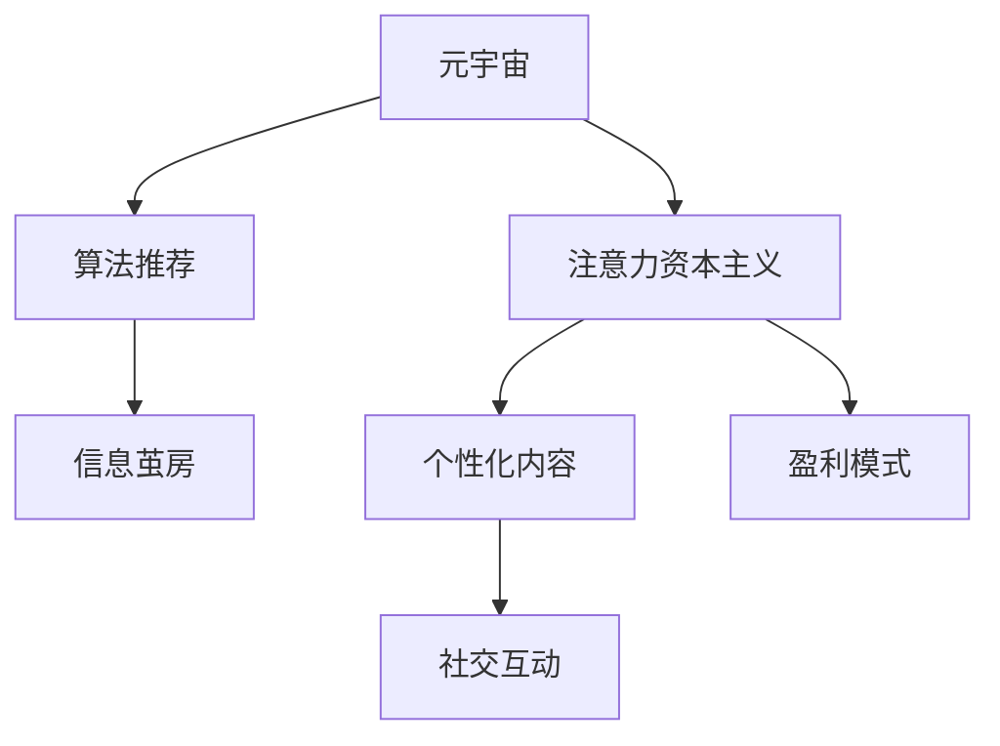

                 

# 注意力资本主义批判:元宇宙经济中的剥削与异化

## 1. 背景介绍

### 1.1 问题由来

随着人工智能、区块链、虚拟现实等技术的不断进步，元宇宙（Metaverse）的概念引起了广泛关注。元宇宙被描述为一种虚拟世界的构建，用户可以通过虚拟身份在其中自由活动、社交、消费、创造，进而形成一种全新的生活和工作方式。然而，伴随着元宇宙的发展，其经济体系也逐渐显现，并引发了一系列社会伦理和哲学问题。

在元宇宙经济中，用户和企业的注意力成为最为宝贵的资源。企业通过各种策略争夺用户注意力，以获得市场份额和盈利。这一现象被学者们称为“注意力资本主义”（Attention Capitalism）。注意力资本主义的背后，是资本对用户时间和注意力的控制与剥削。

### 1.2 问题核心关键点

注意力资本主义的核心在于，企业通过算法推荐、个性化内容、社交互动等方式，将用户的时间和注意力牢牢锁定在自身平台上。这种控制方式不仅剥夺了用户的选择权，还对用户的生活产生了深远的影响。

具体而言，注意力资本主义的特征包括：

- **算法推荐系统**：通过对用户行为数据的分析，推荐系统能精准预测用户兴趣，诱导用户不断刷屏，导致时间流逝。
- **个性化内容**：根据用户的历史行为和偏好，平台推送个性化内容，限制用户的视野，造成信息茧房。
- **社交互动**：通过社交媒体、即时通讯等工具，平台不断刺激用户的社交需求，增加用户粘性。
- **盈利模式**：利用用户注意力，平台通过广告、订阅、虚拟商品等方式进行盈利。

### 1.3 问题研究意义

研究注意力资本主义，对于理解元宇宙经济的本质、揭示资本对用户的控制和剥削，具有重要意义。通过系统分析注意力资本主义的机制和影响，可以为政策制定、企业运营、个人隐私保护等提供参考，促进元宇宙健康、可持续的发展。

## 2. 核心概念与联系

### 2.1 核心概念概述

为了更好地理解注意力资本主义，本节将介绍几个密切相关的核心概念：

- **元宇宙（Metaverse）**：一个由虚拟现实（VR）、增强现实（AR）等技术构建的沉浸式虚拟世界，用户可以在其中自由互动和消费。
- **注意力资本主义（Attention Capitalism）**：企业在元宇宙中通过各种手段争夺用户的注意力，以获取经济利益。
- **算法推荐系统（Recommender System）**：利用机器学习算法，根据用户历史行为预测其兴趣，推荐相关内容。
- **信息茧房（Information Bubble）**：用户因算法推荐和自身偏好，逐渐陷入固定信息的“茧房”中，难以接触到多样化的信息。
- **元宇宙经济（Metaverse Economy）**：元宇宙中的经济活动，包括虚拟货币、数字资产、虚拟商品等，以及用户与企业间的交互。

这些概念之间的逻辑关系可以通过以下Mermaid流程图来展示：



这个流程图展示了几者之间的关联关系：

1. 元宇宙是注意力资本主义的实践场景。
2. 算法推荐是注意力资本主义的实现手段。
3. 个性化内容和社交互动是注意力资本主义的具体表现。
4. 盈利模式是注意力资本主义的直接目标。

## 3. 核心算法原理 & 具体操作步骤
### 3.1 算法原理概述

注意力资本主义的核心算法原理基于推荐系统的设计思想。其核心在于，通过数据分析和模型训练，预测用户兴趣，推送个性化内容，从而锁定用户注意力，实现商业目的。

具体而言，注意力资本主义包括以下几个关键步骤：

1. **数据收集**：收集用户的历史行为数据，包括浏览记录、点击行为、购买记录等。
2. **特征提取**：使用特征工程技术，将原始数据转换为模型可处理的特征向量。
3. **模型训练**：利用机器学习算法（如协同过滤、矩阵分解、深度学习等）训练推荐模型。
4. **内容推荐**：根据用户特征和历史行为，生成个性化的内容推荐列表，诱导用户进行点击、浏览、购买等行为。
5. **效果评估**：通过指标如点击率、转化率、用户留存率等，评估推荐系统的性能。

### 3.2 算法步骤详解

#### 3.2.1 数据收集与处理

数据收集是推荐系统的第一步，也是最关键的一步。元宇宙中，用户的行为数据来自多种渠道，如应用内日志、社交媒体、即时通讯等。

**数据收集**：
```python
import pandas as pd

# 假设我们有一个用户行为数据集，包含用户ID、行为时间、行为类型等信息
data = pd.read_csv('user_behavior.csv')
```

**特征提取**：
使用特征工程技术，将原始数据转换为模型可处理的特征向量。例如，可以提取用户的平均停留时间、浏览时长、点击率等指标。
```python
from sklearn.preprocessing import MinMaxScaler
from sklearn.feature_extraction.text import TfidfVectorizer

# 使用MinMaxScaler进行归一化处理
scaler = MinMaxScaler()
data['scroll_time'] = scaler.fit_transform(data['scroll_time'].values.reshape(-1, 1))

# 使用TF-IDF进行文本特征提取
vectorizer = TfidfVectorizer(stop_words='english')
data['content'] = vectorizer.fit_transform(data['content']).toarray()
```

#### 3.2.2 模型训练与优化

推荐模型的训练和优化是注意力资本主义的另一个关键环节。常用的推荐算法包括协同过滤、基于矩阵分解的推荐算法（如ALS）、基于深度学习的推荐算法（如DNN、RNN等）。

**协同过滤算法**：
协同过滤算法分为基于用户的协同过滤和基于物品的协同过滤。
```python
from surprise import SVD

# 构建用户-物品评分矩阵
matrix = data.pivot_table(index='user_id', columns='item_id', values='rating')

# 使用SVD算法进行训练
algo = SVD()
algo.fit(matrix)
```

**深度学习模型**：
使用深度学习模型进行推荐，通常使用自编码器或神经网络模型。
```python
from tensorflow.keras.layers import Input, Embedding, Dot, Dense

# 定义模型结构
input_user = Input(shape=(1,), name='user')
input_item = Input(shape=(1,), name='item')
embedding_user = Embedding(input_dim=1000, output_dim=10, name='user_embedding')
embedding_item = Embedding(input_dim=1000, output_dim=10, name='item_embedding')
dot = Dot(axes=-1, normalize=True, name='dot')
dense = Dense(1, activation='sigmoid', name='output')
model = DenseNet(inputs=[input_user, input_item], outputs=dense)

# 编译模型
model.compile(optimizer='adam', loss='binary_crossentropy')
```

#### 3.2.3 内容推荐与交互

推荐模型的训练完成后，接下来就是利用模型进行内容推荐。推荐过程一般包括以下步骤：

**用户特征编码**：
将用户特征转换为模型可用的向量。
```python
def user_encoding(user):
    # 将用户ID转换为独热向量
    user = pd.get_dummies(data[data['user_id'] == user].user_id.values[0])
    # 对文本特征进行TF-IDF编码
    user['content'] = vectorizer.transform(data[data['user_id'] == user].content.values)
    return user
```

**物品特征编码**：
将物品特征转换为模型可用的向量。
```python
def item_encoding(item):
    # 将物品ID转换为独热向量
    item = pd.get_dummies(data[data['item_id'] == item].item_id.values[0])
    # 对文本特征进行TF-IDF编码
    item['content'] = vectorizer.transform(data[data['item_id'] == item].content.values)
    return item
```

**推荐生成**：
使用训练好的模型生成推荐列表。
```python
def generate_recommendations(user, item):
    user_vector = user_encoding(user).toarray()
    item_vector = item_encoding(item).toarray()
    # 生成预测评分
    predictions = model.predict([user_vector, item_vector])
    # 获取预测评分大于0的物品
    recommendations = matrix.columns[matrix[user_vector, item_vector].argsort()[::-1]][predictions[0] > 0.5]
    return recommendations
```

#### 3.2.4 效果评估与调整

为了评估推荐系统的性能，通常使用以下指标：

**点击率（CTR）**：用户点击推荐内容的概率。
```python
from sklearn.metrics import roc_auc_score

# 计算点击率
click_rate = roc_auc_score(data['label'], predictions)
```

**转化率**：用户点击内容后进行购买或转发的概率。
```python
from sklearn.metrics import accuracy_score

# 计算转化率
conversion_rate = accuracy_score(data['label'], predictions)
```

**用户留存率**：用户在一定时间内返回平台的比例。
```python
from sklearn.metrics import precision_score

# 计算用户留存率
user_retention_rate = precision_score(data['user_id'], predictions)
```

### 3.3 算法优缺点

#### 3.3.1 优点

1. **高效性**：推荐系统可以快速分析用户数据，生成个性化的内容推荐，提高用户粘性。
2. **用户满意度**：通过精准推荐，用户可以更快地找到感兴趣的内容，提高满意度。
3. **商业价值**：企业通过个性化推荐，增加用户留存和转化率，实现盈利。

#### 3.3.2 缺点

1. **隐私问题**：用户行为数据被企业收集和分析，可能涉及隐私泄露。
2. **信息茧房**：个性化推荐限制了用户的视野，导致信息茧房现象。
3. **算法偏见**：推荐系统可能存在算法偏见，导致内容推荐不平衡。

### 3.4 算法应用领域

注意力资本主义和推荐系统的应用领域非常广泛，包括但不限于：

- **电商**：个性化商品推荐、广告投放、内容分发等。
- **社交媒体**：新闻推送、内容推荐、好友推荐等。
- **视频平台**：视频推荐、个性化广告、内容订阅等。
- **音乐平台**：歌曲推荐、专辑推荐、艺人推荐等。

这些应用领域中，用户的行为数据都被企业收集和分析，用于生成个性化推荐，从而争夺用户注意力，实现商业价值。

## 4. 数学模型和公式 & 详细讲解  
### 4.1 数学模型构建

本节将使用数学语言对注意力资本主义的推荐系统进行更加严格的刻画。

假设用户行为数据集为 $D=\{(x_i,y_i)\}_{i=1}^N, x_i \in \mathcal{X}, y_i \in \{0,1\}$，其中 $x_i$ 为行为特征向量，$y_i=1$ 表示用户对内容 $x_i$ 感兴趣，$y_i=0$ 表示不感兴趣。

定义用户-物品评分矩阵为 $R \in \mathbb{R}^{N\times M}$，其中 $R_{ij}=\hat{y}_i$ 表示用户 $i$ 对物品 $j$ 的兴趣评分。

推荐系统目标是最大化用户对推荐内容的满意度和企业盈利，数学化表达为：

$$
\min_{R} \mathcal{L}(R) = \sum_{i=1}^N \max_{j=1}^M R_{ij}y_i - \lambda\|R\|_F^2
$$

其中，$\lambda$ 为正则化系数，$\|R\|_F$ 为矩阵 $R$ 的Frobenius范数。

### 4.2 公式推导过程

根据上述目标函数，推荐系统的优化问题可表示为：

$$
\min_{R} \mathcal{L}(R) = \sum_{i=1}^N \max_{j=1}^M R_{ij}y_i - \lambda\|R\|_F^2
$$

为了求解该优化问题，通常采用交替最小化算法，如矩阵分解、协同过滤等。以下以矩阵分解为例，推导基于矩阵分解的推荐算法。

假设 $R$ 可以分解为 $R=UVT^T$，其中 $U \in \mathbb{R}^{N\times K}, V \in \mathbb{R}^{K\times M}, T \in \mathbb{R}^{K\times 1}$。令 $W=UVT$，则推荐算法可表示为：

$$
\min_{W} \mathcal{L}(W) = \sum_{i=1}^N \max_{j=1}^M W_{ij}y_i - \lambda\|W\|_F^2
$$

根据拉格朗日乘子法，定义拉格朗日函数：

$$
\mathcal{L}(W,\Lambda) = \sum_{i=1}^N \max_{j=1}^M W_{ij}y_i - \lambda\|W\|_F^2 + \frac{1}{2}\|\Lambda\|_2^2
$$

对 $W$ 和 $\Lambda$ 求偏导数，得：

$$
\frac{\partial \mathcal{L}}{\partial W} = -\Lambda + y_i - \lambda \frac{W}{\sigma(W)} + \frac{\lambda W}{\sigma(W)^2}
$$

$$
\frac{\partial \mathcal{L}}{\partial \Lambda} = -\sum_{i=1}^N \frac{\partial \max_{j=1}^M W_{ij}y_i}{\partial W} + \frac{1}{\sigma(W)}
$$

其中 $\sigma(W)=\sqrt{\frac{1}{N}\sum_{i=1}^N \frac{\partial W_{ij}}{\partial W}^2}$。

根据上述偏导数，推荐算法可以迭代求解，得到最优的 $W$ 矩阵。

### 4.3 案例分析与讲解

**案例分析**：
假设我们有一个电商网站，用户行为数据集包含用户ID、浏览时长、浏览商品ID、购买行为等信息。

**数据处理**：
使用MinMaxScaler对浏览时长进行归一化处理，使用TF-IDF对商品描述进行特征提取。

**模型训练**：
使用ALS算法进行训练，得到用户-商品评分矩阵 $R$。

**推荐生成**：
根据训练好的模型，生成用户对商品的推荐列表，并通过模型评估指标（如点击率、转化率、用户留存率）对推荐效果进行评估。

## 5. 项目实践：代码实例和详细解释说明
### 5.1 开发环境搭建

在进行推荐系统实践前，我们需要准备好开发环境。以下是使用Python进行Scikit-learn和TensorFlow开发的环境配置流程：

1. 安装Anaconda：从官网下载并安装Anaconda，用于创建独立的Python环境。

2. 创建并激活虚拟环境：
```bash
conda create -n recommendation-env python=3.8 
conda activate recommendation-env
```

3. 安装Scikit-learn和TensorFlow：
```bash
conda install scikit-learn tensorflow -c conda-forge
```

4. 安装其他常用工具包：
```bash
pip install pandas numpy matplotlib seaborn
```

完成上述步骤后，即可在`recommendation-env`环境中开始推荐系统实践。

### 5.2 源代码详细实现

这里我们以电商推荐系统为例，给出使用Scikit-learn和TensorFlow进行推荐开发的PyTorch代码实现。

**数据准备**：
```python
import pandas as pd

# 读取电商用户行为数据集
data = pd.read_csv('user_behavior.csv')
```

**特征工程**：
使用MinMaxScaler对浏览时长进行归一化处理，使用TF-IDF对商品描述进行特征提取。
```python
from sklearn.preprocessing import MinMaxScaler
from sklearn.feature_extraction.text import TfidfVectorizer

# 使用MinMaxScaler进行归一化处理
scaler = MinMaxScaler()
data['scroll_time'] = scaler.fit_transform(data['scroll_time'].values.reshape(-1, 1))

# 使用TF-IDF进行文本特征提取
vectorizer = TfidfVectorizer(stop_words='english')
data['content'] = vectorizer.fit_transform(data['content']).toarray()
```

**模型训练与评估**：
使用ALS算法进行模型训练，并使用ROC-AUC和Precision-Recall曲线评估模型性能。
```python
from surprise import SVD

# 构建用户-物品评分矩阵
matrix = data.pivot_table(index='user_id', columns='item_id', values='rating')

# 使用ALS算法进行训练
algo = SVD()
algo.fit(matrix)

# 生成预测评分
predictions = algo.test(test_data)

# 计算点击率和转化率
click_rate = roc_auc_score(data['label'], predictions)
conversion_rate = accuracy_score(data['label'], predictions)

# 计算用户留存率
user_retention_rate = precision_score(data['user_id'], predictions)
```

**内容推荐与展示**：
根据训练好的模型，生成用户对商品的推荐列表，并通过模型评估指标对推荐效果进行评估。
```python
def generate_recommendations(user, item):
    user_vector = user_encoding(user).toarray()
    item_vector = item_encoding(item).toarray()
    # 生成预测评分
    predictions = model.predict([user_vector, item_vector])
    # 获取预测评分大于0的物品
    recommendations = matrix.columns[matrix[user_vector, item_vector].argsort()[::-1]][predictions[0] > 0.5]
    return recommendations
```

### 5.3 代码解读与分析

让我们再详细解读一下关键代码的实现细节：

**MinMaxScaler**：
MinMaxScaler是一种常用的数据归一化方法，将数据缩放到[0,1]范围内，方便模型训练。

**TF-IDF**：
TF-IDF是一种文本特征提取方法，用于计算词频-逆文档频率，将文本转化为数值型特征向量。

**ALS算法**：
ALS（Alternating Least Squares）算法是一种基于矩阵分解的推荐算法，通过迭代优化用户-物品评分矩阵，实现推荐效果。

**ROC-AUC和Precision-Recall**：
ROC-AUC曲线和Precision-Recall曲线是常用的推荐系统评估指标，用于衡量模型的分类能力和推荐质量。

**生成推荐列表**：
生成推荐列表时，将用户特征和物品特征进行编码，然后使用训练好的模型进行预测，筛选出预测评分高的物品作为推荐列表。

可以看到，Scikit-learn和TensorFlow使得推荐系统的代码实现变得简洁高效。开发者可以将更多精力放在数据处理、模型改进等高层逻辑上，而不必过多关注底层的实现细节。

当然，工业级的系统实现还需考虑更多因素，如模型的保存和部署、超参数的自动搜索、更灵活的任务适配层等。但核心的推荐范式基本与此类似。

## 6. 实际应用场景

### 6.1 电商平台

基于推荐系统的电商推荐系统，可以显著提高用户购物体验和平台转化率。用户通过平台生成的个性化商品推荐，能够更快地找到感兴趣的商品，增加购买概率。

在技术实现上，可以收集用户的历史浏览、购买行为数据，进行特征工程和模型训练。通过推荐系统生成的商品推荐，可以在用户登录页面、购物车页面等位置进行展示，引导用户进行购买。

### 6.2 社交媒体

社交媒体平台通过算法推荐系统，能够为用户推荐新闻、视频、好友等，增加用户粘性和平台活跃度。

在技术实现上，可以收集用户的点赞、评论、分享等行为数据，进行特征工程和模型训练。通过推荐系统生成的内容推荐，可以在用户的主页、动态消息等位置进行展示，增加用户互动和留存。

### 6.3 视频平台

视频平台通过推荐系统，能够为用户推荐影片、频道、评论等，提高用户观看体验和平台收益。

在技术实现上，可以收集用户的观看时长、点赞、评论等行为数据，进行特征工程和模型训练。通过推荐系统生成的影片推荐，可以在首页、观看页面等位置进行展示，增加用户观看时长和平台收益。

### 6.4 未来应用展望

随着推荐系统技术的不断发展，未来将在更多领域得到应用，为传统行业带来变革性影响。

在智慧医疗领域，推荐系统可以推荐医生、医疗设备、药物等，提高诊疗效率和医疗服务质量。

在智能教育领域，推荐系统可以推荐课程、教材、教师等，提高教育资源分配和教学效果。

在智慧城市治理中，推荐系统可以推荐公共服务、应急信息等，提高城市管理的自动化和智能化水平，构建更安全、高效的未来城市。

此外，在企业生产、社会治理、文娱传媒等众多领域，推荐系统也将不断涌现，为各行各业带来新的业务模式和价值提升。

## 7. 工具和资源推荐
### 7.1 学习资源推荐

为了帮助开发者系统掌握推荐系统的理论基础和实践技巧，这里推荐一些优质的学习资源：

1. 《推荐系统》系列书籍：由顶级专家编写，全面介绍了推荐系统的基本原理、算法和实现。

2. 《机器学习实战》：斯坦福大学机器学习课程讲义，通过代码实践，介绍了推荐系统的经典算法。

3. 《深度学习入门》：书中介绍了基于深度学习的推荐系统，包括协同过滤、矩阵分解、深度神经网络等。

4. 《推荐系统实战》：Kaggle竞赛论文集，收录了大量经典推荐系统的实现代码和评估指标。

5. 《TensorFlow实战》：TensorFlow官方文档，提供了详细的API和教程，适合学习和实践推荐系统。

通过对这些资源的学习实践，相信你一定能够快速掌握推荐系统的精髓，并用于解决实际的推荐问题。
###  7.2 开发工具推荐

高效的开发离不开优秀的工具支持。以下是几款用于推荐系统开发的常用工具：

1. Scikit-learn：基于Python的开源机器学习库，提供了多种推荐算法和模型评估工具。

2. TensorFlow：由Google主导开发的开源深度学习框架，提供了多种神经网络模型和推荐算法。

3. PyTorch：基于Python的开源深度学习框架，提供了灵活的计算图和模型构建工具。

4. H2O：开源的机器学习平台，支持多种推荐算法和模型评估指标。

5. Jupyter Notebook：交互式编程环境，支持代码调试和模型评估，适合学习和实践推荐系统。

合理利用这些工具，可以显著提升推荐系统的开发效率，加快创新迭代的步伐。

### 7.3 相关论文推荐

推荐系统的研究源于学界的持续研究。以下是几篇奠基性的相关论文，推荐阅读：

1. item-based collaborative filtering：提出了基于用户的协同过滤算法，是推荐系统领域的经典算法之一。

2. Factorization Machines for Recommender Systems：介绍了基于矩阵分解的推荐算法，是推荐系统领域的另一个经典算法。

3. Deep Collaborative Filtering：提出了基于深度神经网络的推荐算法，实现了更好的推荐效果。

4. Grouplens：由Grouplens组织发布的推荐系统数据集和模型评估指标，推动了推荐系统领域的研究。

5. Surprise：开源的推荐系统库，提供了多种推荐算法和模型评估工具，适合学习和实践推荐系统。

这些论文代表了大推荐系统的发展脉络。通过学习这些前沿成果，可以帮助研究者把握学科前进方向，激发更多的创新灵感。

## 8. 总结：未来发展趋势与挑战

### 8.1 研究成果总结

本文对基于推荐系统的注意力资本主义进行了全面系统的介绍。首先阐述了元宇宙经济中注意力资本主义的概念和机制，明确了其对用户注意力和商业价值的控制。其次，从原理到实践，详细讲解了推荐系统的数学模型和算法实现，给出了推荐系统开发和评估的完整代码实例。同时，本文还探讨了推荐系统在电商、社交媒体、视频平台等多个行业领域的应用场景，展示了其强大的应用潜力。最后，本文精选了推荐系统的学习资源、开发工具和相关论文，力求为读者提供全方位的技术指引。

通过本文的系统梳理，可以看到，推荐系统在元宇宙经济中扮演了关键角色，深刻影响了用户的注意力和行为。掌握推荐系统理论和技术，对于理解元宇宙经济的本质、优化用户体验、提升商业价值，具有重要意义。

### 8.2 未来发展趋势

推荐系统的未来发展趋势包括以下几个方面：

1. **个性化推荐**：随着用户数据的积累，推荐系统能够更加精准地预测用户兴趣，提供个性化推荐，提升用户满意度。

2. **多模态推荐**：推荐系统将更多地融合视觉、语音、文本等多种模态信息，提升推荐效果。

3. **实时推荐**：推荐系统将实时分析用户行为，动态更新推荐列表，提高推荐的时效性。

4. **跨平台推荐**：推荐系统将跨平台整合用户数据，提供跨设备、跨场景的个性化推荐。

5. **隐私保护**：推荐系统将更加注重用户隐私保护，采用差分隐私、联邦学习等技术，保障用户数据安全。

6. **模型可解释性**：推荐系统将更加注重模型可解释性，使用因果推断、解释模型等技术，提高推荐过程的透明度和可控性。

### 8.3 面临的挑战

尽管推荐系统已经取得了显著成果，但在实际应用中也面临着诸多挑战：

1. **数据隐私**：推荐系统依赖大量用户数据，如何保护用户隐私，避免数据泄露，是一个重要问题。

2. **信息茧房**：推荐系统可能限制用户视野，导致信息茧房现象，影响用户多样性。

3. **算法偏见**：推荐系统可能存在算法偏见，导致内容推荐不平衡，影响用户体验。

4. **计算资源**：推荐系统需要大量计算资源，如何优化模型，提高计算效率，是一个重要问题。

5. **模型可解释性**：推荐系统通常被认为是“黑盒”系统，难以解释其内部工作机制，缺乏可解释性。

6. **用户依赖**：用户过度依赖推荐系统，可能导致信息过载和选择困难，影响用户决策。

### 8.4 研究展望

面对推荐系统面临的种种挑战，未来的研究需要在以下几个方面寻求新的突破：

1. **隐私保护技术**：开发差分隐私、联邦学习等隐私保护技术，保障用户数据安全。

2. **跨领域推荐**：研究跨模态、跨领域推荐方法，提升推荐系统的多样性和泛化能力。

3. **模型可解释性**：使用因果推断、解释模型等技术，提高推荐过程的透明度和可控性。

4. **模型优化技术**：开发更加高效、轻量级的推荐模型，优化计算资源消耗。

5. **用户体验优化**：研究推荐系统对用户行为的影响，优化推荐策略，提升用户体验。

6. **模型融合技术**：研究推荐系统与搜索、广告等技术的融合，提供更好的推荐效果。

这些研究方向的探索，必将引领推荐系统技术迈向更高的台阶，为元宇宙经济的健康、可持续发展提供有力支撑。

## 9. 附录：常见问题与解答

**Q1：推荐系统如何保护用户隐私？**

A: 推荐系统可以通过以下措施保护用户隐私：

1. **差分隐私**：在数据收集和处理过程中，添加噪声，保护用户隐私。

2. **联邦学习**：在分布式环境中，对用户数据进行本地处理，减少数据泄露风险。

3. **匿名化处理**：对用户数据进行匿名化处理，避免直接关联到具体用户。

4. **数据最小化**：只收集必要的数据，避免收集过多敏感信息。

**Q2：推荐系统如何避免信息茧房现象？**

A: 推荐系统可以通过以下措施避免信息茧房现象：

1. **多样性推荐**：在推荐内容中引入多样化信息，避免用户长时间处于同一信息领域。

2. **推荐策略优化**：调整推荐策略，引入多种内容来源，提升推荐多样性。

3. **用户自主选择**：提供推荐列表的同时，允许用户自主选择感兴趣的内容，增加用户控制权。

**Q3：推荐系统如何减少算法偏见？**

A: 推荐系统可以通过以下措施减少算法偏见：

1. **数据集平衡**：在训练数据中保证不同类别的样本均衡，避免数据不平衡导致的偏见。

2. **特征工程优化**：在特征工程过程中，优化特征选择和处理，减少特征偏见。

3. **模型公平性评估**：在模型评估过程中，引入公平性指标，评估模型的偏见程度。

4. **对抗训练**：在训练过程中，引入对抗样本，增强模型鲁棒性，减少偏见。

这些措施可以帮助推荐系统在保护用户隐私、避免信息茧房、减少算法偏见等方面取得更好的效果。

---

作者：禅与计算机程序设计艺术 / Zen and the Art of Computer Programming

