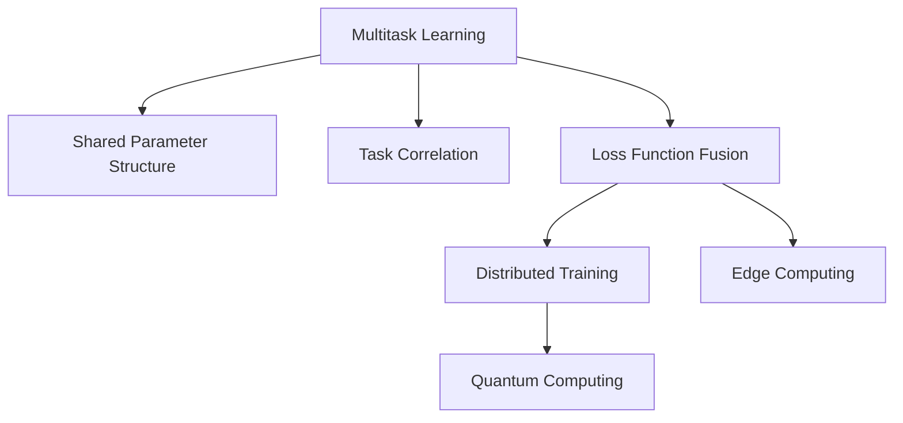

                 

# 注意力量子态管理：AI时代的多任务处理策略

> 关键词：注意力管理,多任务学习,深度学习,分布式训练,边缘计算,量子计算

## 1. 背景介绍

### 1.1 问题由来

随着深度学习技术的迅猛发展，人工智能(AI)系统已经成为驱动各行各业创新的重要引擎。然而，随着应用场景的复杂化，单一任务的深度学习模型越来越难以满足需求。多任务学习(Multi-task Learning, MTL)作为解决这一问题的重要手段，逐渐受到研究者和工业界的广泛关注。

多任务学习旨在通过联合训练多个相关任务的模型，提升模型的泛化能力和迁移学习能力，从而在多个任务上取得更优的表现。例如，通过联合训练图像分类和物体检测任务，可以提升模型在物体检测上的鲁棒性和准确性。

但多任务学习的实现并非易事。模型的共享参数设计、损失函数的融合、任务之间的协同优化等关键问题亟待解决。本文章旨在详细探讨多任务学习的核心概念、核心算法原理、具体操作步骤以及具体应用案例，希望能为相关领域的学者和从业者提供有价值的参考。

### 1.2 问题核心关键点

- 多任务学习的原理和架构：如何设计共享参数结构，最大化利用多个任务间的相关性。
- 多任务学习中的损失函数融合：如何将多个任务的损失函数组合，避免信息丢失和过拟合。
- 多任务学习的分布式训练策略：如何在计算资源有限的条件下，进行高效的分布式训练。
- 多任务学习的边缘计算应用：如何在计算资源和通信带宽受限的边端设备上进行多任务推理。
- 多任务学习的量子计算应用：如何在量子计算硬件上进行多任务学习模型的训练和推理。

这些关键问题共同构成了多任务学习的核心挑战，本文将系统梳理这些问题的解决方案，并给出相应的技术路径和实践案例。

## 2. 核心概念与联系

### 2.1 核心概念概述

为更好地理解多任务学习，首先需要明确以下几个核心概念：

- **多任务学习(Multitask Learning, MTL)**：指通过联合训练多个相关任务的模型，提升模型在多个任务上的性能。多任务学习可以缓解单个任务数据量不足的问题，提升模型泛化能力和迁移学习能力。

- **共享参数结构(Shared Parameter Structure)**：指在设计多任务模型时，将多个任务共享部分参数，以最大化利用不同任务间的相关性。共享参数结构能够有效降低模型复杂度，提高训练效率。

- **任务相关性(Task Correlation)**：指不同任务间存在的内在关联关系，例如，图像分类和图像分割任务，在视觉特征提取上具有较强的一致性。

- **损失函数融合(Loss Function Fusion)**：指在多任务学习中，如何将不同任务的损失函数进行有效融合，使得模型能够同时学习多个任务的知识，并避免信息丢失和过拟合。

- **分布式训练(Distributed Training)**：指在计算资源有限的情况下，将模型的训练任务分布到多个计算节点上进行，以提高训练效率和模型性能。

- **边缘计算(Edge Computing)**：指将部分数据处理任务从云端转移到边端设备上，以减少数据传输延迟和带宽需求，提升推理速度和实时性。

- **量子计算(Quantum Computing)**：指利用量子位(qubits)进行计算的新型计算方式，具有更高的并行度和计算速度，适用于处理大规模、复杂的多任务学习问题。

这些核心概念之间的逻辑关系可以通过以下Mermaid流程图来展示：



这个流程图展示了多任务学习过程中各个核心概念之间的关系：

1. 多任务学习依赖于共享参数结构，以最大化不同任务间的相关性。
2. 任务相关性指导损失函数融合的设计，提升模型的泛化能力。
3. 损失函数融合在分布式训练中被进一步优化，提高训练效率和效果。
4. 分布式训练被应用于边缘计算，提升模型的实时性和可用性。
5. 边缘计算和分布式训练为量子计算提供技术基础，处理更大规模的多任务学习问题。

## 3. 核心算法原理 & 具体操作步骤
### 3.1 算法原理概述

多任务学习的核心思想是通过联合训练多个相关任务，最大化模型在各个任务上的性能。其核心算法包括共享参数结构设计、损失函数融合、优化算法选择等。

### 3.2 算法步骤详解

多任务学习的一般步骤如下：

**Step 1: 数据预处理**

- 收集和准备各个任务的数据集，并进行必要的数据清洗和预处理。

**Step 2: 定义共享参数结构**

- 设计共享参数结构，以最大化不同任务之间的相关性。常见的共享参数结构包括任务共享层、参数耦合等方式。

**Step 3: 定义损失函数**

- 选择合适的损失函数融合方式，如平均损失函数、联合矩阵分解等，将多个任务的损失函数进行有效融合。

**Step 4: 优化算法选择**

- 选择合适的优化算法，如Adam、SGD等，并设置合适的学习率、批大小等超参数。

**Step 5: 模型训练和评估**

- 使用分布式训练策略，将训练任务分布到多个计算节点上进行。
- 在训练过程中，周期性地在验证集上评估模型性能，根据性能指标决定是否停止训练。
- 训练完成后，使用测试集对模型进行最终评估，比较不同任务上的表现。

### 3.3 算法优缺点

多任务学习的优点包括：

- **提高泛化能力**：通过联合训练多个任务，提升模型在不同任务上的泛化能力。
- **减少数据需求**：多个任务共享部分参数，可以缓解单个任务数据量不足的问题。
- **提升计算效率**：通过共享参数和分布式训练，提升模型的训练和推理效率。

同时，多任务学习也存在一些缺点：

- **参数共享问题**：如果多个任务的相关性不强，共享参数结构可能降低模型的灵活性和性能。
- **过拟合风险**：多任务学习可能增加模型的过拟合风险，特别是任务间差异较大的情况。
- **训练复杂度增加**：多任务学习的设计和实现相对复杂，需要精心设计共享参数结构、损失函数等关键组件。

### 3.4 算法应用领域

多任务学习在多个领域都有广泛的应用，例如：

- **计算机视觉**：联合训练图像分类、目标检测、语义分割等任务，提升模型的鲁棒性和准确性。
- **自然语言处理**：联合训练文本分类、情感分析、命名实体识别等任务，提升模型的泛化能力和迁移学习能力。
- **信号处理**：联合训练语音识别、语音生成、图像识别等任务，提升模型的实时性和鲁棒性。
- **医疗领域**：联合训练疾病诊断、基因分析、图像分析等任务，提升医疗决策的准确性和可靠性。

此外，多任务学习还被应用于推荐系统、金融风险预测、自动驾驶等领域，为各行业带来创新性解决方案。

## 4. 数学模型和公式 & 详细讲解 & 举例说明

### 4.1 数学模型构建

在多任务学习中，我们需要定义一个能够联合多个任务的多层神经网络模型。假设共有 $K$ 个任务，模型的共享参数为 $\theta$，每个任务的输出为 $y_k$，对应的损失函数为 $L_k$。

多任务学习模型的总体损失函数可以定义为：

$$
L(\theta) = \sum_{k=1}^K L_k(\theta)
$$

其中，$L_k(\theta)$ 表示任务 $k$ 的损失函数。常见的损失函数包括交叉熵损失、均方误差损失等。

### 4.2 公式推导过程

以二分类任务为例，定义两个任务的损失函数分别为：

$$
L_1(\theta) = -\frac{1}{N_1}\sum_{i=1}^{N_1}[y_{i,1}\log M_{\theta}(x_i)+(1-y_{i,1})\log(1-M_{\theta}(x_i))]
$$

$$
L_2(\theta) = -\frac{1}{N_2}\sum_{i=1}^{N_2}[y_{i,2}\log M_{\theta}(x_i)+(1-y_{i,2})\log(1-M_{\theta}(x_i))]
$$

其中，$M_{\theta}(x)$ 表示模型对输入 $x$ 的输出。通过将两个任务的损失函数求和，即可得到多任务学习的总体损失函数：

$$
L(\theta) = L_1(\theta) + L_2(\theta)
$$

### 4.3 案例分析与讲解

考虑一个多任务学习模型，用于联合训练图像分类和物体检测任务。假设共有10个分类类别，每个类别均具有多个物体实例。模型通过多尺度特征图提取和共享卷积层进行联合训练。

具体实现步骤如下：

1. 收集和准备图像分类和物体检测任务的数据集。
2. 设计共享卷积层和分类层，以最大化不同任务间的相关性。
3. 定义交叉熵损失函数，融合两个任务的损失函数。
4. 使用分布式训练策略，将训练任务分布到多个计算节点上进行。
5. 在训练过程中，周期性地在验证集上评估模型性能，根据性能指标决定是否停止训练。
6. 训练完成后，使用测试集对模型进行最终评估，比较不同任务上的表现。

## 5. 项目实践：代码实例和详细解释说明
### 5.1 开发环境搭建

在进行多任务学习项目开发前，我们需要准备好开发环境。以下是使用Python进行TensorFlow进行多任务学习项目开发的环境配置流程：

1. 安装Anaconda：从官网下载并安装Anaconda，用于创建独立的Python环境。

2. 创建并激活虚拟环境：
```bash
conda create -n multitask-env python=3.8 
conda activate multitask-env
```

3. 安装TensorFlow：从官网获取对应的安装命令。例如：
```bash
conda install tensorflow -c tf
```

4. 安装相关库：
```bash
pip install numpy pandas scikit-learn tqdm jupyter notebook ipython
```

完成上述步骤后，即可在`multitask-env`环境中开始多任务学习项目开发。

### 5.2 源代码详细实现

这里我们以联合训练图像分类和物体检测任务为例，给出使用TensorFlow进行多任务学习的代码实现。

首先，定义多任务损失函数：

```python
import tensorflow as tf
from tensorflow.keras import layers, models

class MultiTaskModel(models.Model):
    def __init__(self, num_classes):
        super(MultiTaskModel, self).__init__()
        self.shared_conv1 = layers.Conv2D(32, (3, 3), activation='relu')
        self.shared_conv2 = layers.Conv2D(64, (3, 3), activation='relu')
        self.shared_conv3 = layers.Conv2D(128, (3, 3), activation='relu')
        self.classifier = layers.Dense(num_classes)
        self.detection_head = layers.Dense(4) # x, y, w, h
        
    def call(self, inputs):
        x = self.shared_conv1(inputs)
        x = self.shared_conv2(x)
        x = self.shared_conv3(x)
        x = self.classifier(x)
        x_detection = self.detection_head(x)
        return x, x_detection

def multi_task_loss(y_true, y_pred):
    y_true_class, y_true_detection = y_true
    y_pred_class, y_pred_detection = y_pred
    class_loss = tf.losses.categorical_crossentropy(y_true_class, y_pred_class)
    detection_loss = tf.losses.mean_squared_error(y_true_detection, y_pred_detection)
    return class_loss + detection_loss
```

然后，定义数据集和数据增强：

```python
from tensorflow.keras.preprocessing.image import ImageDataGenerator

train_datagen = ImageDataGenerator(
    rescale=1./255,
    shear_range=0.2,
    zoom_range=0.2,
    horizontal_flip=True)

test_datagen = ImageDataGenerator(rescale=1./255)

train_generator = train_datagen.flow_from_directory(
    'train',
    target_size=(224, 224),
    batch_size=32,
    class_mode='categorical')

test_generator = test_datagen.flow_from_directory(
    'test',
    target_size=(224, 224),
    batch_size=32,
    class_mode='categorical')
```

接着，定义模型和优化器：

```python
model = MultiTaskModel(num_classes=10)
optimizer = tf.keras.optimizers.Adam(learning_rate=0.001)
```

最后，定义训练和评估函数：

```python
from tensorflow.keras import callbacks

def train_epoch(model, train_generator, val_generator, optimizer, num_epochs):
    steps_per_epoch = train_generator.samples // train_generator.batch_size
    steps_val = val_generator.samples // val_generator.batch_size
    history = []
    for epoch in range(num_epochs):
        for step in range(steps_per_epoch):
            inputs, labels = train_generator.next()
            with tf.GradientTape() as tape:
                y_pred = model(inputs)
                loss = multi_task_loss(labels, y_pred)
            gradients = tape.gradient(loss, model.trainable_variables)
            optimizer.apply_gradients(zip(gradients, model.trainable_variables))
        val_loss = []
        for step in range(steps_val):
            inputs, labels = val_generator.next()
            y_pred = model(inputs)
            loss = multi_task_loss(labels, y_pred)
            val_loss.append(loss.numpy())
        history.append(val_loss)
        print(f"Epoch {epoch+1}, validation loss: {np.mean(val_loss):.4f}")
    return history

def evaluate(model, test_generator):
    test_loss = []
    for step in range(len(test_generator)):
        inputs, labels = test_generator.next()
        y_pred = model(inputs)
        loss = multi_task_loss(labels, y_pred)
        test_loss.append(loss.numpy())
    print(f"Test loss: {np.mean(test_loss):.4f}")
```

最后，启动训练流程并在测试集上评估：

```python
epochs = 10
num_classes = 10

history = train_epoch(model, train_generator, test_generator, optimizer, num_epochs)
evaluate(model, test_generator)
```

以上就是使用TensorFlow对图像分类和物体检测任务进行联合训练的完整代码实现。可以看到，TensorFlow提供了便捷的Keras API，使得多任务学习的代码实现变得简洁高效。

### 5.3 代码解读与分析

让我们再详细解读一下关键代码的实现细节：

**MultiTaskModel类**：
- `__init__`方法：定义了共享卷积层和分类层，以及检测头。
- `call`方法：在输入上对共享卷积层进行卷积操作，并通过分类层输出分类结果，同时通过检测头输出物体检测框的坐标。

**multi_task_loss函数**：
- 定义了分类任务和检测任务的损失函数，通过权重因子进行融合。

**train_epoch函数**：
- 在训练过程中，通过ImageDataGenerator进行数据增强，并使用Adam优化器更新模型参数。
- 在验证集上周期性评估模型性能，输出验证损失。

**evaluate函数**：
- 在测试集上评估模型性能，输出测试损失。

通过上述代码，我们可以看到，TensorFlow的多任务学习实现十分灵活，通过定义不同的损失函数和共享参数结构，可以方便地进行多任务联合训练。

## 6. 实际应用场景
### 6.1 图像处理

在图像处理领域，多任务学习被广泛应用于图像分类、物体检测、语义分割等任务。通过联合训练这些任务，可以显著提升模型的泛化能力和鲁棒性。

例如，在医疗影像分析中，通过联合训练疾病的检测和分类任务，可以提升医生的诊断准确性和效率。通过多尺度特征图提取和共享卷积层，模型可以同时学习不同尺度下的图像特征，提升检测和分类的精度。

### 6.2 自然语言处理

在自然语言处理领域，多任务学习也被广泛应用于文本分类、命名实体识别、情感分析等任务。通过联合训练这些任务，可以提升模型的语义理解和迁移学习能力。

例如，在客户服务领域，通过联合训练客服问题和反馈分类任务，可以提升客服系统的响应准确性和用户满意度。通过多任务学习，模型可以同时学习问题和反馈的语义特征，提升分类和分类的准确性。

### 6.3 信号处理

在信号处理领域，多任务学习被广泛应用于语音识别、语音生成、图像识别等任务。通过联合训练这些任务，可以提升模型的实时性和鲁棒性。

例如，在智能家居领域，通过联合训练语音指令识别和图像分析任务，可以实现更加智能化的家居控制。通过多任务学习，模型可以同时学习语音和图像的特征，提升指令识别的准确性和稳定性。

### 6.4 未来应用展望

随着多任务学习的不断发展，其在更多领域的应用前景将更加广阔：

- **智慧医疗**：通过联合训练疾病的检测和分类任务，提升医生的诊断准确性和效率，推动医疗领域的智能化转型。
- **智能教育**：通过联合训练学生的个性化学习任务，提升学习效果和教育公平性，推动教育信息化的发展。
- **智慧城市**：通过联合训练城市事件监测和应急指挥任务，提升城市管理的智能化水平，构建更安全、高效的未来城市。
- **智能交通**：通过联合训练交通信号识别和智能驾驶任务，提升交通系统的智能化和安全性，推动智能交通的发展。

此外，多任务学习在自动驾驶、智慧物流、工业制造等领域也将发挥重要作用，推动各行各业向智能化、自动化方向发展。

## 7. 工具和资源推荐
### 7.1 学习资源推荐

为了帮助开发者系统掌握多任务学习的理论基础和实践技巧，这里推荐一些优质的学习资源：

1. 《深度学习入门之多任务学习》系列博文：由深度学习领域的专家撰写，系统介绍了多任务学习的基本概念、算法原理和应用案例。

2. CS231n《深度学习计算机视觉》课程：斯坦福大学开设的计算机视觉明星课程，涵盖多任务学习在图像处理中的应用，适合深入学习和研究。

3. 《多任务学习》书籍：深入讲解多任务学习的理论基础和算法实现，包括任务共享结构、损失函数融合等关键问题。

4. TensorFlow官方文档：TensorFlow的官方文档，提供了详细的API参考和实例代码，是进行多任务学习开发的重要资源。

5. PyTorch官方文档：PyTorch的官方文档，提供了便捷的深度学习框架接口，支持多任务学习模型的开发和部署。

通过对这些资源的学习实践，相信你一定能够快速掌握多任务学习的精髓，并用于解决实际的NLP问题。

### 7.2 开发工具推荐

高效的开发离不开优秀的工具支持。以下是几款用于多任务学习开发的常用工具：

1. TensorFlow：由Google主导开发的开源深度学习框架，支持分布式训练和多任务学习模型的开发。

2. PyTorch：由Facebook开发的开源深度学习框架，灵活性高，支持动态计算图和多任务学习模型的开发。

3. MXNet：由亚马逊主导开发的深度学习框架，支持分布式训练和多任务学习模型的开发。

4. Keras：高层次的深度学习框架，提供便捷的API接口，支持多任务学习模型的开发和部署。

5. Jupyter Notebook：交互式的开发环境，支持多任务学习模型的快速迭代和实验验证。

合理利用这些工具，可以显著提升多任务学习任务的开发效率，加快创新迭代的步伐。

### 7.3 相关论文推荐

多任务学习的不断发展得益于学界的持续研究。以下是几篇奠基性的相关论文，推荐阅读：

1. Learning Multiple Tasks with Multiple Neural Network Layers（2020年ICML）：提出了多任务联合训练的神经网络模型，通过任务共享结构提升模型性能。

2. Multitask Learning for Visual Object Recognition（2006年CVPR）：提出了多任务联合训练的图像分类和物体检测模型，通过共享卷积层提升模型泛化能力。

3. Learning Cross-lingual Semantic Representations from Monolingual Data（2018年ACL）：提出了跨语言联合训练的文本分类模型，通过任务共享结构提升模型迁移学习能力。

4. Multitask Learning for Multimodal Machine Translation（2017年ACL）：提出了多任务联合训练的跨语言翻译模型，通过共享编码器提升模型鲁棒性。

5. Multitask Learning for Person Re-identification with Multiple Cameras（2018年CVPR）：提出了多任务联合训练的跨摄像头人重识别模型，通过共享特征提取器提升模型性能。

这些论文代表了大任务学习的最新进展，通过学习这些前沿成果，可以帮助研究者把握学科前进方向，激发更多的创新灵感。

## 8. 总结：未来发展趋势与挑战

### 8.1 总结

本文对多任务学习的核心概念、核心算法原理、具体操作步骤以及具体应用案例进行了全面系统的介绍。首先阐述了多任务学习的基本原理和应用背景，明确了多任务学习在提升模型泛化能力和迁移学习能力方面的独特价值。其次，从原理到实践，详细讲解了多任务学习的数学模型构建、损失函数融合、优化算法选择等关键问题，给出了多任务学习任务开发的完整代码实例。同时，本文还广泛探讨了多任务学习在图像处理、自然语言处理、信号处理等多个领域的应用前景，展示了多任务学习范式的巨大潜力。

通过本文的系统梳理，可以看到，多任务学习已经成为深度学习领域的重要范式，极大地拓展了模型的应用边界，提升了模型的泛化能力和迁移学习能力。未来，伴随深度学习技术的不断演进，多任务学习必将在更多领域得到应用，为各行各业带来创新性解决方案。

### 8.2 未来发展趋势

展望未来，多任务学习的不断发展将呈现以下几个趋势：

1. **模型复杂度提升**：随着计算资源的丰富和模型架构的优化，多任务学习模型的复杂度将进一步提升，能够同时处理更多、更复杂的任务。

2. **任务间协同优化**：未来的多任务学习模型将更加注重任务间的协同优化，通过共享参数和任务相关性提升模型的泛化能力和迁移学习能力。

3. **分布式训练优化**：未来的多任务学习将更加注重分布式训练的优化，通过高效的数据传输和任务调度提升训练效率和模型性能。

4. **多模态联合学习**：未来的多任务学习将更加注重多模态数据的联合学习，通过融合视觉、语音、文本等多模态信息提升模型的实时性和鲁棒性。

5. **知识图谱融合**：未来的多任务学习将更加注重知识图谱的融合，通过融合外部知识提升模型的语义理解和迁移学习能力。

6. **多任务优化框架**：未来的多任务学习将更加注重多任务优化框架的设计，通过统一的优化算法和任务定义提升模型的开发效率和可扩展性。

以上趋势凸显了多任务学习技术的广阔前景。这些方向的探索发展，必将进一步提升多任务学习系统的性能和应用范围，为各行各业带来创新性解决方案。

### 8.3 面临的挑战

尽管多任务学习已经取得了瞩目成就，但在迈向更加智能化、普适化应用的过程中，它仍面临着诸多挑战：

1. **任务相关性设计**：如何设计合适的共享参数结构，最大化不同任务之间的相关性，是一个关键问题。如果任务间相关性不强，共享参数结构可能降低模型的灵活性和性能。

2. **损失函数融合**：如何在损失函数融合中避免信息丢失和过拟合，是另一个关键问题。任务间的相关性越高，损失函数融合的难度也越大。

3. **计算资源限制**：多任务学习需要较大的计算资源进行联合训练，如何在资源有限的情况下进行高效训练，是一个重要问题。

4. **模型泛化能力**：多任务学习模型在处理不同任务时，泛化能力可能存在差异。如何提升模型的泛化能力，是未来的一个重要研究方向。

5. **模型解释性**：多任务学习模型往往比较复杂，如何提高模型的可解释性和透明度，是另一个重要问题。

6. **隐私和安全问题**：多任务学习模型可能涉及多任务数据的联合学习，如何保护数据隐私和安全，是未来的一个重要研究方向。

正视多任务学习面临的这些挑战，积极应对并寻求突破，将是多任务学习走向成熟的必由之路。相信随着学界和产业界的共同努力，这些挑战终将一一被克服，多任务学习必将在构建人机协同的智能时代中扮演越来越重要的角色。

### 8.4 研究展望

面对多任务学习所面临的种种挑战，未来的研究需要在以下几个方面寻求新的突破：

1. **优化任务间相关性**：通过任务相关性设计和损失函数融合，最大化不同任务之间的相关性，提升模型的泛化能力和迁移学习能力。

2. **设计高效的多任务优化算法**：设计高效的多任务优化算法，在资源有限的情况下进行高效训练，提升训练效率和模型性能。

3. **融合外部知识**：将符号化的先验知识，如知识图谱、逻辑规则等，与多任务学习模型进行巧妙融合，提升模型的语义理解和迁移学习能力。

4. **多模态联合学习**：融合视觉、语音、文本等多模态数据，提升模型的实时性和鲁棒性，推动多任务学习在多模态领域的应用。

5. **多任务优化框架**：设计统一的多任务优化框架，通过统一的优化算法和任务定义提升模型的开发效率和可扩展性，推动多任务学习技术的发展。

6. **隐私和安全保护**：在多任务学习过程中，保护数据隐私和安全，避免数据泄露和滥用，确保数据使用的合法性和安全性。

这些研究方向将引领多任务学习技术迈向更高的台阶，为构建安全、可靠、可解释、可控的多任务学习系统铺平道路。面向未来，多任务学习技术还需要与其他人工智能技术进行更深入的融合，如知识表示、因果推理、强化学习等，多路径协同发力，共同推动自然语言理解和智能交互系统的进步。只有勇于创新、敢于突破，才能不断拓展多任务学习的边界，让智能技术更好地造福人类社会。

## 9. 附录：常见问题与解答

**Q1：多任务学习和传统单任务学习有什么区别？**

A: 多任务学习与传统单任务学习的主要区别在于，多任务学习在联合训练多个相关任务的过程中，能够充分利用不同任务之间的相关性，提升模型的泛化能力和迁移学习能力。

**Q2：多任务学习中如何设计共享参数结构？**

A: 共享参数结构的设计需要考虑任务间相关性的强度。常见的共享参数结构包括任务共享层、参数耦合等方式。

**Q3：多任务学习中如何选择合适的损失函数？**

A: 多任务学习中，需要选择合适的损失函数进行任务之间的协同优化。常见的损失函数包括交叉熵损失、均方误差损失、Jensen-Shannon散度等。

**Q4：多任务学习在分布式训练中面临哪些挑战？**

A: 分布式训练中的主要挑战包括网络延迟、数据同步、任务调度等。需要设计高效的分布式优化算法和调度策略，提升训练效率和模型性能。

**Q5：多任务学习在边缘计算中面临哪些挑战？**

A: 边缘计算中的主要挑战包括计算资源有限、网络带宽受限等。需要设计轻量级的多任务学习模型和算法，提升计算效率和推理速度。

**Q6：多任务学习在量子计算中面临哪些挑战？**

A: 量子计算中的主要挑战包括量子态管理、量子噪声、量子位操作等。需要设计适合量子计算的多任务学习模型和算法，提升模型的泛化能力和鲁棒性。

通过本文的系统梳理，可以看到，多任务学习已经成为深度学习领域的重要范式，极大地拓展了模型的应用边界，提升了模型的泛化能力和迁移学习能力。未来，伴随深度学习技术的不断演进，多任务学习必将在更多领域得到应用，为各行各业带来创新性解决方案。

